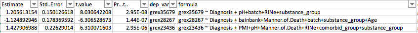
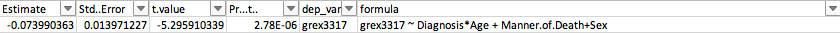

# 2020-03-14 05:31:40

Philip sent me guidelines for the project on Slack yesterday. Let's start
running it. I first removed the data matrix to an RDS file, and we'll go from
there.

The approach will be to run lm() within ACC and within caudate first, filtering
the covariates at p< .1, p<.05, and using stepAIC. That gives me 6 tabs of
results. Then, I'll do the same using lme() and the brain region as the random
term, for another 3 tabs. Then we can check for consistencies across result
tabs.

```r
myregion = 'ACC'
pthresh = .05
keep_str = 'Diagnosis*Age'

data = readRDS('~/data/rnaseq_derek/data_from_philip.rds')
data$substance_group = as.factor(data$substance_group)
data$batch = as.factor(data$batch)
# no column names as numbers!
grex_names = sapply(colnames(data)[34:ncol(data)],
                    function(x) sprintf('grex%s', x))
colnames(data)[34:ncol(data)] = grex_names
data = data[data$Region==myregion, ]

# dependent
dep_vars = colnames(data)[34:ncol(data)]
# keep these regardless of significance
keep_vars = c(keep_str)
# variables to be tested/screened
test_vars = c(# brain-related
              "bainbank", 'PMI', 'pH', 'Manner.of.Death',
              # technical
              'batch', 'RINe',
              #clinical
              'comorbid_group', 'substance_group',
              # others
              'Sex')
# spit out the results
out_fname = sprintf('~/tmp/res_%s_pLT%.02f_%s.csv', myregion, pthresh,
                    gsub(pattern='\\*',replacement='',x=keep_str))

hold = c()
for (dp in 1:length(dep_vars)) {
    if (dp %% 50 == 0) {
        print(sprintf('%d of %d (%s)', dp, length(dep_vars), out_fname))
    }

    dep_var = dep_vars[dp]
    fm_str = paste(dep_var, ' ~ ', paste(keep_vars, collapse='+'), ' + ',
                   paste(test_vars, collapse='+'), sep="")
    fit = lm(as.formula(fm_str), data=data)
    res = summary(fit)$coefficients
    # filtering variables
    sig_vars = c()
    for (v in 1:length(test_vars)) {
        # rows in results table that correspond to the screened variable
        var_rows = which(grepl(rownames(res),
                         pattern=sprintf('^%s', test_vars[v])))
        for (r in var_rows) {
            if (res[r, 'Pr(>|t|)'] < pthresh) {
                sig_vars = c(sig_vars, test_vars[v])
            }
        }
    }
    # factors might get added several times, so here we clean it up
    sig_vars = unique(sig_vars)
    if (length(sig_vars) > 0) {
        clean_fm_str = paste(dep_var, ' ~ ', paste(keep_vars, collapse='+'), ' + ',
                       paste(sig_vars, collapse='+'), sep="")
    } else {
        clean_fm_str = paste(dep_var, ' ~ ', paste(keep_vars, collapse='+'), sep="")
    }
    # new model
    clean_fit = lm(as.formula(clean_fm_str), data=data)
    res = data.frame(summary(clean_fit)$coefficients)
    # remove intercept
    res = res[2:nrow(res),]
    res$dep_var = dep_var
    res$formula = clean_fm_str
    res$orig_formula = fm_str
    res$predictor = rownames(res)
    hold = rbind(hold, res)
}
write.csv(hold, file=out_fname, row.names=F)
```

I did some tests running stepAIC but the funciton kept dying. Need to explore
that a bit further. For now, let's focus on the p-value exclusion first.

For the model that adds in region we'll end up with two measurements per
subject. So, we'll run lme():

```r
library(nlme)
pthresh = .05
keep_str = 'Diagnosis*Region'

data = readRDS('~/data/rnaseq_derek/data_from_philip.rds')
data$substance_group = as.factor(data$substance_group)
data$batch = as.factor(data$batch)
data$hbcc_brain_id = as.factor(data$hbcc_brain_id)

# no column names as numbers!
grex_names = sapply(colnames(data)[34:ncol(data)],
                    function(x) sprintf('grex%s', x))
colnames(data)[34:ncol(data)] = grex_names
# dependent
dep_vars = colnames(data)[34:ncol(data)]
# keep these regardless of significance
keep_vars = c(keep_str)
# variables to be tested/screened
test_vars = c(# brain-related
              "bainbank", 'PMI', 'pH', 'Manner.of.Death',
              # technical
              'batch', 'RINe',
              #clinical
              'comorbid_group', 'substance_group',
              # others
              'Sex', 'Age')
# spit out the results
out_fname = sprintf('~/tmp/res_pLT%.02f_%s.csv', pthresh,
                    gsub(pattern='\\*',replacement='',x=keep_str))

hold = c()
for (dp in 1:length(dep_vars)) {
    if (dp %% 50 == 0) {
        print(sprintf('%d of %d (%s)', dp, length(dep_vars), out_fname))
    }

    dep_var = dep_vars[dp]
    fm_str = paste(dep_var, ' ~ ', paste(keep_vars, collapse='+'), ' + ',
                   paste(test_vars, collapse='+'), sep="")
    fit = try(lme(as.formula(fm_str), ~1|hbcc_brain_id, data=data, na.action=na.omit))
    if (length(fit) > 1) {
        res = summary(fit)$tTable
        # filtering variables
        sig_vars = c()
        for (v in 1:length(test_vars)) {
            # rows in results table that correspond to the screened variable
            var_rows = which(grepl(rownames(res),
                            pattern=sprintf('^%s', test_vars[v])))
            for (r in var_rows) {
                if (res[r, 'p-value'] < pthresh) {
                    sig_vars = c(sig_vars, test_vars[v])
                }
            }
        }
        # factors might get added several times, so here we clean it up
        sig_vars = unique(sig_vars)
        if (length(sig_vars) > 0) {
            clean_fm_str = paste(dep_var, ' ~ ', paste(keep_vars, collapse='+'), ' + ',
                        paste(sig_vars, collapse='+'), sep="")
        } else {
            clean_fm_str = paste(dep_var, ' ~ ', paste(keep_vars, collapse='+'), sep="")
        }
        # new model
        clean_fit = try(lme(as.formula(clean_fm_str), ~1|hbcc_brain_id, data=data,
                        na.action=na.omit))
        if (length(clean_fit) > 1) {
            res = data.frame(summary(clean_fit)$tTable)
            # remove intercept
            res = res[2:nrow(res),]
            res$dep_var = dep_var
            res$formula = clean_fm_str
            res$orig_formula = fm_str
            res$predictor = rownames(res)
        } else {
            res = data.frame(summary(fit)$tTable)
            # remove intercept
            res = res[2:nrow(res),]
            res$dep_var = dep_var
            res$formula = NA
            res$orig_formula = fm_str
            res$predictor = rownames(res)
        }
        hold = rbind(hold, res)
    }
}
write.csv(hold, file=out_fname, row.names=F)
```

So, in the end I had to change from the original approach. Now, we have only p <
.05 and p<.1 to select the variables. I'll play with stepAIC later if necessary.
I then tried lme models if using both regions, but only lm if doing it within
region. I also played with Diagnosis or Diagnosis*Age for lm (keeping Age as
covariate candidate in the former), and Diagnosis*Region, Diagnosis*Age for lme,
but keeping Region as fixed covariate and Age as fitereable when appropriate.

I'm compiling them into 2 different Excel sheets, with different tabs
each.

Maybe it's easier to do the filtering in R:

```r
res = read.csv('res_ACC_pLT0.05_Diagnosis.csv')
res = res[res$predictor=='DiagnosisControl',]
p = res[, 'Pr...t..']
p2 = p.adjust(p, method='fdr')
print(sprintf('Tests p < .05: %d', sum(p<.05)))
print(sprintf('Tests p < .01: %d', sum(p<.01)))
print(sprintf('Tests q < .05: %d', sum(p2<.05)))
print(sprintf('Tests q < .1: %d', sum(p2<.1)))
```

```
> res = read.csv('res_ACC_pLT0.05_Diagnosis.csv')
[1] "Tests p < .05: 2215"
[1] "Tests p < .01: 581"
[1] "Tests q < .05: 2"
[1] "Tests q < .1: 2"
> res = read.csv('res_ACC_pLT0.10_Diagnosis.csv')
[1] "Tests p < .05: 2590"
[1] "Tests p < .01: 696"
[1] "Tests q < .05: 3"
[1] "Tests q < .1: 3"
> res = read.csv('res_Caudate_pLT0.05_Diagnosis.csv')
[1] "Tests p < .05: 2619"
[1] "Tests p < .01: 673"
[1] "Tests q < .05: 0"
[1] "Tests q < .1: 0"
> res = read.csv('res_Caudate_pLT0.10_Diagnosis.csv')
[1] "Tests p < .05: 2947"
[1] "Tests p < .01: 779"
[1] "Tests q < .05: 0"
[1] "Tests q < .1: 1"
```

Caudate had more nominally significant tests in general than ACC where the gene
expression differed by diagnosis. However, a few more in ACC were significant
using FDR. Looking at the Excel spreadsheet, they have to be the 3 lowest
p-values:



The top 2 are the same one in both p thresholds.

Also, filtering at the less conservative p<.1 seemed to show more results.

Maybe a different approach here would be to take some sort ofintersection list
of nominally significant genes across the different model we ran, and so sort of
gene set analysis?

But for now let's look at some of the other interactions:

```r
res0 = read.csv('res_ACC_pLT0.05_DiagnosisAge.csv')
res = res0[res0$predictor=='DiagnosisControl',]
p = res[, 'Pr...t..']
p2 = p.adjust(p, method='fdr')
print(sprintf('Tests with DX p < .05: %d', sum(p<.05)))
print(sprintf('Tests with DX p < .01: %d', sum(p<.01)))
print(sprintf('Tests with DX q < .05: %d', sum(p2<.05)))
print(sprintf('Tests with DX q < .1: %d', sum(p2<.1)))
p1 = p
res = res0[res0$predictor=='DiagnosisControl:Age',]
p = res[, 'Pr...t..']
p2 = p.adjust(p, method='fdr')
print(sprintf('Tests with Age:DX p < .05: %d', sum(p<.05)))
print(sprintf('Tests with Age:DX p < .01: %d', sum(p<.01)))
print(sprintf('Tests with Age:DX q < .05: %d', sum(p2<.05)))
print(sprintf('Tests with Age:DX q < .1: %d', sum(p2<.1)))
print(sprintf('Tests with both DX and Age:DX p < .05: %d', sum(p<.05 & p1<.05)))
print(sprintf('Tests with both DX and Age:DX p < .01: %d', sum(p<.01 & p1<.01)))
```

```
> res0 = read.csv('res_ACC_pLT0.05_DiagnosisAge.csv')
[1] "Tests with DX p < .05: 1867"
[1] "Tests with DX p < .01: 378"
[1] "Tests with DX q < .05: 0"
[1] "Tests with DX q < .1: 0"
[1] "Tests with Age:DX p < .05: 1861"
[1] "Tests with Age:DX p < .01: 353"
[1] "Tests with Age:DX q < .05: 0"
[1] "Tests with Age:DX q < .1: 0"
[1] "Tests with both DX and Age:DX p < .05: 1215"
[1] "Tests with both DX and Age:DX p < .01: 222"
> res0 = read.csv('res_ACC_pLT0.10_DiagnosisAge.csv')
[1] "Tests with DX p < .05: 2160"
[1] "Tests with DX p < .01: 451"
[1] "Tests with DX q < .05: 0"
[1] "Tests with DX q < .1: 0"
[1] "Tests with Age:DX p < .05: 2143"
[1] "Tests with Age:DX p < .01: 439"
[1] "Tests with Age:DX q < .05: 0"
[1] "Tests with Age:DX q < .1: 0"
[1] "Tests with both DX and Age:DX p < .05: 1393"
[1] "Tests with both DX and Age:DX p < .01: 261"
> res0 = read.csv('res_Caudate_pLT0.05_DiagnosisAge.csv')
[1] "Tests with DX p < .05: 2355"
[1] "Tests with DX p < .01: 498"
[1] "Tests with DX q < .05: 0"
[1] "Tests with DX q < .1: 0"
[1] "Tests with Age:DX p < .05: 2834"
[1] "Tests with Age:DX p < .01: 724"
[1] "Tests with Age:DX q < .05: 0"
[1] "Tests with Age:DX q < .1: 1"
[1] "Tests with both DX and Age:DX p < .05: 1833"
[1] "Tests with both DX and Age:DX p < .01: 381"
> res0 = read.csv('res_Caudate_pLT0.10_DiagnosisAge.csv')
[1] "Tests with DX p < .05: 2689"
[1] "Tests with DX p < .01: 611"
[1] "Tests with DX q < .05: 0"
[1] "Tests with DX q < .1: 0"
[1] "Tests with Age:DX p < .05: 3260"
[1] "Tests with Age:DX p < .01: 858"
[1] "Tests with Age:DX q < .05: 0"
[1] "Tests with Age:DX q < .1: 1"
[1] "Tests with both DX and Age:DX p < .05: 2099"
[1] "Tests with both DX and Age:DX p < .01: 465"
```

Like before, filtering covariates at p < .1 seemed to have more results than p <
.05. In general, there were more gene expression variables significant for
Age:DX than DX by itself. Again, the caudate seems to be a bit better in this
model, especially because this no FDR adjusted terms came out of the ACC
regressions. For reference, the single FDR result is:



The same in both p thresholds. 

Let's take a look at the LME models:

```r
res0 = read.csv('res_pLT0.05_DiagnosisRegion.csv')
res = res0[res0$predictor=='DiagnosisControl',]
p = res[, 'p.value']
p2 = p.adjust(p, method='fdr')
print(sprintf('Tests with DX p < .05: %d', sum(p<.05)))
print(sprintf('Tests with DX p < .01: %d', sum(p<.01)))
print(sprintf('Tests with DX q < .05: %d', sum(p2<.05)))
print(sprintf('Tests with DX q < .1: %d', sum(p2<.1)))
p1 = p
res = res0[res0$predictor=='DiagnosisControl:RegionCaudate',]
p = res[, 'p.value']
p2 = p.adjust(p, method='fdr')
print(sprintf('Tests with Region:DX p < .05: %d', sum(p<.05)))
print(sprintf('Tests with Region:DX p < .01: %d', sum(p<.01)))
print(sprintf('Tests with Region:DX q < .05: %d', sum(p2<.05)))
print(sprintf('Tests with Region:DX q < .1: %d', sum(p2<.1)))
print(sprintf('Tests with both DX and Region:DX p < .05: %d', sum(p<.05 & p1<.05)))
print(sprintf('Tests with both DX and Region:DX p < .01: %d', sum(p<.01 & p1<.01)))
```

```
> res0 = read.csv('res_pLT0.05_DiagnosisRegion.csv')
[1] "Tests with DX p < .05: 1681"
[1] "Tests with DX p < .01: 373"
[1] "Tests with DX q < .05: 0"
[1] "Tests with DX q < .1: 0"
[1] "Tests with Region:DX p < .05: 1396"
[1] "Tests with Region:DX p < .01: 269"
[1] "Tests with Region:DX q < .05: 0"
[1] "Tests with Region:DX q < .1: 0"
[1] "Tests with both DX and Region:DX p < .05: 290"
[1] "Tests with both DX and Region:DX p < .01: 36"
> res0 = read.csv('res_pLT0.10_DiagnosisRegion.csv')
[1] "Tests with DX p < .05: 1933"
[1] "Tests with DX p < .01: 481"
[1] "Tests with DX q < .05: 0"
[1] "Tests with DX q < .1: 0"
[1] "Tests with Region:DX p < .05: 1425"
[1] "Tests with Region:DX p < .01: 260"
[1] "Tests with Region:DX q < .05: 0"
[1] "Tests with Region:DX q < .1: 0"
[1] "Tests with both DX and Region:DX p < .05: 292"
[1] "Tests with both DX and Region:DX p < .01: 37"
```

Same patterns we were seeing before seem to hold here. Nothing for FDR though,
but I'm not too worried as we might have other methods to analyze this.

```r
res0 = read.csv('res_pLT0.05_Diagnosis.csv')
res = res0[res0$predictor=='DiagnosisControl',]
p = res[, 'p.value']
p2 = p.adjust(p, method='fdr')
print(sprintf('Tests with DX p < .05: %d', sum(p<.05)))
print(sprintf('Tests with DX p < .01: %d', sum(p<.01)))
print(sprintf('Tests with DX q < .05: %d', sum(p2<.05)))
print(sprintf('Tests with DX q < .1: %d', sum(p2<.1)))
```

```
> res0 = read.csv('res_pLT0.05_Diagnosis.csv')
[1] "Tests with DX p < .05: 2365"
[1] "Tests with DX p < .01: 595"
[1] "Tests with DX q < .05: 0"
[1] "Tests with DX q < .1: 0"
> res0 = read.csv('res_pLT0.10_Diagnosis.csv')
[1] "Tests with DX p < .05: 2719"
[1] "Tests with DX p < .01: 699"
[1] "Tests with DX q < .05: 0"
[1] "Tests with DX q < .1: 0"
```

Those results are for the model that holds Region fixed as an additive
covariate. I didn't report how many tests had that as significant because, as
expected, there were many of them. Same pattern for DX significant holds. Also,
good to remember here that there are always 35917 tests.

```r
res0 = read.csv('res_pLT0.05_DiagnosisAge.csv')
res = res0[res0$predictor=='DiagnosisControl',]
p = res[, 'p.value']
p2 = p.adjust(p, method='fdr')
print(sprintf('Tests with DX p < .05: %d', sum(p<.05)))
print(sprintf('Tests with DX p < .01: %d', sum(p<.01)))
print(sprintf('Tests with DX q < .05: %d', sum(p2<.05)))
print(sprintf('Tests with DX q < .1: %d', sum(p2<.1)))
p1 = p
res = res0[res0$predictor=='DiagnosisControl:Age',]
p = res[, 'p.value']
p2 = p.adjust(p, method='fdr')
print(sprintf('Tests with Age:DX p < .05: %d', sum(p<.05)))
print(sprintf('Tests with Age:DX p < .01: %d', sum(p<.01)))
print(sprintf('Tests with Age:DX q < .05: %d', sum(p2<.05)))
print(sprintf('Tests with Age:DX q < .1: %d', sum(p2<.1)))
print(sprintf('Tests with both DX and Age:DX p < .05: %d', sum(p<.05 & p1<.05)))
print(sprintf('Tests with both DX and Age:DX p < .01: %d', sum(p<.01 & p1<.01)))
```

```
> res0 = read.csv('res_pLT0.05_DiagnosisAge.csv')
[1] "Tests with DX p < .05: 1964"
[1] "Tests with DX p < .01: 350"
[1] "Tests with DX q < .05: 0"
[1] "Tests with DX q < .1: 0"
[1] "Tests with Age:DX p < .05: 2028"
[1] "Tests with Age:DX p < .01: 421"
[1] "Tests with Age:DX q < .05: 0"
[1] "Tests with Age:DX q < .1: 0"
[1] "Tests with both DX and Age:DX p < .05: 1311"
[1] "Tests with both DX and Age:DX p < .01: 229"
> res0 = read.csv('res_pLT0.10_DiagnosisAge.csv')
[1] "Tests with DX p < .05: 2082"
[1] "Tests with DX p < .01: 388"
[1] "Tests with DX q < .05: 0"
[1] "Tests with DX q < .1: 0"
[1] "Tests with Age:DX p < .05: 2180"
[1] "Tests with Age:DX p < .01: 453"
[1] "Tests with Age:DX q < .05: 0"
[1] "Tests with Age:DX q < .1: 0"
[1] "Tests with both DX and Age:DX p < .05: 1381"
[1] "Tests with both DX and Age:DX p < .01: 239"
```

Those results were also holding Region as a fixed additive covariate. Same usual
patterns we're seeing.

```r
res0 = read.csv('res_pLT0.05_DiagnosisAgeRegion.csv')
res = res0[res0$predictor=='DiagnosisControl',]
p = res[, 'p.value']
p2 = p.adjust(p, method='fdr')
print(sprintf('Tests with DX p < .05: %d', sum(p<.05)))
print(sprintf('Tests with DX p < .01: %d', sum(p<.01)))
print(sprintf('Tests with DX q < .05: %d', sum(p2<.05)))
print(sprintf('Tests with DX q < .1: %d', sum(p2<.1)))
p1 = p
res = res0[res0$predictor=='DiagnosisControl:Age',]
p = res[, 'p.value']
p2 = p.adjust(p, method='fdr')
print(sprintf('Tests with Age:DX p < .05: %d', sum(p<.05)))
print(sprintf('Tests with Age:DX p < .01: %d', sum(p<.01)))
print(sprintf('Tests with Age:DX q < .05: %d', sum(p2<.05)))
print(sprintf('Tests with Age:DX q < .1: %d', sum(p2<.1)))
p3 = p
res = res0[res0$predictor=='DiagnosisControl:RegionCaudate',]
p = res[, 'p.value']
p2 = p.adjust(p, method='fdr')
print(sprintf('Tests with Region:DX p < .05: %d', sum(p<.05)))
print(sprintf('Tests with Region:DX p < .01: %d', sum(p<.01)))
print(sprintf('Tests with Region:DX q < .05: %d', sum(p2<.05)))
print(sprintf('Tests with Region:DX q < .1: %d', sum(p2<.1)))
p4 = p
res = res0[res0$predictor=='DiagnosisControl:Age:RegionCaudate',]
p = res[, 'p.value']
p2 = p.adjust(p, method='fdr')
print(sprintf('Tests with Region:Age:DX p < .05: %d', sum(p<.05)))
print(sprintf('Tests with Region:Age:DX p < .01: %d', sum(p<.01)))
print(sprintf('Tests with Region:Age:DX q < .05: %d', sum(p2<.05)))
print(sprintf('Tests with Region:Age:DX q < .1: %d', sum(p2<.1)))
p5 = p
```

```
> res0 = read.csv('res_pLT0.05_DiagnosisAgeRegion.csv')
[1] "Tests with DX p < .05: 2130"
[1] "Tests with DX p < .01: 425"
[1] "Tests with DX q < .05: 1"
[1] "Tests with DX q < .1: 1"
[1] "Tests with Age:DX p < .05: 2068"
[1] "Tests with Age:DX p < .01: 408"
[1] "Tests with Age:DX q < .05: 1"
[1] "Tests with Age:DX q < .1: 1"
[1] "Tests with Region:DX p < .05: 2608"
[1] "Tests with Region:DX p < .01: 671"
[1] "Tests with Region:DX q < .05: 1"
[1] "Tests with Region:DX q < .1: 1"
[1] "Tests with Region:Age:DX p < .05: 2432"
[1] "Tests with Region:Age:DX p < .01: 566"
[1] "Tests with Region:Age:DX q < .05: 0"
[1] "Tests with Region:Age:DX q < .1: 0"
> res0 = read.csv('res_pLT0.10_DiagnosisAgeRegion.csv')
[1] "Tests with DX p < .05: 2167"
[1] "Tests with DX p < .01: 424"
[1] "Tests with DX q < .05: 1"
[1] "Tests with DX q < .1: 1"
[1] "Tests with Age:DX p < .05: 2131"
[1] "Tests with Age:DX p < .01: 431"
[1] "Tests with Age:DX q < .05: 0"
[1] "Tests with Age:DX q < .1: 0"
[1] "Tests with Region:DX p < .05: 2606"
[1] "Tests with Region:DX p < .01: 648"
[1] "Tests with Region:DX q < .05: 0"
[1] "Tests with Region:DX q < .1: 0"
[1] "Tests with Region:Age:DX p < .05: 2439"
[1] "Tests with Region:Age:DX p < .01: 561"
[1] "Tests with Region:Age:DX q < .05: 0"
[1] "Tests with Region:Age:DX q < .1: 0"
```

* play with adding the different covariate domains sequentially