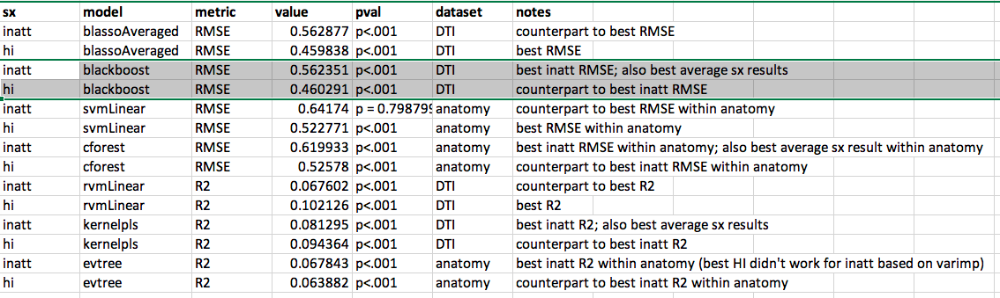

# 2020-03-17 20:53:35

Using the new files Philip has generated. He described the predictors:

```
It has 8 anatomic predictors (all residualized); lots of PRS (keep them all I
think); 5 cognitive (residualized and around 10% imputed); and 3 demographics
(SES_group3, population_self2 and sex_numeric).
```

```r
library(caret)
data = read.csv('~/Downloads/gf_impute_based_anatomy_272.csv')
# so they don't get rescaled
data$sex_numeric = as.factor(data$sex_numeric)
data$SES_group3 = as.factor(data$SES_group3)
var_names = colnames(data)[c(10:17, 18:29, 30:34, 4:6)]
phen = "slope_inatt_res_trim.x"
reg_model = 'elasticnet'

set.seed(42)
fitControl <- trainControl(method = "repeatedcv",
                           number = 10,
                           repeats = 10)

# if imputation is fair game before we split, so is scaling
scale_me = c()
for (v in var_names) {
    if (!is.factor(data[, v])) {
        scale_me = c(scale_me, v)
    } else {
        data[, v] = as.numeric(data[, v])
    }
}
data[, scale_me] = scale(data[, scale_me])

set.seed(42)
fit <- train(x=data[, var_names],
             y=data[, phen],
             method = reg_model,
             trControl = fitControl,
             tuneLength = 10)

line=sprintf("%s,%s,%f,%f", phen, reg_model,
             mean(fit$results$RMSE), sd(fit$results$RMSE))
print(line)
```

This seems to be working. Now, there are several things we can script out, so
let's create the script before we farm it out.

So, we'd do something like:

```bash
my_dir=~/data/baseline_prediction/prs_start
cd $my_dir
my_script=~/research_code/baseline_prediction/nonstacked_slope_dataImpute.R;
out_file=swarm.slope_impInter
rm $out_file
for clf in `cat all_reg.txt`; do
    for sx in inatt hi; do
        for fname in anatomy_272 dti_165; do 
            for fold in "10 10" "5 5" "3 10"; do
                echo "Rscript $my_script ${my_dir}/gf_impute_based_${fname}.csv $sx $clf $fold ~/tmp/residsFixed_slope_impInter.csv;" >> $out_file;
            done
        done;
    done;
done

swarm -g 10 -t 1 --job-name interFixedSlope --time 4:00:00 -f $out_file \
    -m R --partition quick --logdir trash
```

Now we check our best results:

```r
res = read.csv('~/data/baseline_prediction/prs_start/residsFixed_slope_impInter.csv', header=F)
colnames(res) = c('sx', 'model', 'fname', 'nfolds', 'nreps', 'meanRMSE', 'sdRMSE')
res[which.min(res$meanRMSE),]
```

And we can also look at R2:

```bash
my_dir=~/data/baseline_prediction/prs_start
cd $my_dir
my_script=~/research_code/baseline_prediction/nonstacked_slope_dataImpute_R2.R;
out_file=swarm.slope_impInterR2
rm $out_file
for clf in `cat all_reg.txt`; do
    for sx in inatt hi; do
        for fname in anatomy_272 dti_165; do 
            for fold in "10 10" "5 5" "3 10"; do
                echo "Rscript $my_script ${my_dir}/gf_impute_based_${fname}.csv $sx $clf $fold ~/tmp/residsR2_slope_impInter.csv;" >> $out_file;
            done
        done;
    done;
done

swarm -g 10 -t 1 --job-name interR2Slope --time 4:00:00 -f $out_file \
    -m R --partition quick --logdir trash
```

# 2020-03-19 07:22:57

```r
res = read.csv('~/data/baseline_prediction/prs_start/residsFixed_slope_impInter.csv', header=F)
colnames(res) = c('sx', 'model', 'fname', 'nfolds', 'nreps', 'meanRMSE', 'sdRMSE')
res[which.min(res$meanRMSE),]
```

Our best hi result is using the dti data: 

```
> res[which.min(res$meanRMSE),]
    sx          model
537 hi blassoAveraged
                                                                           fname
537 /home/sudregp/data/baseline_prediction/prs_start/gf_impute_based_dti_165.csv
    nfolds nreps meanRMSE sdRMSE
537     10    10 0.459838     NA
```

For inatt it's a different on, but still dti:

```
> res2[which.min(res2$meanRMSE),]
       sx      model
614 inatt blackboost
                                                                           fname
614 /home/sudregp/data/baseline_prediction/prs_start/gf_impute_based_dti_165.csv
    nfolds nreps meanRMSE sdRMSE
614     10    10 0.562351      0
```

Can we check combined, both for anat and DTI datasets?

```r
params = c()
scores = c()
res = read.csv('~/data/baseline_prediction/prs_start/residsFixed_slope_impInter.csv', header=F)
colnames(res) = c('sx', 'model', 'fname', 'nfolds', 'nreps', 'meanRMSE', 'sdRMSE')
for (reg in unique(res$model)) {
    for (nf in unique(res$nfolds)) {
        for (nr in unique(res$nreps)) {
            for (fn in unique(res$fname)) {
                idx = (res$model == reg &
                        res$fname == fn & res$nfolds == nf &
                        res$nreps == nr)
                pos = which(idx)
                if (length(pos) == 2) {
                    my_str = paste(c(reg, fn, nf, nr), collapse='_')
                    params = c(params, my_str)
                    scores = c(scores, mean(res[pos, 'meanRMSE']))
                }
            }
        }
    }
}
a = sort(scores, decreasing=F, index.return=T)
print(params[a$ix[1]])
```

So, for DTI blackboost did best:

```
> res[res$model=='blackboost' & res$nfolds==10 & res$nreps==10, c(1, 2, 4:6)]
       sx      model nfolds nreps meanRMSE
612 inatt blackboost     10    10 0.627078
613    hi blackboost     10    10 0.527887
614 inatt blackboost     10    10 0.562351
615    hi blackboost     10    10 0.460291
```

The top two are anat, but our best result is just dti. What's the best anat
result?

```r
params = c()
scores = c()
res = read.csv('~/data/baseline_prediction/prs_start/residsFixed_slope_impInter.csv', header=F)
colnames(res) = c('sx', 'model', 'fname', 'nfolds', 'nreps', 'meanRMSE', 'sdRMSE')
for (reg in unique(res$model)) {
    for (nf in unique(res$nfolds)) {
        for (nr in unique(res$nreps)) {
            idx = (res$model == reg & grepl(res$fname, pattern='anatomy') &
                   res$nfolds == nf & res$nreps == nr)
            pos = which(idx)
            if (length(pos) == 2) {
                my_str = paste(c(reg, nf, nr), collapse='_')
                params = c(params, my_str)
                scores = c(scores, mean(res[pos, 'meanRMSE']))
            }
        }
    }
}
a = sort(scores, decreasing=F, index.return=T)
print(params[a$ix[1]])
```

Then we're looking at conditional forest at 10x10:

```
> res[res$model=='cforest' & res$nfolds==10 & res$nreps==10, c(1:2, 4:7)]
       sx   model nfolds nreps meanRMSE   sdRMSE
414 inatt cforest     10    10 0.575755 0.006415
416    hi cforest     10    10 0.468978 0.003739
541 inatt cforest     10    10 0.619933 0.000505
545    hi cforest     10    10 0.525780 0.000603
```

Result is the bottom 2 again. How do they change if we lok at R2?

```r
params = c()
scores = c()
res = read.csv('~/data/baseline_prediction/prs_start/residsR2_slope_impInter.csv', header=F)
colnames(res) = c('sx', 'model', 'fname', 'nfolds', 'nreps', 'meanRsquared', 'sdRsquared')
for (reg in unique(res$model)) {
    for (nf in unique(res$nfolds)) {
        for (nr in unique(res$nreps)) {
            for (fn in unique(res$fname)) {
                idx = (res$model == reg &
                        res$fname == fn & res$nfolds == nf &
                        res$nreps == nr)
                pos = which(idx)
                if (length(pos) == 2) {
                    my_str = paste(c(reg, fn, nf, nr), collapse='_')
                    params = c(params, my_str)
                    scores = c(scores, mean(res[pos, 'meanRsquared']))
                }
            }
        }
    }
}
a = sort(scores, decreasing=T, index.return=T)
print(params[a$ix[1]])
```

So, for DTI kernelpls did best:

```
> res[res$model=='kernelpls' & res$nfolds==10 & res$nreps==10,][c(2,4),c(1,2,4:7)]
       sx     model nfolds nreps meanRsquared sdRsquared
312 inatt kernelpls     10    10     0.081295   0.012537
329    hi kernelpls     10    10     0.094364   0.011303
```

What's the best anat result?

```r
params = c()
scores = c()
res = read.csv('~/data/baseline_prediction/prs_start/residsR2_slope_impInter.csv', header=F)
colnames(res) = c('sx', 'model', 'fname', 'nfolds', 'nreps', 'meanRsquared', 'sdRsquared')
for (reg in unique(res$model)) {
    for (nf in unique(res$nfolds)) {
        for (nr in unique(res$nreps)) {
            idx = (res$model == reg & grepl(res$fname, pattern='anatomy') &
                   res$nfolds == nf & res$nreps == nr)
            pos = which(idx)
            if (length(pos) == 2) {
                my_str = paste(c(reg, nf, nr), collapse='_')
                params = c(params, my_str)
                scores = c(scores, mean(res[pos, 'meanRsquared']))
            }
        }
    }
}
a = sort(scores, decreasing=T, index.return=T)
print(params[a$ix[1]])
```

Then we're looking at bagEarth at 10x10:

```
> res[res$model=='bagEarth' & res$nfolds==10 & res$nreps==10, ][c(3,4),c(1,2,4:7)]
       sx    model nfolds nreps meanRsquared sdRsquared
571    hi bagEarth     10    10     0.093050   0.004943
573 inatt bagEarth     10    10     0.060669   0.011501
```

But how do all of these compare with a simple prediction of the mean? Can we
also check the feature weights?

```r
# DTI
> actual = data[, phen]
> preds = rep(mean(data[, phen]), nrow(data))
> postResample(actual, preds)
     RMSE  Rsquared       MAE 
0.4726172        NA 0.3122671 
```

We cannot really compute R2 that way as one vector is constant... but I wonder
how fair the RMSE metric actually is. Well, let's first get our variable
importance, and then we can evaluate this:

```
> source('~/research_code/baseline_prediction/nonstacked_slope_dataImpute_R2.R')
  only 20 most important variables shown (out of 40)

                                   Overall
PS_RAW_IR_165                       100.00
sex_numeric                          69.32
SS_RAW_IR_165                        50.62
OFCR_165                             49.91
CC_ad_R                              47.37
ADHD_PRS0.050000.origR               43.59
ilf_adR                              42.87
cerebellumR_165                      42.25
FSIQ_IR_165                          41.56
CC_rd_R                              40.01
cing_adR                             36.62
ADHD_PRS0.000100.origR               36.59
ADHD_PRS0.000050.origR               31.97
ilf_rdR                              31.26
DS_RAW_IR_165                        26.80
ADHD_PRS0.010000.origR               25.71
cingulateR_165                       25.53
slf_rdR                              24.12
EstimatedTotalIntraCranialVolR_165   22.72
lateral_PFCR_165                     22.65
[1] "inatt,kernelpls,~/Downloads/gf_impute_based_dti_165.csv,10,10,0.081295,0.012537"

> source('~/research_code/baseline_prediction/nonstacked_slope_dataImpute_R2.R')
  only 20 most important variables shown (out of 40)

                                   Overall
unc_adR                             100.00
striatumR_165                        95.38
amygdalaR_165                        87.43
VMI.beery_RAW_IR                     83.69
cingulateR_165                       79.42
slf_adR                              72.98
slf_rdR                              68.00
SES_group3_165                       55.47
ilf_adR                              44.27
ADHD_PRS0.050000.origR               44.16
OFCR_165                             41.28
ADHD_PRS0.000500.origR               40.54
cerebellumR_165                      38.57
EstimatedTotalIntraCranialVolR_165   38.20
ilf_rdR                              36.74
ADHD_PRS0.100000.origR               34.85
DS_RAW_IR_165                        34.81
ADHD_PRS0.000100.origR               33.01
ADHD_PRS0.500000.origR               29.77
thalamusR_165                        29.49
[1] "hi,kernelpls,~/Downloads/gf_impute_based_dti_165.csv,10,10,0.094364,0.011303"
```

Here's what we get if we just use the mean in predicting slopes:

```
> source('~/research_code/baseline_prediction/nonstacked_slope_dataImpute_dummy.R')
[1] "inatt,dummy,~/Downloads/gf_impute_based_dti_165.csv,10,10,0.014030,0.006823"
[1] "inatt,dummy,~/Downloads/gf_impute_based_dti_165.csv,10,10,0.575597,0.000470"
> source('~/research_code/baseline_prediction/nonstacked_slope_dataImpute_dummy.R')
[1] "hi,dummy,~/Downloads/gf_impute_based_dti_165.csv,10,10,0.021220,0.005598"
[1] "hi,dummy,~/Downloads/gf_impute_based_dti_165.csv,10,10,0.473793,0.000312"
> source('~/research_code/baseline_prediction/nonstacked_slope_dataImpute_dummy.R')
[1] "inatt,dummy,~/Downloads/gf_impute_based_anatomy_272.csv,10,10,0.016953,0.008076"
[1] "inatt,dummy,~/Downloads/gf_impute_based_anatomy_272.csv,10,10,0.641928,0.000595"
> source('~/research_code/baseline_prediction/nonstacked_slope_dataImpute_dummy.R')
[1] "hi,dummy,~/Downloads/gf_impute_based_anatomy_272.csv,10,10,0.009601,0.003542"
[1] "hi,dummy,~/Downloads/gf_impute_based_anatomy_272.csv,10,10,0.545485,0.000228"
```

# 2020-03-20 15:32:28

I created a distribution using multiple reps there, so now we can access
p-values for our results. But let's also check the best way of maximize the
results:

```r
res = read.csv('~/data/baseline_prediction/prs_start/residsFixed_slope_impInter.csv', header=F)
colnames(res) = c('sx', 'model', 'fname', 'nfolds', 'nreps', 'meanRMSE', 'sdRMSE')
res[which.min(res$meanRMSE),]
```

Our best RMSE result is for hi, using the dti data: 

```
> res[which.min(res$meanRMSE),]
    sx          model
537 hi blassoAveraged
                                                                           fname
537 /home/sudregp/data/baseline_prediction/prs_start/gf_impute_based_dti_165.csv
    nfolds nreps meanRMSE sdRMSE
537     10    10 0.459838     NA

                       Overall
striatumR_165           100.00
OFCR_165                 89.81
unc_adR                  86.02
amygdalaR_165            66.71
thalamusR_165            66.37
ADHD_PRS0.050000.origR   57.52
slf_rdR                  55.67
ilf_adR                  43.52
ADHD_PRS0.100000.origR   42.60
slf_adR                  35.79
cingulateR_165           34.90
ADHD_PRS0.200000.origR   34.64
CC_rd_R                  34.03
cing_rdR                 32.92
ADHD_PRS0.300000.origR   30.89
CST_rdR                  29.96
unc_rdR                  29.88
VMI.beery_RAW_IR         28.70
PS_RAW_IR_165            28.56
CC_ad_R                  27.51
[1] "hi,blassoAveraged,/home/sudregp/data/baseline_prediction/prs_start/gf_impute_based_dti_165.csv,10,10,0.459838,NA"
```

The inatt result for that model is:

```
       sx          model
533 inatt blassoAveraged
                                                                           fname
533 /home/sudregp/data/baseline_prediction/prs_start/gf_impute_based_dti_165.csv
    nfolds nreps meanRMSE sdRMSE
533     10    10 0.562877     NA

                       Overall
FSIQ_IR_165             100.00
PS_RAW_IR_165            71.41
cerebellumR_165          64.31
striatumR_165            61.78
unc_adR                  56.15
ADHD_PRS0.400000.origR   53.69
ADHD_PRS0.500000.origR   49.13
ADHD_PRS0.005000.origR   46.43
amygdalaR_165            46.16
OFCR_165                 44.94
lateral_PFCR_165         41.58
CC_ad_R                  41.45
slf_rdR                  41.05
ADHD_PRS0.010000.origR   39.29
cing_adR                 38.55
ilf_adR                  38.44
ADHD_PRS0.300000.origR   36.67
CC_rd_R                  35.80
unc_rdR                  33.27
SS_RAW_IR_165            32.81
[1] "inatt,blassoAveraged,/home/sudregp/data/baseline_prediction/prs_start/gf_impute_based_dti_165.csv,10,10,0.562877,NA"
```

If we restrict it to the best inatt results in DTI, we get:

```
614 inatt blackboost
                                                                           fname
614 /home/sudregp/data/baseline_prediction/prs_start/gf_impute_based_dti_165.csv
    nfolds nreps meanRMSE sdRMSE
614     10    10 0.562351      0

  only 20 most important variables shown (out of 40)

                       Overall
FSIQ_IR_165             100.00
PS_RAW_IR_165            71.41
cerebellumR_165          64.31
striatumR_165            61.78
unc_adR                  56.15
ADHD_PRS0.400000.origR   53.69
ADHD_PRS0.500000.origR   49.13
ADHD_PRS0.005000.origR   46.43
amygdalaR_165            46.16
OFCR_165                 44.94
lateral_PFCR_165         41.58
CC_ad_R                  41.45
slf_rdR                  41.05
ADHD_PRS0.010000.origR   39.29
cing_adR                 38.55
ilf_adR                  38.44
ADHD_PRS0.300000.origR   36.67
CC_rd_R                  35.80
unc_rdR                  33.27
SS_RAW_IR_165            32.81
[1] "inatt,blackboost,/home/sudregp/data/baseline_prediction/prs_start/gf_impute_based_dti_165.csv,10,10,0.562351,0.000000"
```

and the HI correspondent is:

```
    sx      model
615 hi blackboost
                                                                           fname
615 /home/sudregp/data/baseline_prediction/prs_start/gf_impute_based_dti_165.csv
    nfolds nreps meanRMSE sdRMSE
615     10    10 0.460291      0

  only 20 most important variables shown (out of 40)

                       Overall
striatumR_165           100.00
OFCR_165                 89.81
unc_adR                  86.02
amygdalaR_165            66.71
thalamusR_165            66.37
ADHD_PRS0.050000.origR   57.52
slf_rdR                  55.67
ilf_adR                  43.52
ADHD_PRS0.100000.origR   42.60
slf_adR                  35.79
cingulateR_165           34.90
ADHD_PRS0.200000.origR   34.64
CC_rd_R                  34.03
cing_rdR                 32.92
ADHD_PRS0.300000.origR   30.89
CST_rdR                  29.96
unc_rdR                  29.88
VMI.beery_RAW_IR         28.70
PS_RAW_IR_165            28.56
CC_ad_R                  27.51
[1] "hi,blackboost,/home/sudregp/data/baseline_prediction/prs_start/gf_impute_based_dti_165.csv,10,10,0.460291,0.000000"
```

Switching now to the anatomy data, which is always worse than the DTI results,
we check the best model:

```
    sx     model
513 hi svmLinear
                                                                               fname
513 /home/sudregp/data/baseline_prediction/prs_start/gf_impute_based_anatomy_272.csv
    nfolds nreps meanRMSE sdRMSE
513     10    10 0.522771     NA
                               Overall
OFCR                            100.00
amygdalaR                        93.35
striatumR                        91.60
ADHD_PRS0.000050.origR           74.13
VMI.beery_RAW_IR                 46.85
ADHD_PRS0.000100.origR           38.24
cingulateR                       34.17
thalamusR                        30.30
PS_RAW_IR                        30.14
DS_RAW_IR                        29.04
lateral_PFCR                     26.17
cerebellumR                      19.51
FSIQ_IR                          17.57
EstimatedTotalIntraCranialVolR   17.34
ADHD_PRS0.000500.origR           15.35
ADHD_PRS0.001000.origR           15.28
ADHD_PRS0.100000.origR           14.84
ADHD_PRS0.500000.origR           14.39
ADHD_PRS0.200000.origR           13.59
ADHD_PRS0.050000.origR           12.09
[1] "hi,svmLinear,/home/sudregp/data/baseline_prediction/prs_start/gf_impute_based_anatomy_272.csv,10,10,0.522771,NA"
```

That is for hi, and its counterpart in inatt is:

```
       sx     model
508 inatt svmLinear
                                                                               fname
508 /home/sudregp/data/baseline_prediction/prs_start/gf_impute_based_anatomy_272.csv
    nfolds nreps meanRMSE sdRMSE
508     10    10  0.64174     NA

FSIQ_IR                         100.00
striatumR                        50.63
amygdalaR                        50.43
PS_RAW_IR                        44.79
OFCR                             41.07
ADHD_PRS0.000100.origR           36.09
ADHD_PRS0.000050.origR           35.40
ADHD_PRS0.500000.origR           29.34
ADHD_PRS0.001000.origR           28.15
ADHD_PRS0.005000.origR           27.78
ADHD_PRS0.400000.origR           27.50
EstimatedTotalIntraCranialVolR   26.43
VMI.beery_RAW_IR                 23.84
thalamusR                        23.63
SS_RAW_IR                        23.04
lateral_PFCR                     21.53
ADHD_PRS0.300000.origR           19.91
cingulateR                       17.69
ADHD_PRS0.100000.origR           17.38
ADHD_PRS0.000500.origR           17.10
[1] "inatt,svmLinear,/home/sudregp/data/baseline_prediction/prs_start/gf_impute_based_anatomy_272.csv,10,10,0.641740,NA"
```

Conversely, the best inatt for is:

```
       sx   model
541 inatt cforest
                                                                               fname
541 /home/sudregp/data/baseline_prediction/prs_start/gf_impute_based_anatomy_272.csv
    nfolds nreps meanRMSE   sdRMSE
541     10    10 0.619933 0.000505

                       Overall
FSIQ_IR                100.000
sex_numeric             47.797
ADHD_PRS0.000100.origR  46.733
PS_RAW_IR               46.726
ADHD_PRS0.001000.origR  28.726
ADHD_PRS0.005000.origR  25.707
striatumR               20.324
ADHD_PRS0.400000.origR  18.904
thalamusR               18.021
DS_RAW_IR               15.366
ADHD_PRS0.200000.origR  15.126
ADHD_PRS0.300000.origR  14.252
VMI.beery_RAW_IR        14.008
ADHD_PRS0.500000.origR  10.230
lateral_PFCR             7.659
ADHD_PRS0.010000.origR   7.592
amygdalaR                7.002
SES_group3               6.229
ADHD_PRS0.050000.origR   5.844
ADHD_PRS0.000500.origR   5.699
[1] "inatt,cforest,/home/sudregp/data/baseline_prediction/prs_start/gf_impute_based_anatomy_272.csv,10,10,0.619933,0.000505"
```

and it's counterpart in hi is:

```
    sx   model
545 hi cforest
                                                                               fname
545 /home/sudregp/data/baseline_prediction/prs_start/gf_impute_based_anatomy_272.csv
    nfolds nreps meanRMSE   sdRMSE
545     10    10  0.52578 0.000603

                       Overall
striatumR               100.00
OFCR                     96.78
amygdalaR                93.80
VMI.beery_RAW_IR         72.56
ADHD_PRS0.000050.origR   38.74
SES_group3               33.22
FSIQ_IR                  32.10
ADHD_PRS0.100000.origR   25.31
ADHD_PRS0.400000.origR   25.18
lateral_PFCR             24.98
ADHD_PRS0.050000.origR   22.02
ADHD_PRS0.000100.origR   19.93
ADHD_PRS0.500000.origR   18.85
ADHD_PRS0.300000.origR   18.32
SS_RAW_IR                18.27
sex_numeric              17.91
ADHD_PRS0.001000.origR   17.51
DS_RAW_IR                16.92
ADHD_PRS0.200000.origR   16.57
cerebellumR              16.03
[1] "hi,cforest,/home/sudregp/data/baseline_prediction/prs_start/gf_impute_based_anatomy_272.csv,10,10,0.525780,0.000603"
```

Now, let's redo everything for R2. First, DTI dataset:

Best hi:

```
    sx     model
510 hi rvmLinear
                                                                           fname
510 /home/sudregp/data/baseline_prediction/prs_start/gf_impute_based_dti_165.csv
    nfolds nreps   meanR2 sdR2
510     10    10 0.102126   NA

                       Overall
striatumR_165           100.00
OFCR_165                 89.81
unc_adR                  86.02
amygdalaR_165            66.71
thalamusR_165            66.37
ADHD_PRS0.050000.origR   57.52
slf_rdR                  55.67
ilf_adR                  43.52
ADHD_PRS0.100000.origR   42.60
slf_adR                  35.79
cingulateR_165           34.90
ADHD_PRS0.200000.origR   34.64
CC_rd_R                  34.03
cing_rdR                 32.92
ADHD_PRS0.300000.origR   30.89
CST_rdR                  29.96
unc_rdR                  29.88
VMI.beery_RAW_IR         28.70
PS_RAW_IR_165            28.56
CC_ad_R                  27.51
[1] "hi,rvmLinear,/home/sudregp/data/baseline_prediction/prs_start/gf_impute_based_dti_165.csv,10,10,0.102126,NA"
```

Counterpart inatt:

```
                       Overall
FSIQ_IR_165             100.00
PS_RAW_IR_165            71.41
cerebellumR_165          64.31
striatumR_165            61.78
unc_adR                  56.15
ADHD_PRS0.400000.origR   53.69
ADHD_PRS0.500000.origR   49.13
ADHD_PRS0.005000.origR   46.43
amygdalaR_165            46.16
OFCR_165                 44.94
lateral_PFCR_165         41.58
CC_ad_R                  41.45
slf_rdR                  41.05
ADHD_PRS0.010000.origR   39.29
cing_adR                 38.55
ilf_adR                  38.44
ADHD_PRS0.300000.origR   36.67
CC_rd_R                  35.80
unc_rdR                  33.27
SS_RAW_IR_165            32.81
[1] "inatt,rvmLinear,/home/sudregp/data/baseline_prediction/prs_start/gf_impute_based_dti_165.csv,10,10,0.067602,NA"
```

Best inatt:

```
       sx     model
312 inatt kernelpls
                                                                           fname
312 /home/sudregp/data/baseline_prediction/prs_start/gf_impute_based_dti_165.csv
    nfolds nreps   meanR2     sdR2
312     10    10 0.081295 0.012537

                                   Overall
PS_RAW_IR_165                       100.00
sex_numeric                          69.32
SS_RAW_IR_165                        50.62
OFCR_165                             49.91
CC_ad_R                              47.37
ADHD_PRS0.050000.origR               43.59
ilf_adR                              42.87
cerebellumR_165                      42.25
FSIQ_IR_165                          41.56
CC_rd_R                              40.01
cing_adR                             36.62
ADHD_PRS0.000100.origR               36.59
ADHD_PRS0.000050.origR               31.97
ilf_rdR                              31.26
DS_RAW_IR_165                        26.80
ADHD_PRS0.010000.origR               25.71
cingulateR_165                       25.53
slf_rdR                              24.12
EstimatedTotalIntraCranialVolR_165   22.72
lateral_PFCR_165                     22.65
[1] "inatt,kernelpls,~/Downloads/gf_impute_based_dti_165.csv,10,10,0.081295,0.012537"
```

Counterpart hi:

```
    sx     model
329 hi kernelpls
                                                                           fname
329 /home/sudregp/data/baseline_prediction/prs_start/gf_impute_based_dti_165.csv
    nfolds nreps   meanR2     sdR2
329     10    10 0.094364 0.011303

                                   Overall
unc_adR                             100.00
striatumR_165                        95.38
amygdalaR_165                        87.43
VMI.beery_RAW_IR                     83.69
cingulateR_165                       79.42
slf_adR                              72.98
slf_rdR                              68.00
SES_group3_165                       55.47
ilf_adR                              44.27
ADHD_PRS0.050000.origR               44.16
OFCR_165                             41.28
ADHD_PRS0.000500.origR               40.54
cerebellumR_165                      38.57
EstimatedTotalIntraCranialVolR_165   38.20
ilf_rdR                              36.74
ADHD_PRS0.100000.origR               34.85
DS_RAW_IR_165                        34.81
ADHD_PRS0.000100.origR               33.01
ADHD_PRS0.500000.origR               29.77
thalamusR_165                        29.49
[1] "hi,kernelpls,~/Downloads/gf_impute_based_dti_165.csv,10,10,0.094364,0.011303"
```

Then, anatomy dataset:

Best hi:

```
    sx    model
571 hi bagEarth
                                                                               fname
571 /home/sudregp/data/baseline_prediction/prs_start/gf_impute_based_anatomy_272.csv
    nfolds nreps  meanR2     sdR2
571     10    10 0.09305 0.004943

  only 20 most important variables shown (out of 28)

                               Overall
OFCR                           100.000
striatumR                       84.676
ADHD_PRS0.000100.origR          74.440
VMI.beery_RAW_IR                62.347
cingulateR                      51.312
DS_RAW_IR                       38.942
ADHD_PRS0.100000.origR          25.506
ADHD_PRS0.400000.origR          14.003
lateral_PFCR                     8.521
thalamusR                        2.293
ADHD_PRS0.050000.origR           0.000
ADHD_PRS0.001000.origR           0.000
PS_RAW_IR                        0.000
ADHD_PRS0.010000.origR           0.000
ADHD_PRS0.200000.origR           0.000
EstimatedTotalIntraCranialVolR   0.000
amygdalaR                        0.000
ADHD_PRS0.005000.origR           0.000
cerebellumR                      0.000
sex_numeric                      0.000
[1] "hi,bagEarth,/home/sudregp/data/baseline_prediction/prs_start/gf_impute_based_anatomy_272.csv,10,10,0.093050,0.004943"
```

Counterpart inatt:

```
573 inatt bagEarth
                                                                               fname
573 /home/sudregp/data/baseline_prediction/prs_start/gf_impute_based_anatomy_272.csv
    nfolds nreps   meanR2     sdR2
573     10    10 0.060669 0.011501
  only 20 most important variables shown (out of 28)

                               Overall
VMI.beery_RAW_IR                   100
ADHD_PRS0.000100.origR               0
population_self2                     0
ADHD_PRS0.300000.origR               0
striatumR                            0
SS_RAW_IR                            0
SES_group3                           0
ADHD_PRS0.000500.origR               0
thalamusR                            0
ADHD_PRS0.100000.origR               0
OFCR                                 0
cingulateR                           0
EstimatedTotalIntraCranialVolR       0
lateral_PFCR                         0
ADHD_PRS0.050000.origR               0
PS_RAW_IR                            0
ADHD_PRS0.000050.origR               0
ADHD_PRS0.400000.origR               0
FSIQ_IR                              0
ADHD_PRS0.500000.origR               0
[1] "inatt,bagEarth,/home/sudregp/data/baseline_prediction/prs_start/gf_impute_based_anatomy_272.csv,10,10,0.060669,0.011501"
```

Best inatt:

```
       sx  model
572 inatt evtree
                                                                               fname
572 /home/sudregp/data/baseline_prediction/prs_start/gf_impute_based_anatomy_272.csv
    nfolds nreps   meanR2     sdR2
572     10    10 0.067843 0.000728

                               Overall
FSIQ_IR                         100.00
striatumR                        50.63
amygdalaR                        50.43
PS_RAW_IR                        44.79
OFCR                             41.07
ADHD_PRS0.000100.origR           36.09
ADHD_PRS0.000050.origR           35.40
ADHD_PRS0.500000.origR           29.34
ADHD_PRS0.001000.origR           28.15
ADHD_PRS0.005000.origR           27.78
ADHD_PRS0.400000.origR           27.50
EstimatedTotalIntraCranialVolR   26.43
VMI.beery_RAW_IR                 23.84
thalamusR                        23.63
SS_RAW_IR                        23.04
lateral_PFCR                     21.53
ADHD_PRS0.300000.origR           19.91
cingulateR                       17.69
ADHD_PRS0.100000.origR           17.38
ADHD_PRS0.000500.origR           17.10
[1] "inatt,evtree,/home/sudregp/data/baseline_prediction/prs_start/gf_impute_based_anatomy_272.csv,10,10,0.067843,0.000728"
```

Counterpart hi:

```
575 hi evtree
                                                                               fname
575 /home/sudregp/data/baseline_prediction/prs_start/gf_impute_based_anatomy_272.csv
    nfolds nreps   meanR2     sdR2
575     10    10 0.063882 0.000685

                               Overall
OFCR                            100.00
amygdalaR                        93.35
striatumR                        91.60
ADHD_PRS0.000050.origR           74.13
VMI.beery_RAW_IR                 46.85
ADHD_PRS0.000100.origR           38.24
cingulateR                       34.17
thalamusR                        30.30
PS_RAW_IR                        30.14
DS_RAW_IR                        29.04
lateral_PFCR                     26.17
cerebellumR                      19.51
FSIQ_IR                          17.57
EstimatedTotalIntraCranialVolR   17.34
ADHD_PRS0.000500.origR           15.35
ADHD_PRS0.001000.origR           15.28
ADHD_PRS0.100000.origR           14.84
ADHD_PRS0.500000.origR           14.39
ADHD_PRS0.200000.origR           13.59
ADHD_PRS0.050000.origR           12.09
[1] "hi,evtree,/home/sudregp/data/baseline_prediction/prs_start/gf_impute_based_anatomy_272.csv,10,10,0.063882,0.000685"
```

Not much preference here... best to visualize it in Excel. I'll also add
p-values there.



I used 1000 perms there (well, 999), but the null distributions are quite tight, so
it makes sense that the results are quite significant.


I think it makes sense to go with the blackboost results in the DTI set. They're
quite significant and the variable distribution looks interesting.

If maximizing R2, then the kernelpls results would be the ones to use. The R2 is
not too impressive though. 

If the goal is to maximize subject instead, and go with the anatomical dataset,
we could only use the conditional forest results because svmLinear isnot
significant for inatt. And the R2 results, although significant, are quite
pathetic.

I just left it computing the R2 for the blackboost models, just so we can report
those as well if needed.

# 2020-03-21 07:51:58

Philip asked for more info on these models. First, what are the results for
blackboost in the anatomy set? 

```
> res[res$model=='blackboost' & res$nfolds==10, c(1:2, 4:6)]
       sx      model nfolds nreps meanRMSE
612 inatt blackboost     10    10 0.627078
613    hi blackboost     10    10 0.527887
614 inatt blackboost     10    10 0.562351
615    hi blackboost     10    10 0.460291
```

The top two are from the anatomy dataset. Can we select a result that works best
across datasets as well?

```r
params = c()
scores = c()
res = read.csv('~/data/baseline_prediction/prs_start/residsFixed_slope_impInter.csv', header=F)
colnames(res) = c('sx', 'model', 'fname', 'nfolds', 'nreps', 'meanRMSE', 'sdRMSE')
for (reg in unique(res$model)) {
    for (nf in unique(res$nfolds)) {
        for (nr in unique(res$nreps)) {
            idx = (res$model == reg &
                    res$nfolds == nf &
                    res$nreps == nr)
            pos = which(idx)
            if (length(pos) == 4) {
                my_str = paste(c(reg, nf, nr), collapse='_')
                params = c(params, my_str)
                scores = c(scores, mean(res[pos, 'meanRMSE']))
            }
        }
    }
}
a = sort(scores, decreasing=F, index.return=T)
print(params[a$ix[1]])
```

Here we get blassoAveraged_10_10:

```
       sx          model nfolds nreps meanRMSE
432 inatt blassoAveraged     10    10 0.623292
431    hi blassoAveraged     10    10 0.527534
533 inatt blassoAveraged     10    10 0.562877
537    hi blassoAveraged     10    10 0.459838
```

Again, top two are for anatomy. Like before, not that much difference between
using blassoAveraged and blackboost. Maybe their variable importance will be
different?

If we do the same thing for R2, we get:

```r
params = c()
scores = c()
res = read.csv('~/data/baseline_prediction/prs_start/residsR2_slope_impInter.csv', header=F)
colnames(res) = c('sx', 'model', 'fname', 'nfolds', 'nreps', 'meanRsquared', 'sdRsquared')
for (reg in unique(res$model)) {
    for (nf in unique(res$nfolds)) {
        for (nr in unique(res$nreps)) {
            for (fn in unique(res$fname)) {
                idx = (res$model == reg &
                        res$nfolds == nf &
                        res$nreps == nr)
                pos = which(idx)
                if (length(pos) == 4) {
                    my_str = paste(c(reg, nf, nr), collapse='_')
                    params = c(params, my_str)
                    scores = c(scores, mean(res[pos, 'meanRsquared']))
                }
            }
        }
    }
}
a = sort(scores, decreasing=T, index.return=T)
print(params[a$ix[1]])
```

kernelpls does the best across datasets as well:

```
       sx     model nfolds nreps meanRsquared
316 inatt kernelpls     10    10     0.046883
310    hi kernelpls     10    10     0.074217
312 inatt kernelpls     10    10     0.081295
329    hi kernelpls     10    10     0.094364
```

Top two are anatomy, as usual. But they're not great, so maybe keep selecting
based on RMSE?

Let's look at the updated Excel sheet and the variable importances there:


These are the variable importances for blassoAveraged, both datasets, both sx:

```
                       Overall
FSIQ_IR_165             100.00
PS_RAW_IR_165            71.41
cerebellumR_165          64.31
striatumR_165            61.78
unc_adR                  56.15
ADHD_PRS0.400000.origR   53.69
ADHD_PRS0.500000.origR   49.13
ADHD_PRS0.005000.origR   46.43
amygdalaR_165            46.16
OFCR_165                 44.94
lateral_PFCR_165         41.58
CC_ad_R                  41.45
slf_rdR                  41.05
ADHD_PRS0.010000.origR   39.29
cing_adR                 38.55
ilf_adR                  38.44
ADHD_PRS0.300000.origR   36.67
CC_rd_R                  35.80
unc_rdR                  33.27
SS_RAW_IR_165            32.81
Bayesian Ridge Regression (Model Averaged) 

  RMSE       Rsquared    MAE      
  0.5628775  0.06616144  0.4299283

[1] "inatt,blassoAveraged,/home/sudregp/data/baseline_prediction/prs_start/gf_impute_based_dti_165.csv,10,10,0.562877,NA"


                       Overall
striatumR_165           100.00
OFCR_165                 89.81
unc_adR                  86.02
amygdalaR_165            66.71
thalamusR_165            66.37
ADHD_PRS0.050000.origR   57.52
slf_rdR                  55.67
ilf_adR                  43.52
ADHD_PRS0.100000.origR   42.60
slf_adR                  35.79
cingulateR_165           34.90
ADHD_PRS0.200000.origR   34.64
CC_rd_R                  34.03
cing_rdR                 32.92
ADHD_PRS0.300000.origR   30.89
CST_rdR                  29.96
unc_rdR                  29.88
VMI.beery_RAW_IR         28.70
PS_RAW_IR_165            28.56
CC_ad_R                  27.51
Bayesian Ridge Regression (Model Averaged) 

  RMSE       Rsquared   MAE      
  0.4598384  0.0833015  0.3103396

[1] "hi,blassoAveraged,/home/sudregp/data/baseline_prediction/prs_start/gf_impute_based_dti_165.csv,10,10,0.459838,NA"


FSIQ_IR                         100.00
striatumR                        50.63
amygdalaR                        50.43
PS_RAW_IR                        44.79
OFCR                             41.07
ADHD_PRS0.000100.origR           36.09
ADHD_PRS0.000050.origR           35.40
ADHD_PRS0.500000.origR           29.34
ADHD_PRS0.001000.origR           28.15
ADHD_PRS0.005000.origR           27.78
ADHD_PRS0.400000.origR           27.50
EstimatedTotalIntraCranialVolR   26.43
VMI.beery_RAW_IR                 23.84
thalamusR                        23.63
SS_RAW_IR                        23.04
lateral_PFCR                     21.53
ADHD_PRS0.300000.origR           19.91
cingulateR                       17.69
ADHD_PRS0.100000.origR           17.38
ADHD_PRS0.000500.origR           17.10
Bayesian Ridge Regression (Model Averaged) 

  RMSE      Rsquared    MAE      
  0.623292  0.05071923  0.4542848

[1] "inatt,blassoAveraged,/home/sudregp/data/baseline_prediction/prs_start/gf_impute_based_anatomy_272.csv,10,10,0.623292,NA"


OFCR                            100.00
amygdalaR                        93.35
striatumR                        91.60
ADHD_PRS0.000050.origR           74.13
VMI.beery_RAW_IR                 46.85
ADHD_PRS0.000100.origR           38.24
cingulateR                       34.17
thalamusR                        30.30
PS_RAW_IR                        30.14
DS_RAW_IR                        29.04
lateral_PFCR                     26.17
cerebellumR                      19.51
FSIQ_IR                          17.57
EstimatedTotalIntraCranialVolR   17.34
ADHD_PRS0.000500.origR           15.35
ADHD_PRS0.001000.origR           15.28
ADHD_PRS0.100000.origR           14.84
ADHD_PRS0.500000.origR           14.39
ADHD_PRS0.200000.origR           13.59
ADHD_PRS0.050000.origR           12.09
Bayesian Ridge Regression (Model Averaged) 

  RMSE       Rsquared    MAE     
  0.5275338  0.05700907  0.326785

[1] "hi,blassoAveraged,/home/sudregp/data/baseline_prediction/prs_start/gf_impute_based_anatomy_272.csv,10,10,0.527534,NA"
```

For comparison, these are the variable importances for blackboost, both
datasets, both sx. They are both equally good models when selecting using RMSE:

```
                       Overall
FSIQ_IR_165             100.00
PS_RAW_IR_165            71.41
cerebellumR_165          64.31
striatumR_165            61.78
unc_adR                  56.15
ADHD_PRS0.400000.origR   53.69
ADHD_PRS0.500000.origR   49.13
ADHD_PRS0.005000.origR   46.43
amygdalaR_165            46.16
OFCR_165                 44.94
lateral_PFCR_165         41.58
CC_ad_R                  41.45
slf_rdR                  41.05
ADHD_PRS0.010000.origR   39.29
cing_adR                 38.55
ilf_adR                  38.44
ADHD_PRS0.300000.origR   36.67
CC_rd_R                  35.80
unc_rdR                  33.27
SS_RAW_IR_165            32.81
[1] "inatt,blackboost,/home/sudregp/data/baseline_prediction/prs_start/gf_impute_based_dti_165.csv,10,10,0.562351,0.000000"

                       Overall
striatumR_165           100.00
OFCR_165                 89.81
unc_adR                  86.02
amygdalaR_165            66.71
thalamusR_165            66.37
ADHD_PRS0.050000.origR   57.52
slf_rdR                  55.67
ilf_adR                  43.52
ADHD_PRS0.100000.origR   42.60
slf_adR                  35.79
cingulateR_165           34.90
ADHD_PRS0.200000.origR   34.64
CC_rd_R                  34.03
cing_rdR                 32.92
ADHD_PRS0.300000.origR   30.89
CST_rdR                  29.96
unc_rdR                  29.88
VMI.beery_RAW_IR         28.70
PS_RAW_IR_165            28.56
CC_ad_R                  27.51
[1] "hi,blackboost,/home/sudregp/data/baseline_prediction/prs_start/gf_impute_based_dti_165.csv,10,10,0.460291,0.000000"

FSIQ_IR                         100.00
striatumR                        50.63
amygdalaR                        50.43
PS_RAW_IR                        44.79
OFCR                             41.07
ADHD_PRS0.000100.origR           36.09
ADHD_PRS0.000050.origR           35.40
ADHD_PRS0.500000.origR           29.34
ADHD_PRS0.001000.origR           28.15
ADHD_PRS0.005000.origR           27.78
ADHD_PRS0.400000.origR           27.50
EstimatedTotalIntraCranialVolR   26.43
VMI.beery_RAW_IR                 23.84
thalamusR                        23.63
SS_RAW_IR                        23.04
lateral_PFCR                     21.53
ADHD_PRS0.300000.origR           19.91
cingulateR                       17.69
ADHD_PRS0.100000.origR           17.38
ADHD_PRS0.000500.origR           17.10
[1] "inatt,blackboost,/home/sudregp/data/baseline_prediction/prs_start/gf_impute_based_anatomy_272.csv,10,10,0.627078,0.000000"

                               Overall
OFCR                            100.00
amygdalaR                        93.35
striatumR                        91.60
ADHD_PRS0.000050.origR           74.13
VMI.beery_RAW_IR                 46.85
ADHD_PRS0.000100.origR           38.24
cingulateR                       34.17
thalamusR                        30.30
PS_RAW_IR                        30.14
DS_RAW_IR                        29.04
lateral_PFCR                     26.17
cerebellumR                      19.51
FSIQ_IR                          17.57
EstimatedTotalIntraCranialVolR   17.34
ADHD_PRS0.000500.origR           15.35
ADHD_PRS0.001000.origR           15.28
ADHD_PRS0.100000.origR           14.84
ADHD_PRS0.500000.origR           14.39
ADHD_PRS0.200000.origR           13.59
ADHD_PRS0.050000.origR           12.09
[1] "hi,blackboost,/home/sudregp/data/baseline_prediction/prs_start/gf_impute_based_anatomy_272.csv,10,10,0.527887,0.000000"
```

These are the variable importances for kernelpls, both datasets, both sx. This
was the best model when selecting on R2:

```
striatumR               100.00
amygdalaR                99.19
SS_RAW_IR_165                        50.62
OFCR_165                             49.91
CC_ad_R                              47.37
ADHD_PRS0.050000.origR               43.59
ilf_adR                              42.87
cerebellumR_165                      42.25
FSIQ_IR_165                          41.56
CC_rd_R                              40.01
cing_adR                             36.62
ADHD_PRS0.000100.origR               36.59
ADHD_PRS0.000050.origR               31.97
ilf_rdR                              31.26
DS_RAW_IR_165                        26.80
ADHD_PRS0.010000.origR               25.71
cingulateR_165                       25.53
slf_rdR                              24.12
EstimatedTotalIntraCranialVolR_165   22.72
lateral_PFCR_165                     22.65
[1] "inatt,kernelpls,/home/sudregp/data/baseline_prediction/prs_start/gf_impute_based_dti_165.csv,10,10,0.081295,0.012537"

striatumR               100.00
amygdalaR                99.19
amygdalaR_165                        87.43
VMI.beery_RAW_IR                     83.69
cingulateR_165                       79.42
slf_adR                              72.98
slf_rdR                              68.00
SES_group3_165                       55.47
ilf_adR                              44.27
ADHD_PRS0.050000.origR               44.16
OFCR_165                             41.28
ADHD_PRS0.000500.origR               40.54
cerebellumR_165                      38.57
EstimatedTotalIntraCranialVolR_165   38.20
ilf_rdR                              36.74
ADHD_PRS0.100000.origR               34.85
DS_RAW_IR_165                        34.81
ADHD_PRS0.000100.origR               33.01
ADHD_PRS0.500000.origR               29.77
thalamusR_165                        29.49
"hi,kernelpls,/home/sudregp/data/baseline_prediction/prs_start/gf_impute_based_dti_165.csv,10,10,0.094364,0.011303"

striatumR               100.00
amygdalaR                99.19
FSIQ_IR                          83.67
SS_RAW_IR                        77.43
PS_RAW_IR                        69.79
striatumR                        61.05
ADHD_PRS0.000100.origR           52.23
cerebellumR                      51.80
DS_RAW_IR                        48.91
ADHD_PRS0.000050.origR           45.28
OFCR                             44.21
cingulateR                       42.08
VMI.beery_RAW_IR                 41.92
EstimatedTotalIntraCranialVolR   41.20
ADHD_PRS0.400000.origR           40.66
ADHD_PRS0.005000.origR           39.54
ADHD_PRS0.001000.origR           37.23
ADHD_PRS0.300000.origR           36.29
SES_group3                       34.63
thalamusR                        31.70
"inatt,kernelpls,/home/sudregp/data/baseline_prediction/prs_start/gf_impute_based_anatomy_272.csv,10,10,0.046883,0.003794"

striatumR               100.00
amygdalaR                99.19
OFCR                     94.19
VMI.beery_RAW_IR         74.23
ADHD_PRS0.000050.origR   67.05
SES_group3               61.50
lateral_PFCR             48.15
cingulateR               40.98
FSIQ_IR                  36.85
SS_RAW_IR                31.16
ADHD_PRS0.000500.origR   28.87
ADHD_PRS0.010000.origR   22.05
ADHD_PRS0.200000.origR   20.17
ADHD_PRS0.300000.origR   19.48
ADHD_PRS0.400000.origR   18.69
ADHD_PRS0.005000.origR   18.00
ADHD_PRS0.500000.origR   17.52
ADHD_PRS0.100000.origR   16.95
ADHD_PRS0.050000.origR   15.37
thalamusR                15.29
[1] "hi,kernelpls,/home/sudregp/data/baseline_prediction/prs_start/gf_impute_based_anatomy_272.csv,10,10,0.074217,0.011465"
```
