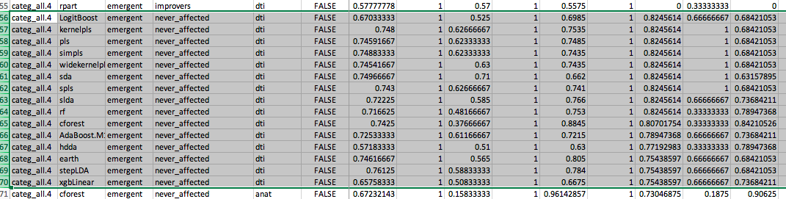

# 2020-03-27 20:08:30

We are back to predicting classes. I'll run it through here because it's easier
to do feature engineering if needed. I'll script it out if I eventully need to
test multiple classifiers.

Most of Philip's directions came from a Slack DM on 03/27 around 5:50PM.

For groups, categ_inatt3 and categ_hi3; and the less important one is
categ_inatt2. The three groups are never affected, improvers or stable. So, it
should be easy-ish for the models to distinguish the never affected.
Classification between the other two groups might be too tough...

I think it's still worth trying the pairwise group predictions, eventually!

For the categ_inatt2- it's 4 groups (never affected, improvers, stable- but also
a large emergent/worsening group). I suspect that 4 group classification
might be pushing things too hard given the sample size, so maybe just focus on
the categ_inatt3 and the categ_hi3?

```r
fname = '~/data/baseline_prediction/prs_start/gf_philip_03272020.csv'
phen = 'categ_inatt3'

nfolds = 10
nreps = 10

data = read.csv(fname)
data$sex_numeric = as.factor(data$sex_numeric)
data$SES_group3 = as.factor(data$SES_group3)
data$population_self3 = as.factor(data$population_self3)
var_names = c(# PRS
              'ADHD_PRS0.000100.orig', 'ADHD_PRS0.001000.orig',
              'ADHD_PRS0.010000.orig', 'ADHD_PRS0.050000.orig',
              'ADHD_PRS0.100000.orig', 'ADHD_PRS0.200000.orig',
              'ADHD_PRS0.300000.orig', 'ADHD_PRS0.400000.orig',
              'ADHD_PRS0.500000.orig',
              # DTI
              'atr_fa', 'cst_fa', 'cing_cing_fa', 'cing_hipp_fa', 'cc_fa',
              'ilf_fa', 'slf_all', 'unc_fa',
              # demo
              'sex_numeric', 'SES_group3', 'population_self3',
              # cog
              'FSIQ', 'SS_RAW', 'DS_RAW', 'PS_RAW', 'VMI.beery_RAW',
              # anat
              'cerebellum_white', 'cerebellum_grey', 'amygdala',
              'cingulate', 'EstimatedTotalIntraCranialVol', 'lateral_PFC',
              'OFC', 'striatum', 'thalamus'
              )

covar_names = c(# DTI
                'norm.rot', 'norm.trans', # base_age, gender,
                # cog
                # base_age, gender
                # anat
                'average_qc', # age, gender (but not ICV)
                # PRS
                sapply(1:10, function(x) sprintf('PC%02d', x)) # age, gender
                # demo
                # just base_age (as gender one was of the targets)
                )

library(caret)
# I won't touch the predictors at first because the models that handle missing data don't care about that... I'll only dummify the factors
data2 = data[, c(var_names, covar_names)]
data2$phen = as.factor(data[, phen])
dummies = dummyVars(phen ~ ., data = data2)
data3 = predict(dummies, newdata = data2)

# split traing and test between members of the same family
train_rows = c()
for (fam in unique(data$FAMID)) {
    fam_rows = which(data$FAMID == fam)
    if (length(fam_rows) == 1) {
        train_rows = c(train_rows, fam_rows[1])
    } else {
        # choose the youngest kid in the family for training
        train_rows = c(train_rows,
                       fam_rows[which.min(data[fam_rows, 'base_age'])])
    }
}
# data3 doesn't have the target column!
X_train <- data3[train_rows, ]
X_test <- data3[-train_rows, ]
y_train <- data2[train_rows,]$phen
y_test <- data2[-train_rows,]$phen
```

```r
library(caretEnsemble)
library(doParallel)
registerDoParallel(31)
getDoParWorkers()
set.seed(42)
fitControl <- trainControl(method = "repeatedcv",
                           number = nfolds,
                           repeats = nreps,
                           savePredictions = 'final',
                           allowParallel = TRUE,
                           classProbs = TRUE,
                           summaryFunction=multiClassSummary)

model_list <- caretList(X_train,
                        y_train,
                        trControl = fitControl,
                        methodList = c('C5.0', 'rpart1SE', 'rpart2',
                                       'C5.0Tree', 'C5.0Rules',
                                       'AdaBoost.M1', 'AdaBag',
                                       'treebag', 'ada',
                                       'null'),
                        tuneList = NULL,
                        continue_on_fail = TRUE,
                        metric='AUC')

options(digits = 3)
train_results = c(model_list$null$results$AUC)
test_results = c()
for (m in names(model_list)) {
    if (m != 'null') {
        train_results = c(mean(model_list[[m]]$results$AUC), train_results)
    }
    preds_class = predict.train(model_list[[m]], newdata=X_test)
    preds_probs = predict.train(model_list[[m]], newdata=X_test, type='prob')
    dat = cbind(data.frame(obs = y_test, pred = preds_class), preds_probs)
    test_results = c(test_results,
                     multiClassSummary(dat, lev=colnames(preds_probs))['AUC'])
}
names(train_results) = names(model_list)
names(test_results) = names(model_list)

print(train_results)
print(test_results)
```

# 2020-03-28 07:25:18

Using all possible classifiers that can handle missing data crashed overnight,
so I changed the code to continue after fails. In any case, it's wise to get
ready for having to deal with imputations and multiple classifiers. I'll keep
the same framework though, so it's easy to do feature engineering later if
needed. Also, it'll be easy to come up with ensembles later if needed, probably
based on the best models.

Note that caretEnsemble doesn't work for multiclass, so we'd have to do it
manually. Or, do it only for the pairwise comparisons.

So, I created modelList_multiClass.R for that. Now it's just a matter of
scripting it:

```bash
my_dir=~/data/baseline_prediction/prs_start
cd $my_dir
my_script=~/research_code/baseline_prediction/modelList_multiClass.R;
out_file=swarm.multiClass
rm $out_file
for clf in `cat multi_clf.txt`; do
    for sx in categ_inatt3 categ_hi3; do
        for imp in anat dti; do
            for cov in T F; do
                echo "Rscript $my_script ${my_dir}/gf_philip_03272020.csv $sx $clf $imp 10 10 8 $cov ${my_dir}/multiClassAUC.csv;" >> $out_file;
            done;
        done;
    done;
done

swarm -g 20 -t 8 --job-name mcAUC --time 4:00:00 -f $out_file \
    -m R --partition quick --logdir trash
```

That failed because of a few reasons. I'm re-running it now after several fixed,
which include now selecting best in family to be the eldest and a family ID
change.

```bash
my_dir=~/data/baseline_prediction/prs_start
cd $my_dir
my_script=~/research_code/baseline_prediction/modelList_multiClass.R;
out_file=swarm.multiClass
rm $out_file
for clf in `cat multi_clf.txt`; do
    for sx in categ_inatt3 categ_hi3; do
        for imp in anat dti; do
            for cov in T F; do
                echo "Rscript $my_script ${my_dir}/gf_philip_03282020.csv $sx $clf $imp 10 10 8 $cov ${my_dir}/multiClassEldestAUC.csv;" >> $out_file;
            done;
        done;
    done;
done

swarm -g 20 -t 8 --job-name mcAUC --time 4:00:00 -f $out_file \
    -m R --partition quick --logdir trash
```

And I might as well run the code for 2 classes over night. I'll keep itto the
classifiers that work for more than 2 classes to better evaluate across tests:

```bash
my_dir=~/data/baseline_prediction/prs_start
cd $my_dir
my_script=~/research_code/baseline_prediction/modelList_twoClass.R;
out_file=swarm.twoClass
rm $out_file
for clf in `cat multi_clf.txt`; do
    for sx in categ_inatt3 categ_hi3; do
        for imp in anat dti; do
            for cov in T F; do
                for cs in "emerge_stable group_0_0" "emerge_stable improvers" \
                    "group_0_0 improvers"; do
                    echo "Rscript $my_script ${my_dir}/gf_philip_03282020.csv $sx $cs $clf $imp 10 10 8 $cov ${my_dir}/twoClassEldestAUC.csv;" >> $out_file;
                done;
            done;
        done;
    done;
done

swarm -g 20 -t 8 --job-name tcAUC --time 4:00:00 -f $out_file \
    -m R --partition quick --logdir trash
```

While that's running, let's check again what are our best results for the
no-imputation models. They're basically static copies of the two and multi class
scripts I'm running, but forcing the models:

```r
library(caret)
library(caretEnsemble)
library(doParallel)

fname = '~/data/baseline_prediction/prs_start/gf_philip_03282020.csv'
phen = 'categ_inatt3'
nfolds = 10
nreps = 10
ncores = 16
use_covs = FALSE

data = read.csv(fname)
data$sex_numeric = as.factor(data$sex_numeric)
data$SES_group3 = as.factor(data$SES_group3)
data$slf_fa = data$slf_all  # just to make it easier to filter out
var_names = c(# PRS
              'ADHD_PRS0.000100.orig', 'ADHD_PRS0.001000.orig',
              'ADHD_PRS0.010000.orig', 'ADHD_PRS0.050000.orig',
              'ADHD_PRS0.100000.orig', 'ADHD_PRS0.200000.orig',
              'ADHD_PRS0.300000.orig', 'ADHD_PRS0.400000.orig',
              'ADHD_PRS0.500000.orig',
              # DTI
              'atr_fa', 'cst_fa', 'cing_cing_fa', 'cing_hipp_fa', 'cc_fa',
              'ilf_fa', 'slf_fa', 'unc_fa',
              # demo
              'sex_numeric', 'SES_group3',
              # cog
              'FSIQ', 'SS_RAW', 'DS_RAW', 'PS_RAW', 'VMI.beery_RAW',
              # anat
              'cerebellum_white', 'cerebellum_grey', 'amygdala',
              'cingulate', 'lateral_PFC', 'OFC', 'striatum', 'thalamus'
              )

covar_names = c(# DTI
                'norm.rot', 'norm.trans', # base_age, gender,
                # cog
                # base_age, gender
                # anat
                'average_qc', # age, gender (but not ICV)
                # PRS
                sapply(1:10, function(x) sprintf('PC%02d', x)) # age, gender
                # demo
                # just base_age (as gender one was of the targets)
                )

if (use_covs) {
    data2 = data[, c(var_names, covar_names)]
} else {
    data2 = data[, var_names]
}
data2$phen = as.factor(data[, phen])
dummies = dummyVars(phen ~ ., data = data2)
data3 = predict(dummies, newdata = data2)

# split traing and test between members of the same family
train_rows = c()
for (fam in unique(data$FAMID)) {
    fam_rows = which(data$FAMID == fam)
    if (length(fam_rows) == 1) {
        train_rows = c(train_rows, fam_rows[1])
    } else {
        # choose the youngest kid in the family for training
        train_rows = c(train_rows,
                       fam_rows[which.max(data[fam_rows, 'base_age'])])
    }
}
# data3 doesn't have the target column!
X_train <- data3[train_rows, ]
X_test <- data3[-train_rows, ]
y_train <- data2[train_rows,]$phen
y_test <- data2[-train_rows,]$phen
```

Up to there no much change. Now, we need to define the transformations that are
appropriate without imputations:

```r
# imputation and feature engineering
pp_order = c('zv', 'nzv', 'corr', 'YeoJohnson', 'center', 'scale')
pp = preProcess(X_train, method = pp_order)
X_train = predict(pp, X_train)
X_test = predict(pp, X_test)

registerDoParallel(ncores)
getDoParWorkers()
set.seed(42)
fitControl <- trainControl(method = "repeatedcv",
                           number = nfolds,
                           repeats = nreps,
                           savePredictions = 'final',
                           allowParallel = TRUE,
                           classProbs = TRUE,
                           summaryFunction=multiClassSummary)

model_list <- caretList(X_train,
                        y_train,
                        trControl = fitControl,
                        methodList = c('C5.0', 'rpart1SE', 'rpart2',
                                       'C5.0Tree', 'C5.0Rules',
                                       'AdaBoost.M1', 'AdaBag',
                                       'treebag',
                                       'null'),
                        tuneList = NULL,
                        continue_on_fail = TRUE,
                        metric='AUC')

options(digits = 3)
train_results = c(model_list$null$results$AUC)
test_results = c()
for (m in names(model_list)) {
    if (m != 'null') {
        train_results = c(mean(model_list[[m]]$results$AUC), train_results)
    }
    preds_class = predict.train(model_list[[m]], newdata=X_test)
    preds_probs = predict.train(model_list[[m]], newdata=X_test, type='prob')
    dat = cbind(data.frame(obs = y_test, pred = preds_class), preds_probs)
    test_results = c(test_results,
                     multiClassSummary(dat, lev=colnames(preds_probs))['AUC'])
}
names(train_results) = names(model_list)
names(test_results) = names(model_list)

print(phen)
print(use_covs)
print(train_results)
print(test_results)

# export fit
out_dir = '~/data/baseline_prediction/prs_start/multiClass/'
fname = sprintf('%s/noImp_modelList_%s_%s_%d_%d.RData',
                out_dir, phen, use_covs, nfolds, nreps)
save(model_list, file=fname)
```

I'm currently burning through allmy interactive cores, but here's the code to run
for the two class classification:

```r
library(caret)
library(caretEnsemble)
library(doParallel)

fname = '~/data/baseline_prediction/prs_start/gf_philip_03282020.csv'
nfolds = 10
nreps = 10
ncores = 5
use_covs = FALSE
phen = 'categ_hi3'
c1 = 'emerge_stable'
c2 = 'group_0_0'
# c1 = 'improvers'

data = read.csv(fname)
data$sex_numeric = as.factor(data$sex_numeric)
data$SES_group3 = as.factor(data$SES_group3)
data$slf_fa = data$slf_all  # just to make it easier to filter out
var_names = c(# PRS
              'ADHD_PRS0.000100.orig', 'ADHD_PRS0.001000.orig',
              'ADHD_PRS0.010000.orig', 'ADHD_PRS0.050000.orig',
              'ADHD_PRS0.100000.orig', 'ADHD_PRS0.200000.orig',
              'ADHD_PRS0.300000.orig', 'ADHD_PRS0.400000.orig',
              'ADHD_PRS0.500000.orig',
              # DTI
              'atr_fa', 'cst_fa', 'cing_cing_fa', 'cing_hipp_fa', 'cc_fa',
              'ilf_fa', 'slf_fa', 'unc_fa',
              # demo
              'sex_numeric', 'SES_group3',
              # cog
              'FSIQ', 'SS_RAW', 'DS_RAW', 'PS_RAW', 'VMI.beery_RAW',
              # anat
              'cerebellum_white', 'cerebellum_grey', 'amygdala',
              'cingulate', 'lateral_PFC', 'OFC', 'striatum', 'thalamus'
              )

covar_names = c(# DTI
                'norm.rot', 'norm.trans', # base_age, gender,
                # cog
                # base_age, gender
                # anat
                'average_qc', # age, gender (but not ICV)
                # PRS
                sapply(1:10, function(x) sprintf('PC%02d', x)) # age, gender
                # demo
                # just base_age (as gender one was of the targets)
                )

if (use_covs) {
    data2 = data[, c(var_names, covar_names)]
} else {
    data2 = data[, var_names]
}
data2$phen = as.factor(data[, phen])
dummies = dummyVars(phen ~ ., data = data2)
data3 = predict(dummies, newdata = data2)

# selecting only kids in the 2 specified groups
keep_me = data2$phen==c1 | data2$phen==c2
data3 = data3[keep_me, ]
data2 = data2[keep_me, ]
data = data[keep_me, ]

# split traing and test between members of the same family
train_rows = c()
for (fam in unique(data$FAMID)) {
    fam_rows = which(data$FAMID == fam)
    if (length(fam_rows) == 1) {
        train_rows = c(train_rows, fam_rows[1])
    } else {
        # choose the youngest kid in the family for training
        train_rows = c(train_rows,
                       fam_rows[which.max(data[fam_rows, 'base_age'])])
    }
}
# data3 doesn't have the target column!
X_train <- data3[train_rows, ]
X_test <- data3[-train_rows, ]
y_train <- factor(data2[train_rows,]$phen)
y_test <- factor(data2[-train_rows,]$phen)

# imputation and feature engineering
pp_order = c('zv', 'nzv', 'corr', 'YeoJohnson', 'center', 'scale')
pp = preProcess(X_train, method = pp_order)
X_train = predict(pp, X_train)
X_test = predict(pp, X_test)

registerDoParallel(ncores)
getDoParWorkers()
set.seed(42)
fitControl <- trainControl(method = "repeatedcv",
                           number = nfolds,
                           repeats = nreps,
                           savePredictions = 'final',
                           allowParallel = TRUE,
                           classProbs = TRUE,
                           summaryFunction=twoClassSummary)

model_list <- caretList(X_train,
                        y_train,
                        trControl = fitControl,
                        methodList = c('C5.0', 'rpart1SE', 'rpart2',
                                       'C5.0Tree', 'C5.0Rules',
                                       'AdaBoost.M1', 'AdaBag',
                                       'treebag', 'ada',
                                       'null'),
                        tuneList = NULL,
                        continue_on_fail = TRUE,
                        metric='ROC')

options(digits = 3)
train_results = c(model_list$null$results$ROC)
test_results = c()
for (m in names(model_list)) {
    if (m != 'null') {
        train_results = c(mean(model_list[[m]]$results$ROC), train_results)
    }
    preds_class = predict.train(model_list[[m]], newdata=X_test)
    preds_probs = predict.train(model_list[[m]], newdata=X_test, type='prob')
    dat = cbind(data.frame(obs = y_test, pred = preds_class), preds_probs)
    test_results = c(test_results,
                     twoClassSummary(dat, lev=colnames(preds_probs))['ROC'])
}
names(train_results) = names(model_list)
names(test_results) = names(model_list)

print(c1)
print(c2)
print(phen)
print(use_covs)
print(train_results)
print(test_results)

# export fit
out_dir = '~/data/baseline_prediction/prs_start/twoClass/'
fname = sprintf('%s/noImp_modelList_%s_%s_%s_%s_%d_%d.RData',
                out_dir, phen, c1, c2, use_covs, nfolds, nreps)
save(model_list, file=fname)
```

# 2020-03-29 07:40:57

For the 3-class non-imputation results, I get:

```
> print(phen)
[1] "categ_inatt3"
> print(use_covs)
[1] FALSE
> print(train_results)
       C5.0    rpart1SE      rpart2    C5.0Tree   C5.0Rules AdaBoost.M1      AdaBag     treebag        null 
      0.607       0.612       0.610       0.530       0.550       0.537       0.539       0.562       0.500 
> print(test_results)
       C5.0    rpart1SE      rpart2    C5.0Tree   C5.0Rules AdaBoost.M1      AdaBag     treebag        null 
      0.625       0.595       0.574       0.496       0.502       0.612       0.648       0.589       0.500 
> print(phen)
[1] "categ_inatt3"
> print(use_covs)
[1] TRUE
> print(train_results)
       C5.0    rpart1SE      rpart2    C5.0Tree   C5.0Rules AdaBoost.M1      AdaBag     treebag        null 
      0.587       0.607       0.594       0.512       0.525       0.535       0.545       0.547       0.500 
> print(test_results)
       C5.0    rpart1SE      rpart2    C5.0Tree   C5.0Rules AdaBoost.M1      AdaBag     treebag        null 
      0.623       0.556       0.561       0.566       0.492       0.590       0.608       0.571       0.500 
> print(phen)
[1] "categ_hi3"
> print(use_covs)
[1] FALSE
> print(train_results)
       C5.0    rpart1SE      rpart2    C5.0Tree   C5.0Rules AdaBoost.M1      AdaBag     treebag        null 
      0.590       0.661       0.640       0.573       0.596       0.577       0.568       0.592       0.500 
> print(test_results)
       C5.0    rpart1SE      rpart2    C5.0Tree   C5.0Rules AdaBoost.M1      AdaBag     treebag        null 
      0.516       0.500       0.501       0.519       0.489       0.573       0.583       0.508       0.500 
> print(phen)
[1] "categ_hi3"
> print(use_covs)
[1] TRUE
> print(train_results)
       C5.0    rpart1SE      rpart2    C5.0Tree   C5.0Rules AdaBoost.M1      AdaBag     treebag        null 
      0.595       0.664       0.654       0.579       0.589       0.564       0.551       0.606       0.500 
> print(test_results)
       C5.0    rpart1SE      rpart2    C5.0Tree   C5.0Rules AdaBoost.M1      AdaBag     treebag        null 
      0.546       0.463       0.511       0.528       0.507       0.573       0.578       0.506       0.500 
```

And let's start evaluating the compiled results in twoClassEldestAUC.csv and
multiClassEldestAUC.csv.

Philip also sent out a new gf today with two new categories combining the inatt
and hi:

```bash
my_dir=~/data/baseline_prediction/prs_start
cd $my_dir
my_script=~/research_code/baseline_prediction/modelList_multiClass.R;
out_file=swarm.multiClassComb
rm $out_file
for clf in `cat multi_clf.txt`; do
    for sx in categ_all.3 categ_all.4; do
        for imp in anat dti; do
            for cov in T F; do
                echo "Rscript $my_script ${my_dir}/gf_philip_03292020.csv $sx $clf $imp 10 10 8 $cov ${my_dir}/multiClassCombEldestAUC.csv;" >> $out_file;
            done;
        done;
    done;
done

swarm -g 20 -t 8 --job-name mcCombAUC --time 4:00:00 -f $out_file \
    -m R --partition quick --logdir trash
```

And similar idea for 2 class, but because classes are different I'll need to
split the loop:

```bash
my_dir=~/data/baseline_prediction/prs_start
cd $my_dir
my_script=~/research_code/baseline_prediction/modelList_twoClass.R;
out_file=swarm.twoClassComb
rm $out_file
for clf in `cat multi_clf.txt`; do
    for imp in anat dti; do
        for cov in T F; do
            sx="categ_all.3";
            for cs in "improvers never_affected" "improvers symptomatic" \
                "never_affected symptomatic"; do
                echo "Rscript $my_script ${my_dir}/gf_philip_03292020.csv $sx $cs $clf $imp 10 10 8 $cov ${my_dir}/twoClassCombEldestAUC.csv;" >> $out_file;
            done;
            sx="categ_all.4";
            for cs in "emergent improvers" "emergent never_affected" \
                "emergent stable_symptomatic" "improvers never_affected" \
                "improvers stable_symptomatic" "never_affected stable_symptomatic"; do
                echo "Rscript $my_script ${my_dir}/gf_philip_03292020.csv $sx $cs $clf $imp 10 10 8 $cov ${my_dir}/twoClassCombEldestAUC.csv;" >> $out_file;
            done;
        done;
    done;
done

swarm -g 20 -t 8 --job-name tcCombAUC --time 4:00:00 -f $out_file \
    -m R --partition norm --logdir trash
```

# 2020-03-29 20:36:00

I forgot to run categ_inatt2, which has 4 classes. Here is goes:

```bash
my_dir=~/data/baseline_prediction/prs_start
cd $my_dir
my_script=~/research_code/baseline_prediction/modelList_multiClass.R;
out_file=swarm.multiClassComb
rm $out_file
for clf in `cat multi_clf.txt`; do
    sx='categ_inatt2';
    for imp in anat dti; do
        for cov in T F; do
            echo "Rscript $my_script ${my_dir}/gf_philip_03292020.csv $sx $clf $imp 10 10 8 $cov ${my_dir}/multiClassInatt2EldestAUC.csv;" >> $out_file;
        done;
    done;
done

swarm -g 20 -t 8 --job-name mc2AUC --time 4:00:00 -f $out_file \
    -m R --partition quick --logdir trash
```

And similar idea for 2 class, but we have 4 classes:

```bash
my_dir=~/data/baseline_prediction/prs_start
cd $my_dir
my_script=~/research_code/baseline_prediction/modelList_twoClass.R;
out_file=swarm.twoClassComb
rm $out_file
for clf in `cat multi_clf.txt`; do
    for imp in anat dti; do
        for cov in T F; do
            sx="categ_inatt2";
            for cs in "emergent improvers" "emergent group_0_0" \
                "emergent group_2_2" "improvers group_0_0" \
                "improvers group_2_2" "group_0_0 group_2_2"; do
                echo "Rscript $my_script ${my_dir}/gf_philip_03292020.csv $sx $cs $clf $imp 10 10 8 $cov ${my_dir}/twoClassInatt2EldestAUC.csv;" >> $out_file;
            done;
        done;
    done;
done

swarm -g 20 -t 8 --job-name tc2AUC --time 4:00:00 -f $out_file \
    -m R --partition quick --logdir trash
```

And while we wait for these to run, let's compile the comb results...

# 2020-03-30 08:01:12

I just noticed that I was reporting the results for the mean over parameters,
instead of the max, which would be the max over parameters. The other option is
to report the mean and other parameters for the resampling, which uses the best
parameter anyways. Let's do that.

The function do to the multiclass is ready, but it'll need to be swarmed:

```bash
my_dir=~/data/baseline_prediction/prs_start
cd $my_dir
my_script=~/research_code/baseline_prediction/resample_multiClass.R;
out_file=swarm.resample_mc
rm $out_file
for clf in `cat multi_clf.txt`; do
    for sx in categ_hi3 categ_inatt3 categ_inatt2 categ_all.3 categ_all.4; do
        for imp in anat dti; do
            for cov in T F; do
                echo "Rscript $my_script ${my_dir}/gf_philip_03292020.csv $sx $clf $imp 10 10 8 $cov ${my_dir}/resamp_multiClassEldestAUC.csv;" >> $out_file;
            done;
        done;
    done;
done

swarm -g 10 -t 1 --job-name resampMC --time 20:00 -f $out_file \
    -m R --partition quick --logdir trash
```

We had lots of racing conditions... let me see if I run parallel it wouldn't be
better.

```bash
cat swarm.resample_mc | parallel --max-args=1 -j 32 {1};
```

Now, time to do the same thing for the 2-class situation:

```bash
my_dir=~/data/baseline_prediction/prs_start
cd $my_dir
my_script=~/research_code/baseline_prediction/resample_twoClass.R;
out_file=swarm.resample_tc
rm $out_file
for clf in `cat multi_clf.txt`; do
    for imp in anat dti; do
        for cov in T F; do
            sx="categ_inatt2";
            for cs in "emergent improvers" "emergent group_0_0" \
                "emergent group_2_2" "improvers group_0_0" \
                "improvers group_2_2" "group_0_0 group_2_2"; do
                echo "Rscript $my_script ${my_dir}/gf_philip_03292020.csv $sx $cs $clf $imp 10 10 8 $cov ${my_dir}/resamp_twoClassEldestAUC.csv;" >> $out_file;
            done;
            sx="categ_all.3";
            for cs in "improvers never_affected" "improvers symptomatic" \
                "never_affected symptomatic"; do
                echo "Rscript $my_script ${my_dir}/gf_philip_03292020.csv $sx $cs $clf $imp 10 10 8 $cov ${my_dir}/resamp_twoClassEldestAUC.csv;" >> $out_file;
            done;
            sx="categ_all.4";
            for cs in "emergent improvers" "emergent never_affected" \
                "emergent stable_symptomatic" "improvers never_affected" \
                "improvers stable_symptomatic" "never_affected stable_symptomatic"; do
                echo "Rscript $my_script ${my_dir}/gf_philip_03292020.csv $sx $cs $clf $imp 10 10 8 $cov ${my_dir}/resamp_twoClassEldestAUC.csv;" >> $out_file;
            done;
            for sx in categ_inatt3 categ_hi3; do
                for cs in "emerge_stable group_0_0" "emerge_stable improvers" \
                    "group_0_0 improvers"; do
                    echo "Rscript $my_script ${my_dir}/gf_philip_03292020.csv $sx $cs $clf $imp 10 10 8 $cov ${my_dir}/resamp_twoClassEldestAUC.csv;" >> $out_file;
                done;
            done;
        done;
    done;
done
```

Just had a chat with PHilip and we should focus on the all class, and the two
group comparisons. Pick 2-3 models but only one for main text, other for
comparison in supplement. Focus on test set but make sure it's OK for training. 

# 2020-03-30 20:47:10

I just noticed by looking at varImp that the dummy variables are superfluous.
For example, there are 2 for sex. I don't think the results will change much,
but there is no reason to inflate the number of total variables, especially in
the varImps. Let's re-run everything, after saving the old directories as old.

```bash
my_dir=~/data/baseline_prediction/prs_start
cd $my_dir
my_script=~/research_code/baseline_prediction/modelList_twoClass.R;
out_file=swarm.tcNL
res_file=${my_dir}/results_twoClassEldestAUC.csv
rm $out_file
for clf in `cat multi_clf.txt`; do
    for imp in anat dti; do
        for cov in T F; do
            sx="categ_inatt2";
            for cs in "emergent improvers" "emergent group_0_0" \
                "emergent group_2_2" "improvers group_0_0" \
                "improvers group_2_2" "group_0_0 group_2_2"; do
                echo "Rscript $my_script ${my_dir}/gf_philip_03292020.csv $sx $cs $clf $imp 10 10 8 $cov $res_file;" >> $out_file;
            done;
            sx="categ_all.3";
            for cs in "improvers never_affected" "improvers symptomatic" \
                "never_affected symptomatic"; do
                echo "Rscript $my_script ${my_dir}/gf_philip_03292020.csv $sx $cs $clf $imp 10 10 8 $cov $res_file;" >> $out_file;
            done;
            sx="categ_all.4";
            for cs in "emergent improvers" "emergent never_affected" \
                "emergent stable_symptomatic" "improvers never_affected" \
                "improvers stable_symptomatic" "never_affected stable_symptomatic"; do
                echo "Rscript $my_script ${my_dir}/gf_philip_03292020.csv $sx $cs $clf $imp 10 10 8 $cov $res_file;" >> $out_file;
            done;
            for sx in categ_inatt3 categ_hi3; do
                for cs in "emerge_stable group_0_0" "emerge_stable improvers" \
                    "group_0_0 improvers"; do
                    echo "Rscript $my_script ${my_dir}/gf_philip_03292020.csv $sx $cs $clf $imp 10 10 8 $cov $res_file;" >> $out_file;
                done;
            done;
        done;
    done;
done

swarm -g 20 -t 8 --job-name tcNLAUC --time 4:00:00 -f $out_file \
    -m R --partition norm --logdir trash
```

And we do the same thing for the multiclass case:

```bash
my_dir=~/data/baseline_prediction/prs_start
cd $my_dir
my_script=~/research_code/baseline_prediction/modelList_multiClass.R;
out_file=swarm.mcNL
rm $out_file
for clf in `cat multi_clf.txt`; do
    for sx in categ_hi3 categ_inatt3 categ_inatt2 categ_all.3 categ_all.4; do
        for imp in anat dti; do
            for cov in T F; do
                echo "Rscript $my_script ${my_dir}/gf_philip_03292020.csv $sx $clf $imp 10 10 8 $cov ${my_dir}/results_multiClassEldestAUC.csv;" >> $out_file;
            done;
        done;
    done;
done

swarm -g 20 -t 8 --job-name mcNLAUC --time 4:00:00 -f $out_file \
    -m R --partition quick,norm --logdir trash
```

# 2020-03-31 07:47:09

So, starting with the multi list (just because it's ready and I'm waiting on the
two pair results). If looking at all.4, sorted by test.AUC in the FALSE covs,
it'd make sense to pick sLDA (more impressive training than stepLDA),
AdaBoost.M1 as a good example for boosting/trees; simpls or spls (the latter has
a better sen/spec ratio), and maybe gcvEart as an example of nonlinear
regression. All of those are in the DTI dataset, which is consistently better
than anat. The results using covariates are similar, except that stepLDA looks a
bit stronger than sLDA.

In fact, I think it makes sense to use the results with covariates, and then
show that results are similar without covariates. This way no one can complain
that results are being driven by covariates? Or, the other way the argument
would be to not assign varIMp to covariates, and show the use_covs==TRUE is
similar in supplemental.

Looking at the old pairwise results (before removing colinearities), in all.4,
both LogitBoost and the kernelpls/pls/simpls do a good job separting emergent
and never affected. sda/slda also do well, then we have cforest/AdaBoost.M1
(with slight preference to the latter given spec/sen ratio), and then maybe
earth. That was all cov=F. The results with cov=T are actually stronger, so
we'll need to check varImp. But there we start with LogitBoost and rf head to
head, then xgbLinear and cforest. We also have slda and kernelpls somewhere on
the top. 

Another important category is improvers VS stable_symptomatic. In that case, the
cov=FALSE are a bit more impressive. We start with gcvEarth but could easily go
with one of the pls bunch. Then we see some of the LDA variants, but then we
plunge into .5 territory. 

So, although not as high, we should probably go with cov=FALSE because the
results are more consistent across comparisons. If we do that, we're picking
between these:



# Re-running failed models

I had to re-run some failed models. But let's to it in a big machine:

```bash
my_dir=~/data/baseline_prediction/prs_start
cd $my_dir
my_script=~/research_code/baseline_prediction/modelList_twoClass.R;
res_file=${my_dir}/results_twoClassEldestAUC.csv
clf=svmRadial;
sx="categ_all.4";
for imp in anat dti; do
    for cov in T F; do
        for cs in "emergent improvers" "emergent never_affected" \
            "emergent stable_symptomatic" "improvers never_affected" \
            "improvers stable_symptomatic" "never_affected stable_symptomatic"; do
            Rscript $my_script ${my_dir}/gf_philip_03292020.csv $sx $cs $clf $imp 10 10 32 $cov $res_file;
        done;
    done;
done
```

Then I'll just re-reun resampling for those 4 models because it takes a long
time:

```bash
my_dir=~/data/baseline_prediction/prs_start
cd $my_dir
my_script=~/research_code/baseline_prediction/resample_twoClass.R;
sx="categ_all.4";
for clf in slda sda simpls spls kernelpls svmLinear svmRadial; do
    for imp in anat dti; do
        for cov in T F; do
            for cs in "emergent improvers" "emergent never_affected" \
                "emergent stable_symptomatic" "improvers never_affected" \
                "improvers stable_symptomatic" "never_affected stable_symptomatic"; do
                Rscript $my_script ${my_dir}/gf_philip_03292020.csv $sx $cs $clf $imp 10 10 8 $cov ${my_dir}/resamp_twoClassEldestAUC_extra.csv;
            done;
        done;
    done;
done
```

Also, I ran some experiments and for ROC it doesn't matter what class is
poisitve, only for sens and spec. According to the help pages, the first level
is the positive class:

```
> head(dat)
              obs          pred emerge_stable group_0_0
10      group_0_0     group_0_0         0.371     0.629
88      group_0_0 emerge_stable         0.585     0.415
92      group_0_0     group_0_0         0.493     0.507
102     group_0_0     group_0_0         0.380     0.620
137 emerge_stable emerge_stable         0.668     0.332
140 emerge_stable emerge_stable         0.563     0.437
> dat2 = dat
> dat2$obs = relevel(dat2$obs, ref='group_0_0')
> dat2$pred = relevel(dat2$pred, ref='group_0_0')
> twoClassSummary(dat, lev=colnames(preds_probs))
  ROC  Sens  Spec 
0.818 1.000 0.429 
> twoClassSummary(dat2, lev=c('group_0_0', 'emerge_stable'))
  ROC  Sens  Spec 
0.818 0.429 1.000 
```

Just for kicks I coded a new function that optmizes and reports balanced
accuracy(the average of sens and spec). Let's see what we get. Also, we don't
need to resample this one, because it's built in the results!

```bash
my_dir=~/data/baseline_prediction/prs_start
cd $my_dir
my_script=~/research_code/baseline_prediction/modelList_twoClass_BA.R;
out_file=swarm.tcBA
res_file=${my_dir}/results_twoClassEldestBA.csv
rm $out_file
sx="categ_all.4";
for clf in `cat multi_clf.txt`; do
    for imp in anat dti; do
        for cov in T F; do
            for cs in "emergent improvers" "emergent never_affected" \
                "emergent stable_symptomatic" "improvers never_affected" \
                "improvers stable_symptomatic" "never_affected stable_symptomatic"; do
                echo "Rscript $my_script ${my_dir}/gf_philip_03292020.csv $sx $cs $clf $imp 10 10 8 $cov $res_file;" >> $out_file;
            done;
        done;
    done;
done

swarm -g 20 -t 8 --job-name tcBA --time 4:00:00 -f $out_file \
    -m R --partition quick --logdir trash
```

CAREFUL HERE! I wasn;t paying attention and overwrote all my fit and varimps
because I was writing to the same folder! I did same MOST varimps as I sent them
to Philip earlier today. But I do need to re-run the original script to confirm
the values and models! Just all.4 though...

# 2020-04-01 07:06:52

Because of that screw up last night, let's re-run all.4 for the AUC results. But
now I changed the script to do the resampling within, so that's better:

```bash
my_dir=~/data/baseline_prediction/prs_start
cd $my_dir
my_script=~/research_code/baseline_prediction/modelList_twoClass.R;
out_file=swarm.tcBiAUC
res_file=${my_dir}/results_builtinResamp_twoClassEldestAUC.csv
rm $out_file
sx="categ_all.4";
for clf in `cat multi_clf.txt`; do
    for imp in anat dti; do
        for cov in T F; do
            for cs in "emergent improvers" "emergent never_affected" \
                "emergent stable_symptomatic" "improvers never_affected" \
                "improvers stable_symptomatic" "never_affected stable_symptomatic"; do
                echo "Rscript $my_script ${my_dir}/gf_philip_03292020.csv $sx $cs $clf $imp 10 10 8 $cov $res_file;" >> $out_file;
            done;
        done;
    done;
done

swarm -g 20 -t 8 --job-name tcBiAUC --time 4:00:00 -f $out_file \
    -m R --partition quick --logdir trash
```

I also noticed that AdaBoost.M1 and LMT are always the models that hang the
analysis. Either run them by themselves if they're informative or just drop
them. (removed LMT)

Also, I realized I should fix the seed before imputation to always have the same
results! Here's another run:

```bash
my_dir=~/data/baseline_prediction/prs_start
cd $my_dir
my_script=~/research_code/baseline_prediction/modelList_twoClass.R;
out_file=swarm.tcBiAUC
res_file=${my_dir}/results_builtinResampFixImp_twoClassEldestAUC.csv
rm $out_file
sx="categ_all.4";
for clf in `cat multi_clf.txt`; do
    for imp in anat dti; do
        for cov in T F; do
            for cs in "emergent improvers" "emergent never_affected" \
                "emergent stable_symptomatic" "improvers never_affected" \
                "improvers stable_symptomatic" "never_affected stable_symptomatic"; do
                echo "Rscript $my_script ${my_dir}/gf_philip_03292020.csv $sx $cs $clf $imp 10 10 8 $cov $res_file;" >> $out_file;
            done;
        done;
    done;
done

swarm -g 20 -t 8 --job-name tcBiAUC --time 4:00:00 -f $out_file \
    -m R --partition quick --logdir trash
```

```bash
my_dir=~/data/baseline_prediction/prs_start
cd $my_dir
my_script=~/research_code/baseline_prediction/modelList_twoClass_BA.R;
out_file=swarm.tcBiBA
res_file=${my_dir}/results_builtinResampFixImp_twoClassEldestBA.csv
rm $out_file
sx="categ_all.4";
for clf in `cat multi_clf.txt`; do
    for imp in anat dti; do
        for cov in T F; do
            for cs in "emergent improvers" "emergent never_affected" \
                "emergent stable_symptomatic" "improvers never_affected" \
                "improvers stable_symptomatic" "never_affected stable_symptomatic"; do
                echo "Rscript $my_script ${my_dir}/gf_philip_03292020.csv $sx $cs $clf $imp 10 10 8 $cov $res_file;" >> $out_file;
            done;
        done;
    done;
done

swarm -g 20 -t 8 --job-name tcBiBA --time 4:00:00 -f $out_file \
    -m R --partition quick --logdir trash
```

# 2020-04-06 13:14:17

I'll re-run the analysis by fixing the families first, imputing, and then
splitting the groups. Let's see how that goes.

```bash
my_dir=~/data/baseline_prediction/prs_start
cd $my_dir
my_script=~/research_code/baseline_prediction/modelList_twoClass_BA_splitFirst.R;
out_file=swarm.tcSF
res_file=${my_dir}/results_builtinResampFixImp_splitFirstTwoClassEldestBA.csv
rm $out_file
sx="categ_all.4";
for clf in `cat multi_clf.txt`; do
    for imp in anat dti; do
        for cov in T F; do
            for cs in "emergent improvers" "emergent never_affected" \
                "emergent stable_symptomatic" "improvers never_affected" \
                "improvers stable_symptomatic" "never_affected stable_symptomatic"; do
                echo "Rscript $my_script ${my_dir}/gf_philip_03292020.csv $sx $cs $clf $imp 10 10 8 $cov $res_file;" >> $out_file;
            done;
        done;
    done;
done

swarm -g 20 -t 8 --job-name tcSF --time 4:00:00 -f $out_file \
    -m R --partition quick --logdir trash
```

Results weren't great. I changed the script to do pre-processing after removign
subjects, like we had before. It's just the trani-test data that happens first
now. 

```bash
my_dir=~/data/baseline_prediction/prs_start
cd $my_dir
my_script=~/research_code/baseline_prediction/modelList_twoClass_BA_splitFirst.R;
out_file=swarm.tcSF
res_file=${my_dir}/results_builtinResampFixImp_splitFirstTwoClassEldestBA_v2.csv
rm $out_file
sx="categ_all.4";
for clf in `cat multi_clf.txt`; do
    for imp in anat dti; do
        for cov in T F; do
            for cs in "emergent improvers" "emergent never_affected" \
                "emergent stable_symptomatic" "improvers never_affected" \
                "improvers stable_symptomatic" "never_affected stable_symptomatic"; do
                echo "Rscript $my_script ${my_dir}/gf_philip_03292020.csv $sx $cs $clf $imp 10 10 8 $cov $res_file;" >> $out_file;
            done;
        done;
    done;
done

swarm -g 20 -t 8 --job-name tcSF --time 4:00:00 -f $out_file \
    -m R --partition quick --logdir trash
```

In the meanwhile, I'll try to do xgbTree using missing data... does it work?

It works well for the train data, and I can fit it up to .672 AUC in training using
5-fold CV, but it only generalizes to .541 in testing. That's improvers VS
symptomatic using all data without imputation.

So, how do the imputed results look now? slda looks best... but training not
doing great. To be fair, there isn't much training in slda, because it learns no
parameters. In fact, that estimate doesn't mean much, as we're just holding out
data we don't need to. If that's the case, can we try all other methods don't
need to learn any parameters, and see if not only there is one that does better,
but at least some other model to better compare to LDA?

```bash
my_dir=~/data/baseline_prediction/prs_start
cd $my_dir
my_script=~/research_code/baseline_prediction/modelList_twoClass_BA_splitFirst_noProbs.R;
out_file=swarm.tcNoParam
res_file=${my_dir}/results_builtinResampFixImp_splitFirstTwoClassEldestBA_noParams.csv
rm $out_file
sx="categ_all.4";
for clf in `cat ~/research_code/clf_no_params.txt`; do
    for imp in anat dti; do
        for cov in T F; do
            for cs in "emergent improvers" "emergent never_affected" \
                "emergent stable_symptomatic" "improvers never_affected" \
                "improvers stable_symptomatic" "never_affected stable_symptomatic"; do
                echo "Rscript $my_script ${my_dir}/gf_philip_03292020.csv $sx $cs $clf $imp 10 10 8 $cov $res_file;" >> $out_file;
            done;
        done;
    done;
done

swarm -g 20 -t 8 --job-name tcNP --time 4:00:00 -f $out_file \
    -m R --partition quick --logdir trash
```

# 2020-04-07 07:47:29

Going to run kernelpls with fixed parameters really quick:

```bash
my_dir=~/data/baseline_prediction/prs_start
cd $my_dir
my_script=~/research_code/baseline_prediction/modelList_twoClass_BA_splitFirst_fixedParams.R;
res_file=${my_dir}/results_newSplit_withROC.csv
sx="categ_all.4";
for clf in slda kernelpls; do
    for imp in anat dti; do
        for cov in T F; do
            for cs in "emergent improvers" "emergent never_affected" \
                "emergent stable_symptomatic" "improvers never_affected" \
                "improvers stable_symptomatic" "never_affected stable_symptomatic"; do
                Rscript $my_script ${my_dir}/gf_philip_03292020.csv $sx $cs $clf $imp 10 10 2 $cov $res_file;
            done;
        done;
    done;
done
```

And do the same thing for kernelpls and slda under the old split for comparison:

```bash
my_dir=~/data/baseline_prediction/prs_start
cd $my_dir
my_script=~/research_code/baseline_prediction/modelList_twoClass_BA_fixedParams.R;
res_file=${my_dir}/results_oldSplit_withROC.csv
sx="categ_all.4";
for clf in slda kernelpls; do
    for imp in anat dti; do
        for cov in T F; do
            for cs in "emergent improvers" "emergent never_affected" \
                "emergent stable_symptomatic" "improvers never_affected" \
                "improvers stable_symptomatic" "never_affected stable_symptomatic"; do
                Rscript $my_script ${my_dir}/gf_philip_03292020.csv $sx $cs $clf $imp 10 10 2 $cov $res_file;
            done;
        done;
    done;
done
```

# 2020-04-08 20:15:57

Let's run the models that don't need parameters again, now with code that does
it without the unneeded CV:

```bash
my_dir=~/data/baseline_prediction/prs_start
cd $my_dir
my_script=~/research_code/baseline_prediction/modelList_twoClass_BA_splitFirst_fixedParams.R;
res_file=${my_dir}/results_noParams_withROC.csv
out_file=swarm.NP;
rm $out_file;
sx="categ_all.4";
for clf in `cat ~/research_code/clf_no_params.txt`; do
    for imp in anat dti; do
        for cov in T F; do
            for cs in "emergent improvers" "emergent never_affected" \
                "emergent stable_symptomatic" "improvers never_affected" \
                "improvers stable_symptomatic" "never_affected stable_symptomatic"; do
                echo "Rscript $my_script ${my_dir}/gf_philip_03292020.csv $sx $cs $clf $imp 10 10 8 $cov $res_file;" >> $out_file;
            done;
        done;
    done;
done

swarm -g 20 -t 8 --job-name tcNP2 --time 4:00:00 -f $out_file \
    -m R --partition quick --logdir trash
```

And we run the old split as well, just because:

```bash
my_dir=~/data/baseline_prediction/prs_start
cd $my_dir
my_script=~/research_code/baseline_prediction/modelList_twoClass_BA_fixedParams.R;
res_file=${my_dir}/results_oldSplit_noParams_withROC.csv
out_file=swarm.NP;
rm $out_file;
sx="categ_all.4";
for clf in `cat ~/research_code/clf_no_params.txt`; do
    for imp in anat dti; do
        for cov in T F; do
            for cs in "emergent improvers" "emergent never_affected" \
                "emergent stable_symptomatic" "improvers never_affected" \
                "improvers stable_symptomatic" "never_affected stable_symptomatic"; do
                echo "Rscript $my_script ${my_dir}/gf_philip_03292020.csv $sx $cs $clf $imp 10 10 8 $cov $res_file;" >> $out_file;
            done;
        done;
    done;
done

swarm -g 20 -t 8 --job-name tcNP2 --time 4:00:00 -f $out_file \
    -m R --partition quick --logdir trash
```


# TODO
* if we push the xgbTree front, as it handles missing data, could we try this
  again without imputing data?
* finish re-tuning our best models
* send final results file and varImps to Philip
* start writing. Write more than less and Philip will transfer stuff to
  supplemental. 