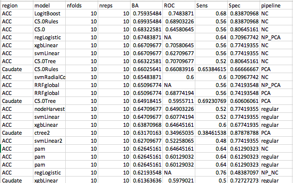
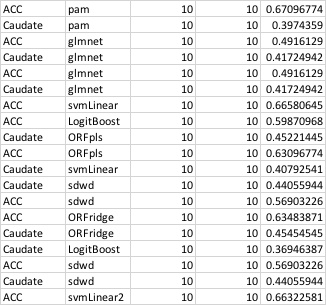

# 2020-04-02 20:35:35

Philip said I could try some ML here, just to see what we get. Why not?

I'll start within tissue, and then potentially do something to combine them?
Note that here we have WAY more genes than data, so we'll need to be very
careful with overfitting. Some clever cross-validation might be needed as well. 

At first, our data dimensions are 35,924 genes for 56 subjects,
and that's without taking into consideration the covariates to test.

How about doing LOOCV after leaving out one subject. That will result in nsubjs
models, and we can just average the varImp across all of them? Also, let's focus
on models with built-in cross-validation at first, and add some feature
engineering later if needed (likely).

```r
library(caret)

myregion = 'ACC'

data = readRDS('~/data/rnaseq_derek/data_from_philip.rds')
data$substance_group = as.factor(data$substance_group)
data$batch = as.factor(data$batch)
# no column names as numbers!
grex_names = sapply(colnames(data)[34:ncol(data)],
                    function(x) sprintf('grex%s', x))
colnames(data)[34:ncol(data)] = grex_names

pop_code = read.csv('~/data/rnaseq_derek/file_pop.csv')
data = merge(data, pop_code, by='hbcc_brain_id')
data = data[data$Region==myregion, ]

# variables to be tested/screened
covar_names = c(# brain-related
                "bainbank", 'PMI', 'Manner.of.Death',
                # technical
                'batch', 'RINe',
                # clinical
                'comorbid_group', 'substance_group',
                # others
                'Sex', 'Age', 'POP_CODE')

# only covariates can be binary, and I'm getting stack overflow errors sending
# everything to dummyvars...
data2 = data[, c(covar_names, 'Diagnosis')]
dummies = dummyVars(Diagnosis ~ ., data = data2)
data3 = predict(dummies, newdata = data2)
# remove linear combination variables
comboInfo <- findLinearCombos(data3)
data3 = data3[, -comboInfo$remove]
data4 = cbind(data[, grex_names], data3)

# I'll go ahead and do the pre-processing here because it'll be very costly to
# to it inside LOOCV
set.seed(42)
# data4 doesn't even have Diagnosis, and no NAs
pp_order = c('zv', 'nzv', 'center', 'scale')
pp = preProcess(data4, method = pp_order)
X = predict(pp, data4)
```

OK, at this point I saved the data because the preprocessing took longer than I
wanted. It's not crucial, but it might save a few minutes in the future.

```r
library(caret)
library(doParallel)

X = readRDS('~/data/rnaseq_derek/X_ACCnoPH_zv_nzv_center_scale.rds')
myregion = 'ACC'
ncores = 32
nfolds = 10
nreps = 10
clf_model = 'kernelpls'
just_target = readRDS('~/data/rnaseq_derek/data_from_philip.rds')
y = just_target[just_target$Region==myregion, 'Diagnosis']

my_summary = function(data, lev = NULL, model = NULL) {
    tcs = twoClassSummary(data, lev=lev)
    a = c((tcs['Sens'] + tcs['Spec'])/2, tcs)
    names(a)[1] = 'BalancedAccuracy'
    return(a)
}

registerDoParallel(ncores)
getDoParWorkers()

set.seed(42)
fitControl <- trainControl(method = "repeatedcv",
                           number = nfolds,
                           repeats = nreps,
                           savePredictions = 'final',
                           allowParallel = TRUE,
                           classProbs = TRUE,
                           summaryFunction=my_summary)

# let's then do a repeated 10 fold CV within LOOCV. We save the test predictions
# to later compute the overall result.
varimps = matrix(nrow=ncol(X), ncol=nrow(X))
test_preds = c()
for (test_rows in 1:20){ #length(y)) {
    print(sprintf('Hold out %d / %d', test_rows, length(y)))
    X_train <- X[-test_rows, ]
    X_test <- X[test_rows, ]
    y_train <- factor(y[-test_rows])
    y_test <- factor(y[test_rows])

    set.seed(42)
    fit <- train(X_train, y_train, trControl = fitControl, method = clf_model,
                 metric='BalancedAccuracy')

    preds_class = predict.train(fit, newdata=X_test)
    preds_probs = predict.train(fit, newdata=X_test, type='prob')
    dat = cbind(data.frame(obs = y_test, pred = preds_class), preds_probs)
    test_preds = rbind(test_preds, dat)

    tmp = varImp(fit, useModel=T)$importance
    varimps[, test_rows] = tmp[,1]
}

mcs = my_summary(test_preds, lev=levels(y))
test_results = c(mcs['BalancedAccuracy'], mcs['ROC'], mcs['Sens'], mcs['Spec'])
names(test_results) = c('test_BalancedAccuracy', 'test_AUC', 'test_Sens',
                        'test_Spec')

res = c(myregion, clf_model, nfolds, nreps, test_results)
line_res = paste(res,collapse=',')
write(line_res, file=out_file, append=TRUE)
print(line_res)

# export variable importance
a = rowMeans(varimps, na.rm=T)
names(a) = rownames(tmp)
out_dir = '~/data/rnaseq_derek/LOOCV/'
fname = sprintf('%s/varimp_%s_%s_%d_%d.csv',
                out_dir, myregion, clf_model, nfolds, nreps)
write.csv(a, file=fname)
```

The code above was working, so I wrote it into a function (rnaseq_LOOCV.R) and
we can fire it up in Biowulf:

```bash
my_dir=~/data/rnaseq_derek
cd $my_dir
my_script=~/research_code/rnaseq_LOOCV.R;
out_file=swarm.loocv
res_file=${my_dir}/results_LOOCV.csv
rm $out_file
for clf in `cat ~/research_code/clf_feature_selection_class_probs.txt`; do
    for r in ACC Caudate; do
      echo "Rscript $my_script ${my_dir}/X_${r}noPH_zv_nzv_center_scale.rds $r $clf 10 10 32 $res_file;" >> $out_file;
    done;
done

swarm -g 200 -t 32 --job-name loocv --time 72:00:00 -f $out_file \
    -m R --logdir trash
```

Removed some classifiers that failed due to lack of memory (protect stack
overflow). Many more interesting things to try before getting bigger machine for
those. For example, 2vs2 and feature engineering!

I had lots of failures, so I'll run everything again but using 32 core machines
and giving them 3 days as we have a weekend coming up and cluster might be more
free. Let's see what happens.

But I also want to try some classifiers that are known for being regularized.
Some of them don't implement probabilities, so I'll need a new script that
doesn't look at ROC.

```bash
my_dir=~/data/rnaseq_derek
cd $my_dir
my_script=~/research_code/rnaseq_LOOCV_noProbs.R;
out_file=swarm.loocvNP
res_file=${my_dir}/results_LOOCV_NP.csv
rm $out_file
for clf in `cat ~/research_code/clf_regularized.txt ~/research_code/clf_L1.txt`; do
    for r in ACC Caudate; do
      echo "Rscript $my_script ${my_dir}/X_${r}noPH_zv_nzv_center_scale.rds $r $clf 10 10 8 $res_file;" >> $out_file;
    done;
done

swarm -g 30 -t 8 --job-name loocvNP --time 4:00:00 -f $out_file \
    -m R --partition quick --logdir trash
```

I'm now firing up a jupyter notebook to try some feature engineering while I
have the regularized and feature selection models running.

```bash
cd ~/lab_notes/
module load jupyter
jupyter notebook --ip localhost --port $PORT1 --no-browser
```

But before I do that a bit more, I finished the 2vs2 code, so let's run our
classifiers there too. It needs class probabilities, so a bunch of classifiers
will fail, but we'll see what sticks while I engineer some features:

```bash
my_dir=~/data/rnaseq_derek
cd $my_dir
my_script=~/research_code/rnaseq_2vs2.R;
out_file=swarm.2vs2
res_file=${my_dir}/results_2vs2.csv
rm $out_file
for clf in `cat ~/research_code/clf_feature_selection_class_probs.txt \
  ~/research_code/clf_regularized.txt ~/research_code/clf_L1.txt`; do
    for r in ACC Caudate; do
      echo "Rscript $my_script ${my_dir}/X_${r}noPH_zv_nzv_center_scale.rds $r $clf 10 10 32 $res_file;" >> $out_file;
    done;
done

swarm -g 200 -t 32 --job-name twoVtwo --time 72:00:00 -f $out_file \
    -m R --logdir trash
```

I also finished a PCA version of the data. Let's give it a try:

```bash
my_dir=~/data/rnaseq_derek
cd $my_dir
my_script=~/research_code/rnaseq_2vs2.R;
out_file=swarm.2vs2PCA
res_file=${my_dir}/results_2vs2_PCA.csv
rm $out_file
for clf in `cat ~/research_code/clf_feature_selection_class_probs.txt \
  ~/research_code/clf_regularized.txt ~/research_code/clf_L1.txt`; do
    for r in ACC Caudate; do
      echo "Rscript $my_script ${my_dir}/X_${r}noPH_zv_nzv_center_scale_PCA.rds $r $clf 10 10 8 $res_file;" >> $out_file;
    done;
done

swarm -g 30 -t 8 --job-name twoVtwoPCA --time 4:00:00 -f $out_file \
    -m R --partition quick --logdir trash
```

```bash
my_dir=~/data/rnaseq_derek
cd $my_dir
my_script=~/research_code/rnaseq_LOOCV_noProbs.R;
out_file=swarm.loocvNPPCA
res_file=${my_dir}/results_LOOCV_NP_PCA.csv
rm $out_file
for clf in `cat ~/research_code/clf_regularized.txt ~/research_code/clf_L1.txt`; do
    for r in ACC Caudate; do
      echo "Rscript $my_script ${my_dir}/X_${r}noPH_zv_nzv_center_scale_PCA.rds $r $clf 10 10 8 $res_file;" >> $out_file;
    done;
done

swarm -g 30 -t 8 --job-name loocvNPPCA --time 4:00:00 -f $out_file \
    -m R --partition quick --logdir trash
```

```bash
my_dir=~/data/rnaseq_derek
cd $my_dir
my_script=~/research_code/rnaseq_LOOCV.R;
out_file=swarm.loocv
res_file=${my_dir}/results_LOOCV_PCA.csv
rm $out_file
for clf in `cat ~/research_code/clf_feature_selection_class_probs.txt`; do
    for r in ACC Caudate; do
      echo "Rscript $my_script ${my_dir}/X_${r}noPH_zv_nzv_center_scale_PCA.rds $r $clf 10 10 8 $res_file;" >> $out_file;
    done;
done

swarm -g 30 -t 8 --job-name loocv --time 4:00:00 -f $out_file \
    -m R --partition quick --logdir trash
```

Similarly, I made a version of the file that removes all variables correlated at
above abs(.75). Let's see how those perform:

```bash
my_dir=~/data/rnaseq_derek
cd $my_dir
my_script=~/research_code/rnaseq_2vs2.R;
out_file=swarm.2vs2NC
res_file=${my_dir}/results_2vs2_noCorr.csv
rm $out_file
for clf in `cat ~/research_code/clf_feature_selection_class_probs.txt \
  ~/research_code/clf_regularized.txt ~/research_code/clf_L1.txt`; do
    for r in ACC Caudate; do
      echo "Rscript $my_script ${my_dir}/X_${r}noPH_zv_nzv_center_scale_noCorr75.rds $r $clf 10 10 32 $res_file;" >> $out_file;
    done;
done

swarm -g 200 -t 32 --job-name twoVtwoNC --time 48:00:00 -f $out_file \
    -m R --logdir trash
```

```bash
my_dir=~/data/rnaseq_derek
cd $my_dir
my_script=~/research_code/rnaseq_LOOCV_noProbs.R;
out_file=swarm.loocvNPNC
res_file=${my_dir}/results_LOOCV_NP_NC.csv
rm $out_file
for clf in `cat ~/research_code/clf_regularized.txt ~/research_code/clf_L1.txt`; do
    for r in ACC Caudate; do
      echo "Rscript $my_script ${my_dir}/X_${r}noPH_zv_nzv_center_scale_noCorr75.rds $r $clf 10 10 32 $res_file;" >> $out_file;
    done;
done

swarm -g 200 -t 32 --job-name loocvNPNC --time 48:00:00 -f $out_file \
    -m R --logdir trash
```

```bash
my_dir=~/data/rnaseq_derek
cd $my_dir
my_script=~/research_code/rnaseq_LOOCV.R;
out_file=swarm.loocvNC
res_file=${my_dir}/results_LOOCV_NC.csv
rm $out_file
for clf in `cat ~/research_code/clf_feature_selection_class_probs.txt`; do
    for r in ACC Caudate; do
      echo "Rscript $my_script ${my_dir}/X_${r}noPH_zv_nzv_center_scale_noCorr75.rds $r $clf 10 10 32 $res_file;" >> $out_file;
    done;
done

swarm -g 200 -t 32 --job-name loocvNC --time 48:00:00 -f $out_file \
    -m R --logdir trash
```

# 2020-04-05 09:21:17

Looking at the preliminary results so far, ACC does generally better. The
no-correlation pipeline is also the best, so we might need to check if there is
a better correlation threshold to play with. Also, would it just be a matter of
playing with the regularization parameters a bit more, and get the entire set
there?



How about 2vs2?



ACC does better as well. But the results are not as good as the regular
classifier, so we should probably stick with that for now. Also interesting tha
PCA and NC do better, leading me to believe that our parameters being tested
acould be improved.

So, my preferred approach here would be to optimize the classifiers doing best
with the regular set and see if that helps. If not, then find the best NC
threshold and go from there. In that case, I could try multiple NC threhsolds,
or try to find some sort of cut-off empirically?

My difficulty with the NC pipeline is how the variables that were kept were
chosen. If we remove variable X and not variable Y, we might be losing on model
intepretation. Maybe X was an important gene? I could also run a PCA pipeline
where we keep all possible components? Should be about 50 or so. Then maybe the
results would somewhat approach the NC pipeline?

For nodeHarvest there isn't muc else to do. In fact, maybe I could run it
forcing the paramaters to 1 and outbag, and see if not overfitting to the trian
set does better? 

```r
clf_model = 'nodeHarvest'
fitControl <- trainControl(method = "none", classProbs = TRUE,
                           allowParallel = TRUE)
mygrid = data.frame(maxinter=1, mode='mean')
varimps = matrix(nrow=ncol(X), ncol=nrow(X))
test_preds = c()
for (test_rows in 1:length(y)) {
    print(sprintf('Hold out %d / %d', test_rows, length(y)))
    X_train <- X[-test_rows, ]
    X_test <- X[test_rows, ]
    y_train <- factor(y[-test_rows])
    y_test <- factor(y[test_rows])

    set.seed(42)
    fit <- train(X_train, y_train, trControl = fitControl, method = clf_model,
                 metric='BalancedAccuracy', tuneGrid=mygrid)

    preds_class = predict.train(fit, newdata=X_test)
    preds_probs = predict.train(fit, newdata=X_test, type='prob')
    dat = cbind(data.frame(obs = y_test, pred = preds_class), preds_probs)
    test_preds = rbind(test_preds, dat)

    tmp = varImp(fit, useModel=T)$importance
    varimps[, test_rows] = tmp[,1]
}
mcs = my_summary(test_preds, lev=levels(y))
test_results = c(mcs['BalancedAccuracy'], mcs['ROC'], mcs['Sens'], mcs['Spec'])
names(test_results) = c('test_BalancedAccuracy', 'test_AUC', 'test_Sens',
                        'test_Spec')
```

But if we're going to go with dimensionality reduction, this could be a good way
to go about it:
https://cran.r-project.org/web/packages/dimRed/vignettes/dimensionality-reduction.pdf

I just need to remember to only use methods that have a inverse transform so I
can get back to the original results...

Maybe try all PCs from PCA, and if that doesn't work (or whle that's computing),
try some of these methods to see what works best?

I also need to play with the xgbLinear parameters, because some of that might
make the results using all predictors a bit more palatable.

Before I do any of that, maybe look for outliers inside each gene and set them
to max? Just to make sure no outlier is driving the variance...


# TODO
* check for normality and outliers, possibly even winsorize?
* I had to remove the pH variable because it had 23 NAs, and it was the only
  variable with NAs. So, probably good to test if our results change at all with
  it later.
* maybe try some nonlinear dimensionality reduction?
* we might need to really play with regularization here, as the default values
  from caret will likely be far from a decent range. Still, they might be a good
  indication of what runs and what doesn't.
* try running ICASSO because caret's ica broke down
* try MDS?
* try TPOT MDS pipeline?
* try TPOT and select best model across LOOCV?
