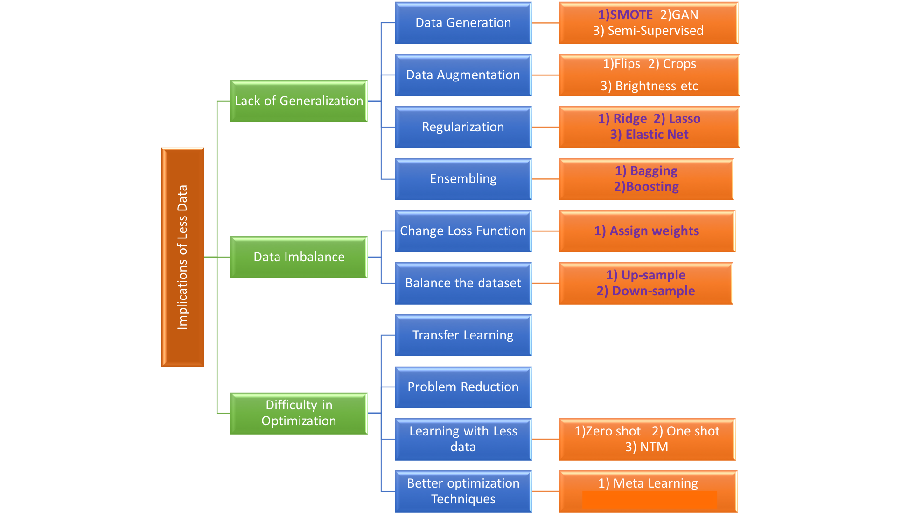
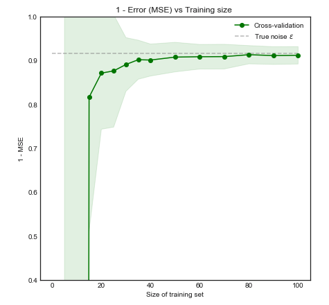

# 2020-04-10 14:27:12

* clean up! either remove outliers or use methods robust to them (e.g quantile regressions)
* use very simple models with few assumptions. the set of all linear models with 3 non-zero weights, the set of decision trees with depth <= 4, the set of histograms with 10 equally-spaced bins)
* maybe use data from other studies?
* use model averaging
* use regularization
* feature selection
* **provide confidence intervals on boostrapped performance!**
* weighted average of weak and unrelated classifiers
* naive bayes simple enough? ridge regression?
* limit maximum depth for trees
* rule out models that imply non-linearity or feature interactions?

* create a learning curve!

So, maybe here's a strategy:

- start by cleaning up the data as much as possible
- try a few simple models that don't need to be tuned, maybe do some model
  averaging there.
- go for other simple models, such as regularized logistic regression, NB,
  svmLinear, bagged/boosted trees that are not deep
- SMOTE?