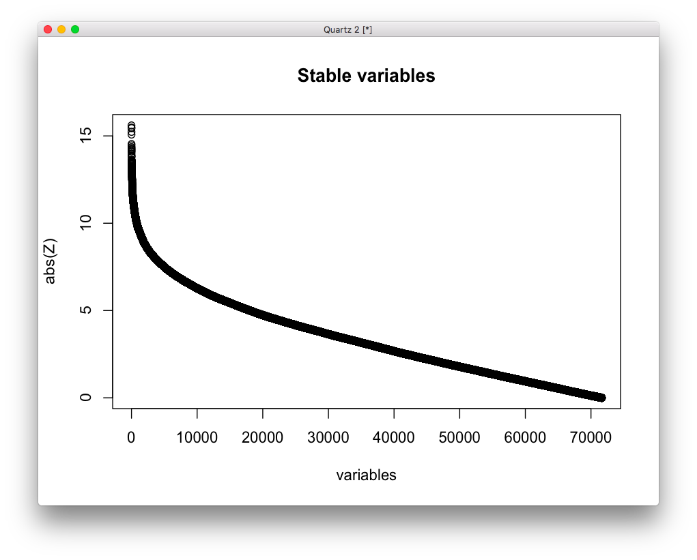

# 2020-04-12 16:14:49

I did some analysis for ACC using PLS that looked OK. Let's repeat it here, and
do it for the caudate and the entire sample, with a good number of reps. Then,
we can do it for the raw data and check the differences.

```r
myregion='ACC'
just_target = readRDS('~/data/rnaseq_derek/data_from_philip.rds')
if (myregion == 'both') {
    fname = '~/data/rnaseq_derek/X_noPH_zv_nzv_center_scale_SDT5_normal.rds'
    y = just_target[, 'Diagnosis']
} else {
    fname = sprintf('~/data/rnaseq_derek/X_%snoPH_zv_nzv_center_scale_SDT5_normal.rds',
                    myregion)
    y = just_target[just_target$Region==myregion, 'Diagnosis']
}
X = readRDS(fname)
```

Then, I just need to repeat the same for all of them:

```r
Xca = X[y=='Case',]
Xco = X[y=='Control',]
# M is nclass by nvars
M = rbind(colMeans(Xco), colMeans(Xca))
Rmc = M - colMeans(M)
S = svd(Rmc)
```

Now it's a matter of permuting to check which components to take.

```r
nperms = 10000
set.seed(42)
eig_vals = as.numeric(vector(length=nperms))
for (p in 1:nperms) {
    print(sprintf('%d / %d', p, nperms))
    perm_idx = sample(1:length(y), length(y), replace=F)
    yperm = y[perm_idx]
    Xca_perm = X[yperm=='Case',]
    Xco_perm = X[yperm=='Control',]
    # M is nclass by nvars
    M_perm = rbind(colMeans(Xco_perm), colMeans(Xca_perm))
    Rmc_perm = M_perm - colMeans(M_perm)
    S_perm = svd(Rmc_perm)
    eig_vals[p] = max(S_perm$d)
}
sum(eig_vals >= S$d[1])/nperms
```

For ACC we have 0.0362, for Caudate we have 0.4209, and for both we have 0.2486.

So, basically it doesn't work for Caudate, at least not better than chance.

To compute stability, we need to do:

```r
library(vegan)
nperms = 10000
set.seed(42)
eig_vecs = matrix(nrow=ncol(X), ncol=nperms)
for (p in 1:nperms) {
    print(sprintf('%d / %d', p, nperms))
    perm_idx = sample(1:length(y), length(y), replace=T)
    yperm = y[perm_idx]
    Xca_perm = X[yperm=='Case',]
    Xco_perm = X[yperm=='Control',]
    # M is nclass by nvars
    M_perm = rbind(colMeans(Xco_perm), colMeans(Xca_perm))
    Rmc_perm = M_perm - colMeans(M_perm)
    S_perm = svd(Rmc_perm)
    pc = procrustes(S$v, S_perm$v)
    eig_vecs[, p] = pc$Yrot[, 1]
}
v_err = apply(eig_vecs, 1, sd)
vz = S$v/v_err

> summary(vz[, 1])
     Min.   1st Qu.    Median      Mean   3rd Qu.      Max. 
-14.34215  -3.28073  -0.07116  -0.14292   3.09335  13.09720 
```

I'm gonna save those results so we can plot and investigate them later:

```r
save(S, eig_vals, vz,
     file='~/data/rnaseq_derek/PLS_ACC_noPH_zv_nzv_center_scale_SDT5_normal.RData')
```

## Original data

To use the original data without transformations, only changes how we grab X and
y, but the rest of the code is the same:

```r
library(caret)

myregion = 'ACC'

data = readRDS('~/data/rnaseq_derek/data_from_philip.rds')
data$substance_group = as.factor(data$substance_group)
data$batch = as.factor(data$batch)
# no column names as numbers!
grex_names = sapply(colnames(data)[34:ncol(data)],
                    function(x) sprintf('grex%s', x))
colnames(data)[34:ncol(data)] = grex_names

pop_code = read.csv('~/data/rnaseq_derek/file_pop.csv')
data = merge(data, pop_code, by='hbcc_brain_id')
data = data[data$Region==myregion, ]

# variables to be tested/screened
covar_names = c(# brain-related
                "bainbank", 'PMI', 'Manner.of.Death',
                # technical
                'batch', 'RINe',
                # clinical
                'comorbid_group', 'substance_group',
                # others
                'Sex', 'Age', 'POP_CODE')

# only covariates can be binary, and I'm getting stack overflow errors sending
# everything to dummyvars...
data2 = data[, c(covar_names, 'Diagnosis')]
dummies = dummyVars(Diagnosis ~ ., data = data2)
data3 = predict(dummies, newdata = data2)
# remove linear combination variables
comboInfo <- findLinearCombos(data3)
data3 = data3[, -comboInfo$remove]
data4 = cbind(data[, grex_names], data3)

X = data4
y = data2[data$Region==myregion, 'Diagnosis']
```

When analyzing both, I had to do this:

```r
data2 = data[, c(covar_names, 'Region', 'Diagnosis')]
dummies = dummyVars(Diagnosis ~ ., data = data2)
data3 = predict(dummies, newdata = data2)
# remove linear combination variables
comboInfo <- findLinearCombos(data3)
data3 = data3[, -comboInfo$remove]
data4 = cbind(data[, grex_names], data3)

X = data4
y = data2[, 'Diagnosis']
```

Now I get .7 for ACC, .321 for Caudate, and .568 for both together. That shows
how important it is to do some data cleaning when we have so few subjects... we
might even try to clean with other parameters later?

# 2020-04-13 06:58:14

Do the results hold for WNH only?

```r
library(caret)

myregion = 'ACC'

data = readRDS('~/data/rnaseq_derek/data_from_philip.rds')
data$substance_group = as.factor(data$substance_group)
data$batch = as.factor(data$batch)
# no column names as numbers!
grex_names = sapply(colnames(data)[34:ncol(data)],
                    function(x) sprintf('grex%s', x))
colnames(data)[34:ncol(data)] = grex_names

pop_code = read.csv('~/data/rnaseq_derek/file_pop.csv')
data = merge(data, pop_code, by='hbcc_brain_id')
data = data[data$Region==myregion, ]
data = data[data$POP_CODE=='WNH', ]

# variables to be tested/screened
covar_names = c(# brain-related
                "bainbank", 'PMI', 'Manner.of.Death',
                # technical
                'batch', 'RINe',
                # clinical
                'comorbid_group', 'substance_group',
                # others
                'Sex', 'Age')

# only covariates can be binary, and I'm getting stack overflow errors sending
# everything to dummyvars...
data2 = data[, c(covar_names, 'Diagnosis')]
dummies = dummyVars(Diagnosis ~ ., data = data2)
data3 = predict(dummies, newdata = data2)
# remove linear combination variables
comboInfo <- findLinearCombos(data3)
data3 = data3[, -comboInfo$remove]
data4 = cbind(data[, grex_names], data3)

y = data2[data$Region==myregion, 'Diagnosis']
set.seed(42)
# data4 doesn't even have Diagnosis, and no NAs
pp_order = c('zv', 'nzv', 'center', 'scale')
pp = preProcess(data4, method = pp_order)
X = predict(pp, data4)

# at this point everything I have in X is numeric, so it's safe to proceed with this
m = apply(X, 2, max)
# setting anything above SDT standard deviations to SDT. In ACC I only had 5% of
# variables above 4, 1% above 5
SDT = 3 #5
trim_vars = names(which(m > SDT))
for (v in trim_vars) {
    X[X[, v] > SDT, v] = SDT
}
# do the same thing below zero
m = apply(X, 2, min)
SDT = -SDT
trim_vars = names(which(m < SDT))
for (v in trim_vars) {
    X[X[, v] < SDT, v] = SDT
}

library(bestNormalize)
for (v in 1:ncol(X)) {
    if ((v %% 100)==0) {
        print(sprintf('%d / %d', v, ncol(X)))
    }
    # changed to LOO because one of the variables for ACC was crapping out
    # it doesn't change the computation time at all, and it'll most likely
    # use qnorm anyways
    bn = bestNormalize(X[, v], warn=F, loo=T)
    X[, v] = bn$x.t
}
# finally, re-scale everything to make sure out mean and SD are the same across 
# variables, in case some classifiers need that (looking at you, LDA)
X2 = scale(X, center=T, scale=T)
fname = sprintf('~/data/rnaseq_derek/X_%snoPH_WNH_zv_nzv_center_scale_SDT%d_normal.rds',
                myregion, abs(SDT))
saveRDS(X2, file=fname)
```

Running the same code as above but now for WNH-only, I get for ACC, for Caudate,
and for both.

## First look at results

The only result so far that worked out was ACC for SDT 5, so let's see what's
there:

```r
load('PLS_ACC_noPH_zv_nzv_center_scale_SDT5_normal.RData')
plot(sort(abs(vz), decreasing=T), main='Stable variables', ylab='abs(Z)', xlab='variables')
```



We could split that solely based on Z, but it should be easy enough to get the
elbow of that curve:


# TODO
 * run WNH only?
 * be more strict during cleaning?