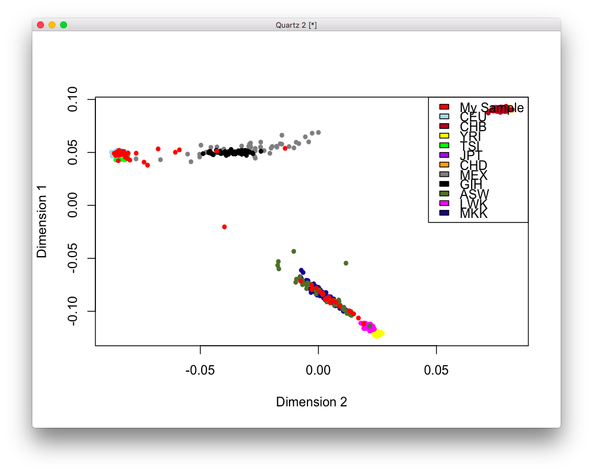
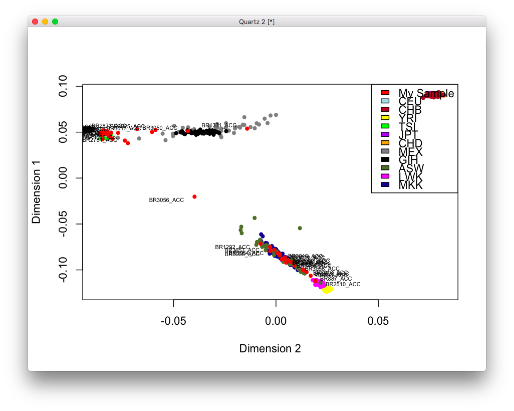
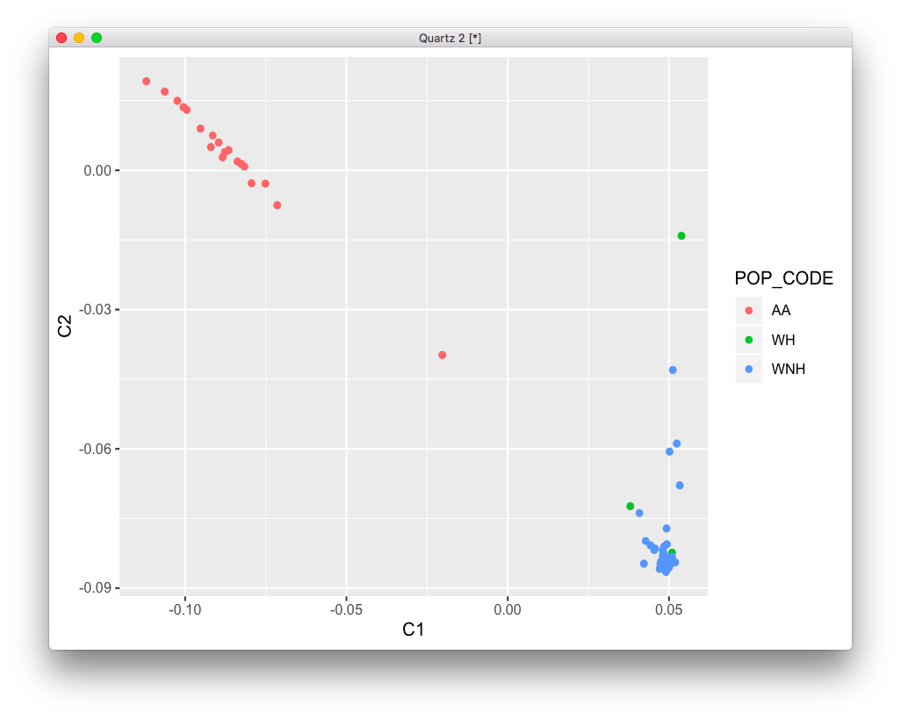
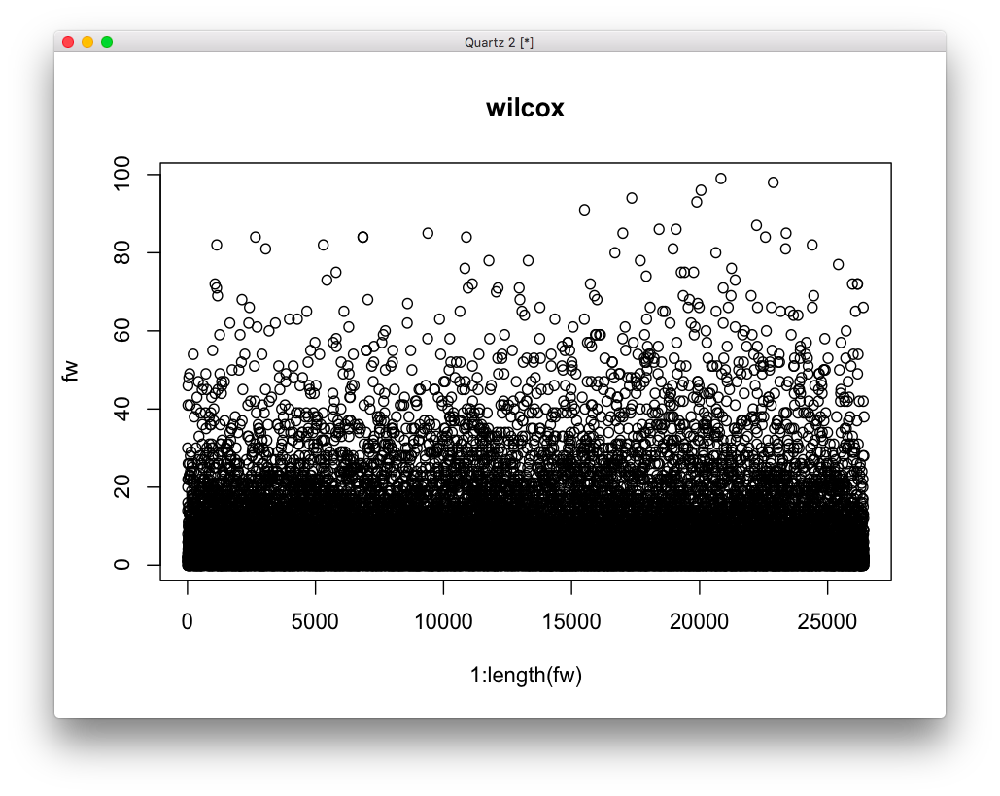
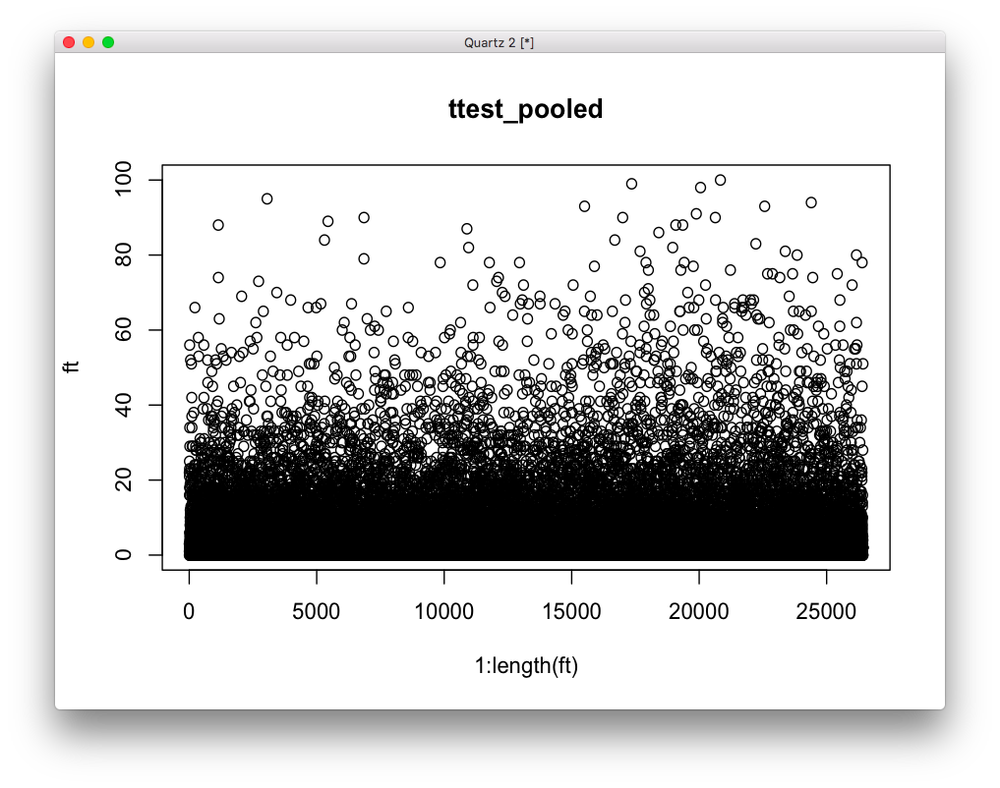
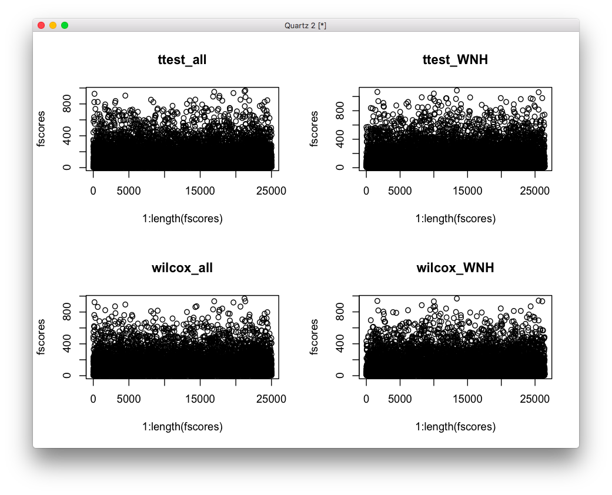

# 2020-04-14 14:34:53

Let's best define the population in the RNAseq study, using the data Kwangmi
cleaned up. I'll just use the ENIGMA protocol as usual:

```bash
# bw
cd ~/data/rnaseq_derek/
wget "http://genepi.qimr.edu.au/staff/sarahMe/enigma/MDS/HM3_b37.bed.gz"
wget "http://genepi.qimr.edu.au/staff/sarahMe/enigma/MDS/HM3_b37.bim.gz"
wget "http://genepi.qimr.edu.au/staff/sarahMe/enigma/MDS/HM3_b37.fam.gz"

plink --file PLINK_180320_1245/Shaw01_2020_new --make-bed --out Shaw01_2020
export datafileraw=Shaw01_2020
plink --bfile $datafileraw --hwe 1e-6 --geno 0.05 --maf 0.01 --noweb \
      --make-bed --out ${datafileraw}_filtered

gunzip HM3_b37*.gz
export datafile=${datafileraw}_filtered
awk '{print $2}' HM3_b37.bim > HM3_b37.snplist.txt
plink --bfile ${datafile} --extract HM3_b37.snplist.txt --make-bed --noweb --out local
awk '{ if (($5=="T" && $6=="A")||($5=="A" && $6=="T")||($5=="C" && $6=="G")||($5=="G" && $6=="C")) print $2, "ambig" ; else print $2 ;}' $datafile.bim | grep -v ambig > local.snplist.txt
plink --bfile HM3_b37 --extract local.snplist.txt --make-bed --noweb --out external

plink --bfile local --bmerge external.bed external.bim external.fam \
  --make-bed --noweb --out HM3_b37merge
# got the error
plink --bfile local --flip HM3_b37merge-merge.missnp --make-bed --noweb \
  --out flipped
plink --bfile flipped --bmerge external.bed external.bim external.fam \
  --make-bed --noweb --out HM3_b37merge
# running MDS analysis... switching to 10 dimensions to conform to old analysis
plink --bfile HM3_b37merge --cluster --mind .05 --mds-plot 10 \
  --extract local.snplist.txt --noweb --out HM3_b37mds
# making the MDS plot
awk 'BEGIN{OFS=","};{print $1, $2, $3, $4, $5, $6, $7}' HM3_b37mds.mds >> HM3_b37mds2R.mds.csv
```

Then, I made the plot locally:

```R
library(calibrate)
mds.cluster = read.csv("~/data/rnaseq_derek/HM3_b37mds2R.mds.csv", header=T);
colors=rep("red",length(mds.cluster$C1));
colors[which(mds.cluster$FID == "CEU")] <- "lightblue";
colors[which(mds.cluster$FID == "CHB")] <- "brown";
colors[which(mds.cluster$FID == "YRI")] <- "yellow";
colors[which(mds.cluster$FID == "TSI")] <- "green";
colors[which(mds.cluster$FID == "JPT")] <- "purple";
colors[which(mds.cluster$FID == "CHD")] <- "orange";
colors[which(mds.cluster$FID == "MEX")] <- "grey50";
colors[which(mds.cluster$FID == "GIH")] <- "black";
colors[which(mds.cluster$FID == "ASW")] <- "darkolivegreen";
colors[which(mds.cluster$FID == "LWK")] <- "magenta";
colors[which(mds.cluster$FID == "MKK")] <- "darkblue";
# pdf(file="mdsplot.pdf",width=7,height=7)
plot(rev(mds.cluster$C2), rev(mds.cluster$C1), col=rev(colors),
         ylab="Dimension 1", xlab="Dimension 2",pch=20)
legend("topright", c("My Sample", "CEU", "CHB", "YRI", "TSI", "JPT", "CHD",
                     "MEX", "GIH", "ASW","LWK", "MKK"),
       fill=c("red", "lightblue", "brown", "yellow", "green", "purple",
              "orange", "grey50", "black", "darkolivegreen", "magenta",
              "darkblue"))
```



```r
# if you want to know the subject ID label of each sample on the graph,
# uncomment the value below
FIDlabels <- c("CEU", "CHB", "YRI", "TSI", "JPT", "CHD", "MEX", "GIH", "ASW",
               "LWK", "MKK");
textxy(mds.cluster[which(!(mds.cluster$FID %in% FIDlabels)), "C2"],
       mds.cluster[which(!(mds.cluster$FID %in% FIDlabels)), "C1"],
       mds.cluster[which(!(mds.cluster$FID %in% FIDlabels)), "IID"])
# dev.off();
```



Now that I think of it, it'd be a cute study to add PRS or even raw genomics to
this... but let's see if anything comes off of RNAseq first.

Let's add the PCs to the RNAseq data:

```r
data = readRDS('~/data/rnaseq_derek/data_from_philip.rds')
data$substance_group = as.factor(data$substance_group)
data$batch = as.factor(data$batch)
data$hbcc_brain_id = as.factor(data$hbcc_brain_id)
# no column names as numbers!
grex_names = sapply(colnames(data)[34:ncol(data)],
                    function(x) sprintf('grex%s', x))
colnames(data)[34:ncol(data)] = grex_names

pop_code = read.csv('~/data/rnaseq_derek/file_pop.csv')
data = merge(data, pop_code, by='hbcc_brain_id')

pcs = read.table('~/data/rnaseq_derek/HM3_b37mds.mds', header=1)
myids = sapply(1:nrow(pcs), function(x) as.numeric(gsub('BR', '',
                                                        strsplit(as.character(pcs[x,'IID']), '_')[[1]][1])))
pcs$numids = myids
m = merge(data, pcs, by.x='hbcc_brain_id', by.y='numids', all.x=T, all.y=F)
saveRDS(m, file='~/data/rnaseq_derek/data_from_philip_POP_and_PCs.rds')
```

Finally, we plot the self-declared groups against the PCs.

```r
library(ggplot2)
ggplot(m, aes(x=C1, y=C2, col=POP_CODE)) + geom_point()
```



I think we can probably set up the WNH cut offs at C1 > 0 and C2 < -.075. Note
that 2842 didn't have PCs. They self-declared WNH, so we can decide later
whether to include or not. 

# 2020-04-14 18:46:12

Now, let's see if this makes any difference. I'll run one of our prediction
LOOCV using only the good variables, and only WNH:

```r
data = readRDS('~/data/rnaseq_derek/data_from_philip_POP_and_PCs.rds')
data = data[data$Region=='ACC',]
imWNH = data$C1 > 0 & data$C2 < -.075
data = data[which(imWNH),]

covar_names = c(# brain-related
                "bainbank", 'PMI', 'Manner.of.Death',
                # technical
                'batch', 'RINe',
                # clinical
                'comorbid_group', 'substance_group',
                # others
                'Sex', 'Age')

# only covariates can be binary, and I'm getting stack overflow errors sending
# everything to dummyvars...
data2 = data[, c(covar_names, 'Diagnosis')]
library(caret)
dummies = dummyVars(Diagnosis ~ ., data = data2)
data3 = predict(dummies, newdata = data2)
# remove linear combination variables
comboInfo <- findLinearCombos(data3)
data3 = data3[, -comboInfo$remove]

# remove weird variables
grex_names = colnames(data)[grepl(colnames(data), pattern='^grex')]
pp = preProcess(data[, grex_names], method=c('zv', 'nzv', 'range'),
                rangeBounds=c(0,1))
a = predict(pp, data[, grex_names])
n0 = colSums(a==0)
imbad = names(n0)[n0>1]
good_grex = grex_names[!(grex_names %in% imbad)]

data4 = cbind(data[, good_grex], data3)

# I'll go ahead and do the pre-processing here because it'll be very costly to
# to it inside LOOCV
set.seed(42)
# data4 doesn't even have Diagnosis, and no NAs
pp_order = c('zv', 'nzv', 'center', 'scale')
pp = preProcess(data4, method = pp_order)
X = predict(pp, data4)
y = data2$Diagnosis
```

Now, we try LOOCV:

```r
nfolds = 5
nreps = 10
clf = 'glmnet'
set.seed(42)
fitControl <- trainControl(method = "repeatedcv",
                          number = nfolds,
                          repeats = nreps,
                          savePredictions = 'final',
                          allowParallel = TRUE,
                          classProbs = TRUE,
                          summaryFunction=twoClassSummary)
mygrid = expand.grid(lambda=c(1, 5, 10, 50, 100, 200),
                    alpha=0)
ntop = 200

y_probs = c()
y_preds = c()
best_params = c()
for (test_row in 1:nrow(X)) {
    train_rows = setdiff(1:nrow(X), test_row)
    X_train <- X[train_rows, ]
    X_test <- X[-train_rows, ]
    y_train <- y[train_rows]
    y_test <- y[-train_rows]

    print(sprintf('LOOCV %d / %d', test_row, nrow(X)))

    ps = sapply(1:ncol(X), function(v) t.test(X_train[y_train=='Case', v],
                                              X_train[y_train=='Control', v])$p.value)
    good_vars = sort(ps, index.return=T)
    X_train2 = X_train[, good_vars$ix[1:ntop]]
    X_test2 = X_test[, good_vars$ix[1:ntop]]

    set.seed(42)
    fit <- train(X_train2, y_train,
                    trControl = fitControl,
                    method = clf,
                    tuneGrid=mygrid,
                    metric='ROC')
    print(fit)
    # updated LOOCV predictions
    y_probs = rbind(y_probs, predict(fit, X_test2, type='prob'))
    y_preds = c(y_preds, levels(y)[predict(fit, X_test2)])

    # just some ongoing summary
    dat = cbind(data.frame(obs = y[1:nrow(y_probs)],
                           pred = factor(y_preds, levels=levels(y))),
                y_probs)
    print(twoClassSummary(dat, lev=levels(y)))
}
```

I'll also try rf, just in case:

```r
fitControl <- trainControl(method = "none",
                           allowParallel = TRUE,
                           classProbs = TRUE)
ntop = 100
clf = 'rf'

y_probs = c()
y_preds = c()
best_params = c()
for (test_row in 1:nrow(X)) {
    train_rows = setdiff(1:nrow(X), test_row)
    X_train <- X[train_rows, ]
    X_test <- X[-train_rows, ]
    y_train <- y[train_rows]
    y_test <- y[-train_rows]

    print(sprintf('LOOCV %d / %d', test_row, nrow(X)))

    ps = sapply(1:ncol(X), function(v) t.test(X_train[y_train=='Case', v],
                                              X_train[y_train=='Control', v])$p.value)
    good_vars = sort(ps, index.return=T)
    X_train2 = X_train[, good_vars$ix[1:ntop]]
    X_test2 = X_test[, good_vars$ix[1:ntop]]
    mygrid = data.frame(mtry=1)

    set.seed(42)
    fit <- train(X_train2, y_train,
                    trControl = fitControl,
                    method = clf,
                    tuneGrid=mygrid,
                    metric='ROC')
    # updated LOOCV predictions
    y_probs = rbind(y_probs, predict(fit, X_test2, type='prob'))
    y_preds = c(y_preds, levels(y)[predict(fit, X_test2)])

    # just some ongoing summary
    dat = cbind(data.frame(obs = y[1:nrow(y_probs)],
                           pred = factor(y_preds, levels=levels(y))),
                y_probs)
    print(twoClassSummary(dat, lev=levels(y)))
}
```

Close to .5 in both...  what's my result if I just run a K-foldX10 CV?

```r
fitControl <- trainControl(method = "repeatedcv",
                          number = 5,
                          repeats = 10,
                          savePredictions = 'final',
                          allowParallel = TRUE,
                          classProbs = TRUE,
                          summaryFunction=twoClassSummary)
mygrid = data.frame(lambda=1,
                    alpha=0)
set.seed(42)
fit <- train(X, y,
             trControl = fitControl,
             method = 'glmnet',
             tuneGrid=mygrid,
             metric='ROC')
print(fit)
```

or, for RF:

```r
fitControl <- trainControl(method = "repeatedcv",
                          number = 5,
                          repeats = 10,
                          savePredictions = 'final',
                          allowParallel = TRUE,
                          classProbs = TRUE,
                          summaryFunction=twoClassSummary)
mygrid = data.frame(mtry=1)
set.seed(42)
fit <- train(X, y,
             trControl = fitControl,
             method = 'rf',
             tuneGrid=mygrid,
             metric='ROC')
print(fit)
```

Is it true that univariate results are becoming insignificant just by adding
another subject? 

```r
pvals = c()
for (test_row in 1:nrow(X)) {
    train_rows = setdiff(1:nrow(X), test_row)
    X_train <- X[train_rows, ]
    X_test <- X[-train_rows, ]
    y_train <- y[train_rows]
    y_test <- y[-train_rows]

    print(sprintf('LOOCV %d / %d', test_row, nrow(X)))

    ps = sapply(1:ncol(X), function(v) t.test(X_train[y_train=='Case', v],
                                              X_train[y_train=='Control', v])$p.value)
    pvals = cbind(pvals, ps)
}
colnames(pvals) = sapply(1:nrow(X), function(x) sprintf('LOOCV%d', x))
ps = sapply(1:ncol(X), function(v) t.test(X[y=='Case', v],
                                          X[y=='Control', v])$p.value)
pvals = cbind(pvals, ps)
colnames(pvals)[ncol(pvals)] = 'all'
rownames(pvals) = colnames(X)
```

No, that's not true at all... they all show similar pattern. So, why can't we
use that? Let's pick even softer models...

```r
fitControl <- trainControl(method = "none",
                           allowParallel = TRUE,
                           classProbs = TRUE)
ntop = 10

y_probs = c()
y_preds = c()
best_params = c()
for (test_row in 1:nrow(X)) {
    train_rows = setdiff(1:nrow(X), test_row)
    X_train <- X[train_rows, ]
    X_test <- X[-train_rows, ]
    y_train <- y[train_rows]
    y_test <- y[-train_rows]

    print(sprintf('LOOCV %d / %d', test_row, nrow(X)))

    ps = sapply(1:ncol(X), function(v) t.test(X_train[y_train=='Case', v],
                                              X_train[y_train=='Control', v])$p.value)
    good_vars = sort(ps, index.return=T)
    X_train2 = X_train[, good_vars$ix[1:ntop]]
    X_test2 = X_test[, good_vars$ix[1:ntop]]
    clf = 'svmLinear'
    mygrid = NULL #data.frame(mtry=1)

    set.seed(42)
    fit <- train(X_train2, y_train,
                    trControl = fitControl,
                    method = clf,
                    tuneGrid=mygrid)
    # updated LOOCV predictions
    y_probs = rbind(y_probs, predict(fit, X_test2, type='prob'))
    y_preds = c(y_preds, levels(y)[predict(fit, X_test2)])

    # just some ongoing summary
    dat = cbind(data.frame(obs = y[1:nrow(y_probs)],
                           pred = factor(y_preds, levels=levels(y))),
                y_probs)
    print(twoClassSummary(dat, lev=levels(y)))
}
```

```r
fitControl <- trainControl(method = "none",
                           allowParallel = TRUE,
                           classProbs = TRUE)
ntop = 100

y_probs = c()
y_preds = c()
best_params = c()
for (test_row in 1:nrow(X)) {
    train_rows = setdiff(1:nrow(X), test_row)
    X_train <- X[train_rows, ]
    X_test <- X[-train_rows, ]
    y_train <- y[train_rows]
    y_test <- y[-train_rows]

    print(sprintf('LOOCV %d / %d', test_row, nrow(X)))

    ps = sapply(1:ncol(X), function(v) t.test(X_train[y_train=='Case', v],
                                              X_train[y_train=='Control', v])$p.value)
    good_vars = sort(ps, index.return=T)
    X_train2 = X_train[, good_vars$ix[1:ntop]]
    X_test2 = X_test[, good_vars$ix[1:ntop]]
    clf = 'kernelpls'
    mygrid = data.frame(ncomp=1)

    set.seed(42)
    fit <- train(X_train2, y_train,
                    trControl = fitControl,
                    method = clf,
                    tuneGrid=mygrid)
    # updated LOOCV predictions
    y_probs = rbind(y_probs, predict(fit, X_test2, type='prob'))
    y_preds = c(y_preds, levels(y)[predict(fit, X_test2)])

    # just some ongoing summary
    dat = cbind(data.frame(obs = y[1:nrow(y_probs)],
                           pred = factor(y_preds, levels=levels(y))),
                y_probs)
    print(twoClassSummary(dat, lev=levels(y)))
}
```

What if we try some resampling?

```r
fitControl <- trainControl(method = "none",
                           allowParallel = TRUE,
                           classProbs = TRUE,
                           sampling='smote')
ntop = 100

y_probs = c()
y_preds = c()
best_params = c()
for (test_row in 1:nrow(X)) {
    train_rows = setdiff(1:nrow(X), test_row)
    X_train <- X[train_rows, ]
    X_test <- X[-train_rows, ]
    y_train <- y[train_rows]
    y_test <- y[-train_rows]

    print(sprintf('LOOCV %d / %d', test_row, nrow(X)))

    ps = sapply(1:ncol(X), function(v) t.test(X_train[y_train=='Case', v],
                                              X_train[y_train=='Control', v])$p.value)
    good_vars = sort(ps, index.return=T)
    X_train2 = X_train[, good_vars$ix[1:ntop]]
    X_test2 = X_test[, good_vars$ix[1:ntop]]
    clf = 'treebag'
    mygrid = NULL #data.frame(ncomp=1)

    set.seed(42)
    fit <- train(X_train2, y_train,
                    trControl = fitControl,
                    method = clf,
                    tuneGrid=mygrid)
    # updated LOOCV predictions
    y_probs = rbind(y_probs, predict(fit, X_test2, type='prob'))
    y_preds = c(y_preds, levels(y)[predict(fit, X_test2)])

    # just some ongoing summary
    dat = cbind(data.frame(obs = y[1:nrow(y_probs)],
                           pred = factor(y_preds, levels=levels(y))),
                y_probs)
    print(twoClassSummary(dat, lev=levels(y)))
}
```

```r
ps = sapply(1:ncol(X), function(v) t.test(X[y=='Case', v],
                                          X[y=='Control', v])$p.value)
good_vars = sort(ps, index.return=T)
X2 = X[, good_vars$ix[1:1000]]
fitControl <- trainControl(method = "repeatedcv",
                          number = 5,
                          repeats = 10,
                          savePredictions = 'final',
                          allowParallel = TRUE,
                          classProbs = TRUE,
                          summaryFunction=twoClassSummary)
mygrid = data.frame(mtry=c(1:5))
set.seed(42)
fit <- train(X2, y,
             trControl = fitControl,
             method = 'rf',
             tuneGrid=mygrid,
             metric='ROC')
print(fit)
```

```
Random Forest 

  31 samples
1000 predictors
   2 classes: 'Case', 'Control' 

No pre-processing
Resampling: Cross-Validated (5 fold, repeated 10 times) 
Summary of sample sizes: 24, 25, 24, 26, 25, 24, ... 
Resampling results across tuning parameters:

  mtry  ROC        Sens       Spec     
  1     0.9302778  0.9400000  0.7566667
  2     0.9172222  0.9350000  0.7700000
  3     0.9008333  0.9166667  0.7500000
  4     0.9068056  0.9283333  0.7533333
  5     0.8931944  0.9100000  0.7533333

ROC was used to select the optimal model using the largest value.
The final value used for the model was mtry = 1.
```

So why can't I get this in LOOCV????? I don't know... well, maybe we can use it
as a filtering step? Say, we'll only use the variables with p < .01?

```r
X2 = X[, ps < .01]
fitControl <- trainControl(method = "repeatedcv",
                          number = 5,
                          repeats = 10,
                          savePredictions = 'final',
                          allowParallel = TRUE,
                          classProbs = TRUE,
                          summaryFunction=twoClassSummary)
mygrid = data.frame(mtry=1)
set.seed(42)
fit_rf <- train(X2, y,
             trControl = fitControl,
             method = 'rf',
             tuneGrid=mygrid,
             metric='ROC')
print(fit_rf)

mygrid = data.frame(ncomp=1)
set.seed(42)
fit_pls <- train(X2, y,
             trControl = fitControl,
             method = 'kernelpls',
             tuneGrid=mygrid,
             metric='ROC')
print(fit_pls)

mygrid = data.frame(lambda=1, alpha=0)
set.seed(42)
fit_logreg <- train(X2, y,
             trControl = fitControl,
             method = 'glmnet',
             tuneGrid=mygrid,
             metric='ROC')
print(fit_logreg)
> rs = resamples(list(rf=fit_rf, logreg=fit_logreg, pls=fit_pls))
> summary(rs)

Call:
summary.resamples(object = rs)

Models: rf, logreg, pls 
Number of resamples: 50 

ROC 
        Min.   1st Qu. Median      Mean 3rd Qu. Max. NA's
rf     0.625 0.9166667      1 0.9591667       1    1    0
logreg 0.750 1.0000000      1 0.9852778       1    1    0
pls    0.750 0.9166667      1 0.9616667       1    1    0

Sens 
            Min. 1st Qu. Median  Mean 3rd Qu. Max. NA's
rf     0.6666667       1      1 0.945       1    1    0
logreg 0.6666667       1      1 0.945       1    1    0
pls    0.6666667       1      1 0.945       1    1    0

Spec 
            Min.   1st Qu. Median      Mean 3rd Qu. Max. NA's
rf     0.3333333 0.6666667      1 0.8333333       1    1    0
logreg 0.5000000 0.6666667      1 0.8466667       1    1    0
pls    0.5000000 0.6666667      1 0.8466667       1    1    0
```

OK, so these are solid results, even though using univariate as filtering is
quite unusual. Just making sure I can reproduce the results:

```r
set.seed(42)
folds = createMultiFolds(y=y, k=5, times=10)
mygrid = data.frame(lambda=1, alpha=0)
fitControl <- trainControl(method = "none",
                           allowParallel = TRUE,
                           classProbs = TRUE)
all_res = c()
for (f in names(folds)) {
    print(f)
    X_train = X2[folds[[f]],]
    X_test = X2[-folds[[f]],]
    y_train = y[folds[[f]]]
    y_test = y[-folds[[f]]]
    set.seed(42)
    fit <- train(X_train, y_train,
                trControl = fitControl,
                method = 'glmnet',
                tuneGrid=mygrid,
                metric='ROC')
    y_probs = predict(fit, X_test, type='prob')
    y_preds = predict(fit, X_test)

    # just some ongoing summary
    dat = cbind(data.frame(obs = y_test,
                           pred = factor(y_preds, levels=levels(y))),
                y_probs)
    res = twoClassSummary(dat, lev=levels(y))
    all_res = c(all_res, res['ROC'])
}
```

```r
> summary(all_res)
   Min. 1st Qu.  Median    Mean 3rd Qu.    Max. 
 0.6667  1.0000  1.0000  0.9806  1.0000  1.0000 
```

So, the only question is the effect of doing the split first thing...

```r
set.seed(42)
folds = createMultiFolds(y=y, k=5, times=10)
mygrid = data.frame(lambda=1, alpha=0)
fitControl <- trainControl(method = "none",
                           allowParallel = TRUE,
                           classProbs = TRUE)
all_res = c()
for (f in names(folds)) {
    print(f)
    X_train = X[folds[[f]],]
    X_test = X[-folds[[f]],]
    y_train = y[folds[[f]]]
    y_test = y[-folds[[f]]]

    ps = sapply(1:ncol(X), function(v) t.test(X_train[y_train=='Case', v],
                                              X_train[y_train=='Control', v])$p.value)
    X_train = X_train[, ps < .01]
    X_test = X_test[, ps < .01]

    set.seed(42)
    fit <- train(X_train, y_train,
                trControl = fitControl,
                method = 'glmnet',
                tuneGrid=mygrid,
                metric='ROC')
    y_probs = predict(fit, X_test, type='prob')
    y_preds = predict(fit, X_test)

    # just some ongoing summary
    dat = cbind(data.frame(obs = y_test,
                           pred = factor(y_preds, levels=levels(y))),
                y_probs)
    res = twoClassSummary(dat, lev=levels(y))
    print(res)
    all_res = c(all_res, res['ROC'])
}
```

Might as well try it for rf and kernelpls as well while I wait:

```r
set.seed(42)
folds = createMultiFolds(y=y, k=5, times=10)
mygrid = data.frame(ncomp=1)
fitControl <- trainControl(method = "none",
                           allowParallel = TRUE,
                           classProbs = TRUE)
all_res = c()
for (f in names(folds)) {
    print(f)
    X_train = X[folds[[f]],]
    X_test = X[-folds[[f]],]
    y_train = y[folds[[f]]]
    y_test = y[-folds[[f]]]

    ps = sapply(1:ncol(X), function(v) t.test(X_train[y_train=='Case', v],
                                              X_train[y_train=='Control', v])$p.value)
    X_train = X_train[, ps < .01]
    X_test = X_test[, ps < .01]

    set.seed(42)
    fit <- train(X_train, y_train,
                trControl = fitControl,
                method = 'kernelpls',
                tuneGrid=mygrid,
                metric='ROC')
    y_probs = predict(fit, X_test, type='prob')
    y_preds = predict(fit, X_test)

    # just some ongoing summary
    dat = cbind(data.frame(obs = y_test,
                           pred = factor(y_preds, levels=levels(y))),
                y_probs)
    res = twoClassSummary(dat, lev=levels(y))
    print(res)
    all_res = c(all_res, res['ROC'])
}
```

```r
set.seed(42)
folds = createMultiFolds(y=y, k=5, times=10)
mygrid = data.frame(mtry=1)
fitControl <- trainControl(method = "none",
                           allowParallel = TRUE,
                           classProbs = TRUE)
all_res = c()
for (f in names(folds)) {
    print(f)
    X_train = X[folds[[f]],]
    X_test = X[-folds[[f]],]
    y_train = y[folds[[f]]]
    y_test = y[-folds[[f]]]

    ps = sapply(1:ncol(X), function(v) t.test(X_train[y_train=='Case', v],
                                              X_train[y_train=='Control', v])$p.value)
    X_train = X_train[, ps < .01]
    X_test = X_test[, ps < .01]

    set.seed(42)
    fit <- train(X_train, y_train,
                trControl = fitControl,
                method = 'rf',
                tuneGrid=mygrid,
                metric='ROC')
    y_probs = predict(fit, X_test, type='prob')
    y_preds = predict(fit, X_test)

    # just some ongoing summary
    dat = cbind(data.frame(obs = y_test,
                           pred = factor(y_preds, levels=levels(y))),
                y_probs)
    res = twoClassSummary(dat, lev=levels(y))
    print(res)
    all_res = c(all_res, res['ROC'])
}
```

I'm back at .6...

# 2020-04-15 06:30:50

A couple other thoughts I had:

* what if I use a nonparametric test instead? would it be more stable?
* could I come up with a metric for X to keep just those variables, but not be
  dependent on y?

Let's try it.

```r
set.seed(42)
folds = createMultiFolds(y=y, k=5, times=10)
mygrid = data.frame(lambda=1, alpha=0)
fitControl <- trainControl(method = "none",
                           allowParallel = TRUE,
                           classProbs = TRUE)
all_res = c()
for (f in names(folds)) {
    print(f)
    X_train = X[folds[[f]],]
    X_test = X[-folds[[f]],]
    y_train = y[folds[[f]]]
    y_test = y[-folds[[f]]]

    ps = sapply(1:ncol(X), function(v) t.test(X_train[y_train=='Case', v],
                                              X_train[y_train=='Control', v],
                                              var.equal=T)$p.value)
    X_train = X_train[, ps < .01]
    X_test = X_test[, ps < .01]

    set.seed(42)
    fit <- train(X_train, y_train,
                trControl = fitControl,
                method = 'glmnet',
                tuneGrid=mygrid,
                metric='ROC')
    y_probs = predict(fit, X_test, type='prob')
    y_preds = predict(fit, X_test)

    # just some ongoing summary
    dat = cbind(data.frame(obs = y_test,
                           pred = factor(y_preds, levels=levels(y))),
                y_probs)
    res = twoClassSummary(dat, lev=levels(y))
    print(res)
    all_res = c(all_res, res['ROC'])
}
```

Might as well try it for rf and kernelpls as well while I wait:

```r
set.seed(42)
folds = createMultiFolds(y=y, k=5, times=10)
mygrid = data.frame(ncomp=1)
fitControl <- trainControl(method = "none",
                           allowParallel = TRUE,
                           classProbs = TRUE)
all_res = c()
for (f in names(folds)) {
    print(f)
    X_train = X[folds[[f]],]
    X_test = X[-folds[[f]],]
    y_train = y[folds[[f]]]
    y_test = y[-folds[[f]]]

    ps = sapply(1:ncol(X), function(v) t.test(X_train[y_train=='Case', v],
                                              X_train[y_train=='Control', v],
                                              var.equal=T)$p.value)
    X_train = X_train[, ps < .01]
    X_test = X_test[, ps < .01]

    set.seed(42)
    fit <- train(X_train, y_train,
                trControl = fitControl,
                method = 'kernelpls',
                tuneGrid=mygrid,
                metric='ROC')
    y_probs = predict(fit, X_test, type='prob')
    y_preds = predict(fit, X_test)

    # just some ongoing summary
    dat = cbind(data.frame(obs = y_test,
                           pred = factor(y_preds, levels=levels(y))),
                y_probs)
    res = twoClassSummary(dat, lev=levels(y))
    print(res)
    all_res = c(all_res, res['ROC'])
}
```

```r
set.seed(42)
folds = createMultiFolds(y=y, k=5, times=10)
mygrid = data.frame(mtry=1)
fitControl <- trainControl(method = "none",
                           allowParallel = TRUE,
                           classProbs = TRUE)
all_res = c()
for (f in names(folds)) {
    print(f)
    X_train = X[folds[[f]],]
    X_test = X[-folds[[f]],]
    y_train = y[folds[[f]]]
    y_test = y[-folds[[f]]]

    ps = sapply(1:ncol(X), function(v) t.test(X_train[y_train=='Case', v],
                                              X_train[y_train=='Control', v],
                                              var.equal=T)$p.value)
    X_train = X_train[, ps < .01]
    X_test = X_test[, ps < .01]

    set.seed(42)
    fit <- train(X_train, y_train,
                trControl = fitControl,
                method = 'rf',
                tuneGrid=mygrid,
                metric='ROC')
    y_probs = predict(fit, X_test, type='prob')
    y_preds = predict(fit, X_test)

    # just some ongoing summary
    dat = cbind(data.frame(obs = y_test,
                           pred = factor(y_preds, levels=levels(y))),
                y_probs)
    res = twoClassSummary(dat, lev=levels(y))
    print(res)
    all_res = c(all_res, res['ROC'])
}
```

Pooled variance didn't help much...

```r
set.seed(42)
folds = createMultiFolds(y=y, k=5, times=10)
mygrid = data.frame(lambda=1, alpha=0)
fitControl <- trainControl(method = "none",
                           allowParallel = TRUE,
                           classProbs = TRUE)
all_res = c()
for (f in names(folds)) {
    print(f)
    X_train = X[folds[[f]],]
    X_test = X[-folds[[f]],]
    y_train = y[folds[[f]]]
    y_test = y[-folds[[f]]]

    ps = sapply(1:ncol(X), function(v) wilcox.test(X_train[y_train=='Case', v],
                                              X_train[y_train=='Control', v]
                                              )$p.value)
    X_train = X_train[, ps < .01]
    X_test = X_test[, ps < .01]

    set.seed(42)
    fit <- train(X_train, y_train,
                trControl = fitControl,
                method = 'glmnet',
                tuneGrid=mygrid,
                metric='ROC')
    y_probs = predict(fit, X_test, type='prob')
    y_preds = predict(fit, X_test)

    # just some ongoing summary
    dat = cbind(data.frame(obs = y_test,
                           pred = factor(y_preds, levels=levels(y))),
                y_probs)
    res = twoClassSummary(dat, lev=levels(y))
    print(res)
    all_res = c(all_res, res['ROC'])
}
```

```r
set.seed(42)
folds = createMultiFolds(y=y, k=5, times=10)
mygrid = data.frame(ncomp=1)
fitControl <- trainControl(method = "none",
                           allowParallel = TRUE,
                           classProbs = TRUE)
all_res = c()
for (f in names(folds)) {
    print(f)
    X_train = X[folds[[f]],]
    X_test = X[-folds[[f]],]
    y_train = y[folds[[f]]]
    y_test = y[-folds[[f]]]

    ps = sapply(1:ncol(X), function(v) wilcox.test(X_train[y_train=='Case', v],
                                                   X_train[y_train=='Control', v]
                                                   )$p.value)
    X_train = X_train[, ps < .01]
    X_test = X_test[, ps < .01]

    set.seed(42)
    fit <- train(X_train, y_train,
                trControl = fitControl,
                method = 'kernelpls',
                tuneGrid=mygrid,
                metric='ROC')
    y_probs = predict(fit, X_test, type='prob')
    y_preds = predict(fit, X_test)

    # just some ongoing summary
    dat = cbind(data.frame(obs = y_test,
                           pred = factor(y_preds, levels=levels(y))),
                y_probs)
    res = twoClassSummary(dat, lev=levels(y))
    print(res)
    all_res = c(all_res, res['ROC'])
}
```

What if I assign a stability based on bootstrap? It's somewhat in between
cropping at the beginning, and what I'm doing now... I can later assess if it'd
help doing the CV inside, but let's first see if this stability metric helps.

```r
grex_only = colnames(X)[grepl(colnames(X), pattern='^grex')]
fscores = rep(0, length(grex_only))
X2 = X[, grex_only]
nboot = 100
set.seed(42)
for (b in 1:nboot) {
    print(b)
    idx = sample(1:nrow(X2), nrow(X2), replace=T)
    X_train = X2[idx, ]
    y_train = y[idx]

    ps = sapply(1:ncol(X2), function(v) wilcox.test(X_train[y_train=='Case', v],
                                                   X_train[y_train=='Control', v]
                                                   )$p.value)
    good_vars = which(ps < .01)
    fscores[good_vars] = fscores[good_vars] + 1
}
```

```r
grex_only = colnames(X)[grepl(colnames(X), pattern='^grex')]
fscores = rep(0, length(grex_only))
X2 = X[, grex_only]
nboot = 100
set.seed(42)
for (b in 1:nboot) {
    print(b)
    idx = sample(1:nrow(X2), nrow(X2), replace=T)
    X_train = X2[idx, ]
    y_train = y[idx]

    ps = sapply(1:ncol(X2), function(v) t.test(X_train[y_train=='Case', v],
                                               X_train[y_train=='Control', v],
                                               var.equal=T)$p.value)
    good_vars = which(ps < .01)
    fscores[good_vars] = fscores[good_vars] + 1
}
```

What if I go back to the idea of running LOOCV with the p-value threshold,
instead of ntop? I know the variables shouldn't be varying that much...

```r
fitControl <- trainControl(method = "none",
                           allowParallel = TRUE,
                           classProbs = TRUE)
clf = 'rf'

fscores = rep(0, ncol(X))
y_probs = c()
y_preds = c()
best_params = c()
for (test_row in 1:nrow(X)) {
    train_rows = setdiff(1:nrow(X), test_row)
    X_train <- X[train_rows, ]
    X_test <- X[-train_rows, ]
    y_train <- y[train_rows]
    y_test <- y[-train_rows]

    print(sprintf('LOOCV %d / %d', test_row, nrow(X)))

    ps = sapply(1:ncol(X), function(v) t.test(X_train[y_train=='Case', v],
                                              X_train[y_train=='Control', v],
                                              var.pool=T)$p.value)
    good_vars = which(ps < .01)
    fscores[good_vars] = fscores[good_vars] + 1
    X_train2 = X_train[, good_vars]
    X_test2 = X_test[, good_vars]
    mygrid = data.frame(mtry=1)

    set.seed(42)
    fit <- train(X_train2, y_train,
                    trControl = fitControl,
                    method = clf,
                    tuneGrid=mygrid,
                    metric='ROC')
    # updated LOOCV predictions
    y_probs = rbind(y_probs, predict(fit, X_test2, type='prob'))
    y_preds = c(y_preds, levels(y)[predict(fit, X_test2)])

    # just some ongoing summary
    dat = cbind(data.frame(obs = y[1:nrow(y_probs)],
                           pred = factor(y_preds, levels=levels(y))),
                y_probs)
    print(twoClassSummary(dat, lev=levels(y)))
}
```

Results still crappy... but it looks like I have 99 variables that are chosen in
every single LOOCV iteration:

```
> sum(fscores>30)
[1] 99
> colnames(X)[fscores>30]
 [1] "grex18"            "grex1194"          "grex2744"          "grex2860"          "grex3062"          "grex3214"          "grex4044"         
 [8] "grex4915"          "grex5165"          "grex5262"          "grex5464"          "grex5622"          "grex5770"          "grex6464"         
[15] "grex6923"          "grex7289"          "grex7291"          "grex7420"          "grex9132"          "grex9142"          "grex10483"        
[22] "grex11354"         "grex11638"         "grex11711"         "grex12258"         "grex12638"         "grex12954"         "grex13047"        
[29] "grex13327"         "grex14009"         "grex14195"         "grex14436"         "grex14969"         "grex14976"         "grex16143"        
[36] "grex16535"         "grex17130"         "grex17284"         "grex17458"         "grex17532"         "grex17702"         "grex17877"        
[43] "grex19101"         "grex19677"         "grex20219"         "grex20311"         "grex20909"         "grex21212"         "grex21316"        
[50] "grex21339"         "grex21447"         "grex21457"         "grex22242"         "grex23251"         "grex23295"         "grex23467"        
[57] "grex23789"         "grex24022"         "grex24113"         "grex24331"         "grex24395"         "grex24669"         "grex24704"        
[64] "grex24889"         "grex25158"         "grex25524"         "grex25657"         "grex26257"         "grex26273"         "grex26627"        
[71] "grex27610"         "grex28202"         "grex28270"         "grex28668"         "grex28732"         "grex28885"         "grex29076"        
[78] "grex29134"         "grex29354"         "grex29691"         "grex30050"         "grex30255"         "grex30784"         "grex31095"        
[85] "grex31317"         "grex31504"         "grex31802"         "grex31937"         "grex32721"         "grex32798"         "grex33100"        
[92] "grex33396"         "grex34315"         "grex35227"         "grex35512"         "grex35515"         "grex35869"         "comorbid_group.no"
[99] "substance_group.0"
```

Let's look at some of them:

How does it look if I only use the grex variables?

```r
grex_only = colnames(X)[grepl(colnames(X), pattern='^grex')]
fscores = rep(0, length(grex_only))
X2 = X[, grex_only]

fitControl <- trainControl(method = "none",
                           allowParallel = TRUE,
                           classProbs = TRUE)
clf = 'rf'

y_probs = c()
y_preds = c()
best_params = c()
for (test_row in 1:nrow(X2)) {
    train_rows = setdiff(1:nrow(X2), test_row)
    X_train <- X2[train_rows, ]
    X_test <- X2[-train_rows, ]
    y_train <- y[train_rows]
    y_test <- y[-train_rows]

    print(sprintf('LOOCV %d / %d', test_row, nrow(X)))

    ps = sapply(1:ncol(X_train), function(v) t.test(X_train[y_train=='Case', v],
                                              X_train[y_train=='Control', v],
                                              var.pool=T)$p.value)
    good_vars = which(ps < .01)
    fscores[good_vars] = fscores[good_vars] + 1
    X_train2 = X_train[, good_vars]
    X_test2 = X_test[, good_vars]
    mygrid = data.frame(mtry=1)

    set.seed(42)
    fit <- train(X_train2, y_train,
                    trControl = fitControl,
                    method = clf,
                    tuneGrid=mygrid,
                    metric='ROC')
    # updated LOOCV predictions
    y_probs = rbind(y_probs, predict(fit, X_test2, type='prob'))
    y_preds = c(y_preds, levels(y)[predict(fit, X_test2)])

    # just some ongoing summary
    dat = cbind(data.frame(obs = y[1:nrow(y_probs)],
                           pred = factor(y_preds, levels=levels(y))),
                y_probs)
    print(twoClassSummary(dat, lev=levels(y)))
}
```

No luck.. .52.

So, I have a better idea of what's going on. Just using variables significant at
p<.01 won't work, because they could just be noise, but I know that noise works
for that sample, so even if I do CV inside that, it will still work. But if I
select stability first, then it should remediate that, as noise shouldn't be as
stable. In fact, I could establish what is stable based on noise or permuted
data. Then, hopefully that set of variables with good scores will work out.

But let's first see what the stable variables look like, and if those results
are good. If they are, I'll fire up some permutations in an optimized version of
the code.

```
> summary(fscores)
   Min. 1st Qu.  Median    Mean 3rd Qu.    Max. 
  0.000   2.000   4.000   7.496   9.000 100.000 
# and for another
> summary(fscores)
  n. 1st Qu.  Median    Mean 3rd Qu.    Max.
0.000   1.000   4.000   7.236   9.000  99.000
```





I can do it more quantitatively next time, but how about just take 60 for now?

```r
use60 = grex_only[fscores>60]
write.csv(use60, file='~/data/rnaseq_derek/ttest60.csv', row.names=F)
```

There's about 100 in each set. Now, let's see if this improves our results:

```r
useme = read.csv('~/data/rnaseq_derek/ttest80.csv')[, 1]
X2 = X[, useme]

fitControl <- trainControl(method = "none",
                           allowParallel = TRUE,
                           classProbs = TRUE)
clf = 'rf'

y_probs = c()
y_preds = c()
best_params = c()
for (test_row in 1:nrow(X2)) {
    train_rows = setdiff(1:nrow(X2), test_row)
    X_train <- X2[train_rows, ]
    X_test <- X2[-train_rows, ]
    y_train <- y[train_rows]
    y_test <- y[-train_rows]

    print(sprintf('LOOCV %d / %d', test_row, nrow(X)))

    # ps = sapply(1:ncol(X_train), function(v) t.test(X_train[y_train=='Case', v],
    #                                           X_train[y_train=='Control', v],
    #                                           var.pool=T)$p.value)
    # good_vars = which(ps < .01)
    # X_train2 = X_train[, good_vars]
    # X_test2 = X_test[, good_vars]
    X_train2 = X_train
    X_test2 = X_test
    mygrid = data.frame(mtry=1)

    set.seed(42)
    fit <- train(X_train2, y_train,
                    trControl = fitControl,
                    method = clf,
                    tuneGrid=mygrid,
                    metric='ROC')
    # updated LOOCV predictions
    y_probs = rbind(y_probs, predict(fit, X_test2, type='prob'))
    y_preds = c(y_preds, levels(y)[predict(fit, X_test2)])

    # just some ongoing summary
    dat = cbind(data.frame(obs = y[1:nrow(y_probs)],
                           pred = factor(y_preds, levels=levels(y))),
                y_probs)
    print(twoClassSummary(dat, lev=levels(y)))
}
```

Not much improement... around .62. But what if I do the regular CV, no LOOCV?

```r
useme = read.csv('~/data/rnaseq_derek/ttest80.csv')[, 1]
X2 = X[, useme]

fitControl <- trainControl(method = "repeatedcv",
                          number = 5,
                          repeats = 10,
                          savePredictions = 'final',
                          allowParallel = TRUE,
                          classProbs = TRUE,
                          summaryFunction=twoClassSummary)
mygrid = data.frame(mtry=1)
set.seed(42)
fit_rf <- train(X2, y,
             trControl = fitControl,
             method = 'rf',
             tuneGrid=mygrid,
             metric='ROC')
print(fit_rf)

mygrid = data.frame(ncomp=1)
set.seed(42)
fit_pls <- train(X2, y,
             trControl = fitControl,
             method = 'kernelpls',
             tuneGrid=mygrid,
             metric='ROC')
print(fit_pls)

mygrid = data.frame(lambda=1, alpha=0)
set.seed(42)
fit_logreg <- train(X2, y,
             trControl = fitControl,
             method = 'glmnet',
             tuneGrid=mygrid,
             metric='ROC')
print(fit_logreg)
rs = resamples(list(rf=fit_rf, logreg=fit_logreg, pls=fit_pls))
summary(rs)
```

It goes up to .67, which is not bad considering it all. Maybe ROC can improve if
we balance the classes? No better if using ttest60. Results for wilcox60 are
better than ttest60, but about the same as wilcox80.

So, it turns our that using just the WNH doesn't help much. What if I normalize
all grex variables using inorm, then check what's the best I can do with random
data in terms of stability? Not permutation, just random noise. I can stablish a
threshold there, and use my data that way?

```r
grex_only = colnames(X)[grepl(colnames(X), pattern='^grex')]
library(bestNormalize)
Xgrex = X[, grex_only]
for (v in 1:ncol(Xgrex)) {
    if ((v %% 100)==0) {
        print(sprintf('%d / %d', v, ncol(Xgrex)))
    }
    bn = orderNorm(Xgrex[, v])
    Xgrex[, v] = bn$x.t
}
pp_order = c('center', 'scale')
pp = preProcess(Xgrex, method = pp_order)
Xgrex = predict(pp, Xgrex)
```

At this point we have Xgrex, which has all good grex variables, after removing the
ones with zero or near zero variance, and normalized. Also, re-scaled after
that. They all have mean zero and sd 1. So, let's create some random data with
the same characteristics to test our stability metric:

```r
set.seed(42)
Xrand = Xgrex
for (v in 1:ncol(Xrand)) {
    if ((v %% 100)==0) {
        print(sprintf('%d / %d', v, ncol(Xgrex)))
    }
    Xrand[, v] = rnorm(nrow(Xrand))
}
library(doParallel)
cl = makeCluster(16)
fscores = rep(0, ncol(Xrand))
nboot = 1000
set.seed(42)
for (b in 1:nboot) {
    print(b)
    idx = sample(1:nrow(Xrand), nrow(Xrand), replace=T)
    X_train = Xrand[idx, ]
    y_train = y[idx]

    clusterExport(cl, c("X_train", 'y_train'))
    # ps = parSapply(cl, 1:ncol(Xrand), function(v) wilcox.test(X_train[y_train=='Case', v],
    #                                                X_train[y_train=='Control', v]
    #                                                )$p.value)
    ps = parSapply(cl, 1:ncol(Xrand), function(v) t.test(X_train[y_train=='Case', v],
                                                   X_train[y_train=='Control', v],
                                                   var.pool=T,
                                                   )$p.value)
    good_vars = which(ps < .01)
    fscores[good_vars] = fscores[good_vars] + 1
}
```

But the idea is to do that with the original data as well, as reducing it to WNH
only didn't seem to do me much good...

```r
data = readRDS('~/data/rnaseq_derek/data_from_philip_POP_and_PCs.rds')
data = data[data$Region=='ACC',]

covar_names = c(# brain-related
                "bainbank", 'PMI', 'Manner.of.Death',
                # technical
                'batch', 'RINe',
                # clinical
                'comorbid_group', 'substance_group',
                # others
                'Sex', 'Age')

# only covariates can be binary, and I'm getting stack overflow errors sending
# everything to dummyvars...
data2 = data[, c(covar_names, 'Diagnosis')]
library(caret)
dummies = dummyVars(Diagnosis ~ ., data = data2)
data3 = predict(dummies, newdata = data2)
# remove linear combination variables
comboInfo <- findLinearCombos(data3)
data3 = data3[, -comboInfo$remove]

# remove weird variables
grex_names = colnames(data)[grepl(colnames(data), pattern='^grex')]
pp = preProcess(data[, grex_names], method=c('zv', 'nzv', 'range'),
                rangeBounds=c(0,1))
a = predict(pp, data[, grex_names])
n0 = colSums(a==0)
imbad = names(n0)[n0>1]
good_grex = grex_names[!(grex_names %in% imbad)]

data4 = cbind(data[, good_grex], data3)

# I'll go ahead and do the pre-processing here because it'll be very costly to
# to it inside LOOCV
set.seed(42)
# data4 doesn't even have Diagnosis, and no NAs
pp_order = c('zv', 'nzv', 'center', 'scale')
pp = preProcess(data4, method = pp_order)
X = predict(pp, data4)
y = data2$Diagnosis
```

So, let's evaluate how the random grex data looks in terms of stability:

```r
par(mfrow=c(2,2))
for (t in c('ttest', 'wilcox')) {
    for (p in c('all', 'WNH')) {
        fname = sprintf('~/data/rnaseq_derek/random_%s_%s_1000boot.csv', t, p)
        fscores = read.csv(fname)[,1]
        plot(1:length(fscores), fscores, main=sprintf('%s_%s', t, p))
        sf = sort(fscores, decreasing=T)
        print(sprintf('%s_%s: p=.05: %d, p=.01: %d', t, p, sf[50], sf[10]))
    }
}
```



It won't be easy to beat these numbers, but let's see what we can get with real
data. We can actually calculate the empirical thresholds for p<.05 and p<.01. 

```
[1] "ttest_all: p=.05: 723, p=.01: 878"
[1] "ttest_WNH: p=.05: 812, p=.01: 975"
[1] "wilcox_all: p=.05: 699, p=.01: 864"
[1] "wilcox_WNH: p=.05: 686, p=.01: 843"
```

Let's recompute the stability scores for the actual data:

```r
library(doParallel)
cl = makeCluster(16)
fscores = rep(0, ncol(Xgrex))
nboot = 1000
set.seed(42)
for (b in 1:nboot) {
    print(b)
    idx = sample(1:nrow(Xgrex), nrow(Xgrex), replace=T)
    X_train = Xgrex[idx, ]
    y_train = y[idx]

    clusterExport(cl, c("X_train", 'y_train'))
    # ps = parSapply(cl, 1:ncol(Xrand), function(v) wilcox.test(X_train[y_train=='Case', v],
    #                                                X_train[y_train=='Control', v]
    #                                                )$p.value)
    ps = parSapply(cl, 1:ncol(Xrand), function(v) t.test(X_train[y_train=='Case', v],
                                                   X_train[y_train=='Control', v],
                                                   var.pool=T,
                                                   )$p.value)
    good_vars = which(ps < .01)
    fscores[good_vars] = fscores[good_vars] + 1
}
```

# TODO
 * remove covariates for now?
 * might need to artificially balance the classes, as now I'm at 18 against 13
 * would variables be more stable if I normalize all of them first?