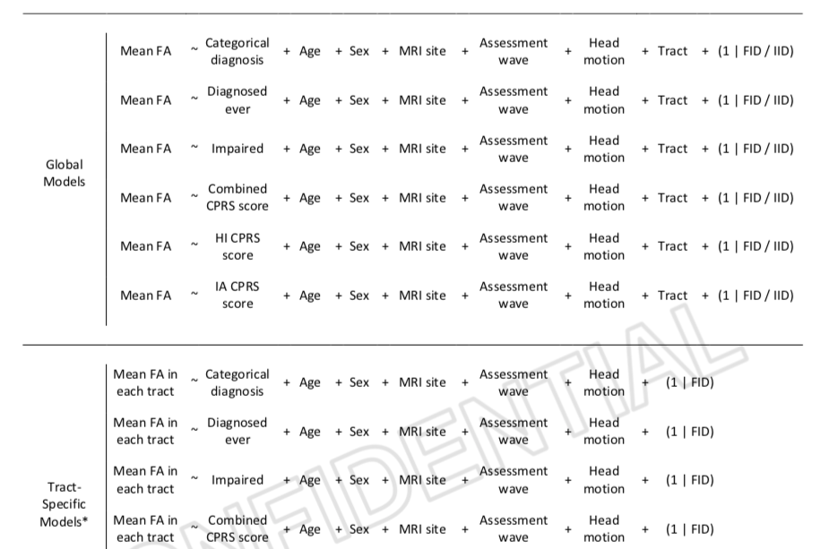
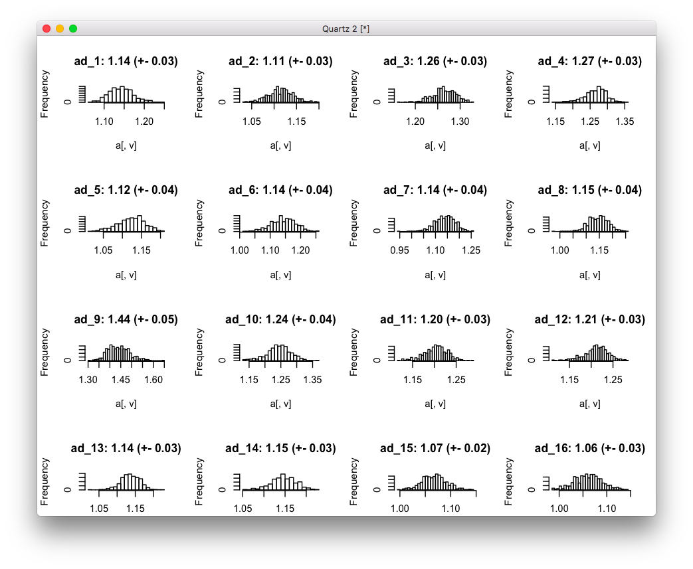
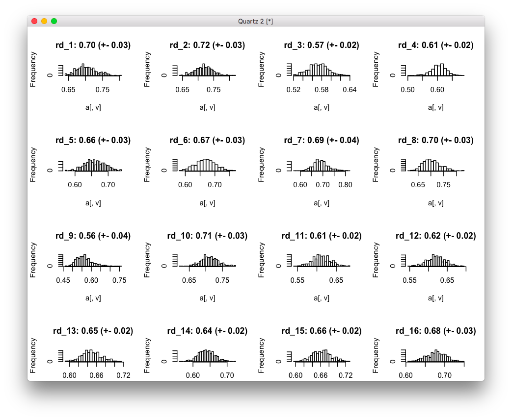
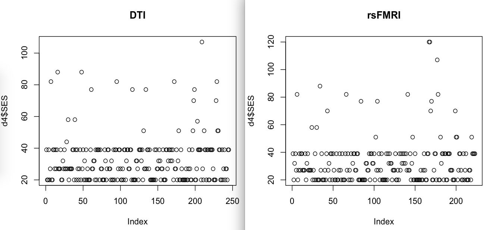

# 2020-04-16 19:37:36

Based on my chat with Philip:

```
I think the substantive things will be (1) looking at the overlap between ENIGMA QC protocols and ours- how many subjects would be retained by both; (2) combining R+L (at least for DTI)- maybe for rsfMRI; (3) doing the flow chart of how we rejected so many - so how many were rejected due to qc, how many sibs we lost because of this - having one bad scan sometimes meant we lost that subject and also their subs---and how many due to being not the best per family etc
```

And there's a summary file in
data/heritability_change_rev/reviewer_SOBP_comments.docx. Also, Philip thinks
this is a good idea to sumarize the models:



Let's first tacle the ENIGMA QC comparison:

Numbers DTI:

```r
b = read.csv('/Volumes/Shaw/MasterQC/master_qc_20190314.csv')
a = read.csv('~/data/heritability_change/ready_1020.csv')
m = merge(a, b, by.y='Mask.ID', by.x='Mask.ID...Scan', all.x=F)

# restrict based on QC
qc_vars = c("meanX.trans", "meanY.trans", "meanZ.trans",
            "meanX.rot", "meanY.rot", "meanZ.rot",
            "goodVolumes")
m = m[m$"age_at_scan...Scan...Subjects" < 18, ]
m = m[m$"goodVolumes" <= 61, ]
m = m[m$"numVolumes" < 80, ]

m$FAMID = m$Extended.ID...FamilyIDs
idx = is.na(m$FAMID)
m[idx,]$FAMID = m[idx,]$Nuclear.ID...FamilyIDs
source('~/research_code/lab_mgmt/merge_on_closest_date.R')
clin = read.csv('~/data/heritability_change/clinical_09182019.csv')
df = mergeOnClosestDate(m, clin,
                        unique(m$Medical.Record...MRN...Subjects),
                         x.date='record.date.collected...Scan',
                         x.id='Medical.Record...MRN...Subjects')
mres = df
mres$SX_HI = as.numeric(as.character(mres$SX_hi))
mres$SX_inatt = as.numeric(as.character(mres$SX_inatt))
mres$DX = NA
for (r in 1:nrow(mres)) {
    if (mres[r, 'age_at_scan...Scan...Subjects'] < 16) {
        if ((mres[r, 'SX_HI'] >= 6) || (mres[r, 'SX_inatt'] >= 6)) {
            mres[r, 'DX'] = 'ADHD'
        } else {
            mres[r, 'DX'] = 'NV'
        }
    } else {
        if ((mres[r, 'SX_HI'] >= 5) || (mres[r, 'SX_inatt'] >= 5)) {
            mres[r, 'DX'] = 'ADHD'
        } else {
            mres[r, 'DX'] = 'NV'
        }
    }
}
m=mres

print(sprintf('Start with < 18 scans: %d scans, %d subjects, %d families, %d ADHD',
              nrow(m), length(unique(m$Medical.Record...MRN...Subjects)),
              length(unique(m$FAMID)), sum(m$DX=='ADHD')))
```
[1] "Start with < 18 scans: 954 scans, 299 subjects, 215 families, 424 ADHD"

```r
library(solitude)
iso <- isolationForest$new()
iso$fit(m[, qc_vars])
scores_if = as.matrix(iso$scores)[,3]
library(dbscan)
# here I set the number of neighbors to a percentage of the total data
scores_lof = lof(m[, qc_vars], k = round(.5 * nrow(m)))

qtile=.95
thresh_lof = quantile(scores_lof, qtile)
thresh_if = quantile(scores_if, qtile)
idx = scores_lof < thresh_lof & scores_if < thresh_if

print(sprintf('After qc_vars OD: %d scans, %d subjects, %d families, %d ADHD',
              nrow(m[idx,]), length(unique(m[idx,]$Medical.Record...MRN...Subjects)),
              length(unique(m[idx,]$FAMID)), sum(m[idx,]$DX=='ADHD')))
```

[1] "After qc_vars OD: 879 scans, 297 subjects, 214 families, 380 ADHD"

```r
tracts = read.csv('~/data/heritability_change/jhu_tracts_1020.csv')
# somehow I have two entries for 1418?
x = duplicated(tracts$id)
data = merge(m[idx,], tracts[!x, ], by.x='Mask.ID...Scan', by.y='id')
tract_names = colnames(tracts)[grepl(colnames(tracts), pattern="^ad") | 
                                grepl(colnames(tracts), pattern="^rd")]

iso <- isolationForest$new()
iso$fit(data[, tract_names])
scores_if = as.matrix(iso$scores)[,3]
scores_lof = lof(data[, tract_names], k = round(.5 * nrow(data)))

thresh_lof = quantile(scores_lof, qtile)
thresh_if = quantile(scores_if, qtile)
idx = scores_lof < thresh_lof & scores_if < thresh_if

print(sprintf('After tract OD: %d scans, %d subjects, %d families, %d ADHD',
              nrow(data[idx,]),
              length(unique(data[idx,]$Medical.Record...MRN...Subjects)),
              length(unique(data[idx,]$FAMID)),
              sum(data[idx,]$DX=='ADHD')))
```

[1] "After tract OD: 815 scans, 295 subjects, 213 families, 354 ADHD"

```r
num_scans = 2  # number of scans to select
data$scores = scores_lof
a = data[idx, ]
# removing people with less than num_scans scans
idx = which(table(a$Medical.Record...MRN)>=num_scans)
long_subjs = names(table(a$Medical.Record...MRN))[idx]
keep_me = c()
for (m in 1:nrow(a)) {
    if (a[m, ]$Medical.Record...MRN %in% long_subjs) {
        keep_me = c(keep_me, m)
    }
}
a = a[keep_me,]

print(sprintf('After removing kids with only 1 scan: %d scans, %d subjects, %d families, %d ADHD',
              nrow(a),
              length(unique(a$Medical.Record...MRN...Subjects)),
              length(unique(a$FAMID)),
              sum(a$DX=='ADHD')))
```

[1] "After removing kids with only 1 scan: 774 scans, 254 subjects, 186
families, 337 ADHD"

```r
keep_me = c()
for (s in unique(a$Medical.Record...MRN)) {
    found = F
    subj_idx = which(a$Medical.Record...MRN==s)
    subj_scans = a[subj_idx, ]
    dates = as.Date(as.character(subj_scans$"record.date.collected...Scan"),
                                    format="%m/%d/%Y")
    best_scans = sort(subj_scans$scores, index.return=T)
    # make sure they are at least 6 months apart. This is the idea:
    # grab the best X scans. Check the time difference between them.
    # Any time the time difference is not enough, remove the worse
    # scan and replace by the next in line. Keep doing this until
    # the time difference is enough between all scans, or we run out
    # of scans
    cur_scan = 1
    last_scan = num_scans
    cur_choice = best_scans$ix[cur_scan:last_scan]
    while (!found && last_scan <= nrow(subj_scans)) {
        time_diffs = abs(diff(dates[cur_choice]))
        if (all(time_diffs > 180)) {
            found = TRUE
        } else {
            # figure out which scan to remove. If there is more than one
            # to be removed, it will be taken care in the next iteration
            bad_diff = which.min(time_diffs)
            if (subj_scans$scores[cur_choice[bad_diff]] >
                subj_scans$scores[cur_choice[bad_diff + 1]]) {
                rm_scan = cur_choice[bad_diff]
            } else {
                rm_scan = cur_choice[bad_diff + 1]
            }
            last_scan = last_scan + 1
            if (last_scan <= nrow(subj_scans)) {
                cur_choice[cur_choice == rm_scan] = best_scans$ix[last_scan]
            }
        }
    }
    if (found) {
        keep_me = c(keep_me, subj_idx[cur_choice])
    }
}
filtered_data = a[keep_me, ]

a = filtered_data
print(sprintf('After keeping 2 best scans: %d scans, %d subjects, %d families, %d ADHD',
              nrow(a),
              length(unique(a$Medical.Record...MRN...Subjects)),
              length(unique(a$FAMID)),
              sum(a$DX=='ADHD')))
```

[1] "After keeping 2 best scans: 504 scans, 252 subjects, 185 families, 213
ADHD"

Let's give the mean and sd of each qc var and tract_var, and then make
histograms of the tract_vars ala ENIGMA. Or, even better, show that the scans
that stayed are better than the ones that were removed?

```r
for (v in qc_vars) {
    print(sprintf('%s: %.2f (+- %.2f)', v, mean(a[, v]), sd(a[, v])))
}
```
[1] "meanX.trans: 0.18 (+- 0.13)"
[1] "meanY.trans: 0.38 (+- 0.23)"
[1] "meanZ.trans: 0.82 (+- 0.77)"
[1] "meanX.rot: 0.01 (+- 0.01)"
[1] "meanY.rot: 0.01 (+- 0.00)"
[1] "meanZ.rot: 0.00 (+- 0.00)"
[1] "goodVolumes: 59.67 (+- 1.55)"

```r
mres$kept = F
mres[mres$Mask.ID...Scan %in% a$Mask.ID...Scan, 'kept'] = T
for (v in qc_vars) {
    print(v)
    print(t.test(mres[mres$kept==T,v], mres[mres$kept==F,v]))
}
```

```
[1] "meanX.trans"

        Welch Two Sample t-test

data:  mres[mres$kept == T, v] and mres[mres$kept == F, v]
t = -3.901, df = 628.93, p-value = 0.0001061
alternative hypothesis: true difference in means is not equal to 0
95 percent confidence interval:
 -0.08156248 -0.02694185
sample estimates:
mean of x mean of y
0.1752001 0.2294523

[1] "meanY.trans"

        Welch Two Sample t-test

data:  mres[mres$kept == T, v] and mres[mres$kept == F, v]
t = -4.597, df = 532.29, p-value = 5.36e-06
alternative hypothesis: true difference in means is not equal to 0
95 percent confidence interval:
 -0.23135628 -0.09282376
sample estimates:
mean of x mean of y
0.3809131 0.5430031

[1] "meanZ.trans"

        Welch Two Sample t-test

data:  mres[mres$kept == T, v] and mres[mres$kept == F, v]
t = -4.4124, df = 601.88, p-value = 1.211e-05
alternative hypothesis: true difference in means is not equal to 0
95 percent confidence interval:
 -0.5710976 -0.2192998
sample estimates:
mean of x mean of y
0.8158318 1.2110305

[1] "meanX.rot"

        Welch Two Sample t-test

data:  mres[mres$kept == T, v] and mres[mres$kept == F, v]
t = -5.1882, df = 587.54, p-value = 2.927e-07
alternative hypothesis: true difference in means is not equal to 0
95 percent confidence interval:
 -0.010936408 -0.004930128
sample estimates:
 mean of x  mean of y
0.01289131 0.02082458

[1] "meanY.rot"

        Welch Two Sample t-test

data:  mres[mres$kept == T, v] and mres[mres$kept == F, v]
t = -3.4931, df = 717.9, p-value = 0.0005068
alternative hypothesis: true difference in means is not equal to 0
95 percent confidence interval:
 -0.0022381101 -0.0006274993
sample estimates:
  mean of x   mean of y
0.005377990 0.006810794

[1] "meanZ.rot"

        Welch Two Sample t-test

data:  mres[mres$kept == T, v] and mres[mres$kept == F, v]
t = -4.6084, df = 582.23, p-value = 4.989e-06
alternative hypothesis: true difference in means is not equal to 0
95 percent confidence interval:
 -0.003341304 -0.001344337
sample estimates:
  mean of x   mean of y
0.004142585 0.006485405

[1] "goodVolumes"

        Welch Two Sample t-test

data:  mres[mres$kept == T, v] and mres[mres$kept == F, v]
t = 6.9631, df = 561.16, p-value = 9.338e-12
alternative hypothesis: true difference in means is not equal to 0
95 percent confidence interval:
 1.029921 1.839285
sample estimates:
mean of x mean of y
  59.6746   58.2400
```

```r
a = read.csv('~/data/heritability_change_rev/dti_JHUtracts_ADRDonly_OD0.95_twoTimePoints_noOtherDX.csv')
tract_names = colnames(a)[grepl(colnames(a), pattern="^ad")]
par(mfrow=c(5, 4))
for (v in tract_names) {
    t_str = sprintf('%s: %.2f (+- %.2f)', v, mean(a[, v]), sd(a[, v]))
    hist(a[, v], breaks=25, main=t_str)
}
tract_names = colnames(a)[grepl(colnames(a), pattern="^rd")]
par(mfrow=c(5, 4))
for (v in tract_names) {
    t_str = sprintf('%s: %.2f (+- %.2f)', v, mean(a[, v]), sd(a[, v]))
    hist(a[, v], breaks=25, main=t_str)
}
```





# 2020-04-17 14:09:50

Some fMRI reconstruction:

```r
qtile = .95

demo = read.csv('~/data/heritability_change/resting_demo_07032019.csv')
cat(sprintf('Starting from %d scans\n', nrow(demo)))

# keeping it to kids only to make sure everyone has been processed
demo = demo[demo$age_at_scan < 18, ]
cat(sprintf('Down to %d to keep < 18 only\n', nrow(demo)))

print(sprintf('Start with < 18 scans: %d scans, %d subjects',
              nrow(demo), length(unique(demo$Medical.Record...MRN))))
```

[1] "Start with < 18 scans: 1306 scans, 497 subjects"

```r
mydir = '/Volumes/Shaw/rsfmri_36P/xcpengine_output_fc-36p_despike/'
qc_data = c()
for (s in demo$Mask.ID) {
    subj = sprintf('sub-%04d', s)
    # if it processed all the way
    std_fname = sprintf('%s/%s/norm/%s_std.nii.gz', mydir, subj, subj)
    if (file.exists(std_fname)) {
        subj_data = read.csv(sprintf('%s/%s/%s_quality.csv', mydir, subj, subj))
        qc_data = rbind(qc_data, subj_data)
    }
}

# have some higly correlated qc variables, so let's remove the worse offenders (anything above abs(.8))
qc_vars = c('normCoverage', 'meanDV', 'pctSpikesDV',
            'motionDVCorrInit',
            'motionDVCorrFinal', "pctSpikesRMS", "relMeanRMSMotion")

library(solitude)
iso <- isolationForest$new()
iso$fit(qc_data[, qc_vars])
scores_if = as.matrix(iso$scores)[,3]

library(dbscan)
# here I set the number of neighbors to a percentage of the total data
scores_lof = lof(qc_data[, qc_vars], k = round(.5 * nrow(qc_data)))

thresh_lof = quantile(scores_lof, qtile)
thresh_if = quantile(scores_if, qtile)

idx = scores_lof < thresh_lof & scores_if < thresh_if

qc_data_clean = qc_data[idx, ]
qc_data_clean$mask.id = as.numeric(gsub(qc_data_clean$id0,
                                        pattern='sub-', replacement=''))

df = merge(qc_data_clean, demo, by.x='mask.id', by.y='Mask.ID', all.x=T, all.y=F)

print(sprintf('After QC OD: %d scans, %d subjects',
              nrow(df), length(unique(df$Medical.Record...MRN))))
```

[1] "After QC OD: 662 scans, 296 subjects"

```r
nrois = 100

fname = sprintf('~/research_code/fmri/Schaefer2018_%dParcels_7Networks_order.txt',
                nrois)
nets = read.table(fname)
all_net_names = sapply(as.character(unique(nets[,2])),
                       function(y) strsplit(x=y, split='_')[[1]][3])
net_names = unique(all_net_names)
nnets = length(net_names)

# figure out which connection goes to which network
cat('Creating connection map...\n')
nverts = nrow(nets)
cnt = 1
conn_map = c()
for (i in 1:(nverts-1)) {
    for (j in (i+1):nverts) {
        conn = sprintf('conn%d', cnt)
        conn_map = rbind(conn_map, c(conn, all_net_names[i], all_net_names[j]))
        cnt = cnt + 1
    }
}

qc_data_clean = qc_data[idx, ]
fc = c()
for (s in qc_data_clean$id0) {
    fname = sprintf('%s/%s/fcon/schaefer%d/%s_schaefer%d_network.txt',
                                mydir, s, nrois, s, nrois)
    subj_data = read.table(fname)[, 1]
    fc = cbind(fc, subj_data)
}
fc = t(fc)
var_names = sapply(1:ncol(fc), function(x) sprintf('conn%d', x))
colnames(fc) = var_names

fc[abs(fc) > .21] = 1
fc[fc < 1] = 0

net_dataP = c()
header = c()
for (i in 1:nnets) {
    for (j in i:nnets) {
        cat(sprintf('Evaluating connections from %s to %s\n',
                    net_names[i], net_names[j]))
        idx = (conn_map[,2]==net_names[i] & conn_map[,3]==net_names[j]) |
            (conn_map[,3]==net_names[i] & conn_map[,2]==net_names[j])
        res = apply(fc[, var_names[idx]], 1, sum, na.rm=T)
        net_dataP = cbind(net_dataP, res)
        header = c(header, sprintf('conn_%sTO%s', net_names[i],
                                                net_names[j]))
    }
}
colnames(net_dataP) = header
rownames(net_dataP) = qc_data_clean$id0

var_names = c("conn_DorsAttnTODorsAttn", "conn_DorsAttnTOSalVentAttn",
              "conn_DorsAttnTOCont", "conn_DorsAttnTODefault", "conn_SalVentAttnTOSalVentAttn", "conn_SalVentAttnTOCont",
              "conn_SalVentAttnTODefault", "conn_ContTOCont",
              "conn_ContTODefault", "conn_DefaultTODefault")

iso <- isolationForest$new()
iso$fit(as.data.frame(net_dataP[, var_names]))
scores_if = as.matrix(iso$scores)[,3]
scores_lof = lof(net_dataP[, var_names], k = round(.5 * nrow(net_dataP)))

thresh_lof = quantile(scores_lof, qtile)
thresh_if = quantile(scores_if, qtile)

idx = scores_lof < thresh_lof & scores_if < thresh_if
data = cbind(qc_data_clean[, c('id0', qc_vars)], net_dataP)
data = data[idx, ]

data$mask.id = as.numeric(gsub(data$id0, pattern='sub-', replacement=''))

df = merge(data, demo, by.x='mask.id', by.y='Mask.ID', all.x=T, all.y=F)

print(sprintf('After brain var OD: %d scans, %d subjects',
              nrow(df), length(unique(df$Medical.Record...MRN))))
```

[1] "After brain var OD: 610 scans, 291 subjects"

```r
num_scans = 2  # number of scans to select
df$scores = scores_lof[idx]

# removing people with less than num_scans scans
idx = which(table(df$Medical.Record...MRN)>=num_scans)
long_subjs = names(table(df$Medical.Record...MRN))[idx]
keep_me = c()
for (m in 1:nrow(df)) {
    if (df[m, ]$Medical.Record...MRN %in% long_subjs) {
        keep_me = c(keep_me, m)
    }
}
df = df[keep_me,]
print(sprintf('After removing subjects with one scan only: %s scans, %d subjects',
              nrow(df), length(unique(df$Medical.Record...MRN))))
```

[1] "After removing subjects with one scan only: 546 scans, 227 subjects"

```r
keep_me = c()
for (s in unique(df$Medical.Record...MRN)) {
    found = F
    subj_idx = which(df$Medical.Record...MRN==s)
    subj_scans = df[subj_idx, ]
    dates = as.Date(as.character(subj_scans$"record.date.collected...Scan"),
                                    format="%m/%d/%Y")
    best_scans = sort(subj_scans$scores, index.return=T)
    # make sure they are at least 6 months apart. This is the idea:
    # grab the best X scans. Check the time difference between them.
    # Any time the time difference is not enough, remove the worse
    # scan and replace by the next in line. Keep doing this until
    # the time difference is enough between all scans, or we run out
    # of scans
    cur_scan = 1
    last_scan = num_scans
    cur_choice = best_scans$ix[cur_scan:last_scan]
    while (!found && last_scan <= nrow(subj_scans)) {
        time_diffs = abs(diff(dates[cur_choice]))
        if (all(time_diffs > 180)) {
            found = TRUE
        } else {
            # figure out which scan to remove. If there is more than one
            # to be removed, it will be taken care in the next iteration
            bad_diff = which.min(time_diffs)
            if (subj_scans$scores[cur_choice[bad_diff]] >
                subj_scans$scores[cur_choice[bad_diff + 1]]) {
                rm_scan = cur_choice[bad_diff]
            } else {
                rm_scan = cur_choice[bad_diff + 1]
            }
            last_scan = last_scan + 1
            if (last_scan <= nrow(subj_scans)) {
                cur_choice[cur_choice == rm_scan] = best_scans$ix[last_scan]
            }
        }
    }
    if (found) {
        keep_me = c(keep_me, subj_idx[cur_choice])
    }
}
filtered_data = df[keep_me, ]
print(sprintf('After keeping 2 best: %s scans, %d subjects',
              nrow(filtered_data),
              length(unique(filtered_data$Medical.Record...MRN))))
```

[1] "After keeping 2 best: 452 scans, 226 subjects"

And we can run the same t-tests as we did for DTI:

```r
mydir = '/Volumes/Shaw/rsfmri_36P/xcpengine_output_fc-36p_despike/'
qc_data = c()
for (s in demo$Mask.ID) {
    subj = sprintf('sub-%04d', s)
    # if it processed all the way
    std_fname = sprintf('%s/%s/norm/%s_std.nii.gz', mydir, subj, subj)
    if (file.exists(std_fname)) {
        subj_data = read.csv(sprintf('%s/%s/%s_quality.csv', mydir, subj, subj))
        qc_data = rbind(qc_data, subj_data)
    }
}
qc_data$mask.id = as.numeric(gsub(qc_data$id0, pattern='sub-', replacement=''))
qc_data$kept = F
qc_data[qc_data$mask.id %in% filtered_data$mask.id, 'kept'] = T
for (v in qc_vars) {
    print(v)
    print(t.test(qc_data[qc_data$kept==T,v],
                 qc_data[qc_data$kept==F,v]))
}
```

```
[1] "normCoverage"

        Welch Two Sample t-test

data:  qc_data[qc_data$kept == T, v] and qc_data[qc_data$kept == F, v]
t = 3.2079, df = 401.28, p-value = 0.001444
alternative hypothesis: true difference in means is not equal to 0
95 percent confidence interval:
 0.001423151 0.005928369
sample estimates:
mean of x mean of y
0.9788721 0.9751963

[1] "meanDV"

        Welch Two Sample t-test

data:  qc_data[qc_data$kept == T, v] and qc_data[qc_data$kept == F, v]
t = -2.174, df = 551.74, p-value = 0.03013
alternative hypothesis: true difference in means is not equal to 0
95 percent confidence interval:
 -0.041358961 -0.002096491
sample estimates:
mean of x mean of y
 1.081117  1.102845

[1] "pctSpikesDV"

        Welch Two Sample t-test

data:  qc_data[qc_data$kept == T, v] and qc_data[qc_data$kept == F, v]
t = -3.3329, df = 500.57, p-value = 0.000923
alternative hypothesis: true difference in means is not equal to 0
95 percent confidence interval:
 -0.029178832 -0.007535926
sample estimates:
 mean of x  mean of y
0.06299038 0.08134776

[1] "motionDVCorrInit"

        Welch Two Sample t-test

data:  qc_data[qc_data$kept == T, v] and qc_data[qc_data$kept == F, v]
t = -3.3506, df = 532.89, p-value = 0.0008634
alternative hypothesis: true difference in means is not equal to 0
95 percent confidence interval:
 -0.07298044 -0.01903399
sample estimates:
mean of x mean of y
0.5444068 0.5904140

[1] "motionDVCorrFinal"

        Welch Two Sample t-test

data:  qc_data[qc_data$kept == T, v] and qc_data[qc_data$kept == F, v]
t = -0.90066, df = 538.32, p-value = 0.3682
alternative hypothesis: true difference in means is not equal to 0
95 percent confidence interval:
 -0.03318850  0.01232214
sample estimates:
mean of x mean of y
0.3334610 0.3438941

[1] "pctSpikesRMS"

        Welch Two Sample t-test

data:  qc_data[qc_data$kept == T, v] and qc_data[qc_data$kept == F, v]
t = -3.8762, df = 482.28, p-value = 0.0001208
alternative hypothesis: true difference in means is not equal to 0
95 percent confidence interval:
 -0.1286172 -0.0420862
sample estimates:
mean of x mean of y
0.2947551 0.3801068

[1] "relMeanRMSMotion"

        Welch Two Sample t-test

data:  qc_data[qc_data$kept == T, v] and qc_data[qc_data$kept == F, v]
t = -5.0948, df = 299.38, p-value = 6.191e-07
alternative hypothesis: true difference in means is not equal to 0
95 percent confidence interval:
 -0.4759653 -0.2107258
sample estimates:
mean of x mean of y
0.3155604 0.6589060
```

Didn't work for all of them, and wilcox didn't help either.

## Testing AD/RD variable normality

Let's run some test of normality in our AD/RD variables like ENIGMA:

```r
a = read.csv('~/data/heritability_change_rev/dti_JHUtracts_ADRDonly_OD0.95_twoTimePoints_noOtherDX.csv')
tract_names = colnames(a)[grepl(colnames(a), pattern="^ad")]
for (v in tract_names) {
    print(shapiro.test(a[, v]))
}
```

Actually, that didn't turn out favorably. Several variables are not normal,
which is fine. There are no huge outliers either, and the ENIGMA protocol has no
formal test of normality. Only visual inspection of the histograms, which we
did.

# 2020-04-18 07:41:32

Let's see how the results look like if we combine left and right hemispheres for
DTI. That's already done for rsFMRI. I'll try it before and after QC to see the
impacts. Let's do after first, which is easier.

But for the record, I don't agree with the reviewer that the results are
symetric... just looking at eTable2 at the h2r one can tell that... but maybe it
will reduce our number of comparison, and we would be able to do FDR differently
and therefore address the FDR .1 question?

Here's the map of connections to numbers again:

```
1. Anterior thalamic radiation L
2. Anterior thalamic radiation R
3. Corticospinal tract L
4. Corticospinal tract R
5. Cingulum (cingulate gyrus) L
6. Cingulum (cingulate gyrus) R
7. Cingulum (hippocampus) L
8. Cingulum (hippocampus) R
9. Forceps major
10. Forceps minor
11. Inferior fronto-occipital fasciculus L
12. Inferior fronto-occipital fasciculus R
13. Inferior longitudinal fasciculus L
14. Inferior longitudinal fasciculus R
15. Superior longitudinal fasciculus L
16. Superior longitudinal fasciculus R
17. Uncinate fasciculus L
18. Uncinate fasciculus R
19. Superior longitudinal fasciculus (temporal part) L
20. Superior longitudinal fasciculus (temporal part) R
```

```bash
# local
phen=dti_JHUtracts_ADRDonly_OD0.95
cd ~/data/heritability_change_rev
for m in ad rd; do
    for t in {1..20}; do
        solar run_phen_var_OD_tracts $phen ${m}_${t};
    done;
done;
mv $phen ~/data/tmp/
cd ~/data/tmp/$phen
for p in `/bin/ls`; do cp $p/polygenic.out ${p}_polygenic.out; done
python ~/research_code/compile_solar_multivar_results.py $phen
```

The code above matches the results in the paper. Let's combine the tracts and
see how it goes.

```r
brain_data = read.csv('~/data/heritability_change_rev/dti_JHUtracts_ADRDonly_OD0.95.csv')
for (p in c('ad', 'rd')) {
    brain_data[, sprintf('ATR_%s', p)] = rowMeans(brain_data[, c(sprintf('%s_1', p),
                                                                 sprintf('%s_2', p))])
    brain_data[, sprintf('CST_%s', p)] = rowMeans(brain_data[, c(sprintf('%s_3', p),
                                                                 sprintf('%s_4', p))])
    brain_data[, sprintf('CIN_%s', p)] = rowMeans(brain_data[, c(sprintf('%s_5', p),
                                                                 sprintf('%s_6', p),
                                                                 sprintf('%s_7', p),
                                                                 sprintf('%s_8', p))])
    brain_data[, sprintf('CC_%s', p)] = rowMeans(brain_data[, c(sprintf('%s_9', p),
                                                                 sprintf('%s_10', p))])
    brain_data[, sprintf('IFO_%s', p)] = rowMeans(brain_data[, c(sprintf('%s_11', p),
                                                                 sprintf('%s_12', p))])
    brain_data[, sprintf('ILF_%s', p)] = rowMeans(brain_data[, c(sprintf('%s_13', p),
                                                                 sprintf('%s_14', p))])
    brain_data[, sprintf('SLF_%s', p)] = rowMeans(brain_data[, c(sprintf('%s_15', p),
                                                                 sprintf('%s_16', p),
                                                                 sprintf('%s_19', p),
                                                                 sprintf('%s_20', p))])
    brain_data[, sprintf('UNC_%s', p)] = rowMeans(brain_data[, c(sprintf('%s_17', p),
                                                                 sprintf('%s_18', p))])
}
write.csv(brain_data, file='~/data/heritability_change_rev/dti_JHUtractsCollapsed_ADRDonly_OD0.95.csv', row.names=F)
```

```bash
# local
phen=dti_JHUtractsCollapsed_ADRDonly_OD0.95
cd ~/data/heritability_change_rev
for m in ad rd; do
    for t in ATR CST CIN CC IFO ILF SLF UNC; do
        solar run_phen_var_OD_tracts $phen ${t}_${m};
    done;
done;
mv $phen ~/data/tmp/
cd ~/data/tmp/$phen
for p in `/bin/ls`; do cp $p/polygenic.out ${p}_polygenic.out; done
python ~/research_code/compile_solar_multivar_results.py $phen
cp ~/data/tmp/polygen_results_${phen}.csv .
```

Our main results are still there. But what survives FDR?

```r
> a = read.csv('~/data/heritability_change_rev/polygen_results_dti_JHUtractsCollapsed_ADRDonly_OD0.95.csv')
> p2 = p.adjust(a$h_pval, method='fdr')
> as.character(a[p2<.05, 'phen'])
[1] "ATR_ad" "ATR_rd" "CIN_rd" "UNC_rd"
> as.character(a[p2<.1, 'phen'])
[1] "ATR_ad" "ATR_rd" "CIN_rd" "IFO_rd" "SLF_rd" "UNC_rd"
```

We lose the SLF result at q<.05 and forceps minor (CC now) completely. We gain
IFO at q<.1. The dominance of RD over AD is still obvious. We need to check if
the regressions results still hold (likely will). I'll also try collapsing
before QC, and checking if these results impact fMRI FDR in any way.

Let's then reconstruct the fMRI results and see what the FDR looks like:

```bash
# local
cd ~/data/heritability_change_rev
phen=rsfmri_7by7from100_4nets_p05SigSum_OD0.95_12052019_clean;
for t in "conn_DorsAttnTODorsAttn" \
    "conn_DorsAttnTOSalVentAttn" "conn_DorsAttnTOCont" \
    "conn_DorsAttnTODefault" "conn_SalVentAttnTOSalVentAttn" \
    "conn_SalVentAttnTOCont" "conn_SalVentAttnTODefault" \
    "conn_ContTOCont" "conn_ContTODefault" "conn_DefaultTODefault"; do
        solar run_phen_var_OD_xcp ${phen} ${t};
done;
mv ${phen} ~/data/tmp/
cd ~/data/tmp/${phen}
for p in `/bin/ls`; do cp $p/polygenic.out ${p}_polygenic.out; done
python ~/research_code/compile_solar_multivar_results.py ${phen}
```

This recreates it. Does how does it look for an overall FDR?

```r
a = read.csv('~/data/heritability_change_rev/polygen_results_dti_JHUtractsCollapsed_ADRDonly_OD0.95.csv')
b = read.csv('~/data/heritability_change_rev/polygen_results_rsfmri_7by7from100_4nets_p05SigSum_OD0.95_12052019_clean.csv')
d = rbind(a, b)
p2 = p.adjust(d$h_pval, method='fdr')
as.character(d[p2<.05, 'phen'])
as.character(d[p2<.1, 'phen'])
```

```
> as.character(d[p2<.05, 'phen'])
[1] "ATR_rd" "UNC_rd"
> as.character(d[p2<.1, 'phen'])
[1] "ATR_ad"                     "ATR_rd"                    
[3] "CIN_rd"                     "IFO_rd"                    
[5] "SLF_rd"                     "UNC_rd"                    
[7] "conn_DorsAttnTOSalVentAttn" "conn_SalVentAttnTOCont"    
```

Not really any changes. What if I combine them prior to QC? It will likely
change our number of subjects. But anything else?

```r
b = read.csv('/Volumes/Shaw/MasterQC/master_qc_20190314.csv')
a = read.csv('~/data/heritability_change/ready_1020.csv')
m = merge(a, b, by.y='Mask.ID', by.x='Mask.ID...Scan', all.x=F)

# restrict based on QC
qc_vars = c("meanX.trans", "meanY.trans", "meanZ.trans",
            "meanX.rot", "meanY.rot", "meanZ.rot",
            "goodVolumes")
m = m[m$"age_at_scan...Scan...Subjects" < 18, ]
m = m[m$"goodVolumes" <= 61, ]
m = m[m$"numVolumes" < 80, ]

print(sprintf('Start with < 18 scans: %d scans, %d subjects',
              nrow(m), length(unique(m$Medical.Record...MRN...Subjects))))
```
[1] "Start with < 18 scans: 954 scans, 299 subjects"

```r
library(solitude)
iso <- isolationForest$new()
iso$fit(m[, qc_vars])
scores_if = as.matrix(iso$scores)[,3]
library(dbscan)
# here I set the number of neighbors to a percentage of the total data
scores_lof = lof(m[, qc_vars], k = round(.5 * nrow(m)))

qtile=.95
thresh_lof = quantile(scores_lof, qtile)
thresh_if = quantile(scores_if, qtile)
idx = scores_lof < thresh_lof & scores_if < thresh_if

print(sprintf('After qc_vars OD: %d scans, %d subjects',
              nrow(m[idx,]), length(unique(m[idx,]$Medical.Record...MRN...Subjects))))
```

[1] "After qc_vars OD: 881 scans, 297 subjects"

```r
tracts = read.csv('~/data/heritability_change/jhu_tracts_1020.csv')
# somehow I have two entries for 1418?
x = duplicated(tracts$id)
data = merge(m[idx,], tracts[!x, ], by.x='Mask.ID...Scan', by.y='id')
tract_names = colnames(tracts)[grepl(colnames(tracts), pattern="^ad") | 
                                grepl(colnames(tracts), pattern="^rd")]

iso <- isolationForest$new()
iso$fit(data[, tract_names])
scores_if = as.matrix(iso$scores)[,3]
scores_lof = lof(data[, tract_names], k = round(.5 * nrow(data)))

thresh_lof = quantile(scores_lof, qtile)
thresh_if = quantile(scores_if, qtile)
idx = scores_lof < thresh_lof & scores_if < thresh_if

print(sprintf('After tract OD: %d scans, %d subjects',
              nrow(data[idx,]),
              length(unique(data[idx,]$Medical.Record...MRN...Subjects))))
```

[1] "After tract OD: 818 scans, 292 subjects"

```r
num_scans = 2  # number of scans to select
data$scores = scores_lof
a = data[idx, ]
# removing people with less than num_scans scans
idx = which(table(a$Medical.Record...MRN)>=num_scans)
long_subjs = names(table(a$Medical.Record...MRN))[idx]
keep_me = c()
for (m in 1:nrow(a)) {
    if (a[m, ]$Medical.Record...MRN %in% long_subjs) {
        keep_me = c(keep_me, m)
    }
}
a = a[keep_me,]

print(sprintf('After removing kids with only 1 scan: %d scans, %d subjects',
              nrow(a),
              length(unique(a$Medical.Record...MRN...Subjects))))
```

[1] "After removing kids with only 1 scan: 780 scans, 254 subjects"

```r
keep_me = c()
for (s in unique(a$Medical.Record...MRN)) {
    found = F
    subj_idx = which(a$Medical.Record...MRN==s)
    subj_scans = a[subj_idx, ]
    dates = as.Date(as.character(subj_scans$"record.date.collected...Scan"),
                                    format="%m/%d/%Y")
    best_scans = sort(subj_scans$scores, index.return=T)
    # make sure they are at least 6 months apart. This is the idea:
    # grab the best X scans. Check the time difference between them.
    # Any time the time difference is not enough, remove the worse
    # scan and replace by the next in line. Keep doing this until
    # the time difference is enough between all scans, or we run out
    # of scans
    cur_scan = 1
    last_scan = num_scans
    cur_choice = best_scans$ix[cur_scan:last_scan]
    while (!found && last_scan <= nrow(subj_scans)) {
        time_diffs = abs(diff(dates[cur_choice]))
        if (all(time_diffs > 180)) {
            found = TRUE
        } else {
            # figure out which scan to remove. If there is more than one
            # to be removed, it will be taken care in the next iteration
            bad_diff = which.min(time_diffs)
            if (subj_scans$scores[cur_choice[bad_diff]] >
                subj_scans$scores[cur_choice[bad_diff + 1]]) {
                rm_scan = cur_choice[bad_diff]
            } else {
                rm_scan = cur_choice[bad_diff + 1]
            }
            last_scan = last_scan + 1
            if (last_scan <= nrow(subj_scans)) {
                cur_choice[cur_choice == rm_scan] = best_scans$ix[last_scan]
            }
        }
    }
    if (found) {
        keep_me = c(keep_me, subj_idx[cur_choice])
    }
}
filtered_data = a[keep_me, ]

a = filtered_data
print(sprintf('After keeping 2 best scans: %d scans, %d subjects',
              nrow(a),
              length(unique(a$Medical.Record...MRN...Subjects))))
```

[1] "After keeping 2 best scans: 504 scans, 252 subjects"

Those are the correct numbers that should go in the figure. The numbers form
before likely had some glitch when I combined the clinical data to early. The
final result is the same though.

Now, let's change the analysis variables:

```r
tracts = read.csv('~/data/heritability_change/jhu_tracts_1020.csv')
# somehow I have two entries for 1418?
x = duplicated(tracts$id)
brain_data = merge(m[idx,], tracts[!x, ], by.x='Mask.ID...Scan', by.y='id')
tract_names = c()
for (p in c('ad', 'rd')) {
    brain_data[, sprintf('ATR_%s', p)] = rowMeans(brain_data[, c(sprintf('%s_1', p),
                                                                 sprintf('%s_2', p))])
    brain_data[, sprintf('CST_%s', p)] = rowMeans(brain_data[, c(sprintf('%s_3', p),
                                                                 sprintf('%s_4', p))])
    brain_data[, sprintf('CIN_%s', p)] = rowMeans(brain_data[, c(sprintf('%s_5', p),
                                                                 sprintf('%s_6', p),
                                                                 sprintf('%s_7', p),
                                                                 sprintf('%s_8', p))])
    brain_data[, sprintf('CC_%s', p)] = rowMeans(brain_data[, c(sprintf('%s_9', p),
                                                                 sprintf('%s_10', p))])
    brain_data[, sprintf('IFO_%s', p)] = rowMeans(brain_data[, c(sprintf('%s_11', p),
                                                                 sprintf('%s_12', p))])
    brain_data[, sprintf('ILF_%s', p)] = rowMeans(brain_data[, c(sprintf('%s_13', p),
                                                                 sprintf('%s_14', p))])
    brain_data[, sprintf('SLF_%s', p)] = rowMeans(brain_data[, c(sprintf('%s_15', p),
                                                                 sprintf('%s_16', p),
                                                                 sprintf('%s_19', p),
                                                                 sprintf('%s_20', p))])
    brain_data[, sprintf('UNC_%s', p)] = rowMeans(brain_data[, c(sprintf('%s_17', p),
                                                                 sprintf('%s_18', p))])
    tract_names = c(tract_names, 
                    sapply(c('ATR', 'CST', 'CIN', 'CC', 'IFO', 'ILF', 'SLF', 'UNC'),
                           function(x) sprintf('%s_%s', x, p)))
}
data = brain_data
iso <- isolationForest$new()
iso$fit(data[, tract_names])
scores_if = as.matrix(iso$scores)[,3]
scores_lof = lof(data[, tract_names], k = round(.5 * nrow(data)))

thresh_lof = quantile(scores_lof, qtile)
thresh_if = quantile(scores_if, qtile)
idx = scores_lof < thresh_lof & scores_if < thresh_if

# print(sprintf('After tract OD: %d scans, %d subjects',
#               nrow(data[idx,]),
#               length(unique(data[idx,]$Medical.Record...MRN...Subjects))))

num_scans = 2  # number of scans to select
data$scores = scores_lof
a = data[idx, ]
# removing people with less than num_scans scans
idx = which(table(a$Medical.Record...MRN)>=num_scans)
long_subjs = names(table(a$Medical.Record...MRN))[idx]
keep_me = c()
for (m in 1:nrow(a)) {
    if (a[m, ]$Medical.Record...MRN %in% long_subjs) {
        keep_me = c(keep_me, m)
    }
}
a = a[keep_me,]

# print(sprintf('After removing kids with only 1 scan: %d scans, %d subjects',
#               nrow(a),
#               length(unique(a$Medical.Record...MRN...Subjects))))

keep_me = c()
for (s in unique(a$Medical.Record...MRN)) {
    found = F
    subj_idx = which(a$Medical.Record...MRN==s)
    subj_scans = a[subj_idx, ]
    dates = as.Date(as.character(subj_scans$"record.date.collected...Scan"),
                                    format="%m/%d/%Y")
    best_scans = sort(subj_scans$scores, index.return=T)
    # make sure they are at least 6 months apart. This is the idea:
    # grab the best X scans. Check the time difference between them.
    # Any time the time difference is not enough, remove the worse
    # scan and replace by the next in line. Keep doing this until
    # the time difference is enough between all scans, or we run out
    # of scans
    cur_scan = 1
    last_scan = num_scans
    cur_choice = best_scans$ix[cur_scan:last_scan]
    while (!found && last_scan <= nrow(subj_scans)) {
        time_diffs = abs(diff(dates[cur_choice]))
        if (all(time_diffs > 180)) {
            found = TRUE
        } else {
            # figure out which scan to remove. If there is more than one
            # to be removed, it will be taken care in the next iteration
            bad_diff = which.min(time_diffs)
            if (subj_scans$scores[cur_choice[bad_diff]] >
                subj_scans$scores[cur_choice[bad_diff + 1]]) {
                rm_scan = cur_choice[bad_diff]
            } else {
                rm_scan = cur_choice[bad_diff + 1]
            }
            last_scan = last_scan + 1
            if (last_scan <= nrow(subj_scans)) {
                cur_choice[cur_choice == rm_scan] = best_scans$ix[last_scan]
            }
        }
    }
    if (found) {
        keep_me = c(keep_me, subj_idx[cur_choice])
    }
}
filtered_data = a[keep_me, ]

source('~/research_code/lab_mgmt/merge_on_closest_date.R')

clin = read.csv('~/data/heritability_change/clinical_09182019.csv')
df = mergeOnClosestDate(filtered_data, clin,
                        unique(filtered_data$Medical.Record...MRN...Subjects),
                         x.date='record.date.collected...Scan',
                         x.id='Medical.Record...MRN...Subjects')
mres = df
mres$SX_HI = as.numeric(as.character(mres$SX_hi))
mres$SX_inatt = as.numeric(as.character(mres$SX_inatt))

res = c()
for (s in unique(mres$Medical.Record...MRN...Subjects)) {
    idx = which(mres$Medical.Record...MRN...Subjects == s)
    row = c(s, unique(mres[idx, 'Sex...Subjects']))
    y = mres[idx[2], c(tract_names, qc_vars)] - mres[idx[1], c(tract_names, qc_vars)]
    x = mres[idx[2], 'age_at_scan...Scan...Subjects'] - mres[idx[1], 'age_at_scan...Scan...Subjects']
    slopes = y / x
    row = c(row, slopes)
    for (t in c('SX_inatt', 'SX_HI')) {
        fm_str = sprintf('%s ~ age_at_scan...Scan...Subjects', t)
        fit = lm(as.formula(fm_str), data=mres[idx, ], na.action=na.exclude)
        row = c(row, coefficients(fit)[2])
    }
    # grabbing inatt and HI at baseline
    base_DOA = which.min(mres[idx, 'age_at_scan...Scan...Subjects'])
    row = c(row, mres[idx[base_DOA], tract_names])
    row = c(row, mres[idx[base_DOA], 'SX_inatt'])
    row = c(row, mres[idx[base_DOA], 'SX_HI'])
    # DX1 is DSMV definition, DX2 will make SX >=4 as ADHD
    if (mres[idx[base_DOA], 'age_at_scan...Scan...Subjects'] < 16) {
        if ((row[length(row)] >= 6) || (row[length(row)-1] >= 6)) {
            DX = 'ADHD'
        } else {
            DX = 'NV'
        }
    } else {
        if ((row[length(row)] >= 5) || (row[length(row)-1] >= 5)) {
            DX = 'ADHD'
        } else {
            DX = 'NV'
        }
    }
    if ((row[length(row)] >= 4) || (row[length(row)-1] >= 4)) {
        DX2 = 'ADHD'
    } else {
        DX2 = 'NV'
    }
    row = c(row, DX)
    row = c(row, DX2)
    res = rbind(res, row)
    print(nrow(res))
}
tract_base = sapply(tract_names, function(x) sprintf('%s_baseline', x))
colnames(res) = c('ID', 'sex', tract_names, qc_vars, c('SX_inatt', 'SX_HI',
                                              tract_base,
                                              'inatt_baseline',
                                              'HI_baseline',
                                              'DX', 'DX2'))
write.csv(res, file='~/tmp/dti_JHUtractsCollapsedBeforeQC_ADRDonly_OD0.95.csv',
          row.names=F, na='', quote=F)
```

Now let's see if it changes our heritability estimates:

```bash
# local
phen=dti_JHUtractsCollapsedBeforeQC_ADRDonly_OD0.95
cd ~/data/heritability_change_rev
for m in ad rd; do
    for t in ATR CST CIN CC IFO ILF SLF UNC; do
        solar run_phen_var_OD_tracts $phen ${t}_${m};
    done;
done;
mv $phen ~/data/tmp/
cd ~/data/tmp/$phen
for p in `/bin/ls`; do cp $p/polygenic.out ${p}_polygenic.out; done
python ~/research_code/compile_solar_multivar_results.py $phen
```

Our main results are still there. But what survives FDR?

```r
a = read.csv('~/data/heritability_change_rev/polygen_results_dti_JHUtractsCollapsedBeforeQC_ADRDonly_OD0.95.csv')
p2 = p.adjust(a$h_pval, method='fdr')
as.character(a[p2<.05, 'phen'])
as.character(a[p2<.1, 'phen'])
b = read.csv('~/data/heritability_change_rev/polygen_results_rsfmri_7by7from100_4nets_p05SigSum_OD0.95_12052019_clean.csv')
d = rbind(a, b)
p2 = p.adjust(d$h_pval, method='fdr')
as.character(d[p2<.05, 'phen'])
as.character(d[p2<.1, 'phen'])
```

```
DTI
> as.character(a[p2<.05, 'phen'])
[1] "ATR_rd" "SLF_rd" "UNC_rd"
> as.character(a[p2<.1, 'phen'])
[1] "ATR_ad" "ATR_rd" "CIN_ad" "CIN_rd" "IFO_rd" "SLF_rd" "UNC_rd"

DTI and FMRI:
> as.character(d[p2<.05, 'phen'])
[1] "UNC_rd"
> as.character(d[p2<.1, 'phen'])
[1] "ATR_ad"                     "ATR_rd"                    
[3] "CIN_ad"                     "CIN_rd"                    
[5] "IFO_rd"                     "SLF_rd"                    
[7] "UNC_rd"                     "conn_DorsAttnTOSalVentAttn"
[9] "conn_SalVentAttnTOCont"    
```

I do gain SLF back at .05, so that's nice. Need to check regression results
still.

# 2020-04-20 06:50:20

Next step is to retrieve the regression equations so we can reproduce the
results, check the values with the collapsed DTI dataset (for supplemental), and
add the other covariates the reviewers are asking for.

```r
library(nlme)
data = read.csv('~/data/heritability_change_rev/dti_JHUtracts_ADRDonly_OD0.95.csv')
tmp = read.csv('~/data/heritability_change_rev/pedigree.csv')
data = merge(data, tmp[, c('ID', 'FAMID')], by='ID', all.x=T, all.y=F)

# MANUALLY grabbing significant covariates form SOLAR results
formulas = c()
formulas = rbind(formulas, c('ad_10', '%s ~ %s + meanX.rot + goodVolumes'))
formulas = rbind(formulas, c('ad_11', '%s ~ %s + goodVolumes'))
formulas = rbind(formulas, c('ad_12', '%s ~ %s + meanX.rot + goodVolumes'))
formulas = rbind(formulas, c('ad_13', '%s ~ %s + meanX.rot + goodVolumes'))
formulas = rbind(formulas, c('ad_14', '%s ~ %s + meanX.rot'))
formulas = rbind(formulas, c('ad_15', '%s ~ %s'))
formulas = rbind(formulas, c('ad_16', '%s ~ %s'))
formulas = rbind(formulas, c('ad_17', '%s ~ %s + meanX.rot + goodVolumes'))
formulas = rbind(formulas, c('ad_18', '%s ~ %s + goodVolumes'))
formulas = rbind(formulas, c('ad_19', '%s ~ %s + meanX.trans + meanX.rot + goodVolumes'))
formulas = rbind(formulas, c('ad_1', '%s ~ %s + meanX.rot + goodVolumes'))
formulas = rbind(formulas, c('ad_20', '%s ~ %s + meanX.trans + goodVolumes'))
formulas = rbind(formulas, c('ad_2', '%s ~ %s + meanX.rot + goodVolumes'))
formulas = rbind(formulas, c('ad_3', '%s ~ %s + goodVolumes'))
formulas = rbind(formulas, c('ad_4', '%s ~ %s + meanY.trans + goodVolumes'))
formulas = rbind(formulas, c('ad_5', '%s ~ %s'))
formulas = rbind(formulas, c('ad_6', '%s ~ %s + goodVolumes'))
formulas = rbind(formulas, c('ad_7', '%s ~ %s + meanX.rot + goodVolumes'))
formulas = rbind(formulas, c('ad_8', '%s ~ %s + meanX.trans'))
formulas = rbind(formulas, c('ad_9', '%s ~ %s'))
formulas = rbind(formulas, c('rd_10', '%s ~ %s + meanZ.trans'))
formulas = rbind(formulas, c('rd_11', '%s ~ %s + meanY.trans'))
formulas = rbind(formulas, c('rd_12', '%s ~ %s + meanY.trans'))
formulas = rbind(formulas, c('rd_13', '%s ~ %s + meanX.rot'))
formulas = rbind(formulas, c('rd_14', '%s ~ %s + meanX.rot'))
formulas = rbind(formulas, c('rd_15', '%s ~ %s'))
formulas = rbind(formulas, c('rd_16', '%s ~ %s'))
formulas = rbind(formulas, c('rd_17', '%s ~ %s + meanZ.rot'))
formulas = rbind(formulas, c('rd_18', '%s ~ %s + meanX.rot + goodVolumes'))
formulas = rbind(formulas, c('rd_19', '%s ~ %s + meanX.trans + meanY.rot'))
formulas = rbind(formulas, c('rd_1', '%s ~ %s'))
formulas = rbind(formulas, c('rd_20', '%s ~ %s'))
formulas = rbind(formulas, c('rd_2', '%s ~ %s + meanY.trans + meanY.rot + goodVolumes'))
formulas = rbind(formulas, c('rd_3', '%s ~ %s'))
formulas = rbind(formulas, c('rd_4', '%s ~ %s + meanY.trans + meanY.rot + goodVolumes'))
formulas = rbind(formulas, c('rd_5', '%s ~ %s + meanY.trans + meanZ.trans + meanY.rot'))
formulas = rbind(formulas, c('rd_6', '%s ~ %s + meanY.trans'))
formulas = rbind(formulas, c('rd_7', '%s ~ %s'))
formulas = rbind(formulas, c('rd_8', '%s ~ %s + meanX.trans + meanX.rot'))
formulas = rbind(formulas, c('rd_9', '%s ~ %s + meanX.trans + meanY.rot'))

out_fname = '~/data/heritability_change_rev/assoc_all_dti_JHUtracts.csv'

data2 = data[data$DX2=='ADHD', ]
out_fname = gsub(x=out_fname, pattern='.csv', '_dx2.csv')
predictors = c('SX_inatt', 'SX_HI', 'inatt_baseline', 'HI_baseline')
hold=NULL
for (r in 1:nrow(formulas)) {
   i = formulas[r, 1]
   fm_root = formulas[r, 2]
   for (j in predictors) {
       fm_str = sprintf(fm_root, i, j)
       model1<-try(lme(as.formula(fm_str), data2, ~1|FAMID, na.action=na.omit))
       if (length(model1) > 1) {
           temp<-summary(model1)$tTable
           a<-as.data.frame(temp)
           a$formula<-fm_str
           a$target = i
           a$predictor = j
           a$term = rownames(temp)
           hold=rbind(hold,a)
       } else {
           hold=rbind(hold, NA)
       }
   }
}
write.csv(hold, out_fname, row.names=F)
```

And similarly, we work on fMRI:

```r
library(nlme)
data = read.csv('~/data/heritability_change_rev/rsfmri_7by7from100_4nets_p05SigSum_OD0.95_12052019_clean.csv')
tmp = read.csv('~/data/heritability_change_rev/pedigree.csv')
data = merge(data, tmp[, c('ID', 'FAMID')], by='ID', all.x=T, all.y=F)

formulas = c()
formulas = rbind(formulas, c('conn_ContTODefault', '%s ~ %s + meanDV + pctSpikesDV'))
formulas = rbind(formulas, c('conn_ContTOCont', '%s ~ %s'))
formulas = rbind(formulas, c('conn_DefaultTODefault',
                             '%s ~ %s + sex + normCoverage + meanDV + pctSpikesDV + motionDVCorrInit'))
formulas = rbind(formulas, c('conn_DorsAttnTOCont',
                            '%s ~ %s + meanDV + relMeanRMSMotion'))
formulas = rbind(formulas, c('conn_DorsAttnTODefault', '%s ~ %s + relMeanRMSMotion'))
formulas = rbind(formulas, c('conn_DorsAttnTODorsAttn',
                             '%s ~ %s + motionDVCorrInit + pctSpikesRMS'))
formulas = rbind(formulas, c('conn_DorsAttnTOSalVentAttn',
                             '%s ~ %s + normCoverage+ motionDVCorrFinal + relMeanRMSMotion'))
formulas = rbind(formulas, c('conn_SalVentAttnTOCont',
                             '%s ~ %s + sex + pctSpikesDV + motionDVCorrInit + relMeanRMSMotion'))
formulas = rbind(formulas, c('conn_SalVentAttnTODefault',
                             '%s ~ %s + sex + pctSpikesDV + motionDVCorrInit'))
formulas = rbind(formulas, c('conn_SalVentAttnTOSalVentAttn', '%s ~ %s + sex'))

out_fname = '~/data/heritability_change_rev/assoc_all_rsfmri.csv'
out_fname = gsub(x=out_fname, pattern='.csv', '_dx2.csv')

data2 = data[data$DX2=='ADHD', ]
predictors = c('SX_inatt', 'SX_HI', 'inatt_baseline', 'HI_baseline')
hold=NULL
hold=NULL
for (r in 1:nrow(formulas)) {
   i = formulas[r, 1]
   fm_root = formulas[r, 2]
    for (j in predictors) {
        fm_str = sprintf(fm_root, i, j)
        model1<-try(lme(as.formula(fm_str), data2, ~1|FAMID, na.action=na.omit))
        if (length(model1) > 1) {
            temp<-summary(model1)$tTable
            a<-as.data.frame(temp)
            a$formula<-fm_str
            a$target = i
            a$predictor = j
            a$term = rownames(temp)
            hold=rbind(hold,a)
        } else {
            hold=rbind(hold, NA)
        }
    }
}
write.csv(hold, out_fname, row.names=F)
```

# 2020-04-21 06:44:50

Let's answer some question about other possible covariates. I have actually
already run those regressions, so I'll just refer to the results files for
those. 

The issue is that when baseline brain is the target we will need to screen the
variables again like SOLAR does. And that data will need to be filtered from the twoTimePoints files.

```r
library(nlme)
data = read.csv('~/data/heritability_change_rev/dti_JHUtracts_ADRDonly_OD0.95_twoTimePoints_noOtherDX.csv')

diff_data = c()
for (s in unique(data$Medical.Record...MRN...Subjects)) {
    sdata = data[data$Medical.Record...MRN...Subjects == s,]
    # make sure second row is later than first
    if (sdata[1, 'age_at_scan...Scan...Subjects'] >
        sdata[2, 'age_at_scan...Scan...Subjects']) {
        sdata = sdata[c(2, 1), ]
    }
    # grab baseline data
    diff_data = rbind(diff_data, sdata[1, ])
    last = nrow(diff_data)
    # change SX to be the rate
    deltaT = diff(sdata[, 'age_at_scan...Scan...Subjects'])
    diff_data[last, 'SX_inatt'] = diff(sdata[, "SX_inatt"]) / deltaT
    diff_data[last, 'SX_hi'] = diff(sdata[, "SX_hi"]) / deltaT
}
colnames(diff_data)[1] = 'ID'
tmp = read.csv('~/data/heritability_change_rev/pedigree.csv')
data = merge(diff_data, tmp[, c('ID', 'FAMID')], by='ID', all.x=T, all.y=F)

# Use Diff file to restrict it to DX2 only!!!
dx_data = read.csv('~/data/heritability_change_rev/dti_JHUtracts_ADRDonly_OD0.95.csv')
dx_data = dx_data[dx_data$DX2 == 'ADHD', ]
data = data[data$ID %in% dx_data$ID, ]

# screen using same criteria as SOLAR
pthresh = .1

# keep these regardless of significance
keep_vars = colnames(data)[grepl(colnames(data), pattern='^ad_') |
                           grepl(colnames(data), pattern='^rd_')]
# variables to be tested/screened
test_vars = c('Sex...Subjects', 'meanX.trans', 'meanY.trans', 'meanZ.trans',
              'meanX.rot', 'meanY.rot', 'meanZ.rot', 'goodVolumes')
# spit out the results
out_fname = '~/data/heritability_change_rev/assoc_changeSXBaseBrain_dti_dx2.csv'

hold = c()
for (dep_var in c('SX_inatt', 'SX_hi')) {
    for (keep_var in keep_vars) {
        fm_str = paste(dep_var, ' ~ ', keep_var, ' + ',
                       paste(test_vars, collapse='+'), sep="")
        fit = try(lme(as.formula(fm_str), ~1|FAMID, data=data, na.action=na.omit))
        if (length(fit) > 1) {
            res = summary(fit)$tTable
            # filtering variables
            sig_vars = c()
            for (v in 1:length(test_vars)) {
                # rows in results table that correspond to the screened variable
                var_rows = which(grepl(rownames(res),
                                pattern=sprintf('^%s', test_vars[v])))
                for (r in var_rows) {
                    if (res[r, 'p-value'] < pthresh) {
                        sig_vars = c(sig_vars, test_vars[v])
                    }
                }
            }
            # factors might get added several times, so here we clean it up
            sig_vars = unique(sig_vars)
            if (length(sig_vars) > 0) {
                clean_fm_str = paste(dep_var, ' ~ ', keep_var, ' + ',
                            paste(sig_vars, collapse='+'), sep="")
            } else {
                clean_fm_str = paste(dep_var, ' ~ ', keep_var, sep="")
            }
            # new model
            clean_fit = try(lme(as.formula(clean_fm_str), ~1|FAMID, data=data,
                            na.action=na.omit))
            if (length(clean_fit) > 1) {
                res = data.frame(summary(clean_fit)$tTable)
                # remove intercept
                res = res[2:nrow(res),]
                res$dep_var = dep_var
                res$formula = clean_fm_str
                res$orig_formula = fm_str
                res$predictor = rownames(res)
            } else {
                res = data.frame(summary(fit)$tTable)
                # remove intercept
                res = res[2:nrow(res),]
                res$dep_var = dep_var
                res$formula = NA
                res$orig_formula = fm_str
                res$predictor = rownames(res)
            }
            hold = rbind(hold, res)
        }
    }
}
write.csv(hold, file=out_fname, row.names=F)
```

OK, so this works. We just need to repeat it for rsFMRI:

```r
library(nlme)
data = read.csv('~/data/heritability_change_rev/rsfmri_7by7from100_4nets_p05SigSum_OD0.95_12052019_twoTimePoints.csv')

diff_data = c()
for (s in unique(data$Medical.Record...MRN)) {
    sdata = data[data$Medical.Record...MRN == s,]
    # make sure second row is later than first
    if (sdata[1, 'age_at_scan'] >
        sdata[2, 'age_at_scan']) {
        sdata = sdata[c(2, 1), ]
    }
    # grab baseline data
    diff_data = rbind(diff_data, sdata[1, ])
    last = nrow(diff_data)
    # change SX to be the rate
    deltaT = diff(sdata[, 'age_at_scan'])
    diff_data[last, 'SX_inatt'] = diff(sdata[, "SX_inatt"]) / deltaT
    diff_data[last, 'SX_hi'] = diff(sdata[, "SX_hi"]) / deltaT
}
colnames(diff_data)[1] = 'ID'
tmp = read.csv('~/data/heritability_change_rev/pedigree.csv')
data = merge(diff_data, tmp[, c('ID', 'FAMID')], by='ID', all.x=T, all.y=F)

# Use Diff file to restrict it to DX2 only!!!
dx_data = read.csv('~/data/heritability_change_rev/rsfmri_7by7from100_4nets_p05SigSum_OD0.95_12052019_clean.csv')
dx_data = dx_data[dx_data$DX2 == 'ADHD', ]
data = data[data$ID %in% dx_data$ID, ]

# screen using same criteria as SOLAR
pthresh = .1

# keep these regardless of significance
keep_vars = c('conn_DorsAttnTOCont', 'conn_SalVentAttnTOSalVentAttn',
              'conn_DorsAttnTODefault', 'conn_DorsAttnTOSalVentAttn',
              'conn_SalVentAttnTODefault', 'conn_ContTOCont',
              'conn_SalVentAttnTOCont', 'conn_DorsAttnTODorsAttn',
              'conn_ContTODefault', 'conn_DefaultTODefault')

# variables to be tested/screened
test_vars = c('Sex', 'normCoverage', 'meanDV', 'pctSpikesDV',
              'motionDVCorrInit', 'motionDVCorrFinal', 'pctSpikesRMS',
              'relMeanRMSMotion')
# spit out the results
out_fname = '~/data/heritability_change_rev/assoc_changeSXBaseBrain_rsfmri_dx2.csv'

hold = c()
for (dep_var in c('SX_inatt', 'SX_hi')) {
    for (keep_var in keep_vars) {
        fm_str = paste(dep_var, ' ~ ', keep_var, ' + ',
                       paste(test_vars, collapse='+'), sep="")
        fit = try(lme(as.formula(fm_str), ~1|FAMID, data=data, na.action=na.omit))
        if (length(fit) > 1) {
            res = summary(fit)$tTable
            # filtering variables
            sig_vars = c()
            for (v in 1:length(test_vars)) {
                # rows in results table that correspond to the screened variable
                var_rows = which(grepl(rownames(res),
                                pattern=sprintf('^%s', test_vars[v])))
                for (r in var_rows) {
                    if (res[r, 'p-value'] < pthresh) {
                        sig_vars = c(sig_vars, test_vars[v])
                    }
                }
            }
            # factors might get added several times, so here we clean it up
            sig_vars = unique(sig_vars)
            if (length(sig_vars) > 0) {
                clean_fm_str = paste(dep_var, ' ~ ', keep_var, ' + ',
                            paste(sig_vars, collapse='+'), sep="")
            } else {
                clean_fm_str = paste(dep_var, ' ~ ', keep_var, sep="")
            }
            # new model
            clean_fit = try(lme(as.formula(clean_fm_str), ~1|FAMID, data=data,
                            na.action=na.omit))
            if (length(clean_fit) > 1) {
                res = data.frame(summary(clean_fit)$tTable)
                # remove intercept
                res = res[2:nrow(res),]
                res$dep_var = dep_var
                res$formula = clean_fm_str
                res$orig_formula = fm_str
                res$predictor = rownames(res)
            } else {
                res = data.frame(summary(fit)$tTable)
                # remove intercept
                res = res[2:nrow(res),]
                res$dep_var = dep_var
                res$formula = NA
                res$orig_formula = fm_str
                res$predictor = rownames(res)
            }
            hold = rbind(hold, res)
        }
    }
}
write.csv(hold, file=out_fname, row.names=F)
```

## Including IQ and SES

To add IQ and SES I'll go back to Labmatrix.

```r
data = read.csv('~/data/heritability_change_rev/rsfmri_7by7from100_4nets_p05SigSum_OD0.95_12052019_twoTimePoints.csv')
library(gdata)
ses = read.xls('~/data/heritability_change_rev/ses.xlsx')
source('~/research_code/lab_mgmt/merge_on_closest_date.R')
d2 = mergeOnClosestDate(data, ses, unique(data$Medical.Record...MRN),
                        x.date='record.date.collected...Scan',
                        y.date='record.date.collected...SES',
                        x.id='Medical.Record...MRN',
                        y.id='Medical.Record...MRN')
iq = read.xls('~/data/heritability_change_rev/iq.xlsx')
d3 = mergeOnClosestDate(d2, iq, unique(data$Medical.Record...MRN),
                        x.date='record.date.collected...Scan',
                        y.date='record.date.collected...WASI.I',
                        x.id='Medical.Record...MRN',
                        y.id='Medical.Record...MRN')
# just choosing the baseline IQ and SES for this. Note that some subjects won't have SES or IQ, so our sample is not as complete
diff_data = c()
for (s in unique(data$Medical.Record...MRN)) {
    sdata = d3[d3$Medical.Record...MRN == s,]
    if (nrow(sdata) > 0) {
        # make sure second row is later than first
        if (sdata[1, 'age_at_scan'] >
            sdata[2, 'age_at_scan']) {
            diff_data = rbind(diff_data, sdata[2, ])
        } else {
            diff_data = rbind(diff_data, sdata[1, ])
        }
    }
}
dx_data = read.csv('~/data/heritability_change_rev/rsfmri_7by7from100_4nets_p05SigSum_OD0.95_12052019_clean.csv')
d4 = merge(dx_data, diff_data[, c('Medical.Record...MRN', 'Status...SES',
                                  'FSIQ')], by.x=1, by.y=1, all.X=T, all.y=F)
colnames(d4)[72] = 'SES'
write.csv(d4, file='~/data/heritability_change_rev/rsfmri_7by7from100_4nets_p05SigSum_OD0.95_12052019_clean_SESandIQ.csv', row.names=F)
```

# 2020-04-22 06:47:35

And now the DTI version.

```r
data = read.csv('~/data/heritability_change_rev/dti_JHUtracts_ADRDonly_OD0.95_twoTimePoints_noOtherDX.csv')
library(gdata)
ses = read.xls('~/data/heritability_change_rev/ses.xlsx')
source('~/research_code/lab_mgmt/merge_on_closest_date.R')
d2 = mergeOnClosestDate(data, ses, unique(data$Medical.Record...MRN...Subjects),
                        x.date='record.date.collected...Scan',
                        y.date='record.date.collected...SES',
                        x.id='Medical.Record...MRN...Subjects',
                        y.id='Medical.Record...MRN')
iq = read.xls('~/data/heritability_change_rev/iq.xlsx')
d3 = mergeOnClosestDate(d2, iq, unique(data$Medical.Record...MRN...Subjects),
                        x.date='record.date.collected...Scan',
                        y.date='record.date.collected...WASI.I',
                        x.id='Medical.Record...MRN...Subjects',
                        y.id='Medical.Record...MRN')
# just choosing the baseline IQ and SES for this. Note that some subjects won't have SES or IQ, so our sample is not as complete
diff_data = c()
for (s in unique(data$Medical.Record...MRN...Subjects)) {
    sdata = d3[d3$Medical.Record...MRN...Subjects == s,]
    if (nrow(sdata) > 0) {
        # make sure second row is later than first
        if (sdata[1, 'age_at_scan...Scan...Subjects'] >
            sdata[2, 'age_at_scan...Scan...Subjects']) {
            diff_data = rbind(diff_data, sdata[2, ])
        } else {
            diff_data = rbind(diff_data, sdata[1, ])
        }
    }
}
dx_data = read.csv('~/data/heritability_change_rev/dti_JHUtracts_ADRDonly_OD0.95.csv')
d4 = merge(dx_data, diff_data[, c('Medical.Record...MRN...Subjects', 'Status...SES',
                                  'FSIQ')], by.x=1, by.y=1, all.X=T, all.y=F)
colnames(d4)[96] = 'SES'
write.csv(d4, file='~/data/heritability_change_rev/dti_JHUtracts_ADRDonly_OD0.95_SESandIQ.csv', row.names=F)
```

Now, let's plot SES in both cohorts to see how it should be treated:



The issue is that SOLAR doesn't deal with more than 2 categories. One option is
to dummify the categories. But for this analysis we can just go with the actual
value and see what happens. Then I replaced the NAs by blanks in Excel, which I
had to do anyways to convert the .csv.

Now, let's run SOLAR and check the selected covariates:

```bash
# local
phen=dti_JHUtracts_ADRDonly_OD0.95_SESandIQ
cd ~/data/heritability_change_rev
for m in ad rd; do
    for t in {1..20}; do
        solar run_phen_var_OD_tracts_SESandIQ $phen ${m}_${t};
    done;
done;
mv $phen ~/data/tmp/
cd ~/data/tmp/$phen
for p in `/bin/ls`; do cp $p/polygenic.out ${p}_polygenic.out; done
python ~/research_code/compile_solar_multivar_results.py $phen
```

```bash
# local
cd ~/data/heritability_change_rev
phen=rsfmri_7by7from100_4nets_p05SigSum_OD0.95_12052019_clean_SESandIQ;
for t in "conn_DorsAttnTODorsAttn" \
    "conn_DorsAttnTOSalVentAttn" "conn_DorsAttnTOCont" \
    "conn_DorsAttnTODefault" "conn_SalVentAttnTOSalVentAttn" \
    "conn_SalVentAttnTOCont" "conn_SalVentAttnTODefault" \
    "conn_ContTOCont" "conn_ContTODefault" "conn_DefaultTODefault"; do
        solar run_phen_var_OD_xcp_SESandIQ ${phen} ${t};
done;
mv ${phen} ~/data/tmp/
cd ~/data/tmp/${phen}
for p in `/bin/ls`; do cp $p/polygenic.out ${p}_polygenic.out; done
python ~/research_code/compile_solar_multivar_results.py ${phen}
```

Note that even for traits that didn't have SES or FSIQ as significant
covariates, the heritability estimates won't be the same as before because we
lost subjects that didn't have one of those two new variables. But let's check
which traits had one of those two as significant:

```bash
cd ~/data/tmp/dti_JHUtracts_ADRDonly_OD0.95_SESandIQ/
grep "(Significant)" *_polygenic.out | grep SES
grep "(Significant)" *_polygenic.out | grep FSIQ
```

```
ad_11_polygenic.out:                                      SES  p = 0.0600095  (Significant)
ad_15_polygenic.out:                                      SES  p = 0.0941429  (Significant)
ad_2_polygenic.out:                                      SES  p = 0.0710717  (Significant)
ad_6_polygenic.out:                                      SES  p = 0.0905935  (Significant)
rd_11_polygenic.out:                                      SES  p = 0.0070307  (Significant)
rd_12_polygenic.out:                                      SES  p = 0.0939229  (Significant)
rd_17_polygenic.out:                                      SES  p = 0.0065868  (Significant)
rd_18_polygenic.out:                                      SES  p = 0.0925530  (Significant)
rd_2_polygenic.out:                                      SES  p = 0.0731047  (Significant)
rd_5_polygenic.out:                                      SES  p = 0.0205409  (Significant)
rd_6_polygenic.out:                                      SES  p = 0.0384632  (Significant)
ad_8_polygenic.out:                                     FSIQ  p = 0.0934378  (Significant)
ad_9_polygenic.out:                                     FSIQ  p = 0.0891604  (Significant)
rd_1_polygenic.out:                                     FSIQ  p = 0.0691207  (Significant)
rd_9_polygenic.out:                                     FSIQ  p = 0.0229397  (Significant)
```

ad_2, rd_12, rd_17, rd_18, rd_2, rd_5, ad_8 are now significant p<.05. Comparing
to the results from before, only ad_8 wasn't significant before and now is
(barely). We didn't lose any significant tracts from before by adding the new
covariates.

Let's look at the regressions:

```r
library(nlme)
data = read.csv('~/data/heritability_change_rev/dti_JHUtracts_ADRDonly_OD0.95_SESandIQ.csv')
tmp = read.csv('~/data/heritability_change_rev/pedigree.csv')
data = merge(data, tmp[, c('ID', 'FAMID')], by='ID', all.x=T, all.y=F)

# MANUALLY grabbing significant covariates form SOLAR results
formulas = c()
formulas = rbind(formulas, c('ad_2', '%s ~ %s + meanX.rot + goodVolumes + SES'))
formulas = rbind(formulas, c('ad_8', '%s ~ %s + meanX.trans + meanY.trans + FSIQ'))
formulas = rbind(formulas, c('rd_12', '%s ~ %s + meanX.rot + SES'))
formulas = rbind(formulas, c('rd_17', '%s ~ %s + meanZ.rot + SES'))
formulas = rbind(formulas, c('rd_18', '%s ~ %s + meanX.rot + meanZ.trans + FSIQ'))
formulas = rbind(formulas, c('rd_2', '%s ~ %s + meanY.trans + meanY.rot + SES'))
formulas = rbind(formulas, c('rd_5', '%s ~ %s + meanY.trans + meanZ.trans + meanY.rot + SES'))

out_fname = '~/data/heritability_change_rev/assoc_all_dti_JHUtracts_SESandIQ.csv'

data2 = data[data$DX2=='ADHD', ]
out_fname = gsub(x=out_fname, pattern='.csv', '_dx2.csv')
predictors = c('SX_inatt', 'SX_HI')
hold=NULL
for (r in 1:nrow(formulas)) {
   i = formulas[r, 1]
   fm_root = formulas[r, 2]
   for (j in predictors) {
       fm_str = sprintf(fm_root, i, j)
       model1<-try(lme(as.formula(fm_str), data2, ~1|FAMID, na.action=na.omit))
       if (length(model1) > 1) {
           temp<-summary(model1)$tTable
           a<-as.data.frame(temp)
           a$formula<-fm_str
           a$target = i
           a$predictor = j
           a$term = rownames(temp)
           hold=rbind(hold,a)
       } else {
           hold=rbind(hold, NA)
       }
   }
}
write.csv(hold, out_fname, row.names=F)
```

And similarly, we work on fMRI:

```bash
cd ~/data/tmp/rsfmri_7by7from100_4nets_p05SigSum_OD0.95_12052019_clean_SESandIQ
grep "(Significant)" *_polygenic.out | grep SES
grep "(Significant)" *_polygenic.out | grep FSIQ
```

```
conn_ContTODefault_polygenic.out:                                      SES  p = 0.0080693  (Significant)
conn_DorsAttnTODefault_polygenic.out:                                      SES  p = 0.0009460  (Significant)
conn_DorsAttnTOSalVentAttn_polygenic.out:                                     FSIQ  p = 0.0266972  (Significant)
```

conn_DorsAttnTOSalVentAttn_polygenic, which was already significant before
(h2=.55, p<.015), now is significant at h2=.78 and p<.001). I wonder if now it
would survive FDR at .05? Better not, as we're losing subjects by doing this and
would have to change a whole bunch of things...

How about the SX regressions?

```r
library(nlme)
data = read.csv('~/data/heritability_change_rev/rsfmri_7by7from100_4nets_p05SigSum_OD0.95_12052019_clean_SESandIQ.csv')
tmp = read.csv('~/data/heritability_change_rev/pedigree.csv')
data = merge(data, tmp[, c('ID', 'FAMID')], by='ID', all.x=T, all.y=F)

formulas = c()
formulas = rbind(formulas, c('conn_DorsAttnTOSalVentAttn',
                             '%s ~ %s + normCoverage + motionDVCorrFinal + relMeanRMSMotion + FSIQ'))

out_fname = '~/data/heritability_change_rev/assoc_all_rsfmri_SESandIQ.csv'
out_fname = gsub(x=out_fname, pattern='.csv', '_dx2.csv')

data2 = data[data$DX2=='ADHD', ]
predictors = c('SX_inatt', 'SX_HI', 'inatt_baseline', 'HI_baseline')
hold=NULL
for (r in 1:nrow(formulas)) {
   i = formulas[r, 1]
   fm_root = formulas[r, 2]
    for (j in predictors) {
        fm_str = sprintf(fm_root, i, j)
        model1<-try(lme(as.formula(fm_str), data2, ~1|FAMID, na.action=na.omit))
        if (length(model1) > 1) {
            temp<-summary(model1)$tTable
            a<-as.data.frame(temp)
            a$formula<-fm_str
            a$target = i
            a$predictor = j
            a$term = rownames(temp)
            hold=rbind(hold,a)
        } else {
            hold=rbind(hold, NA)
        }
    }
}
write.csv(hold, out_fname, row.names=F)
```


# TODO
 * comment on DTI results in Word document
 * start separating files to send to Philip
 * make table comparing good scans to bad scans in terms of QC variables
 * laterality regression
 * recompute t-test values comparing scans before and after QC, using the
   current numbers for DTI
