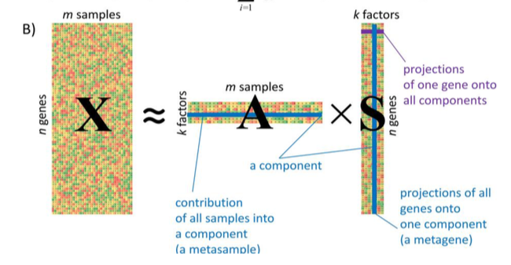

# 2020-04-29 08:10:01

Let's implement some of the ideas from note 104 TODO list. First, let's grab
Derek's original data to make sure there are no misalignments, and we keep the
ENS number to later map it to genes.

```r
df = read.csv('~/data/rnaseq_derek/UPDATED_file_for_derek_add_cause_of_death.csv')
df = df[!duplicated(df$submitted_name),]
data = read.table('~/data/rnaseq_derek/logCPM_rnaseq.txt')
data = t(data)
sn = gsub(x=rownames(data), pattern='X', replacement='')
data = cbind(as.numeric(sn), data)
colnames(data)[1] = 'submitted_name'
m = merge(df, data, by='submitted_name', all.x=F, all.y=T)
pop_code = read.csv('~/data/rnaseq_derek/file_pop.csv')
m2 = merge(m, pop_code, by='hbcc_brain_id')
pcs = read.table('~/data/rnaseq_derek/HM3_b37mds.mds', header=1)
myids = sapply(1:nrow(pcs), function(x) as.numeric(gsub('BR', '',
                                                        strsplit(as.character(pcs[x,'IID']), '_')[[1]][1])))
pcs$numids = myids
m3 = merge(m2, pcs, by.x='hbcc_brain_id', by.y='numids', all.x=T, all.y=F)
```

Now we go ahead with the binomial idea for gene filtering. Out of the 119
observations, 56 are ACC and 63 are caudate. Actually, there are 56 unique ACC
observations, and only 58 for caudate. So, let's choose which ones in the
caudate to take, for the repeated subjects. Looking at the UPDATED file, it's
unclear how to choose it. It could be done based on pcnt_optical_duplicates or
clusters. DEFINITELY A QUESTION FOR DEREK.

I could also just check the number of non-expressed genes in each of them, and
just pick the one with the fewest. Or, just choose based on the ACC measurement
that's being used for that subject?

```r
library(caret)
cdata = m3[m3$Region=='Caudate',]
grex_names = colnames(m3)[grepl(colnames(m3), pattern='^ENS')]
pp = preProcess(cdata[, grex_names],
                method=c('zv', 'nzv', 'range'), rangeBounds=c(0,1))
a = predict(pp, cdata[, grex_names])
n0 = rowSums(a==0)
idx = which(cdata$hbcc_brain_id==2877)
idx

[1] 25 26 27 28 29 30

n0[idx]
  49   50   51   52   53   54 
3980 3712 3599 3794 4081 2347 
```

So, row 54 has the fewest genes with zero transcription counts. We'll take that.

```r
cdata = cdata[-c(25:29, ]
m4 = rbind(cdata, m3[m3$Region=='ACC',])
saveRDS(m4, file='~/data/rnaseq_derek/complete_data_04292020.rds')
```

So, under a binomial distribution with 56 tries, how many should I get positive
to consider that not happening by chance?

```r
> x=38
> binom.test(c(x, 56-x), p = .5)

	Exact binomial test

data:  c(x, 56 - x)
number of successes = 38, number of trials = 56, p-value = 0.01045
alternative hypothesis: true probability of success is not equal to 0.5
95 percent confidence interval:
 0.5403638 0.7971455
sample estimates:
probability of success 
             0.6785714 

> x=39
> binom.test(c(x, 56-x), p = .5)

	Exact binomial test

data:  c(x, 56 - x)
number of successes = 39, number of trials = 56, p-value = 0.004562
alternative hypothesis: true probability of success is not equal to 0.5
95 percent confidence interval:
 0.5590326 0.8122013
sample estimates:
probability of success 
             0.6964286 
```

So, for ACC (56 subjects / coin tosses), I need at least 39 subjects with
success (transcription reads above 0), for that to be considered a expressed
gene with more than chance probability (.5) at p<.01.

For Caudate, our number is 58 tries instead:

```r
> x=39
> binom.test(c(x, 58-x), p = .5)

	Exact binomial test

data:  c(x, 58 - x)
number of successes = 39, number of trials = 58, p-value = 0.01193
alternative hypothesis: true probability of success is not equal to 0.5
95 percent confidence interval:
 0.5365938 0.7899462
sample estimates:
probability of success 
             0.6724138 

> x=40
> binom.test(c(x, 58-x), p = .5)

	Exact binomial test

data:  c(x, 58 - x)
number of successes = 40, number of trials = 58, p-value = 0.005355
alternative hypothesis: true probability of success is not equal to 0.5
95 percent confidence interval:
 0.5545582 0.8046135
sample estimates:
probability of success 
             0.6896552 
```

So we'll go with 40 for the Caudate. Let's also make some PCA plots just to
have some idea of the number of components to keep across dimensionality
reduction methods.

```r
library(caret)
data = readRDS('~/data/rnaseq_derek/complete_data_04292020.rds')
data = data[data$Region=='ACC',]
grex_names = colnames(data)[grepl(colnames(data), pattern='^ENS')]
pp = preProcess(data[, grex_names],
                method=c('zv', 'nzv', 'range'), rangeBounds=c(0,1))
a = predict(pp, data[, grex_names])
n0 = colSums(a==0)
imbad = n0 > 15  # ACC
imbad = n0> 18  # Caudate
good_grex = names(n0)[!imbad]
res.pca <- prcomp(data[, good_grex])
library(factoextra)
fviz_eig(res.pca, ncp=40)

saveRDS(data[, good_grex],
        file='~/data/rnaseq_derek/goodgrexACC_binp01_05022020.rds')
```


It looks like 10 is a nice round number of PCs here. We could go nuts on this
analysis, but I just want to have a general idea. For completeness, this is the
plot for the Caudate:


So, 10 should be alright here as well.

Let me run a series of dimensionality reduction methods and check if anything
looks good.

I got an interesting plots with t-SNE, but the biggest issue is that it doesn't
provide any sort of variable weights, so it'd be hard to assgign back importance
to each gene. But there are other methods that could do that, so the idea itself
is not bad.

So, I started playing with this package:
https://cran.r-project.org/web/packages/dimRed/vignettes/dimensionality-reduction.pdf

And I could see right away hat there was something funky with the first PC:


and I got that both using PCA and Isomaps. So, before I try getting fancy with
the methods, I need to see if there isn't something funky witht the data that's
carrying all this variance.

But the code I used was:

```r
data = readRDS('~/data/rnaseq_derek/goodgrexACC_binp01_04292020.rds')
library(Rtsne)
X = normalize_input(as.matrix(data))
library(dimRed)
data_emb <- lapply(embed_methods, function(x) embed(X, x))
names(data_emb) <- embed_methods
plot_R_NX(data_emb)
plot(data_emb[[2]], type='2vars')
```

The R_NX plot was very similar for Isomap and PCA. If I were to optimize the
parameter for Isomap, then this would work:

```r
kk <- floor(seq(5, 40, length.out = 20))
emb <- lapply(kk, function(x) embed(X, "Isomap", knn = x))
qual <- sapply(emb, function(x) quality(x, "Q_local"))
ind_max <- which.max(qual)
k_max <- kk[ind_max]
```

which gives me about 23. And we could run all available models this way:

```r
embed_methods <- dimRedMethodList()
embed_methods = embed_methods[-c(1, 4, 11)] # remove AutoEncoder, ICA, PCAL1 
quality_methods <- c("Q_local", "Q_global", "AUC_lnK_R_NX",
                     "cophenetic_correlation")
quality_results <- matrix(
  NA, length(embed_methods), length(quality_methods),
  dimnames = list(embed_methods, quality_methods)
)
embedded_data <- list()
for (em in embed_methods) {
    print(sprintf('Trying %s', em))
    embedded_data[[em]] <- embed(X, em)
    for (q in quality_methods) {
        print(sprintf('%s (%s)', em, q))
        try(quality_results[em, q] <- quality(embedded_data[[em]], q))
    }
}
```

AutoEncoder needed tensorflow and I didn't want to install in my MacAir. ICA was
taking forever. PCA_L1 did nt compile. NNMF requires matrix with only non-negative
entries! UMAP was having issues installing in the MacbookAir... maybe all of
these will be options in the cluster. We'll see. For now, we need to optimize
the paremeters anyways. So

But of course we should optimize eahc one individually before running this! Each
model has its own set of parameters, and it maybe the same parameter maximizes
one quality metric but not others? Ideally, I could keep the number of
dimensions constant, and make bar graphs for varying Ks. Each group of bars
would be a K, and four bars per group, one per metric. I could add more
dimensions later, but I think staring with 2 is a good one for now, and we can
run some classifiers or visualizations on that. If I script it, it'll be trivial
to increase the number of dimensions later.

So, before we go any further, let's see if that weird PC1 by PC2 plot was
indicative of something I should pay attention to...

# 2020-05-01 08:10:20

So, let's start with Isomaps, because we can optimize knn and dimensions.

```r
data = readRDS('~/data/rnaseq_derek/goodgrexACC_binp01_04292020.rds')
library(Rtsne)
X = normalize_input(as.matrix(data))
library(dimRed)
nd = 2
kk <- floor(seq(5, 40, length.out = 20))
emb <- lapply(kk, function(x) embed(X, "Isomap", knn = x, ndim= nd))
names(emb) = kk
quality_methods <- c("Q_local", "Q_global", "AUC_lnK_R_NX",
                     "cophenetic_correlation")
quality_results <- matrix(
  NA, length(kk), length(quality_methods),
  dimnames = list(kk, quality_methods)
)
for (k in kk) {
    print(sprintf('Evaluating k=%d',k))
    kname = as.character(k)
    for (q in quality_methods) {
        try(quality_results[kname, q] <- quality(emb[[kname]], q))
    }
}

#plotting
library(ggplot2)
nneighbors = c()
qual_metric = c()
value = c()
for (i in 1:nrow(quality_results)) {
    for (j in 1:ncol(quality_results)) {
        nneighbors = c(nneighbors, as.numeric(rownames(quality_results)[i]))
        qual_metric = c(qual_metric, colnames(quality_results)[j])
        value = c(value, quality_results[i, j])
    }
}
plot_data <- data.frame(qual_metric,nneighbors,value)
ggplot(plot_data, aes(fill=qual_metric, y=value, x=nneighbors)) +
    geom_bar(position="dodge", stat="identity")
```

# 2020-05-01 19:19:41

OK, but it's only worth testing the methods that will give me an inverse
transform. 

I also found this interesting R package (Rdimtools), which implements hundreds
of dimensionality reduction and even dimensionality estimation algorithms.
Still, from what I've been reading only the linear methods will give me some
sort of feature score. To be fair, with only 50 subjects or so we might be
stretching to think that we'll be able to go for nonlinear methods. So, maybe we
can explore the linear ones first?

Rdimtools returns that in the projection variable. So, we could try a few of
those and see what we get.

All algorithms that have featidx returned also have projections. Maybe I could
also explore supervised algorithms and bootstrap the data for confidence
intervals of the findings?

For example, can we use bayesian optimization to get good numbers for lambda and
alpha in enet, and then bootstrap that?

I should also try a cscale, decorrelated and whitened version of the data, just
in case it matters. So, whihch methods to use? In the documentation, these are
supervised and give a nice view of which features are being used:

ammc
lpfda
lqmi
lsda
mfa
mlie
mmc
mmpm
mmsd
msd
mvp
odp
pls
save
sir
slpe
slpp
spc
specs
splapeig

I don't think splapeig returns projections though. 

They all still have other parameters like ndim and others, which would still
need to be optimized.

Of course I could also use an unsupervised method to bring my dimensions down to
20 or so, and then use a supervised one to finsih the job. But let's do that
only if we face 100% accuracy doing supervised from the get go. Maybe doing PCA
or ICASSO in the initial set and doing ML (or just plain old stats with
bootstrapping) from there.

# 2020-05-02 07:21:03

So, let's start with a standard PCA analysis. 

```r
data = readRDS('~/data/rnaseq_derek/goodgrexACC_binp01_05022020.rds')
library(factoextra)
res.pca <- prcomp(data, scale = TRUE)
fviz_eig(res.pca, ncp=40)
fviz_pca_ind(res.pca,
             col.ind = "cos2", # Color by the quality of representation
             gradient.cols = c("#00AFBB", "#E7B800", "#FC4E07"),
             repel = TRUE     # Avoid text overlapping
             )
```


We knew already that on individual looked like an outlier already. How does the
PCA change if we exclude that individual?

```r
data2 = data[-c(which(rownames(data)=='57')), ]
res.pca2 <- prcomp(data2, scale = TRUE)
fviz_eig(res.pca2, ncp=40)
fviz_pca_ind(res.pca2,
             col.ind = "cos2", # Color by the quality of representation
             gradient.cols = c("#00AFBB", "#E7B800", "#FC4E07"),
             repel = TRUE     # Avoid text overlapping
             )
```

The first 2 PCs are much more important than the others:


And at least our first 2 dimensions are more homogeneous:


Let me explore a bit the enet idea, after removing this character.

```r
junk = readRDS('~/data/rnaseq_derek/complete_data_04292020.rds')
label = junk[junk$Region=='ACC', 'Diagnosis']
label = label[-c(which(rownames(data)=='57'))]
library(Rdimtools)
# mvp = do.mvp(data2, label, ndim=1)
enet = do.enet(as.matrix(data2), as.numeric(label))
```

This toolbox takes forever to run... I'll need to do it in BW.

Let me see if Caudate has outliers as well.


No, caudate seems a bit more well behaved. I just aved the CSV (see below) with
the same suffix to make things easier in the future, but there were no outliers
removed.

Well, Rdimtools is not compiling in BW, so there's that. Let me keep going with
the PCa and ICA approaches first, and then I'll try to investigate this
further... maybe I can run some stuff in my desktop?

```r
data = readRDS('~/data/rnaseq_derek/goodgrexACC_binp01_05022020.rds')
data2 = data[-c(which(rownames(data)=='57')), ]
junk = readRDS('~/data/rnaseq_derek/complete_data_04292020.rds')
label = junk[junk$Region=='ACC', 'Diagnosis']
label = label[-c(which(rownames(data)=='57'))]
library(Rdimtools)
# mvp = do.mvp(data2, label, ndim=1)
enet = do.enet(as.matrix(data2), as.numeric(label))
```

## ICASSO

I also want to retrieve my notes on ICASSO and try it for this dataset:

```r
data = readRDS('~/data/rnaseq_derek/goodgrexACC_binp01_05022020.rds')
data2 = data[-c(which(rownames(data)=='57')), ]
write.csv(data2,
          file='~/data/rnaseq_derek/goodgrexACC_binp01_05022020_noOutlier.csv',
          row.names=F)
```

For future reference, here's how much cumulative variance explained in each
dataset (summary(res.pca)). In Caudate we'd need 49 PCs, and in ACC 46. Maybe
not a great way to do it. Probably looking at the elbow would be best, or using
some of the other parametric methods.

```r
library(nFactors)
eigs <- res.pca$sdev^2
nS = nScree(x=eigs)
print(nS$Components$nkaiser)
```

I get 11 for Caudate and 12 for ACC. So, 15 should be a good number for both.
Or, if we check the other values:

```
> nS$Components
  noc naf nparallel nkaiser
1  16   2        54      12
> eigs <- res.pca$sdev^2
> nS = nScree(x=eigs)
> nS$Components
  noc naf nparallel nkaiser
1  12   1        57      11
```

The first is for ACC. So, maybe 16 and 12, to make sure we get noc? And it'd
include kaiser too. We can do feature selection later for ML.

Then, in Matlab we do:

```matlab
# interactive

addpath('/data/NCR_SBRB/software/FastICA_25/')
addpath('/data/NCR_SBRB/software/icasso122/')
Ydd = dlmread(['~/data/rnaseq_derek/goodgrexACC_binp01_05022020_noOutlier.csv'], ',', 1, 0);

sR=icassoEst('both', Ydd, 1000, 'lastEig', 16, 'g', 'pow3', 'approach', 'defl');
sR=icassoExp(sR);
[iq,A,W,S]=icassoResult(sR);
save(['~/data/rnaseq_derek/ica_results_ACC_1Kperms.mat'],'A','S','W','iq','sR','-v7.3')  
```

```matlab
# interactive

addpath('/data/NCR_SBRB/software/FastICA_25/')
addpath('/data/NCR_SBRB/software/icasso122/')
Ydd = dlmread(['~/data/rnaseq_derek/goodgrexCaudate_binp01_05022020_noOutlier.csv'], ',', 1, 0);

sR=icassoEst('both', Ydd, 1000, 'lastEig', 12, 'g', 'pow3', 'approach', 'defl');
sR=icassoExp(sR);
[iq,A,W,S]=icassoResult(sR);
save(['~/data/rnaseq_derek/ica_results_Caudate_1Kperms.mat'],'A','S','W','iq','sR','-v7.3')  
```

This tutorial https://urszulaczerwinska.github.io/DeconICA/Icasso.html and https://urszulaczerwinska.github.io/DeconICA/DeconICA_introduction.html have been
very useful!

# 2020-05-02 20:47:12

Wow, after A LOT of work, I got this toolbox to work. Here's the pipeline:

```bash
# interactive
module load matlab
module load R
```

```r
library(deconica)
data = readRDS('~/data/rnaseq_derek/goodgrexACC_binp01_05022020.rds')
data2 = data[-c(which(rownames(data)=='57')), ]
X = t(data2)
res <-
  run_fastica(
    X = X,
    row.center = TRUE,
    n.comp = 5,
    overdecompose = FALSE,
    R = FALSE,
    matlbpth = "/usr/local/apps/Matlab/R2020a/bin"
  )
```

That gives me A as nsamples by ICs, and S as ngrex by ICs, just like this
picture from
https://github.com/LabBandSB/BIODICA/blob/master/doc/ICA_pipeline_general_description_v0.9.pdf



Now, let's play with it more.

```r
res <-
  run_fastica(
    X = X,
    row.center = TRUE,
    n.comp = 5,
    overdecompose = TRUE,
    gene_names = rownames(X),
    samples = colnames(X),
    R = FALSE,
    matlbpth = "/usr/local/apps/Matlab/R2020a/bin"
  )
```

And repeat the same thing for Caudate:

```r
library(deconica)
data = readRDS('~/data/rnaseq_derek/goodgrexCaudate_binp01_05022020.rds')
X = t(data)
res <-
  run_fastica(
    X = X,
    row.center = TRUE,
    n.comp = 5,
    overdecompose = TRUE,
    gene_names = rownames(X),
    samples = colnames(X),
    R = FALSE,
    matlbpth = "/usr/local/apps/Matlab/R2020a/bin"
  )
```

At this point I'm not too confident this is much better than just running what
I'm used to in ICASSO, Matlab directly. Here's the output for a single run:

```
Randomization using FastICA: Round 100/100

Number of signals: 55
Number of samples: 30933
Calculating covariance...
Reducing dimension...
Selected [ 41 ] dimensions.
Smallest remaining (non-zero) eigenvalue [ 0.1303 ]
Largest remaining (non-zero) eigenvalue [ 1.68859 ]
Sum of removed eigenvalues [ 1.37483 ]
[ 90.2097 ] % of (non-zero) eigenvalues retained.
Whitening...
Check: covariance differs from identity by [ 2.22045e-15 ].
Number of signals: 55
Number of samples: 30933
Whitened signal and corresponding matrises supplied.
PCA calculations not needed.
Whitening not needed.
Used approach [ symm ].
Used nonlinearity [ pow3 ].
Starting ICA calculation...
Step no. 1
Step no. 2, change in value of estimate: 0.108
Step no. 3, change in value of estimate: 0.233
Step no. 4, change in value of estimate: 0.12
Step no. 5, change in value of estimate: 0.0844
Step no. 6, change in value of estimate: 0.0637
Step no. 7, change in value of estimate: 0.0387
Step no. 8, change in value of estimate: 0.0345
Step no. 9, change in value of estimate: 0.0154
Step no. 10, change in value of estimate: 0.0145
Step no. 11, change in value of estimate: 0.0205
Step no. 12, change in value of estimate: 0.0186
Step no. 13, change in value of estimate: 0.00964
Step no. 14, change in value of estimate: 0.00581
Step no. 15, change in value of estimate: 0.00621
[...]
Step no. 100, change in value of estimate: 0.000471
No convergence after 100 steps
Note that the plots are probably wrong.
Adding the mean back to the data.
Computing R-index...
Projection, using CCA
75 iterations, error 3.662057
```

So, that kind of stuff I can do by myself in MATLAB and have more control over
stuff...

# 2020-05-04 07:18:42

I'm also going to run a few more ICs, with less perms just so it's somewhat
manageable in time (that toolbox only ran 100 anyways), while I analyze what I
have so far. 

Then, the idea will be to just run some t-tests or logistic regressions with the
variables we have, and see what we get (no ML for now)!

```matlab
# interactive

addpath('/data/NCR_SBRB/software/FastICA_25/')
addpath('/data/NCR_SBRB/software/icasso122/')
Ydd = dlmread(['~/data/rnaseq_derek/goodgrexACC_binp01_05022020_noOutlier.csv'], ',', 1, 0);

sR=icassoEst('both', Ydd, 500, 'lastEig', 30, 'g', 'pow3', 'approach', 'defl');
sR=icassoExp(sR);
[iq,A,W,S]=icassoResult(sR);
save(['~/data/rnaseq_derek/ica_results_ACC_500perms.mat'],'A','S','W','iq','-v6')  
```

```matlab
# interactive

addpath('/data/NCR_SBRB/software/FastICA_25/')
addpath('/data/NCR_SBRB/software/icasso122/')
Ydd = dlmread(['~/data/rnaseq_derek/goodgrexCaudate_binp01_05022020_noOutlier.csv'], ',', 1, 0);

sR=icassoEst('both', Ydd, 500, 'lastEig', 30, 'g', 'pow3', 'approach', 'defl');
sR=icassoExp(sR);
[iq,A,W,S]=icassoResult(sR);
save(['~/data/rnaseq_derek/ica_results_Caudate_500perms.mat'],'A','S','W','iq','-v6')  
```

# 2020-05-04 12:54:40

Let's see if there is anything interesting in those first ICs:

```r
library(R.matlab)
res = readMat('~/data/rnaseq_derek/ica_results_ACC_1Kperms_V6.mat')
junk = readRDS('~/data/rnaseq_derek/complete_data_04292020.rds')
junk2 = junk[-c(which(rownames(junk)=='57')), ]
label = junk2[junk2$Region=='ACC', 'Diagnosis']
idx = label=='Control'
ps = c()
for (ic in 1:ncol(res$A)) {
  ps = c(ps, t.test(res$A[idx, ic], res$A[!idx, ic])$p.value)
}
```

```
> cbind(ps, res$iq)
               ps          
 [1,] 0.514380220 0.9565599
 [2,] 0.092682676 0.9748425
 [3,] 0.851121526 0.8877827
 [4,] 0.171107630 0.8794904
 [5,] 0.185856802 0.5259735
 [6,] 0.912537435 0.4970935
 [7,] 0.084318433 0.6751500
 [8,] 0.490249546 0.8305464
 [9,] 0.009897427 0.5907455
[10,] 0.052204511 0.5699875
[11,] 0.376009086 0.4875891
[12,] 0.697389676 0.4451301
[13,] 0.708775508 0.6143861
[14,] 0.046392682 0.3688214
[15,] 0.595266381 0.6090429
[16,] 0.673757340 0.4811849
```

Nothing surprising. But I wonder what it'd look like if we did the covariate
screening on these variables?

```r
library(R.matlab)
myregion = 'ACC'
pthresh = .1
keep_str = 'Diagnosis'

ica = readMat(sprintf('~/data/rnaseq_derek/ica_results_%s_1Kperms_V6.mat', myregion))
data = readRDS('~/data/rnaseq_derek/complete_data_04292020.rds')
data = data[-c(which(rownames(data)=='57')), ]
data = data[data$Region==myregion, ]

data$batch = as.factor(data$batch)
# no column names as numbers!
ic_names = sapply(1:ncol(ica$A), function(x) sprintf('IC%s', x))
colnames(ica$A) = ic_names

# dependent
dep_vars = ic_names
# keep these regardless of significance
keep_vars = c(keep_str)
# variables to be tested/screened
test_vars = c(# brain-related
              "bainbank", 'PMI', 'Manner.of.Death',
              # technical
              'batch', 'RINe',
              #clinical
              # 'comorbid_group', 'substance_group',
              # others
              'Sex', 'Age', sapply(1:10, function(x) sprintf('C%s', x)))

# spit out the results
out_fname = sprintf('~/data/rnaseq_derek/ICA_%s_pLT%.02f_%s.csv',
                    myregion, pthresh,
                    gsub(pattern='\\*',replacement='',x=keep_str))

mydata = cbind(ica$A, data[, c(keep_vars, test_vars)])
hold = c()
for (dp in 1:length(dep_vars)) {
    dep_var = dep_vars[dp]
    fm_str = paste(dep_var, ' ~ ', paste(keep_vars, collapse='+'), ' + ',
                   paste(test_vars, collapse='+'), sep="")
    fit = lm(as.formula(fm_str), data=mydata)
    res = summary(fit)$coefficients
    # filtering variables
    sig_vars = c()
    for (v in 1:length(test_vars)) {
        # rows in results table that correspond to the screened variable
        var_rows = which(grepl(rownames(res),
                         pattern=sprintf('^%s', test_vars[v])))
        for (r in var_rows) {
            if (res[r, 'Pr(>|t|)'] < pthresh) {
                sig_vars = c(sig_vars, test_vars[v])
            }
        }
    }
    # factors might get added several times, so here we clean it up
    sig_vars = unique(sig_vars)
    if (length(sig_vars) > 0) {
        clean_fm_str = paste(dep_var, ' ~ ', paste(keep_vars, collapse='+'), ' + ',
                       paste(sig_vars, collapse='+'), sep="")
    } else {
        clean_fm_str = paste(dep_var, ' ~ ', paste(keep_vars, collapse='+'), sep="")
    }
    # new model
    clean_fit = lm(as.formula(clean_fm_str), data=mydata)
    res = data.frame(summary(clean_fit)$coefficients)
    # remove intercept
    res = res[2:nrow(res),]
    res$dep_var = dep_var
    res$formula = clean_fm_str
    res$orig_formula = fm_str
    res$predictor = rownames(res)
    hold = rbind(hold, res)
}
write.csv(hold, file=out_fname, row.names=F)
```


That didn't help. Best ICs still have some quite poor iqs. How about a logistic
regression model?

```r
library(MASS)
model <- glm(Diagnosis ~., data = mydata, family = binomial)
dim(mydata)
model2 = stepAIC(model)
```

Also nothing... values too weird in the summary, almost constant. Before I go
for other alternatives, how does the Caudate look? Nope, weird too.

How about doing some RFE on the ICA results?

```r
library(caret)
x = cbind(ica$A, data[, c('Age', sapply(1:10, function(x) sprintf('C%s', x)))])
keep_me = which(!is.na(x$C1))  # remove the IDs without population PC
x = x[keep_me,]
y = data[keep_me,]$Diagnosis
normalization <- preProcess(x)
x <- predict(normalization, x)
x <- as.data.frame(x)
subsets <- c(1:5, 10, 15, 20)
set.seed(10)
ctrl <- rfeControl(functions = treebagFuncs,
                   method = "repeatedcv",
                   repeats = 5,
                   verbose = FALSE)
rfProfile <- rfe(x, y,
                 sizes = subsets,
                 rfeControl = ctrl)
```

Without any covariates, I have this for the caudate:

```r
fit = glm(Diagnosis ~ IC1+IC2+IC3+IC4+IC5+IC6+IC7+IC8+IC9+IC10+IC11+IC12,
          data = mydata, family = binomial)
fit2 = stepAIC(fit)
summary(fit2)
```

```
Deviance Residuals: 
    Min       1Q   Median       3Q      Max  
-1.9678  -1.1046   0.6432   1.0326   1.5976  

Coefficients:
            Estimate Std. Error z value Pr(>|z|)  
(Intercept)   0.3184     0.5264   0.605   0.5453  
IC5           2.7996     1.8816   1.488   0.1368  
IC9          -3.7571     2.1632  -1.737   0.0824 .
IC10          7.7945     3.5604   2.189   0.0286 *
---
Signif. codes:  0 ‘***’ 0.001 ‘**’ 0.01 ‘*’ 0.05 ‘.’ 0.1 ‘ ’ 1

(Dispersion parameter for binomial family taken to be 1)

    Null deviance: 79.298  on 57  degrees of freedom
Residual deviance: 71.019  on 54  degrees of freedom
AIC: 79.019

Number of Fisher Scoring iterations: 4
```

And IC10 has a .74 iq. For ACC:

```
> summary(fit2)

Call:
glm(formula = Diagnosis ~ IC2 + IC4 + IC7 + IC9 + IC10 + IC11, 
    family = binomial, data = mydata)

Deviance Residuals: 
     Min        1Q    Median        3Q       Max  
-1.98800  -0.45008   0.06457   0.58830   1.89023  

Coefficients:
            Estimate Std. Error z value Pr(>|z|)   
(Intercept)  -0.2377     0.6607  -0.360  0.71906   
IC2         -21.6077    11.7560  -1.838  0.06606 . 
IC4          17.4041     8.3495   2.084  0.03712 * 
IC7          12.6059     4.7206   2.670  0.00758 **
IC9          26.7854     9.2622   2.892  0.00383 **
IC10        -23.6006     8.4513  -2.793  0.00523 **
IC11         10.6312     6.0758   1.750  0.08016 . 
---
Signif. codes:  0 ‘***’ 0.001 ‘**’ 0.01 ‘*’ 0.05 ‘.’ 0.1 ‘ ’ 1

(Dispersion parameter for binomial family taken to be 1)

    Null deviance: 74.192  on 53  degrees of freedom
Residual deviance: 38.422  on 47  degrees of freedom
AIC: 52.422

Number of Fisher Scoring iterations: 7
```

Much better. But many of those are not too stable:

```
> ica$iq
           [,1]
 [1,] 0.9565599
 [2,] 0.9748425
 [3,] 0.8877827
 [4,] 0.8794904
 [5,] 0.5259735
 [6,] 0.4970935
 [7,] 0.6751500
 [8,] 0.8305464
 [9,] 0.5907455
[10,] 0.5699875
[11,] 0.4875891
[12,] 0.4451301
[13,] 0.6143861
[14,] 0.3688214
[15,] 0.6090429
[16,] 0.4811849
```

But maybe we don't need to pull covariates here, as the ICs shouldn't be related
to any specific covariates. Or, we could residualize all genes before running
the ICA...

Let's give that a try... if anything, it'll take care of the population PCs as
well.


## Adding covariates

```r
myregion = 'ACC'
pthresh = .1

data = readRDS('~/data/rnaseq_derek/complete_data_04292020.rds')
data = data[-c(which(rownames(data)=='57')), ]
data = data[data$Region==myregion, ]
keep_me = which(!is.na(data$C1))  # only keep people with population PCs
data = data[keep_me, ]
more = readRDS('~/data/rnaseq_derek/data_from_philip_POP_and_PCs.rds')
more = more[, c('hbcc_brain_id', 'comorbid_group', 'substance_group')]
more = more[!duplicated(more$hbcc_brain_id), ]
data = merge(data, more[, ], by='hbcc_brain_id',
             all.x=F, all.y=F)

data$batch = as.factor(data$batch)

test_vars = c(# brain-related
              "bainbank", 'PMI', 'Manner.of.Death',
              # technical
              'batch', 'RINe',
              #clinical
              'comorbid_group', 'substance_group',
              # others
              'Sex', 'Age', sapply(1:10, function(x) sprintf('C%s', x)))

ens_names = colnames(data)[grepl(colnames(data), pattern='^ENS')]
res_data = data[, ens_names]

for (dp in 1:length(ens_names)) {
    if (dp %% 50 == 0) {
        print(sprintf('%d of %d', dp, length(ens_names)))
    }

    dep_var = ens_names[dp]
    fm_str = paste(dep_var, ' ~ ', paste(test_vars, collapse='+'), sep="")
    fit = lm(as.formula(fm_str), data=data)
    res = summary(fit)$coefficients
    # filtering variables
    sig_vars = c()
    for (v in 1:length(test_vars)) {
        # rows in results table that correspond to the screened variable
        var_rows = which(grepl(rownames(res),
                         pattern=sprintf('^%s', test_vars[v])))
        for (r in var_rows) {
            if (res[r, 'Pr(>|t|)'] < pthresh) {
                sig_vars = c(sig_vars, test_vars[v])
            }
        }
    }
    # factors might get added several times, so here we clean it up
    sig_vars = unique(sig_vars)
    if (length(sig_vars) > 0) {
        clean_fm_str = paste(dep_var, ' ~ ', paste(sig_vars, collapse='+'), sep="")
    } else {
        clean_fm_str = paste(dep_var, ' ~ 1', sep="")
    }
    # new model
    clean_fit = lm(as.formula(clean_fm_str), data=data)
    res_data[, dep_var] = residuals(clean_fit)
}

# had some variables with almost perfect fit, so better remove zero r close to xero variance again...
library(caret)
pp = preProcess(res_data, method=c('zv', 'nzv', 'center', 'scale'))
res_data2 = predict(pp, res_data)

out_fname = sprintf('~/data/rnaseq_derek/goodgrex%s_binp01_resids.csv', myregion)
write.csv(res_data2, file=out_fname, row.names=F)
```

And re-run the ICA:

```matlab
# interactive

r='ACC'
addpath('/data/NCR_SBRB/software/FastICA_25/')
addpath('/data/NCR_SBRB/software/icasso122/')
Ydd = dlmread(['~/data/rnaseq_derek/goodgrex', r, '_binp01_resids.csv'], ',', 1, 0);

sR=icassoEst('both', Ydd, 250, 'lastEig', 30, 'g', 'pow3', 'approach', 'defl');
sR=icassoExp(sR);
[iq,A,W,S]=icassoResult(sR);
save(['~/data/rnaseq_derek/ica_results_', r, '_resids_250perms.mat'],'A','S','W','iq','-v6')  
```

I'm not getting many ICs here, so I'm not terribly looking forward to those
results. Probably residualizing removed lots of variance. Well, we'll see.

# *2020-05-05 12:45:13*

Yeah, that gave me variables with very low IQ... like, most of them around .3.
Would it be any different if I used stepAIC instead? Philip also suggested using
only the RNA-releated covariates, leaving clinical stuff for later.

```r
library(MASS)
myregion = 'ACC'

data = readRDS('~/data/rnaseq_derek/complete_data_04292020.rds')
data = data[-c(which(rownames(data)=='57')), ]
data = data[data$Region==myregion, ]
keep_me = which(!is.na(data$C1))  # only keep people with population PCs
data = data[keep_me, ]

data$batch = as.factor(data$batch)

test_vars = c(# brain-related
              "bainbank", 'PMI',
              # technical
              'batch', 'RINe',
              # others
              sapply(1:10, function(x) sprintf('C%s', x)))

ens_names = colnames(data)[grepl(colnames(data), pattern='^ENS')]
res_data = data[, ens_names]

for (dp in 1:length(ens_names)) {
    if (dp %% 50 == 0) {
        print(sprintf('%d of %d', dp, length(ens_names)))
    }
    dep_var = ens_names[dp]
    fm_str = paste(dep_var, ' ~ ', paste(test_vars, collapse='+'), sep="")
    fit = lm(as.formula(fm_str), data=data)
    clean_fit = stepAIC(fit, trace=0)
    res_data[, dep_var] = residuals(clean_fit)
}

# had some variables with almost perfect fit, so better remove zero r close to xero variance again...
library(caret)
pp = preProcess(res_data, method=c('zv', 'nzv', 'center', 'scale'))
res_data2 = predict(pp, res_data)

out_fname = sprintf('~/data/rnaseq_derek/goodgrex%s_stepAIC_resids.csv', myregion)
write.csv(res_data2, file=out_fname, row.names=F)
```

I could also just try to implement the supervised PC steps, which are quite easy
by looking at http://statweb.stanford.edu/~tibs/superpc/tutorial.html. And do it
in a logistic regression fashion (the one package I found in github is not good)

```r
library(MASS)
myregion = 'ACC'

data = readRDS('~/data/rnaseq_derek/complete_data_04292020.rds')
data = data[-c(which(rownames(data)=='57')), ]
data = data[data$Region==myregion, ]
keep_me = which(!is.na(data$C1))  # only keep people with population PCs
data = data[keep_me, ]
ens_names = colnames(data)[grepl(colnames(data), pattern='^ENS')]

library(caret)
pp = preProcess(data[, ens_names], method=c('zv', 'nzv', 'center', 'scale'))
ens_data = predict(pp, data[, ens_names])

zscores = apply(ens_data, 2,
                function(x) summary(glm(data$Diagnosis ~ x,
                                        family = binomial))$coefficients[2, 'z value'])
z_thresh = 2
library(factoextra)
res.pca<-prcomp(ens_data[, abs(zscores) > z_thresh])
fviz_eig(res.pca, ncp=40)
```


We could try just the first one, but I imagine the first 6 could be significant.
The package actually only lets you use the first 3, with the only the first one
being the default... interesting. But this ran so fast that I could even do the
whole thing within LOOCV, selecting the first component all the time, and still
do a CV to select the best threshold?

```r
thresholds = c(1.5, 2, 2.5, 3)
all_preds = c()
for (t in thresholds) {
    preds = c()
    for (loo in 1:nrow(data)) {
        my.pca = prcomp(ens_data[-loo, abs(zscores) > t])
        tmp = data.frame(y = data[-loo, 'Diagnosis'], PC1=my.pca$x[, 1])
        cv.fit = glm(y ~ PC1, data=tmp, family = binomial)
        loo_data = predict(my.pca, ens_data[loo, abs(zscores) > t])
        tmp = data.frame(y = data[loo, 'Diagnosis'], PC1=loo_data[, 1])
        pred = predict(cv.fit, newdata=tmp, type='response')
        preds = c(preds, pred)
    }
    all_preds = rbind(all_preds, preds)
}
```

And we could use ROC or ACC here... doesn't matter much.

```r
predicted.classes <- ifelse(all_preds > 0.5, "Control", "Case")
best_thresh = which.max(rowSums(predicted.classes==data$Diagnosis))
# or
auc(roc(as.numeric(as.factor(predicted.classes[4,])),as.numeric(data$Diagnosis)))
```

We can further add other predictors here... we'll see. But now the idea is to
add other covariates and see if the model improves even further. Either adding
them to the glm, or residualizing them from the gene expression. Also, I can do
the whole thing in a LOOCV if needed later, including obtaining the initial
scores. The whole operation doesn't take that long. The biggest hurdle would be
combining all the models later, but then I could just train on the entire data
for interpretation.

# 2020-05-06 06:31:36

Let's put together the entire pipeline then. First, using the non-residualized
version of the data, but I can later easily switch to any of our residualized
approaches:

```r
library(MASS)
myregion = 'ACC'
my_thresholds = c(1.5, 2, 2.5, 3)

data = readRDS('~/data/rnaseq_derek/complete_data_04292020.rds')
data = data[-c(which(rownames(data)=='57')), ]
data = data[data$Region==myregion, ]
keep_me = which(!is.na(data$C1))  # only keep people with population PCs
data = data[keep_me, ]
ens_names = colnames(data)[grepl(colnames(data), pattern='^ENS')]

library(caret)
pp = preProcess(data[, ens_names], method=c('zv', 'nzv', 'center', 'scale'))
ens_data = predict(pp, data[, ens_names])

library(doParallel)
cl = makeCluster(2)

my_covs = c('Sex', 'Age')
best_thresh = c()
all_preds = c()
all_probs = c()
feature_scores = c()
for (loo in 1:nrow(ens_data)) {
    print(sprintf('Trying sample %s of %s', loo, nrow(ens_data)))
    Xtrain = cbind(ens_data[-loo, ], data[-loo, c('Diagnosis', my_covs)])
    # zscores = sapply(colnames(ens_data),
    #                 function(x) { fm_str = sprintf('Diagnosis~%s+%s', x,
    #                                                paste(my_covs,
    #                                                      collapse='+'))
    #                               fit = glm(as.formula(fm_str),
    #                                         data=Xtrain, family = binomial)
    #                               return(summary(fit)$coefficients[2,
    #                                                                'z value'])})
    clusterExport(cl, c("Xtrain", 'my_covs'))
    zscores = parSapply(cl, colnames(ens_data),
                        function(x) { fm_str = sprintf('Diagnosis~%s+%s', x,
                                                   paste(my_covs,
                                                         collapse='+'))
                                  fit = glm(as.formula(fm_str),
                                            data=Xtrain, family = binomial)
                                  return(summary(fit)$coefficients[2,
                                                                   'z value'])})
    # setting up a linear search space from two bounds of z scale
    bounds = quantile(abs(zscores), c(.75, .95))
    thresholds = seq(from=bounds[1], to=bounds[2], len=10)
    thresholds = my_thresholds
    print('Evaluating thresholds')
    eval_results = c()
    for (t in thresholds) {
        probs = c()
        for (inloo in 1:nrow(Xtrain)) {
            # compute PCA in innet train data, selected variables
            my.pca = prcomp(Xtrain[-inloo, abs(zscores) > t])
            # use PCs to create model
            tmp = data.frame(Xtrain[-inloo, c('Diagnosis', my_covs)],
                             my.pca$x[, 1])
            colnames(tmp) = c('y', my_covs, 'PC1')
            fm_str = sprintf('y~PC1+%s', paste(my_covs, collapse='+'))
            cv.fit = glm(as.formula(fm_str), data=tmp, family = binomial)
            # transform inner test data to PC space
            inloo_data = predict(my.pca, Xtrain[inloo, abs(zscores) > t])
            tmp = data.frame(Xtrain[inloo, c('Diagnosis', my_covs)],
                             inloo_data[, 1])
            colnames(tmp) = c('y', my_covs, 'PC1')
            prob = predict(cv.fit, newdata=tmp, type='response')
            probs = c(probs, prob)
        }
        preds_class = ifelse(probs > 0.5, levels(Xtrain$Diagnosis)[2],
                             levels(Xtrain$Diagnosis)[1])
        preds_probs = probs
        dat = cbind(data.frame(obs = Xtrain$Diagnosis, pred = preds_class),
                    preds_probs)
        mcs = confusionMatrix(dat$pred, dat$obs)
        test_results = c(mcs$byClass['Balanced Accuracy'],
                         mcs$byClass['Sensitivity'],
                         mcs$byClass['Specificity'])
        eval_results = rbind(eval_results, test_results)
    }
    my_thresh = thresholds[which.max(eval_results[, 'Balanced Accuracy'])]
    best_thresh = c(best_thresh, my_thresh)

    # predicting outer CV
    my.pca = prcomp(Xtrain[, abs(zscores) > my_thresh])
    # use PCs to create model
    tmp = data.frame(Xtrain[, c('Diagnosis', my_covs)], my.pca$x[, 1])
    colnames(tmp) = c('y', my_covs, 'PC1')
    fm_str = sprintf('y~PC1+%s', paste(my_covs, collapse='+'))
    cv.fit = glm(as.formula(fm_str), data=tmp, family = binomial)
    # transform inner test data to PC space
    loo_data = predict(my.pca, Xtrain[loo, abs(zscores) > my_thresh])
    tmp = data.frame(Xtrain[loo, c('Diagnosis', my_covs)], loo_data[, 1])
    colnames(tmp) = c('y', my_covs, 'PC1')
    prob = predict(cv.fit, newdata=tmp, type='response')
    pred_class = ifelse(prob > 0.5, levels(Xtrain$Diagnosis)[2],
                         levels(Xtrain$Diagnosis)[1])
    all_probs = c(all_probs, prob)
    all_preds = c(all_preds, pred_class)

    # computing all feature scores
    a = cor(my.pca$x[,1], Xtrain[, colnames(ens_data)])
    feature_scores = rbind(feature_scores, a)
}
```


# TODO
* could potentially use the residuals instead, like the decorrelate function in superpc
* could run CV to check the best z_thresh
* logistic regression only using ICs with good IQ?
* do we need ICA? why not just PCA?
* add covariates and see if screening works better
* start evaluating the logistic model and what the ICs mean
* ICA within WNH only?
* supervised PCA?
* keep it to only metrics that give an inverse transform! (i.e. no tsne)
* maybe there are databases out there of human postmortem data just to give us a
  better basis for the ICs?
