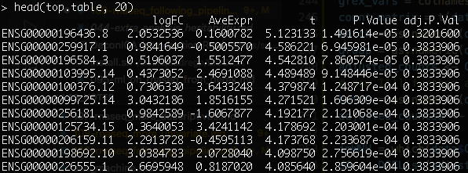
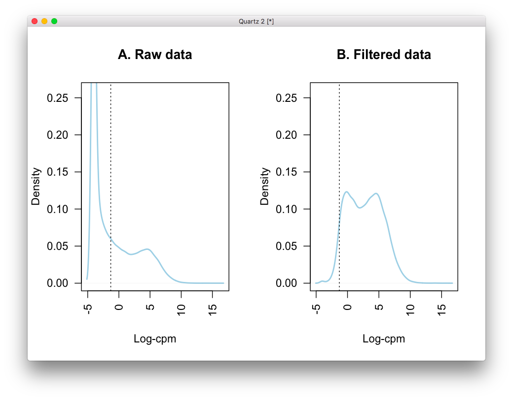
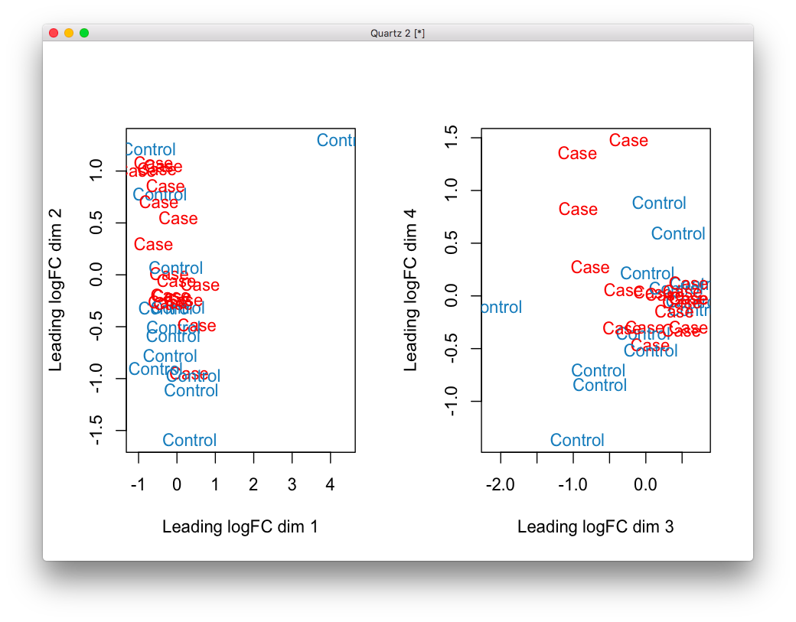

# 2020-05-15 07:33:48

Let's continue our observations from 108 and follow a pipeline. Starting with
this one:

https://ucdavis-bioinformatics-training.github.io/2018-June-RNA-Seq-Workshop/thursday/DE.html

```r
library(edgeR)
myregion = 'ACC'
data = readRDS('~/data/rnaseq_derek/complete_rawCountData_05132020.rds')
grex_vars = colnames(data)[grepl(colnames(data), pattern='^ENS')]
counts = t(data[data$Region==myregion, grex_vars])
d0 <- DGEList(counts)
d0 <- calcNormFactors(d0)
cutoff <- 1  # subjective... play with this
drop <- which(apply(cpm(d0), 1, max) < cutoff)
d <- d0[-drop,]
group = data[data$Region==myregion, 'Diagnosis']
plotMDS(d, col = as.numeric(group))
```


```r
mm <- model.matrix(~0 + group)
y <- voom(d, mm, plot = T)
```


This is supposedly a good fit, base don the tutorial.

```r
fit <- lmFit(y, mm)
contr <- makeContrasts(groupCase - groupControl, levels = colnames(coef(fit)))
tmp <- contrasts.fit(fit, contr)
tmp <- eBayes(tmp)
top.table <- topTable(tmp, sort.by = "P", n = Inf)
```

This seems to finish the analysis, but as expected we don't have anything useful
after corretion with FDR.

We could check for pH, RIN and batch variables. What happens if I just chuck
them into the model?

```r
RIN = data[data$Region==myregion, 'RINe']
pH = data[data$Region==myregion, 'pH']
site = data[data$Region==myregion, 'bainbank']
batch = factor(data[data$Region==myregion, 'run_date'])
```

pH has many NAs, and I cannot add site and batch at the same time without
altering the variables, as there as cross-overs in the categories with zero
samples. It's just a matter of recoding, or doing the batch correction twice,
but for now we're just playing.

```r
mm <- model.matrix(~0 + group + batch + RIN)
y <- voom(d, mm, plot = T)
```


```r
fit <- lmFit(y, mm)
contr <- makeContrasts(groupCase - groupControl, levels = colnames(coef(fit)))
tmp <- contrasts.fit(fit, contr)
tmp <- eBayes(tmp)
top.table <- topTable(tmp, sort.by = "P", n = Inf)
head(top.table, 20)
```

```r
fit <- lmFit(y, mm)
contr <- makeContrasts(groupCase - groupControl, levels = colnames(coef(fit)))
tmp <- contrasts.fit(fit, contr)
tmp <- eBayes(tmp)
top.table <- topTable(tmp, sort.by = "P", n = Inf)
head(top.table, 20)
```

Still nothing. Maybe there really isn't anything if we use FDR. But we do have
plenty of other things to try, and we're just starting...

## Effects of combat

```r
library(sva)
data = readRDS('~/data/rnaseq_derek/complete_rawCountData_05132020.rds')
data = data[data$Region=='ACC', ]
grex_vars = colnames(data)[grepl(colnames(data), pattern='^ENS')]
count_matrix = t(data[, grex_vars])
batch = as.numeric(data$run_date)
group = as.numeric(data$Diagnosis)
adjusted_counts <- ComBat_seq(count_matrix, batch=batch, group=group)
# now I'll further adjust it for brain bank
batch = as.numeric(data$bainbank)
adjusted_counts2 <- ComBat_seq(adjusted_counts, batch=batch, group=group)

d0 <- DGEList(adjusted_counts2)
d0 <- calcNormFactors(d0)
cutoff <- 1  # subjective... play with this
drop <- which(apply(cpm(d0), 1, max) < cutoff)
d <- d0[-drop,]
group = data[, 'Diagnosis']
plotMDS(d, col = as.numeric(group))
```


I forgot to remove 57...

```r
data = readRDS('~/data/rnaseq_derek/complete_rawCountData_05132020.rds')
data = data[-c(which(rownames(data)=='57')), ] # removing ACC outlier
data = data[data$Region=='ACC', ]
grex_vars = colnames(data)[grepl(colnames(data), pattern='^ENS')]
count_matrix = t(data[, grex_vars])
batch = as.numeric(data$run_date)
group = as.numeric(data$Diagnosis)
adjusted_counts <- ComBat_seq(count_matrix, batch=batch, group=group)
# now I'll further adjust it for brain bank
batch = as.numeric(data$bainbank)
adjusted_counts2 <- ComBat_seq(adjusted_counts, batch=batch, group=group)

d0 <- DGEList(adjusted_counts2)
d0 <- calcNormFactors(d0)
cutoff <- 1  # subjective... play with this
drop <- which(apply(cpm(d0), 1, max) < cutoff)
d <- d0[-drop,]
group = data[, 'Diagnosis']
plotMDS(d, col = as.numeric(group))
```


This is better. Maybe it even correlates with population...

```r
mm <- model.matrix(~0 + group)
y <- voom(d, mm, plot = T)
```


```r
fit <- lmFit(y, mm)
contr <- makeContrasts(groupCase - groupControl, levels = colnames(coef(fit)))
tmp <- contrasts.fit(fit, contr)
tmp <- eBayes(tmp)
top.table <- topTable(tmp, sort.by = "P", n = Inf)
head(top.table, 20)
```


This is looking much more promising... I could try being more stringent in the
cleaning, or adding a few more covariates, like RIN and PCs?

```r
RIN = data[, 'RINe']
mm <- model.matrix(~0 + group + RIN)
y <- voom(d, mm, plot = F)
fit <- lmFit(y, mm)
contr <- makeContrasts(groupCase - groupControl, levels = colnames(coef(fit)))
tmp <- contrasts.fit(fit, contr)
tmp <- eBayes(tmp)
top.table <- topTable(tmp, sort.by = "P", n = Inf)
head(top.table, 20)
```


One hit... maybe adding PCs, or even keeping it to WNH only? Apparently we
cannot run more than 1 continuous variable in the model matrix? It's giving me
errors. Let's focus on the WNH only then.

```r
imWNH = data$C1 > 0 & data$C2 < -.075
data = data[which(imWNH),]
count_matrix = t(data[, grex_vars])
batch = as.numeric(data$run_date)
group = as.numeric(data$Diagnosis)
adjusted_counts <- ComBat_seq(count_matrix, batch=batch, group=group)
# now I'll further adjust it for brain bank
batch = as.numeric(data$bainbank)
adjusted_counts2 <- ComBat_seq(adjusted_counts, batch=batch, group=group)

d0 <- DGEList(adjusted_counts2)
d0 <- calcNormFactors(d0)
cutoff <- 1  # subjective... play with this
drop <- which(apply(cpm(d0), 1, max) < cutoff)
d <- d0[-drop,]
group = data[, 'Diagnosis']
plotMDS(d, col = as.numeric(group))
```


There's some interesting separation there.

```r
mm <- model.matrix(~0 + Diagnosis + RINe, data=data)
y <- voom(d, mm, plot = F)
fit <- lmFit(y, mm)
contr <- makeContrasts(DiagnosisCase - DiagnosisControl,
                       levels = colnames(coef(fit)))
tmp <- contrasts.fit(fit, contr)
tmp <- eBayes(tmp)
top.table <- topTable(tmp, sort.by = "P", n = Inf)
head(top.table, 20)
```


Now we're talking!

```
> length(which(top.table$adj.P.Val < 0.05))
[1] 33
> rownames(top.table[top.table$adj.P.Val < 0.05, ])
 [1] "ENSG00000198692.10" "ENSG00000099725.14" "ENSG00000067048.17"
 [4] "ENSG00000206159.11" "ENSG00000067646.12" "ENSG00000129824.16"
 [7] "ENSG00000154620.6"  "ENSG00000099715.14" "ENSG00000228411.1" 
[10] "ENSG00000165246.14" "ENSG00000183878.15" "ENSG00000176728.9" 
[13] "ENSG00000131002.12" "ENSG00000226555.1"  "ENSG00000012817.15"
[16] "ENSG00000259917.1"  "ENSG00000196436.8"  "ENSG00000241859.7" 
[19] "ENSG00000114374.13" "ENSG00000251022.6"  "ENSG00000215580.11"
[22] "ENSG00000196584.3"  "ENSG00000260372.7"  "ENSG00000124782.20"
[25] "ENSG00000250483.1"  "ENSG00000260197.1"  "ENSG00000288049.1" 
[28] "ENSG00000229236.3"  "ENSG00000271741.1"  "ENSG00000217896.2" 
[31] "ENSG00000215414.4"  "ENSG00000223773.7"  "ENSG00000103995.14"
```

What if we select WNH after COMBAT?

```r
data = readRDS('~/data/rnaseq_derek/complete_rawCountData_05132020.rds')
data = data[-c(which(rownames(data)=='57')), ] # removing ACC outlier
data = data[data$Region=='ACC', ]
grex_vars = colnames(data)[grepl(colnames(data), pattern='^ENS')]
count_matrix = t(data[, grex_vars])
batch = as.numeric(data$run_date)
group = as.numeric(data$Diagnosis)
adjusted_counts <- ComBat_seq(count_matrix, batch=batch, group=group)
# now I'll further adjust it for brain bank
batch = as.numeric(data$bainbank)
adjusted_counts2 <- ComBat_seq(adjusted_counts, batch=batch, group=group)

imWNH = which(data$C1 > 0 & data$C2 < -.075)
d0 <- DGEList(adjusted_counts2)
d0 <- calcNormFactors(d0[, imWNH])
cutoff <- 1  # subjective... play with this
drop <- which(apply(cpm(d0), 1, max) < cutoff)
d <- d0[-drop,]

mm <- model.matrix(~0 + Diagnosis + RINe, data=data[imWNH, ])
y <- voom(d, mm, plot = F)
fit <- lmFit(y, mm)
contr <- makeContrasts(DiagnosisCase - DiagnosisControl,
                       levels = colnames(coef(fit)))
tmp <- contrasts.fit(fit, contr)
tmp <- eBayes(tmp)
top.table <- topTable(tmp, sort.by = "P", n = Inf)
head(top.table, 20)
```



Results not as good...

Is it COMBAT or RINe doing the benefit?

```r
data = readRDS('~/data/rnaseq_derek/complete_rawCountData_05132020.rds')
data = data[-c(which(rownames(data)=='57')), ] # removing ACC outlier
data = data[data$Region=='ACC', ]
imWNH = data$C1 > 0 & data$C2 < -.075
data = data[which(imWNH),]

grex_vars = colnames(data)[grepl(colnames(data), pattern='^ENS')]
count_matrix = t(data[, grex_vars])
batch = as.numeric(data$run_date)
group = as.numeric(data$Diagnosis)
adjusted_counts <- ComBat_seq(count_matrix, batch=batch, group=group)
# now I'll further adjust it for brain bank
batch = as.numeric(data$bainbank)
adjusted_counts2 <- ComBat_seq(adjusted_counts, batch=batch, group=group)

d0 <- DGEList(adjusted_counts2)
d0 <- calcNormFactors(d0)
cutoff <- 1  # subjective... play with this
drop <- which(apply(cpm(d0), 1, max) < cutoff)
d <- d0[-drop,]

mm <- model.matrix(~0 + Diagnosis + RINe, data=data)
y <- voom(d, mm, plot = F)
fit <- lmFit(y, mm)
contr <- makeContrasts(DiagnosisCase - DiagnosisControl,
                       levels = colnames(coef(fit)))
tmp <- contrasts.fit(fit, contr)
tmp <- eBayes(tmp)
top.table <- topTable(tmp, sort.by = "P", n = Inf)
length(which(top.table$adj.P.Val < 0.05))
```

I only get 20 without RIN:


Maybe we should use the intercept? Well, nothing wrong with use RINe as a
covariate...

## Caudate

Before we play with different gene removal thresholds, let's see how this exact
same pipeline works for the caudate:

```r
data = readRDS('~/data/rnaseq_derek/complete_rawCountData_05132020.rds')
data = data[-c(which(rownames(data)=='57')), ] # removing ACC outlier
data = data[data$Region=='Caudate', ]
imWNH = data$C1 > 0 & data$C2 < -.075
data = data[which(imWNH),]

grex_vars = colnames(data)[grepl(colnames(data), pattern='^ENS')]
count_matrix = t(data[, grex_vars])
batch = as.numeric(data$run_date)
group = as.numeric(data$Diagnosis)
adjusted_counts <- ComBat_seq(count_matrix, batch=batch, group=group)
# now I'll further adjust it for brain bank
batch = as.numeric(data$bainbank)
adjusted_counts2 <- ComBat_seq(adjusted_counts, batch=batch, group=group)

d0 <- DGEList(adjusted_counts2)
d0 <- calcNormFactors(d0)
cutoff <- 1  # subjective... play with this
drop <- which(apply(cpm(d0), 1, max) < cutoff)
d <- d0[-drop,]

mm <- model.matrix(~0 + Diagnosis + RINe, data=data)
y <- voom(d, mm, plot = T)
```


```r
fit <- lmFit(y, mm)
contr <- makeContrasts(DiagnosisCase - DiagnosisControl,
                       levels = colnames(coef(fit)))
tmp <- contrasts.fit(fit, contr)
tmp <- eBayes(tmp)
top.table <- topTable(tmp, sort.by = "P", n = Inf)
length(which(top.table$adj.P.Val < 0.05))
```

```
                        logFC    AveExpr         t      P.Value  adj.P.Val
ENSG00000270641.1  -2.4398442  0.1683145 -5.866820 1.306720e-06 0.02800563
ENSG00000166349.9  -0.8324767 -0.9232040 -5.217119 9.103608e-06 0.09755427
ENSG00000280279.1   2.3274762 -1.7684812  5.047046 1.511875e-05 0.10800838
ENSG00000229807.12 -5.9133977  2.7552233 -4.897291 2.360651e-05 0.12648370
ENSG00000139289.13 -0.6073406  5.4456524 -4.664135 4.710241e-05 0.20189978
ENSG00000230638.4   0.5819149  0.5497674  4.547562 6.641657e-05 0.20902045
```

Only a single gene at .05, and a couple at .1.

What if I ran COMBAT using both brain regions?

```r
data = readRDS('~/data/rnaseq_derek/complete_rawCountData_05132020.rds')
data = data[-c(which(rownames(data)=='57')), ] # removing ACC outlier
imWNH = data$C1 > 0 & data$C2 < -.075
data = data[which(imWNH),]

grex_vars = colnames(data)[grepl(colnames(data), pattern='^ENS')]
count_matrix = t(data[, grex_vars])
batch = as.numeric(data$run_date)
group = as.numeric(data$Diagnosis)
adjusted_counts <- ComBat_seq(count_matrix, batch=batch, group=group)
# now I'll further adjust it for brain bank
batch = as.numeric(data$bainbank)
adjusted_counts2 <- ComBat_seq(adjusted_counts, batch=batch, group=group)
d0 <- DGEList(adjusted_counts2)
d0 <- calcNormFactors(d0)
cutoff <- 1  # subjective... play with this
drop <- which(apply(cpm(d0), 1, max) < cutoff)
d <- d0[-drop,]

idx = which(data$Region=='Caudate')
dc = d[, idx]
mm <- model.matrix(~0 + Diagnosis + RINe, data=data[idx, ])
y <- voom(dc, mm, plot = F)
fit <- lmFit(y, mm)
contr <- makeContrasts(DiagnosisCase - DiagnosisControl,
                       levels = colnames(coef(fit)))
tmp <- contrasts.fit(fit, contr)
tmp <- eBayes(tmp)
top.table <- topTable(tmp, sort.by = "P", n = Inf)
length(which(top.table$adj.P.Val < 0.05))
```

That gives me nothing in either one. So I might have to do this per region. Is
there a way I can combine both regions in the same analysis?

```r
mm <- model.matrix(~Diagnosis*Region, data=data)
y <- voom(d, mm, plot = F)
fit <- lmFit(y, mm)
tmp <- contrasts.fit(fit, coef = 4)
tmp <- eBayes(tmp)
top.table <- topTable(tmp, sort.by = "P", n = Inf)
head(top.table, 20)
```

Nothing there either...

## Gene removal thresholds

Let stick with our ACC WNH result for a bit. How does it fluctuate as we change
the gene inclusion threshold?

```r
library(sva)
library(edgeR)
data = readRDS('~/data/rnaseq_derek/complete_rawCountData_05132020.rds')
data = data[-c(which(rownames(data)=='57')), ] # removing ACC outlier
data = data[data$Region=='ACC', ]
imWNH = data$C1 > 0 & data$C2 < -.075
data = data[which(imWNH),]

grex_vars = colnames(data)[grepl(colnames(data), pattern='^ENS')]
count_matrix = t(data[, grex_vars])
batch = as.numeric(data$run_date)
group = as.numeric(data$Diagnosis)
adjusted_counts <- ComBat_seq(count_matrix, batch=batch, group=group)
# now I'll further adjust it for brain bank
batch = as.numeric(data$bainbank)
adjusted_counts2 <- ComBat_seq(adjusted_counts, batch=batch, group=group)

d0 <- DGEList(adjusted_counts2)
d0 <- calcNormFactors(d0)
```

Now we figdet with the cutoff a bit:

```r
cutoffs = seq(0.001, 10, len=50)
genes_left = c()
good_genes = c()
for (cutoff in cutoffs) {
    print(cutoff)
    drop <- which(apply(cpm(d0), 1, max) < cutoff)
    d <- d0[-drop,]
    genes_left = c(genes_left, nrow(d))

    mm <- model.matrix(~0 + Diagnosis + RINe, data=data)
    y <- voom(d, mm, plot = F)
    fit <- lmFit(y, mm)
    contr <- makeContrasts(DiagnosisCase - DiagnosisControl,
                        levels = colnames(coef(fit)))
    tmp <- contrasts.fit(fit, contr)
    tmp <- eBayes(tmp)
    top.table <- topTable(tmp, sort.by = "P", n = Inf)
    good_genes = c(good_genes,
                   length(which(top.table$adj.P.Val < 0.05)))
}
```


That's encouraging... the number of significant genes is somewhat constant for
ACC. For Caudate I had one in all thresholds, except for the third one (cutoff =
0.4091224), where I had 2.

So, I could carry on the analysis like this, and look at these 33 or so genes in
the Caudate. 

## Different pipeline

Let's now play with http://www.nathalievialaneix.eu/doc/pdf/tutorial-rnaseq.pdf.

```r
data = readRDS('~/data/rnaseq_derek/complete_rawCountData_05132020.rds')
grex_vars = colnames(data)[grepl(colnames(data), pattern='^ENS')]
rawCountTable = t(data[, grex_vars])
```

The offer multiple possibilities for removing outliers and normalization, not
necessarily a pipeline... it could work, but for now let's use a pipeline we can
actually cite.

## Another one

Let's go for this one: https://www.ncbi.nlm.nih.gov/pmc/articles/PMC4937821/

```r
data = readRDS('~/data/rnaseq_derek/complete_rawCountData_05132020.rds')
grex_vars = colnames(data)[grepl(colnames(data), pattern='^ENS')]
rawCountTable = t(data[, grex_vars])
geneid <- rownames(rawCountTable)
# remove that weird .num after ENSG
id_num = sapply(geneid,
                function(x) strsplit(x=x, split='\\.')[[1]][1])
dups = duplicated(id_num)
id_num = id_num[!dups]
rawCountTable = rawCountTable[!dups, ]
rownames(rawCountTable) = id_num
colnames(rawCountTable) <- data$submitted_name

library('biomaRt')
mart <- useDataset("hsapiens_gene_ensembl", useMart("ensembl"))
G_list <- getBM(filters= "ensembl_gene_id", attributes= c("ensembl_gene_id",
                "hgnc_symbol", "chromosome_name"),values=id_num,mart= mart)
G_list <- G_list[!duplicated(G_list$ensembl_gene_id),]
imnamed = rownames(rawCountTable) %in% G_list$ensembl_gene_id
rawCountTable = rawCountTable[imnamed, ]
samples = data.frame(region=data$Region, batch=data$run_date,
                     bank=data$bainbank, RIN=data$RINe)
rownames(samples) = data$submitted_name
library(edgeR)
x <- DGEList(rawCountTable, samples=samples, genes=G_list, group=data$Diagnosis)
```

Now we're ready to do some damage:

```r
cpm <- cpm(x)
lcpm <- cpm(x, log=TRUE)
L <- mean(x$samples$lib.size) * 1e-6
M <- median(x$samples$lib.size) * 1e-6
keep.exprs <- filterByExpr(x, group=data$Diagnosis)
x <- x[keep.exprs,, keep.lib.sizes=FALSE]
```

That leave sus with about 23.5K genes. Let's make a nice-looking plot showing
what was done:

```r
lcpm.cutoff <- log2(10/M + 2/L)
library(RColorBrewer)
nsamples <- ncol(x)
col <- brewer.pal(nsamples, "Paired")
par(mfrow=c(1,2))
plot(density(lcpm[,1]), col=col[1], lwd=2, ylim=c(0,0.26), las=2, main="", xlab="")
title(main="A. Raw data", xlab="Log-cpm")
abline(v=lcpm.cutoff, lty=3)
for (i in 2:nsamples){
  den <- density(lcpm[,i])
}
lines(den$x, den$y, col=col[i], lwd=2)
legend("topright", data$submitted_name, text.col=col, bty="n")
lcpm <- cpm(x, log=TRUE)
plot(density(lcpm[,1]), col=col[1], lwd=2, ylim=c(0,0.26), las=2, main="", xlab="")
title(main="B. Filtered data", xlab="Log-cpm")
abline(v=lcpm.cutoff, lty=3)
for (i in 2:nsamples){
  den <- density(lcpm[,i])
}
lines(den$x, den$y, col=col[i], lwd=2)
legend("topright", data$submitted_name, text.col=col, bty="n")
```


We can play with this cut-off like in the other pipeline, but this will do it
for now. I should also make the plot above for all subjects (the paired color
pallete only works for up to 12), so that I can visualize outliers.

```r
x <- calcNormFactors(x, method = "TMM")
lcpm <- cpm(x, log=TRUE)
par(mfrow=c(1,2))
col.group <- data$Diagnosis
levels(col.group) <-  brewer.pal(nlevels(col.group), "Set1")
col.group <- as.character(col.group)
col.region <- data$Region
levels(col.region) <-  brewer.pal(nlevels(col.region), "Set2")
col.region <- as.character(col.region)
plotMDS(lcpm, labels=data$Diagnosis, col=col.group)
title(main="A. Sample groups")
plotMDS(lcpm, labels=data$Region, col=col.region)
title(main="B. Region")
```


The first dimension is totally the region. We could even throw away 2 for
caudate and 3 for ACC if we judge them as outliers. That other plots would also
be helpful here, if we plot fewer subjects in it.

What do the other dimensions look like?

```r
par(mfrow=c(1,2))
plotMDS(lcpm, labels=data$Diagnosis, col=col.group, dim=c(2,3))
plotMDS(lcpm, labels=data$Diagnosis, col=col.group, dim=c(3,4))
```


There might be some other batching variable we need to correct for in dimensions
2/3, or at least covary out. Let's carry on with the analysis just to see what
can be done, and then we tweak it as we go.

```r
mm <- model.matrix(~Diagnosis*Region, data=data)
v <- voom(x, mm, plot = T)
fit <- lmFit(v, mm)
tmp <- contrasts.fit(fit, coef = 4)
tmp <- eBayes(tmp)
plotSA(tmp)
```


So, Voom is working. But do we get any results?

```r
top.table <- topTable(tmp, sort.by = "P", n = Inf)
head(top.table, 20)
```

No, nothing really significant in the interaction term. Let's drop it.

```r
mm <- model.matrix(~Diagnosis + Region, data=data)
v <- voom(x, mm, plot = T)
fit <- lmFit(v, mm)
tmp <- contrasts.fit(fit, coef = 2)
tmp <- eBayes(tmp)
top.table <- topTable(tmp, sort.by = "P", n = Inf)
head(top.table, 20)
```

Now we get a few that are significant for DX, and A WHOLE BUNCH significant for
Region. But given that we didn't see anything in the interaction term, is it
even interesting to do this using both regions at the same time? The model
become more complex too, as I'll need ot specify a random term in limma. I don't
think it's impossible based on the comment I read in that paper, but given these
results, I might as well analyze the regions separately. Just for kicks, what's
the effect of RIN?

```r
mm <- model.matrix(~Diagnosis + Region + RINe, data=data)
v <- voom(x, mm, plot = T)
fit <- lmFit(v, mm)
tmp <- contrasts.fit(fit, coef = 2)
tmp <- eBayes(tmp)
top.table <- topTable(tmp, sort.by = "P", n = Inf)
head(top.table, 20)
```

Maybe I gain a few more signicant close to 20 total.

# 2020-05-18 07:25:22

Let's see if this pipeline is good enough to replicate the ACC results.

```r
data = readRDS('~/data/rnaseq_derek/complete_rawCountData_05132020.rds')
grex_vars = colnames(data)[grepl(colnames(data), pattern='^ENS')]
data = data[data$Region=='ACC',]
rawCountTable = t(data[, grex_vars])
geneid <- rownames(rawCountTable)
# remove that weird .num after ENSG
id_num = sapply(geneid,
                function(x) strsplit(x=x, split='\\.')[[1]][1])
dups = duplicated(id_num)
id_num = id_num[!dups]
rawCountTable = rawCountTable[!dups, ]
rownames(rawCountTable) = id_num
colnames(rawCountTable) <- data$submitted_name

library('biomaRt')
mart <- useDataset("hsapiens_gene_ensembl", useMart("ensembl"))
G_list <- getBM(filters= "ensembl_gene_id", attributes= c("ensembl_gene_id",
                "hgnc_symbol", "chromosome_name"),values=id_num,mart= mart)
G_list <- G_list[!duplicated(G_list$ensembl_gene_id),]
imnamed = rownames(rawCountTable) %in% G_list$ensembl_gene_id
rawCountTable = rawCountTable[imnamed, ]
samples = data.frame(batch=data$run_date,
                     bank=data$bainbank, RIN=data$RINe)
rownames(samples) = data$submitted_name
library(edgeR)
x <- DGEList(rawCountTable, samples=samples, genes=G_list, group=data$Diagnosis)
```

And we start the analysis:

```r
cpm <- cpm(x)
lcpm <- cpm(x, log=TRUE)
L <- mean(x$samples$lib.size) * 1e-6
M <- median(x$samples$lib.size) * 1e-6
keep.exprs <- filterByExpr(x, group=data$Diagnosis)
x <- x[keep.exprs,, keep.lib.sizes=FALSE]
```

That leaves us with about 22.9K genes. Let's make a nice-looking plot showing
what was done:

```r
lcpm.cutoff <- log2(10/M + 2/L)
library(RColorBrewer)
nsamples <- ncol(x)
col <- brewer.pal(nsamples, "Paired")
par(mfrow=c(1,2))
plot(density(lcpm[,1]), col=col[1], lwd=2, ylim=c(0,0.26), las=2, main="", xlab="")
title(main="A. Raw data", xlab="Log-cpm")
abline(v=lcpm.cutoff, lty=3)
for (i in 2:nsamples){
  den <- density(lcpm[,i])
}
lines(den$x, den$y, col=col[i], lwd=2)
legend("topright", data$submitted_name, text.col=col, bty="n")
lcpm <- cpm(x, log=TRUE)
plot(density(lcpm[,1]), col=col[1], lwd=2, ylim=c(0,0.26), las=2, main="", xlab="")
title(main="B. Filtered data", xlab="Log-cpm")
abline(v=lcpm.cutoff, lty=3)
for (i in 2:nsamples){
  den <- density(lcpm[,i])
}
lines(den$x, den$y, col=col[i], lwd=2)
legend("topright", data$submitted_name, text.col=col, bty="n")
```



We can play with this cut-off like in the other pipeline, but this will do it
for now. I should also make the plot above for all subjects (the paired color
pallete only works for up to 12), so that I can visualize outliers.

```r
x <- calcNormFactors(x, method = "TMM")
lcpm <- cpm(x, log=TRUE)
par(mfrow=c(1,2))
col.group <- data$Diagnosis
levels(col.group) <-  brewer.pal(nlevels(col.group), "Set1")
col.group <- as.character(col.group)
plotMDS(lcpm, labels=data$Diagnosis, col=col.group)
plotMDS(lcpm, labels=data$Diagnosis, col=col.group, dim=c(3,4))
```


This doesn't look super promising. Maybe if I do it for WNH only it'd look
better? We'll see.

```r
mm <- model.matrix(~Diagnosis, data=data)
v <- voom(x, mm, plot = T)
fit <- lmFit(v, mm)
tmp <- contrasts.fit(fit, coef = 2)
tmp <- eBayes(tmp)
plotSA(tmp)
```


So, Voom is working. But do we get any results?

```r
top.table <- topTable(tmp, sort.by = "P", n = Inf)
head(top.table, 20)
```

No, nothing really significant there.

## WNH only

Let's repeat all this analysis but using WNH only. That was the main result in
the first pipeline anyways. I'll again keep it to ACC first, but I'll try the
DX*Region interaction later.

```r
data = readRDS('~/data/rnaseq_derek/complete_rawCountData_05132020.rds')
grex_vars = colnames(data)[grepl(colnames(data), pattern='^ENS')]
data = data[data$Region=='ACC',]
imWNH = data$C1 > 0 & data$C2 < -.075
data = data[which(imWNH),]
rawCountTable = t(data[, grex_vars])
geneid <- rownames(rawCountTable)
# remove that weird .num after ENSG
id_num = sapply(geneid,
                function(x) strsplit(x=x, split='\\.')[[1]][1])
dups = duplicated(id_num)
id_num = id_num[!dups]
rawCountTable = rawCountTable[!dups, ]
rownames(rawCountTable) = id_num
colnames(rawCountTable) <- data$submitted_name

library('biomaRt')
mart <- useDataset("hsapiens_gene_ensembl", useMart("ensembl"))
G_list <- getBM(filters= "ensembl_gene_id", attributes= c("ensembl_gene_id",
                "hgnc_symbol", "chromosome_name"),values=id_num,mart= mart)
G_list <- G_list[!duplicated(G_list$ensembl_gene_id),]
imnamed = rownames(rawCountTable) %in% G_list$ensembl_gene_id
rawCountTable = rawCountTable[imnamed, ]
samples = data.frame(batch=data$run_date,
                     bank=data$bainbank, RIN=data$RINe)
rownames(samples) = data$submitted_name
library(edgeR)
x <- DGEList(rawCountTable, samples=samples, genes=G_list, group=data$Diagnosis)

cpm <- cpm(x)
lcpm <- cpm(x, log=TRUE)
L <- mean(x$samples$lib.size) * 1e-6
M <- median(x$samples$lib.size) * 1e-6
keep.exprs <- filterByExpr(x, group=data$Diagnosis)
x <- x[keep.exprs,, keep.lib.sizes=FALSE]

x <- calcNormFactors(x, method = "TMM")
lcpm <- cpm(x, log=TRUE)
par(mfrow=c(1,2))
col.group <- data$Diagnosis
levels(col.group) <-  brewer.pal(nlevels(col.group), "Set1")
col.group <- as.character(col.group)
plotMDS(lcpm, labels=data$Diagnosis, col=col.group)
plotMDS(lcpm, labels=data$Diagnosis, col=col.group, dim=c(3,4))
```



Arghh... I have to remove 57 otherwise it screws up everything...

```r
data = readRDS('~/data/rnaseq_derek/complete_rawCountData_05132020.rds')
grex_vars = colnames(data)[grepl(colnames(data), pattern='^ENS')]
data = data[-c(which(rownames(data)=='57')), ] # removing ACC outlier
data = data[data$Region=='ACC',]
imWNH = data$C1 > 0 & data$C2 < -.075
data = data[which(imWNH),]
rawCountTable = t(data[, grex_vars])
geneid <- rownames(rawCountTable)
# remove that weird .num after ENSG
id_num = sapply(geneid,
                function(x) strsplit(x=x, split='\\.')[[1]][1])
dups = duplicated(id_num)
id_num = id_num[!dups]
rawCountTable = rawCountTable[!dups, ]
rownames(rawCountTable) = id_num
colnames(rawCountTable) <- data$submitted_name

library('biomaRt')
mart <- useDataset("hsapiens_gene_ensembl", useMart("ensembl"))
G_list <- getBM(filters= "ensembl_gene_id", attributes= c("ensembl_gene_id",
                "hgnc_symbol", "chromosome_name"),values=id_num,mart= mart)
G_list <- G_list[!duplicated(G_list$ensembl_gene_id),]
imnamed = rownames(rawCountTable) %in% G_list$ensembl_gene_id
rawCountTable = rawCountTable[imnamed, ]
samples = data.frame(batch=data$run_date,
                     bank=data$bainbank, RIN=data$RINe)
rownames(samples) = data$submitted_name
library(edgeR)
x <- DGEList(rawCountTable, samples=samples, genes=G_list, group=data$Diagnosis)

cpm <- cpm(x)
lcpm <- cpm(x, log=TRUE)
L <- mean(x$samples$lib.size) * 1e-6
M <- median(x$samples$lib.size) * 1e-6
keep.exprs <- filterByExpr(x, group=data$Diagnosis)
x <- x[keep.exprs,, keep.lib.sizes=FALSE]
x <- calcNormFactors(x, method = "TMM")
lcpm <- cpm(x, log=TRUE)
par(mfrow=c(1,2))
col.group <- data$Diagnosis
levels(col.group) <-  brewer.pal(nlevels(col.group), "Set1")
col.group <- as.character(col.group)
plotMDS(lcpm, labels=data$Diagnosis, col=col.group)
plotMDS(lcpm, labels=data$Diagnosis, col=col.group, dim=c(3,4))
```


Now these look a bit better, but still not as good as the separation I saw in the
first 2 PCs using Combat. 

```r
mm <- model.matrix(~0 + Diagnosis, data=data)
v <- voom(x, mm, plot = T)
fit <- lmFit(v, mm)
contr <- makeContrasts(DiagnosisCase - DiagnosisControl,
                        levels = colnames(coef(fit)))
tmp <- contrasts.fit(fit, contr)
tmp <- eBayes(tmp)
top.table <- topTable(tmp, sort.by = "P", n = Inf)
head(top.table, 20)
```

Nope, nothing there. And of course that contrast formulation gives the same
results as the other one... it's just math. So, it seems like Combat is making a
difference here. How about RIN?

```r
mm <- model.matrix(~Diagnosis + RINe, data=data)
v <- voom(x, mm, plot = T)
fit <- lmFit(v, mm)
tmp <- contrasts.fit(fit, coef=2)
tmp <- eBayes(tmp)
top.table <- topTable(tmp, sort.by = "P", n = Inf)
head(top.table, 20)
```

No, actually a bit worse. OK, what if I use COMBAT with this pipeline?

```r
library(sva)
library(edgeR)
data = readRDS('~/data/rnaseq_derek/complete_rawCountData_05132020.rds')
data = data[-c(which(rownames(data)=='57')), ] # removing ACC outlier
data = data[data$Region=='ACC', ]
imWNH = data$C1 > 0 & data$C2 < -.075
data = data[which(imWNH),]

grex_vars = colnames(data)[grepl(colnames(data), pattern='^ENS')]
count_matrix = t(data[, grex_vars])
batch = as.numeric(data$run_date)
group = as.numeric(data$Diagnosis)
adjusted_counts <- ComBat_seq(count_matrix, batch=batch, group=group)
# now I'll further adjust it for brain bank
batch = as.numeric(data$bainbank)
rawCountTable <- ComBat_seq(adjusted_counts, batch=batch, group=group)

geneid <- rownames(rawCountTable)
# remove that weird .num after ENSG
id_num = sapply(geneid,
                function(x) strsplit(x=x, split='\\.')[[1]][1])
dups = duplicated(id_num)
id_num = id_num[!dups]
rawCountTable = rawCountTable[!dups, ]
rownames(rawCountTable) = id_num
colnames(rawCountTable) <- data$submitted_name

library('biomaRt')
mart <- useDataset("hsapiens_gene_ensembl", useMart("ensembl"))
G_list <- getBM(filters= "ensembl_gene_id", attributes= c("ensembl_gene_id",
                "hgnc_symbol", "chromosome_name"),values=id_num,mart= mart)
G_list <- G_list[!duplicated(G_list$ensembl_gene_id),]
imnamed = rownames(rawCountTable) %in% G_list$ensembl_gene_id
rawCountTable = rawCountTable[imnamed, ]
samples = data.frame(batch=data$run_date,
                     bank=data$bainbank, RIN=data$RINe)
rownames(samples) = data$submitted_name
library(edgeR)
x <- DGEList(rawCountTable, samples=samples, genes=G_list, group=data$Diagnosis)

library(RColorBrewer)
cpm <- cpm(x)
lcpm <- cpm(x, log=TRUE)
L <- mean(x$samples$lib.size) * 1e-6
M <- median(x$samples$lib.size) * 1e-6
keep.exprs <- filterByExpr(x, group=data$Diagnosis)
x <- x[keep.exprs,, keep.lib.sizes=FALSE]
x <- calcNormFactors(x, method = "TMM")
lcpm <- cpm(x, log=TRUE)
par(mfrow=c(1,2))
col.group <- data$Diagnosis
levels(col.group) <-  brewer.pal(nlevels(col.group), "Set1")
col.group <- as.character(col.group)
plotMDS(lcpm, labels=data$Diagnosis, col=col.group)
plotMDS(lcpm, labels=data$Diagnosis, col=col.group, dim=c(3,4))
```


Now these look a bit better, but still not as good as the separation in the
first one...

```r
mm <- model.matrix(~0 + Diagnosis + RINe, data=data)
v <- voom(x, mm, plot = T)
fit <- lmFit(v, mm)
contr <- makeContrasts(DiagnosisCase - DiagnosisControl,
                        levels = colnames(coef(fit)))
tmp <- contrasts.fit(fit, contr)
tmp <- eBayes(tmp)
top.table <- topTable(tmp, sort.by = "P", n = Inf)
head(top.table, 20)
length(which(top.table$adj.P.Val < 0.05))
```

It does give me lots of results though (31).

This paper: https://www.ncbi.nlm.nih.gov/pmc/articles/PMC4934518/ has a very
similar analysis pipeline, but it gives many examples of analysis to do later.
Let's then focus on the results we have now, and then run those analysis.

What happens if we run the test suggested in that paper, though? One of the
things they do is use a different normalization method than voom.

```r
y <- estimateDisp(x, mm, robust=TRUE)
qlfit <- glmQLFit(y, mm, robust=TRUE)
res <- glmQLFTest(qlfit, contrast=contr)
top.table2 <- topTags(res, sort.by = "P", n = Inf)
head(top.table2, 20)
```

Not as many results as when using voom... what if I use the log-fold test?

```r
tr <- glmTreat(qlfit, contrast=contr, lfc=log2(1.5))
topTags(tr)
```

My two X chromosome results are there... let's maybe make a cluster map of our
results, just for viualization purposes, before I run the rest of the
confirmatory analysis in the TODO list:

```r
logCPM <- cpm(x, prior.count=2, log=TRUE)
rownames(logCPM) <- x$genes$Symbol
colnames(logCPM) <- paste(x$samples$group, 1:2, sep="-")
o <- order(top.table$P.Value)
logCPM <- logCPM[o[1:31],]
logCPM <- t(scale(t(logCPM)))
library(gplots)
col.pan <- colorpanel(100, "blue", "white", "red")
heatmap.2(logCPM, col=col.pan, Rowv=TRUE, scale="none", trace="none",
          dendrogram="both", cexRow=1, cexCol=1.4, density.info="none")
        #   margin=c(10,9), lhei=c(2,10), lwid=c(2,6))
```


or something like that.


# TODO
* repeat pipeline above within region, checking for outliers and if it's needed
  to use combat and stratify per population
* pick the best genes and see if they come out in lme
* check the effects in batching after WNH selection
* try other possible covariates that would work better?
* run gene set analysis as suggested in the paper
* how do the ACC WNH results in the first pipeline look like in the entire population?