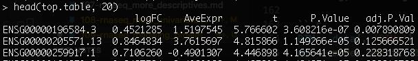

# 2020-05-15 07:33:48

Let's continue our observations from 108 and follow a pipeline. Starting with
this one:

https://ucdavis-bioinformatics-training.github.io/2018-June-RNA-Seq-Workshop/thursday/DE.html

```r
library(edgeR)
myregion = 'ACC'
data = readRDS('~/data/rnaseq_derek/complete_rawCountData_05132020.rds')
grex_vars = colnames(data)[grepl(colnames(data), pattern='^ENS')]
counts = t(data[data$Region==myregion, grex_vars])
d0 <- DGEList(counts)
d0 <- calcNormFactors(d0)
cutoff <- 1  # subjective... play with this
drop <- which(apply(cpm(d0), 1, max) < cutoff)
d <- d0[-drop,]
group = data[data$Region==myregion, 'Diagnosis']
plotMDS(d, col = as.numeric(group))
```


```r
mm <- model.matrix(~0 + group)
y <- voom(d, mm, plot = T)
```


This is supposedly a good fit, base don the tutorial.

```r
fit <- lmFit(y, mm)
contr <- makeContrasts(groupCase - groupControl, levels = colnames(coef(fit)))
tmp <- contrasts.fit(fit, contr)
tmp <- eBayes(tmp)
top.table <- topTable(tmp, sort.by = "P", n = Inf)
```

This seems to finish the analysis, but as expected we don't have anything useful
after corretion with FDR.

We could check for pH, RIN and batch variables. What happens if I just chuck
them into the model?

```r
RIN = data[data$Region==myregion, 'RINe']
pH = data[data$Region==myregion, 'pH']
site = data[data$Region==myregion, 'bainbank']
batch = factor(data[data$Region==myregion, 'run_date'])
```

pH has many NAs, and I cannot add site and batch at the same time without
altering the variables, as there as cross-overs in the categories with zero
samples. It's just a matter of recoding, or doing the batch correction twice,
but for now we're just playing.

```r
mm <- model.matrix(~0 + group + batch + RIN)
y <- voom(d, mm, plot = T)
```


```r
fit <- lmFit(y, mm)
contr <- makeContrasts(groupCase - groupControl, levels = colnames(coef(fit)))
tmp <- contrasts.fit(fit, contr)
tmp <- eBayes(tmp)
top.table <- topTable(tmp, sort.by = "P", n = Inf)
head(top.table, 20)
```

```r
fit <- lmFit(y, mm)
contr <- makeContrasts(groupCase - groupControl, levels = colnames(coef(fit)))
tmp <- contrasts.fit(fit, contr)
tmp <- eBayes(tmp)
top.table <- topTable(tmp, sort.by = "P", n = Inf)
head(top.table, 20)
```

Still nothing. Maybe there really isn't anything if we use FDR. But we do have
plenty of other things to try, and we're just starting...

## Effects of combat

```r
library(sva)
data = readRDS('~/data/rnaseq_derek/complete_rawCountData_05132020.rds')
data = data[data$Region=='ACC', ]
grex_vars = colnames(data)[grepl(colnames(data), pattern='^ENS')]
count_matrix = t(data[, grex_vars])
batch = as.numeric(data$run_date)
group = as.numeric(data$Diagnosis)
adjusted_counts <- ComBat_seq(count_matrix, batch=batch, group=group)
# now I'll further adjust it for brain bank
batch = as.numeric(data$bainbank)
adjusted_counts2 <- ComBat_seq(adjusted_counts, batch=batch, group=group)

d0 <- DGEList(adjusted_counts2)
d0 <- calcNormFactors(d0)
cutoff <- 1  # subjective... play with this
drop <- which(apply(cpm(d0), 1, max) < cutoff)
d <- d0[-drop,]
group = data[, 'Diagnosis']
plotMDS(d, col = as.numeric(group))
```


I forgot to remove 57...

```r
data = readRDS('~/data/rnaseq_derek/complete_rawCountData_05132020.rds')
data = data[-c(which(rownames(data)=='57')), ] # removing ACC outlier
data = data[data$Region=='ACC', ]
grex_vars = colnames(data)[grepl(colnames(data), pattern='^ENS')]
count_matrix = t(data[, grex_vars])
batch = as.numeric(data$run_date)
group = as.numeric(data$Diagnosis)
adjusted_counts <- ComBat_seq(count_matrix, batch=batch, group=group)
# now I'll further adjust it for brain bank
batch = as.numeric(data$bainbank)
adjusted_counts2 <- ComBat_seq(adjusted_counts, batch=batch, group=group)

d0 <- DGEList(adjusted_counts2)
d0 <- calcNormFactors(d0)
cutoff <- 1  # subjective... play with this
drop <- which(apply(cpm(d0), 1, max) < cutoff)
d <- d0[-drop,]
group = data[, 'Diagnosis']
plotMDS(d, col = as.numeric(group))
```


This is better. Maybe it even correlates with population...

```r
mm <- model.matrix(~0 + group)
y <- voom(d, mm, plot = T)
```


```r
fit <- lmFit(y, mm)
contr <- makeContrasts(groupCase - groupControl, levels = colnames(coef(fit)))
tmp <- contrasts.fit(fit, contr)
tmp <- eBayes(tmp)
top.table <- topTable(tmp, sort.by = "P", n = Inf)
head(top.table, 20)
```


This is looking much more promising... I could try being more stringent in the
cleaning, or adding a few more covariates, like RIN and PCs?

```r
RIN = data[, 'RINe']
mm <- model.matrix(~0 + group + RIN)
y <- voom(d, mm, plot = F)
fit <- lmFit(y, mm)
contr <- makeContrasts(groupCase - groupControl, levels = colnames(coef(fit)))
tmp <- contrasts.fit(fit, contr)
tmp <- eBayes(tmp)
top.table <- topTable(tmp, sort.by = "P", n = Inf)
head(top.table, 20)
```



One hit... maybe adding PCs, or even keeping it to WNH only? Apparently we
cannot run more than 1 continuous variable in the model matrix? It's giving me
errors. Let's focus on the WNH only then.

```r
mm <- model.matrix(~0 + Diagnosis + RINe + C1 + C2 + C3 + C4 + C5 + C6 + C7 + C8 + C9 + C10, data=data)
mm <- model.matrix(~0 + Diagnosis + RINe + C1, data=data)
y <- voom(d, mm, plot = F)
fit <- lmFit(y, mm)
contr <- makeContrasts(DiagnosisCase - DiagnosisControl,
                       levels = colnames(coef(fit)))
tmp <- contrasts.fit(fit, contr)
tmp <- eBayes(tmp)
top.table <- topTable(tmp, sort.by = "P", n = Inf)
head(top.table, 20)
```


# TODO
* run the pipeline after combat?
* try caudate
* play with other gene removal thresholds
* try other pipelines from note 108