# 2020-05-18 20:38:23

Let's re-run our current best RNAseq pipeline and check on the results. So, the
best we can do uses ACC WNH, running combat_seq twice.

The final number of good genes depends on the gene cut-off, but let's re-run the
stability analysis again.

```r
library(sva)
library(edgeR)
data = readRDS('~/data/rnaseq_derek/complete_rawCountData_05132020.rds')
data = data[-c(which(rownames(data)=='57')), ] # removing ACC outlier
data = data[data$Region=='ACC', ]
plot(data$C1, data$C2)
```

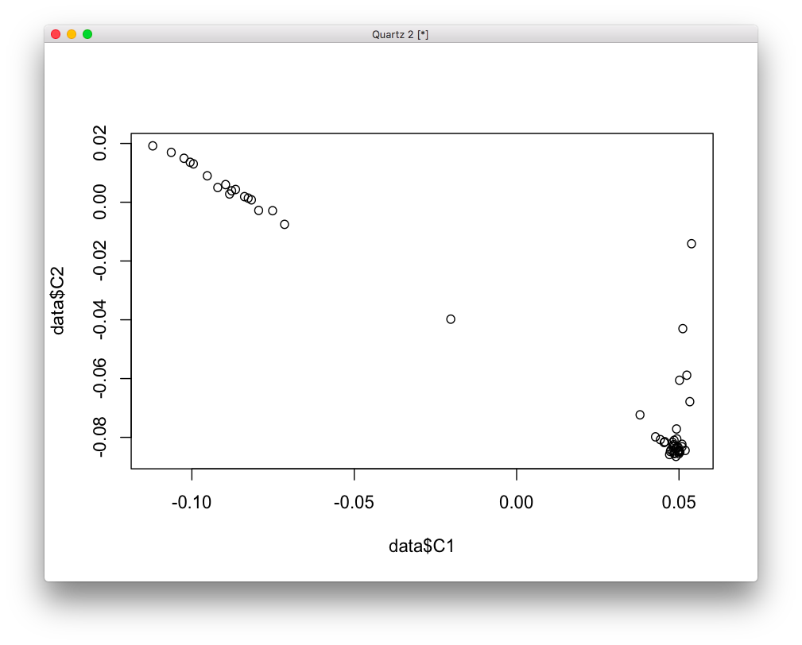

```r
# use WNH only
imWNH = data$C1 > 0 & data$C2 < -.075
data = data[which(imWNH),]

grex_vars = colnames(data)[grepl(colnames(data), pattern='^ENS')]
count_matrix = t(data[, grex_vars])
batch = as.numeric(factor(data$run_date))
group = as.numeric(data$Diagnosis)
print(table(batch, data$Diagnosis))
print(table(data$bainbank, data$Diagnosis))
```

```
> print(table(batch, data$Diagnosis))
     
batch Case Control
    1    3       1
    2    2       4
    3    9       5
    4    4       2
> print(table(data$bainbank, data$Diagnosis))
           
            Case Control
  nimh_hbcc    7       3
  pitt         4       1
  umbn         7       8
```

```r
adjusted_counts <- ComBat_seq(count_matrix, batch=batch, group=group)
# now I'll further adjust it for brain bank
batch = as.numeric(data$bainbank)
rawCountTable <- ComBat_seq(adjusted_counts, batch=batch, group=group)

geneid <- rownames(rawCountTable)
# remove that weird .num after ENSG
id_num = sapply(geneid,
                function(x) strsplit(x=x, split='\\.')[[1]][1])
dups = duplicated(id_num)
id_num = id_num[!dups]
rawCountTable = rawCountTable[!dups, ]
rownames(rawCountTable) = id_num
colnames(rawCountTable) <- data$submitted_name

library('biomaRt')
mart <- useDataset("hsapiens_gene_ensembl", useMart("ensembl"))
G_list <- getBM(filters= "ensembl_gene_id", attributes= c("ensembl_gene_id",
                "hgnc_symbol", "chromosome_name"),values=id_num,mart= mart)
G_list <- G_list[!duplicated(G_list$ensembl_gene_id),]
imnamed = rownames(rawCountTable) %in% G_list$ensembl_gene_id
rawCountTable = rawCountTable[imnamed, ]
samples = data.frame(batch=as.numeric(factor(data$run_date)),
                     bank=data$bainbank, RIN=data$RINe)
rownames(samples) = data$submitted_name
library(edgeR)
x <- DGEList(rawCountTable, samples=samples, genes=G_list, group=data$Diagnosis)
cpm0 <- cpm(x)
lcpm0 <- cpm(x, log=TRUE)
L <- mean(x$samples$lib.size) * 1e-6
M <- median(x$samples$lib.size) * 1e-6
keep.exprs <- filterByExpr(x, group=data$Diagnosis)
x <- x[keep.exprs,, keep.lib.sizes=FALSE]
```

Let's show all the data to spot outliers. We have 30 WNH subjects, so let's show
before and after gene removal for all of them:

```r
lcpm.cutoff <- log2(10/M + 2/L)
lcpm <- cpm(x, log=TRUE)

library(RColorBrewer)
col <- brewer.pal(10, "Paired")
par(mfrow=c(3,2))
plot(density(lcpm0[,1]), col=col[1], lwd=2, ylim=c(0,0.36), las=2, main="", xlab="")
title(main="A. Raw data", xlab="Log-cpm")
abline(v=lcpm.cutoff, lty=3)
for (i in 2:10){
  den <- density(lcpm0[,i])
  lines(den$x, den$y, col=col[i], lwd=2)
}
legend("topright", legend=data$submitted_name[1:10], text.col=col, bty="n")
plot(density(lcpm[,1]), col=col[1], lwd=2, ylim=c(0,0.36), las=2, main="", xlab="")
title(main="B. Filtered data", xlab="Log-cpm")
abline(v=lcpm.cutoff, lty=3)
for (i in 2:10){
  den <- density(lcpm[,i])
  lines(den$x, den$y, col=col[i], lwd=2)
}

plot(density(lcpm0[,11]), col=col[1], lwd=2, ylim=c(0,0.36), las=2, main="", xlab="")
title(main="A. Raw data", xlab="Log-cpm")
abline(v=lcpm.cutoff, lty=3)
for (i in 12:20){
  den <- density(lcpm0[,i])
  lines(den$x, den$y, col=col[i-10], lwd=2)
}
legend("topright", legend=data$submitted_name[11:20], text.col=col, bty="n")
plot(density(lcpm[,11]), col=col[1], lwd=2, ylim=c(0,0.36), las=2, main="", xlab="")
title(main="B. Filtered data", xlab="Log-cpm")
abline(v=lcpm.cutoff, lty=3)
for (i in 12:20){
  den <- density(lcpm[,i])
  lines(den$x, den$y, col=col[i-10], lwd=2)
}

plot(density(lcpm0[,21]), col=col[1], lwd=2, ylim=c(0,0.36), las=2, main="", xlab="")
title(main="A. Raw data", xlab="Log-cpm")
abline(v=lcpm.cutoff, lty=3)
for (i in 21:30){
  den <- density(lcpm0[,i])
  lines(den$x, den$y, col=col[i-20], lwd=2)
}
legend("topright", legend=data$submitted_name[1:10], text.col=col, bty="n")
plot(density(lcpm[,21]), col=col[1], lwd=2, ylim=c(0,0.36), las=2, main="", xlab="")
title(main="B. Filtered data", xlab="Log-cpm")
abline(v=lcpm.cutoff, lty=3)
for (i in 21:30){
  den <- density(lcpm[,i])
  lines(den$x, den$y, col=col[i-20], lwd=2)
}
```

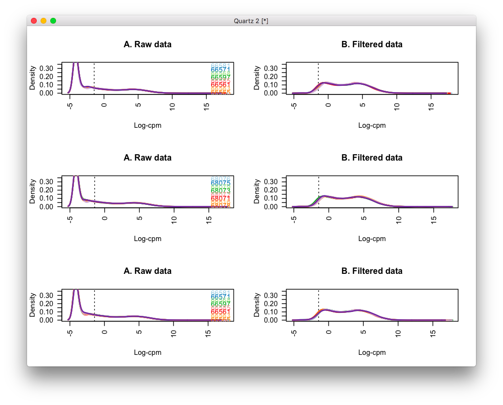

```r
x <- calcNormFactors(x, method = "TMM")
lcpm <- cpm(x, log=TRUE)
par(mfrow=c(1,2))
col.group <- data$Diagnosis
levels(col.group) <-  brewer.pal(nlevels(col.group), "Set1")
col.group <- as.character(col.group)
plotMDS(lcpm, labels=data$Diagnosis, col=col.group)
plotMDS(lcpm, labels=data$Diagnosis, col=col.group, dim=c(3,4))
```

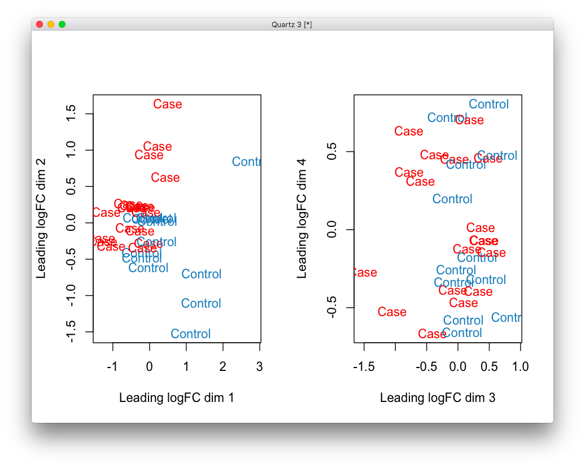

```r
mm <- model.matrix(~0 + Diagnosis + RINe, data=data)
v <- voom(x, mm, plot = T)
fit <- lmFit(v, mm)
contr <- makeContrasts(DiagnosisCase - DiagnosisControl,
                        levels = colnames(coef(fit)))
tmp <- contrasts.fit(fit, contr)
tmp <- eBayes(tmp)
top.table <- topTable(tmp, sort.by = "P", n = Inf)
head(top.table, 20)
length(which(top.table$adj.P.Val < 0.05))
```

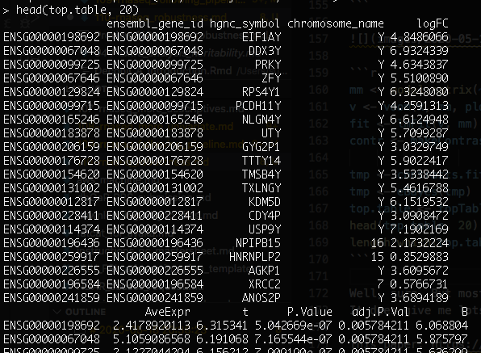

Well, sure. But most of our results are in ChrY? And before I had only results
in X... something funky going on. What if I use sex as a covariate?

```r
mm <- model.matrix(~0 + Diagnosis + Sex + RINe, data=data)
v <- voom(x, mm, plot = T)
fit <- lmFit(v, mm)
contr <- makeContrasts(DiagnosisCase - DiagnosisControl,
                        levels = colnames(coef(fit)))
tmp <- contrasts.fit(fit, contr)
tmp <- eBayes(tmp)
top.table <- topTable(tmp, sort.by = "P", n = Inf)
head(top.table, 20)
length(which(top.table$adj.P.Val < 0.05))
```

Now nothing survives... it might be controvesial, but what if I use only males?

```r
library(sva)
library(edgeR)
data = readRDS('~/data/rnaseq_derek/complete_rawCountData_05132020.rds')
data = data[-c(which(rownames(data)=='57')), ] # removing ACC outlier
data = data[data$Region=='ACC', ]
data = data[data$Sex=='M',]
# use WNH only
imWNH = data$C1 > 0 & data$C2 < -.075
data = data[which(imWNH),]

grex_vars = colnames(data)[grepl(colnames(data), pattern='^ENS')]
count_matrix = t(data[, grex_vars])
batch = as.numeric(factor(data$run_date))
group = as.numeric(data$Diagnosis)
adjusted_counts <- ComBat_seq(count_matrix, batch=batch, group=group)
# now I'll further adjust it for brain bank
batch = as.numeric(data$bainbank)
rawCountTable <- ComBat_seq(adjusted_counts, batch=batch, group=group)

geneid <- rownames(rawCountTable)
# remove that weird .num after ENSG
id_num = sapply(geneid,
                function(x) strsplit(x=x, split='\\.')[[1]][1])
dups = duplicated(id_num)
id_num = id_num[!dups]
rawCountTable = rawCountTable[!dups, ]
rownames(rawCountTable) = id_num
colnames(rawCountTable) <- data$submitted_name

library('biomaRt')
mart <- useDataset("hsapiens_gene_ensembl", useMart("ensembl"))
G_list <- getBM(filters= "ensembl_gene_id", attributes= c("ensembl_gene_id",
                "hgnc_symbol", "chromosome_name"),values=id_num,mart= mart)
G_list <- G_list[!duplicated(G_list$ensembl_gene_id),]
imnamed = rownames(rawCountTable) %in% G_list$ensembl_gene_id
rawCountTable = rawCountTable[imnamed, ]
samples = data.frame(batch=as.numeric(factor(data$run_date)),
                     bank=data$bainbank, RIN=data$RINe)
rownames(samples) = data$submitted_name
library(edgeR)
x <- DGEList(rawCountTable, samples=samples, genes=G_list, group=data$Diagnosis)
cpm0 <- cpm(x)
lcpm0 <- cpm(x, log=TRUE)
L <- mean(x$samples$lib.size) * 1e-6
M <- median(x$samples$lib.size) * 1e-6
keep.exprs <- filterByExpr(x, group=data$Diagnosis)
x <- x[keep.exprs,, keep.lib.sizes=FALSE]

lcpm.cutoff <- log2(10/M + 2/L)
x <- calcNormFactors(x, method = "TMM")
lcpm <- cpm(x, log=TRUE)

mm <- model.matrix(~0 + Diagnosis + RINe, data=data)
v <- voom(x, mm, plot = T)
fit <- lmFit(v, mm)
contr <- makeContrasts(DiagnosisCase - DiagnosisControl,
                        levels = colnames(coef(fit)))
tmp <- contrasts.fit(fit, contr)
tmp <- eBayes(tmp)
top.table <- topTable(tmp, sort.by = "P", n = Inf)
head(top.table, 20)
length(which(top.table$adj.P.Val < 0.05))
```


Now I got a handful of hits q < .1. I wonder how that varies based on the
gene cutoff?

```r
cutoffs = seq(0.001, 10, len=50)
genes_left = c()
good_genes_p1 = c()
good_genes_p05 = c()
d0 <- DGEList(rawCountTable, samples=samples, genes=G_list, group=data$Diagnosis)
for (cutoff in cutoffs) {
    print(cutoff)
    drop <- which(apply(cpm(d0), 1, max) < cutoff)
    d <- d0[-drop,]
    genes_left = c(genes_left, nrow(d))

    mm <- model.matrix(~0 + Diagnosis + RINe, data=data)
    y <- voom(d, mm, plot = F)
    fit <- lmFit(y, mm)
    contr <- makeContrasts(DiagnosisCase - DiagnosisControl,
                        levels = colnames(coef(fit)))
    tmp <- contrasts.fit(fit, contr)
    tmp <- eBayes(tmp)
    top.table <- topTable(tmp, sort.by = "P", n = Inf)
    good_genes_p05 = c(good_genes_p05,
                   length(which(top.table$adj.P.Val < 0.05)))
    good_genes_p1 = c(good_genes_p1,
                   length(which(top.table$adj.P.Val < 0.1)))
}
```

```
> good_genes_p05
 [1] 2 2 2 1 1 1 1 1 1 1 1 1 1 1 1 1 1 1 1 1 1 1 1 1 1 1 1 1 1 1 1 1 1 1 1 1 1 1
[39] 1 1 1 1 1 1 1 1 0 0 0 0
> good_genes_p1
 [1] 2 8 7 1 1 7 1 1 1 1 1 1 1 1 1 1 1 1 1 1 1 1 1 1 1 1 1 1 1 1 1 1 1 1 1 3 3 3
[39] 3 3 3 3 3 3 3 3 0 0 0 0
```

Doesn't look too stable. But at least I can play a bit with those 4 under q < .1?
 It does seem a bit too little, after looking at only males and WNH. 

# 2020-05-19 09:57:10

Philip suggested the following: 

(1) re-run for autosomes -WNH;
(2) run for autosomes ALL_ and see if there is any correlation between the WNH
and ALL in beta;
(3) send Sam lots of list of nominal sig----usually around 50-100 genes is a
good sized list for IPA.  Tell him to run DisGeNet also; and to look at the
brain atlases (he could start digging around in these).

## WNH autosomes

```r
library(sva)
library(edgeR)
data = readRDS('~/data/rnaseq_derek/complete_rawCountData_05132020.rds')
data = data[-c(which(rownames(data)=='57')), ] # removing ACC outlier
data = data[data$Region=='ACC', ]
# use WNH only
imWNH = data$C1 > 0 & data$C2 < -.075
data = data[which(imWNH),]

grex_vars = colnames(data)[grepl(colnames(data), pattern='^ENS')]
count_matrix = t(data[, grex_vars])
# remove that weird .num after ENSG
id_num = sapply(grex_vars,
                function(x) strsplit(x=x, split='\\.')[[1]][1])
rownames(count_matrix) = id_num
colnames(count_matrix) <- data$submitted_name
dups = duplicated(id_num)
id_num = id_num[!dups]
count_matrix = count_matrix[!dups, ]

library('biomaRt')
mart <- useDataset("hsapiens_gene_ensembl", useMart("ensembl"))
G_list <- getBM(filters= "ensembl_gene_id", attributes= c("ensembl_gene_id",
                "hgnc_symbol", "chromosome_name"),values=id_num,mart= mart)
G_list <- G_list[!duplicated(G_list$ensembl_gene_id),]
imnamed = rownames(count_matrix) %in% G_list$ensembl_gene_id
count_matrix = count_matrix[imnamed, ]
imautosome = which(G_list$chromosome_name != 'X' &
                   G_list$chromosome_name != 'Y' &
                   G_list$chromosome_name != 'MT')
count_matrix = count_matrix[imautosome, ]
G_list = G_list[imautosome, ]

batch = as.numeric(factor(data$run_date))
group = as.numeric(data$Diagnosis)
adjusted_counts <- ComBat_seq(count_matrix, batch=batch, group=group)
# now I'll further adjust it for brain bank
batch = as.numeric(data$bainbank)
rawCountTable <- ComBat_seq(adjusted_counts, batch=batch, group=group)

samples = data.frame(batch=as.numeric(factor(data$run_date)),
                     bank=data$bainbank, RIN=data$RINe)
rownames(samples) = data$submitted_name

library(edgeR)
x0 <- DGEList(rawCountTable, samples=samples, genes=G_list, group=data$Diagnosis)
keep.exprs <- filterByExpr(x0, group=data$Diagnosis)
x <- x0[keep.exprs, keep.lib.sizes=FALSE]
x <- calcNormFactors(x, method = "TMM")
lcpm <- cpm(x, log=TRUE)

mm <- model.matrix(~0 + Diagnosis + RINe, data=data)
v <- voom(x, mm, plot = F)
fit <- lmFit(v, mm)
contr <- makeContrasts(DiagnosisCase - DiagnosisControl,
                        levels = colnames(coef(fit)))
tmp <- contrasts.fit(fit, contr)
tmp <- eBayes(tmp)
top.table <- topTable(tmp, sort.by = "P", n = Inf)
head(top.table, 20)
```

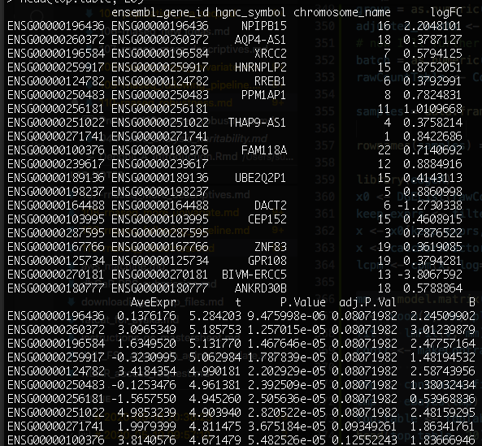

We have about 10 with q < .1. I'll send the table to Sam for him to run a few
thresholds. Does Sex affect the results this time?

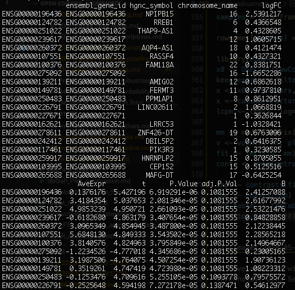

Yes, a little bit. But not as much as before though. Now, let's see how this
looks if we don't restrict it to WNH only:

## All autosomes

```r
library(sva)
library(edgeR)
data = readRDS('~/data/rnaseq_derek/complete_rawCountData_05132020.rds')
data = data[-c(which(rownames(data)=='57')), ] # removing ACC outlier
data = data[data$Region=='ACC', ]

grex_vars = colnames(data)[grepl(colnames(data), pattern='^ENS')]
count_matrix = t(data[, grex_vars])
# remove that weird .num after ENSG
id_num = sapply(grex_vars,
                function(x) strsplit(x=x, split='\\.')[[1]][1])
rownames(count_matrix) = id_num
colnames(count_matrix) <- data$submitted_name
dups = duplicated(id_num)
id_num = id_num[!dups]
count_matrix = count_matrix[!dups, ]

library('biomaRt')
mart <- useDataset("hsapiens_gene_ensembl", useMart("ensembl"))
G_list <- getBM(filters= "ensembl_gene_id", attributes= c("ensembl_gene_id",
                "hgnc_symbol", "chromosome_name"),values=id_num,mart= mart)
G_list <- G_list[!duplicated(G_list$ensembl_gene_id),]
imnamed = rownames(count_matrix) %in% G_list$ensembl_gene_id
count_matrix = count_matrix[imnamed, ]
imautosome = which(G_list$chromosome_name != 'X' &
                   G_list$chromosome_name != 'Y' &
                   G_list$chromosome_name != 'MT')
count_matrix = count_matrix[imautosome, ]
G_list = G_list[imautosome, ]

batch = as.numeric(factor(data$run_date))
group = as.numeric(data$Diagnosis)
adjusted_counts <- ComBat_seq(count_matrix, batch=batch, group=group)
# now I'll further adjust it for brain bank
batch = as.numeric(data$bainbank)
rawCountTable <- ComBat_seq(adjusted_counts, batch=batch, group=group)

samples = data.frame(batch=as.numeric(factor(data$run_date)),
                     bank=data$bainbank, RIN=data$RINe)
rownames(samples) = data$submitted_name

library(edgeR)
x0 <- DGEList(rawCountTable, samples=samples, genes=G_list, group=data$Diagnosis)
keep.exprs <- filterByExpr(x0, group=data$Diagnosis)
x <- x0[keep.exprs, keep.lib.sizes=FALSE]
x <- calcNormFactors(x, method = "TMM")
lcpm <- cpm(x, log=TRUE)

mm <- model.matrix(~0 + Diagnosis + RINe, data=data)
v <- voom(x, mm, plot = F)
fit <- lmFit(v, mm)
contr <- makeContrasts(DiagnosisCase - DiagnosisControl,
                        levels = colnames(coef(fit)))
tmp <- contrasts.fit(fit, contr)
tmp <- eBayes(tmp)
top.table <- topTable(tmp, sort.by = "P", n = Inf)
head(top.table, 20)
```

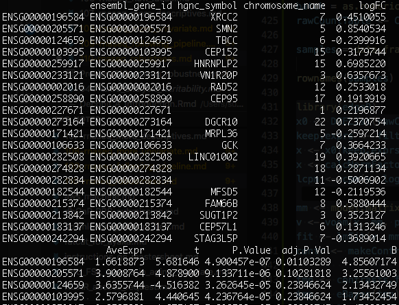

Well, there's one big hit and then that's it... I wonder if I wouldn't do better
using the data for both brain regions? In particular, this looks promising:

https://bioconductor.org/packages/release/bioc/vignettes/variancePartition/inst/doc/dream.html

Let's first make a few plots. I'll keep playing with autosomes for now:

```r
library(sva)
library(edgeR)
data = readRDS('~/data/rnaseq_derek/complete_rawCountData_05132020.rds')
data = data[-c(which(rownames(data)=='57')), ] # removing ACC outlier

grex_vars = colnames(data)[grepl(colnames(data), pattern='^ENS')]
count_matrix = t(data[, grex_vars])
# remove that weird .num after ENSG
id_num = sapply(grex_vars,
                function(x) strsplit(x=x, split='\\.')[[1]][1])
rownames(count_matrix) = id_num
colnames(count_matrix) <- data$submitted_name
dups = duplicated(id_num)
id_num = id_num[!dups]
count_matrix = count_matrix[!dups, ]
library('biomaRt')
mart <- useDataset("hsapiens_gene_ensembl", useMart("ensembl"))
G_list <- getBM(filters= "ensembl_gene_id", attributes= c("ensembl_gene_id",
                "hgnc_symbol", "chromosome_name"),values=id_num,mart= mart)
G_list <- G_list[!duplicated(G_list$ensembl_gene_id),]
imnamed = rownames(count_matrix) %in% G_list$ensembl_gene_id
count_matrix = count_matrix[imnamed, ]
imautosome = which(G_list$chromosome_name != 'X' &
                   G_list$chromosome_name != 'Y' &
                   G_list$chromosome_name != 'MT')
count_matrix = count_matrix[imautosome, ]
G_list = G_list[imautosome, ]

x <- DGEList(count_matrix, genes=G_list, group=data$Diagnosis)
lcpm <- cpm(x, log=TRUE)

library(ggplot2)
mds = plotMDS(lcpm, plot=F)
DX2 = sapply(1:nrow(data), function(x) sprintf('%s_%s', data[x, 'Diagnosis'],
                                                data[x, 'Region']))
plot_data = data.frame(x=mds$x, y=mds$y,
                       batch=factor(data$run_date),
                       group=factor(DX2))
ggplot(plot_data, aes(x=x, y=y, shape=group, color=batch)) + geom_point()
```

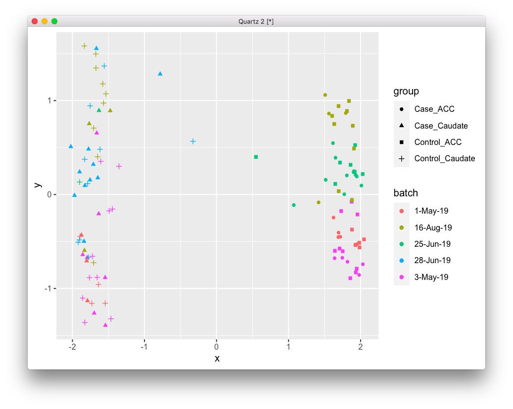

There is definitely a batch effect here, where samples of the same batch (same
color) group together. And of course, ACC and Caudate samples are extremely
different. How does it relate to brain bank?

```r
plot_data = data.frame(x=mds$x, y=mds$y,
                       bank=factor(data$bainbank),
                       group=factor(DX2))
ggplot(plot_data, aes(x=x, y=y, shape=group, color=bank)) + geom_point()
```

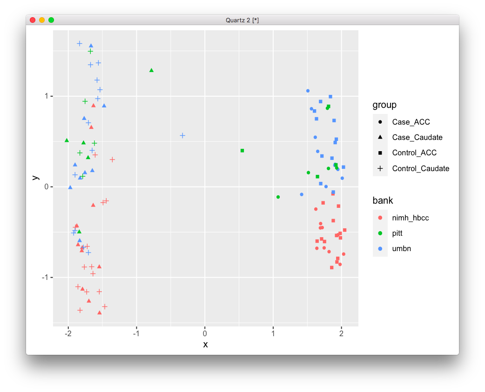

There is indeed some degree of clustering, but I'm not sure if it wouldn't just
go away if I corrected for batch first. I do want to remove those outliers
first:

```r
imout = which(mds$x>-1 & mds$x<1.2)
data = data[-imout, ]
x = x[, -imout]
lcpm <- cpm(x, log=TRUE)
mds = plotMDS(lcpm, plot=F)
DX2 = sapply(1:nrow(data), function(x) sprintf('%s_%s', data[x, 'Diagnosis'],
                                                data[x, 'Region']))
plot_data = data.frame(x=mds$x, y=mds$y,
                       batch=factor(data$run_date),
                       group=factor(DX2))
ggplot(plot_data, aes(x=x, y=y, shape=group, color=batch)) + geom_point()
```

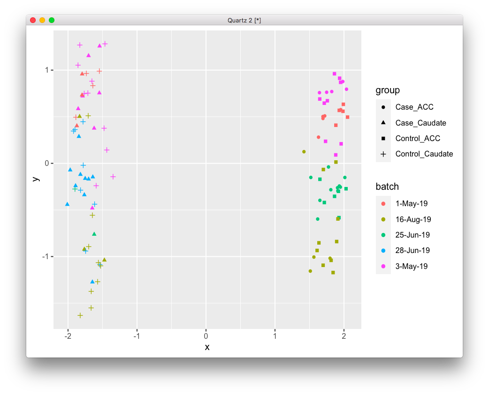

This is much better. Now, let's deal with the batches:

```r
count_matrix = count_matrix[, -imout]
batch = factor(data$run_date)
group = factor(DX2)
adjusted_counts <- ComBat_seq(count_matrix, batch=batch, group=group)

x <- DGEList(adjusted_counts, genes=G_list, group=data$Diagnosis)
lcpm <- cpm(x, log=TRUE)
mds = plotMDS(lcpm, plot=F)
plot_data = data.frame(x=mds$x, y=mds$y,
                       batch=factor(data$run_date),
                       group=factor(DX2))
ggplot(plot_data, aes(x=x, y=y, shape=group, color=batch)) + geom_point()
```

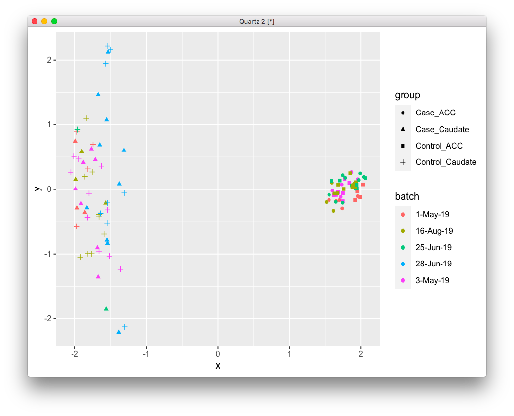

There isn't much of a batch effect anymore. Is there still a brain bank
effect?

```r
plot_data = data.frame(x=mds$x, y=mds$y,
                       bank=factor(data$bainbank),
                       group=factor(DX2))
ggplot(plot_data, aes(x=x, y=y, shape=group, color=bank)) + geom_point()
```

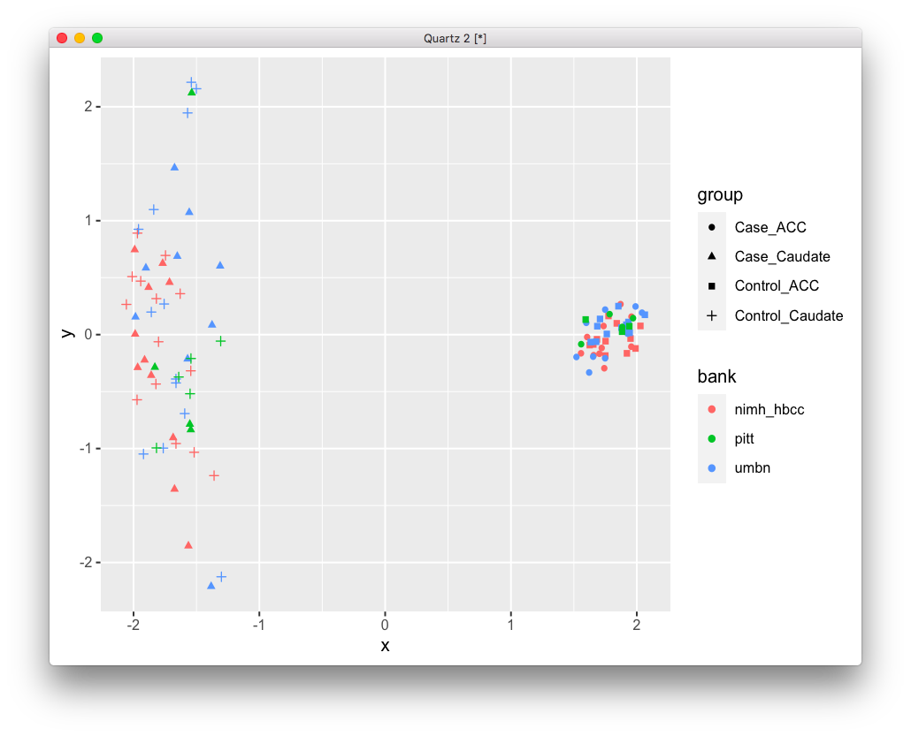

No, doesn't look like it. OK, so now I can think about cleaning the data again,
and maybe running a few more sofisticated models, like the link above.

# 2020-05-20 06:38:17

```r
samples = data.frame(batch=as.numeric(factor(data$run_date)),
                     bank=data$bainbank, RIN=data$RINe, region=data$Region)
rownames(samples) = data$submitted_name

library(edgeR)
x0 <- DGEList(adjusted_counts, samples=samples, genes=G_list, group=data$Diagnosis)
keep.exprs <- filterByExpr(x0, group=data$Diagnosis)
x <- x0[keep.exprs, keep.lib.sizes=FALSE]
x <- calcNormFactors(x, method = "TMM")

library(variancePartition)
```


# TODO
* run mixed effect model using dream
* check if there is a difference if I use COMBAT with 2 different factors? how about doing filterBy using the 4 groups?
  instead of a single factor with 4 levels
* try making RIN plot as well, like that https://www.hindawi.com/journals/bmri/2018/2906292/
* what about using FPKM or other normalizer instead of CPM?
* what if I try the other regressions from the paper? (without using voom)
* not remove women but remove all Y-genes? potentially all X as well?
* what if we focused on males and ONLY on the Y chromosome?
* maybe worth putting back caudate and ACC data and just correct in the model?
  maybe try it with everyone's data and then WNH only...
* also maybe look at this: 
* show that same pipeline doesn't work for Caudate
* pick the best genes and see if they come out in lme. Are there better
  covariates to use? Check only good genes.
* check the effects in batching after WNH selection
* run gene set analysis as suggested in the paper
* how do the ACC WNH results in the first pipeline look like in the entire population?
