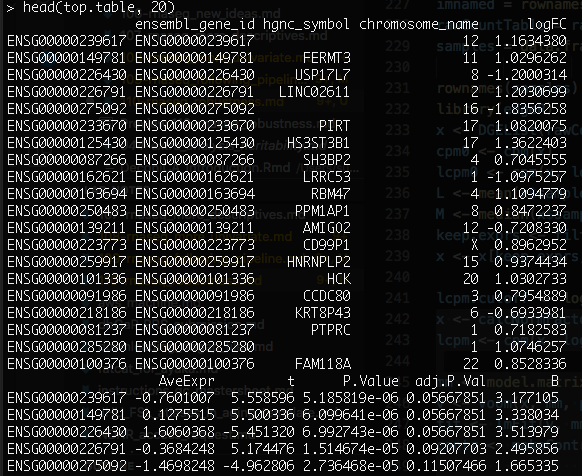
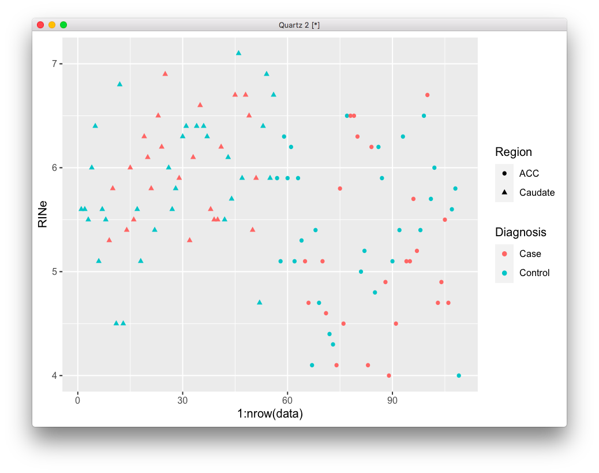
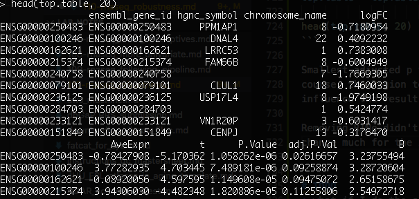
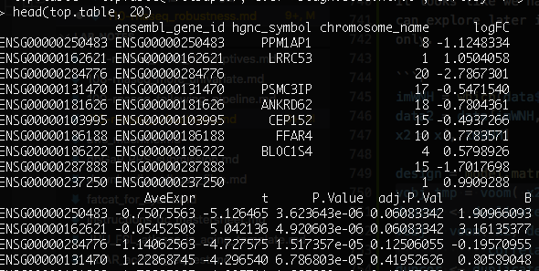
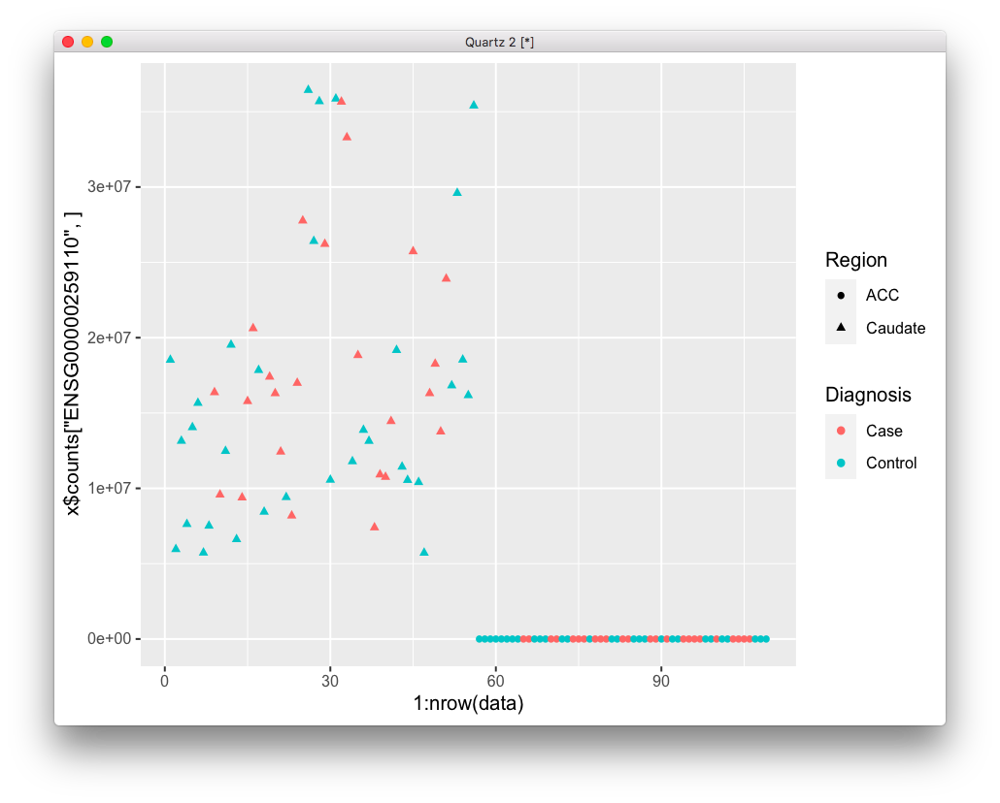
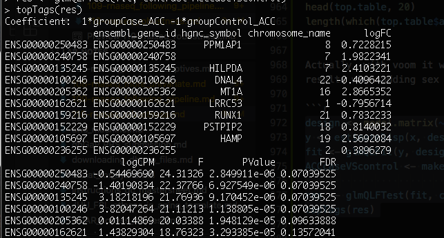
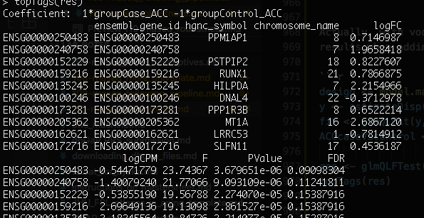
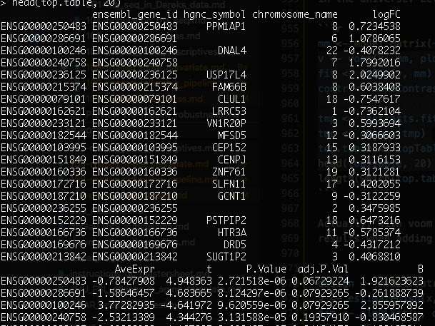
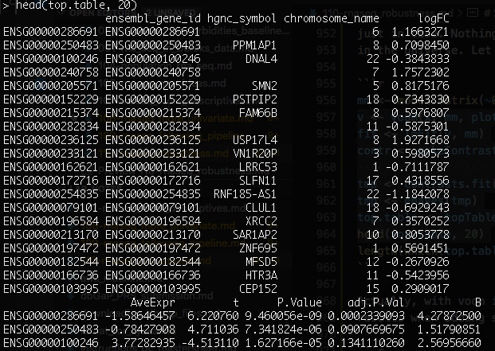

# 2020-05-18 20:38:23

Let's re-run our current best RNAseq pipeline and check on the results. So, the
best we can do uses ACC WNH, running combat_seq twice.

The final number of good genes depends on the gene cut-off, but let's re-run the
stability analysis again.

```r
library(sva)
library(edgeR)
data = readRDS('~/data/rnaseq_derek/complete_rawCountData_05132020.rds')
data = data[-c(which(rownames(data)=='57')), ] # removing ACC outlier
data = data[data$Region=='ACC', ]
plot(data$C1, data$C2)
```


```r
# use WNH only
imWNH = data$C1 > 0 & data$C2 < -.075
data = data[which(imWNH),]

grex_vars = colnames(data)[grepl(colnames(data), pattern='^ENS')]
count_matrix = t(data[, grex_vars])
batch = as.numeric(factor(data$run_date))
group = as.numeric(data$Diagnosis)
print(table(batch, data$Diagnosis))
print(table(data$bainbank, data$Diagnosis))
```

```
> print(table(batch, data$Diagnosis))
     
batch Case Control
    1    3       1
    2    2       4
    3    9       5
    4    4       2
> print(table(data$bainbank, data$Diagnosis))
           
            Case Control
  nimh_hbcc    7       3
  pitt         4       1
  umbn         7       8
```

```r
adjusted_counts <- ComBat_seq(count_matrix, batch=batch, group=group)
# now I'll further adjust it for brain bank
batch = as.numeric(data$bainbank)
rawCountTable <- ComBat_seq(adjusted_counts, batch=batch, group=group)

geneid <- rownames(rawCountTable)
# remove that weird .num after ENSG
id_num = sapply(geneid,
                function(x) strsplit(x=x, split='\\.')[[1]][1])
dups = duplicated(id_num)
id_num = id_num[!dups]
rawCountTable = rawCountTable[!dups, ]
rownames(rawCountTable) = id_num
colnames(rawCountTable) <- data$submitted_name

library('biomaRt')
mart <- useDataset("hsapiens_gene_ensembl", useMart("ensembl"))
G_list <- getBM(filters= "ensembl_gene_id", attributes= c("ensembl_gene_id",
                "hgnc_symbol", "chromosome_name"),values=id_num,mart= mart)
G_list <- G_list[!duplicated(G_list$ensembl_gene_id),]
imnamed = rownames(rawCountTable) %in% G_list$ensembl_gene_id
rawCountTable = rawCountTable[imnamed, ]
samples = data.frame(batch=as.numeric(factor(data$run_date)),
                     bank=data$bainbank, RIN=data$RINe)
rownames(samples) = data$submitted_name
library(edgeR)
x <- DGEList(rawCountTable, samples=samples, genes=G_list, group=data$Diagnosis)
cpm0 <- cpm(x)
lcpm0 <- cpm(x, log=TRUE)
L <- mean(x$samples$lib.size) * 1e-6
M <- median(x$samples$lib.size) * 1e-6
keep.exprs <- filterByExpr(x, group=data$Diagnosis)
x <- x[keep.exprs,, keep.lib.sizes=FALSE]
```

Let's show all the data to spot outliers. We have 30 WNH subjects, so let's show
before and after gene removal for all of them:

```r
lcpm.cutoff <- log2(10/M + 2/L)
lcpm <- cpm(x, log=TRUE)

library(RColorBrewer)
col <- brewer.pal(10, "Paired")
par(mfrow=c(3,2))
plot(density(lcpm0[,1]), col=col[1], lwd=2, ylim=c(0,0.36), las=2, main="", xlab="")
title(main="A. Raw data", xlab="Log-cpm")
abline(v=lcpm.cutoff, lty=3)
for (i in 2:10){
  den <- density(lcpm0[,i])
  lines(den$x, den$y, col=col[i], lwd=2)
}
legend("topright", legend=data$submitted_name[1:10], text.col=col, bty="n")
plot(density(lcpm[,1]), col=col[1], lwd=2, ylim=c(0,0.36), las=2, main="", xlab="")
title(main="B. Filtered data", xlab="Log-cpm")
abline(v=lcpm.cutoff, lty=3)
for (i in 2:10){
  den <- density(lcpm[,i])
  lines(den$x, den$y, col=col[i], lwd=2)
}

plot(density(lcpm0[,11]), col=col[1], lwd=2, ylim=c(0,0.36), las=2, main="", xlab="")
title(main="A. Raw data", xlab="Log-cpm")
abline(v=lcpm.cutoff, lty=3)
for (i in 12:20){
  den <- density(lcpm0[,i])
  lines(den$x, den$y, col=col[i-10], lwd=2)
}
legend("topright", legend=data$submitted_name[11:20], text.col=col, bty="n")
plot(density(lcpm[,11]), col=col[1], lwd=2, ylim=c(0,0.36), las=2, main="", xlab="")
title(main="B. Filtered data", xlab="Log-cpm")
abline(v=lcpm.cutoff, lty=3)
for (i in 12:20){
  den <- density(lcpm[,i])
  lines(den$x, den$y, col=col[i-10], lwd=2)
}

plot(density(lcpm0[,21]), col=col[1], lwd=2, ylim=c(0,0.36), las=2, main="", xlab="")
title(main="A. Raw data", xlab="Log-cpm")
abline(v=lcpm.cutoff, lty=3)
for (i in 21:30){
  den <- density(lcpm0[,i])
  lines(den$x, den$y, col=col[i-20], lwd=2)
}
legend("topright", legend=data$submitted_name[1:10], text.col=col, bty="n")
plot(density(lcpm[,21]), col=col[1], lwd=2, ylim=c(0,0.36), las=2, main="", xlab="")
title(main="B. Filtered data", xlab="Log-cpm")
abline(v=lcpm.cutoff, lty=3)
for (i in 21:30){
  den <- density(lcpm[,i])
  lines(den$x, den$y, col=col[i-20], lwd=2)
}
```


```r
x <- calcNormFactors(x, method = "TMM")
lcpm <- cpm(x, log=TRUE)
par(mfrow=c(1,2))
col.group <- data$Diagnosis
levels(col.group) <-  brewer.pal(nlevels(col.group), "Set1")
col.group <- as.character(col.group)
plotMDS(lcpm, labels=data$Diagnosis, col=col.group)
plotMDS(lcpm, labels=data$Diagnosis, col=col.group, dim=c(3,4))
```


```r
mm <- model.matrix(~0 + Diagnosis + RINe, data=data)
v <- voom(x, mm, plot = T)
fit <- lmFit(v, mm)
contr <- makeContrasts(DiagnosisCase - DiagnosisControl,
                        levels = colnames(coef(fit)))
tmp <- contrasts.fit(fit, contr)
tmp <- eBayes(tmp)
top.table <- topTable(tmp, sort.by = "P", n = Inf)
head(top.table, 20)
length(which(top.table$adj.P.Val < 0.05))
```


Well, sure. But most of our results are in ChrY? And before I had only results
in X... something funky going on. What if I use sex as a covariate?

```r
mm <- model.matrix(~0 + Diagnosis + Sex + RINe, data=data)
v <- voom(x, mm, plot = T)
fit <- lmFit(v, mm)
contr <- makeContrasts(DiagnosisCase - DiagnosisControl,
                        levels = colnames(coef(fit)))
tmp <- contrasts.fit(fit, contr)
tmp <- eBayes(tmp)
top.table <- topTable(tmp, sort.by = "P", n = Inf)
head(top.table, 20)
length(which(top.table$adj.P.Val < 0.05))
```

Now nothing survives... it might be controvesial, but what if I use only males?

```r
library(sva)
library(edgeR)
data = readRDS('~/data/rnaseq_derek/complete_rawCountData_05132020.rds')
data = data[-c(which(rownames(data)=='57')), ] # removing ACC outlier
data = data[data$Region=='ACC', ]
data = data[data$Sex=='M',]
# use WNH only
imWNH = data$C1 > 0 & data$C2 < -.075
data = data[which(imWNH),]

grex_vars = colnames(data)[grepl(colnames(data), pattern='^ENS')]
count_matrix = t(data[, grex_vars])
batch = as.numeric(factor(data$run_date))
group = as.numeric(data$Diagnosis)
adjusted_counts <- ComBat_seq(count_matrix, batch=batch, group=group)
# now I'll further adjust it for brain bank
batch = as.numeric(data$bainbank)
rawCountTable <- ComBat_seq(adjusted_counts, batch=batch, group=group)

geneid <- rownames(rawCountTable)
# remove that weird .num after ENSG
id_num = sapply(geneid,
                function(x) strsplit(x=x, split='\\.')[[1]][1])
dups = duplicated(id_num)
id_num = id_num[!dups]
rawCountTable = rawCountTable[!dups, ]
rownames(rawCountTable) = id_num
colnames(rawCountTable) <- data$submitted_name

library('biomaRt')
mart <- useDataset("hsapiens_gene_ensembl", useMart("ensembl"))
G_list <- getBM(filters= "ensembl_gene_id", attributes= c("ensembl_gene_id",
                "hgnc_symbol", "chromosome_name"),values=id_num,mart= mart)
G_list <- G_list[!duplicated(G_list$ensembl_gene_id),]
imnamed = rownames(rawCountTable) %in% G_list$ensembl_gene_id
rawCountTable = rawCountTable[imnamed, ]
samples = data.frame(batch=as.numeric(factor(data$run_date)),
                     bank=data$bainbank, RIN=data$RINe)
rownames(samples) = data$submitted_name
library(edgeR)
x <- DGEList(rawCountTable, samples=samples, genes=G_list, group=data$Diagnosis)
cpm0 <- cpm(x)
lcpm0 <- cpm(x, log=TRUE)
L <- mean(x$samples$lib.size) * 1e-6
M <- median(x$samples$lib.size) * 1e-6
keep.exprs <- filterByExpr(x, group=data$Diagnosis)
x <- x[keep.exprs,, keep.lib.sizes=FALSE]

lcpm.cutoff <- log2(10/M + 2/L)
x <- calcNormFactors(x, method = "TMM")
lcpm <- cpm(x, log=TRUE)

mm <- model.matrix(~0 + Diagnosis + RINe, data=data)
v <- voom(x, mm, plot = T)
fit <- lmFit(v, mm)
contr <- makeContrasts(DiagnosisCase - DiagnosisControl,
                        levels = colnames(coef(fit)))
tmp <- contrasts.fit(fit, contr)
tmp <- eBayes(tmp)
top.table <- topTable(tmp, sort.by = "P", n = Inf)
head(top.table, 20)
length(which(top.table$adj.P.Val < 0.05))
```



Now I got a handful of hits q < .1. I wonder how that varies based on the
gene cutoff?

```r
cutoffs = seq(0.001, 10, len=50)
genes_left = c()
good_genes_p1 = c()
good_genes_p05 = c()
d0 <- DGEList(rawCountTable, samples=samples, genes=G_list, group=data$Diagnosis)
for (cutoff in cutoffs) {
    print(cutoff)
    drop <- which(apply(cpm(d0), 1, max) < cutoff)
    d <- d0[-drop,]
    genes_left = c(genes_left, nrow(d))

    mm <- model.matrix(~0 + Diagnosis + RINe, data=data)
    y <- voom(d, mm, plot = F)
    fit <- lmFit(y, mm)
    contr <- makeContrasts(DiagnosisCase - DiagnosisControl,
                        levels = colnames(coef(fit)))
    tmp <- contrasts.fit(fit, contr)
    tmp <- eBayes(tmp)
    top.table <- topTable(tmp, sort.by = "P", n = Inf)
    good_genes_p05 = c(good_genes_p05,
                   length(which(top.table$adj.P.Val < 0.05)))
    good_genes_p1 = c(good_genes_p1,
                   length(which(top.table$adj.P.Val < 0.1)))
}
```

```
> good_genes_p05
 [1] 2 2 2 1 1 1 1 1 1 1 1 1 1 1 1 1 1 1 1 1 1 1 1 1 1 1 1 1 1 1 1 1 1 1 1 1 1 1
[39] 1 1 1 1 1 1 1 1 0 0 0 0
> good_genes_p1
 [1] 2 8 7 1 1 7 1 1 1 1 1 1 1 1 1 1 1 1 1 1 1 1 1 1 1 1 1 1 1 1 1 1 1 1 1 3 3 3
[39] 3 3 3 3 3 3 3 3 0 0 0 0
```

Doesn't look too stable. But at least I can play a bit with those 4 under q < .1?
 It does seem a bit too little, after looking at only males and WNH. 

# 2020-05-19 09:57:10

Philip suggested the following: 

(1) re-run for autosomes -WNH;
(2) run for autosomes ALL_ and see if there is any correlation between the WNH
and ALL in beta;
(3) send Sam lots of list of nominal sig----usually around 50-100 genes is a
good sized list for IPA.  Tell him to run DisGeNet also; and to look at the
brain atlases (he could start digging around in these).

## WNH autosomes

```r
library(sva)
library(edgeR)
data = readRDS('~/data/rnaseq_derek/complete_rawCountData_05132020.rds')
data = data[-c(which(rownames(data)=='57')), ] # removing ACC outlier
data = data[data$Region=='ACC', ]
# use WNH only
imWNH = data$C1 > 0 & data$C2 < -.075
data = data[which(imWNH),]

grex_vars = colnames(data)[grepl(colnames(data), pattern='^ENS')]
count_matrix = t(data[, grex_vars])
# remove that weird .num after ENSG
id_num = sapply(grex_vars,
                function(x) strsplit(x=x, split='\\.')[[1]][1])
rownames(count_matrix) = id_num
colnames(count_matrix) <- data$submitted_name
dups = duplicated(id_num)
id_num = id_num[!dups]
count_matrix = count_matrix[!dups, ]

library('biomaRt')
mart <- useDataset("hsapiens_gene_ensembl", useMart("ensembl"))
G_list <- getBM(filters= "ensembl_gene_id", attributes= c("ensembl_gene_id",
                "hgnc_symbol", "chromosome_name"),values=id_num,mart= mart)
G_list <- G_list[!duplicated(G_list$ensembl_gene_id),]
imnamed = rownames(count_matrix) %in% G_list$ensembl_gene_id
count_matrix = count_matrix[imnamed, ]
imautosome = which(G_list$chromosome_name != 'X' &
                   G_list$chromosome_name != 'Y' &
                   G_list$chromosome_name != 'MT')
count_matrix = count_matrix[imautosome, ]
G_list = G_list[imautosome, ]

batch = as.numeric(factor(data$run_date))
group = as.numeric(data$Diagnosis)
adjusted_counts <- ComBat_seq(count_matrix, batch=batch, group=group)
# now I'll further adjust it for brain bank
batch = as.numeric(data$bainbank)
rawCountTable <- ComBat_seq(adjusted_counts, batch=batch, group=group)

samples = data.frame(batch=as.numeric(factor(data$run_date)),
                     bank=data$bainbank, RIN=data$RINe)
rownames(samples) = data$submitted_name

library(edgeR)
x0 <- DGEList(rawCountTable, samples=samples, genes=G_list, group=data$Diagnosis)
keep.exprs <- filterByExpr(x0, group=data$Diagnosis)
x <- x0[keep.exprs, keep.lib.sizes=FALSE]
x <- calcNormFactors(x, method = "TMM")
lcpm <- cpm(x, log=TRUE)

mm <- model.matrix(~0 + Diagnosis + RINe, data=data)
v <- voom(x, mm, plot = F)
fit <- lmFit(v, mm)
contr <- makeContrasts(DiagnosisCase - DiagnosisControl,
                        levels = colnames(coef(fit)))
tmp <- contrasts.fit(fit, contr)
tmp <- eBayes(tmp)
top.table <- topTable(tmp, sort.by = "P", n = Inf)
head(top.table, 20)
```


We have about 10 with q < .1. I'll send the table to Sam for him to run a few
thresholds. Does Sex affect the results this time?


Yes, a little bit. But not as much as before though. Now, let's see how this
looks if we don't restrict it to WNH only:

## All autosomes

```r
library(sva)
library(edgeR)
data = readRDS('~/data/rnaseq_derek/complete_rawCountData_05132020.rds')
data = data[-c(which(rownames(data)=='57')), ] # removing ACC outlier
data = data[data$Region=='ACC', ]

grex_vars = colnames(data)[grepl(colnames(data), pattern='^ENS')]
count_matrix = t(data[, grex_vars])
# remove that weird .num after ENSG
id_num = sapply(grex_vars,
                function(x) strsplit(x=x, split='\\.')[[1]][1])
rownames(count_matrix) = id_num
colnames(count_matrix) <- data$submitted_name
dups = duplicated(id_num)
id_num = id_num[!dups]
count_matrix = count_matrix[!dups, ]

library('biomaRt')
mart <- useDataset("hsapiens_gene_ensembl", useMart("ensembl"))
G_list <- getBM(filters= "ensembl_gene_id", attributes= c("ensembl_gene_id",
                "hgnc_symbol", "chromosome_name"),values=id_num,mart= mart)
G_list <- G_list[!duplicated(G_list$ensembl_gene_id),]
imnamed = rownames(count_matrix) %in% G_list$ensembl_gene_id
count_matrix = count_matrix[imnamed, ]
imautosome = which(G_list$chromosome_name != 'X' &
                   G_list$chromosome_name != 'Y' &
                   G_list$chromosome_name != 'MT')
count_matrix = count_matrix[imautosome, ]
G_list = G_list[imautosome, ]

batch = as.numeric(factor(data$run_date))
group = as.numeric(data$Diagnosis)
adjusted_counts <- ComBat_seq(count_matrix, batch=batch, group=group)
# now I'll further adjust it for brain bank
batch = as.numeric(data$bainbank)
rawCountTable <- ComBat_seq(adjusted_counts, batch=batch, group=group)

samples = data.frame(batch=as.numeric(factor(data$run_date)),
                     bank=data$bainbank, RIN=data$RINe)
rownames(samples) = data$submitted_name

library(edgeR)
x0 <- DGEList(rawCountTable, samples=samples, genes=G_list, group=data$Diagnosis)
keep.exprs <- filterByExpr(x0, group=data$Diagnosis)
x <- x0[keep.exprs, keep.lib.sizes=FALSE]
x <- calcNormFactors(x, method = "TMM")
lcpm <- cpm(x, log=TRUE)

mm <- model.matrix(~0 + Diagnosis + RINe, data=data)
v <- voom(x, mm, plot = F)
fit <- lmFit(v, mm)
contr <- makeContrasts(DiagnosisCase - DiagnosisControl,
                        levels = colnames(coef(fit)))
tmp <- contrasts.fit(fit, contr)
tmp <- eBayes(tmp)
top.table <- topTable(tmp, sort.by = "P", n = Inf)
head(top.table, 20)
```


Well, there's one big hit and then that's it... I wonder if I wouldn't do better
using the data for both brain regions? In particular, this looks promising:

https://bioconductor.org/packages/release/bioc/vignettes/variancePartition/inst/doc/dream.html

Let's first make a few plots. I'll keep playing with autosomes for now:

```r
library(sva)
library(edgeR)
data = readRDS('~/data/rnaseq_derek/complete_rawCountData_05132020.rds')
data = data[-c(which(rownames(data)=='57')), ] # removing ACC outlier

grex_vars = colnames(data)[grepl(colnames(data), pattern='^ENS')]
count_matrix = t(data[, grex_vars])
# remove that weird .num after ENSG
id_num = sapply(grex_vars,
                function(x) strsplit(x=x, split='\\.')[[1]][1])
rownames(count_matrix) = id_num
colnames(count_matrix) <- data$submitted_name
dups = duplicated(id_num)
id_num = id_num[!dups]
count_matrix = count_matrix[!dups, ]
library('biomaRt')
mart <- useDataset("hsapiens_gene_ensembl", useMart("ensembl"))
G_list <- getBM(filters= "ensembl_gene_id", attributes= c("ensembl_gene_id",
                "hgnc_symbol", "chromosome_name"),values=id_num,mart= mart)
G_list <- G_list[!duplicated(G_list$ensembl_gene_id),]
imnamed = rownames(count_matrix) %in% G_list$ensembl_gene_id
count_matrix = count_matrix[imnamed, ]
imautosome = which(G_list$chromosome_name != 'X' &
                   G_list$chromosome_name != 'Y' &
                   G_list$chromosome_name != 'MT')
count_matrix = count_matrix[imautosome, ]
G_list = G_list[imautosome, ]

x <- DGEList(count_matrix, genes=G_list, group=data$Diagnosis)
lcpm <- cpm(x, log=TRUE)

library(ggplot2)
mds = plotMDS(lcpm, plot=F)
DX2 = sapply(1:nrow(data), function(x) sprintf('%s_%s', data[x, 'Diagnosis'],
                                                data[x, 'Region']))
plot_data = data.frame(x=mds$x, y=mds$y,
                       batch=factor(data$run_date),
                       group=factor(DX2))
ggplot(plot_data, aes(x=x, y=y, shape=group, color=batch)) + geom_point()
```


There is definitely a batch effect here, where samples of the same batch (same
color) group together. And of course, ACC and Caudate samples are extremely
different. How does it relate to brain bank?

```r
plot_data = data.frame(x=mds$x, y=mds$y,
                       bank=factor(data$bainbank),
                       group=factor(DX2))
ggplot(plot_data, aes(x=x, y=y, shape=group, color=bank)) + geom_point()
```


There is indeed some degree of clustering, but I'm not sure if it wouldn't just
go away if I corrected for batch first. I do want to remove those outliers
first:

```r
imout = which(mds$x>-1 & mds$x<1.2)
data = data[-imout, ]
x = x[, -imout]
lcpm <- cpm(x, log=TRUE)
mds = plotMDS(lcpm, plot=F)
DX2 = sapply(1:nrow(data), function(x) sprintf('%s_%s', data[x, 'Diagnosis'],
                                                data[x, 'Region']))
plot_data = data.frame(x=mds$x, y=mds$y,
                       batch=factor(data$run_date),
                       group=factor(DX2))
ggplot(plot_data, aes(x=x, y=y, shape=group, color=batch)) + geom_point()
```


This is much better. Now, let's deal with the batches:

```r
count_matrix = count_matrix[, -imout]
batch = factor(data$run_date)
group = factor(DX2)
adjusted_counts <- ComBat_seq(count_matrix, batch=batch, group=group)

# I created adjusted_counts.RData because BW wasn't installing sva-dev to run Combat_seq

x <- DGEList(adjusted_counts, genes=G_list, group=data$Diagnosis)
lcpm <- cpm(x, log=TRUE)
mds = plotMDS(lcpm, plot=F)
plot_data = data.frame(x=mds$x, y=mds$y,
                       batch=factor(data$run_date),
                       group=factor(DX2))
ggplot(plot_data, aes(x=x, y=y, shape=group, color=batch)) + geom_point()
```


There isn't much of a batch effect anymore. Is there still a brain bank
effect?

```r
plot_data = data.frame(x=mds$x, y=mds$y,
                       bank=factor(data$bainbank),
                       group=factor(DX2))
ggplot(plot_data, aes(x=x, y=y, shape=group, color=bank)) + geom_point()
```


No, doesn't look like it. OK, so now I can think about cleaning the data again,
and maybe running a few more sofisticated models, like the link above.

# 2020-05-20 06:38:17

```r
samples = data.frame(batch=as.numeric(factor(data$run_date)),
                     bank=data$bainbank, RIN=data$RINe, region=data$Region)
rownames(samples) = data$submitted_name

library(edgeR)
x0 <- DGEList(adjusted_counts, samples=samples, genes=G_list, group=data$Diagnosis)
keep.exprs <- filterByExpr(x0, group=data$Diagnosis)
x <- x0[keep.exprs, keep.lib.sizes=FALSE]
x <- calcNormFactors(x, method = "TMM")

library(variancePartition)
library(BiocParallel)
param = SnowParam(2, "SOCK", progressbar=TRUE)
register(param)

data$Individual = factor(data$hbcc_brain_id)
form <- ~ Diagnosis*Region + (1|Individual)
vobjDream = voomWithDreamWeights(x, form, data)
fitmm = dream( vobjDream, form, data )
# fitmmKR = dream( vobjDream, form, metadata, ddf="Kenward-Roger")
top.table = topTable( fitmm, coef='DiagnosisControl:RegionCaudate',
                      sort.by = "P", number=Inf )
```

This takes considerably more time than running regular voom, so I might need to
run it in BW.... still taking forever even in BW. Much faster, but still slow.

Maybe work with a subset of
genes first just to see if scripts run all the way to the end, and then run the
whole thing?

Got this warning, which hopefully doesn't mean anything:

```
Warning messages:                                                                                                                                            
1: In .fitVarPartModel(exprObj, formula, data, REML = REML, useWeights = useWeights,  :                                                                      
  Sample names of responses (i.e. columns of exprObj) do not match                                                                                           
sample names of metadata (i.e. rows of data).  Recommend consistent                                                                                          
names so downstream results are labeled consistently.                                                                                                        
2: In regularize.values(x, y, ties, missing(ties)) :                                                                                                         
  collapsing to unique 'x' values                                                                                                                            
```

Maybe try fewer genes to make sure this is not affecting anything. Also, I'll
use the two biological variables option in Combat-seq, because it makes more
sense:

(Fixed the error above as well by setting rownames of data)

```r
library(sva)
library(edgeR)
data = readRDS('~/data/rnaseq_derek/complete_rawCountData_05132020.rds')
data = data[-c(which(rownames(data)=='57')), ]  # removing ACC outlier
rownames(data) = data$submitted_name  # just to ensure compatibility later

grex_vars = colnames(data)[grepl(colnames(data), pattern='^ENS')]
count_matrix = t(data[, grex_vars])
# remove that weird .num after ENSG
id_num = sapply(grex_vars,
                function(x) strsplit(x=x, split='\\.')[[1]][1])
rownames(count_matrix) = id_num

dups = duplicated(id_num)
id_num = id_num[!dups]
count_matrix = count_matrix[!dups, ]
library('biomaRt')
mart <- useDataset("hsapiens_gene_ensembl", useMart("ensembl"))
G_list <- getBM(filters= "ensembl_gene_id", attributes= c("ensembl_gene_id",
                "hgnc_symbol", "chromosome_name"),values=id_num,mart= mart)
G_list <- G_list[!duplicated(G_list$ensembl_gene_id),]
imnamed = rownames(count_matrix) %in% G_list$ensembl_gene_id
count_matrix = count_matrix[imnamed, ]
imautosome = which(G_list$chromosome_name != 'X' &
                   G_list$chromosome_name != 'Y' &
                   G_list$chromosome_name != 'MT')
count_matrix = count_matrix[imautosome, ]
G_list = G_list[imautosome, ]

x <- DGEList(count_matrix, genes=G_list, group=data$Diagnosis)
lcpm <- cpm(x, log=TRUE)

mds = plotMDS(lcpm, plot=F)
# removing the brain region outliers in the MDS plot
imout = which(mds$x>-1 & mds$x<1.2)
data = data[-imout, ]
x = x[, -imout]
count_matrix = count_matrix[, -imout]
batch = factor(data$run_date)
covar_mat = cbind(data$Diagnosis, data$Region)
adjusted_counts <- ComBat_seq(count_matrix, batch=batch, group=NULL,
                              covar_mod=covar_mat)

# I created adjusted_counts_covar.RData because BW wasn't installing sva-dev to run Combat_seq
library(edgeR)
x0 <- DGEList(adjusted_counts, genes=G_list)
DX2 = sapply(1:nrow(data), function(x) sprintf('%s_%s', data[x, 'Diagnosis'],
                                                data[x, 'Region']))
keep.exprs <- filterByExpr(x0, group=factor(DX2))
x <- x0[keep.exprs, keep.lib.sizes=FALSE]
x <- calcNormFactors(x, method = "TMM")

library(variancePartition)
library(BiocParallel)
param = SnowParam(2, "SOCK", progressbar=TRUE)
register(param)

data$Individual = factor(data$hbcc_brain_id)
form <- ~ Diagnosis*Region + RINe + (1|Individual)
vobjDream = voomWithDreamWeights(x, form, data)
fitmm = dream( vobjDream, form, data )
# fitmmKR = dream( vobjDream, form, data, ddf="Kenward-Roger")
top.table = topTable( fitmm, coef='DiagnosisControl:RegionCaudate',
                      sort.by = "P", number=Inf )
```

Left running overnight the models... the goal is to try out both the KR method
and the approximation, and see what we get. I'm running RINe in one machine and
without it in the other, but we can just save the variable and load it on the
other machine if needed.

While we wait, let's take a look at our RIN values:

```r
ggplot(data, aes(x=1:nrow(data), y=RINe, shape=Region, color=Diagnosis)) + geom_point()
```



There's a definite shift in RINe values between regions, but it doesn't look
like it's affecting DX.

# 2020-05-21 07:18:52

I could also try running some of the simpler models (i.e. non-lme, or even the
limma-mixed model), just because they run faster, and they might give me some
idea of what variables to use for DREAM.

```r
design = model.matrix( ~ Diagnosis*Region + RINe, data)
vobj_tmp = voom( x, design, plot=FALSE)
dupcor <- duplicateCorrelation(vobj_tmp,design,block=data$Individual)
vobj = voom( x, design, plot=FALSE, block=data$Individual,
            correlation=dupcor$consensus)
dupcor <- duplicateCorrelation(vobj, design, block=data$Individual)
fitDupCor <- lmFit(vobj, design, block=data$Individual,
                   correlation=dupcor$consensus)
fitDupCor <- eBayes( fitDupCor )
top.table = topTable( fitDupCor, coef='DiagnosisControl:RegionCaudate',
                      sort.by = "P", number=Inf )
head(top.table, 20)
```

Smallest adjusted p for interacton term was .5, and for the DX term was .16. Of
course, the Region term is extremely significant. Let me see how Sex and RINe
influence the result. 

Removing RINe didn't change things much. Using just Sex and no RIN also didn't
change much for the interaction term, but now I do get a couple hits in the DX
term:


Adding sex and RIN takes down those results a notch... so maybe we can add RIN
later if necessary?

It looks like we have a good model here using Diagnosis*Region + Sex, which we
can explore later in gene set analysis. But let's see how it looks if we use WNH
only.

```r
imWNH = which(data$C1 > 0 & data$C2 < -.075)
data2 = data[imWNH,]
x2 = x[, imWNH]

design = model.matrix( ~ Diagnosis*Region + Sex, data2)
vobj_tmp = voom( x2, design, plot=FALSE)
dupcor <- duplicateCorrelation(vobj_tmp,design,block=data2$Individual)
vobj = voom( x2, design, plot=FALSE, block=data2$Individual,
            correlation=dupcor$consensus)
dupcor <- duplicateCorrelation(vobj, design, block=data2$Individual)
fitDupCor <- lmFit(vobj, design, block=data2$Individual,
                   correlation=dupcor$consensus)
fitDupCor <- eBayes( fitDupCor )
top.table = topTable( fitDupCor, coef='DiagnosisControl:RegionCaudate',
                      sort.by = "P", number=Inf )
head(top.table, 20)
```



Results seem congruent with the whole population, and using the Sex term helps
the significance for the DX term. Adding RINe to that wipes off the results...
and the RINe coefficient is indeed quite significant in general, so we should
better keep it. Sex is somewhat significant after FDR, so it's a toss whether to
include it or not.

Now, given the huge effect of region, but not really anything in the interaction
term, should we give it a go again with running each region on its own?

```r
keep_me = which(data$Region == 'ACC')
data2 = data[keep_me,]
x2 = x[, keep_me]

design = model.matrix( ~ Diagnosis + RINe, data2)
vobj = voom( x2, design, plot=FALSE)
fit <- lmFit(vobj, design)
fit <- eBayes( fit )
top.table = topTable( fit, coef='DiagnosisControl', sort.by = "P" )
head(top.table, 20)
```

Sex wasn't really that significant by itself, so I removed it. Still, out best
FDR genes are at .12... not sure if worth doing it this way, or the mixed model.
Results for Caudate were even worse.

Maybe some gene-set analysis could answer this? What if we do WNH here first?

```r
keep_me = which(data$Region == 'ACC')
data2 = data[keep_me,]
x2 = x[, keep_me]
imWNH = which(data2$C1 > 0 & data2$C2 < -.075)
data2 = data2[imWNH,]
x2 = x2[, imWNH]

design = model.matrix( ~ Diagnosis + RINe, data2)
vobj = voom( x2, design, plot=FALSE)
fit <- lmFit(vobj, design)
fit <- eBayes( fit )
top.table = topTable( fit, coef='DiagnosisControl', sort.by = "P" )
head(top.table, 20)
```

No, I'm at .42 now for adjusted p... better stick with the entire population
then. 

What if I try a random intercept for Region? I wouldn't be able to run the limma
model anymore, because I think it can only take one random term. But worth a
try. Would this run?

```r
library(edgeR)
x0 <- DGEList(adjusted_counts, genes=G_list)
DX2 = sapply(1:nrow(data), function(x) sprintf('%s_%s', data[x, 'Diagnosis'],
                                                data[x, 'Region']))
keep.exprs <- filterByExpr(x0, group=factor(DX2))
x <- x0[keep.exprs, keep.lib.sizes=FALSE]
x <- calcNormFactors(x, method = "TMM")

library(variancePartition)
library(BiocParallel)
param = SnowParam(2, "SOCK", progressbar=TRUE)
register(param)

x = x[1:20, ]
data$Individual = factor(data$hbcc_brain_id)
form <- ~ Diagnosis*Region + RINe + (1|Individual) + (1|Region)
vobjDream = voomWithDreamWeights(x, form, data)
fitmm = dream( vobjDream, form, data )
# fitmmKR = dream( vobjDream, form, data, ddf="Kenward-Roger")
top.table = topTable( fitmm, coef='DiagnosisControl:RegionCaudate',
                      sort.by = "P", number=Inf )
```

This runs. The questions is whether it is the best model...

# 2020-05-21 19:40:29

Let's evaluate a few different models. For example, let's play with a single
gene so we can visualize what's going on.

I saved .Rdata in ~/data/rnaseq_derek just to load the results of all that
cleaning above, keeping all subjects and both regions.

```r
ggplot(data, aes(x=1:nrow(data), y=x$counts['ENSG00000259110',], shape=Region, color=Diagnosis)) + geom_point()
```

I noticed I was getting very good results in the difference between ACC and
Caudate because some genes had zero expression in one of them. For example:



I'm going to redo the dropping then:

```r
cutoff <- 1  # subjective... play with this
drop <- which(apply(cpm(x0), 1, max) < cutoff)
x <- x0[-drop,]
```

I didn't like that... well, let's go back to that one pipeline that's quite
complete... except that it doesn't use voom. I can deal with that later and see
if it makes a change. For now, I'll just use the pipeline as is in
https://f1000research.com/articles/5-1438, as it's a very similar design to what
we have.

```r
library(sva)
library(edgeR)
data = readRDS('~/data/rnaseq_derek/complete_rawCountData_05132020.rds')
data = data[-c(which(rownames(data)=='57')), ]  # removing ACC outlier
rownames(data) = data$submitted_name  # just to ensure compatibility later

grex_vars = colnames(data)[grepl(colnames(data), pattern='^ENS')]
count_matrix = t(data[, grex_vars])
# remove that weird .num after ENSG
id_num = sapply(grex_vars,
                function(x) strsplit(x=x, split='\\.')[[1]][1])
rownames(count_matrix) = id_num

dups = duplicated(id_num)
id_num = id_num[!dups]
count_matrix = count_matrix[!dups, ]
library('biomaRt')
mart <- useDataset("hsapiens_gene_ensembl", useMart("ensembl"))
G_list <- getBM(filters= "ensembl_gene_id", attributes= c("ensembl_gene_id",
                "hgnc_symbol", "chromosome_name"),values=id_num,mart= mart)
G_list <- G_list[!duplicated(G_list$ensembl_gene_id),]
imnamed = rownames(count_matrix) %in% G_list$ensembl_gene_id
count_matrix = count_matrix[imnamed, ]
imautosome = which(G_list$chromosome_name != 'X' &
                   G_list$chromosome_name != 'Y' &
                   G_list$chromosome_name != 'MT')
count_matrix = count_matrix[imautosome, ]
G_list = G_list[imautosome, ]

x <- DGEList(count_matrix, genes=G_list, group=data$Diagnosis)
lcpm <- cpm(x, log=TRUE)

mds = plotMDS(lcpm, plot=F)
# removing the brain region outliers in the MDS plot
imout = which(mds$x>-1 & mds$x<1.2)
data = data[-imout, ]
x = x[, -imout]
count_matrix = count_matrix[, -imout]
batch = factor(data$run_date)
covar_mat = cbind(data$Diagnosis, data$Region)
adjusted_counts <- ComBat_seq(count_matrix, batch=batch, group=NULL,
                              covar_mod=covar_mat)

# I created adjusted_counts_covar.RData because BW wasn't installing sva-dev to run Combat_seq
library(edgeR)
x0 <- DGEList(adjusted_counts, genes=G_list)
DX2 = sapply(1:nrow(data), function(x) sprintf('%s_%s', data[x, 'Diagnosis'],
                                                data[x, 'Region']))
data$group = factor(DX2)
keep.exprs <- filterByExpr(x0, group=data$group)
x <- x0[keep.exprs, keep.lib.sizes=FALSE]
x <- calcNormFactors(x, method = "TMM")

design <- model.matrix(~0+group, data=data)
colnames(design) <- levels(data$group)
# here's where I'd replace by voom
y <- estimateDisp(x, design, robust=TRUE)
fit <- glmQLFit(y, design, robust=TRUE)
ACCcaseVScontrol <- makeContrasts(Case_ACC - Control_ACC, levels=design)
res <- glmQLFTest(fit, contrast=ACCcaseVScontrol)
topTags(res)
tr <- glmTreat(fit, contrast=ACCcaseVScontrol, lfc=log2(1.5))
topTags(tr)
```

As expected, not much there. But the goal is to go all the way through to the
gene set analysis.

Is the change in expression between case and control the same for ACC as it is
for Caudate (in other words, testing the interaction between DX and Region):

```r
con <- makeContrasts((Case_ACC - Control_ACC)-
                     (Case_Caudate - Control_Caudate), levels=design)
res <- glmQLFTest(fit, contrast=con)
topTags(res)
```

Still nothing there... but let's put together some code for gene expression,
just in case. Nothing is working though. Something about the gene id not being
in the universe. Let me see if the results with voom are slightly better.

```r
mm <- model.matrix(~0 + group, data=data)
v <- voom(x, mm, plot = F)
fit <- lmFit(v, mm)
contr <- makeContrasts(groupCase_ACC - groupControl_ACC,
                       levels = colnames(coef(fit)))
tmp <- contrasts.fit(fit, contr)
tmp <- eBayes(tmp)
top.table <- topTable(tmp, sort.by = "P", n = Inf)
head(top.table, 20)
length(which(top.table$adj.P.Val < 0.05))
```

Actually, with voom it was a bit worse. But I did get some more interesting
results when adding sex and RIN. Let me do it slowly, in the other framework.

```r
design <- model.matrix(~0+group+Sex+RINe, data=data)
y <- estimateDisp(x, design, robust=TRUE)
fit <- glmQLFit(y, design, robust=TRUE)
ACCcaseVScontrol <- makeContrasts(groupCase_ACC - groupControl_ACC,
                                  levels=design)
res <- glmQLFTest(fit, contrast=ACCcaseVScontrol)
topTags(res)
```



I actually think it's just the sex variable. If I use it, without RIN, I get the
result above. But with Sex and RIN I get:



So, if I add just Sex in the Voom code, I get:



But with Sex and RIN I get:



```r
design <- model.matrix(~0+group+Sex, data=data)
y <- estimateDisp(x, design, robust=TRUE)
fit <- glmQLFit(y, design, robust=TRUE)
ACCcaseVScontrol <- makeContrasts(groupCase_ACC - groupControl_ACC,
                                  levels=design)
res <- glmQLFTest(fit, contrast=ACCcaseVScontrol)
topTags(res)
```

```r
# I can do this in the beginning when creating x, but for now this hack works
tmp = as.character(as.numeric(gsub(x=rownames(res), pattern='ENSG', replacement='')))
keg <- kegga(res, species="Hs", FDR=.1)
go <- goana(res, species="Hs", FDR=.1)
topGO(go)
topKEGG(keg)
```

# TODO
* try other cutoffs that are more stringent
* what about using FPKM or other normalizer instead of CPM?
* how about using these results as a filter for a multivariate model?
* what if I try a random intercept for Region?
* what if I do the significance of the joint probabilities, like in the DREAM documentation?
* re-run best limma results in DREAM to seek some boosting?
* should I use any contrasts?
* what if I try the other regressions from the paper? (without using voom)
* not remove women but remove all Y-genes? potentially all X as well?
* what if we focused on males and ONLY on the Y chromosome?
* pick the best genes and see if they come out in lme. Are there better
  covariates to use? Check only good genes.
* run gene set analysis as suggested in the paper
