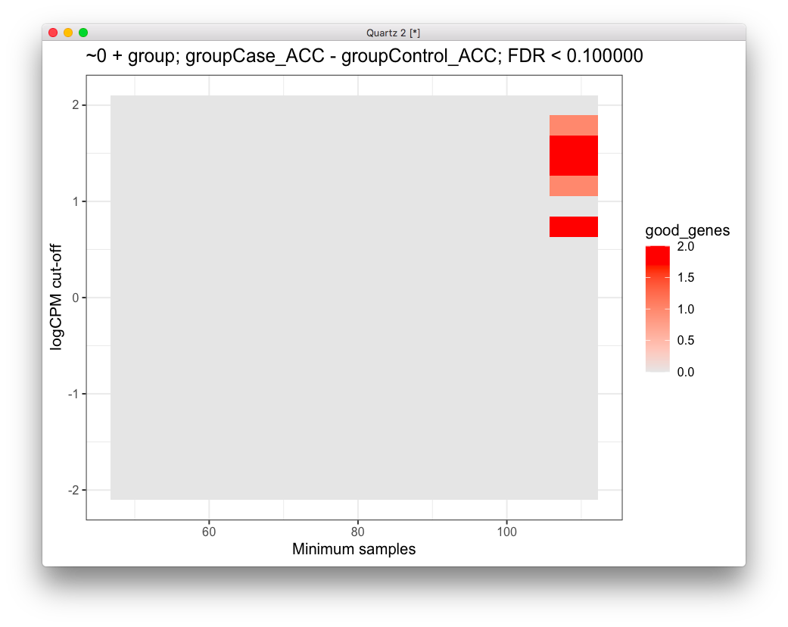

# 2020-05-22 13:22:51

I want to take another stab at looking at the entire dataset (both regions,
entire population), as most pipelines do it that way. This way, let's pay a bit
more attention to the GLM.

Mostly following
https://ucdavis-bioinformatics-training.github.io/2018-June-RNA-Seq-Workshop/thursday/DE.html,
but I'll keep on using Combat-Seq:

```r
library(sva)
library(edgeR)
data = readRDS('~/data/rnaseq_derek/complete_rawCountData_05132020.rds')
data = data[-c(which(rownames(data)=='57')), ]  # removing ACC outlier
rownames(data) = data$submitted_name  # just to ensure compatibility later

grex_vars = colnames(data)[grepl(colnames(data), pattern='^ENS')]
count_matrix = t(data[, grex_vars])
# remove that weird .num after ENSG
id_num = sapply(grex_vars,
                function(x) strsplit(x=x, split='\\.')[[1]][1])
rownames(count_matrix) = id_num

dups = duplicated(id_num)
id_num = id_num[!dups]
count_matrix = count_matrix[!dups, ]
library('biomaRt')
mart <- useDataset("hsapiens_gene_ensembl", useMart("ensembl"))
G_list <- getBM(filters= "ensembl_gene_id", attributes= c("ensembl_gene_id",
                "hgnc_symbol", "chromosome_name"),values=id_num,mart= mart)
G_list <- G_list[!duplicated(G_list$ensembl_gene_id),]
imnamed = rownames(count_matrix) %in% G_list$ensembl_gene_id
count_matrix = count_matrix[imnamed, ]
imautosome = which(G_list$chromosome_name != 'X' &
                   G_list$chromosome_name != 'Y' &
                   G_list$chromosome_name != 'MT')
count_matrix = count_matrix[imautosome, ]
G_list = G_list[imautosome, ]

x <- DGEList(count_matrix, genes=G_list, group=data$Diagnosis)
lcpm <- cpm(x, log=TRUE)

mds = plotMDS(lcpm, plot=F)
library(ggplot2)
DX2 = sapply(1:nrow(data), function(x) sprintf('%s_%s', data[x, 'Diagnosis'],
                                                data[x, 'Region']))
data$group = factor(DX2)
plot_data = data.frame(x=mds$x, y=mds$y,
                       batch=factor(data$run_date),
                       group=data$group)
ggplot(plot_data, aes(x=x, y=y, shape=group, color=batch)) + geom_point()
```


We have clearly the region effect on the X axis of the MDS, and then a batch
effect on the Y axis. Let's run COMBAT-seq and show the new plot. I also showed
in note 110 that this operation takes care of the brain bank effect too, so we
are fine here.

Note that we also remove those outliers in the center of the plot.

```r
# removing the brain region outliers in the MDS plot
imout = which(mds$x>-1 & mds$x<1.2)
data = data[-imout, ]
x = x[, -imout]
count_matrix = count_matrix[, -imout]
batch = factor(data$run_date)
covar_mat = cbind(data$Diagnosis, data$Region)
adjusted_counts <- ComBat_seq(count_matrix, batch=batch, group=NULL,
                              covar_mod=covar_mat)

# I created adjusted_counts_covar.RData because BW wasn't installing sva-dev to run Combat_seq
library(edgeR)
x0 <- DGEList(adjusted_counts, genes=G_list)
lcpm <- cpm(x0, log=TRUE)
mds = plotMDS(lcpm, plot=F)
plot_data = data.frame(x=mds$x, y=mds$y,
                       batch=factor(data$run_date),
                       group=data$group)
ggplot(plot_data, aes(x=x, y=y, shape=group, color=batch)) + geom_point()
```


Now we're ready for removing genes. I'm going to go very strict here for a
start, removing anything that doesn't have expression > 1 in all samples. We can
relax that later.

```r
# like those plots in the pipeline
L <- mean(x0$samples$lib.size) * 1e-6
M <- median(x0$samples$lib.size) * 1e-6
lcpm.cutoff <- log2(10/M + 2/L)
keep_genes = rowSums(lcpm > lcpm.cutoff) >= nrow(data)
x <- x0[keep_genes, keep.lib.sizes=FALSE]
x <- calcNormFactors(x, method = "TMM")

group = data$group
mm <- model.matrix(~0 + group)
y <- voom(x, mm, plot = T)
```


Voom plot looks good.

```r
fit <- lmFit(y, mm)
contr <- makeContrasts(groupCase_ACC - groupControl_ACC,
                       levels = colnames(coef(fit)))
tmp <- contrasts.fit(fit, contr)
tmp <- eBayes(tmp)
top.table <- topTable(tmp, sort.by = "P", n = Inf)
head(top.table, 20)
```

or we could do the same for Caudate:

```r
contr <- makeContrasts(groupCase_Caudate - groupControl_Caudate,
                       levels = colnames(coef(fit)))
tmp <- contrasts.fit(fit, contr)
tmp <- eBayes(tmp)
top.table <- topTable(tmp, sort.by = "P", n = Inf)
head(top.table, 20)
```

There seems to be some results for ACC, but at FDR .2. Let's try an interaction
model:

```r
mm <- model.matrix(~Diagnosis*Region, data=data)
y <- voom(x, mm, plot = F)
fit <- lmFit(y, mm)
head(coef(fit))
```


So, keep in mind here that the coefficient DiagnosisControl represents the
difference in mean expression between Control and the reference level (Case),
for the ACC, which is the reference level for Region.

Similarly, the coefficient RegionCaudate represents the difference in mean
expression between Caudate and ACC, for the Cases (reference in Diagnosis).

The interaction term asks if the change in expression between case and control
is the same for ACC as it is for Caudate. 

Let's estimate the difference:

```r
tmp <- contrasts.fit(fit, coef = 2) # Directly test second coefficient
tmp <- eBayes(tmp)
top.table <- topTable(tmp, sort.by = "P", n = Inf)
head(top.table, 20)
```

As expected, it's the exact same result as the comparison before. Now, let's see
if adding some covariates helps at all:

```r
mm <- model.matrix(~Diagnosis*Region + RINe, data=data)
y <- voom(x, mm, plot = F)
fit <- lmFit(y, mm)
tmp <- contrasts.fit(fit, coef = 2) # Directly test second coefficient
tmp <- eBayes(tmp)
top.table <- topTable(tmp, sort.by = "P", n = Inf)
head(top.table, 20)
```

No... nothing in particular. Is Combat seq helping that much?

```r
x0 <- DGEList(count_matrix, genes=G_list)
lcpm <- cpm(x0, log=TRUE)
# like those plots in the pipeline
L <- mean(x0$samples$lib.size) * 1e-6
M <- median(x0$samples$lib.size) * 1e-6
lcpm.cutoff <- log2(10/M + 2/L)
keep_genes = rowSums(lcpm > lcpm.cutoff) >= nrow(data)
x <- x0[keep_genes, keep.lib.sizes=FALSE]
x <- calcNormFactors(x, method = "TMM")
data$batch = as.numeric(as.factor(data$run_date))

mm <- model.matrix(~Diagnosis*Region + batch + RINe, data=data)
y <- voom(x, mm, plot = F)
fit <- lmFit(y, mm)
tmp <- contrasts.fit(fit, coef = 2) # Directly test second coefficient
tmp <- eBayes(tmp)
top.table <- topTable(tmp, sort.by = "P", n = Inf)
head(top.table, 20)
```

p-values with combat were smaller, if that matter at all. If we use the random
term for subjects, does it help?

```r
x0 <- DGEList(adjusted_counts, genes=G_list)
lcpm <- cpm(x0, log=TRUE)
# like those plots in the pipeline
L <- mean(x0$samples$lib.size) * 1e-6
M <- median(x0$samples$lib.size) * 1e-6
lcpm.cutoff <- log2(10/M + 2/L)
keep_genes = rowSums(lcpm > lcpm.cutoff) >= nrow(data)
x <- x0[keep_genes, keep.lib.sizes=FALSE]
x <- calcNormFactors(x, method = "TMM")

data$Individual = factor(data$hbcc_brain_id)
mm <- model.matrix(~Diagnosis*Region + RINe, data=data)
y_tmp <- voom(x, mm, plot = F)
dupcor <- duplicateCorrelation(y_tmp, mm, block=data$Individual)
y = voom(x, mm, plot=FALSE, block=data$Individual, correlation=dupcor$consensus)
dupcor <- duplicateCorrelation(y, mm, block=data$Individual)
fit <- lmFit(y, mm, block=data$Individual, correlation=dupcor$consensus)
tmp <- contrasts.fit(fit, coef = 2) # Directly test second coefficient
tmp <- eBayes(tmp)
top.table <- topTable(tmp, sort.by = "P", n = Inf)
head(top.table, 20)
```

Doesn't help either...

Let's see if the WNH only results show any improvement:

```r
imWNH = data$C1 > 0 & data$C2 < -.075
data = data[which(imWNH),]
x0 <- DGEList(adjusted_counts[, which(imWNH)], genes=G_list)
lcpm <- cpm(x0, log=TRUE)
# like those plots in the pipeline
L <- mean(x0$samples$lib.size) * 1e-6
M <- median(x0$samples$lib.size) * 1e-6
lcpm.cutoff <- log2(10/M + 2/L)
keep_genes = rowSums(lcpm > lcpm.cutoff) >= nrow(data)
x <- x0[keep_genes, keep.lib.sizes=FALSE]
x <- calcNormFactors(x, method = "TMM")

mm <- model.matrix(~Diagnosis*Region, data=data)
y <- voom(x, mm, plot = F)
fit <- lmFit(y, mm)
tmp <- contrasts.fit(fit, coef = 2) # Directly test second coefficient
tmp <- eBayes(tmp)
top.table <- topTable(tmp, sort.by = "P", n = Inf)
head(top.table, 20)
```

Not better... well, we can try playing with the thresholds a bit. Imagine a plot
where the X axis is number of subjects with the CPM, Y is the CPM cutoff, and
the color is how many genes at a given FDR. Then, we do:

```r
library(sva)
library(edgeR)
data = readRDS('~/data/rnaseq_derek/complete_rawCountData_05132020.rds')
data = data[-c(which(rownames(data)=='57')), ]  # removing ACC outlier
rownames(data) = data$submitted_name  # just to ensure compatibility later

grex_vars = colnames(data)[grepl(colnames(data), pattern='^ENS')]
count_matrix = t(data[, grex_vars])
# remove that weird .num after ENSG
id_num = sapply(grex_vars,
                function(x) strsplit(x=x, split='\\.')[[1]][1])
rownames(count_matrix) = id_num

dups = duplicated(id_num)
id_num = id_num[!dups]
count_matrix = count_matrix[!dups, ]
library('biomaRt')
mart <- useDataset("hsapiens_gene_ensembl", useMart("ensembl"))
G_list <- getBM(filters= "ensembl_gene_id", attributes= c("ensembl_gene_id",
                "hgnc_symbol", "chromosome_name"),values=id_num,mart= mart)
G_list <- G_list[!duplicated(G_list$ensembl_gene_id),]
imnamed = rownames(count_matrix) %in% G_list$ensembl_gene_id
count_matrix = count_matrix[imnamed, ]
imautosome = which(G_list$chromosome_name != 'X' &
                   G_list$chromosome_name != 'Y' &
                   G_list$chromosome_name != 'MT')
count_matrix = count_matrix[imautosome, ]
G_list = G_list[imautosome, ]

x <- DGEList(count_matrix, genes=G_list, group=data$Diagnosis)
lcpm <- cpm(x, log=TRUE)

mds = plotMDS(lcpm, plot=F)
library(ggplot2)
DX2 = sapply(1:nrow(data), function(x) sprintf('%s_%s', data[x, 'Diagnosis'],
                                                data[x, 'Region']))
data$group = factor(DX2)
# removing the brain region outliers in the MDS plot
imout = which(mds$x>-1 & mds$x<1.2)
data = data[-imout, ]
x = x[, -imout]
count_matrix = count_matrix[, -imout]
batch = factor(data$run_date)
covar_mat = cbind(data$Diagnosis, data$Region)
adjusted_counts <- ComBat_seq(count_matrix, batch=batch, group=NULL,
                              covar_mod=covar_mat)

library(edgeR)
x0 <- DGEList(adjusted_counts, genes=G_list)
lcpm <- cpm(x0, log=TRUE)

cutoffs = seq(-2, 2, len=20)
min_samples = seq(50, nrow(data), len=10)
fdr_limit = .1
fm_str = '~0 + group + RINe'
ctr_str = 'groupCase_ACC - groupControl_ACC'
res = c()
for (co in cutoffs) {
    for (ms in min_samples) {
        print(sprintf('%f, %f', co, ms))
        keep_genes = rowSums(lcpm > co) >= ms
        x <- x0[keep_genes, keep.lib.sizes=FALSE]
        x <- calcNormFactors(x, method = "TMM")
        print(dim(x))
        mm <- model.matrix(as.formula(fm_str), data=data)
        y <- voom(x, mm, plot = F)
        fit <- lmFit(y, mm)
        contr <- makeContrasts(ctr_str,
                            levels = colnames(coef(fit)))
        tmp <- contrasts.fit(fit, contr)
        tmp <- eBayes(tmp)
        top.table <- topTable(tmp, sort.by = "P", n = Inf)
        res = rbind(res, c(co, ms, sum(top.table$adj.P.Val < fdr_limit)))
    }
}
res = data.frame(res)
t_str = sprintf('%s; %s; FDR < %f', fm_str, ctr_str, fdr_limit)
colnames(res) = c('cutoff', 'min_samples', 'good_genes')
ggplot(res, aes(x = min_samples, y = cutoff)) + 
  geom_tile(aes(fill=good_genes)) + 
  labs(x="Minimum samples", y="logCPM cut-off", title=t_str) + 
  scale_fill_gradient(low="grey90", high="red") + theme_bw()
```

Here are a few results:





# TODO

* what if we focused on genes differentially expressed in ACC, compared to ACC
  (and vice-versa), within our cohort?
    * do it in our cohort and then based on lists Sam will send. Allen atlas,
      brain-span atlas. PsychM code? Panos.... Do it through developmental
      stages, and correcting within those genes expressed. Try different brain
      atlases too. Multiply by effect size in the region? Like PRS? Gene
      expression score
    * use our lists 
    * maybe use the list of genes we sent to Yung Chin, but that's not as interesting.
* how about using these results as a filter for a multivariate model? using voom
  just to remove covariates and dispersion effects? or, even just the MDS or PCs
  for a multi-variate classification. But it doesn't have to be. I could also
  just use estimateDisp and glmQLFit from edgeR. Either way, I could keep the
  group variable in there too.
  * philip not as excited about this one. Best to try the genes sets first. Use
    PCs so there's no circularity in selecting the top genes.
* just try different nominal cut-offs in gene set analysis
  * good, definitely try it
* what about using FPKM or other normalizer instead of CPM?
* CCA for cognition and brain (separate project)
* write protocol for neuroimmuno response for covid response, but getting our
  feet wet with other vaccines first