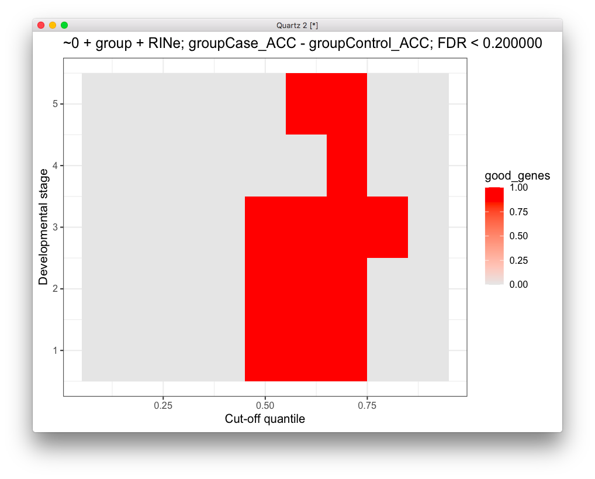
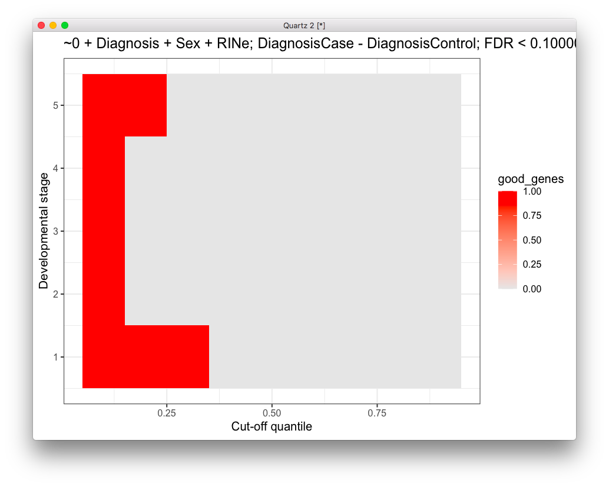
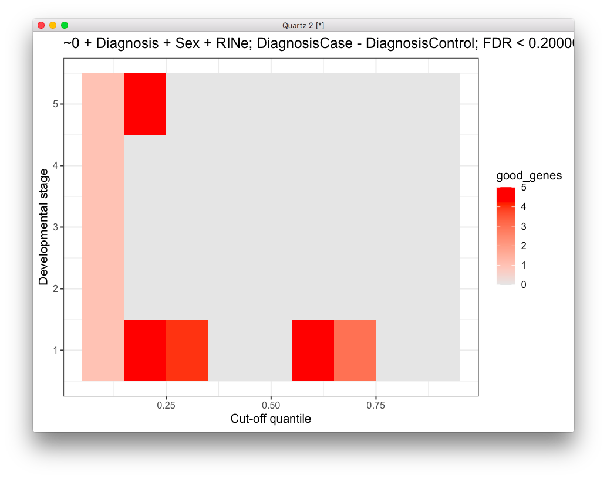
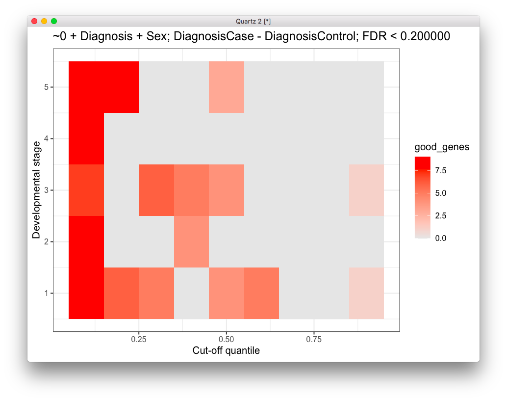
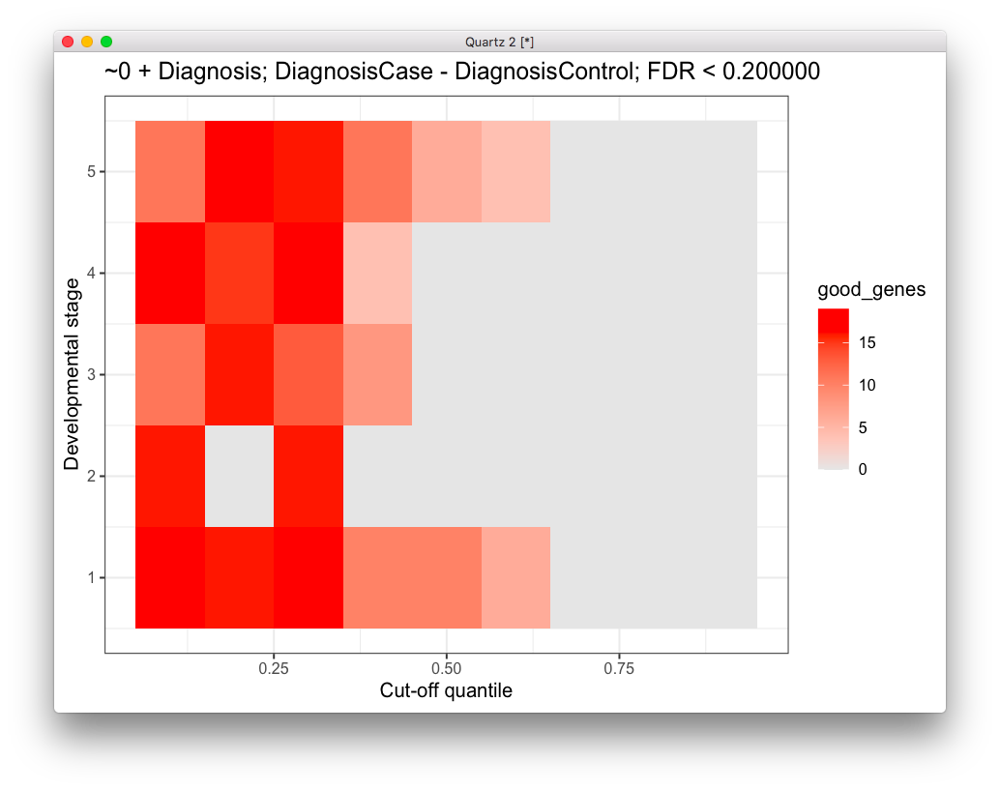
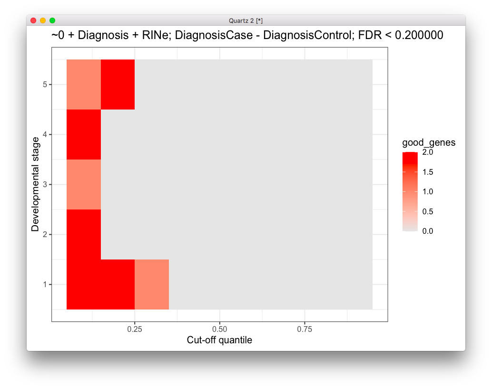
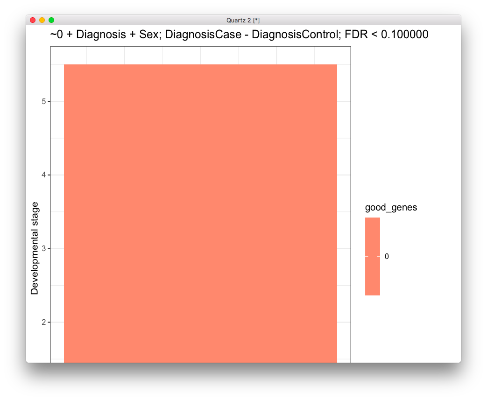
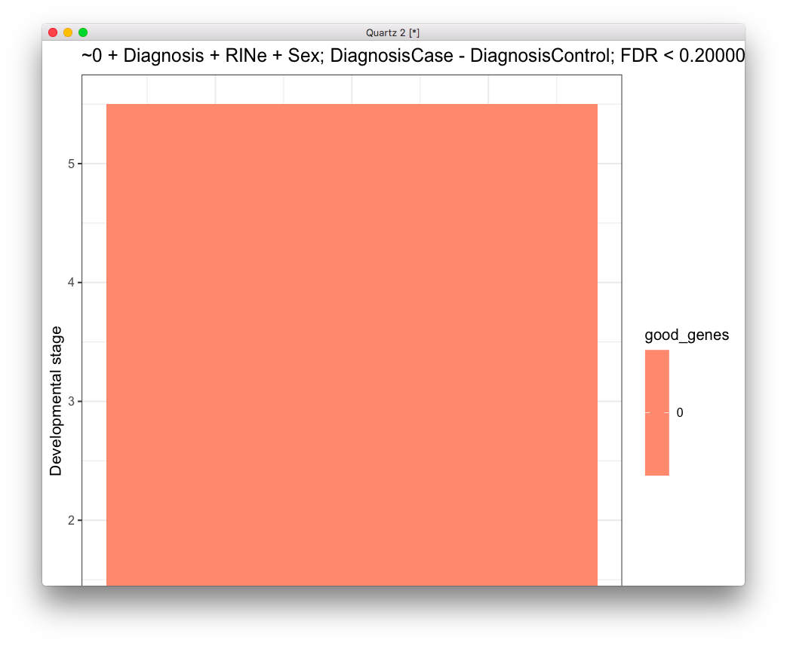
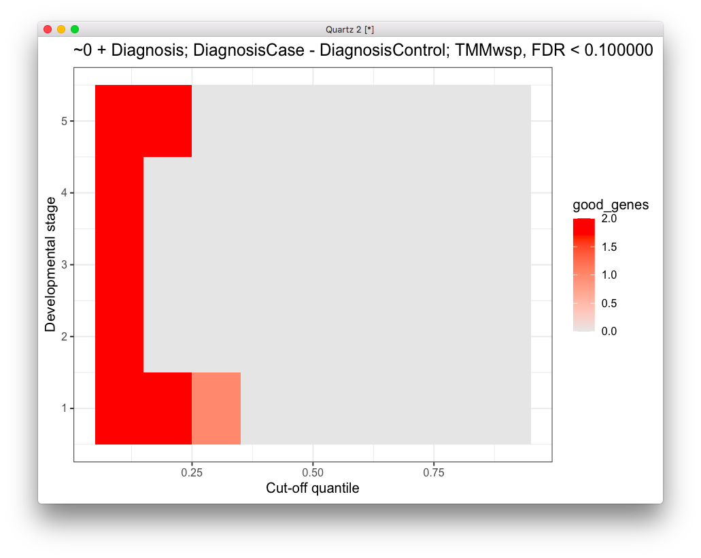
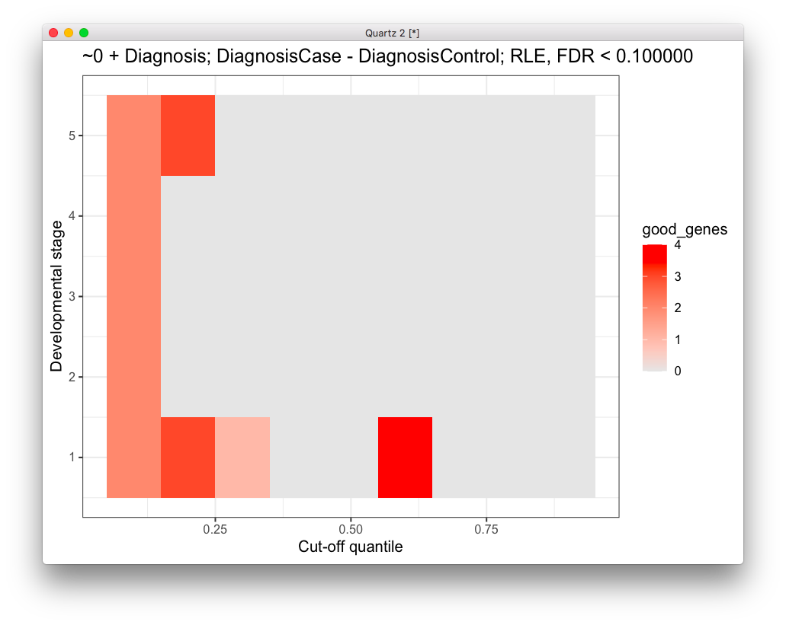

# 2020-05-27 20:16:39

Working on some of the ideas from the last chat with Philip. Let's play with
some gene cut-offs for different developmental stages. Using the data from here:

https://bioconductor.org/packages/3.11/bioc/vignettes/ABAEnrichment/inst/doc/ABAEnrichment.html

also described here:

https://www.bioconductor.org/packages/release/data/experiment/vignettes/ABAData/inst/doc/ABAData.html

```r
> library('ABAEnrichment')
> tmp = get_id('striatum')
> tmp[tmp$ontology=='developmental',]
     structure      ontology structure_id
1 STR_striatum developmental  Allen:10333
> tmp = get_id('cingulate')
> tmp[tmp$ontology=='developmental',]
                                                    structure      ontology
1                                     CCx_cingulate neocortex developmental
2 MFC_anterior (rostral) cingulate (medial prefrontal) cortex developmental
  structure_id
1  Allen:10277
2  Allen:10278
```

So, we can do something like this and play with different thresholds:

```r
anno = get_annotated_genes(structure_ids='Allen:10333', dataset='5_stages', 
    cutoff_quantiles=c(0.7,0.9))
```

And conduct a very similar analysis to what we did in the past, except that now
we can just focus on genes expressed on the region and the cut-offs will be for
the atlas itself. The rows of the matrix would be the different age groups.

```r
library(sva)
library(edgeR)
data = readRDS('~/data/rnaseq_derek/complete_rawCountData_05132020.rds')
data = data[-c(which(rownames(data)=='57')), ]  # removing ACC outlier
rownames(data) = data$submitted_name  # just to ensure compatibility later

grex_vars = colnames(data)[grepl(colnames(data), pattern='^ENS')]
count_matrix = t(data[, grex_vars])
# remove that weird .num after ENSG
id_num = sapply(grex_vars,
                function(x) strsplit(x=x, split='\\.')[[1]][1])
rownames(count_matrix) = id_num

dups = duplicated(id_num)
id_num = id_num[!dups]
count_matrix = count_matrix[!dups, ]
library('biomaRt')
mart <- useDataset("hsapiens_gene_ensembl", useMart("ensembl"))
G_list <- getBM(filters= "ensembl_gene_id", attributes= c("ensembl_gene_id",
                "hgnc_symbol", "chromosome_name"),values=id_num,mart= mart)
G_list <- G_list[!duplicated(G_list$ensembl_gene_id),]
imnamed = rownames(count_matrix) %in% G_list$ensembl_gene_id
count_matrix = count_matrix[imnamed, ]
imautosome = which(G_list$chromosome_name != 'X' &
                   G_list$chromosome_name != 'Y' &
                   G_list$chromosome_name != 'MT')
count_matrix = count_matrix[imautosome, ]
G_list = G_list[imautosome, ]

x <- DGEList(count_matrix, genes=G_list, group=data$Diagnosis)
lcpm <- cpm(x, log=TRUE)

mds = plotMDS(lcpm, plot=F)
library(ggplot2)
DX2 = sapply(1:nrow(data), function(x) sprintf('%s_%s', data[x, 'Diagnosis'],
                                                data[x, 'Region']))
data$group = factor(DX2)
# removing the brain region outliers in the MDS plot
imout = which(mds$x>-1 & mds$x<1.2)
data = data[-imout, ]
x = x[, -imout]
count_matrix = count_matrix[, -imout]
batch = factor(data$run_date)
covar_mat = cbind(data$Diagnosis, data$Region)
adjusted_counts <- ComBat_seq(count_matrix, batch=batch, group=NULL,
                              covar_mod=covar_mat)

library(edgeR)
x0 <- DGEList(adjusted_counts, genes=G_list)
lcpm <- cpm(x0, log=TRUE)

cutoffs = c(.1, .2, .3, .4, .5, .6, .7, .8, .9)
anno = get_annotated_genes(structure_ids=c('Allen:10277', 'Allen:10278'),
                           dataset='5_stages',
                           cutoff_quantiles=cutoffs)
stages = 1:5
fdr_limit = .1
fm_str = '~0 + group + Sex + RINe'
ctr_str = 'groupCase_ACC - groupControl_ACC'
res = c()
for (co in cutoffs) {
    for (s in stages) {
        print(sprintf('%f, %f', co, s))

        idx = anno$age_category==s & anno$cutoff==co
        expressed_genes = unique(anno[idx, 'anno_gene'])
        keep_genes = which(x0$genes$hgnc_symbol %in% expressed_genes)

        x <- x0[keep_genes, keep.lib.sizes=FALSE]
        x <- calcNormFactors(x, method = "TMM")
        print(dim(x))
        mm <- model.matrix(as.formula(fm_str), data=data)
        y <- voom(x, mm, plot = F)
        fit <- lmFit(y, mm)
        contr <- makeContrasts(ctr_str,
                            levels = colnames(coef(fit)))
        tmp <- contrasts.fit(fit, contr)
        tmp <- eBayes(tmp)
        top.table <- topTable(tmp, sort.by = "P", n = Inf)
        res = rbind(res, c(co, s, sum(top.table$adj.P.Val < fdr_limit)))
    }
}
res = data.frame(res)
t_str = sprintf('%s; %s; FDR < %f', fm_str, ctr_str, fdr_limit)
colnames(res) = c('cutoff', 'dev_stage', 'good_genes')
ggplot(res, aes(x = cutoff, y = dev_stage)) + 
  geom_tile(aes(fill=good_genes)) + 
  labs(x="Cut-off quantile", y="Developmental stage", title=t_str) + 
  scale_fill_gradient(low="grey90", high="red") + theme_bw()
```




And for Caudate it's similar:

```r
cutoffs = c(.1, .2, .3, .4, .5, .6, .7, .8, .9)
anno = get_annotated_genes(structure_ids='Allen:10333',
                           dataset='5_stages',
                           cutoff_quantiles=cutoffs)
stages = 1:5
fdr_limit = .1
fm_str = '~0 + group + RINe + Sex'
ctr_str = 'groupCase_Caudate - groupControl_Caudate'
res = c()
for (co in cutoffs) {
    for (s in stages) {
        print(sprintf('%f, %f', co, s))

        idx = anno$age_category==s & anno$cutoff==co
        expressed_genes = unique(anno[idx, 'anno_gene'])
        keep_genes = which(x0$genes$hgnc_symbol %in% expressed_genes)

        x <- x0[keep_genes, keep.lib.sizes=FALSE]
        x <- calcNormFactors(x, method = "TMM")
        print(dim(x))
        mm <- model.matrix(as.formula(fm_str), data=data)
        y <- voom(x, mm, plot = F)
        fit <- lmFit(y, mm)
        contr <- makeContrasts(ctr_str,
                            levels = colnames(coef(fit)))
        tmp <- contrasts.fit(fit, contr)
        tmp <- eBayes(tmp)
        top.table <- topTable(tmp, sort.by = "P", n = Inf)
        res = rbind(res, c(co, s, sum(top.table$adj.P.Val < fdr_limit)))
    }
}
res = data.frame(res)
t_str = sprintf('%s; %s; FDR < %f', fm_str, ctr_str, fdr_limit)
colnames(res) = c('cutoff', 'dev_stage', 'good_genes')
ggplot(res, aes(x = cutoff, y = dev_stage)) + 
  geom_tile(aes(fill=good_genes)) + 
  labs(x="Cut-off quantile", y="Developmental stage", title=t_str) + 
  scale_fill_gradient(low="grey90", high="red") + theme_bw()
```


# 2020-05-28 07:51:54

Let's see if these results change if I run the entire pipeline only using those
genes:

```r
library(sva)
library(edgeR)
library(ggplot2)
data = readRDS('~/data/rnaseq_derek/complete_rawCountData_05132020.rds')
data = data[-c(which(rownames(data)=='57')), ]  # removing ACC outlier
data = data[data$Region=='ACC', ]
rownames(data) = data$submitted_name  # just to ensure compatibility later

grex_vars = colnames(data)[grepl(colnames(data), pattern='^ENS')]
count_matrix = t(data[, grex_vars])
# remove that weird .num after ENSG
id_num = sapply(grex_vars,
                function(x) strsplit(x=x, split='\\.')[[1]][1])
rownames(count_matrix) = id_num

dups = duplicated(id_num)
id_num = id_num[!dups]
count_matrix = count_matrix[!dups, ]
library('biomaRt')
mart <- useDataset("hsapiens_gene_ensembl", useMart("ensembl"))
G_list <- getBM(filters= "ensembl_gene_id", attributes= c("ensembl_gene_id",
                "hgnc_symbol", "chromosome_name"),values=id_num,mart= mart)
G_list <- G_list[!duplicated(G_list$ensembl_gene_id),]
imnamed = rownames(count_matrix) %in% G_list$ensembl_gene_id
count_matrix = count_matrix[imnamed, ]
imautosome = which(G_list$chromosome_name != 'X' &
                   G_list$chromosome_name != 'Y' &
                   G_list$chromosome_name != 'MT')
count_matrix = count_matrix[imautosome, ]
G_list = G_list[imautosome, ]

library(ABAEnrichment)
cutoffs = c(.1, .2, .3, .4, .5, .6, .7, .8, .9)
anno = get_annotated_genes(structure_ids=c('Allen:10277', 'Allen:10278'),
                           dataset='5_stages',
                           cutoff_quantiles=cutoffs)
batch = factor(data$run_date)
stages = 1:5
fdr_limit = .1
fm_str = '~0 + Diagnosis + RINe'
ctr_str = 'DiagnosisCase - DiagnosisControl'
res = c()
for (co in cutoffs) {
    for (s in stages) {
        print(sprintf('%f, %f', co, s))

        idx = anno$age_category==s & anno$cutoff==co
        expressed_genes = unique(anno[idx, 'anno_gene'])
        keep_genes = which(G_list$hgnc_symbol %in% expressed_genes)

        adjusted_counts <- ComBat_seq(count_matrix[keep_genes,],
                                      batch=batch, group=data$Diagnosis)
        x <- DGEList(adjusted_counts, genes=G_list[keep_genes,])
        x <- calcNormFactors(x, method = "TMM")
        print(dim(x))
        mm <- model.matrix(as.formula(fm_str), data=data)
        y <- voom(x, mm, plot = F)
        fit <- lmFit(y, mm)
        contr <- makeContrasts(ctr_str,
                            levels = colnames(coef(fit)))
        tmp <- contrasts.fit(fit, contr)
        tmp <- eBayes(tmp)
        top.table <- topTable(tmp, sort.by = "P", n = Inf)
        res = rbind(res, c(co, s, sum(top.table$adj.P.Val < fdr_limit)))
    }
}
res = data.frame(res)
t_str = sprintf('%s; %s; FDR < %f', fm_str, ctr_str, fdr_limit)
colnames(res) = c('cutoff', 'dev_stage', 'good_genes')
ggplot(res, aes(x = cutoff, y = dev_stage)) + 
  geom_tile(aes(fill=good_genes)) + 
  labs(x="Cut-off quantile", y="Developmental stage", title=t_str) + 
  scale_fill_gradient(low="grey90", high="red") + theme_bw()
```










And of course, for Caudate it's quite similar:

```r
library(sva)
library(edgeR)
library(ggplot2)
data = readRDS('~/data/rnaseq_derek/complete_rawCountData_05132020.rds')
data = data[data$Region=='Caudate', ]
rownames(data) = data$submitted_name  # just to ensure compatibility later

grex_vars = colnames(data)[grepl(colnames(data), pattern='^ENS')]
count_matrix = t(data[, grex_vars])
# remove that weird .num after ENSG
id_num = sapply(grex_vars,
                function(x) strsplit(x=x, split='\\.')[[1]][1])
rownames(count_matrix) = id_num

dups = duplicated(id_num)
id_num = id_num[!dups]
count_matrix = count_matrix[!dups, ]
library('biomaRt')
mart <- useDataset("hsapiens_gene_ensembl", useMart("ensembl"))
G_list <- getBM(filters= "ensembl_gene_id", attributes= c("ensembl_gene_id",
                "hgnc_symbol", "chromosome_name"),values=id_num,mart= mart)
G_list <- G_list[!duplicated(G_list$ensembl_gene_id),]
imnamed = rownames(count_matrix) %in% G_list$ensembl_gene_id
count_matrix = count_matrix[imnamed, ]
imautosome = which(G_list$chromosome_name != 'X' &
                   G_list$chromosome_name != 'Y' &
                   G_list$chromosome_name != 'MT')
count_matrix = count_matrix[imautosome, ]
G_list = G_list[imautosome, ]

library(ABAEnrichment)
cutoffs = c(.1, .2, .3, .4, .5, .6, .7, .8, .9)
anno = get_annotated_genes(structure_ids='Allen:10333',
                           dataset='5_stages',
                           cutoff_quantiles=cutoffs)
batch = factor(data$run_date)
stages = 1:5
fdr_limit = .1
fm_str = '~0 + Diagnosis'
ctr_str = 'DiagnosisCase - DiagnosisControl'
res = c()
for (co in cutoffs) {
    for (s in stages) {
        print(sprintf('%f, %f', co, s))

        idx = anno$age_category==s & anno$cutoff==co
        expressed_genes = unique(anno[idx, 'anno_gene'])
        keep_genes = which(G_list$hgnc_symbol %in% expressed_genes)

        adjusted_counts <- ComBat_seq(count_matrix[keep_genes,],
                                      batch=batch, group=data$Diagnosis)
        x <- DGEList(adjusted_counts, genes=G_list[keep_genes,])
        x <- calcNormFactors(x, method = "TMM")
        print(dim(x))
        mm <- model.matrix(as.formula(fm_str), data=data)
        y <- voom(x, mm, plot = F)
        fit <- lmFit(y, mm)
        contr <- makeContrasts(ctr_str,
                            levels = colnames(coef(fit)))
        tmp <- contrasts.fit(fit, contr)
        tmp <- eBayes(tmp)
        top.table <- topTable(tmp, sort.by = "P", n = Inf)
        res = rbind(res, c(co, s, sum(top.table$adj.P.Val < fdr_limit)))
    }
}
res = data.frame(res)
t_str = sprintf('%s; %s; FDR < %f', fm_str, ctr_str, fdr_limit)
colnames(res) = c('cutoff', 'dev_stage', 'good_genes')
ggplot(res, aes(x = cutoff, y = dev_stage)) + 
  geom_tile(aes(fill=good_genes)) + 
  labs(x="Cut-off quantile", y="Developmental stage", title=t_str) + 
  scale_fill_gradient(low="grey90", high="red") + theme_bw()
```







It's a bit weird that I'm getting no results when the Caudate results before
were somewhat interesting... Is there an error in the script? It doesn't look
like it... just results are very different when running combat just on
Caudate... 


## Different norm factors

What are the effects of choosing a norm factor different than TMM? I'll run it
just for ACC:

```r
library(sva)
library(edgeR)
library(ggplot2)
data = readRDS('~/data/rnaseq_derek/complete_rawCountData_05132020.rds')
data = data[-c(which(rownames(data)=='57')), ]  # removing ACC outlier
data = data[data$Region=='ACC', ]
rownames(data) = data$submitted_name  # just to ensure compatibility later

grex_vars = colnames(data)[grepl(colnames(data), pattern='^ENS')]
count_matrix = t(data[, grex_vars])
# remove that weird .num after ENSG
id_num = sapply(grex_vars,
                function(x) strsplit(x=x, split='\\.')[[1]][1])
rownames(count_matrix) = id_num

dups = duplicated(id_num)
id_num = id_num[!dups]
count_matrix = count_matrix[!dups, ]
library('biomaRt')
mart <- useDataset("hsapiens_gene_ensembl", useMart("ensembl"))
G_list <- getBM(filters= "ensembl_gene_id", attributes= c("ensembl_gene_id",
                "hgnc_symbol", "chromosome_name"),values=id_num,mart= mart)
G_list <- G_list[!duplicated(G_list$ensembl_gene_id),]
imnamed = rownames(count_matrix) %in% G_list$ensembl_gene_id
count_matrix = count_matrix[imnamed, ]
imautosome = which(G_list$chromosome_name != 'X' &
                   G_list$chromosome_name != 'Y' &
                   G_list$chromosome_name != 'MT')
count_matrix = count_matrix[imautosome, ]
G_list = G_list[imautosome, ]

library(ABAEnrichment)
cutoffs = c(.1, .2, .3, .4, .5, .6, .7, .8, .9)
anno = get_annotated_genes(structure_ids=c('Allen:10277', 'Allen:10278'),
                           dataset='5_stages',
                           cutoff_quantiles=cutoffs)
batch = factor(data$run_date)
stages = 1:5
fdr_limit = .1
norm_str = 'upperquartile'
fm_str = '~0 + Diagnosis'
ctr_str = 'DiagnosisCase - DiagnosisControl'
res = c()
for (co in cutoffs) {
    for (s in stages) {
        print(sprintf('%f, %f', co, s))

        idx = anno$age_category==s & anno$cutoff==co
        expressed_genes = unique(anno[idx, 'anno_gene'])
        keep_genes = which(G_list$hgnc_symbol %in% expressed_genes)

        adjusted_counts <- ComBat_seq(count_matrix[keep_genes,],
                                      batch=batch, group=data$Diagnosis)
        x <- DGEList(adjusted_counts, genes=G_list[keep_genes,])
        x <- calcNormFactors(x, method = norm_str)
        print(dim(x))
        mm <- model.matrix(as.formula(fm_str), data=data)
        y <- voom(x, mm, plot = F)
        fit <- lmFit(y, mm)
        contr <- makeContrasts(ctr_str,
                            levels = colnames(coef(fit)))
        tmp <- contrasts.fit(fit, contr)
        tmp <- eBayes(tmp)
        top.table <- topTable(tmp, sort.by = "P", n = Inf)
        res = rbind(res, c(co, s, sum(top.table$adj.P.Val < fdr_limit)))
    }
}
res = data.frame(res)
t_str = sprintf('%s; %s; %s, FDR < %f', fm_str, ctr_str, norm_str, fdr_limit)
colnames(res) = c('cutoff', 'dev_stage', 'good_genes')
ggplot(res, aes(x = cutoff, y = dev_stage)) + 
  geom_tile(aes(fill=good_genes)) + 
  labs(x="Cut-off quantile", y="Developmental stage", title=t_str) + 
  scale_fill_gradient(low="grey90", high="red") + theme_bw()
```






## Combining data cleaning and developmental stages

I can do both cut offs here. But it needs to be done after Combat, because we
only clean the dataset after combat. It'll also be hard to plot, but at least we
can store the different combinations.

```r
library(sva)
library(edgeR)
data = readRDS('~/data/rnaseq_derek/complete_rawCountData_05132020.rds')
data = data[-c(which(rownames(data)=='57')), ]  # removing ACC outlier
data = data[data$Region=='ACC', ]
rownames(data) = data$submitted_name  # just to ensure compatibility later

grex_vars = colnames(data)[grepl(colnames(data), pattern='^ENS')]
count_matrix = t(data[, grex_vars])
# remove that weird .num after ENSG
id_num = sapply(grex_vars,
                function(x) strsplit(x=x, split='\\.')[[1]][1])
rownames(count_matrix) = id_num

dups = duplicated(id_num)
id_num = id_num[!dups]
count_matrix = count_matrix[!dups, ]
library('biomaRt')
mart <- useDataset("hsapiens_gene_ensembl", useMart("ensembl"))
G_list <- getBM(filters= "ensembl_gene_id", attributes= c("ensembl_gene_id",
                "hgnc_symbol", "chromosome_name"),values=id_num,mart= mart)
G_list <- G_list[!duplicated(G_list$ensembl_gene_id),]
imnamed = rownames(count_matrix) %in% G_list$ensembl_gene_id
count_matrix = count_matrix[imnamed, ]
imautosome = which(G_list$chromosome_name != 'X' &
                   G_list$chromosome_name != 'Y' &
                   G_list$chromosome_name != 'MT')
count_matrix = count_matrix[imautosome, ]
G_list = G_list[imautosome, ]

batch = factor(data$run_date)
adjusted_counts <- ComBat_seq(count_matrix, batch=batch, group=data$Diagnosis)

library(edgeR)
x0 <- DGEList(adjusted_counts, genes=G_list)
lcpm <- cpm(x0, log=TRUE)

library(ABAEnrichment)
qtiles = c(.1, .2, .3, .4, .5, .6, .7, .8, .9)
anno = get_annotated_genes(structure_ids=c('Allen:10277', 'Allen:10278'),
                           dataset='5_stages',
                           cutoff_quantiles=qtiles)

cutoffs = seq(-2, 2, len=20)
stages = 1:5
min_samples = seq(25, nrow(data), len=10)
fdr_limit = .1
norm_str = 'RLE'
fm_str = '~0 + Diagnosis'
ctr_str = 'DiagnosisCase - DiagnosisControl'
res = c()
for (co in cutoffs) {
    for (ms in min_samples) {
        for (s in stages) {
            for (qt in qtiles) {
                print(sprintf('%f, %f, %f, %f', co, ms, s, qt))
                keep_genes = rowSums(lcpm > co) >= ms
                x <- x0[keep_genes, keep.lib.sizes=FALSE]

                idx = anno$age_category==s & anno$cutoff==qt
                expressed_genes = unique(anno[idx, 'anno_gene'])
                keep_genes = which(x$genes$hgnc_symbol %in% expressed_genes)
                x <- x[keep_genes, keep.lib.sizes=FALSE]

                x <- calcNormFactors(x, method = norm_str)
                print(dim(x))
                mm <- model.matrix(as.formula(fm_str), data=data)
                y <- voom(x, mm, plot = F)
                fit <- lmFit(y, mm)
                contr <- makeContrasts(ctr_str,
                                    levels = colnames(coef(fit)))
                tmp <- contrasts.fit(fit, contr)
                tmp <- eBayes(tmp)
                top.table <- topTable(tmp, sort.by = "P", n = Inf)
                res = rbind(res, c(co, ms, s, qt,
                                   sum(top.table$adj.P.Val < fdr_limit)))
            }
        }
    }
}
res = data.frame(res)
colnames(res) = c('cutoff', 'min_samples', 'dev', 'qtile', 'good_genes')
```

While that's running, I'll run it for TMM as well.

It tooks a few hours, and nothing there... the maximum I got was 3 for TMM and 2
for RLE.

# TODO
* implement cut-off using only our sample
* are combat results independent of the number of genes involved? in other
  words, is it dependent on the samples only?
* anything new here? https://pubmed.ncbi.nlm.nih.gov/27008025/
* also check this one a bit more: https://www.bioconductor.org/packages/release/bioc/vignettes/edgeR/inst/doc/edgeRUsersGuide.pdf
  * it's very similar to the experiment in 4.4, or a slighlty simpler version of
    3.5. Or maybe even 3.3. In any case, let's try it without COMBAT (but trying
    adding batch like (3.4.3) in and then with.
* maybe try using the standard edgeR pipeline from the user guide again, without
  COMBAT?
* try top 500 or 100 instead of quantiles, multiply by inverse of p-value of DX.
  Does the developmental score differ across stages? Something akin to PRS.
* males only?
* do our nominal results overlap with our lists? TWAS/EWAS/GWAS (sam)
* talk to Kwangmi's resource