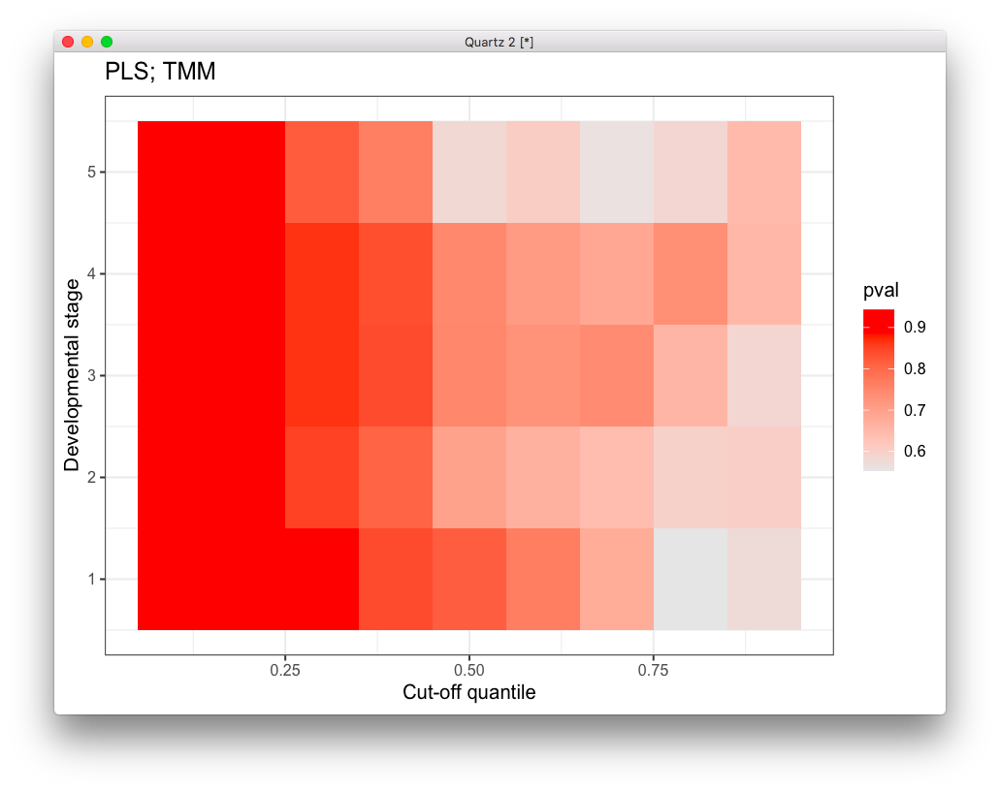
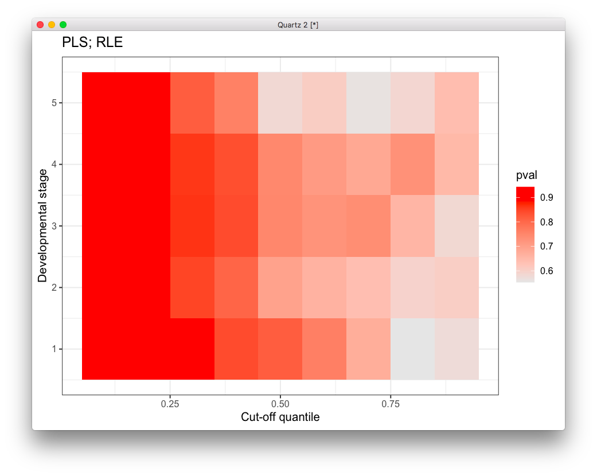

# 2020-05-28 18:44:41

Let's try to use the same approach of evaluating rnaseq in different
developmental stages, but we'll run PLS in each of them. I can do that in the
lcpm matrix, or in the voom results, but I'll need ot check what are the
implication of the latter.

Let's start with a single cut-off just to see what we get:

```r
library(sva)
library(edgeR)
library(ggplot2)
data = readRDS('~/data/rnaseq_derek/complete_rawCountData_05132020.rds')
data = data[-c(which(rownames(data)=='57')), ]  # removing ACC outlier
data = data[data$Region=='ACC', ]
rownames(data) = data$submitted_name  # just to ensure compatibility later

grex_vars = colnames(data)[grepl(colnames(data), pattern='^ENS')]
count_matrix = t(data[, grex_vars])
# remove that weird .num after ENSG
id_num = sapply(grex_vars,
                function(x) strsplit(x=x, split='\\.')[[1]][1])
rownames(count_matrix) = id_num

dups = duplicated(id_num)
id_num = id_num[!dups]
count_matrix = count_matrix[!dups, ]
library('biomaRt')
mart <- useDataset("hsapiens_gene_ensembl", useMart("ensembl"))
G_list <- getBM(filters= "ensembl_gene_id", attributes= c("ensembl_gene_id",
                "hgnc_symbol", "chromosome_name"),values=id_num,mart= mart)
G_list <- G_list[!duplicated(G_list$ensembl_gene_id),]
imnamed = rownames(count_matrix) %in% G_list$ensembl_gene_id
count_matrix = count_matrix[imnamed, ]
imautosome = which(G_list$chromosome_name != 'X' &
                   G_list$chromosome_name != 'Y' &
                   G_list$chromosome_name != 'MT')
count_matrix = count_matrix[imautosome, ]
G_list = G_list[imautosome, ]

library(ABAEnrichment)
cutoffs = c(.1, .2, .3, .4, .5, .6, .7, .8, .9)
anno = get_annotated_genes(structure_ids=c('Allen:10277', 'Allen:10278'),
                           dataset='5_stages',
                           cutoff_quantiles=cutoffs)
batch = factor(data$run_date)

s=3
co = .5
idx = anno$age_category==s & anno$cutoff==co
expressed_genes = unique(anno[idx, 'anno_gene'])
keep_genes = which(G_list$hgnc_symbol %in% expressed_genes)

adjusted_counts <- ComBat_seq(count_matrix[keep_genes,],
                                batch=batch, group=data$Diagnosis)
x <- DGEList(adjusted_counts, genes=G_list[keep_genes,])
x <- calcNormFactors(x, method = "TMM")
print(dim(x))
lcpm <- cpm(x, log=TRUE)

Xca = t(lcpm[, data$Diagnosis=='Case'])
Xco = t(lcpm[, data$Diagnosis=='Control'])
# M is nclass by nvars
M = rbind(colMeans(Xco), colMeans(Xca))
Rmc = M - colMeans(M)
S = svd(Rmc)
```

Now it's a matter of permuting to check which components to take.

```r
nperms = 1000
set.seed(42)
eig_vals = as.numeric(vector(length=nperms))
for (p in 1:nperms) {
    print(sprintf('%d / %d', p, nperms))
    perm_idx = sample(1:nrow(data), nrow(data), replace=F)
    yperm = data[perm_idx, 'Diagnosis']
    Xca_perm = t(lcpm[, yperm=='Case'])
    Xco_perm = t(lcpm[, yperm=='Control'])
    # M is nclass by nvars
    M_perm = rbind(colMeans(Xco_perm), colMeans(Xca_perm))
    Rmc_perm = M_perm - colMeans(M_perm)
    S_perm = svd(Rmc_perm)
    eig_vals[p] = max(S_perm$d)
}
sum(eig_vals >= S$d[1])/nperms
```

Results are not good, but at least the code is working. Let me run the whole
matrix and see if there are any patterns:

```r
stages = 1:5
norm_str = 'RLE'
res = c()
for (co in cutoffs) {
    for (s in stages) {
        print(sprintf('%f, %f', co, s))

        idx = anno$age_category==s & anno$cutoff==co
        expressed_genes = unique(anno[idx, 'anno_gene'])
        keep_genes = which(G_list$hgnc_symbol %in% expressed_genes)

        adjusted_counts <- ComBat_seq(count_matrix[keep_genes,],
                                        batch=batch, group=data$Diagnosis)
        x <- DGEList(adjusted_counts, genes=G_list[keep_genes,])
        x <- calcNormFactors(x, method = norm_str)
        print(dim(x))
        lcpm <- cpm(x, log=TRUE)

        Xca = t(lcpm[, data$Diagnosis=='Case'])
        Xco = t(lcpm[, data$Diagnosis=='Control'])
        # M is nclass by nvars
        M = rbind(colMeans(Xco), colMeans(Xca))
        Rmc = M - colMeans(M)
        S = svd(Rmc)

        nperms = 1000
        set.seed(42)
        eig_vals = as.numeric(vector(length=nperms))
        print('Permuting...')
        for (p in 1:nperms) {
            perm_idx = sample(1:nrow(data), nrow(data), replace=F)
            yperm = data[perm_idx, 'Diagnosis']
            Xca_perm = t(lcpm[, yperm=='Case'])
            Xco_perm = t(lcpm[, yperm=='Control'])
            # M is nclass by nvars
            M_perm = rbind(colMeans(Xco_perm), colMeans(Xca_perm))
            Rmc_perm = M_perm - colMeans(M_perm)
            S_perm = svd(Rmc_perm)
            eig_vals[p] = max(S_perm$d)
        }
        res = rbind(res, c(co, s, sum(eig_vals >= S$d[1])/nperms))
    }
}
res = data.frame(res)
t_str = sprintf('PLS; %s', norm_str)
colnames(res) = c('cutoff', 'dev_stage', 'pval')
ggplot(res, aes(x = cutoff, y = dev_stage)) + 
  geom_tile(aes(fill=pval)) + 
  labs(x="Cut-off quantile", y="Developmental stage", title=t_str) + 
  scale_fill_gradient(low="grey90", high="red") + theme_bw()
```



OK, definitely far from ideal. Another option we have is to try to correct for
dispersion using voom. Before we try that, let me see if using RLE does any
better for the p-values:



Not much difference...


```r
fm_str = '~0 + Diagnosis'
mm <- model.matrix(as.formula(fm_str), data=data)
y <- estimateDisp(x, mm, robust=TRUE)
```
        
# TODO
* try using pseudocounts, like this?
  https://www.bioconductor.org/packages/release/bioc/vignettes/edgeR/inst/doc/edgeRUsersGuide.pdf.
  Can use estimateDisp without a design matrix if using just a single factor. In
  this case, Diagnosis within a cell group?
* try sPCA again?