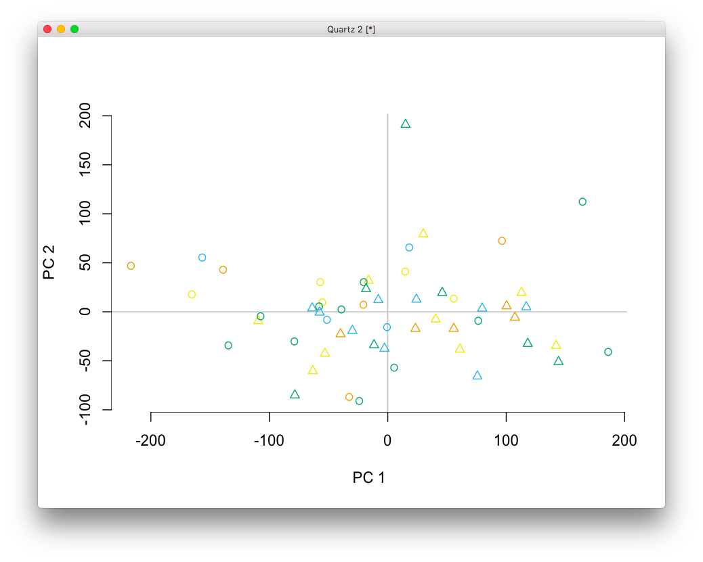

# 2020-06-02 07:16:45

I want to try a few examples using the edgeR user-guide, just to be safe that
we're running the right commands. No COMBAT, at least not for now.

https://www.bioconductor.org/packages/release/bioc/vignettes/edgeR/inst/doc/edgeRUsersGuide.pdf

I'll try them in order, based on what I identified in note 112:

## 3.4.2

This considers all subjects as independent. Not true, but it's a start. Here's
something from the user guide about their filtering function:

```
The filtering should be based on the grouping factors or treatment factors that will be involved in the differential expression tested for, rather than on blocking variables that are not of scientific interest in themselves. For example, consider a paired comparison experiment in which the same treatment regimes applied to each of a number of subjects or patients. In this design, Patient is included in the design matrix to correct for baseline differences between the Patients, but we will not be testing for differential expression between the Patients. The filtering should therefore be based soley Treatment rather than on Patient
```

That's a similar situation to what we have, meaning that we should filter on
Diagnosis but not Region. Of course I'll try different filtering later, to
assess for result robustness, but for now I'll just go with their suggestion. 

```r
library(edgeR)
data = readRDS('~/data/rnaseq_derek/complete_rawCountData_05132020.rds')
data = data[-c(which(rownames(data)=='57')), ]  # removing ACC outlier
rownames(data) = data$submitted_name  # just to ensure compatibility later

grex_vars = colnames(data)[grepl(colnames(data), pattern='^ENS')]
count_matrix = t(data[, grex_vars])
# remove that weird .num after ENSG
id_num = sapply(grex_vars,
                function(x) strsplit(x=x, split='\\.')[[1]][1])
rownames(count_matrix) = id_num

dups = duplicated(id_num)
id_num = id_num[!dups]
count_matrix = count_matrix[!dups, ]
library('biomaRt')
mart <- useDataset("hsapiens_gene_ensembl", useMart("ensembl"))
G_list <- getBM(filters= "ensembl_gene_id", attributes= c("ensembl_gene_id",
                "hgnc_symbol", "chromosome_name"),values=id_num,mart= mart)
G_list <- G_list[!duplicated(G_list$ensembl_gene_id),]
imnamed = rownames(count_matrix) %in% G_list$ensembl_gene_id
count_matrix = count_matrix[imnamed, ]
imautosome = which(G_list$chromosome_name != 'X' &
                   G_list$chromosome_name != 'Y' &
                   G_list$chromosome_name != 'MT')
count_matrix = count_matrix[imautosome, ]
G_list = G_list[imautosome, ]

y <- DGEList(count_matrix, genes=G_list, group=data$Diagnosis)

DX <- factor(data$Diagnosis)
Region <- factor(data$Region)
design <- model.matrix(~Region + DX)

keep <- filterByExpr(y)  # doing it based on group
y <- y[keep, , keep.lib.sizes=FALSE]
y <- calcNormFactors(y)

y <- estimateDisp(y, design, robust=TRUE)
plotBCV(y)
fit <- glmQLFit(y, design)
```


To detect genes that are differentially expressed between Case and Control,
adjusting for brain region differences:

```r
qlf <- glmQLFTest(fit, coef=3)
topTags(qlf)
```


I somewhat remember this result... I'll take another look, but I think it was
something related to these genes being all zero in one of the brain regions?


That was the top gene... I think they're all like that?


Well, not all of them, but a good amount of the 10 that are below .05 (and .1).

## 3.4.3

Here we'l be correcting for batch effects as well, which we know to exist based
on our old plots. We could just try COMBAT and then the analysis above again.
But let's see how edgeR would do it.

The challenge here is that we have batching and region within batches. So, it'd
be more like example 3.5? This might be way too confusing... why not jst adjust
for batch effects with COMBAT, which seems to be working, and use the model
above?

```r
library(sva)
library(edgeR)
data = readRDS('~/data/rnaseq_derek/complete_rawCountData_05132020.rds')
data = data[-c(which(rownames(data)=='57')), ]  # removing ACC outlier
rownames(data) = data$submitted_name  # just to ensure compatibility later

grex_vars = colnames(data)[grepl(colnames(data), pattern='^ENS')]
count_matrix = t(data[, grex_vars])
# remove that weird .num after ENSG
id_num = sapply(grex_vars,
                function(x) strsplit(x=x, split='\\.')[[1]][1])
rownames(count_matrix) = id_num

dups = duplicated(id_num)
id_num = id_num[!dups]
count_matrix = count_matrix[!dups, ]
library('biomaRt')
mart <- useDataset("hsapiens_gene_ensembl", useMart("ensembl"))
G_list <- getBM(filters= "ensembl_gene_id", attributes= c("ensembl_gene_id",
                "hgnc_symbol", "chromosome_name"),values=id_num,mart= mart)
G_list <- G_list[!duplicated(G_list$ensembl_gene_id),]
imnamed = rownames(count_matrix) %in% G_list$ensembl_gene_id
count_matrix = count_matrix[imnamed, ]
imautosome = which(G_list$chromosome_name != 'X' &
                   G_list$chromosome_name != 'Y' &
                   G_list$chromosome_name != 'MT')
count_matrix = count_matrix[imautosome, ]
G_list = G_list[imautosome, ]

x <- DGEList(count_matrix, genes=G_list, group=data$Diagnosis)
batch = factor(data$run_date)
covar_mat = cbind(data$Diagnosis, data$Region)
adjusted_counts <- ComBat_seq(count_matrix, batch=batch, group=NULL,
                              covar_mod=covar_mat)

y <- DGEList(adjusted_counts, genes=G_list, group=data$Diagnosis)

DX <- factor(data$Diagnosis)
Region <- factor(data$Region)
design <- model.matrix(~Region + DX)

keep <- filterByExpr(y)  # doing it based on group
y <- y[keep, , keep.lib.sizes=FALSE]
y <- calcNormFactors(y)

y <- estimateDisp(y, design, robust=TRUE)
fit <- glmQLFit(y, design)
qlf <- glmQLFTest(fit, coef=3)
topTags(qlf)
```

The results are similar to the ones from before:


Except that now, after the batch adjustments, our counts don't look that off:


What happens if we run a model with interactions?

```r
design <- model.matrix(~Region + DX + Region:DX)
y2 <- estimateDisp(y, design, robust=TRUE)
fit2 <- glmQLFit(y2, design)
qlf2 <- glmQLFTest(fit2, coef=3)
topTags(qlf2)
```


In that case my results mostly go away. Is there anything good in the
interaction?


Let's take a closer look at that NEURO gene...


Yeah, probably not expressed in one of the regions. Let me focus on this result
a bit more:

```r
qlf3 = glmQLFTest(fit2, coef=4)
summary(decideTests(qlf3))
plotMD(qlf3)
```


Maybe these are driven by outlier data? In any case, let's see how it looks when
we narrow it down to some meaningful log fold change:

```r
tr <- glmTreat(fit2, coef=4, lfc=log2(1.2))
topTags(tr)
```

That didn't help much. So, let's see what's going on with that gene:

```r
g = 'ENSG00000164600'
library(ggplot2)
lcpm = cpm(y2, log=TRUE)
plot_data = data.frame(x=1:ncol(y2), y=lcpm[g, ], region=data$Region,
                       group=data$Diagnosis)
ggplot(plot_data, aes(x=x, y=y, shape=region, color=group)) + geom_point()
```


We also have that one outlier there... not sure if we can recode it as ACC, or
is it just a bad Caudate sample?

Also, we need to remember that the coefficient DXControl represents the
difference in mean expression between Control and the reference level (Case),
for the ACC, which is the reference level for Region.

Similarly, the coefficient RegionCaudate represents the difference in mean
expression between Caudate and ACC, for the Cases (reference in DX).

The interaction term asks if the change in expression between case and control
is the same for ACC as it is for Caudate. 

In such a small dataset, outliers like these will make a difference. Let's plot
these data again. First, before COMBAT:

```r
library(pca3d)
library(caret)
set.seed(42)
# remove genes with zero or near zero variance so we can run PCA
pp_order = c('zv', 'nzv')
pp = preProcess(t(count_matrix), method = pp_order)
X = predict(pp, t(count_matrix))
pca <- prcomp(X, scale=TRUE)
pca3d(pca, group=data$Diagnosis)
```


There are the two clear groups there, and a couple outliers. 

Let's focus on the 2 dimensions first:

```r
pca2d(pca, group=data$run_date, shape=as.numeric(data$Region))
```


Both batch and Region are very evident in the first 2 PCs. So, let's run COMBAT
(on this cleaned up data) and see what remains:

```r
library(sva)
batch = factor(data$run_date)
covar_mat = cbind(data$Diagnosis, data$Region)
adjusted_counts <- ComBat_seq(t(X), batch=batch, group=NULL,
                              covar_mod=covar_mat)
pca2 <- prcomp(t(adjusted_counts), scale=TRUE)
pca2d(pca2, group=data$run_date, shape=as.numeric(data$Region))
```


Hum... nothing happened.

```r
adjusted_counts2 <- ComBat_seq(t(X), batch=batch, group=data$Diagnosis)
pca3 <- prcomp(t(adjusted_counts2), scale=TRUE)
dev.new()
pca2d(pca3, group=data$run_date, shape=as.numeric(data$Region))
```


It's still not taking care of it... colors are clearly split in PC1.

Is it brain bank?

```r
dev.new()
pca2d(pca3, group=data$bainbank, shape=as.numeric(data$Region))
```


No, batch colors it better. How about using that one package for QC?

https://bmcresnotes.biomedcentral.com/articles/10.1186/s13104-019-4179-2

https://www.bioconductor.org/packages/release/bioc/html/BatchQC.html

```r
data = readRDS('~/data/rnaseq_derek/complete_rawCountData_05132020.rds')
data = data[-c(which(rownames(data)=='57')), ]  # removing ACC outlier
rownames(data) = data$submitted_name  # just to ensure compatibility later
grex_vars = colnames(data)[grepl(colnames(data), pattern='^ENS')]
count_matrix = t(data[, grex_vars])
# remove that weird .num after ENSG
id_num = sapply(grex_vars, function(x) strsplit(x=x, split='\\.')[[1]][1])
rownames(count_matrix) = id_num
dups = duplicated(id_num)
id_num = id_num[!dups]
count_matrix = count_matrix[!dups, ]

library('biomaRt')
mart <- useDataset("hsapiens_gene_ensembl", useMart("ensembl"))
G_list <- getBM(filters= "ensembl_gene_id", attributes= c("ensembl_gene_id",
                 "hgnc_symbol", "chromosome_name"),values=id_num,mart= mart)
G_list <- G_list[!duplicated(G_list$ensembl_gene_id),]
imnamed = rownames(count_matrix) %in% G_list$ensembl_gene_id
count_matrix = count_matrix[imnamed, ]
imautosome = which(G_list$chromosome_name != 'X' &
G_list$chromosome_name != 'Y' &
G_list$chromosome_name != 'MT')
count_matrix = count_matrix[imautosome, ]
G_list = G_list[imautosome, ]

library(caret)
set.seed(42)
# remove genes with zero or near zero variance so we can run PCA
pp_order = c('zv', 'nzv')
pp = preProcess(t(count_matrix), method = pp_order)
X = predict(pp, t(count_matrix))

detach("package:caret", unload=TRUE)
detach("package:biomaRt", unload=TRUE)

library(BatchQC)
batch = factor(data$run_date)
condition = data$Diagnosis
DX2 = sapply(1:nrow(data), function(x) sprintf('%s_%s', data[x, 'Diagnosis'],
                                                data[x, 'Region']))
group = factor(DX2)
batchQC(t(X), batch=batch, condition=group,
        report_file="batchqc_report.html", report_dir=".",
        report_option_binary="111111111",
        view_report=FALSE, interactive=TRUE, batchqc_output=TRUE)
```

This is not helping much, and the GUI is extremely slow. What else can we do?

Let's go back to sva:
https://bioconductor.org/packages/release/bioc/vignettes/sva/inst/doc/sva.pdf

```r
modBatch = model.matrix(~condition + batch)
mod0Batch = model.matrix(~batch)
pValuesBatch = f.pvalue(t(X),modBatch,mod0Batch)
       > qValuesBatch = p.adjust(pValuesBatch,method="BH")
```

Didn't like this either...

How about we go back to analyzing within Region? Then our biggest source of
variation in the PCA should go away...

```r
data = readRDS('~/data/rnaseq_derek/complete_rawCountData_05132020.rds')
data = data[-c(which(rownames(data)=='57')), ]  # removing ACC outlier
data = data[data$Region=='ACC', ]
rownames(data) = data$submitted_name  # just to ensure compatibility later
grex_vars = colnames(data)[grepl(colnames(data), pattern='^ENS')]
count_matrix = t(data[, grex_vars])
# remove that weird .num after ENSG
id_num = sapply(grex_vars, function(x) strsplit(x=x, split='\\.')[[1]][1])
rownames(count_matrix) = id_num
dups = duplicated(id_num)
id_num = id_num[!dups]
count_matrix = count_matrix[!dups, ]

library('biomaRt')
mart <- useDataset("hsapiens_gene_ensembl", useMart("ensembl"))
G_list <- getBM(filters= "ensembl_gene_id", attributes= c("ensembl_gene_id",
                 "hgnc_symbol", "chromosome_name"),values=id_num,mart= mart)
G_list <- G_list[!duplicated(G_list$ensembl_gene_id),]
imnamed = rownames(count_matrix) %in% G_list$ensembl_gene_id
count_matrix = count_matrix[imnamed, ]
imautosome = which(G_list$chromosome_name != 'X' &
G_list$chromosome_name != 'Y' &
G_list$chromosome_name != 'MT')
count_matrix = count_matrix[imautosome, ]
G_list = G_list[imautosome, ]

library(caret)
set.seed(42)
# remove genes with zero or near zero variance so we can run PCA
pp_order = c('zv', 'nzv')
pp = preProcess(t(count_matrix), method = pp_order)
X = predict(pp, t(count_matrix))
pca <- prcomp(X, scale=TRUE)
library(pca3d)
pca2d(pca, group=data$run_date, shape=as.numeric(data$Diagnosis))
```


The batch effect is even more obvious now in the first PC. But is it batch of
brain bank?

```r
pca2d(pca, group=data$bainbank, shape=as.numeric(data$Diagnosis))
```


Again, it looks more like batch. But only the first one that different than the
rest...

```r
library(sva)
batch = factor(data$run_date)
adjusted_counts <- ComBat_seq(t(X), batch=batch, group=data$Diagnosis)
pca2 <- prcomp(t(adjusted_counts), scale=TRUE)
pca2d(pca2, group=batch, shape=as.numeric(data$Diagnosis))
```


That's not doing much again!

Maybe I should just go with more standard methods, as Combat_seq is quite
experimental at this time...

```r
modcombat = model.matrix(~1, data=data)
batch = factor(data$run_date)
adjusted_counts <- ComBat(t(X), batch=batch, mod=modcombat, par.prior=T,
                          prior.plots=T)
```


Hum... worth checking whether the empirical priors might work better.

```r
pca2 <- prcomp(t(adjusted_counts), scale=TRUE)
pca2d(pca2, group=batch, shape=as.numeric(data$Diagnosis))
```



Well, at least this takes care of the batch. Now we just need to check if we
still have any results here. We could also do it empirically, and keeping the
variable of interest:

```r
modcombat = model.matrix(~Diagnosis, data=data)
batch = factor(data$run_date)
adjusted_counts <- ComBat(t(X), batch=batch, mod=modcombat, par.prior=F,
                          prior.plots=F)
pca3 <- prcomp(t(adjusted_counts), scale=TRUE)
pca2d(pca3, group=batch, shape=as.numeric(data$Diagnosis))
```


It's a slightly different plot, but I'm not sure if it warrants the long time it
took (several hours). Let me run the parametric version with the grouping
variables, and see what we get:

```r
data = readRDS('~/data/rnaseq_derek/complete_rawCountData_05132020.rds')
data = data[-c(which(rownames(data)=='57')), ]  # removing ACC outlier
data = data[data$Region=='ACC', ]
rownames(data) = data$submitted_name  # just to ensure compatibility later
grex_vars = colnames(data)[grepl(colnames(data), pattern='^ENS')]
count_matrix = t(data[, grex_vars])
# remove that weird .num after ENSG
id_num = sapply(grex_vars, function(x) strsplit(x=x, split='\\.')[[1]][1])
rownames(count_matrix) = id_num
dups = duplicated(id_num)
id_num = id_num[!dups]
count_matrix = count_matrix[!dups, ]

library('biomaRt')
mart <- useDataset("hsapiens_gene_ensembl", useMart("ensembl"))
G_list <- getBM(filters= "ensembl_gene_id", attributes= c("ensembl_gene_id",
                 "hgnc_symbol", "chromosome_name"),values=id_num,mart= mart)
G_list <- G_list[!duplicated(G_list$ensembl_gene_id),]
imnamed = rownames(count_matrix) %in% G_list$ensembl_gene_id
count_matrix = count_matrix[imnamed, ]
imautosome = which(G_list$chromosome_name != 'X' &
G_list$chromosome_name != 'Y' &
G_list$chromosome_name != 'MT')
count_matrix = count_matrix[imautosome, ]
G_list = G_list[imautosome, ]

library(caret)
set.seed(42)
# remove genes with zero or near zero variance so we can run PCA
pp_order = c('zv', 'nzv')
pp = preProcess(t(count_matrix), method = pp_order)
X = predict(pp, t(count_matrix))

modcombat = model.matrix(~Diagnosis, data=data)
batch = factor(data$run_date)

library(sva)
adjusted_counts <- ComBat(t(X), batch=batch, mod=modcombat, par.prior=T,
                          prior.plots=F)
pca <- prcomp(t(adjusted_counts), scale=TRUE)
library(pca3d)
pca2d(pca, group=data$run_date, shape=as.numeric(data$Diagnosis))
```


No more batch effects.

Now let's run the edgeR analysis and then the lima-voom, just for kicks.

```r
library(edgeR)
# getting some negative counts after ComBat, so I'll offset everything
adjusted_counts2 = adjusted_counts - min(adjusted_counts)
keep_genes = G_list$ensembl_gene_id %in% colnames(X)
G_list2 = G_list[keep_genes, ]
y <- DGEList(adjusted_counts2, genes=G_list2, group=data$Diagnosis)

DX <- factor(data$Diagnosis)
design <- model.matrix(~DX)

keep <- filterByExpr(y)  # doing it based on group
y <- y[keep, , keep.lib.sizes=FALSE]
y <- calcNormFactors(y)

y <- estimateDisp(y, design, robust=TRUE)
plotBCV(y)
fit <- glmQLFit(y, design)
```


To detect genes that are differentially expressed between Case and Control,
adjusting for brain region differences:

```r
qlf <- glmQLFTest(fit, coef=3)
topTags(qlf)
```

I'm going to stop here because the plot didn't look sane. I have actually been
reading lots on batch effect correction, and there's a group of thought that's
very against using COMBAT and similar methods, arguing for just correcting in
the statistical model:

https://academic.oup.com/biostatistics/article/17/1/29/1744261
https://www.biostars.org/p/266507/

So, I could follow something like this:

https://genomicsclass.github.io/book/pages/adjusting_with_linear_models.html

```r
data = readRDS('~/data/rnaseq_derek/complete_rawCountData_05132020.rds')
data = data[-c(which(rownames(data)=='57')), ]  # removing ACC outlier
data = data[data$Region=='ACC', ]
rownames(data) = data$submitted_name  # just to ensure compatibility later
grex_vars = colnames(data)[grepl(colnames(data), pattern='^ENS')]
count_matrix = t(data[, grex_vars])
# remove that weird .num after ENSG
id_num = sapply(grex_vars, function(x) strsplit(x=x, split='\\.')[[1]][1])
rownames(count_matrix) = id_num
dups = duplicated(id_num)
id_num = id_num[!dups]
count_matrix = count_matrix[!dups, ]

library('biomaRt')
mart <- useDataset("hsapiens_gene_ensembl", useMart("ensembl"))
G_list <- getBM(filters= "ensembl_gene_id", attributes= c("ensembl_gene_id",
                 "hgnc_symbol", "chromosome_name"),values=id_num,mart= mart)
G_list <- G_list[!duplicated(G_list$ensembl_gene_id),]
imnamed = rownames(count_matrix) %in% G_list$ensembl_gene_id
count_matrix = count_matrix[imnamed, ]
imautosome = which(G_list$chromosome_name != 'X' &
G_list$chromosome_name != 'Y' &
G_list$chromosome_name != 'MT')
count_matrix = count_matrix[imautosome, ]
G_list = G_list[imautosome, ]

library(caret)
set.seed(42)
# remove genes with zero or near zero variance so we can run PCA
pp_order = c('zv', 'nzv')
pp = preProcess(t(count_matrix), method = pp_order)
X = predict(pp, t(count_matrix))

batch = factor(data$run_date)
library(edgeR)
# getting some negative counts after ComBat, so I'll offset everything
keep_genes = G_list$ensembl_gene_id %in% colnames(X)
G_list2 = G_list[keep_genes, ]
y <- DGEList(t(X), genes=G_list2, group=data$Diagnosis)

DX <- factor(data$Diagnosis)
design <- model.matrix(~DX + batch)

keep <- filterByExpr(y)  # doing it based on group
y <- y[keep, , keep.lib.sizes=FALSE]
y <- calcNormFactors(y)

y <- estimateDisp(y, design, robust=TRUE)
plotBCV(y)
```


This looks a bit better

```r
fit <- glmQLFit(y, design)
qlf <- glmQLFTest(fit, coef=2)
topTags(qlf)
```


How about voom?

```r
yv <- voom(y, design, plot = F)
fit <- lmFit(yv, design)
tmp <- contrasts.fit(fit, coef = 2) # Directly test second coefficient
tmp <- eBayes(tmp)
top.table <- topTable(tmp, sort.by = "P", n = Inf)
```

A bit worse, actually.

What if we do the entire dataset using batch as a covariate?

```r
data = readRDS('~/data/rnaseq_derek/complete_rawCountData_05132020.rds')
data = data[-c(which(rownames(data)=='57')), ]  # removing ACC outlier
rownames(data) = data$submitted_name  # just to ensure compatibility later
grex_vars = colnames(data)[grepl(colnames(data), pattern='^ENS')]
count_matrix = t(data[, grex_vars])
# remove that weird .num after ENSG
id_num = sapply(grex_vars, function(x) strsplit(x=x, split='\\.')[[1]][1])
rownames(count_matrix) = id_num
dups = duplicated(id_num)
id_num = id_num[!dups]
count_matrix = count_matrix[!dups, ]

library('biomaRt')
mart <- useDataset("hsapiens_gene_ensembl", useMart("ensembl"))
G_list <- getBM(filters= "ensembl_gene_id", attributes= c("ensembl_gene_id",
                 "hgnc_symbol", "chromosome_name"),values=id_num,mart= mart)
G_list <- G_list[!duplicated(G_list$ensembl_gene_id),]
imnamed = rownames(count_matrix) %in% G_list$ensembl_gene_id
count_matrix = count_matrix[imnamed, ]
imautosome = which(G_list$chromosome_name != 'X' &
G_list$chromosome_name != 'Y' &
G_list$chromosome_name != 'MT')
count_matrix = count_matrix[imautosome, ]
G_list = G_list[imautosome, ]

library(caret)
set.seed(42)
# remove genes with zero or near zero variance so we can run PCA
pp_order = c('zv', 'nzv')
pp = preProcess(t(count_matrix), method = pp_order)
X = predict(pp, t(count_matrix))

batch = factor(data$run_date)
library(edgeR)
# getting some negative counts after ComBat, so I'll offset everything
keep_genes = G_list$ensembl_gene_id %in% colnames(X)
G_list2 = G_list[keep_genes, ]
y <- DGEList(t(X), genes=G_list2, group=data$Diagnosis)

DX <- factor(data$Diagnosis)
Region <- factor(data$Region)
mm <- model.matrix(~DX*Region + batch)

keep <- filterByExpr(y)  # doing it based on group
y <- y[keep, , keep.lib.sizes=FALSE]
y <- calcNormFactors(y)

data$Individual = factor(data$hbcc_brain_id)
y_tmp <- voom(y, mm, plot = F)
dupcor <- duplicateCorrelation(y_tmp, mm, block=data$Individual)
y = voom(y, mm, plot=FALSE, block=data$Individual, correlation=dupcor$consensus)
dupcor <- duplicateCorrelation(y, mm, block=data$Individual)
fit <- lmFit(y, mm, block=data$Individual, correlation=dupcor$consensus)
tmp <- contrasts.fit(fit, coef = 2) # Directly test second coefficient
tmp <- eBayes(tmp)
top.table <- topTable(tmp, sort.by = "P", n = Inf)
```


Again, nothing.

Or how about using sva?

```r
data = readRDS('~/data/rnaseq_derek/complete_rawCountData_05132020.rds')
data = data[-c(which(rownames(data)=='57')), ]  # removing ACC outlier
data = data[data$Region=='ACC', ]
rownames(data) = data$submitted_name  # just to ensure compatibility later
grex_vars = colnames(data)[grepl(colnames(data), pattern='^ENS')]
count_matrix = t(data[, grex_vars])
# remove that weird .num after ENSG
id_num = sapply(grex_vars, function(x) strsplit(x=x, split='\\.')[[1]][1])
rownames(count_matrix) = id_num
dups = duplicated(id_num)
id_num = id_num[!dups]
count_matrix = count_matrix[!dups, ]

library('biomaRt')
mart <- useDataset("hsapiens_gene_ensembl", useMart("ensembl"))
G_list <- getBM(filters= "ensembl_gene_id", attributes= c("ensembl_gene_id",
                 "hgnc_symbol", "chromosome_name"),values=id_num,mart= mart)
G_list <- G_list[!duplicated(G_list$ensembl_gene_id),]
imnamed = rownames(count_matrix) %in% G_list$ensembl_gene_id
count_matrix = count_matrix[imnamed, ]
imautosome = which(G_list$chromosome_name != 'X' &
G_list$chromosome_name != 'Y' &
G_list$chromosome_name != 'MT')
count_matrix = count_matrix[imautosome, ]
G_list = G_list[imautosome, ]

library(caret)
set.seed(42)
# remove genes with zero or near zero variance so we can run PCA
pp_order = c('zv', 'nzv')
pp = preProcess(t(count_matrix), method = pp_order)
X = predict(pp, t(count_matrix))

library(sva)
DX <- factor(data$Diagnosis)
design <- model.matrix(~DX)
svafit <- sva(t(X), design)

svaX<-model.matrix(~DX+svafit$sv)

library(edgeR)
# getting some negative counts after ComBat, so I'll offset everything
keep_genes = G_list$ensembl_gene_id %in% colnames(X)
G_list2 = G_list[keep_genes, ]
y <- DGEList(t(X), genes=G_list2, group=data$Diagnosis)

keep <- filterByExpr(y)  # doing it based on group
y <- y[keep, , keep.lib.sizes=FALSE]
y <- calcNormFactors(y)
y <- estimateDisp(y, svaX, robust=TRUE)
plotBCV(y)
```


This looks a bit better. sva gave me a single dimension, which is likely
correlated with batch, but we should probably eventually verify that.

```r
fit <- glmQLFit(y, svaX)
qlf <- glmQLFTest(fit, coef=2)
topTags(qlf)
```


One hit... not great but it's something. Maybe check the SVA dimension, and try
it using both regions? Potentially even with Region in it?

```r
data = readRDS('~/data/rnaseq_derek/complete_rawCountData_05132020.rds')
data = data[-c(which(rownames(data)=='57')), ]  # removing ACC outlier
rownames(data) = data$submitted_name  # just to ensure compatibility later
grex_vars = colnames(data)[grepl(colnames(data), pattern='^ENS')]
count_matrix = t(data[, grex_vars])
# remove that weird .num after ENSG
id_num = sapply(grex_vars, function(x) strsplit(x=x, split='\\.')[[1]][1])
rownames(count_matrix) = id_num
dups = duplicated(id_num)
id_num = id_num[!dups]
count_matrix = count_matrix[!dups, ]

library('biomaRt')
mart <- useDataset("hsapiens_gene_ensembl", useMart("ensembl"))
G_list <- getBM(filters= "ensembl_gene_id", attributes= c("ensembl_gene_id",
                 "hgnc_symbol", "chromosome_name"),values=id_num,mart= mart)
G_list <- G_list[!duplicated(G_list$ensembl_gene_id),]
imnamed = rownames(count_matrix) %in% G_list$ensembl_gene_id
count_matrix = count_matrix[imnamed, ]
imautosome = which(G_list$chromosome_name != 'X' &
G_list$chromosome_name != 'Y' &
G_list$chromosome_name != 'MT')
count_matrix = count_matrix[imautosome, ]
G_list = G_list[imautosome, ]

library(caret)
set.seed(42)
# remove genes with zero or near zero variance so we can run PCA
pp_order = c('zv', 'nzv')
pp = preProcess(t(count_matrix), method = pp_order)
X = predict(pp, t(count_matrix))

library(sva)
DX <- factor(data$Diagnosis)
Region <- factor(data$Region)

design <- model.matrix(~DX*Region)
svafit <- sva(t(X), design)

svaX<-model.matrix(~DX*Region+svafit$sv)

batch = factor(data$run_date)
library(edgeR)
# getting some negative counts after ComBat, so I'll offset everything
keep_genes = G_list$ensembl_gene_id %in% colnames(X)
G_list2 = G_list[keep_genes, ]
y <- DGEList(t(X), genes=G_list2, group=data$Diagnosis)

keep <- filterByExpr(y)  # doing it based on group
y <- y[keep, , keep.lib.sizes=FALSE]
y <- calcNormFactors(y)

data$Individual = factor(data$hbcc_brain_id)
y_tmp <- voom(y, svaX, plot = F)
dupcor <- duplicateCorrelation(y_tmp, svaX, block=data$Individual)
y = voom(y, svaX, plot=FALSE, block=data$Individual, correlation=dupcor$consensus)
dupcor <- duplicateCorrelation(y, svaX, block=data$Individual)
fit <- lmFit(y, svaX, block=data$Individual, correlation=dupcor$consensus)
tmp <- contrasts.fit(fit, coef = 2) # Directly test second coefficient
tmp <- eBayes(tmp)
top.table <- topTable(tmp, sort.by = "P", n = Inf)
```

Not much either...

Let's then just look at our best univariate result and use that in future
moon-shot analysis.


(possible alternatives to edgeR?)
https://journals.plos.org/plosone/article?id=10.1371/journal.pone.0067019
https://www.datanovia.com/en/lessons/mixed-anova-in-r/ 
