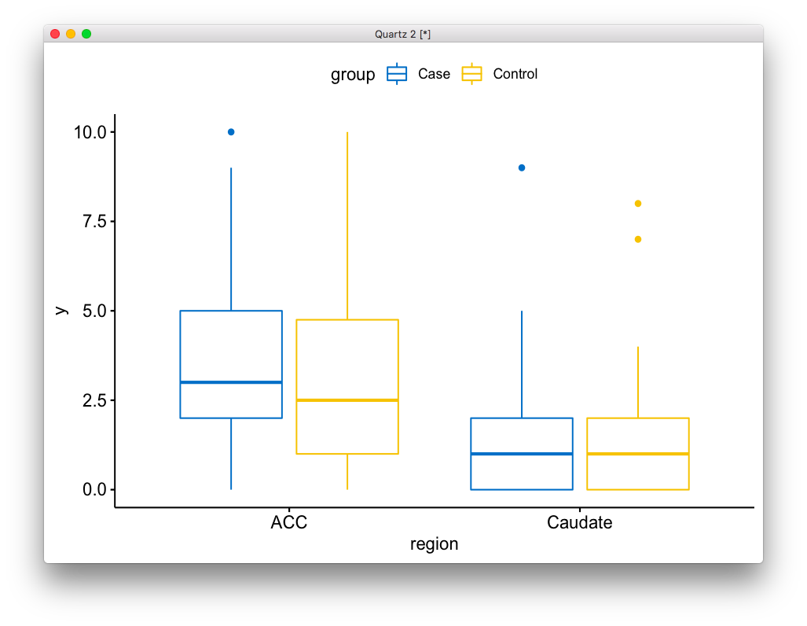
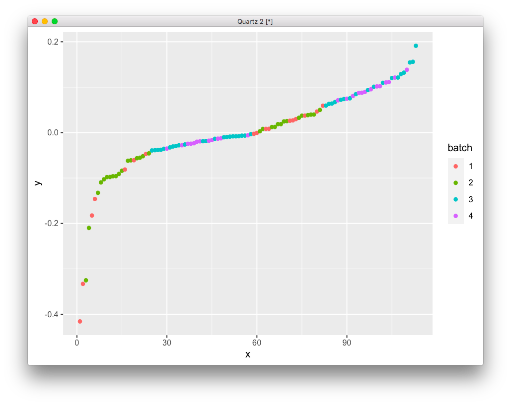

# 2020-06-10 15:07:16

I'll take a quick side track here and just run a vanilla mixed anova:

https://www.datanovia.com/en/lessons/mixed-anova-in-r/ 

Of course, within subject will be Region and between subject will be DX. I'll
eventually check all asusmptions, and even try to implement the fancy
normalizations that limma and edger do, but for now let's just see how the code
would work:

```r
data = readRDS('~/data/rnaseq_derek/complete_rawCountData_05132020.rds')
data = data[-c(which(rownames(data)=='57')), ]  # removing ACC outlier
rownames(data) = data$submitted_name  # just to ensure compatibility later
grex_vars = colnames(data)[grepl(colnames(data), pattern='^ENS')]
count_matrix = t(data[, grex_vars])
# remove that weird .num after ENSG
id_num = sapply(grex_vars, function(x) strsplit(x=x, split='\\.')[[1]][1])
rownames(count_matrix) = id_num
dups = duplicated(id_num)
id_num = id_num[!dups]
count_matrix = count_matrix[!dups, ]

library('biomaRt')
mart <- useDataset("hsapiens_gene_ensembl", useMart("ensembl"))
G_list <- getBM(filters= "ensembl_gene_id", attributes= c("ensembl_gene_id",
                 "hgnc_symbol", "chromosome_name"),values=id_num,mart= mart)
G_list <- G_list[!duplicated(G_list$ensembl_gene_id),]
imnamed = rownames(count_matrix) %in% G_list$ensembl_gene_id
count_matrix = count_matrix[imnamed, ]
imautosome = which(G_list$chromosome_name != 'X' &
G_list$chromosome_name != 'Y' &
G_list$chromosome_name != 'MT')
count_matrix = count_matrix[imautosome, ]
G_list = G_list[imautosome, ]

library(caret)
set.seed(42)
# remove genes with zero or near zero variance so we can run PCA
pp_order = c('zv', 'nzv')
pp = preProcess(t(count_matrix), method = pp_order)
X = predict(pp, t(count_matrix))
```

Now we do some vanilla mixed ANOVA:

```r
library(rstatix)
library(ggpubr)

g = 'ENSG00000000005'
plot_data = data.frame(x=1:nrow(X), y=X[, g], region=data$Region, 
                       group=data$Diagnosis)
bxp <- ggboxplot(
  plot_data, x = 'region', y = 'y',
  color = "group", palette = "jco"
  )
bxp
```



This works.

```r
mydata = cbind(X, data)
res.aov <- anova_test(
  data = mydata, dv = g, wid = hbcc_brain_id,
  between = Diagnosis, within = Region  )
get_anova_table(res.aov)
```

Or maybe these would be more applicable (cheese example):

https://stat.ethz.ch/~meier/teaching/anova/random-and-mixed-effects-models.html

and of course I could try it with batch as part of the model, or try to remove
it beforehand. Let's see:

```r
data = readRDS('~/data/rnaseq_derek/complete_rawCountData_05132020.rds')
data = data[-c(which(rownames(data)=='57')), ]  # removing ACC outlier
rownames(data) = data$submitted_name  # just to ensure compatibility later
grex_vars = colnames(data)[grepl(colnames(data), pattern='^ENS')]
count_matrix = t(data[, grex_vars])
# remove that weird .num after ENSG
id_num = sapply(grex_vars, function(x) strsplit(x=x, split='\\.')[[1]][1])
rownames(count_matrix) = id_num
dups = duplicated(id_num)
id_num = id_num[!dups]
count_matrix = count_matrix[!dups, ]

library('biomaRt')
mart <- useDataset("hsapiens_gene_ensembl", useMart("ensembl"))
G_list <- getBM(filters= "ensembl_gene_id", attributes= c("ensembl_gene_id",
                 "hgnc_symbol", "chromosome_name"),values=id_num,mart= mart)
G_list <- G_list[!duplicated(G_list$ensembl_gene_id),]
imnamed = rownames(count_matrix) %in% G_list$ensembl_gene_id
count_matrix = count_matrix[imnamed, ]
imautosome = which(G_list$chromosome_name != 'X' &
G_list$chromosome_name != 'Y' &
G_list$chromosome_name != 'MT')
count_matrix = count_matrix[imautosome, ]
G_list = G_list[imautosome, ]

library(caret)
set.seed(42)
# remove genes with zero or near zero variance so we can run PCA
pp_order = c('zv', 'nzv')
pp = preProcess(t(count_matrix), method = pp_order)
X = predict(pp, t(count_matrix))

library(edgeR)
# getting some negative counts after ComBat, so I'll offset everything
keep_genes = G_list$ensembl_gene_id %in% colnames(X)
G_list2 = G_list[keep_genes, ]
y <- DGEList(t(X), genes=G_list2, group=data$Diagnosis)

keep <- filterByExpr(y)  # doing it based on group
y <- y[keep, , keep.lib.sizes=FALSE]
y <- calcNormFactors(y)

library(variancePartition)
library(BiocParallel)
param = SnowParam(2, "SOCK", progressbar=TRUE)
register(param)

data$Individual = factor(data$hbcc_brain_id)
data$batch = factor(data$run_date)
form <- ~ Diagnosis*Region + batch + (1|Individual)
vobjDream = voomWithDreamWeights(y, form, data)
fitmm = dream( vobjDream, form, data )
# fitmmKR = dream( vobjDream, form, data, ddf="Kenward-Roger")
top.table = topTable( fitmm, coef='DiagnosisControl:RegionCaudate',
                      sort.by = "P", number=Inf )
```

And if not putting batch in the model, I can try:

```r
library(sva)
DX <- factor(data$Diagnosis)
Region <- factor(data$Region)

design <- model.matrix(~DX*Region)
svafit <- sva(t(X), design)

library(ggplot2)
plot_data = data.frame(x=1:nrow(data), y=sort(svafit$sv),
                       batch=as.factor(data$batch))
ggplot(plot_data, aes(x=x, y=y, color=batch)) + geom_point()

svaX<-model.matrix(~DX*Region+svafit$sv)
```



Hum... not sure about what sva is doing here. Shouldn't samples for the same
batch be closer to each other? How about ComBat?

```r
modcombat = model.matrix(~1, data=data)
batch = factor(data$run_date)

library(sva)
keep_genes = G_list$ensembl_gene_id %in% colnames(X)
G_list2 = G_list[keep_genes, ]
y <- DGEList(t(X), genes=G_list2, group=data$Diagnosis)
keep <- filterByExpr(y)  # doing it based on group
y <- y[keep, , keep.lib.sizes=FALSE]
y <- calcNormFactors(y)
lcpm = cpm(y, log=TRUE)

adjusted_counts <- ComBat(lcpm, batch=batch, mod=modcombat, par.prior=T,
                          prior.plots=F)
pca <- prcomp(t(adjusted_counts), scale=TRUE)
library(pca3d)
pca2d(pca, group=data$run_date, shape=as.numeric(data$Diagnosis))
```

Even using this I still get many negative counts... don't like that. Let's focus
on getting the fixed models running then, including the batch effect in the
stats model:

# 2020-06-11 07:14:50

A quick note on whether use 0 or not in the formula. It's an R notation, but if
we use it (~ 0 +), then it has coefficients for DiagnosisCase and
DiagnosisControl, instead of just one of them when not using it. We could then
just do:

```r
L = getContrast( vobjDream, form, data, c("DiagnosisControl", "DiagnosisCase"))
fit = dream( vobjDream, form, data, L)
tt = topTable( fit, coef="L1")
```

Finally, I can also do the cleaning using a design matrix just for kicks:

```r
y <- DGEList(t(X), genes=G_list2, group=data$Diagnosis)
DX <- factor(data$Diagnosis)
Region <- factor(data$Region)

design <- model.matrix(~DX*Region)
keep <- filterByExpr(y, group=NULL, design=design)
y <- y[keep, , keep.lib.sizes=FALSE]
y <- calcNormFactors(y)

library(variancePartition)
library(BiocParallel)
param = SnowParam(2, "SOCK", progressbar=TRUE)
register(param)

data$Individual = factor(data$hbcc_brain_id)
data$batch = factor(data$run_date)
form <- ~ Diagnosis*Region + batch + (1|Individual)
vobjDream = voomWithDreamWeights(y, form, data)
fitmm = dream( vobjDream, form, data )
# fitmmKR = dream( vobjDream, form, data, ddf="Kenward-Roger")
top.table = topTable( fitmm, coef='DiagnosisControl:RegionCaudate',
                      sort.by = "P", number=Inf )
```

Also, we have a small dataset, so worth checking if it makes a difference using
the KR approximation...

