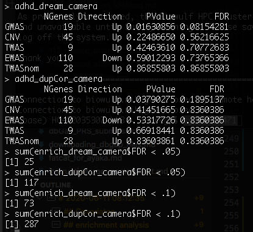
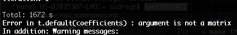

# 2020-06-11 08:12:35

I was going over the dream paper from Panos' group, and they do an AD analysis
very similar to ours:

https://www.biorxiv.org/content/10.1101/432567v2.full.pdf
https://github.com/GabrielHoffman/dream_analysis
https://github.com/GabrielHoffman/dream_analysis/blob/master/src/AMP_AD.Rmd

Let's try to replicate it in our data. Note that he restricted it to WNH, so we
might have to eventually do the same.

We might also need to run some correlation matrices in our metadata to make sure
we're not removing very correlated variables:

https://bioconductor.org/packages/release/bioc/vignettes/variancePartition/inst/doc/variancePartition.pdf

```bash
# sin
cd ~/lab_notes/
module load jupyter
jupyter notebook --ip localhost --port $PORT1 --no-browser
```

```r
data = readRDS('~/data/rnaseq_derek/complete_rawCountData_05132020.rds')
data = data[-c(which(rownames(data)=='57')), ]  # removing ACC outlier
rownames(data) = data$submitted_name  # just to ensure compatibility later
grex_vars = colnames(data)[grepl(colnames(data), pattern='^ENS')]
count_matrix = t(data[, grex_vars])
# remove that weird .num after ENSG
id_num = sapply(grex_vars, function(x) strsplit(x=x, split='\\.')[[1]][1])
rownames(count_matrix) = id_num
dups = duplicated(id_num)
id_num = id_num[!dups]
count_matrix = count_matrix[!dups, ]

library('biomaRt')
mart <- useDataset("hsapiens_gene_ensembl", useMart("ensembl"))
G_list0 <- getBM(filters= "ensembl_gene_id", attributes= c("ensembl_gene_id",
                 "hgnc_symbol", "chromosome_name"),values=id_num,mart= mart)
# remove any genes without a HUGOID
G_list <- G_list0[!is.na(G_list0$hgnc_symbol),]
G_list = G_list[G_list$hgnc_symbol!='',]
# remove genes that appear more than once
G_list <- G_list[!duplicated(G_list$ensembl_gene_id),]
# keep only gene counts for genes that we have information
imnamed = rownames(count_matrix) %in% G_list$ensembl_gene_id
count_matrix = count_matrix[imnamed, ]

library(caret)
set.seed(42)
# remove genes with zero or near zero variance so we can run PCA
pp_order = c('zv', 'nzv')
pp = preProcess(t(count_matrix), method = pp_order)
X = predict(pp, t(count_matrix))
geneCounts = t(X)

# match gene counts to gene info
G_list2 = merge(rownames(geneCounts), G_list, by=1)
colnames(G_list2)[1] = 'ensembl_gene_id'

# keep only autosomal genes
imautosome = which(G_list2$chromosome_name != 'X' &
                   G_list2$chromosome_name != 'Y' &
                   G_list2$chromosome_name != 'MT')
geneCounts = geneCounts[imautosome, ]
G_list2 = G_list2[imautosome, ]

library(edgeR)
isexpr = rowSums(cpm(geneCounts)>1) >= 0.1*ncol(geneCounts)

# Standard usage of limma/voom
genes = DGEList( geneCounts[isexpr,], genes=G_list2[isexpr,] ) 
genes = calcNormFactors( genes)
data$Individual = factor(data$hbcc_brain_id)
data$batch = factor(data$run_date)

design = model.matrix( ~ Region + batch , data)
vobj_tmp = voom( genes, design, plot=FALSE)
# apply duplicateCorrelation 
dupcor <- duplicateCorrelation(vobj_tmp,design,block=data$Individual)
# run voom considering the duplicateCorrelation results
# in order to compute more accurate precision weights
vobj = voom( genes, design, plot=FALSE, block=data$Individual,
             correlation=dupcor$consensus)
# run voom using a linear mixed model in dream
library(variancePartition)
library(BiocParallel)
param = SnowParam(16, "SOCK", progressbar=TRUE)
register(param)

form = ~ (1|Region) + (1|batch) + (1|Individual)
vobjMM = voomWithDreamWeights( genes, form, data, plot=FALSE)
```

That took about 1.5h running on the Desktop.

Let's plot some of the variables, but as noted above it'll be better to do some
variable correlation first:

```r
form = ~ (1|Region:Diagnosis) + (1|Individual) + (1|batch) + (1|Region) + (1|Sex) + RINe + PMI + Age
vp = fitExtractVarPartModel( vobj, form, data)
plotVarPart( sortCols( vp ) ) 
```

1h and 10min on the Desktop with 16 threads...

Now we compare expression with Diagnosis:

```r
design = model.matrix( ~ 0 + Region + Region:Diagnosis + batch + Sex + RINe + PMI + Age,
                      data)
# Estimate linear mixed model with a single variance component
# Fit the model for each gene, 
dupcor <- duplicateCorrelation(vobj, design, block=data$Individual)
# But this step uses only the genome-wide average for the random effect
fitDupCor <- lmFit(vobj, design, block=data$Individual, correlation=dupcor$consensus)
Lc = matrix(0, ncol=ncol(design))
colnames(Lc) = colnames(design)
Lc[length(Lc):(length(Lc)-1)] = 1
fitDupCor = contrasts.fit( fitDupCor, t(Lc))
 
# Fit Empirical Bayes for moderated t-statistics
fitDupCor <- eBayes( fitDupCor )

# now using dream
form = ~ 0 + Region + Region:Diagnosis + (1|Individual) + (1|batch) + Sex + scale(RINe) + scale(PMI) + scale(Age) 
 
# Get the contrast matrix for the hypothesis test
L = getContrast( vobj, form, data, "RegionCaudate:DiagnosisControl")
L['RegionACC:DiagnosisControl'] = 1
# Fit the dream model on each gene
# Apply the contrast matrix L for the hypothesis test  
# By default, uses the Satterthwaite approximation for the hypothesis test
fitmm = dream( vobjMM, form, data, L)

# fitmmKR = dream( vobjMM, form, data, L, ddf="Kenward-Roger")
```

That took 2.7h! I saved everything in ~/data/rnaseq_derek/dream1.RDATA.

```r
save(fitmm, fitDupCor, vobjMM, vobj, dupcor, vp, 
     file='~/data/rnaseq_derek/dream1.RDATA')
```

Compare -log10 p from dream and duplicateCorrelation

```r
p1 = topTable(fitDupCor, number=Inf, sort.by="none")$P.Value
p2 = topTable(fitmm, coef='L1', number=Inf, sort.by="none")$P.Value
      
plotCompareP( p1, p2, vp$Individual, dupcor$consensus)
```

## Covariates

Let's contruct two correlation matrices: one for technical variables and another
for biological variables:

```r
data = readRDS('~/data/rnaseq_derek/complete_rawCountData_05132020.rds')
data = data[-c(which(rownames(data)=='57')), ]  # removing ACC outlier
rownames(data) = data$submitted_name  # just to ensure compatibility later
data$Individual = factor(data$hbcc_brain_id)
data$batch = factor(data$run_date)

library(variancePartition)
form <- ~ batch + RINe + bainbank + pH + pcnt_optical_duplicates + clusters
C = canCorPairs( form, data)
plotCorrMatrix( C )
```


Brain bank, batch and clusters are highly correlated. Others as well. But we
should actually check their effect in the actual gene counts:

## enrichment analysis

```r
library(qvalue)
load('~/data/rnaseq_derek/enrich.RDATA')
# exlucde some gensets: mSigDB C4
geneSetsCombined = geneSetsCombined[grep("^c4", names(geneSetsCombined), invert=TRUE)]
geneSetsCombined = geneSetsCombined[grep("^CMC", names(geneSetsCombined), invert=TRUE)]
# geneInfo = readRDS("geneInfo.RDS")
geneInfo = readRDS('~/data/rnaseq_derek/geneInfo.RDS')

get_enrich_order = function( res ){
  res$qvalue = qvalue( res$P.Value )$qvalue
  rownames(res) = gsub("\\..*$", "", rownames(res))
  res$gene = geneInfo$geneName[match(rownames(res), geneInfo$Geneid)]
  res$symbol = sub("^(ENSG.*)$", NA, res$gene)
  if( !is.null(res$z.std) ){
    stat = res$z.std
  }else if( !is.null(res$F.std) ){
    stat = res$F.std
  }else if( !is.null(res$t) ){
    stat = res$t
  }else{
    stat = res$F
  }
  names(stat) = res$symbol
  stat = stat[!is.na(names(stat))]
  print(head(stat))
  index = ids2indices(geneSetsCombined, names(stat))
  cameraPR( stat, index )
}

res = topTable(fitDupCor, number=Inf) 
enrich_dupCor_camera = get_enrich_order( res ) 
   
res = topTable(fitmm, coef="L1", number=Inf)  
enrich_dream_camera = get_enrich_order( res )
```

The code works with Gabriel's gene sets, but let's change things a bit so it
works better with ours. Also, need to figure out exactly what those results
are...

```r
get_enrich_order2 = function( res, gene_sets ){
  if( !is.null(res$z.std) ){
    stat = res$z.std
  }else if( !is.null(res$F.std) ){
    stat = res$F.std
  }else if( !is.null(res$t) ){
    stat = res$t
  }else{
    stat = res$F
  }
  names(stat) = res$hgnc_symbol
  stat = stat[!is.na(names(stat))]
  print(head(stat))
  index = ids2indices(gene_sets, names(stat))
  cameraPR( stat, index )
}
load('~/data/rnaseq_derek/enrich.RDATA')
load('~/data/rnaseq_derek/adhd_genesets_philip.RDATA')
load('~/data/rnaseq_derek/dream1.RDATA')

resDC = topTable(fitDupCor, number=Inf) 
enrich_dupCor_camera = get_enrich_order2( resDC, geneSetsCombined ) 
adhd_dupCor_camera = get_enrich_order2( resDC, t2 ) 
   
resMM = topTable(fitmm, coef="L1", number=Inf)  
enrich_dream_camera = get_enrich_order2( resMM, geneSetsCombined )
adhd_dream_camera = get_enrich_order2( resMM, t2 )

```

It looks like our dupCor results are actually a bit better:



I'm getting an error when running the KR approximation. It doesn't happen if I
run a handful of genes, but when I do the entire set. 



I'll hold out on that os I can run the other experiments.

How about using the developmental gene sets?

```r
library('ABAEnrichment')
cutoffs = c(.1, .2, .3, .4, .5, .6, .7, .8, .9)
anno = get_annotated_genes(structure_ids=c('Allen:10277', 'Allen:10278',
                                            'Allen:10333'),
                           dataset='5_stages',
                           cutoff_quantiles=cutoffs)
# format lists into the format we need
dev_lists = list()
for (s in 1:5) {
    for (co in cutoffs) {
        idx = anno$age_category==s & anno$cutoff==co
        expressed_genes = unique(anno[idx, 'anno_gene'])
        dev_lists[[sprintf('dev%s_c%.1f', s, co)]] = expressed_genes
    }
}
dev_dupCor_camera = get_enrich_order2( resDC, dev_lists )
dev_dream_camera = get_enrich_order2( resMM, dev_lists ) 
```

We get plenty of results here. The main question is what lists to use, and what
kind of conclusions we can get. For example, it's clear that we have singificant
results across cutoffs and developmental stages (especially with cutoff above
.3). But what's the intersect of those gene sets? If we take cutoff X, if X is
above .3 it's clear that all stages will be significant. But what's the overlap
across stages? If there isn't much (or we could potentially select a cut-off to
minimize that), it'd seem that the effect of ADHD in up-regulating those genes
is constant across development? (or something better worded than that)


# TODO
* make the plot justifying 
```r
isexpr = rowSums(cpm(geneCounts)>1) >= 0.1*ncol(geneCounts)
```
and then run it for other thresholds. Median upper quartile pvals as a metric?
Look at covariates first though?
* Try KR version?
* Try different covariates
* Try gene set analysis for different gene sets
  * need to figure out how to filter KEGG and GO databases, and others if necessary
  * should we use Gabriel's gene sets somehow? (~1.6K sets)
* check that dream is really necessary, or if we can just do cameraPR in dupCor
  and go with that... much faster! Maybe even try using the table at different
  nominal p-value cut-offs just in case.


```r
data = readRDS('~/data/rnaseq_derek/complete_rawCountData_05132020.rds')
data = data[-c(which(rownames(data)=='57')), ]  # removing ACC outlier
rownames(data) = data$submitted_name  # just to ensure compatibility later
grex_vars = colnames(data)[grepl(colnames(data), pattern='^ENS')]
count_matrix = t(data[, grex_vars])
# remove that weird .num after ENSG
id_num = sapply(grex_vars, function(x) strsplit(x=x, split='\\.')[[1]][1])
rownames(count_matrix) = id_num
dups = duplicated(id_num)
id_num = id_num[!dups]
count_matrix = count_matrix[!dups, ]

library('biomaRt')
mart <- useDataset("hsapiens_gene_ensembl", useMart("ensembl"))
G_list0 <- getBM(filters= "ensembl_gene_id", attributes= c("ensembl_gene_id",
                 "hgnc_symbol", "chromosome_name"),values=id_num,mart= mart)
# remove any genes without a HUGOID
G_list <- G_list0[!is.na(G_list0$hgnc_symbol),]
G_list = G_list[G_list$hgnc_symbol!='',]
# remove genes that appear more than once
G_list <- G_list[!duplicated(G_list$ensembl_gene_id),]
# keep only gene counts for genes that we have information
imnamed = rownames(count_matrix) %in% G_list$ensembl_gene_id
count_matrix = count_matrix[imnamed, ]

library(caret)
set.seed(42)
# remove genes with zero or near zero variance so we can run PCA
pp_order = c('zv', 'nzv')
pp = preProcess(t(count_matrix), method = pp_order)
X = predict(pp, t(count_matrix))
geneCounts = t(X)

# match gene counts to gene info
G_list2 = merge(rownames(geneCounts), G_list, by=1)
colnames(G_list2)[1] = 'ensembl_gene_id'

# keep only autosomal genes
imautosome = which(G_list2$chromosome_name != 'X' &
                   G_list2$chromosome_name != 'Y' &
                   G_list2$chromosome_name != 'MT')
geneCounts = geneCounts[imautosome, ]
G_list2 = G_list2[imautosome, ]

library(edgeR)
isexpr = rowSums(cpm(geneCounts)>1) >= 0.1*ncol(geneCounts)

library(BiocParallel)
param = SnowParam(8, "SOCK", progressbar=TRUE)
register(param)

genes = DGEList( geneCounts[isexpr,], genes=G_list2[isexpr,] ) 
genes = calcNormFactors( genes)
data$Individual = factor(data$hbcc_brain_id)
data$batch = factor(data$run_date)
design = model.matrix( ~ Region + batch , data)
vobj_tmp = voom( genes, design, plot=FALSE)
dupcor <- duplicateCorrelation(vobj_tmp,design,block=data$Individual)
vobj = voom( genes, design, plot=FALSE, block=data$Individual,
             correlation=dupcor$consensus)
library(variancePartition)
form = ~ (1|Region) + (1|batch) + (1|Individual)
vobjMM = voomWithDreamWeights( genes, form, data, plot=FALSE)
form = ~ (1|Region:Diagnosis) + (1|Individual) + (1|batch) + (1|Region) + (1|Sex) + RINe + PMI + Age
vp = fitExtractVarPartModel( vobj, form, data)
design = model.matrix( ~ 0 + Region + Region:Diagnosis + batch + Sex + RINe + PMI + Age,
                      data)
dupcor <- duplicateCorrelation(vobj, design, block=data$Individual)
fitDupCor <- lmFit(vobj, design, block=data$Individual, correlation=dupcor$consensus)
Lc = matrix(0, ncol=ncol(design))
colnames(Lc) = colnames(design)
Lc[length(Lc):(length(Lc)-1)] = 1
fitDupCor = contrasts.fit( fitDupCor, t(Lc))
fitDupCor <- eBayes( fitDupCor )
form = ~ 0 + Region + Region:Diagnosis + (1|Individual) + (1|batch) + Sex + scale(RINe) + scale(PMI) + scale(Age) 
L = getContrast( vobj, form, data, "RegionCaudate:DiagnosisControl")
L['RegionACC:DiagnosisControl'] = 1
fitmm = dream( vobjMM, form, data, L)
save(fitmm, fitDupCor, vobjMM, vobj, dupcor, vp, 
     file='~/data/rnaseq_derek/dream1.RDATA')
```