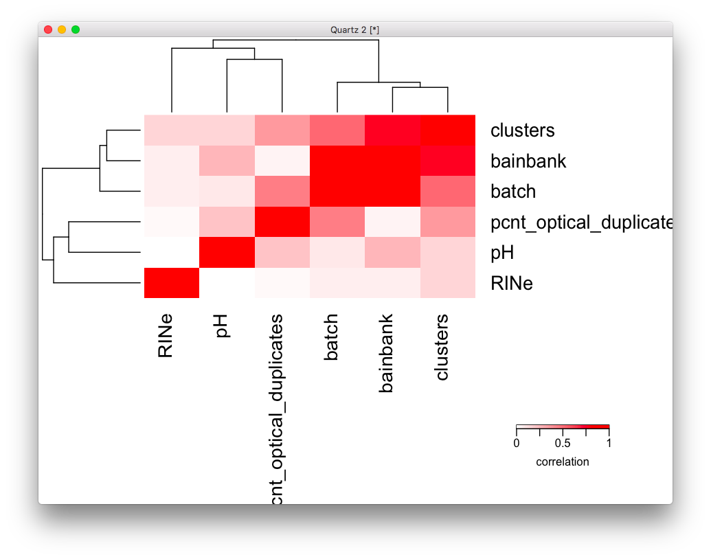

# 2020-06-11 08:12:35

I was going over the dream paper from Panos' group, and they do an AD analysis
very similar to ours:

https://www.biorxiv.org/content/10.1101/432567v2.full.pdf
https://github.com/GabrielHoffman/dream_analysis
https://github.com/GabrielHoffman/dream_analysis/blob/master/src/AMP_AD.Rmd

Let's try to replicate it in our data. Note that he restricted it to WNH, so we
might have to eventually do the same.

We might also need to run some correlation matrices in our metadata to make sure
we're not removing very correlated variables:

https://bioconductor.org/packages/release/bioc/vignettes/variancePartition/inst/doc/variancePartition.pdf

```bash
# sin
cd ~/lab_notes/
module load jupyter
jupyter notebook --ip localhost --port $PORT1 --no-browser
```

```r
data = readRDS('~/data/rnaseq_derek/complete_rawCountData_05132020.rds')
data = data[-c(which(rownames(data)=='57')), ]  # removing ACC outlier
rownames(data) = data$submitted_name  # just to ensure compatibility later
grex_vars = colnames(data)[grepl(colnames(data), pattern='^ENS')]
count_matrix = t(data[, grex_vars])
# remove that weird .num after ENSG
id_num = sapply(grex_vars, function(x) strsplit(x=x, split='\\.')[[1]][1])
rownames(count_matrix) = id_num
dups = duplicated(id_num)
id_num = id_num[!dups]
count_matrix = count_matrix[!dups, ]

library('biomaRt')
mart <- useDataset("hsapiens_gene_ensembl", useMart("ensembl"))
G_list <- getBM(filters= "ensembl_gene_id", attributes= c("ensembl_gene_id",
                 "hgnc_symbol", "chromosome_name"),values=id_num,mart= mart)
G_list <- G_list[!duplicated(G_list$ensembl_gene_id),]
imnamed = rownames(count_matrix) %in% G_list$ensembl_gene_id
count_matrix = count_matrix[imnamed, ]
imautosome = which(G_list$chromosome_name != 'X' &
G_list$chromosome_name != 'Y' &
G_list$chromosome_name != 'MT')
count_matrix = count_matrix[imautosome, ]
G_list = G_list[imautosome, ]

library(caret)
set.seed(42)
# remove genes with zero or near zero variance so we can run PCA
pp_order = c('zv', 'nzv')
pp = preProcess(t(count_matrix), method = pp_order)
X = predict(pp, t(count_matrix))
geneCounts = t(X)

library(edgeR)
# getting some negative counts after ComBat, so I'll offset everything
keep_genes = G_list$ensembl_gene_id %in% colnames(X)
G_list2 = G_list[keep_genes, ]

isexpr = rowSums(cpm(geneCounts)>1) >= 0.1*ncol(geneCounts)

# Standard usage of limma/voom
genes = DGEList( geneCounts[isexpr,], genes=G_list2[isexpr,] ) 
genes = calcNormFactors( genes)
data$Individual = factor(data$hbcc_brain_id)
data$batch = factor(data$run_date)

design = model.matrix( ~ Region + batch , data)
vobj_tmp = voom( genes, design, plot=FALSE)
# apply duplicateCorrelation 
dupcor <- duplicateCorrelation(vobj_tmp,design,block=data$Individual)
# run voom considering the duplicateCorrelation results
# in order to compute more accurate precision weights
vobj = voom( genes, design, plot=FALSE, block=data$Individual,
             correlation=dupcor$consensus)
# run voom using a linear mixed model in dream
library(variancePartition)
library(BiocParallel)
param = SnowParam(16, "SOCK", progressbar=TRUE)
register(param)

form = ~ (1|Region) + (1|batch) + (1|Individual)
vobjMM = voomWithDreamWeights( genes, form, data, plot=FALSE)
```

That took about 1.5h running on the Desktop.

Let's plot some of the variables, but as noted above it'll be better to do some
variable correlation first:

```r
form = ~ (1|Region:Diagnosis) + (1|Individual) + (1|batch) + (1|Region) + (1|Sex) + RINe + PMI + Age
vp = fitExtractVarPartModel( vobj, form, data)
plotVarPart( sortCols( vp ) ) 
```

Now we compare expression with Diagnosis:

```r
design = model.matrix( ~ 0 + Region + Region:Diagnosis + batch + Sex + RINe + PMI + Age,
                      data)
# Estimate linear mixed model with a single variance component
# Fit the model for each gene, 
dupcor <- duplicateCorrelation(vobj, design, block=data$Individual)
# But this step uses only the genome-wide average for the random effect
fitDupCor <- lmFit(vobj, design, block=data$Individual, correlation=dupcor$consensus)
Lc = matrix(0, ncol=ncol(design))
colnames(Lc) = colnames(design)
Lc[length(Lc):(length(Lc)-1)] = 1
fitDupCor = contrasts.fit( fitDupCor, t(Lc))
 
# Fit Empirical Bayes for moderated t-statistics
fitDupCor <- eBayes( fitDupCor )

# now using dream
form = ~ 0 + Region + Region:Diagnosis + (1|Individual) + (1|batch) + Sex + scale(RINe) + scale(PMI) + scale(Age) 
 
# Get the contrast matrix for the hypothesis test
L = getContrast( vobj, form, data, "RegionCaudate:DiagnosisControl")
L['RegionACC:DiagnosisControl'] = 1
# Fit the dream model on each gene
# Apply the contrast matrix L for the hypothesis test  
# By default, uses the Satterthwaite approximation for the hypothesis test
fitmm = dream( vobjMM, form, data, L)
```

Compare -log10 p from dream and duplicateCorrelation

```r
p1 = topTable(fitDupCor, number=Inf, sort.by="none")$P.Value
p2 = topTable(fitmm, coef='L1', number=Inf, sort.by="none")$P.Value
      
plotCompareP( p1, p2, vp$individualIdentifier, dupcor$consensus)
```

## Covariates

Let's contruct two correlation matrices: one for technical variables and another
for biological variables:

```r
data = readRDS('~/data/rnaseq_derek/complete_rawCountData_05132020.rds')
data = data[-c(which(rownames(data)=='57')), ]  # removing ACC outlier
rownames(data) = data$submitted_name  # just to ensure compatibility later
data$Individual = factor(data$hbcc_brain_id)
data$batch = factor(data$run_date)

library(variancePartition)
form <- ~ batch + RINe + bainbank + pH + pcnt_optical_duplicates + clusters
C = canCorPairs( form, data)
plotCorrMatrix( C )
```



Brain bank, batch and clusters are highly correlated. Others as well. But we
should actually check their effect in the actual gene counts:

## enrichment analysis

```r
get_enrich_order = function( res ){
  res$qvalue = qvalue( res$P.Value )$qvalue
  rownames(res) = gsub("\\..*$", "", rownames(res))
  res$gene = geneInfo$geneName[match(rownames(res), geneInfo$Geneid)]
  res$symbol = sub("^(ENSG.*)$", NA, res$gene)
  if( !is.null(res$z.std) ){
    stat = res$z.std
  }else if( !is.null(res$F.std) ){
    stat = res$F.std
  }else if( !is.null(res$t) ){
    stat = res$t
  }else{
    stat = res$F
  }
  names(stat) = res$symbol
  stat = stat[!is.na(names(stat))]
  index = ids2indices(geneSetsCombined, names(stat))
  cameraPR( stat, index )
}

res = topTable(fitDupCor, number=Inf) 
enrich_dupCor_camera = get_enrich_order( res ) 
   
res = topTable(fitmm, coef="L1", number=Inf)  
enrich_dream_camera = get_enrich_order( res )   
```

# TODO
* make the plot justifying 
```r
isexpr = rowSums(cpm(geneCounts)>1) >= 0.1*ncol(geneCounts)
```
and then run it for other thresholds.
* Try KM version
* Try different covariates
* Try gene set analysis for different gene sets
  * need to figure out how to filter KEGG and GO databases, and others if necessary
  * use Philip's gene lists (t2)
  * try the ones Gabriel used just for debugging (enrich)