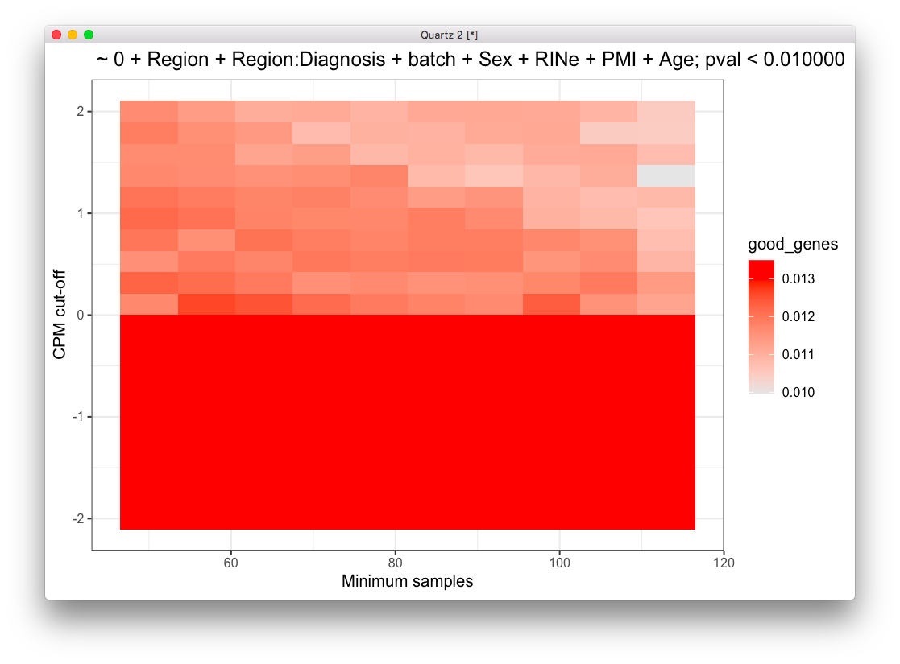
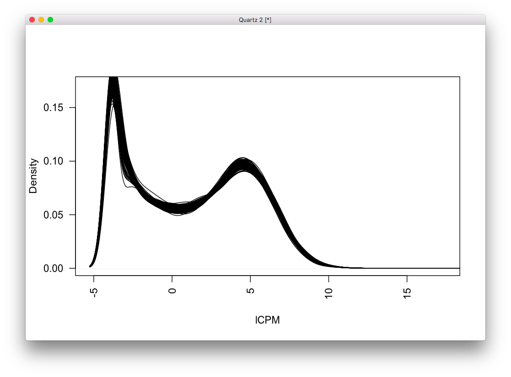

# 2020-06-11 08:12:35

I was going over the dream paper from Panos' group, and they do an AD analysis
very similar to ours:

https://www.biorxiv.org/content/10.1101/432567v2.full.pdf
https://github.com/GabrielHoffman/dream_analysis
https://github.com/GabrielHoffman/dream_analysis/blob/master/src/AMP_AD.Rmd

Let's try to replicate it in our data. Note that he restricted it to WNH, so we
might have to eventually do the same.

We might also need to run some correlation matrices in our metadata to make sure
we're not removing very correlated variables:

https://bioconductor.org/packages/release/bioc/vignettes/variancePartition/inst/doc/variancePartition.pdf

```bash
# sin
cd ~/lab_notes/
module load jupyter
jupyter notebook --ip localhost --port $PORT1 --no-browser
```

```r
data = readRDS('~/data/rnaseq_derek/complete_rawCountData_05132020.rds')
data = data[-c(which(rownames(data)=='57')), ]  # removing ACC outlier
rownames(data) = data$submitted_name  # just to ensure compatibility later
grex_vars = colnames(data)[grepl(colnames(data), pattern='^ENS')]
count_matrix = t(data[, grex_vars])
# remove that weird .num after ENSG
id_num = sapply(grex_vars, function(x) strsplit(x=x, split='\\.')[[1]][1])
rownames(count_matrix) = id_num
dups = duplicated(id_num)
id_num = id_num[!dups]
count_matrix = count_matrix[!dups, ]

library('biomaRt')
mart <- useDataset("hsapiens_gene_ensembl", useMart("ensembl"))
G_list0 <- getBM(filters= "ensembl_gene_id", attributes= c("ensembl_gene_id",
                 "hgnc_symbol", "chromosome_name"),values=id_num,mart= mart)
# remove any genes without a HUGOID
G_list <- G_list0[!is.na(G_list0$hgnc_symbol),]
G_list = G_list[G_list$hgnc_symbol!='',]
# remove genes that appear more than once
G_list <- G_list[!duplicated(G_list$ensembl_gene_id),]
# keep only gene counts for genes that we have information
imnamed = rownames(count_matrix) %in% G_list$ensembl_gene_id
count_matrix = count_matrix[imnamed, ]

library(caret)
set.seed(42)
# remove genes with zero or near zero variance so we can run PCA
pp_order = c('zv', 'nzv')
pp = preProcess(t(count_matrix), method = pp_order)
X = predict(pp, t(count_matrix))
geneCounts = t(X)

# match gene counts to gene info
G_list2 = merge(rownames(geneCounts), G_list, by=1)
colnames(G_list2)[1] = 'ensembl_gene_id'

# keep only autosomal genes
imautosome = which(G_list2$chromosome_name != 'X' &
                   G_list2$chromosome_name != 'Y' &
                   G_list2$chromosome_name != 'MT')
geneCounts = geneCounts[imautosome, ]
G_list2 = G_list2[imautosome, ]

library(edgeR)
isexpr = rowSums(cpm(geneCounts)>1) >= 0.1*ncol(geneCounts)

# Standard usage of limma/voom
genes = DGEList( geneCounts[isexpr,], genes=G_list2[isexpr,] ) 
genes = calcNormFactors( genes)
data$Individual = factor(data$hbcc_brain_id)
data$batch = factor(data$run_date)

design = model.matrix( ~ Region + batch , data)
vobj_tmp = voom( genes, design, plot=FALSE)
# apply duplicateCorrelation 
dupcor <- duplicateCorrelation(vobj_tmp,design,block=data$Individual)
# run voom considering the duplicateCorrelation results
# in order to compute more accurate precision weights
vobj = voom( genes, design, plot=FALSE, block=data$Individual,
             correlation=dupcor$consensus)
# run voom using a linear mixed model in dream
library(variancePartition)
library(BiocParallel)
param = SnowParam(16, "SOCK", progressbar=TRUE)
register(param)

form = ~ (1|Region) + (1|batch) + (1|Individual)
vobjMM = voomWithDreamWeights( genes, form, data, plot=FALSE)
```

That took about 1.5h running on the Desktop.

Let's plot some of the variables, but as noted above it'll be better to do some
variable correlation first:

```r
form = ~ (1|Region:Diagnosis) + (1|Individual) + (1|batch) + (1|Region) + (1|Sex) + RINe + PMI + Age
vp = fitExtractVarPartModel( vobj, form, data)
plotVarPart( sortCols( vp ) ) 
```

1h and 10min on the Desktop with 16 threads...

Now we compare expression with Diagnosis:

```r
design = model.matrix( ~ 0 + Region + Region:Diagnosis + batch + Sex + RINe + PMI + Age,
                      data)
# Estimate linear mixed model with a single variance component
# Fit the model for each gene, 
dupcor <- duplicateCorrelation(vobj, design, block=data$Individual)
# But this step uses only the genome-wide average for the random effect
fitDupCor <- lmFit(vobj, design, block=data$Individual, correlation=dupcor$consensus)
Lc = matrix(0, ncol=ncol(design))
colnames(Lc) = colnames(design)
Lc[length(Lc):(length(Lc)-1)] = 1
fitDupCor = contrasts.fit( fitDupCor, t(Lc))
 
# Fit Empirical Bayes for moderated t-statistics
fitDupCor <- eBayes( fitDupCor )

# now using dream
form = ~ 0 + Region + Region:Diagnosis + (1|Individual) + (1|batch) + Sex + scale(RINe) + scale(PMI) + scale(Age) 
 
# Get the contrast matrix for the hypothesis test
L = getContrast( vobj, form, data, "RegionCaudate:DiagnosisControl")
L['RegionACC:DiagnosisControl'] = 1
# Fit the dream model on each gene
# Apply the contrast matrix L for the hypothesis test  
# By default, uses the Satterthwaite approximation for the hypothesis test
fitmm = dream( vobjMM, form, data, L)

# fitmmKR = dream( vobjMM, form, data, L, ddf="Kenward-Roger")
```

That took 2.7h! I saved everything in ~/data/rnaseq_derek/dream1.RDATA.

```r
save(fitmm, fitDupCor, vobjMM, vobj, dupcor, vp, 
     file='~/data/rnaseq_derek/dream1.RDATA')
```

Compare -log10 p from dream and duplicateCorrelation

```r
p1 = topTable(fitDupCor, number=Inf, sort.by="none")$P.Value
p2 = topTable(fitmm, coef='L1', number=Inf, sort.by="none")$P.Value
      
plotCompareP( p1, p2, vp$Individual, dupcor$consensus)
```

## Covariates

Let's contruct two correlation matrices: one for technical variables and another
for biological variables:

```r
data = readRDS('~/data/rnaseq_derek/complete_rawCountData_05132020.rds')
data = data[-c(which(rownames(data)=='57')), ]  # removing ACC outlier
rownames(data) = data$submitted_name  # just to ensure compatibility later
data$Individual = factor(data$hbcc_brain_id)
data$batch = factor(data$run_date)

library(variancePartition)
form <- ~ batch + RINe + bainbank + pH + pcnt_optical_duplicates + clusters
C = canCorPairs( form, data)
plotCorrMatrix( C )
```


Brain bank, batch and clusters are highly correlated. Others as well. But we
should actually check their effect in the actual gene counts:

## enrichment analysis

```r
library(qvalue)
load('~/data/rnaseq_derek/enrich.RDATA')
# exlucde some gensets: mSigDB C4
geneSetsCombined = geneSetsCombined[grep("^c4", names(geneSetsCombined), invert=TRUE)]
geneSetsCombined = geneSetsCombined[grep("^CMC", names(geneSetsCombined), invert=TRUE)]
# geneInfo = readRDS("geneInfo.RDS")
geneInfo = readRDS('~/data/rnaseq_derek/geneInfo.RDS')

get_enrich_order = function( res ){
  res$qvalue = qvalue( res$P.Value )$qvalue
  rownames(res) = gsub("\\..*$", "", rownames(res))
  res$gene = geneInfo$geneName[match(rownames(res), geneInfo$Geneid)]
  res$symbol = sub("^(ENSG.*)$", NA, res$gene)
  if( !is.null(res$z.std) ){
    stat = res$z.std
  }else if( !is.null(res$F.std) ){
    stat = res$F.std
  }else if( !is.null(res$t) ){
    stat = res$t
  }else{
    stat = res$F
  }
  names(stat) = res$symbol
  stat = stat[!is.na(names(stat))]
  print(head(stat))
  index = ids2indices(geneSetsCombined, names(stat))
  cameraPR( stat, index )
}

res = topTable(fitDupCor, number=Inf) 
enrich_dupCor_camera = get_enrich_order( res ) 
   
res = topTable(fitmm, coef="L1", number=Inf)  
enrich_dream_camera = get_enrich_order( res )
```

The code works with Gabriel's gene sets, but let's change things a bit so it
works better with ours. Also, need to figure out exactly what those results
are...

```r
get_enrich_order2 = function( res, gene_sets ){
  if( !is.null(res$z.std) ){
    stat = res$z.std
  }else if( !is.null(res$F.std) ){
    stat = res$F.std
  }else if( !is.null(res$t) ){
    stat = res$t
  }else{
    stat = res$F
  }
  names(stat) = res$hgnc_symbol
  stat = stat[!is.na(names(stat))]
  # print(head(stat))
  index = ids2indices(gene_sets, names(stat))
  cameraPR( stat, index )
}
load('~/data/rnaseq_derek/enrich.RDATA')
load('~/data/rnaseq_derek/adhd_genesets_philip.RDATA')
load('~/data/rnaseq_derek/dream1.RDATA')

resDC = topTable(fitDupCor, number=Inf) 
enrich_dupCor_camera = get_enrich_order2( resDC, geneSetsCombined ) 
adhd_dupCor_camera = get_enrich_order2( resDC, t2 ) 
   
resMM = topTable(fitmm, coef="L1", number=Inf)  
enrich_dream_camera = get_enrich_order2( resMM, geneSetsCombined )
adhd_dream_camera = get_enrich_order2( resMM, t2 )

```

It looks like our dupCor results are actually a bit better:


I'm getting an error when running the KR approximation. It doesn't happen if I
run a handful of genes, but when I do the entire set. 


I'll hold out on that os I can run the other experiments.

How about using the developmental gene sets?

```r
library('ABAEnrichment')
cutoffs = c(.1, .2, .3, .4, .5, .6, .7, .8, .9)
anno = get_annotated_genes(structure_ids=c('Allen:10277', 'Allen:10278',
                                            'Allen:10333'),
                           dataset='5_stages',
                           cutoff_quantiles=cutoffs)
# format lists into the format we need
dev_lists = list()
for (s in 1:5) {
    for (co in cutoffs) {
        idx = anno$age_category==s & anno$cutoff==co
        expressed_genes = unique(anno[idx, 'anno_gene'])
        dev_lists[[sprintf('dev%s_c%.1f', s, co)]] = expressed_genes
    }
}
dev_dupCor_camera = get_enrich_order2( resDC, dev_lists )
dev_dream_camera = get_enrich_order2( resMM, dev_lists ) 
```

We get plenty of results here. The main question is what lists to use, and what
kind of conclusions we can get. For example, it's clear that we have singificant
results across cutoffs and developmental stages (especially with cutoff above
.3). But what's the intersect of those gene sets? If we take cutoff X, if X is
above .3 it's clear that all stages will be significant. But what's the overlap
across stages? If there isn't much (or we could potentially select a cut-off to
minimize that), it'd seem that the effect of ADHD in up-regulating those genes
is constant across development? (or something better worded than that)

Well, there is a big overlap:

```r
> length(intersect(dev_lists$dev1_c0.9, dev_lists$dev2_c0.9))
[1] 1412
> length(intersect(dev_lists$dev1_c0.9, dev_lists$dev3_c0.9))
[1] 1275
> length(intersect(dev_lists$dev1_c0.9, dev_lists$dev4_c0.9))
[1] 1261
> length(intersect(dev_lists$dev1_c0.9, dev_lists$dev5_c0.9))
[1] 1325
> length(dev_lists$dev1_c0.9)
[1] 1940
```

Given that there's considerable overlap in .9, let's see what's the cutoff with
smallest overlap (median over all combinations, as a percentage of the smaller
set):

```r
cutoffs = c(.1, .2, .3, .4, .5, .6, .7, .8, .9)
co_overlap = c()
for (co in cutoffs) {
    overlaps = c()
    for (s1 in 1:4) {
        for (s2 in (s1+1):5) {
            print(sprintf('%d, %d', s1, s2))
            idx = anno$age_category==s1 & anno$cutoff==co
            g1 = unique(anno[idx, 'anno_gene'])
            idx = anno$age_category==s2 & anno$cutoff==co
            g2 = unique(anno[idx, 'anno_gene'])
            overlap = intersect(g1, g2)
            overlaps = c(overlaps, length(overlap)/min(length(g1), length(g2)))
        }
    }
    co_overlap = c(co_overlap, median(overlaps))
}
```

Our smallest overlap is using .9 cutoff, but it's still 0.8460325. I could just
create unique sets in each dev stage, or even a list that's continually
expressed across life stages... 

Let's do that then. I'll create a unique list per stage, and then a constant
list:

```r
co = .9
idx = anno$age_category==1 & anno$cutoff==co
genes_overlap = unique(anno[idx, 'anno_gene'])
for (s in 2:5) {
  idx = anno$age_category==s & anno$cutoff==co
  g2 = unique(anno[idx, 'anno_gene'])
  genes_overlap = intersect(genes_overlap, g2)
}
genes_unique = list()
for (s in 1:5) {
  others = setdiff(1:5, s)
  idx = anno$age_category==s & anno$cutoff==co
  g = unique(anno[idx, 'anno_gene'])
  for (s2 in others) {
    idx = anno$age_category==s2 & anno$cutoff==co
    g2 = unique(anno[idx, 'anno_gene'])
    rm_me = g %in% g2
    g = g[!rm_me]
  }
  genes_unique[[sprintf('dev%s_c%.1f', s, co)]] = unique(g)
}
genes_unique[['overlap']] = unique(genes_overlap)
```

So, let's run our results in these new gene sets:

```r
load('~/data/rnaseq_derek/dream1.RDATA')
resDC = topTable(fitDupCor, number=Inf) 
dev_dupCor_camera = get_enrich_order2( resDC, genes_unique)
```

Here's an interesting result:


Each gene set only has the unique genes for that developmental stage (still
combining ACC and Caudate). I'll split them later, and see if it survives across
different developmental expression cutoffs. But if we take the first two rows
above as the significant results, it'd indicate that genes unique to the first
developmental stage, as well as the genes consistently expressed along one's
life, as differentially up-regulated in ADHD. Maybe I'm misinterpreting it, but
it would point towards that one theory about "fixed issues" from birth (sorry,
forgot proper naming)?

Let's see if it's worth it splitting the analysis per brain region. What's the
overlap across regions for the different stages?

```r
library(VennDiagram)
co = .9
acc = c('Allen:10277', 'Allen:10278')
striatum = 'Allen:10333'
for (s in 1:5) {
  main_str = sprintf('s%d_c%.1f', s, co)
  print(main_str)
  str_idx = anno$structure_id==striatum & anno$age_category==s & anno$cutoff==co
  acc_idx = ((anno$structure_id==acc[1] | anno$structure_id==acc[2]) &
              anno$age_category==s & anno$cutoff==co)
  str_genes = unique(anno[str_idx, 'anno_gene'])
  acc_genes = unique(anno[acc_idx, 'anno_gene'])
  venn.plot = venn.diagram(list(striatum = str_genes, ACC = acc_genes),
                          euler.d=TRUE, fill=c('red','green'), main=main_str,
                          filename=sprintf('~/tmp/ov_%s.tiff', main_str))
}
```


Maybe not worth it to split them.

But is there a bias towards big gene sets? Let's run two random sets of equal
sizes and see if there is any difference:

```r
big_better = 0
for (p in 1:1000) {
  idx = sample(1:nrow(resDC), 945, replace=F)
  big_set = resDC[idx, 'hgnc_symbol']
  left_genes = setdiff(resDC$hgnc_symbol, big_set)
  idx = sample(1:length(left_genes), 81, replace=F)
  little_set = left_genes[idx]
  rnd_camera = get_enrich_order2( resDC, list(big=big_set, little=little_set))
  if (rnd_camera['big', 'PValue'] < rnd_camera['little', 'PValue']) {
    big_better = big_better + 1
  }
}
```

I ran this multiple times... got 251, 259, and 245. So, it doesn't look like having more
genes necessarily gives you higher stats. If anything, it's systematically
worse.


## Cut-offs

I'm going to generate the plots for gene expression cutoff again, but this time
using dupCor, because using dream would take forever. I'll use number of
nominally significant genes (p<.01) for now, just to the matrices are not too
sparse.

```r
data = readRDS('~/data/rnaseq_derek/complete_rawCountData_05132020.rds')
data = data[-c(which(rownames(data)=='57')), ]  # removing ACC outlier
rownames(data) = data$submitted_name  # just to ensure compatibility later
grex_vars = colnames(data)[grepl(colnames(data), pattern='^ENS')]
count_matrix = t(data[, grex_vars])
# remove that weird .num after ENSG
id_num = sapply(grex_vars, function(x) strsplit(x=x, split='\\.')[[1]][1])
rownames(count_matrix) = id_num
dups = duplicated(id_num)
id_num = id_num[!dups]
count_matrix = count_matrix[!dups, ]

library('biomaRt')
mart <- useDataset("hsapiens_gene_ensembl", useMart("ensembl"))
G_list0 <- getBM(filters= "ensembl_gene_id", attributes= c("ensembl_gene_id",
                 "hgnc_symbol", "chromosome_name"),values=id_num,mart= mart)
# remove any genes without a HUGOID
G_list <- G_list0[!is.na(G_list0$hgnc_symbol),]
G_list = G_list[G_list$hgnc_symbol!='',]
# remove genes that appear more than once
G_list <- G_list[!duplicated(G_list$ensembl_gene_id),]
# keep only gene counts for genes that we have information
imnamed = rownames(count_matrix) %in% G_list$ensembl_gene_id
count_matrix = count_matrix[imnamed, ]

library(caret)
set.seed(42)
# remove genes with zero or near zero variance so we can run PCA
pp_order = c('zv', 'nzv')
pp = preProcess(t(count_matrix), method = pp_order)
X = predict(pp, t(count_matrix))
geneCounts = t(X)

# match gene counts to gene info
G_list2 = merge(rownames(geneCounts), G_list, by=1)
colnames(G_list2)[1] = 'ensembl_gene_id'

# keep only autosomal genes
imautosome = which(G_list2$chromosome_name != 'X' &
                   G_list2$chromosome_name != 'Y' &
                   G_list2$chromosome_name != 'MT')
geneCounts = geneCounts[imautosome, ]
G_list2 = G_list2[imautosome, ]
library(edgeR)

cutoffs = seq(-2, 2, len=20)
min_samples = seq(50, nrow(data), len=10)
pval_limit = .01
fm_str = ' ~ 0 + Region + Region:Diagnosis + batch + Sex + RINe + PMI + Age'
res = c()
for (co in cutoffs) {
    for (ms in min_samples) {
        print(sprintf('%f, %f', co, ms))
        isexpr = rowSums(cpm(geneCounts)>co) >= ms

        # Standard usage of limma/voom
        genes = DGEList( geneCounts[isexpr,], genes=G_list2[isexpr,] ) 
        genes = calcNormFactors( genes)
        data$Individual = factor(data$hbcc_brain_id)
        data$batch = factor(data$run_date)

        design = model.matrix( ~ Region + batch , data)
        vobj_tmp = voom( genes, design, plot=FALSE)
        # apply duplicateCorrelation 
        dupcor <- duplicateCorrelation(vobj_tmp,design,block=data$Individual)
        # run voom considering the duplicateCorrelation results
        # in order to compute more accurate precision weights
        vobj = voom( genes, design, plot=FALSE, block=data$Individual,
                    correlation=dupcor$consensus)

        design = model.matrix(as.formula(fm_str), data)
        dupcor <- duplicateCorrelation(vobj, design, block=data$Individual)
        fitDupCor <- lmFit(vobj, design, block=data$Individual, correlation=dupcor$consensus)
        Lc = matrix(0, ncol=ncol(design))
        colnames(Lc) = colnames(design)
        Lc[length(Lc):(length(Lc)-1)] = 1
        fitDupCor = contrasts.fit( fitDupCor, t(Lc))
        
        # Fit Empirical Bayes for moderated t-statistics
        fitDupCor <- eBayes( fitDupCor )
        top.table <- topTable(fitDupCor, sort.by = "P", n = Inf)
        pcount = sum(top.table$P.Value < pval_limit)
        res = rbind(res, c(co, ms, pcount / nrow(genes)))
    }
}
res = data.frame(res)
t_str = sprintf('%s; pval < %f', fm_str, pval_limit)
colnames(res) = c('cutoff', 'min_samples', 'good_genes')
ggplot(res, aes(x = min_samples, y = cutoff)) + 
  geom_tile(aes(fill=good_genes)) + 
  labs(x="Minimum samples", y="CPM cut-off", title=t_str) + 
  scale_fill_gradient(low="grey90", high="red") + theme_bw()
```



Not sure how informative this analysis was. Clearly below 0 cpm it's all
constant... likely because it's not log-based? Let's make that nice plot again:

```r
mylcpm = cpm(geneCounts, log=T)
plot(density(mylcpm[,1]), las=2, main="", xlab="lCPM")
for (s in 2:nrow(data)) {
  lines(density(mylcpm[, s]), las=2)
}
```



Each line is a subject. So, after the initial bump of genes with lCPM, it does
look like our initial threshold of CPM=1 (lCPM=0) is reasonable, and subjects
are behaving somewhat the same way. Let's go from -2.5 to 2.5 to see if things
can get better.

```r
cutoffs = seq(-2.5, 2.5, len=20)
min_samples = seq(11, nrow(data), len=10)
pval_limit = .01
fm_str = ' ~ 0 + Region + Region:Diagnosis + batch + Sex + RINe + PMI + Age'
res = c()
for (co in cutoffs) {
    for (ms in min_samples) {
        print(sprintf('%f, %f', co, ms))
        isexpr = rowSums(cpm(geneCounts, log=T)>co) >= ms

        # Standard usage of limma/voom
        genes = DGEList( geneCounts[isexpr,], genes=G_list2[isexpr,] ) 
        genes = calcNormFactors( genes)
        data$Individual = factor(data$hbcc_brain_id)
        data$batch = factor(data$run_date)

        design = model.matrix( ~ Region + batch , data)
        vobj_tmp = voom( genes, design, plot=FALSE)
        # apply duplicateCorrelation 
        dupcor <- duplicateCorrelation(vobj_tmp,design,block=data$Individual)
        # run voom considering the duplicateCorrelation results
        # in order to compute more accurate precision weights
        vobj = voom( genes, design, plot=FALSE, block=data$Individual,
                    correlation=dupcor$consensus)

        design = model.matrix(as.formula(fm_str), data)
        dupcor <- duplicateCorrelation(vobj, design, block=data$Individual)
        fitDupCor <- lmFit(vobj, design, block=data$Individual, correlation=dupcor$consensus)
        Lc = matrix(0, ncol=ncol(design))
        colnames(Lc) = colnames(design)
        Lc[length(Lc):(length(Lc)-1)] = 1
        fitDupCor = contrasts.fit( fitDupCor, t(Lc))
        
        # Fit Empirical Bayes for moderated t-statistics
        fitDupCor <- eBayes( fitDupCor )
        top.table <- topTable(fitDupCor, sort.by = "P", n = Inf)
        pcount = sum(top.table$P.Value < pval_limit)
        res = rbind(res, c(co, ms, pcount / nrow(genes)))
    }
}
res = data.frame(res)
t_str = sprintf('%s; pval < %f', fm_str, pval_limit)
colnames(res) = c('cutoff', 'min_samples', 'good_genes')
ggplot(res, aes(x = min_samples, y = cutoff)) + 
  geom_tile(aes(fill=good_genes)) + 
  labs(x="Minimum samples", y="lCPM cut-off", title=t_str) + 
  scale_fill_gradient(low="grey90", high="red") + theme_bw()
```


# TODO
* make the plot justifying 
```r
isexpr = rowSums(cpm(geneCounts)>1) >= 0.1*ncol(geneCounts)
```
and then run it for other thresholds. Median upper quartile pvals as a metric?
Look at covariates first though?
* Try KR version?
* Try different covariates
* Try gene set analysis for different gene sets
  * need to figure out how to filter KEGG and GO databases, and others if necessary
  * should we use Gabriel's gene sets somehow? (~1.6K sets)
* check that dream is really necessary, or if we can just do cameraPR in dupCor
  and go with that... much faster! Maybe even try using the table at different
  nominal p-value cut-offs just in case.

* Potential terms to look for gene sets:
   - neurodevelopmental disorders... ASD, developmental problems
   - neurotransmitters: dopamine, serotonin, glutamate
   - anything in the brain?
   - neurite outgrowth
   - myelination

 * tease out developmental lists a bit more *
 * what are the genes in those nice lists from gabriel? *
 * genes in gwas list? *
 * make table of things that didn't work out

I found some interesting universal gene sets here:

https://bioconductor.org/packages/release/data/experiment/manuals/gageData/man/gageData.pdf

Let's see what we get:

**WAAAAAAIIIIIT... FIRST, LET'S MAKE SURE WE'RE USING THE RIGHT IDS. THERE ARE
ENTREZ IDS AND ENSEMBLE IDS!**

Derek's file had everything in terms of ENSG*, so we're looking into ensemble
gene ids here. That's the same thing we used to get the HUGO ids, and when we do
our developmental gene sets we use hugo IDS, so that's fine. But gageData has
everything in terms of EntrezIDs, so we'll need to convert that. Preferably, to
hgnc. 


```r
library(gageData)
load('~/data/rnaseq_derek/dream1.RDATA')
resDC = topTable(fitDupCor, number=Inf) 

# first, convert from EntrezID to HGNC... save it because it takes a while!
library(org.Hs.eg.db)
data(kegg.sets.hs)
kegg_sets = lapply(1:length(kegg.sets.hs),
                   function(x) mapIds(org.Hs.eg.db, kegg.sets.hs[[x]],
                                      'SYMBOL', 'ENTREZID'))
names(kegg_sets) = names(kegg.sets.hs)
data(go.sets.hs)
go_sets = lapply(1:length(go.sets.hs),
                   function(x) mapIds(org.Hs.eg.db, go.sets.hs[[x]],
                                      'SYMBOL', 'ENTREZID'))
names(go_sets) = names(go.sets.hs)
data(carta.hs)
carta_sets = lapply(1:length(carta.hs),
                   function(x) mapIds(org.Hs.eg.db, carta.hs[[x]],
                                      'SYMBOL', 'ENTREZID'))
names(carta_sets) = names(carta.hs)


kegg_dupCor_camera = get_enrich_order2( resDC, kegg_sets)


```

With a little effort I can parse all the ds:* results from the kegg output
below, and I imagine the pathways would be included in the kegg_sets from above?
Not really... 

```
> names(kegg.sets.hs)[which(grepl(names(kegg.sets.hs), pattern='eroto'))]
character(0)
```

Same thing for others. Maybe they'll be in GO or carta datasets though. Or,
worst case scenario I can dive into the path: ontology entries and grab some
genes from there. There's no gene entry like the diseases, but I can probably
find something to sniff around.


Some KEGG results:

```
> head(keggFind("disease", "attention"))
                                        ds:H01895 
"Attention deficit hyperactivity disorder (ADHD)" 
> head(keggFind("disease", "autism"))
                                                             ds:H02111 
"Autism; Autistic spectrum disorder; Pervasive developmental disorder" 
                                                             ds:H02371 
    "Intellectual developmental disorder with autism and speech delay" 
> keggFind("disease", "developmental")
                                                                                                                    ds:H00926 
                                                    "Growth retardation, developmental delay, coarse facies, and early death" 
                                                                                                                    ds:H01928 
           "Smith-Kingsmore syndrome; Macrocephaly-intellectual disability-neurodevelopmental disorder-small thorax syndrome" 
                                                                                                                    ds:H02069 
                                            "SADDAN; Severe achondroplasia with developmental delay and acanthosis nigricans" 
                                                                                                                    ds:H02111 
                                                       "Autism; Autistic spectrum disorder; Pervasive developmental disorder" 
                                                                                                                    ds:H02305 
"RERE-related neurodevelopmental syndrome; Neurodevelopmental disorder with or without anomalies of the brain, eye, or heart" 
                                                                                                                    ds:H02346 
                               "Intellectual developmental disorder with short stature, facial anomalies, and speech defects" 
                                                                                                                    ds:H02368 
                                        "Developmental delay with short stature, dysmorphic facial features, and sparse hair" 
                                                                                                                    ds:H02371 
                                                           "Intellectual developmental disorder with autism and speech delay" 
                                                                                                                    ds:H02375 
                                                                                     "Cardiac valvular defect, developmental" 
                                                                                                                    ds:H02376 
                                   "Global developmental delay, absent or hypoplastic corpus callosum, and dysmorphic facies" 
                                                                                                                    ds:H02397 
                              "Neurodevelopmental disorder with movement abnormalities, abnormal gait, and autistic features" 
> keggFind("disease", "neuro")
                                                                                                                                                      ds:H00043 
                                                                                                                                                "Neuroblastoma" 
                                                                                                                                                      ds:H00045 
                                                                                                                              "Pancreatic neuroendocrine tumor" 
                                                                                                                                                      ds:H00149 
                                                                                                                               "Neuronal ceroid lipofuscinosis" 
                                                                                                                                                      ds:H00253 
                                                                                       "Neurohypophyseal diabetes insipidus (NPDI); Central Diabetes Insipidus" 
                                                                                                                                                      ds:H00264 
                                                                                         "Charcot-Marie-Tooth disease; Hereditary motor and sensory neuropathy" 
                                                                                                                                                      ds:H00265 
                                                                                                                  "Hereditary sensory and autonomic neuropathy" 
                                                                                                                                                      ds:H00621 
                                                                                        "Alopecia neurologic defects and endocrinopathy syndrome; ANE syndrome" 
                                                                                                                                                      ds:H00799 
                                                          "CEDNIK syndrome; Cerebral dysgenesis, neuropathy, ichthyosis, and palmoplantar keratoderma syndrome" 
                                                                                                                                                      ds:H00816 
                                                                                                   "Agenesis of the corpus callosum with peripheral neuropathy" 
                                                                                                                                                      ds:H00832 
                                                                                                                           "Core neuroacanthocytosis syndromes" 
                                                                                                                                                      ds:H00833 
                                                                                                               "Neurodegeneration with brain iron accumulation" 
                                                                                                                                                      ds:H00856 
                                                                                                                         "Distal hereditary motor neuropathies" 
                                                                                                                                                      ds:H00874 
                                                                  "Leukoencephalopathy with dystonia and motor neuropathy; Sterol carrier protein 2 deficiency" 
                                                                                                                                                      ds:H01115 
                                                                                     "Polyneuropathy, hearing loss, ataxia, retinitis pigmentosa, and cataract" 
                                                                                                                                                      ds:H01131 
                                                                                       "Hereditary neuralgic amyotrophy; Hereditary brachial plexus neuropathy" 
                                                                                                                                                      ds:H01212 
                                                                                                    "Familial encephalopathy with neuroserpin inclusion bodies" 
                                                                                                                                                      ds:H01220 
                                                                                                     "Congenital cataracts, facial dysmorphism, and neuropathy" 
                                                                                                                                                      ds:H01259 
                                                                                                                                      "Giant axonal neuropathy" 
                                                                                                                                                      ds:H01295 
                                                                                                "Neurodegeneration due to cerebral folate transport deficiency" 
                                                                                                                                                      ds:H01296 
                                                                                                     "Hereditary neuropathy with liability to pressure palsies" 
                                                                                                                                                      ds:H01363 
                                                                                                      "NARP syndrome; Neuropathy ataxia and retinis pigmentosa" 
                                                                                                                                                      ds:H01365 
                                                                                                               "Leber hereditary optic neuropathy and dystonia" 
                                                                                                                                                      ds:H01390 
                                                                                        "Mitochondrial neurogastrointestinal encephalomyopathy; MNGIE Syndrome" 
                                                                                                                                                      ds:H01437 
                                                                                                         "Neurofibromatosis type 1; Von Recklinghausen disease" 
                                                                                                                                                      ds:H01438 
                                                                                                                                     "Neurofibromatosis type 2" 
                                                                                                                                                      ds:H01452 
                                                                      "Pediatric autoimmune neuropsychiatric disorders associated with streptococcal infection" 
                                                                                                                                                      ds:H01459 
                                                                                                                                          "Diabetic neuropathy" 
                                                                                                                                                      ds:H01487 
"CHIME syndrome; Coloboma, congenital heart disease, ichthyosiform dermatosis, mental retardation, and ear anomalies syndrome; Zunich neuroectodermal syndrome" 
                                                                                                                                                      ds:H01491 
                                                                                                                          "Neuromyelitis optica; Devic disease" 
                                                                                                                                                      ds:H01527 
                                                                                                    "Chronic inflammatory demyelinating polyradiculoneuropathy" 
                                                                                                                                                      ds:H01528 
                                                                                                                               "Neuroleptic malignant syndrome" 
                                                                                                                                                      ds:H01578 
                                                                                                                      "Subacute myelo-optico-neuropathy (SMON)" 
                                                                                                                                                      ds:H01638 
                                                                                                                                  "Neuropathic pain; Neuralgia" 
                                                                                                                                                      ds:H01662 
                                                                                                               "Generalized anxiety disorder; Anxiety neurosis" 
                                                                                                                                                      ds:H01671 
                                                                                                                                  "Neurosis; Neurotic disorder" 
                                                                                                                                                      ds:H01719 
                                                                                                                                             "Optic neuropathy" 
                                                                                                                                                      ds:H01779 
                                                                                                                                          "Neuroferritinopathy" 
                                                                                                                                                      ds:H01835 
                                                                                                                                  "Neuronal migration disorder" 
                                                                                                                                                      ds:H01928 
                                             "Smith-Kingsmore syndrome; Macrocephaly-intellectual disability-neurodevelopmental disorder-small thorax syndrome" 
                                                                                                                                                      ds:H01937 
              "Multinucleated neurons, anhydramnios, renal dysplasia, cerebellar hypoplasia, and hydranencephaly; Hydranencephaly with renal aplasia-dysplasia" 
                                                                                                                                                      ds:H01987 
                                                                "Familial dysautonomia; Riley-Day syndrome; Hereditary sensory and autonomic neuropathy type 3" 
                                                                                                                                                      ds:H02114 
                                                                                                            "Spastic paraplegia, optic atrophy, and neuropathy" 
                                                                                                                                                      ds:H02189 
                                                                                                                            "Neurofibromatosis-Noonan syndrome" 
                                                                                                                                                      ds:H02208 
                               "Pantothenate kinase-associated neurodegeneration; Hallervorden-Spatz disease; Neurodegeneration with brain iron accumulation 1" 
                                                                                                                                                      ds:H02232 
                                "CAGSSS syndrome; Cataracts, growth hormone deficiency, sensory neuropathy, sensorineural hearing loss, and skeletal dysplasia" 
                                                                                                                                                      ds:H02275 
                                                                             "Batten disease; Spielmeyer-Vogt disease; Juvenile neuronal ceroid lipofuscinoses" 
                                                                                                                                                      ds:H02276 
                                                                                                     "Kufs disease; Adult-onset neuronal ceroid lipofuscinosis" 
                                                                                                                                                      ds:H02277 
                                                                                          "Santavuori-Haltia disease; Infantile neuronal ceroid lipofuscinosis" 
                                                                                                                                                      ds:H02278 
                                                                                   "Jansky-Bielschowsky disease; Late infantile neuronal ceroid lipofuscinosis" 
                                                                                                                                                      ds:H02299 
                                                                                                                "Neurogenic arthrogryposis multiplex congenita" 
                                                                                                                                                      ds:H02305 
                                  "RERE-related neurodevelopmental syndrome; Neurodevelopmental disorder with or without anomalies of the brain, eye, or heart" 
                                                                                                                                                      ds:H02322 
                                                      "Amyloidosis, Finnish type; Meretoja syndrome; Amyloid cranial neuropathy with lattice corneal dystrophy" 
                                                                                                                                                      ds:H02339 
                                                                                                                                          "Auditory neuropathy" 
                                                                                                                                                      ds:H02345 
                                                                                                           "Autosomal recessive peripheral neuropathy (PNRIID)" 
                                                                                                                                                      ds:H02356 
                                                                                                 "PCWH syndrome; Waardenburg-Shah syndrome, neurologic variant" 
                                                                                                                                                      ds:H02357 
                                                                                                                        "Congenital hypomyelinating neuropathy" 
                                                                                                                                                      ds:H02358 
                                                                                           "Arthrogryposis multiplex congenita, neurogenic, with myelin defect" 
                                                                                                                                                      ds:H02366 
                                                                                             "Cerebellar ataxia, neuropathy, and vestibular areflexia syndrome" 
                                                                                                                                                      ds:H02390 
                                                                                                      "Autosomal recessive neuromyotonia and axonal neuropathy" 
                                                                                                                                                      ds:H02391 
                                                                                    "Infantile-onset multisystem neurologic, endocrine, and pancreatic disease" 
                                                                                                                                                      ds:H02397 
                                                                "Neurodevelopmental disorder with movement abnormalities, abnormal gait, and autistic features" 
> keggFind("pathway", "neuro")
                            path:map04080 
"Neuroactive ligand-receptor interaction" 
                            path:map04722 
         "Neurotrophin signaling pathway" 
                            path:map07234 
"Neurotransmitter transporter inhibitors" 
> keggFind("pathway", "glut")
                                path:map00250 
"Alanine, aspartate and glutamate metabolism" 
                                path:map00471 
     "D-Glutamine and D-glutamate metabolism" 
                                path:map00480 
                     "Glutathione metabolism" 
                                path:map04724 
                      "Glutamatergic synapse" 
> keggFind("pathway", "dopa")
                           path:map04728 
                  "Dopaminergic synapse" 
                           path:map07213 
"Dopamine receptor agonists/antagonists" 
> keggFind("pathway", "seroto")
                            path:map04726 
                   "Serotonergic synapse" 
                            path:map07211 
"Serotonin receptor agonists/antagonists" 
> keggFind("disease", "myelin")
                                                                                                                                                                                     ds:H00424 
                                                                                                                                                 "Defects in the degradation of sphingomyelin" 
                                                                                                                                                                                     ds:H00679 
                                                                                                                          "Hypomyelinating leukodystrophy; Pelizaeus-Merzbacher disease (PMD)" 
                                                                                                                                                                                     ds:H00869 
"Leukoencephalopathy with vanishing white matter; Vanishing white matter disease; Childhood ataxia with diffuse central nervous system hypomyelination (CACH); Cree leukoencephalopathy (CLE)" 
                                                                                                                                                                                     ds:H01305 
                                                                                                                "Global cerebral hypomyelination; Early infantile epileptic encephalopathy 39" 
                                                                                                                                                                                     ds:H01527 
                                                                                                                                   "Chronic inflammatory demyelinating polyradiculoneuropathy" 
                                                                                                                                                                                     ds:H02287 
                                                                                                                                            "Deafness, dystonia, and cerebral hypomyelination" 
                                                                                                                                                                                     ds:H02357 
                                                                                                                                                       "Congenital hypomyelinating neuropathy" 
                                                                                                                                                                                     ds:H02358 
                                                                                                                          "Arthrogryposis multiplex congenita, neurogenic, with myelin defect" 
```