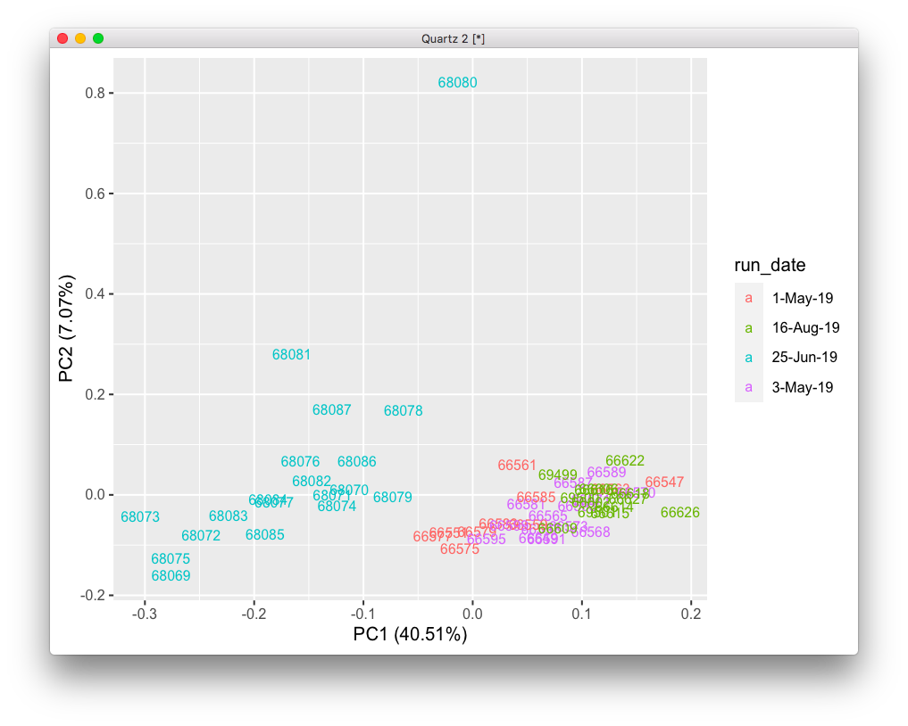
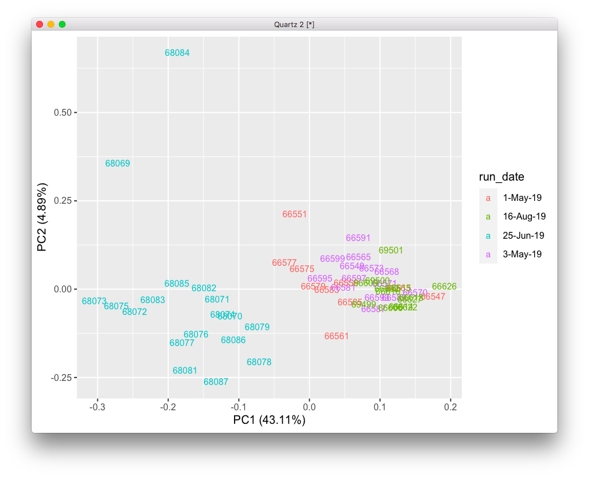
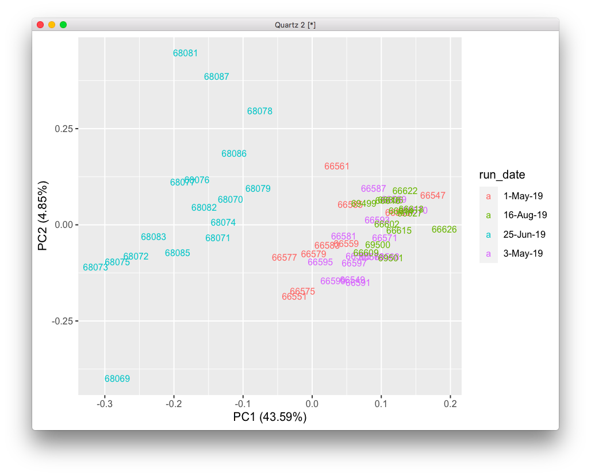
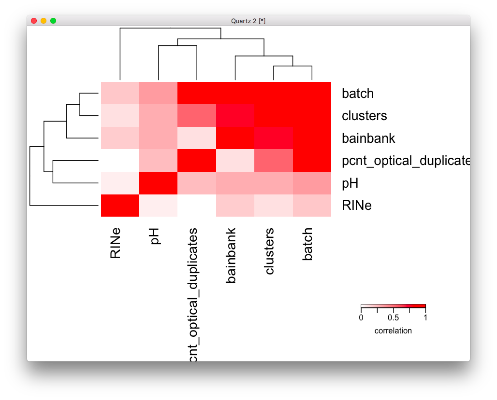
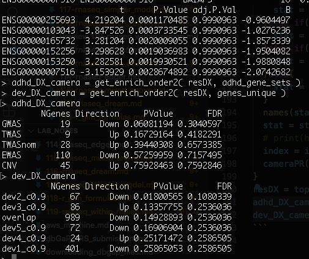

# 2020-06-19 16:45:34

I'll give another shot at the RNAseq analysis within region, just so we can be a
bit more similar to what Alex did. I'll also play a bit with population
variables, and even try to fit in the sex variables. Let's to it all at once at
first, then we remove all these changes bit by bit.

```r
myregion = 'ACC'
data = readRDS('~/data/rnaseq_derek/complete_rawCountData_05132020.rds')
data = data[data$Region==myregion, ]
rownames(data) = data$submitted_name  # just to ensure compatibility later
grex_vars = colnames(data)[grepl(colnames(data), pattern='^ENS')]
count_matrix = t(data[, grex_vars])
# remove that weird .num after ENSG
id_num = sapply(grex_vars, function(x) strsplit(x=x, split='\\.')[[1]][1])
rownames(count_matrix) = id_num
dups = duplicated(id_num)
id_num = id_num[!dups]
count_matrix = count_matrix[!dups, ]

library('biomaRt')
mart <- useDataset("hsapiens_gene_ensembl", useMart("ensembl"))
G_list0 <- getBM(filters= "ensembl_gene_id", attributes= c("ensembl_gene_id",
                 "hgnc_symbol", "chromosome_name"),values=id_num,mart= mart)
# remove any genes without a HUGOID
G_list <- G_list0[!is.na(G_list0$hgnc_symbol),]
G_list = G_list[G_list$hgnc_symbol!='',]
# remove genes that appear more than once
G_list <- G_list[!duplicated(G_list$ensembl_gene_id),]
# keep only gene counts for genes that we have information
imnamed = rownames(count_matrix) %in% G_list$ensembl_gene_id
count_matrix = count_matrix[imnamed, ]
# match gene counts to gene info
G_list2 = merge(rownames(count_matrix), G_list, by=1)
colnames(G_list2)[1] = 'ensembl_gene_id'

library('ABAEnrichment')
cutoffs = c(.1, .2, .3, .4, .5, .6, .7, .8, .9)
anno = get_annotated_genes(structure_ids=c('Allen:10277', 'Allen:10278',
                                            'Allen:10333'),
                           dataset='5_stages',
                           cutoff_quantiles=cutoffs)
load('~/data/rnaseq_derek/adhd_genesets_philip.RDATA')
adhd_gene_sets = t2

co = .9
idx = anno$age_category==1 & anno$cutoff==co
genes_overlap = unique(anno[idx, 'anno_gene'])
for (s in 2:5) {
  idx = anno$age_category==s & anno$cutoff==co
  g2 = unique(anno[idx, 'anno_gene'])
  genes_overlap = intersect(genes_overlap, g2)
}
genes_unique = list()
for (s in 1:5) {
  others = setdiff(1:5, s)
  idx = anno$age_category==s & anno$cutoff==co
  g = unique(anno[idx, 'anno_gene'])
  for (s2 in others) {
    idx = anno$age_category==s2 & anno$cutoff==co
    g2 = unique(anno[idx, 'anno_gene'])
    rm_me = g %in% g2
    g = g[!rm_me]
  }
  genes_unique[[sprintf('dev%s_c%.1f', s, co)]] = unique(g)
}
genes_unique[['overlap']] = unique(genes_overlap)

save(data, count_matrix, G_list2, anno, adhd_gene_sets, genes_unique,
     file=sprintf('~/data/rnaseq_derek/compiled_%s_06192020.RData', myregion))
```

Now we can start some real per-region analysis.

# ACC

```r
load('~/data/rnaseq_derek/compiled_ACC_06192020.RData')
library(caret)
set.seed(42)
# remove genes with zero or near zero variance so we can run PCA
pp_order = c('zv')
pp = preProcess(t(count_matrix), method = pp_order)
gene_counts = t(predict(pp, t(count_matrix)))

pca <- prcomp(t(gene_counts), scale=TRUE)
library(ggfortify)
autoplot(pca, data = data, colour = 'run_date', shape = FALSE,
         label=TRUE, label.size = 3)
```



We remove the obvious outlier and see if there is anything there:

```r
rm_me = rownames(data) %in% c('68080')
data = data[!rm_me, ]
gene_counts = gene_counts[, !rm_me]
pp = preProcess(t(gene_counts), method = pp_order)
gene_counts = t(predict(pp, t(gene_counts)))
pca <- prcomp(t(gene_counts), scale=TRUE)
autoplot(pca, data = data, colour = 'run_date', shape = FALSE,
         label=TRUE, label.size = 3)
```



Still a couple outliers I'm not too comfortable with.

```r
rm_me = rownames(data) %in% c('68084')
data = data[!rm_me, ]
gene_counts = gene_counts[, !rm_me]
pp = preProcess(t(gene_counts), method = pp_order)
gene_counts = t(predict(pp, t(gene_counts)))
pca <- prcomp(t(gene_counts), scale=TRUE)
autoplot(pca, data = data, colour = 'run_date', shape = FALSE,
         label=TRUE, label.size = 3)
```



I just removed one though... now it's debatable whether they're outliers or not,
so I'll just keep them as is.

But with the first PC taking over 40% of the data, batch is driving everything.

```r
library(variancePartition)
data$batch = factor(as.numeric(data$run_date))
form <- ~ batch + RINe + bainbank + pH + pcnt_optical_duplicates + clusters
C = canCorPairs( form, data)
plotCorrMatrix( C )
```



batch and brain_bank are highly colinear. So, let's just use batch, and then add
RINe and pH to the model. Let's now see how well the variance is explained by
our variables:

```r
data[data$Manner.of.Death=='Suicide (probable)', 'Manner.of.Death'] = 'Suicide'
data[data$Manner.of.Death=='unknown', 'Manner.of.Death'] = 'natural'
data$MoD = factor(data$Manner.of.Death)

pp = preProcess(t(gene_counts), method = c('zv', 'nzv'))
gene_counts = t(predict(pp, t(gene_counts)))
library(edgeR)
isexpr = rowSums(cpm(gene_counts)>1) >= 0.1*ncol(gene_counts)
gene_counts = gene_counts[isexpr,]
G_list3 = merge(rownames(gene_counts), G_list2, by=1)
colnames(G_list3)[1] = 'ensembl_gene_id'

# Standard usage of limma/voom
genes = DGEList( gene_counts, genes=G_list3 ) 
genes = calcNormFactors( genes)
data$Individual = factor(data$hbcc_brain_id)

design = model.matrix( ~ batch , data)
vobj = voom( genes, design, plot=FALSE)

# categorical variables need to be modeled as fixed
form = ~ (1|batch) + (1|Sex) + (1|MoD) + scale(RINe) + scale(PMI) + scale(Age) + scale(C1) + scale(C2) + scale(C3)
vp = fitExtractVarPartModel( vobj, form, data)
plotVarPart( sortCols( vp ) ) 
```

Now, the main model would just be:

```r
# we need to lose another subject here because they didn't have population PC
idx = !is.na(data$C1)
form =  ~ 0 + Diagnosis + Sex + MoD + RINe + PMI + Age + C1 + C2 + C3
design = model.matrix(form, data[idx, ])
fit <- lmFit(vobj[, idx], design)
contr <- makeContrasts(DiagnosisCase - DiagnosisControl,
                       levels = colnames(coef(fit)))
fitDiag = contrasts.fit( fit, contr )
fitDiag <- eBayes( fitDupCor )

get_enrich_order2 = function( res, gene_sets ){
  if( !is.null(res$z.std) ){
    stat = res$z.std
  }else if( !is.null(res$F.std) ){
    stat = res$F.std
  }else if( !is.null(res$t) ){
    stat = res$t
  }else{
    stat = res$F
  }
  names(stat) = res$hgnc_symbol
  stat = stat[!is.na(names(stat))]
  # print(head(stat))
  index = ids2indices(gene_sets, names(stat))
  cameraPR( stat, index )
}
resDX = topTable(fitDiag, number=Inf) 
adhd_DX_camera = get_enrich_order2( resDX, adhd_gene_sets ) 
dev_DX_camera = get_enrich_order2( resDX, genes_unique ) 
```



Wow, results totally go away... well, let's go back to our old results and just
run the stuff we know to work.