# 2020-06-19 19:40:01

Running a few more things that might improve the RNAseq results, after the
meeting with the other people in the project.

First, let's add some population PCs, or try the WNH only.

```r
data = readRDS('~/data/rnaseq_derek/complete_rawCountData_05132020.rds')
rownames(data) = data$submitted_name  # just to ensure compatibility later
grex_vars = colnames(data)[grepl(colnames(data), pattern='^ENS')]
count_matrix = t(data[, grex_vars])
# data matrix goes on a diet...
data = data[, !grepl(colnames(data), pattern='^ENS')]
# remove that weird .num after ENSG
id_num = sapply(grex_vars, function(x) strsplit(x=x, split='\\.')[[1]][1])
rownames(count_matrix) = id_num
dups = duplicated(id_num)
id_num = id_num[!dups]
count_matrix = count_matrix[!dups, ]

library('biomaRt')
mart <- useDataset("hsapiens_gene_ensembl", useMart("ensembl"))
G_list0 <- getBM(filters= "ensembl_gene_id", attributes= c("ensembl_gene_id",
                 "hgnc_symbol", "chromosome_name"),values=id_num,mart= mart)
# remove any genes without a HUGOID
G_list <- G_list0[!is.na(G_list0$hgnc_symbol),]
G_list = G_list[G_list$hgnc_symbol!='',]
# remove genes that appear more than once
G_list <- G_list[!duplicated(G_list$ensembl_gene_id),]
# keep only gene counts for genes that we have information
imnamed = rownames(count_matrix) %in% G_list$ensembl_gene_id
count_matrix = count_matrix[imnamed, ]

library(caret)
set.seed(42)
# remove genes with zero or near zero variance so we can run PCA
pp_order = c('zv')
pp = preProcess(t(count_matrix), method = pp_order)
count_matrix = t(predict(pp, t(count_matrix)))

# checking for outliers across regions
pca <- prcomp(t(count_matrix), scale=TRUE)
library(ggfortify)
autoplot(pca, data = data, colour = 'run_date', shape = 'Region',
         label=FALSE, label.size = 3)
```


That green dot in the middle of the Caudate cloud is our usual 68080. I could
do some investigative work to see if it was somehow miscoded, and it whould
actually be a Caudate sample. That subject already has a Caudate sample
though... for now I'll just drop it, because if our results break because of a
single dot, well, not good.

```r
rm_me = rownames(data) %in% c('68080')
data = data[!rm_me, ]
count_matrix = count_matrix[, !rm_me]
```

Let's re-run out matrix of technical artifact correlations, now using the entire
dataset:

```r
library(variancePartition)
data$batch = factor(as.numeric(data$run_date))
form <- ~ batch + RINe + bainbank + pH + pcnt_optical_duplicates + clusters
C = canCorPairs( form, data)
plotCorrMatrix( C )
```

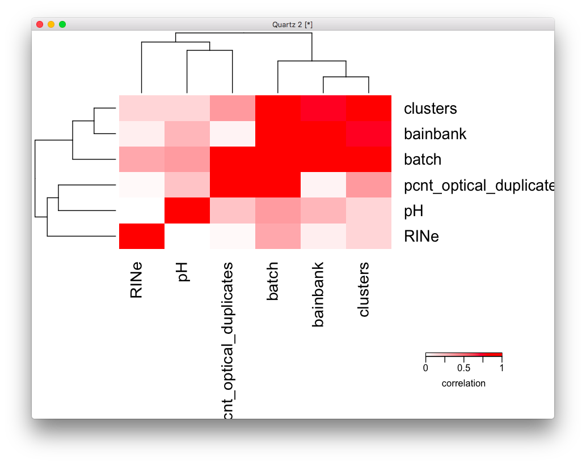

Like before, if we add batch then we only need pH and RINe. But I'm missing pH
for 45 out of 113, so I cannot impute that. I'll drop it.

Going back to the model:

```r
library(caret)
set.seed(42)
# remove genes with zero or near zero variance so we can run PCA
pp_order = c('zv', 'nzv')
pp = preProcess(t(count_matrix), method = pp_order)
X = predict(pp, t(count_matrix))
geneCounts = t(X)

# match gene counts to gene info
G_list2 = merge(rownames(geneCounts), G_list, by=1)
colnames(G_list2)[1] = 'ensembl_gene_id'

library(edgeR)
isexpr = rowSums(cpm(geneCounts)>1) >= 0.1*ncol(geneCounts)

# Standard usage of limma/voom
genes = DGEList( geneCounts[isexpr,], genes=G_list2[isexpr,] ) 
genes = calcNormFactors( genes)
data$Individual = factor(data$hbcc_brain_id)
data[data$Manner.of.Death=='Suicide (probable)', 'Manner.of.Death'] = 'Suicide'
data[data$Manner.of.Death=='unknown', 'Manner.of.Death'] = 'natural'
data$MoD = factor(data$Manner.of.Death)

design = model.matrix( ~ Region + batch , data)
vobj_tmp = voom( genes, design, plot=FALSE)
dupcor <- duplicateCorrelation(vobj_tmp,design,block=data$Individual)
vobj = voom( genes, design, plot=FALSE, block=data$Individual,
             correlation=dupcor$consensus)
# we need to lose another subject here because they didn't have population PC
idx = !is.na(data$C1)
form =  ~ 0 + Region + Region:Diagnosis + batch + Sex + RINe + PMI + Age + MoD + C1 + C2 + C3
design = model.matrix(form, data[idx, ])
dupcor <- duplicateCorrelation(vobj[, idx], design, block=data[idx,]$Individual)
fit <- lmFit(vobj[, idx], design, block=data[idx,]$Individual,
             correlation=dupcor$consensus)

Lc = matrix(0, ncol=ncol(design))
colnames(Lc) = colnames(design)
# make the 2 contrast terms positive
Lc[length(Lc):(length(Lc)-1)] = 1
fitDupCor = contrasts.fit( fit, t(Lc))
fitDupCor <- eBayes( fitDupCor )

get_enrich_order2 = function( res, gene_sets ){
  if( !is.null(res$z.std) ){
    stat = res$z.std
  }else if( !is.null(res$F.std) ){
    stat = res$F.std
  }else if( !is.null(res$t) ){
    stat = res$t
  }else{
    stat = res$F
  }
  names(stat) = res$hgnc_symbol
  stat = stat[!is.na(names(stat))]
  # print(head(stat))
  index = ids2indices(gene_sets, names(stat))
  cameraPR( stat, index )
}
load('~/data/rnaseq_derek/adhd_genesets_philip.RDATA')

resDC = topTable(fitDupCor, number=Inf) 
adhd_dupCor_camera = get_enrich_order2( resDC, t2 ) 
```

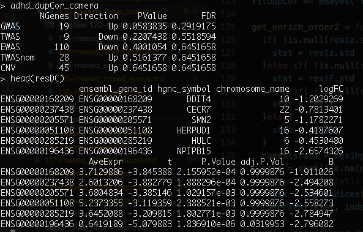

Again, no results. It could be MoD or maybe somehow the sex genes are screwing
up the results? Or the population PCs? Let's remove the sex chromosomes first:

```r
imautosome = which(G_list2$chromosome_name != 'X' &
                   G_list2$chromosome_name != 'Y' &
                   G_list2$chromosome_name != 'MT')
geneCounts = geneCounts[imautosome, ]
G_list2 = G_list2[imautosome, ]

isexpr = rowSums(cpm(geneCounts)>1) >= 0.1*ncol(geneCounts)

genes = DGEList( geneCounts[isexpr,], genes=G_list2[isexpr,] ) 
genes = calcNormFactors( genes)

design = model.matrix( ~ Region + batch , data)
vobj_tmp = voom( genes, design, plot=FALSE)
dupcor <- duplicateCorrelation(vobj_tmp,design,block=data$Individual)
vobj = voom( genes, design, plot=FALSE, block=data$Individual,
             correlation=dupcor$consensus)
idx = !is.na(data$C1)
form =  ~ 0 + Region + Region:Diagnosis + batch + Sex + RINe + PMI + Age + MoD + C1 + C2 + C3
design = model.matrix(form, data[idx, ])
dupcor <- duplicateCorrelation(vobj[, idx], design, block=data[idx,]$Individual)
fit <- lmFit(vobj[, idx], design, block=data[idx,]$Individual,
             correlation=dupcor$consensus)
Lc = matrix(0, ncol=ncol(design))
colnames(Lc) = colnames(design)
# make the 2 contrast terms positive
Lc[length(Lc):(length(Lc)-1)] = 1
fitDupCor = contrasts.fit( fit, t(Lc))
fitDupCor <- eBayes( fitDupCor )

resDC = topTable(fitDupCor, number=Inf) 
adhd_dupCor_camera = get_enrich_order2( resDC, t2 ) 
```

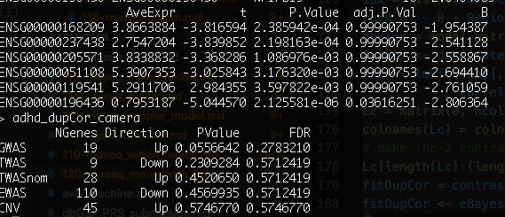

Still nothing... let me see if it's something with the population PCs:

```r
form =  ~ 0 + Region + Region:Diagnosis + batch + Sex + RINe + PMI + Age + MoD
design = model.matrix(form, data[idx, ])
dupcor <- duplicateCorrelation(vobj[, idx], design, block=data[idx,]$Individual)
fit <- lmFit(vobj[, idx], design, block=data[idx,]$Individual,
             correlation=dupcor$consensus)
Lc = matrix(0, ncol=ncol(design))
colnames(Lc) = colnames(design)
# make the 2 contrast terms positive
Lc[length(Lc):(length(Lc)-1)] = 1
fitDupCor = contrasts.fit( fit, t(Lc))
fitDupCor <- eBayes( fitDupCor )

resDC = topTable(fitDupCor, number=Inf) 
adhd_dupCor_camera = get_enrich_order2( resDC, t2 ) 
```

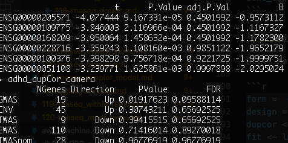

Yeah, apparently the population PCs wipe out the results... well, what if we run
just the WNH samples?

```r
library(ggplot2)
ggplot(data, aes(x=C1, y=C2, col=POP_CODE)) + geom_point()
```

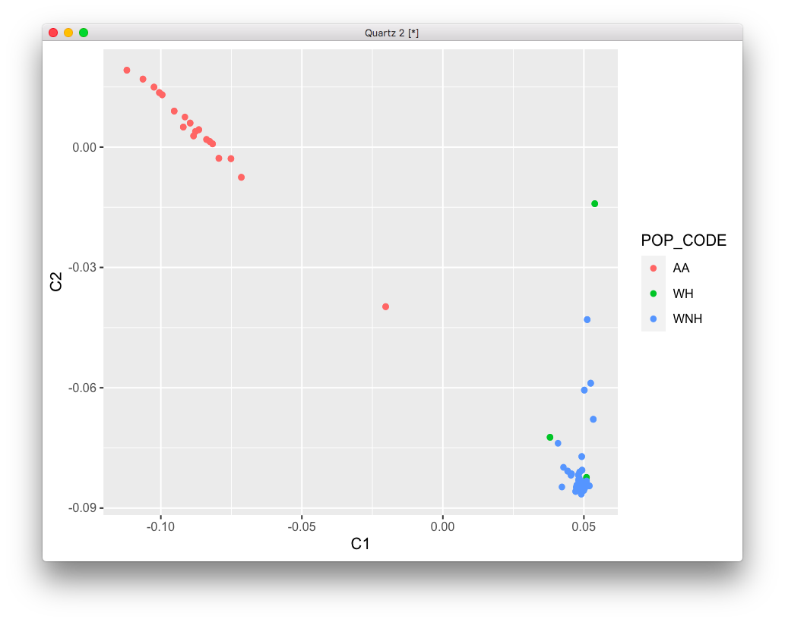

So I'll use the same thresholds as before:

```r
imWNH = which(data$C1 > 0 & data$C2 < -.075)
set.seed(42)
# remove genes with zero or near zero variance so we can run PCA
pp_order = c('zv', 'nzv')
pp = preProcess(t(count_matrix[, imWNH]), method = pp_order)
X = predict(pp, t(count_matrix[, imWNH]))
geneCounts = t(X)

# match gene counts to gene info
G_list2 = merge(rownames(geneCounts), G_list, by=1)
colnames(G_list2)[1] = 'ensembl_gene_id'

library(edgeR)
isexpr = rowSums(cpm(geneCounts)>1) >= 0.1*ncol(geneCounts)

# Standard usage of limma/voom
genes = DGEList( geneCounts[isexpr,], genes=G_list2[isexpr,] ) 
genes = calcNormFactors( genes)

design = model.matrix( ~ Region + batch , data[imWNH, ])
vobj_tmp = voom( genes, design, plot=FALSE)
dupcor <- duplicateCorrelation(vobj_tmp,design,block=data[imWNH,]$Individual)
vobj = voom( genes, design, plot=FALSE, block=data[imWNH,]$Individual,
             correlation=dupcor$consensus)
form =  ~ 0 + Region + Region:Diagnosis + batch + Sex + RINe + PMI + Age + MoD
design = model.matrix(form, data[imWNH, ])
dupcor <- duplicateCorrelation(vobj, design, block=data[imWNH,]$Individual)
fit <- lmFit(vobj, design, block=data[imWNH,]$Individual,
             correlation=dupcor$consensus)

Lc = matrix(0, ncol=ncol(design))
colnames(Lc) = colnames(design)
# make the 2 contrast terms positive
Lc[length(Lc):(length(Lc)-1)] = 1
fitDupCor = contrasts.fit( fit, t(Lc))
fitDupCor <- eBayes( fitDupCor )

resDC = topTable(fitDupCor, number=Inf) 
adhd_dupCor_camera = get_enrich_order2( resDC, t2 ) 
```

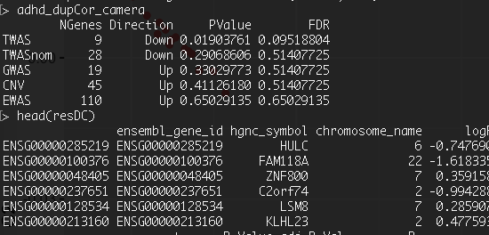

Now I get results for TWAS? That's weird. Let's try using the self-reported
race/ethn.

```r
data = readRDS('~/data/rnaseq_derek/complete_rawCountData_05132020.rds')
rownames(data) = data$submitted_name  # just to ensure compatibility later
rm_me = rownames(data) %in% c('68080')
data = data[!rm_me, ]
grex_vars = colnames(data)[grepl(colnames(data), pattern='^ENS')]
count_matrix = t(data[, grex_vars])
# data matrix goes on a diet...
data = data[, !grepl(colnames(data), pattern='^ENS')]
# remove that weird .num after ENSG
id_num = sapply(grex_vars, function(x) strsplit(x=x, split='\\.')[[1]][1])
rownames(count_matrix) = id_num
dups = duplicated(id_num)
id_num = id_num[!dups]
count_matrix = count_matrix[!dups, ]

library('biomaRt')
mart <- useDataset("hsapiens_gene_ensembl", useMart("ensembl"))
G_list0 <- getBM(filters= "ensembl_gene_id", attributes= c("ensembl_gene_id",
                 "hgnc_symbol", "chromosome_name"),values=id_num,mart= mart)
# remove any genes without a HUGOID
G_list <- G_list0[!is.na(G_list0$hgnc_symbol),]
G_list = G_list[G_list$hgnc_symbol!='',]
# remove genes that appear more than once
G_list <- G_list[!duplicated(G_list$ensembl_gene_id),]
# keep only gene counts for genes that we have information
imnamed = rownames(count_matrix) %in% G_list$ensembl_gene_id
count_matrix = count_matrix[imnamed, ]

# some data variables modifications
data$POP_CODE = as.character(data$POP_CODE)
data[data$POP_CODE=='WNH', 'POP_CODE'] = 'W'
data[data$POP_CODE=='WH', 'POP_CODE'] = 'W'
data$POP_CODE = factor(data$POP_CODE)
data$Individual = factor(data$hbcc_brain_id)
data[data$Manner.of.Death=='Suicide (probable)', 'Manner.of.Death'] = 'Suicide'
data[data$Manner.of.Death=='unknown', 'Manner.of.Death'] = 'natural'
data$MoD = factor(data$Manner.of.Death)
data$batch = factor(as.numeric(data$run_date))

library(caret)
set.seed(42)
# remove genes with zero or near zero variance so we can run PCA
pp_order = c('zv', 'nzv')
pp = preProcess(t(count_matrix), method = pp_order)
X = predict(pp, t(count_matrix))
geneCounts = t(X)

# match gene counts to gene info
G_list2 = merge(rownames(geneCounts), G_list, by=1)
colnames(G_list2)[1] = 'ensembl_gene_id'

library(edgeR)
isexpr = rowSums(cpm(geneCounts)>1) >= 0.1*ncol(geneCounts)

# Standard usage of limma/voom
genes = DGEList( geneCounts[isexpr,], genes=G_list2[isexpr,] ) 
genes = calcNormFactors( genes)

design = model.matrix( ~ Region + batch , data)
vobj_tmp = voom( genes, design, plot=FALSE)
dupcor <- duplicateCorrelation(vobj_tmp,design,block=data$Individual)
vobj = voom( genes, design, plot=FALSE, block=data$Individual,
             correlation=dupcor$consensus)
form =  ~ 0 + Region + Region:Diagnosis + batch + Sex + RINe + PMI + Age #+ MoD
design = model.matrix(form, data)
dupcor <- duplicateCorrelation(vobj, design, block=data$Individual)
fit <- lmFit(vobj, design, block=data$Individual,
             correlation=dupcor$consensus)

Lc = matrix(0, ncol=ncol(design))
colnames(Lc) = colnames(design)
# make the 2 contrast terms positive
Lc[length(Lc):(length(Lc)-1)] = 1
fitDupCor = contrasts.fit( fit, t(Lc))
fitDupCor <- eBayes( fitDupCor )

resDC = topTable(fitDupCor, number=Inf) 
adhd_dupCor_camera = get_enrich_order2( resDC, t2 ) 
```

I first tested running the model without MoD first, so the only difference to the
results I reported before were the sex genes:

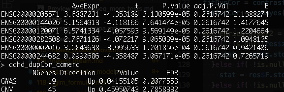

These results were actually a bit worse, meaning that we should probably leave
the sex genes out.

```r
imautosome = which(G_list2$chromosome_name != 'X' &
                   G_list2$chromosome_name != 'Y' &
                   G_list2$chromosome_name != 'MT')
geneCounts = geneCounts[imautosome, ]
G_list2 = G_list2[imautosome, ]
G_list2 = merge(rownames(geneCounts), G_list, by=1)
colnames(G_list2)[1] = 'ensembl_gene_id'

isexpr = rowSums(cpm(geneCounts)>1) >= 0.1*ncol(geneCounts)

# Standard usage of limma/voom
genes = DGEList( geneCounts[isexpr,], genes=G_list2[isexpr,] ) 
genes = calcNormFactors( genes)
design = model.matrix( ~ Region + batch , data)
vobj_tmp = voom( genes, design, plot=FALSE)
dupcor <- duplicateCorrelation(vobj_tmp,design,block=data$Individual)
vobj = voom( genes, design, plot=FALSE, block=data$Individual,
             correlation=dupcor$consensus)
form =  ~ 0 + Region + Region:Diagnosis + batch + Sex + RINe + PMI + Age + MoD
design = model.matrix(form, data)
dupcor <- duplicateCorrelation(vobj, design, block=data$Individual)
fit <- lmFit(vobj, design, block=data$Individual,
             correlation=dupcor$consensus)

Lc = matrix(0, ncol=ncol(design))
colnames(Lc) = colnames(design)
# make the 2 contrast terms positive
Lc[length(Lc):(length(Lc)-1)] = 1
fitDupCor = contrasts.fit( fit, t(Lc))
fitDupCor <- eBayes( fitDupCor )

resDC = topTable(fitDupCor, number=Inf) 
adhd_dupCor_camera = get_enrich_order2( resDC, t2 ) 
```

Going back to autosomes only I get the same result as before, which is
reassuring. When I add in MoD to the model, I get:

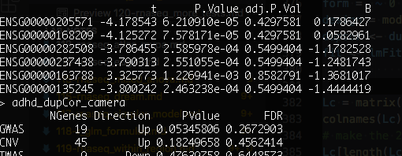

So, not really helping. Let's see what's the impact of POP_CODE without MoD
first:

# 2020-06-20 09:39:05

```r
form =  ~ 0 + Region + Region:Diagnosis + batch + Sex + RINe + PMI + Age + POP_CODE
design = model.matrix(form, data)
dupcor <- duplicateCorrelation(vobj, design, block=data$Individual)
fit <- lmFit(vobj, design, block=data$Individual,
             correlation=dupcor$consensus)

Lc = matrix(0, ncol=ncol(design))
colnames(Lc) = colnames(design)
# make the 2 contrast terms positive
Lc[length(Lc):(length(Lc)-1)] = 1
fitDupCor = contrasts.fit( fit, t(Lc))
fitDupCor <- eBayes( fitDupCor )

resDC = topTable(fitDupCor, number=Inf) 
adhd_dupCor_camera = get_enrich_order2( resDC, t2 ) 
```

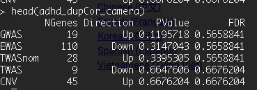

That completely wipes off the GWAS results.

What if I use the same design for zoom and fit?

```r
form =  ~ 0 + Region + Region:Diagnosis + batch + Sex + RINe + PMI + Age + POP_CODE
design = model.matrix( form , data)
vobj_tmp = voom( genes, design, plot=FALSE)
dupcor <- duplicateCorrelation(vobj_tmp,design,block=data$Individual)
vobj = voom( genes, design, plot=FALSE, block=data$Individual,
             correlation=dupcor$consensus)
fit <- lmFit(vobj, design, block=data$Individual,
             correlation=dupcor$consensus)
Lc = matrix(0, ncol=ncol(design))
colnames(Lc) = colnames(design)
Lc[length(Lc):(length(Lc)-1)] = 1
fitDupCor = contrasts.fit( fit, t(Lc))
fitDupCor <- eBayes( fitDupCor )
resDC = topTable(fitDupCor, number=Inf) 
adhd_dupCor_camera = get_enrich_order2( resDC, t2 ) 
```

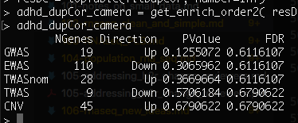

Still nothing... this is getting annoying. The main issue is that I don't know
if results are going away because the model is getting too complex, or because
my initial results were really explained by population. Let's do a CCA in our
subject-based covariates and check the variance plot. Maybe we can decide on
some threshold of what to use based on that, instead of doing this highly
complex model?

```r
library(variancePartition)
form <- ~ Region + Diagnosis + Sex + RINe + PMI + Age + POP_CODE + C1 + C2 + C3 + MoD
C = canCorPairs( form, data)
plotCorrMatrix( C )
```

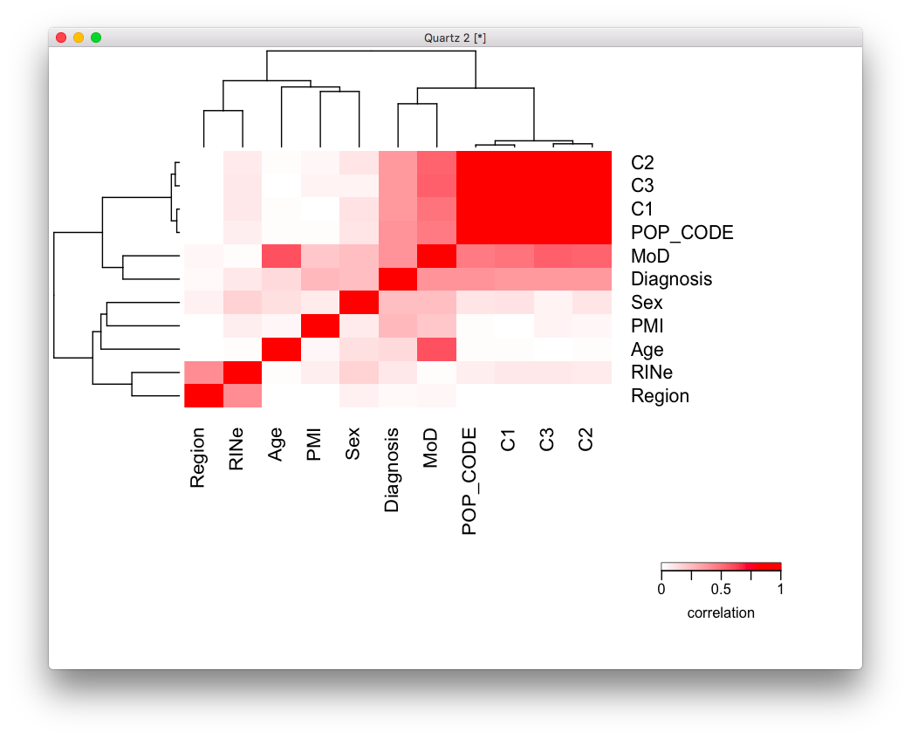

So, we have the obvious result of the components highly correlated with
POP_CODE, and also with Diagnosis, which explains why it'd be taking away from
our initial result. RIN also seems to vary with Region. Diagnosis also seems
somewhat related to sex and PMI. MoD also correlated with age...

So, let's run our variance plot and see what we get:

```r
library(BiocParallel)
param = SnowParam(2, "SOCK", progressbar=TRUE)
register(param)

design = model.matrix( ~ Region + batch , data)
vobj_tmp = voom( genes, design, plot=FALSE)
dupcor <- duplicateCorrelation(vobj_tmp,design,block=data$Individual)
vobj = voom( genes, design, plot=FALSE, block=data$Individual,
             correlation=dupcor$consensus)

form = ~ (1|Region:Diagnosis) + (1|Individual) + (1|batch) + (1|Region) + (1|Sex) + RINe + PMI + Age + (1|POP_CODE) + (1|MoD)
vp = fitExtractVarPartModel( vobj, form, data)
plotVarPart( sortCols( vp ) ) 
```

For future reference, this is th one paper about population structure I always
remember:

https://journals.plos.org/plosgenetics/article?id=10.1371/journal.pgen.1007841


# TODO
* try Gabriel's dream code again? Maybe fixing race, or do it inside Region? should
  run faster now with slim data?
* Or try Gabriel's dream on WNH only?
* PCA analysis from Alex to try to recover the results?
* What's the impact of 'comorbid_group' and 'substance_group'?

