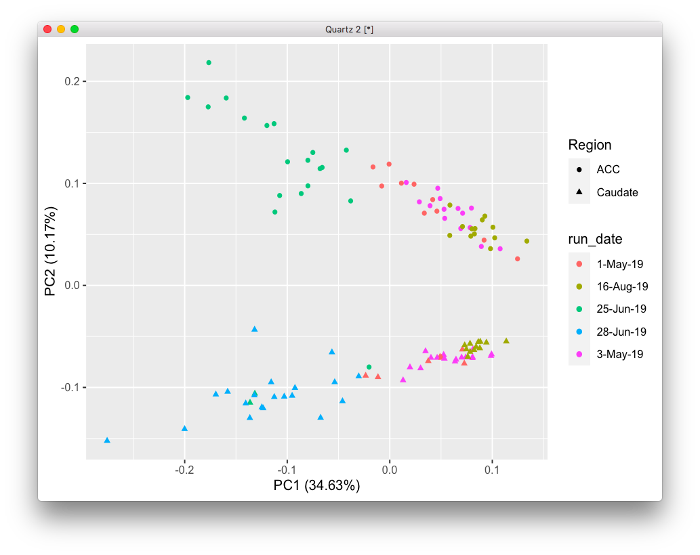
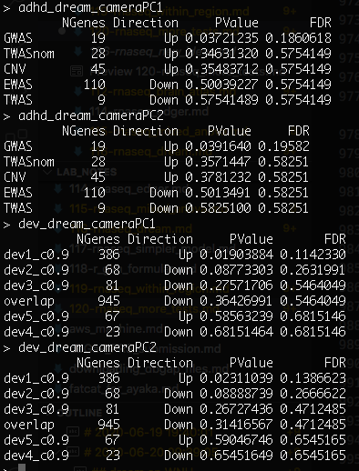

# 2020-06-19 19:40:01

Running a few more things that might improve the RNAseq results, after the
meeting with the other people in the project.

First, let's add some population PCs, or try the WNH only.

```r
data = readRDS('~/data/rnaseq_derek/complete_rawCountData_05132020.rds')
rownames(data) = data$submitted_name  # just to ensure compatibility later
grex_vars = colnames(data)[grepl(colnames(data), pattern='^ENS')]
count_matrix = t(data[, grex_vars])
# data matrix goes on a diet...
data = data[, !grepl(colnames(data), pattern='^ENS')]
# remove that weird .num after ENSG
id_num = sapply(grex_vars, function(x) strsplit(x=x, split='\\.')[[1]][1])
rownames(count_matrix) = id_num
dups = duplicated(id_num)
id_num = id_num[!dups]
count_matrix = count_matrix[!dups, ]

library('biomaRt')
mart <- useDataset("hsapiens_gene_ensembl", useMart("ensembl"))
G_list0 <- getBM(filters= "ensembl_gene_id", attributes= c("ensembl_gene_id",
                 "hgnc_symbol", "chromosome_name"),values=id_num,mart= mart)
# remove any genes without a HUGOID
G_list <- G_list0[!is.na(G_list0$hgnc_symbol),]
G_list = G_list[G_list$hgnc_symbol!='',]
# remove genes that appear more than once
G_list <- G_list[!duplicated(G_list$ensembl_gene_id),]
# keep only gene counts for genes that we have information
imnamed = rownames(count_matrix) %in% G_list$ensembl_gene_id
count_matrix = count_matrix[imnamed, ]

library(caret)
set.seed(42)
# remove genes with zero or near zero variance so we can run PCA
pp_order = c('zv')
pp = preProcess(t(count_matrix), method = pp_order)
count_matrix = t(predict(pp, t(count_matrix)))

# checking for outliers across regions
pca <- prcomp(t(count_matrix), scale=TRUE)
library(ggfortify)
autoplot(pca, data = data, colour = 'run_date', shape = 'Region',
         label=FALSE, label.size = 3)
```



That green dot in the middle of the Caudate cloud is our usual 68080. I could
do some investigative work to see if it was somehow miscoded, and it whould
actually be a Caudate sample. That subject already has a Caudate sample
though... for now I'll just drop it, because if our results break because of a
single dot, well, not good.

```r
rm_me = rownames(data) %in% c('68080')
data = data[!rm_me, ]
count_matrix = count_matrix[, !rm_me]
```

Let's re-run out matrix of technical artifact correlations, now using the entire
dataset:

```r
library(variancePartition)
data$batch = factor(as.numeric(data$run_date))
form <- ~ batch + RINe + bainbank + pH + pcnt_optical_duplicates + clusters
C = canCorPairs( form, data)
plotCorrMatrix( C )
```


Like before, if we add batch then we only need pH and RINe. But I'm missing pH
for 45 out of 113, so I cannot impute that. I'll drop it.

Going back to the model:

```r
library(caret)
set.seed(42)
# remove genes with zero or near zero variance so we can run PCA
pp_order = c('zv', 'nzv')
pp = preProcess(t(count_matrix), method = pp_order)
X = predict(pp, t(count_matrix))
geneCounts = t(X)

# match gene counts to gene info
G_list2 = merge(rownames(geneCounts), G_list, by=1)
colnames(G_list2)[1] = 'ensembl_gene_id'

library(edgeR)
isexpr = rowSums(cpm(geneCounts)>1) >= 0.1*ncol(geneCounts)

# Standard usage of limma/voom
genes = DGEList( geneCounts[isexpr,], genes=G_list2[isexpr,] ) 
genes = calcNormFactors( genes)
data$Individual = factor(data$hbcc_brain_id)
data[data$Manner.of.Death=='Suicide (probable)', 'Manner.of.Death'] = 'Suicide'
data[data$Manner.of.Death=='unknown', 'Manner.of.Death'] = 'natural'
data$MoD = factor(data$Manner.of.Death)

design = model.matrix( ~ Region + batch , data)
vobj_tmp = voom( genes, design, plot=FALSE)
dupcor <- duplicateCorrelation(vobj_tmp,design,block=data$Individual)
vobj = voom( genes, design, plot=FALSE, block=data$Individual,
             correlation=dupcor$consensus)
# we need to lose another subject here because they didn't have population PC
idx = !is.na(data$C1)
form =  ~ 0 + Region + Region:Diagnosis + batch + Sex + RINe + PMI + Age + MoD + C1 + C2 + C3
design = model.matrix(form, data[idx, ])
dupcor <- duplicateCorrelation(vobj[, idx], design, block=data[idx,]$Individual)
fit <- lmFit(vobj[, idx], design, block=data[idx,]$Individual,
             correlation=dupcor$consensus)

Lc = matrix(0, ncol=ncol(design))
colnames(Lc) = colnames(design)
# make the 2 contrast terms positive
Lc[length(Lc):(length(Lc)-1)] = 1
fitDupCor = contrasts.fit( fit, t(Lc))
fitDupCor <- eBayes( fitDupCor )

get_enrich_order2 = function( res, gene_sets ){
  if( !is.null(res$z.std) ){
    stat = res$z.std
  }else if( !is.null(res$F.std) ){
    stat = res$F.std
  }else if( !is.null(res$t) ){
    stat = res$t
  }else{
    stat = res$F
  }
  names(stat) = res$hgnc_symbol
  stat = stat[!is.na(names(stat))]
  # print(head(stat))
  index = ids2indices(gene_sets, names(stat))
  cameraPR( stat, index )
}
load('~/data/rnaseq_derek/adhd_genesets_philip.RDATA')

resDC = topTable(fitDupCor, number=Inf) 
adhd_dupCor_camera = get_enrich_order2( resDC, t2 ) 
```


Again, no results. It could be MoD or maybe somehow the sex genes are screwing
up the results? Or the population PCs? Let's remove the sex chromosomes first:

```r
imautosome = which(G_list2$chromosome_name != 'X' &
                   G_list2$chromosome_name != 'Y' &
                   G_list2$chromosome_name != 'MT')
geneCounts = geneCounts[imautosome, ]
G_list2 = G_list2[imautosome, ]

isexpr = rowSums(cpm(geneCounts)>1) >= 0.1*ncol(geneCounts)

genes = DGEList( geneCounts[isexpr,], genes=G_list2[isexpr,] ) 
genes = calcNormFactors( genes)

design = model.matrix( ~ Region + batch , data)
vobj_tmp = voom( genes, design, plot=FALSE)
dupcor <- duplicateCorrelation(vobj_tmp,design,block=data$Individual)
vobj = voom( genes, design, plot=FALSE, block=data$Individual,
             correlation=dupcor$consensus)
idx = !is.na(data$C1)
form =  ~ 0 + Region + Region:Diagnosis + batch + Sex + RINe + PMI + Age + MoD + C1 + C2 + C3
design = model.matrix(form, data[idx, ])
dupcor <- duplicateCorrelation(vobj[, idx], design, block=data[idx,]$Individual)
fit <- lmFit(vobj[, idx], design, block=data[idx,]$Individual,
             correlation=dupcor$consensus)
Lc = matrix(0, ncol=ncol(design))
colnames(Lc) = colnames(design)
# make the 2 contrast terms positive
Lc[length(Lc):(length(Lc)-1)] = 1
fitDupCor = contrasts.fit( fit, t(Lc))
fitDupCor <- eBayes( fitDupCor )

resDC = topTable(fitDupCor, number=Inf) 
adhd_dupCor_camera = get_enrich_order2( resDC, t2 ) 
```


Still nothing... let me see if it's something with the population PCs:

```r
form =  ~ 0 + Region + Region:Diagnosis + batch + Sex + RINe + PMI + Age + MoD
design = model.matrix(form, data[idx, ])
dupcor <- duplicateCorrelation(vobj[, idx], design, block=data[idx,]$Individual)
fit <- lmFit(vobj[, idx], design, block=data[idx,]$Individual,
             correlation=dupcor$consensus)
Lc = matrix(0, ncol=ncol(design))
colnames(Lc) = colnames(design)
# make the 2 contrast terms positive
Lc[length(Lc):(length(Lc)-1)] = 1
fitDupCor = contrasts.fit( fit, t(Lc))
fitDupCor <- eBayes( fitDupCor )

resDC = topTable(fitDupCor, number=Inf) 
adhd_dupCor_camera = get_enrich_order2( resDC, t2 ) 
```


Yeah, apparently the population PCs wipe out the results... well, what if we run
just the WNH samples?

```r
library(ggplot2)
ggplot(data, aes(x=C1, y=C2, col=POP_CODE)) + geom_point()
```


So I'll use the same thresholds as before:

```r
imWNH = which(data$C1 > 0 & data$C2 < -.075)
set.seed(42)
# remove genes with zero or near zero variance so we can run PCA
pp_order = c('zv', 'nzv')
pp = preProcess(t(count_matrix[, imWNH]), method = pp_order)
X = predict(pp, t(count_matrix[, imWNH]))
geneCounts = t(X)

# match gene counts to gene info
G_list2 = merge(rownames(geneCounts), G_list, by=1)
colnames(G_list2)[1] = 'ensembl_gene_id'

library(edgeR)
isexpr = rowSums(cpm(geneCounts)>1) >= 0.1*ncol(geneCounts)

# Standard usage of limma/voom
genes = DGEList( geneCounts[isexpr,], genes=G_list2[isexpr,] ) 
genes = calcNormFactors( genes)

design = model.matrix( ~ Region + batch , data[imWNH, ])
vobj_tmp = voom( genes, design, plot=FALSE)
dupcor <- duplicateCorrelation(vobj_tmp,design,block=data[imWNH,]$Individual)
vobj = voom( genes, design, plot=FALSE, block=data[imWNH,]$Individual,
             correlation=dupcor$consensus)
form =  ~ 0 + Region + Region:Diagnosis + batch + Sex + RINe + PMI + Age + MoD
design = model.matrix(form, data[imWNH, ])
dupcor <- duplicateCorrelation(vobj, design, block=data[imWNH,]$Individual)
fit <- lmFit(vobj, design, block=data[imWNH,]$Individual,
             correlation=dupcor$consensus)

Lc = matrix(0, ncol=ncol(design))
colnames(Lc) = colnames(design)
# make the 2 contrast terms positive
Lc[length(Lc):(length(Lc)-1)] = 1
fitDupCor = contrasts.fit( fit, t(Lc))
fitDupCor <- eBayes( fitDupCor )

resDC = topTable(fitDupCor, number=Inf) 
adhd_dupCor_camera = get_enrich_order2( resDC, t2 ) 
```


Now I get results for TWAS? That's weird. Let's try using the self-reported
race/ethn.

```r
data = readRDS('~/data/rnaseq_derek/complete_rawCountData_05132020.rds')
rownames(data) = data$submitted_name  # just to ensure compatibility later
rm_me = rownames(data) %in% c('68080')
data = data[!rm_me, ]
grex_vars = colnames(data)[grepl(colnames(data), pattern='^ENS')]
count_matrix = t(data[, grex_vars])
# data matrix goes on a diet...
data = data[, !grepl(colnames(data), pattern='^ENS')]
# remove that weird .num after ENSG
id_num = sapply(grex_vars, function(x) strsplit(x=x, split='\\.')[[1]][1])
rownames(count_matrix) = id_num
dups = duplicated(id_num)
id_num = id_num[!dups]
count_matrix = count_matrix[!dups, ]

library('biomaRt')
mart <- useDataset("hsapiens_gene_ensembl", useMart("ensembl"))
G_list0 <- getBM(filters= "ensembl_gene_id", attributes= c("ensembl_gene_id",
                 "hgnc_symbol", "chromosome_name"),values=id_num,mart= mart)
# remove any genes without a HUGOID
G_list <- G_list0[!is.na(G_list0$hgnc_symbol),]
G_list = G_list[G_list$hgnc_symbol!='',]
# remove genes that appear more than once
G_list <- G_list[!duplicated(G_list$ensembl_gene_id),]
# keep only gene counts for genes that we have information
imnamed = rownames(count_matrix) %in% G_list$ensembl_gene_id
count_matrix = count_matrix[imnamed, ]

# some data variables modifications
data$POP_CODE = as.character(data$POP_CODE)
data[data$POP_CODE=='WNH', 'POP_CODE'] = 'W'
data[data$POP_CODE=='WH', 'POP_CODE'] = 'W'
data$POP_CODE = factor(data$POP_CODE)
data$Individual = factor(data$hbcc_brain_id)
data[data$Manner.of.Death=='Suicide (probable)', 'Manner.of.Death'] = 'Suicide'
data[data$Manner.of.Death=='unknown', 'Manner.of.Death'] = 'natural'
data$MoD = factor(data$Manner.of.Death)
data$batch = factor(as.numeric(data$run_date))

library(caret)
set.seed(42)
# remove genes with zero or near zero variance so we can run PCA
pp_order = c('zv', 'nzv')
pp = preProcess(t(count_matrix), method = pp_order)
X = predict(pp, t(count_matrix))
geneCounts = t(X)

# match gene counts to gene info
G_list2 = merge(rownames(geneCounts), G_list, by=1)
colnames(G_list2)[1] = 'ensembl_gene_id'

library(edgeR)
isexpr = rowSums(cpm(geneCounts)>1) >= 0.1*ncol(geneCounts)

# Standard usage of limma/voom
genes = DGEList( geneCounts[isexpr,], genes=G_list2[isexpr,] ) 
genes = calcNormFactors( genes)

design = model.matrix( ~ Region + batch , data)
vobj_tmp = voom( genes, design, plot=FALSE)
dupcor <- duplicateCorrelation(vobj_tmp,design,block=data$Individual)
vobj = voom( genes, design, plot=FALSE, block=data$Individual,
             correlation=dupcor$consensus)
form =  ~ 0 + Region + Region:Diagnosis + batch + Sex + RINe + PMI + Age #+ MoD
design = model.matrix(form, data)
dupcor <- duplicateCorrelation(vobj, design, block=data$Individual)
fit <- lmFit(vobj, design, block=data$Individual,
             correlation=dupcor$consensus)

Lc = matrix(0, ncol=ncol(design))
colnames(Lc) = colnames(design)
# make the 2 contrast terms positive
Lc[length(Lc):(length(Lc)-1)] = 1
fitDupCor = contrasts.fit( fit, t(Lc))
fitDupCor <- eBayes( fitDupCor )

resDC = topTable(fitDupCor, number=Inf) 
adhd_dupCor_camera = get_enrich_order2( resDC, t2 ) 
```

I first tested running the model without MoD first, so the only difference to the
results I reported before were the sex genes:


These results were actually a bit worse, meaning that we should probably leave
the sex genes out.

```r
imautosome = which(G_list2$chromosome_name != 'X' &
                   G_list2$chromosome_name != 'Y' &
                   G_list2$chromosome_name != 'MT')
geneCounts = geneCounts[imautosome, ]
G_list2 = G_list2[imautosome, ]
G_list2 = merge(rownames(geneCounts), G_list, by=1)
colnames(G_list2)[1] = 'ensembl_gene_id'

isexpr = rowSums(cpm(geneCounts)>1) >= 0.1*ncol(geneCounts)

# Standard usage of limma/voom
genes = DGEList( geneCounts[isexpr,], genes=G_list2[isexpr,] ) 
genes = calcNormFactors( genes)
design = model.matrix( ~ Region + batch , data)
vobj_tmp = voom( genes, design, plot=FALSE)
dupcor <- duplicateCorrelation(vobj_tmp,design,block=data$Individual)
vobj = voom( genes, design, plot=FALSE, block=data$Individual,
             correlation=dupcor$consensus)
form =  ~ 0 + Region + Region:Diagnosis + batch + Sex + RINe + PMI + Age + MoD
design = model.matrix(form, data)
dupcor <- duplicateCorrelation(vobj, design, block=data$Individual)
fit <- lmFit(vobj, design, block=data$Individual,
             correlation=dupcor$consensus)

Lc = matrix(0, ncol=ncol(design))
colnames(Lc) = colnames(design)
# make the 2 contrast terms positive
Lc[length(Lc):(length(Lc)-1)] = 1
fitDupCor = contrasts.fit( fit, t(Lc))
fitDupCor <- eBayes( fitDupCor )

resDC = topTable(fitDupCor, number=Inf) 
adhd_dupCor_camera = get_enrich_order2( resDC, t2 ) 
```

Going back to autosomes only I get the same result as before, which is
reassuring. When I add in MoD to the model, I get:


So, not really helping. Let's see what's the impact of POP_CODE without MoD
first:

# 2020-06-20 09:39:05

```r
form =  ~ 0 + Region + Region:Diagnosis + batch + Sex + RINe + PMI + Age + POP_CODE
design = model.matrix(form, data)
dupcor <- duplicateCorrelation(vobj, design, block=data$Individual)
fit <- lmFit(vobj, design, block=data$Individual,
             correlation=dupcor$consensus)

Lc = matrix(0, ncol=ncol(design))
colnames(Lc) = colnames(design)
# make the 2 contrast terms positive
Lc[length(Lc):(length(Lc)-1)] = 1
fitDupCor = contrasts.fit( fit, t(Lc))
fitDupCor <- eBayes( fitDupCor )

resDC = topTable(fitDupCor, number=Inf) 
adhd_dupCor_camera = get_enrich_order2( resDC, t2 ) 
```


That completely wipes off the GWAS results.

What if I use the same design for zoom and fit?

```r
form =  ~ 0 + Region + Region:Diagnosis + batch + Sex + RINe + PMI + Age + POP_CODE
design = model.matrix( form , data)
vobj_tmp = voom( genes, design, plot=FALSE)
dupcor <- duplicateCorrelation(vobj_tmp,design,block=data$Individual)
vobj = voom( genes, design, plot=FALSE, block=data$Individual,
             correlation=dupcor$consensus)
fit <- lmFit(vobj, design, block=data$Individual,
             correlation=dupcor$consensus)
Lc = matrix(0, ncol=ncol(design))
colnames(Lc) = colnames(design)
Lc[length(Lc):(length(Lc)-1)] = 1
fitDupCor = contrasts.fit( fit, t(Lc))
fitDupCor <- eBayes( fitDupCor )
resDC = topTable(fitDupCor, number=Inf) 
adhd_dupCor_camera = get_enrich_order2( resDC, t2 ) 
```


Still nothing... this is getting annoying. The main issue is that I don't know
if results are going away because the model is getting too complex, or because
my initial results were really explained by population. Let's do a CCA in our
subject-based covariates and check the variance plot. Maybe we can decide on
some threshold of what to use based on that, instead of doing this highly
complex model?

```r
library(variancePartition)
form <- ~ Region + Diagnosis + Sex + RINe + PMI + Age + POP_CODE + C1 + C2 + C3 + MoD
C = canCorPairs( form, data)
plotCorrMatrix( C )
```


So, we have the obvious result of the components highly correlated with
POP_CODE, and also with Diagnosis, which explains why it'd be taking away from
our initial result. RIN also seems to vary with Region. Diagnosis also seems
somewhat related to sex and PMI. MoD also correlated with age...

So, let's run our variance plot and see what we get:

```r
library(BiocParallel)
param = SnowParam(2, "SOCK", progressbar=TRUE)
register(param)

design = model.matrix( ~ Region + batch , data)
vobj_tmp = voom( genes, design, plot=FALSE)
dupcor <- duplicateCorrelation(vobj_tmp,design,block=data$Individual)
vobj = voom( genes, design, plot=FALSE, block=data$Individual,
             correlation=dupcor$consensus)

form = ~ (1|Region:Diagnosis) + (1|Individual) + (1|batch) + (1|Region) + (1|Sex) + RINe + PMI + Age + (1|POP_CODE) + (1|MoD)
vp = fitExtractVarPartModel( vobj, form, data)
plotVarPart( sortCols( vp ) ) 
```


For future reference, this is the one paper about population structure I always
remember:

https://journals.plos.org/plosgenetics/article?id=10.1371/journal.pgen.1007841

Well, what if we run Gabriel's code within Race?

```r
data = readRDS('~/data/rnaseq_derek/complete_rawCountData_05132020.rds')
rownames(data) = data$submitted_name  # just to ensure compatibility later
# remove obvious outlier that's likely caudate labeled as ACC
rm_me = rownames(data) %in% c('68080')
data = data[!rm_me, ]
grex_vars = colnames(data)[grepl(colnames(data), pattern='^ENS')]
count_matrix = t(data[, grex_vars])
# data matrix goes on a diet...
data = data[, !grepl(colnames(data), pattern='^ENS')]
# remove that weird .num after ENSG
id_num = sapply(grex_vars, function(x) strsplit(x=x, split='\\.')[[1]][1])
rownames(count_matrix) = id_num
dups = duplicated(id_num)
id_num = id_num[!dups]
count_matrix = count_matrix[!dups, ]

library('biomaRt')
mart <- useDataset("hsapiens_gene_ensembl", useMart("ensembl"))
G_list0 <- getBM(filters= "ensembl_gene_id", attributes= c("ensembl_gene_id",
                 "hgnc_symbol", "chromosome_name"),values=id_num,mart= mart)
# remove any genes without a HUGOID
G_list <- G_list0[!is.na(G_list0$hgnc_symbol),]
G_list = G_list[G_list$hgnc_symbol!='',]
# remove genes that appear more than once
G_list <- G_list[!duplicated(G_list$ensembl_gene_id),]
# keep only gene counts for genes that we have information
imnamed = rownames(count_matrix) %in% G_list$ensembl_gene_id
count_matrix = count_matrix[imnamed, ]

# some data variables modifications
data$POP_CODE = as.character(data$POP_CODE)
data[data$POP_CODE=='WNH', 'POP_CODE'] = 'W'
data[data$POP_CODE=='WH', 'POP_CODE'] = 'W'
data$POP_CODE = factor(data$POP_CODE)
data$Individual = factor(data$hbcc_brain_id)
data[data$Manner.of.Death=='Suicide (probable)', 'Manner.of.Death'] = 'Suicide'
data[data$Manner.of.Death=='unknown', 'Manner.of.Death'] = 'natural'
data$MoD = factor(data$Manner.of.Death)
data$batch = factor(as.numeric(data$run_date))

library(caret)
set.seed(42)
# remove genes with zero or near zero variance so we can run PCA
pp_order = c('zv', 'nzv')
pp = preProcess(t(count_matrix), method = pp_order)
X = predict(pp, t(count_matrix))
geneCounts = t(X)

# match gene counts to gene info
G_list2 = merge(rownames(geneCounts), G_list, by=1)
colnames(G_list2)[1] = 'ensembl_gene_id'

# keep only autosomal genes
imautosome = which(G_list2$chromosome_name != 'X' &
                   G_list2$chromosome_name != 'Y' &
                   G_list2$chromosome_name != 'MT')
geneCounts = geneCounts[imautosome, ]
G_list2 = G_list2[imautosome, ]

library(edgeR)
isexpr = rowSums(cpm(geneCounts)>1) >= 0.1*ncol(geneCounts)

genes = DGEList( geneCounts[isexpr,], genes=G_list2[isexpr,] ) 
genes = calcNormFactors( genes)

library(variancePartition)
library(BiocParallel)
param = SnowParam(32, "SOCK", progressbar=TRUE)
register(param)

form = ~ 0 + Region + Region:Diagnosis + (1|POP_CODE/Individual) + (1|batch) + Sex + scale(RINe) + scale(PMI) + scale(Age) + MoD
vobjMM1 = voomWithDreamWeights( genes, form, data, plot=FALSE)
L = getContrast( vobjMM1, form, data, "RegionCaudate:DiagnosisControl")
L['RegionACC:DiagnosisControl'] = 1
fitmm1 = dream( vobjMM1, form, data, L)
```

The difference of running dream with the slim data matrix is enourmous. Running
32 cores in BW took only 3min for voom, and 5min for dream!

```r
get_enrich_order2 = function( res, gene_sets ){
  if( !is.null(res$z.std) ){
    stat = res$z.std
  }else if( !is.null(res$F.std) ){
    stat = res$F.std
  }else if( !is.null(res$t) ){
    stat = res$t
  }else{
    stat = res$F
  }
  names(stat) = res$hgnc_symbol
  stat = stat[!is.na(names(stat))]
  # print(head(stat))
  index = ids2indices(gene_sets, names(stat))
  cameraPR( stat, index )
}
load('~/data/rnaseq_derek/adhd_genesets_philip.RDATA')

resMM1 = topTable(fitmm1, coef="L1", number=Inf) 
adhd_dream_camera1 = get_enrich_order2( resMM1, t2 ) 
```


It's getting closer, but I still need to try the developmental model.

Or we can make a more similar model to Gabriel's code for the voom object:

```r
form = ~ (1|Region) + (1|POP_CODE/Individual) + (1|batch)
vobjMM2 = voomWithDreamWeights( genes, form, data, plot=FALSE)
form = ~ 0 + Region + Region:Diagnosis + (1|POP_CODE/Individual) + (1|batch) + Sex + scale(RINe) + scale(PMI) + scale(Age) + MoD
L = getContrast( vobjMM2, form, data, "RegionCaudate:DiagnosisControl")
L['RegionACC:DiagnosisControl'] = 1
fitmm2 = dream( vobjMM2, form, data, L)
resMM2 = topTable(fitmm2, coef="L1", number=Inf) 
adhd_dream_camera2 = get_enrich_order2( resMM2, t2 ) 
```


We're under the threshold... maybe a better way to test would be with the
developmental sets. 

And now that it's running somewhat faster, could we try the KR approximation
again?

```r
# using the simpler vobjMM
fitmmKR = dream( vobjMM2, form, data, L, ddf="Kenward-Roger")
resMMKR = topTable(fitmmKR, coef="L1", number=Inf) 
adhd_dreamKR_camera = get_enrich_order2( resMMKR, t2 ) 
```

Getting too many errors in the fit step:

```
> fitmmKR = dream( vobjMM, form, data, L, ddf="Kenward-Roger")
Dividing work into 100 chunks...
iteration: 1

Total:425 s
Error in { : task 1 failed - "$ operator is invalid for atomic vectors"
> Warning messages:
1: In pf(FstatU, df1 = q, df2 = df2, lower.tail = FALSE) : NaNs produced
2: In pf(Fstat, df1 = q, df2 = df2, lower.tail = FALSE) : NaNs produced
3: In pf(q = Fvalue, df1 = ndf, df2 = ddf, lower.tail = FALSE) :
  NaNs produced
Warning messages:
1: In pf(FstatU, df1 = q, df2 = df2, lower.tail = FALSE) : NaNs produced
2: In pf(Fstat, df1 = q, df2 = df2, lower.tail = FALSE) : NaNs produced
3: In pf(q = Fvalue, df1 = ndf, df2 = ddf, lower.tail = FALSE) :
  NaNs produced
4: In pf(FstatU, df1 = q, df2 = df2, lower.tail = FALSE) : NaNs produced
5: In pf(Fstat, df1 = q, df2 = df2, lower.tail = FALSE) : NaNs produced
6: In pf(q = Fvalue, df1 = ndf, df2 = ddf, lower.tail = FALSE) :
  NaNs produced
```

## dream on WNH

Let's then try the dream code on WNH only:

```r
data = readRDS('~/data/rnaseq_derek/complete_rawCountData_05132020.rds')
rownames(data) = data$submitted_name  # just to ensure compatibility later
# remove obvious outlier that's likely caudate labeled as ACC
rm_me = rownames(data) %in% c('68080')
data = data[!rm_me, ]

imWNH = which(data$C1 > 0 & data$C2 < -.075)
data = data[imWNH, ]

grex_vars = colnames(data)[grepl(colnames(data), pattern='^ENS')]
count_matrix = t(data[, grex_vars])
# data matrix goes on a diet...
data = data[, !grepl(colnames(data), pattern='^ENS')]
# remove that weird .num after ENSG
id_num = sapply(grex_vars, function(x) strsplit(x=x, split='\\.')[[1]][1])
rownames(count_matrix) = id_num
dups = duplicated(id_num)
id_num = id_num[!dups]
count_matrix = count_matrix[!dups, ]

library('biomaRt')
mart <- useDataset("hsapiens_gene_ensembl", useMart("ensembl"))
G_list0 <- getBM(filters= "ensembl_gene_id", attributes= c("ensembl_gene_id",
                 "hgnc_symbol", "chromosome_name"),values=id_num,mart= mart)
# remove any genes without a HUGOID
G_list <- G_list0[!is.na(G_list0$hgnc_symbol),]
G_list = G_list[G_list$hgnc_symbol!='',]
# remove genes that appear more than once
G_list <- G_list[!duplicated(G_list$ensembl_gene_id),]
# keep only gene counts for genes that we have information
imnamed = rownames(count_matrix) %in% G_list$ensembl_gene_id
count_matrix = count_matrix[imnamed, ]

# some data variables modifications
data$POP_CODE = as.character(data$POP_CODE)
data[data$POP_CODE=='WNH', 'POP_CODE'] = 'W'
data[data$POP_CODE=='WH', 'POP_CODE'] = 'W'
data$POP_CODE = factor(data$POP_CODE)
data$Individual = factor(data$hbcc_brain_id)
data[data$Manner.of.Death=='Suicide (probable)', 'Manner.of.Death'] = 'Suicide'
data[data$Manner.of.Death=='unknown', 'Manner.of.Death'] = 'natural'
data$MoD = factor(data$Manner.of.Death)
data$batch = factor(as.numeric(data$run_date))

library(caret)
set.seed(42)
# remove genes with zero or near zero variance so we can run PCA
pp_order = c('zv', 'nzv')
pp = preProcess(t(count_matrix), method = pp_order)
X = predict(pp, t(count_matrix))
geneCounts = t(X)

# match gene counts to gene info
G_list2 = merge(rownames(geneCounts), G_list, by=1)
colnames(G_list2)[1] = 'ensembl_gene_id'

# keep only autosomal genes
imautosome = which(G_list2$chromosome_name != 'X' &
                   G_list2$chromosome_name != 'Y' &
                   G_list2$chromosome_name != 'MT')
geneCounts = geneCounts[imautosome, ]
G_list2 = G_list2[imautosome, ]

library(edgeR)
isexpr = rowSums(cpm(geneCounts)>1) >= 0.1*ncol(geneCounts)

genes = DGEList( geneCounts[isexpr,], genes=G_list2[isexpr,] ) 
genes = calcNormFactors( genes)

library(variancePartition)
library(BiocParallel)
param = SnowParam(32, "SOCK", progressbar=TRUE)
register(param)

form = ~ 0 + Region + Region:Diagnosis + (1|Individual) + (1|batch) + Sex + scale(RINe) + scale(PMI) + scale(Age) + MoD
vobjMM1 = voomWithDreamWeights( genes, form, data, plot=FALSE)
L = getContrast( vobjMM1, form, data, "RegionCaudate:DiagnosisControl")
L['RegionACC:DiagnosisControl'] = 1
fitmm1 = dream( vobjMM1, form, data, L)

get_enrich_order2 = function( res, gene_sets ){
  if( !is.null(res$z.std) ){
    stat = res$z.std
  }else if( !is.null(res$F.std) ){
    stat = res$F.std
  }else if( !is.null(res$t) ){
    stat = res$t
  }else{
    stat = res$F
  }
  names(stat) = res$hgnc_symbol
  stat = stat[!is.na(names(stat))]
  # print(head(stat))
  index = ids2indices(gene_sets, names(stat))
  cameraPR( stat, index )
}
load('~/data/rnaseq_derek/adhd_genesets_philip.RDATA')

resMM1 = topTable(fitmm1, coef="L1", number=Inf) 
adhd_dream_camera1 = get_enrich_order2( resMM1, t2 ) 
```


Looking at WNH only, I get the TWAS result again, which is not necessarily bad.
It's even stronger than the GWAS result, so I won't complain too much. 

But would it work better with a simpler voom object model?

```r
form = ~ (1|Region) + (1|Individual) + (1|batch)
vobjMM2 = voomWithDreamWeights( genes, form, data, plot=FALSE)
form = ~ 0 + Region + Region:Diagnosis + (1|Individual) + (1|batch) + Sex + scale(RINe) + scale(PMI) + scale(Age) + MoD
L = getContrast( vobjMM2, form, data, "RegionCaudate:DiagnosisControl")
L['RegionACC:DiagnosisControl'] = 1
fitmm2 = dream( vobjMM2, form, data, L)
resMM2 = topTable(fitmm2, coef="L1", number=Inf) 
adhd_dream_camera2 = get_enrich_order2( resMM2, t2 ) 
```


Again, results extremely similar, so maybe an analysis like the developmental
set one might help. 

Especially here looking at WNH only, KR might help:

```r
# using the simpler vobjMM
fitmmKR = dream( vobjMM2, form, data, L, ddf="Kenward-Roger")
resMMKR = topTable(fitmmKR, coef="L1", number=Inf) 
adhd_dreamKR_camera = get_enrich_order2( resMMKR, t2 ) 
```

Getting errors here too. From my debugging, it's related to sepcific genes, but
kind hard to tell what is is unless we start playing with different thresholds.
We probably can deal with more important stuff for now. Let see what the
situation with the gene sets currently is for both WNH and all data set:

```r
library('ABAEnrichment')
cutoffs = c(.1, .2, .3, .4, .5, .6, .7, .8, .9)
anno = get_annotated_genes(structure_ids=c('Allen:10277', 'Allen:10278',
                                            'Allen:10333'),
                           dataset='5_stages',
                           cutoff_quantiles=cutoffs)
co = .9
idx = anno$age_category==1 & anno$cutoff==co
genes_overlap = unique(anno[idx, 'anno_gene'])
for (s in 2:5) {
  idx = anno$age_category==s & anno$cutoff==co
  g2 = unique(anno[idx, 'anno_gene'])
  genes_overlap = intersect(genes_overlap, g2)
}
genes_unique = list()
for (s in 1:5) {
  others = setdiff(1:5, s)
  idx = anno$age_category==s & anno$cutoff==co
  g = unique(anno[idx, 'anno_gene'])
  for (s2 in others) {
    idx = anno$age_category==s2 & anno$cutoff==co
    g2 = unique(anno[idx, 'anno_gene'])
    rm_me = g %in% g2
    g = g[!rm_me]
  }
  genes_unique[[sprintf('dev%s_c%.1f', s, co)]] = unique(g)
}
genes_unique[['overlap']] = unique(genes_overlap)

# just for kicks, let's also try to focus just on ACC, instead of the entire CC
anno2 = anno[anno$structure_id != 'Allen:10277', ]
idx = anno2$age_category==1 & anno2$cutoff==co
genes_overlap = unique(anno2[idx, 'anno_gene'])
for (s in 2:5) {
  idx = anno2$age_category==s & anno2$cutoff==co
  g2 = unique(anno2[idx, 'anno_gene'])
  genes_overlap = intersect(genes_overlap, g2)
}
genes_unique2 = list()
for (s in 1:5) {
  others = setdiff(1:5, s)
  idx = anno2$age_category==s & anno2$cutoff==co
  g = unique(anno2[idx, 'anno_gene'])
  for (s2 in others) {
    idx = anno2$age_category==s2 & anno2$cutoff==co
    g2 = unique(anno2[idx, 'anno_gene'])
    rm_me = g %in% g2
    g = g[!rm_me]
  }
  genes_unique2[[sprintf('dev%s_c%.1f', s, co)]] = unique(g)
}
genes_unique2[['overlap']] = unique(genes_overlap)
save(anno, genes_unique, file='~/data/rnaseq_derek/dev_gene_sets.RData')
```

Actually, it turns out that the list of genes for the two ACC regions is the
same! So, using genes_unique or genes_unique2 is the same.


Now it's just a matter of testing the different test results. First, the one
with the entire population:

```r
load('~/data/rnaseq_derek/dev_gene_sets.RData')
dev_dream_camera1 = get_enrich_order2( resMM1, genes_unique )
dev_dream_camera2 = get_enrich_order2( resMM2, genes_unique )
```

For the whole set we get:


If we look at WNH, we get:


It's actually a more straight-foward result to explain. And it didn't vary too
much for the voom weights, which is also nice.

We'd have to find a nice way to bridge it back to the entire sample though for
the TWAS result. Maybe in a per-gene basis?

And just to be safe:


## Using PCs?

Maybe the result will be more similar to WNH (at least the TWAS result) if I add
PCs instead of population code?

```r
data = readRDS('~/data/rnaseq_derek/complete_rawCountData_05132020.rds')
rownames(data) = data$submitted_name  # just to ensure compatibility later
# remove obvious outlier that's likely caudate labeled as ACC
rm_me = rownames(data) %in% c('68080')
data = data[!rm_me, ]
idx = !is.na(data$C1)
data = data[idx, ]

grex_vars = colnames(data)[grepl(colnames(data), pattern='^ENS')]
count_matrix = t(data[, grex_vars])
# data matrix goes on a diet...
data = data[, !grepl(colnames(data), pattern='^ENS')]
# remove that weird .num after ENSG
id_num = sapply(grex_vars, function(x) strsplit(x=x, split='\\.')[[1]][1])
rownames(count_matrix) = id_num
dups = duplicated(id_num)
id_num = id_num[!dups]
count_matrix = count_matrix[!dups, ]

library('biomaRt')
mart <- useDataset("hsapiens_gene_ensembl", useMart("ensembl"))
G_list0 <- getBM(filters= "ensembl_gene_id", attributes= c("ensembl_gene_id",
                 "hgnc_symbol", "chromosome_name"),values=id_num,mart= mart)
# remove any genes without a HUGOID
G_list <- G_list0[!is.na(G_list0$hgnc_symbol),]
G_list = G_list[G_list$hgnc_symbol!='',]
# remove genes that appear more than once
G_list <- G_list[!duplicated(G_list$ensembl_gene_id),]
# keep only gene counts for genes that we have information
imnamed = rownames(count_matrix) %in% G_list$ensembl_gene_id
count_matrix = count_matrix[imnamed, ]

# some data variables modifications
data$POP_CODE = as.character(data$POP_CODE)
data[data$POP_CODE=='WNH', 'POP_CODE'] = 'W'
data[data$POP_CODE=='WH', 'POP_CODE'] = 'W'
data$POP_CODE = factor(data$POP_CODE)
data$Individual = factor(data$hbcc_brain_id)
data[data$Manner.of.Death=='Suicide (probable)', 'Manner.of.Death'] = 'Suicide'
data[data$Manner.of.Death=='unknown', 'Manner.of.Death'] = 'natural'
data$MoD = factor(data$Manner.of.Death)
data$batch = factor(as.numeric(data$run_date))

library(caret)
set.seed(42)
# remove genes with zero or near zero variance so we can run PCA
pp_order = c('zv', 'nzv')
pp = preProcess(t(count_matrix), method = pp_order)
X = predict(pp, t(count_matrix))
geneCounts = t(X)

# match gene counts to gene info
G_list2 = merge(rownames(geneCounts), G_list, by=1)
colnames(G_list2)[1] = 'ensembl_gene_id'

# keep only autosomal genes
imautosome = which(G_list2$chromosome_name != 'X' &
                   G_list2$chromosome_name != 'Y' &
                   G_list2$chromosome_name != 'MT')
geneCounts = geneCounts[imautosome, ]
G_list2 = G_list2[imautosome, ]

library(edgeR)
isexpr = rowSums(cpm(geneCounts)>1) >= 0.1*ncol(geneCounts)

genes = DGEList( geneCounts[isexpr,], genes=G_list2[isexpr,] ) 
genes = calcNormFactors( genes)

library(variancePartition)
library(BiocParallel)
param = SnowParam(32, "SOCK", progressbar=TRUE)
register(param)

form = ~ 0 + Region + Region:Diagnosis + (1|Individual) + (1|batch) + Sex + scale(RINe) + scale(PMI) + scale(Age) + MoD + scale(C1) + scale(C2) + scale(C3)
vobjMMPC1 = voomWithDreamWeights( genes, form, data, plot=FALSE)
L = getContrast( vobjMMPC1, form, data, "RegionCaudate:DiagnosisControl")
L['RegionACC:DiagnosisControl'] = 1
fitmmPC1 = dream( vobjMMPC1, form, data, L)
resMMPC1 = topTable(fitmmPC1, coef="L1", number=Inf) 
adhd_dream_cameraPC1 = get_enrich_order2( resMMPC1, t2 ) 

form = ~ (1|Region) + (1|Individual) + (1|batch)
vobjMMPC2 = voomWithDreamWeights( genes, form, data, plot=FALSE)
form = ~ 0 + Region + Region:Diagnosis + (1|Individual) + (1|batch) + Sex + scale(RINe) + scale(PMI) + scale(Age) + MoD + scale(C1) + scale(C2) + scale(C3)
L = getContrast( vobjMMPC2, form, data, "RegionCaudate:DiagnosisControl")
L['RegionACC:DiagnosisControl'] = 1
fitmmPC2 = dream( vobjMMPC2, form, data, L)
resMMPC2 = topTable(fitmmPC2, coef="L1", number=Inf) 
adhd_dream_cameraPC2 = get_enrich_order2( resMMPC2, t2 ) 

dev_dream_cameraPC1 = get_enrich_order2( resMMPC1, genes_unique )
dev_dream_cameraPC2 = get_enrich_order2( resMMPC2, genes_unique )
```



Not much help. The TWAS results are still not great. Maybe these make a bit more
sense as we use the PCs to define WNH, and the dev1 result is still nominally
significant. Not sure if we can interpret the GWAS result though, which is
better using PCs than POP_CODE anyways.

Then I got some sets from MSigDB and got some quite exciting results. They come
from https://www.gsea-msigdb.org/gsea/msigdb/collections.jsp, and I got the
entire GO gene sets (c5), because every time I looked for one of the
neurotransmitters, there was a GO pathway with that name. So, the set has over
10K pathways, of course not all related to neurotransmitters:

```r
c5_all = read.gmt('~/Downloads/c5.all.v7.1.symbols.gmt')
save(c5_all, '~/data/rnaseq_derek/c5_gene_sets.RData')

###
load('~/data/rnaseq_derek/c5_gene_sets.RData')
c5_dream_camera2 = get_enrich_order2( resMM2, c5_all)
c5_dream_camera1 = get_enrich_order2( resMM1, c5_all )
```


That's only WNH. There was nothing significant with FDR using the entire
dataset.

# Disease specific

I then went just for the top hit in Google when looking for TWAS, EWAS, then GWAS for
each disorder. I already had the ADHD ones from Philip, so it remained:

ASD:
* GWAS: https://www.ncbi.nlm.nih.gov/pmc/articles/PMC6454898/
* TWAS: https://www.sciencedirect.com/science/article/pii/S0006322319313344
* EWAS: https://molecularautism.biomedcentral.com/articles/10.1186/s13229-018-0224-6

SCZ: 
* GWAS: https://www.nature.com/articles/nature13595
* TWAS: https://www.nature.com/articles/s41588-018-0092-1
* EWAS: https://www.ncbi.nlm.nih.gov/pmc/articles/PMC5351932/

BD: 
* GWAS: https://pubmed.ncbi.nlm.nih.gov/31043756/
* TWAS: https://www.cell.com/cell/pdf/S0092-8674(18)30658-5.pdf
  * (actually got this from http://twas-hub.org/traits/BD/ instead of copy and paste)
* EWAS: https://www.ncbi.nlm.nih.gov/pmc/articles/PMC5003658/

I then put them all in a .csv file: brain_disorders_genes_clean.csv. Then, it's
just a matter of importing and running them:

```r
t = read.csv('~/data/rnaseq_derek/brain_disorders_genes_clean.csv')
disorders = list()
for (d in c('ADHD', 'ASD', 'BD', 'SCZ')) {
   for (s in c('GWAS', 'TWAS', 'EWAS')) {
      gs_name = sprintf('%s_%s', d, s)
      idx = t$disorder==d & t$study.design==s
      disorders[[gs_name]] = unique(t[idx, 'gene'])
   }
}
save(disorders, file='~/data/rnaseq_derek/brain_disorders_gene_sets.RData')
```

And we try it on the WNH results:

```r
load('~/data/rnaseq_derek/brain_disorders_gene_sets.RData')
dis_dream_camera2 = get_enrich_order2( resMM2, disorders)
dis_dream_camera1 = get_enrich_order2( resMM1, disorders )
```


Seems quite specific too!

# 2020-06-22 06:45:45

The main question then is how these results with WNH related to the entire
group. The developmental results still hold (nominally, if using population PCs,
but even with FDR if using nested model with POP_CODE). The main issue is the
TWAS result, and then the GO result. It'd be nice if there was some relationship
there too.

First, I put in the lines of how we're defining WNH:

```r
ggplot(data, aes(x=C1, y=C2, col=POP_CODE)) + geom_point() + geom_hline(yintercept=-.075, linetype="dashed", color = "black") + geom_vline(xintercept=0, linetype="dashed", color = "black")
```


Then I saved the results from before so I don't have to re-run everything over
an over again.

```r
save(dis_dream_cameraWNH1, dis_dream_cameraWNH2, dev_dream_cameraWNH1, dev_dream_cameraWNH2, adhd_dream_cameraWNH1, adhd_dream_cameraWNH2, c5_dream_cameraWNH1, c5_dream_cameraWNH2, resMMWNH1, resMMWNH2, file='~/data/rnaseq_derek/dream_WNH.RData')
```

```r
load('~/data/rnaseq_derek/dream_WNH.RData')
load('~/data/rnaseq_derek/dream_allPC.RData')
load('~/data/rnaseq_derek/dream_allPOPCODE.RData')

good_wnh = resMMWNH2[resMMWNH1$P.Value < .05, 'hgnc_symbol']
good_all = resMMWNH2[resMMPC1$P.Value < .05, 'hgnc_symbol']
length(good_wnh)
length(good_all)
length(intersect(good_all, good_wnh))
good_wnh = resMMWNH2[resMMWNH2$P.Value < .05, 'hgnc_symbol']
good_all = resMMPC2[resMMPC2$P.Value < .05, 'hgnc_symbol']
length(good_wnh)
length(good_all)
length(intersect(good_all, good_wnh))
good_wnh = resMMWNH1[resMMWNH1$P.Value < .05, 'hgnc_symbol']
good_all = resMMPC1[resMMPC1$P.Value < .05, 'hgnc_symbol']
length(good_wnh)
length(good_all)
length(intersect(good_all, good_wnh))
good_wnh = resMMWNH1[resMMWNH1$P.Value < .05, 'hgnc_symbol']
good_all = resMM1[resMM1$P.Value < .05, 'hgnc_symbol']
length(good_wnh)
length(good_all)
length(intersect(good_all, good_wnh))
good_wnh = resMMWNH2[resMMWNH2$P.Value < .05, 'hgnc_symbol']
good_all = resMM2[resMM2$P.Value < .05, 'hgnc_symbol']
length(good_wnh)
length(good_all)
length(intersect(good_all, good_wnh))
```


If we take a crude metric of the overlap of good genes, there seems to be
something there. It's just unclear whether this is a good way to revert back to
the entire group result. As for a non-parametric test to decide if this is
significant, it could be as simple as establishing how often one would get these
many hits in the overlap of two lists of the same size. Or, if we want to be a
bit more rigorous, we could re-run the entire models after after permuting the
Diagnosis label. 

How about the c5 and disorder results?


I think we could use the same permutation idea here, as I doubt we'll get
something like 125 intersections out of a set of 786 and 514. Well, let's check:

```r
ns1 = 514
ns2 = 786
noverlap = 125
nperms = 1000
gene_names = rownames(c5_dream_cameraWNH1)
overlaps = c()
for (p in 1:nperms) {
  s1 = sample(gene_names, size=ns1, replace=F)
  s2 = sample(gene_names, size=ns2, replace=F)
  overlaps = c(overlaps, length(intersect(s1, s2)))
}
sum(overlaps >= noverlap) / nperms
```

The maximum set we got was 59 even after 1000 perms. In a way, this makes more
sense than looking at the individual genes, as our main results are all gene
sets. Also, if we look at the actual pathways that overlap there are many
interesting ones.


# TODO
* try Gabriel's dream within region and also WNH only?
* PCA analysis from Alex to try to recover the results?
* What's the impact of 'comorbid_group' and 'substance_group'?

