# 2020-06-22 19:54:17

Let's try a few things I chatted with Philip and wrote down in 120.

## Re-coding ACC outlier

That's the simplest thing to do. Let's see if our WNH results are still there if
instead of removing that one sample we just recorde it as Caudate.

```r
data = readRDS('~/data/rnaseq_derek/complete_rawCountData_05132020.rds')
rownames(data) = data$submitted_name  # just to ensure compatibility later
# change obvious outlier that's likely caudate labeled as ACC
change_me = which(rownames(data) %in% c('68080'))
data[change_me, 'Region'] = 'Caudate'

imWNH = which(data$C1 > 0 & data$C2 < -.075)
data = data[imWNH, ]

# ending up with 62 data points across both brain regions (before we had 61)
grex_vars = colnames(data)[grepl(colnames(data), pattern='^ENS')]
count_matrix = t(data[, grex_vars])
# data matrix goes on a diet...
data = data[, !grepl(colnames(data), pattern='^ENS')]
# remove that weird .num after ENSG
id_num = sapply(grex_vars, function(x) strsplit(x=x, split='\\.')[[1]][1])
rownames(count_matrix) = id_num
dups = duplicated(id_num)
id_num = id_num[!dups]
count_matrix = count_matrix[!dups, ]

library('biomaRt')
mart <- useDataset("hsapiens_gene_ensembl", useMart("ensembl"))
G_list0 <- getBM(filters= "ensembl_gene_id", attributes= c("ensembl_gene_id",
                 "hgnc_symbol", "chromosome_name"),values=id_num,mart= mart)
# remove any genes without a HUGOID
G_list <- G_list0[!is.na(G_list0$hgnc_symbol),]
G_list = G_list[G_list$hgnc_symbol!='',]
# remove genes that appear more than once
G_list <- G_list[!duplicated(G_list$ensembl_gene_id),]
# keep only gene counts for genes that we have information
imnamed = rownames(count_matrix) %in% G_list$ensembl_gene_id
count_matrix = count_matrix[imnamed, ]

# some data variables modifications
data$POP_CODE = as.character(data$POP_CODE)
data[data$POP_CODE=='WNH', 'POP_CODE'] = 'W'
data[data$POP_CODE=='WH', 'POP_CODE'] = 'W'
data$POP_CODE = factor(data$POP_CODE)
data$Individual = factor(data$hbcc_brain_id)
data[data$Manner.of.Death=='Suicide (probable)', 'Manner.of.Death'] = 'Suicide'
data[data$Manner.of.Death=='unknown', 'Manner.of.Death'] = 'natural'
data$MoD = factor(data$Manner.of.Death)
data$batch = factor(as.numeric(data$run_date))

library(caret)
set.seed(42)
# remove genes with zero or near zero variance so we can run PCA
pp_order = c('zv', 'nzv')
pp = preProcess(t(count_matrix), method = pp_order)
X = predict(pp, t(count_matrix))
geneCounts = t(X)

# match gene counts to gene info
G_list2 = merge(rownames(geneCounts), G_list, by=1)
colnames(G_list2)[1] = 'ensembl_gene_id'

# keep only autosomal genes
imautosome = which(G_list2$chromosome_name != 'X' &
                   G_list2$chromosome_name != 'Y' &
                   G_list2$chromosome_name != 'MT')
geneCounts = geneCounts[imautosome, ]
G_list2 = G_list2[imautosome, ]

library(edgeR)
isexpr = rowSums(cpm(geneCounts)>1) >= 0.1*ncol(geneCounts)

genes = DGEList( geneCounts[isexpr,], genes=G_list2[isexpr,] ) 
genes = calcNormFactors( genes)

library(variancePartition)
library(BiocParallel)
param = SnowParam(32, "SOCK", progressbar=TRUE)
register(param)

get_enrich_order2 = function( res, gene_sets ){
  if( !is.null(res$z.std) ){
    stat = res$z.std
  }else if( !is.null(res$F.std) ){
    stat = res$F.std
  }else if( !is.null(res$t) ){
    stat = res$t
  }else{
    stat = res$F
  }
  names(stat) = res$hgnc_symbol
  stat = stat[!is.na(names(stat))]
  # print(head(stat))
  index = ids2indices(gene_sets, names(stat))
  cameraPR( stat, index )
}
load('~/data/rnaseq_derek/adhd_genesets_philip.RDATA')

form = ~ (1|Region) + (1|Individual) + (1|batch)
vobjMM = voomWithDreamWeights( genes, form, data, plot=FALSE)
form = ~ 0 + Region + Region:Diagnosis + (1|Individual) + (1|batch) + Sex + scale(RINe) + scale(PMI) + scale(Age) + MoD
L = getContrast( vobjMM, form, data, "RegionCaudate:DiagnosisControl")
L['RegionACC:DiagnosisControl'] = 1
fitmm = dream( vobjMM, form, data, L)
resMM = topTable(fitmm, coef="L1", number=Inf) 
adhd_dream_camera = get_enrich_order2( resMM, t2 ) 
load('~/data/rnaseq_derek/dev_gene_sets.RData')
dev_dream_camera = get_enrich_order2( resMM, genes_unique )
load('~/data/rnaseq_derek/c5_gene_sets.RData')
c5_dream_camera = get_enrich_order2( resMM, c5_all)
load('~/data/rnaseq_derek/brain_disorders_gene_sets.RData')
dis_dream_camera = get_enrich_order2( resMM, disorders)
```

That's interesting... that didn't look like a Caudate sample. None of the
results held by a mile when adding it as Caudate!!!

# Adding more WNH

Let's play a bit with the WNH threshold to see if we can include a few more.
Basically, we'll raise the y axis limit a bit to first only leave out 5 dots,
then only 2 (the two highest ones in the Y axis).

```r
data = readRDS('~/data/rnaseq_derek/complete_rawCountData_05132020.rds')
rownames(data) = data$submitted_name  # just to ensure compatibility later
# remove obvious outlier that's likely caudate labeled as ACC
rm_me = rownames(data) %in% c('68080')
ggplot(data, aes(x=C1, y=C2, col=POP_CODE)) + geom_point() + geom_hline(yintercept=-.07, linetype="dashed", color = "black") + geom_vline(xintercept=0, linetype="dashed", color = "black")
```

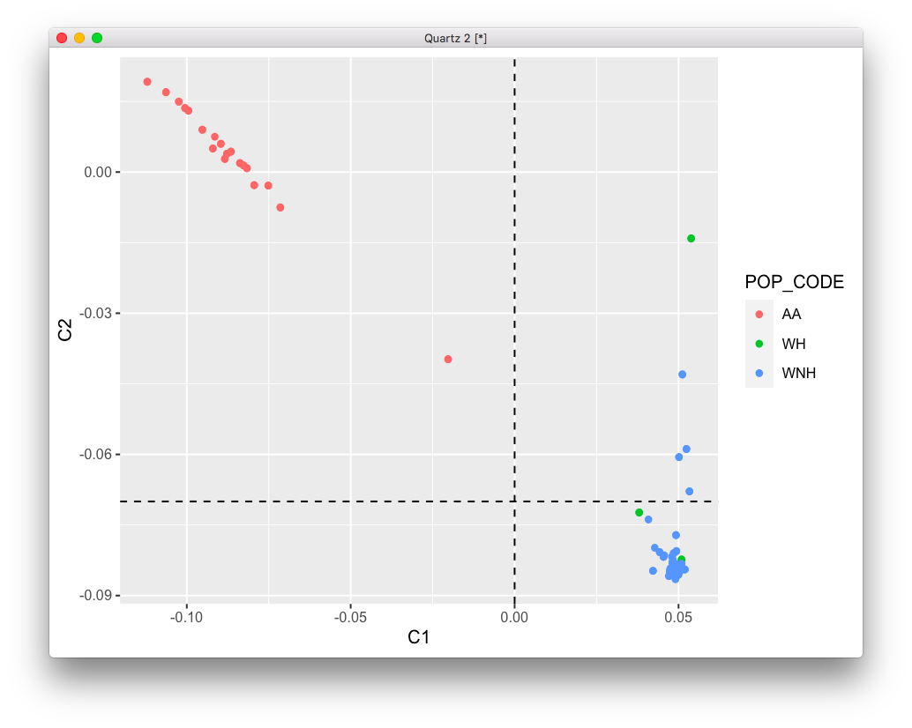

```r
ggplot(data, aes(x=C1, y=C2, col=POP_CODE)) + geom_point() + geom_hline(yintercept=-.05, linetype="dashed", color = "black") + geom_vline(xintercept=0, linetype="dashed", color = "black")
```

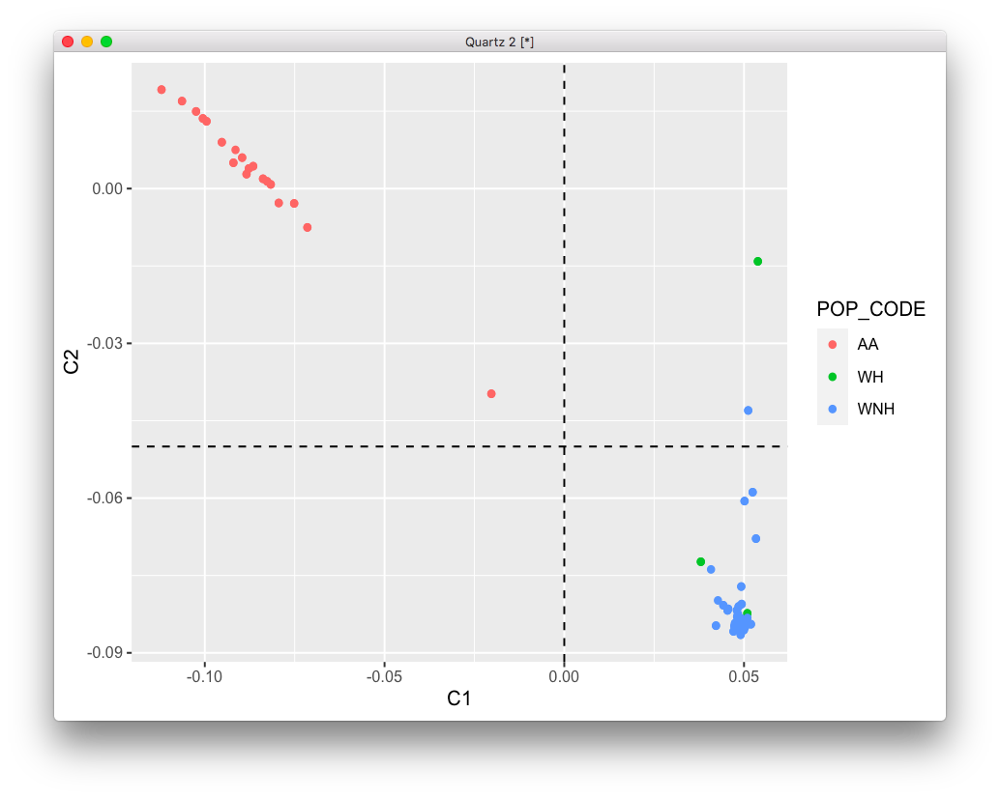

```r
data = readRDS('~/data/rnaseq_derek/complete_rawCountData_05132020.rds')
rownames(data) = data$submitted_name  # just to ensure compatibility later
# remove obvious outlier that's likely caudate labeled as ACC
rm_me = rownames(data) %in% c('68080')
data = data[!rm_me, ]

imWNH = which(data$C1 > 0 & data$C2 < -.07)
data = data[imWNH, ]

# ending up with 62 data points across both brain regions (before we had 61)
grex_vars = colnames(data)[grepl(colnames(data), pattern='^ENS')]
count_matrix = t(data[, grex_vars])
# data matrix goes on a diet...
data = data[, !grepl(colnames(data), pattern='^ENS')]
# remove that weird .num after ENSG
id_num = sapply(grex_vars, function(x) strsplit(x=x, split='\\.')[[1]][1])
rownames(count_matrix) = id_num
dups = duplicated(id_num)
id_num = id_num[!dups]
count_matrix = count_matrix[!dups, ]

library('biomaRt')
mart <- useDataset("hsapiens_gene_ensembl", useMart("ensembl"))
G_list0 <- getBM(filters= "ensembl_gene_id", attributes= c("ensembl_gene_id",
                 "hgnc_symbol", "chromosome_name"),values=id_num,mart= mart)
# remove any genes without a HUGOID
G_list <- G_list0[!is.na(G_list0$hgnc_symbol),]
G_list = G_list[G_list$hgnc_symbol!='',]
# remove genes that appear more than once
G_list <- G_list[!duplicated(G_list$ensembl_gene_id),]
# keep only gene counts for genes that we have information
imnamed = rownames(count_matrix) %in% G_list$ensembl_gene_id
count_matrix = count_matrix[imnamed, ]

# some data variables modifications
data$POP_CODE = as.character(data$POP_CODE)
data[data$POP_CODE=='WNH', 'POP_CODE'] = 'W'
data[data$POP_CODE=='WH', 'POP_CODE'] = 'W'
data$POP_CODE = factor(data$POP_CODE)
data$Individual = factor(data$hbcc_brain_id)
data[data$Manner.of.Death=='Suicide (probable)', 'Manner.of.Death'] = 'Suicide'
data[data$Manner.of.Death=='unknown', 'Manner.of.Death'] = 'natural'
data$MoD = factor(data$Manner.of.Death)
data$batch = factor(as.numeric(data$run_date))

library(caret)
set.seed(42)
# remove genes with zero or near zero variance so we can run PCA
pp_order = c('zv', 'nzv')
pp = preProcess(t(count_matrix), method = pp_order)
X = predict(pp, t(count_matrix))
geneCounts = t(X)

# match gene counts to gene info
G_list2 = merge(rownames(geneCounts), G_list, by=1)
colnames(G_list2)[1] = 'ensembl_gene_id'

# keep only autosomal genes
imautosome = which(G_list2$chromosome_name != 'X' &
                   G_list2$chromosome_name != 'Y' &
                   G_list2$chromosome_name != 'MT')
geneCounts = geneCounts[imautosome, ]
G_list2 = G_list2[imautosome, ]

library(edgeR)
isexpr = rowSums(cpm(geneCounts)>1) >= 0.1*ncol(geneCounts)

genes = DGEList( geneCounts[isexpr,], genes=G_list2[isexpr,] ) 
genes = calcNormFactors( genes)

library(variancePartition)
library(BiocParallel)
param = SnowParam(32, "SOCK", progressbar=TRUE)
register(param)

get_enrich_order2 = function( res, gene_sets ){
  if( !is.null(res$z.std) ){
    stat = res$z.std
  }else if( !is.null(res$F.std) ){
    stat = res$F.std
  }else if( !is.null(res$t) ){
    stat = res$t
  }else{
    stat = res$F
  }
  names(stat) = res$hgnc_symbol
  stat = stat[!is.na(names(stat))]
  # print(head(stat))
  index = ids2indices(gene_sets, names(stat))
  cameraPR( stat, index )
}
load('~/data/rnaseq_derek/adhd_genesets_philip.RDATA')

form = ~ (1|Region) + (1|Individual) + (1|batch)
vobjMM = voomWithDreamWeights( genes, form, data, plot=FALSE)
form = ~ 0 + Region + Region:Diagnosis + (1|Individual) + (1|batch) + Sex + scale(RINe) + scale(PMI) + scale(Age) + MoD
L = getContrast( vobjMM, form, data, "RegionCaudate:DiagnosisControl")
L['RegionACC:DiagnosisControl'] = 1
fitmm = dream( vobjMM, form, data, L)
resMM = topTable(fitmm, coef="L1", number=Inf) 
adhd_dream_camera = get_enrich_order2( resMM, t2 ) 
load('~/data/rnaseq_derek/dev_gene_sets.RData')
dev_dream_camera = get_enrich_order2( resMM, genes_unique )
load('~/data/rnaseq_derek/c5_gene_sets.RData')
c5_dream_camera = get_enrich_order2( resMM, c5_all)
load('~/data/rnaseq_derek/brain_disorders_gene_sets.RData')
dis_dream_camera = get_enrich_order2( resMM, disorders)
```

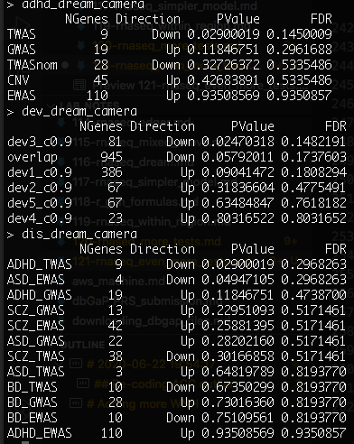

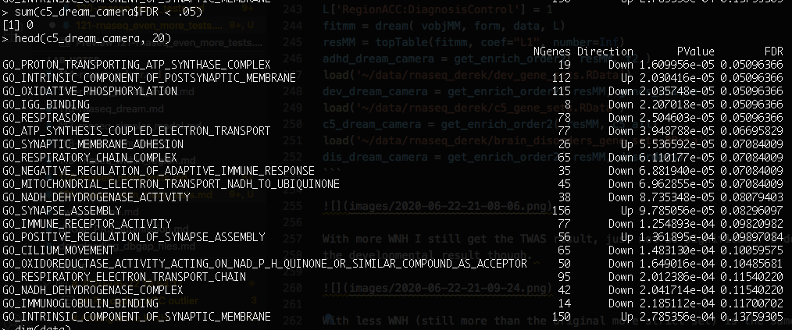

With more WNH I still get the TWAS result, just not as significant. I do lose
the developmental result though. The c5 results are not that good either,
loosing all FDR < .05 and the top results are not even that good.

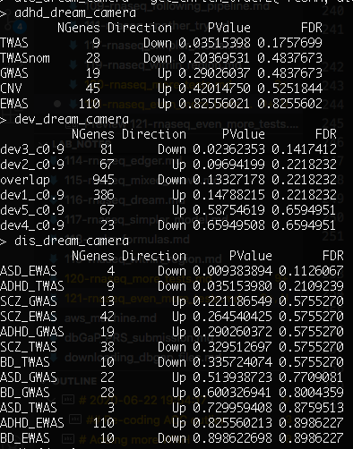

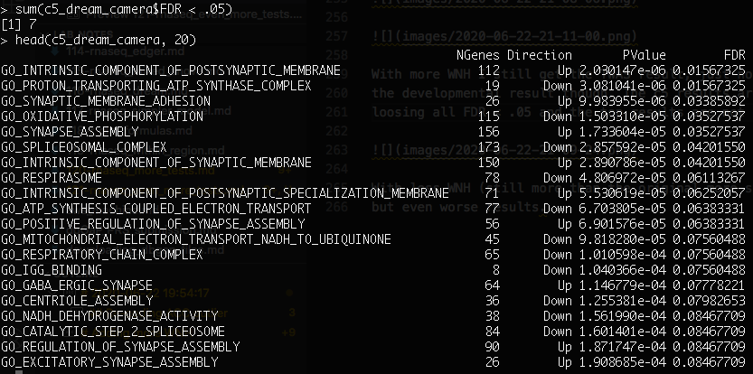

With less WNH (still more than the original more strict set) is the same effect,
but even worse results. I still have some c5 results using the more strict set,
but it's not great.

What if I use the same model in voom? Does it change anything?

```r
form = ~ 0 + Region + Region:Diagnosis + (1|Individual) + (1|batch) + Sex + scale(RINe) + scale(PMI) + scale(Age) + MoD
vobjMM = voomWithDreamWeights( genes, form, data, plot=FALSE)
L = getContrast( vobjMM, form, data, "RegionCaudate:DiagnosisControl")
L['RegionACC:DiagnosisControl'] = 1
fitmm = dream( vobjMM, form, data, L)
resMM = topTable(fitmm, coef="L1", number=Inf) 
adhd_dream_camera = get_enrich_order2( resMM, t2 ) 
load('~/data/rnaseq_derek/dev_gene_sets.RData')
dev_dream_camera = get_enrich_order2( resMM, genes_unique )
load('~/data/rnaseq_derek/c5_gene_sets.RData')
c5_dream_camera = get_enrich_order2( resMM, c5_all)
load('~/data/rnaseq_derek/brain_disorders_gene_sets.RData')
dis_dream_camera = get_enrich_order2( resMM, disorders)
```

With more WNH (70):

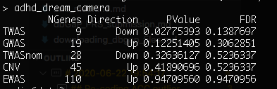

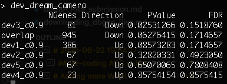

And with less (64):

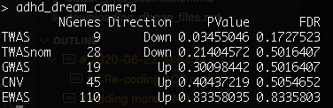

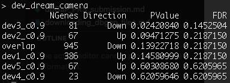

So, in a nutshell, the TWAS result is somewhat there, just losing significance
the more relaxed we get about WNH. The dev result goes away, and the c5 result
gets reeeaaally murky. Let me play a bit with different Allen cut-offs to see
what we get.

## Allen cut-offs

I'll use the original WNH set and see how the developmental reult changes if
using a different cut-off. Let's go got .5 and .7.

```r
load('~/data/rnaseq_derek/data_for_alex.RData')
co = .7
idx = anno$age_category==1 & anno$cutoff==co
genes_overlap = unique(anno[idx, 'anno_gene'])
for (s in 2:5) {
  idx = anno$age_category==s & anno$cutoff==co
  g2 = unique(anno[idx, 'anno_gene'])
  genes_overlap = intersect(genes_overlap, g2)
}
genes_unique = list()
for (s in 1:5) {
  others = setdiff(1:5, s)
  idx = anno$age_category==s & anno$cutoff==co
  g = unique(anno[idx, 'anno_gene'])
  for (s2 in others) {
    idx = anno$age_category==s2 & anno$cutoff==co
    g2 = unique(anno[idx, 'anno_gene'])
    rm_me = g %in% g2
    g = g[!rm_me]
  }
  genes_unique[[sprintf('dev%s_c%.1f', s, co)]] = unique(g)
}
genes_unique[['overlap']] = unique(genes_overlap)
dev_dream_camera = get_enrich_order2( resMM, genes_unique )
```

The idea that earlier gene sets are more important still exists with cutoff .7,
but not .5:

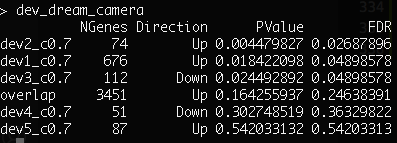

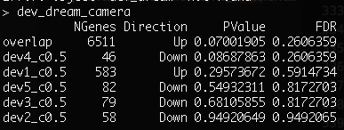

Let's check .8 and .6 just to see if there is a trend:

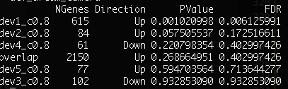

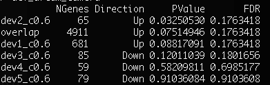

Yes, so the higher cut-off (e.g. demands higher differentiation for being
considered expressed in the region), the more evident that earlier genes are
important.

## Within region

Do the results segregate by region?

```r
myregion = 'ACC'
data = readRDS('~/data/rnaseq_derek/complete_rawCountData_05132020.rds')
rownames(data) = data$submitted_name  # just to ensure compatibility later
# remove obvious outlier that's likely caudate labeled as ACC
rm_me = rownames(data) %in% c('68080')
data = data[!rm_me, ]
data = data[data$Region==myregion, ]

imWNH = which(data$C1 > 0 & data$C2 < -.075)
data = data[imWNH, ]

# have 30 WNH subjects for ACC and 31 for Caudate
grex_vars = colnames(data)[grepl(colnames(data), pattern='^ENS')]
count_matrix = t(data[, grex_vars])
# data matrix goes on a diet...
data = data[, !grepl(colnames(data), pattern='^ENS')]
# remove that weird .num after ENSG
id_num = sapply(grex_vars, function(x) strsplit(x=x, split='\\.')[[1]][1])
rownames(count_matrix) = id_num
dups = duplicated(id_num)
id_num = id_num[!dups]
count_matrix = count_matrix[!dups, ]

library('biomaRt')
mart <- useDataset("hsapiens_gene_ensembl", useMart("ensembl"))
G_list0 <- getBM(filters= "ensembl_gene_id", attributes= c("ensembl_gene_id",
                 "hgnc_symbol", "chromosome_name"),values=id_num,mart= mart)
# remove any genes without a HUGOID
G_list <- G_list0[!is.na(G_list0$hgnc_symbol),]
G_list = G_list[G_list$hgnc_symbol!='',]
# remove genes that appear more than once
G_list <- G_list[!duplicated(G_list$ensembl_gene_id),]
# keep only gene counts for genes that we have information
imnamed = rownames(count_matrix) %in% G_list$ensembl_gene_id
count_matrix = count_matrix[imnamed, ]

# some data variables modifications
data$POP_CODE = as.character(data$POP_CODE)
data[data$POP_CODE=='WNH', 'POP_CODE'] = 'W'
data[data$POP_CODE=='WH', 'POP_CODE'] = 'W'
data$POP_CODE = factor(data$POP_CODE)
data$Individual = factor(data$hbcc_brain_id)
data[data$Manner.of.Death=='Suicide (probable)', 'Manner.of.Death'] = 'Suicide'
data[data$Manner.of.Death=='unknown', 'Manner.of.Death'] = 'natural'
data$MoD = factor(data$Manner.of.Death)
data$batch = factor(as.numeric(data$run_date))

library(caret)
set.seed(42)
# remove genes with zero or near zero variance so we can run PCA
pp_order = c('zv', 'nzv')
pp = preProcess(t(count_matrix), method = pp_order)
X = predict(pp, t(count_matrix))
geneCounts = t(X)

# match gene counts to gene info
G_list2 = merge(rownames(geneCounts), G_list, by=1)
colnames(G_list2)[1] = 'ensembl_gene_id'

# keep only autosomal genes
imautosome = which(G_list2$chromosome_name != 'X' &
                   G_list2$chromosome_name != 'Y' &
                   G_list2$chromosome_name != 'MT')
geneCounts = geneCounts[imautosome, ]
G_list2 = G_list2[imautosome, ]

library(edgeR)
isexpr = rowSums(cpm(geneCounts)>1) >= 0.1*ncol(geneCounts)

genes = DGEList( geneCounts[isexpr,], genes=G_list2[isexpr,] ) 
genes = calcNormFactors( genes)

library(variancePartition)
library(BiocParallel)
param = SnowParam(32, "SOCK", progressbar=TRUE)
register(param)

get_enrich_order2 = function( res, gene_sets ){
  if( !is.null(res$z.std) ){
    stat = res$z.std
  }else if( !is.null(res$F.std) ){
    stat = res$F.std
  }else if( !is.null(res$t) ){
    stat = res$t
  }else{
    stat = res$F
  }
  names(stat) = res$hgnc_symbol
  stat = stat[!is.na(names(stat))]
  # print(head(stat))
  index = ids2indices(gene_sets, names(stat))
  cameraPR( stat, index )
}
load('~/data/rnaseq_derek/adhd_genesets_philip.RDATA')

form = ~ (1|batch)
vobjMM = voomWithDreamWeights( genes, form, data, plot=FALSE)
form = ~ 0 + Diagnosis + (1|batch) + Sex + scale(RINe) + scale(PMI) + scale(Age) + MoD
L = getContrast( vobjMM, form, data, "DiagnosisControl")
L['DiagnosisCase'] = 1
fitmm = dream( vobjMM, form, data, L)
resMM = topTable(fitmm, coef="L1", number=Inf) 
adhd_dream_camera = get_enrich_order2( resMM, t2 ) 
load('~/data/rnaseq_derek/c5_gene_sets.RData')
c5_dream_camera = get_enrich_order2( resMM, c5_all)
load('~/data/rnaseq_derek/brain_disorders_gene_sets.RData')
dis_dream_camera = get_enrich_order2( resMM, disorders)

load('~/data/rnaseq_derek/data_for_alex.RData')
if (myregion == 'ACC') {
    anno_region = 'Allen:10278'
} else {
    anno_region = 'Allen:10333'
}
co = .9 
idx = anno$age_category==1 & anno$cutoff==co & anno$structure_id==anno_region
genes_overlap = unique(anno[idx, 'anno_gene'])
for (s in 2:5) {
  idx = anno$age_category==s & anno$cutoff==co & anno$structure_id==anno_region
  g2 = unique(anno[idx, 'anno_gene'])
  genes_overlap = intersect(genes_overlap, g2)
}
genes_unique = list()
for (s in 1:5) {
  others = setdiff(1:5, s)
  idx = anno$age_category==s & anno$cutoff==co & anno$structure_id==anno_region
  g = unique(anno[idx, 'anno_gene'])
  for (s2 in others) {
    idx = anno$age_category==s2 & anno$cutoff==co & anno$structure_id==anno_region
    g2 = unique(anno[idx, 'anno_gene'])
    rm_me = g %in% g2
    g = g[!rm_me]
  }
  genes_unique[[sprintf('dev%s_c%.1f', s, co)]] = unique(g)
}
genes_unique[['overlap']] = unique(genes_overlap)

dev_dream_camera = get_enrich_order2( resMM, genes_unique )
```

Need to investigate this a bit further... maybe new data cleaning thresholds? My
p-values are way too good. If anything, I should plot those specific genes to
see what's going on. For caudate:

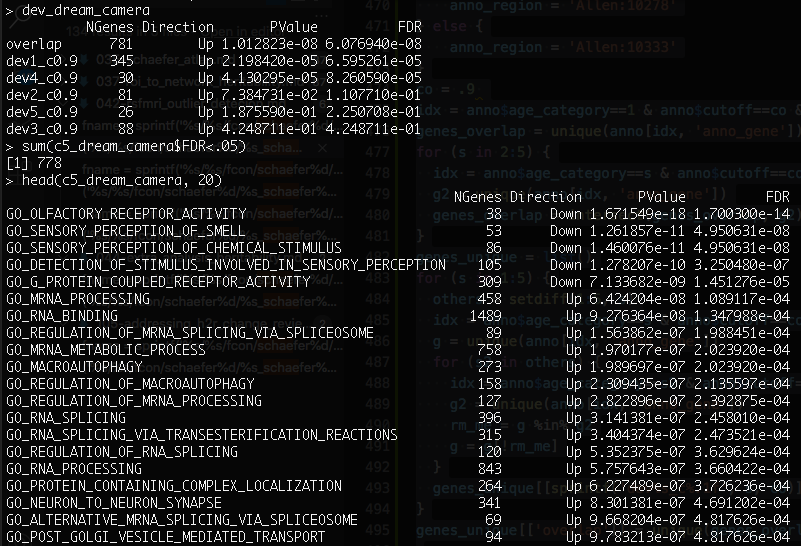
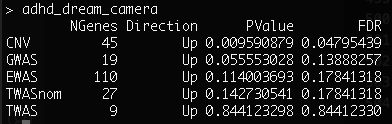
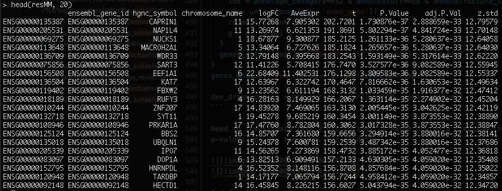

And for ACC:

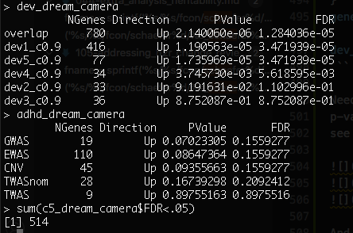
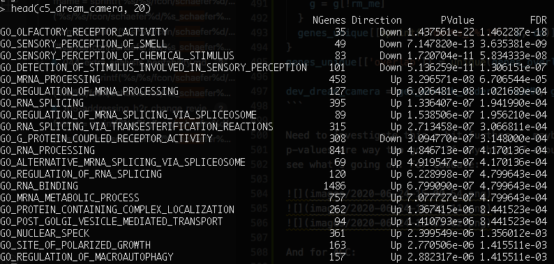
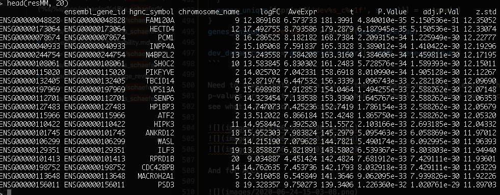

