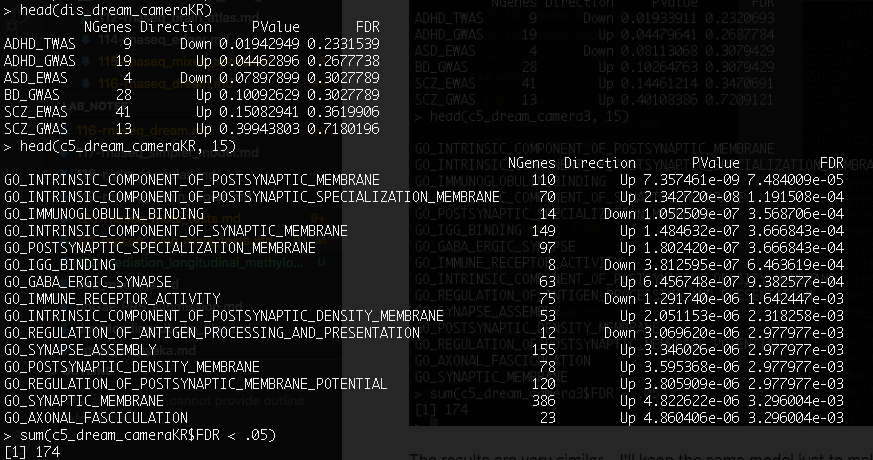

# 2020-06-22 19:54:17

Let's try a few things I chatted with Philip and wrote down in 120.

## Re-coding ACC outlier

That's the simplest thing to do. Let's see if our WNH results are still there if
instead of removing that one sample we just recorde it as Caudate.

```r
data = readRDS('~/data/rnaseq_derek/complete_rawCountData_05132020.rds')
rownames(data) = data$submitted_name  # just to ensure compatibility later
# change obvious outlier that's likely caudate labeled as ACC
change_me = which(rownames(data) %in% c('68080'))
data[change_me, 'Region'] = 'Caudate'

imWNH = which(data$C1 > 0 & data$C2 < -.075)
data = data[imWNH, ]

# ending up with 62 data points across both brain regions (before we had 61)
grex_vars = colnames(data)[grepl(colnames(data), pattern='^ENS')]
count_matrix = t(data[, grex_vars])
# data matrix goes on a diet...
data = data[, !grepl(colnames(data), pattern='^ENS')]
# remove that weird .num after ENSG
id_num = sapply(grex_vars, function(x) strsplit(x=x, split='\\.')[[1]][1])
rownames(count_matrix) = id_num
dups = duplicated(id_num)
id_num = id_num[!dups]
count_matrix = count_matrix[!dups, ]

library('biomaRt')
mart <- useDataset("hsapiens_gene_ensembl", useMart("ensembl"))
G_list0 <- getBM(filters= "ensembl_gene_id", attributes= c("ensembl_gene_id",
                 "hgnc_symbol", "chromosome_name"),values=id_num,mart= mart)
# remove any genes without a HUGOID
G_list <- G_list0[!is.na(G_list0$hgnc_symbol),]
G_list = G_list[G_list$hgnc_symbol!='',]
# remove genes that appear more than once
G_list <- G_list[!duplicated(G_list$ensembl_gene_id),]
# keep only gene counts for genes that we have information
imnamed = rownames(count_matrix) %in% G_list$ensembl_gene_id
count_matrix = count_matrix[imnamed, ]

# some data variables modifications
data$POP_CODE = as.character(data$POP_CODE)
data[data$POP_CODE=='WNH', 'POP_CODE'] = 'W'
data[data$POP_CODE=='WH', 'POP_CODE'] = 'W'
data$POP_CODE = factor(data$POP_CODE)
data$Individual = factor(data$hbcc_brain_id)
data[data$Manner.of.Death=='Suicide (probable)', 'Manner.of.Death'] = 'Suicide'
data[data$Manner.of.Death=='unknown', 'Manner.of.Death'] = 'natural'
data$MoD = factor(data$Manner.of.Death)
data$batch = factor(as.numeric(data$run_date))

library(caret)
set.seed(42)
# remove genes with zero or near zero variance so we can run PCA
pp_order = c('zv', 'nzv')
pp = preProcess(t(count_matrix), method = pp_order)
X = predict(pp, t(count_matrix))
geneCounts = t(X)

# match gene counts to gene info
G_list2 = merge(rownames(geneCounts), G_list, by=1)
colnames(G_list2)[1] = 'ensembl_gene_id'

# keep only autosomal genes
imautosome = which(G_list2$chromosome_name != 'X' &
                   G_list2$chromosome_name != 'Y' &
                   G_list2$chromosome_name != 'MT')
geneCounts = geneCounts[imautosome, ]
G_list2 = G_list2[imautosome, ]

library(edgeR)
isexpr = rowSums(cpm(geneCounts)>1) >= 0.1*ncol(geneCounts)

genes = DGEList( geneCounts[isexpr,], genes=G_list2[isexpr,] ) 
genes = calcNormFactors( genes)

library(variancePartition)
library(BiocParallel)
param = SnowParam(32, "SOCK", progressbar=TRUE)
register(param)

get_enrich_order2 = function( res, gene_sets ){
  if( !is.null(res$z.std) ){
    stat = res$z.std
  }else if( !is.null(res$F.std) ){
    stat = res$F.std
  }else if( !is.null(res$t) ){
    stat = res$t
  }else{
    stat = res$F
  }
  names(stat) = res$hgnc_symbol
  stat = stat[!is.na(names(stat))]
  # print(head(stat))
  index = ids2indices(gene_sets, names(stat))
  cameraPR( stat, index )
}
load('~/data/rnaseq_derek/adhd_genesets_philip.RDATA')

form = ~ (1|Region) + (1|Individual) + (1|batch)
vobjMM = voomWithDreamWeights( genes, form, data, plot=FALSE)
form = ~ 0 + Region + Region:Diagnosis + (1|Individual) + (1|batch) + Sex + scale(RINe) + scale(PMI) + scale(Age) + MoD
L = getContrast( vobjMM, form, data, "RegionCaudate:DiagnosisControl")
L['RegionACC:DiagnosisControl'] = 1
fitmm = dream( vobjMM, form, data, L)
resMM = topTable(fitmm, coef="L1", number=Inf) 
adhd_dream_camera = get_enrich_order2( resMM, t2 ) 
load('~/data/rnaseq_derek/dev_gene_sets.RData')
dev_dream_camera = get_enrich_order2( resMM, genes_unique )
load('~/data/rnaseq_derek/c5_gene_sets.RData')
c5_dream_camera = get_enrich_order2( resMM, c5_all)
load('~/data/rnaseq_derek/brain_disorders_gene_sets.RData')
dis_dream_camera = get_enrich_order2( resMM, disorders)
```

That's interesting... that didn't look like a Caudate sample. None of the
results held by a mile when adding it as Caudate!!!

# Adding more WNH

Let's play a bit with the WNH threshold to see if we can include a few more.
Basically, we'll raise the y axis limit a bit to first only leave out 5 dots,
then only 2 (the two highest ones in the Y axis).

```r
data = readRDS('~/data/rnaseq_derek/complete_rawCountData_05132020.rds')
rownames(data) = data$submitted_name  # just to ensure compatibility later
# remove obvious outlier that's likely caudate labeled as ACC
rm_me = rownames(data) %in% c('68080')
ggplot(data, aes(x=C1, y=C2, col=POP_CODE)) + geom_point() + geom_hline(yintercept=-.07, linetype="dashed", color = "black") + geom_vline(xintercept=0, linetype="dashed", color = "black")
```


```r
ggplot(data, aes(x=C1, y=C2, col=POP_CODE)) + geom_point() + geom_hline(yintercept=-.05, linetype="dashed", color = "black") + geom_vline(xintercept=0, linetype="dashed", color = "black")
```


```r
data = readRDS('~/data/rnaseq_derek/complete_rawCountData_05132020.rds')
rownames(data) = data$submitted_name  # just to ensure compatibility later
# remove obvious outlier that's likely caudate labeled as ACC
rm_me = rownames(data) %in% c('68080')
data = data[!rm_me, ]

imWNH = which(data$C1 > 0 & data$C2 < -.07)
data = data[imWNH, ]

# ending up with 62 data points across both brain regions (before we had 61)
grex_vars = colnames(data)[grepl(colnames(data), pattern='^ENS')]
count_matrix = t(data[, grex_vars])
# data matrix goes on a diet...
data = data[, !grepl(colnames(data), pattern='^ENS')]
# remove that weird .num after ENSG
id_num = sapply(grex_vars, function(x) strsplit(x=x, split='\\.')[[1]][1])
rownames(count_matrix) = id_num
dups = duplicated(id_num)
id_num = id_num[!dups]
count_matrix = count_matrix[!dups, ]

library('biomaRt')
mart <- useDataset("hsapiens_gene_ensembl", useMart("ensembl"))
G_list0 <- getBM(filters= "ensembl_gene_id", attributes= c("ensembl_gene_id",
                 "hgnc_symbol", "chromosome_name"),values=id_num,mart= mart)
# remove any genes without a HUGOID
G_list <- G_list0[!is.na(G_list0$hgnc_symbol),]
G_list = G_list[G_list$hgnc_symbol!='',]
# remove genes that appear more than once
G_list <- G_list[!duplicated(G_list$ensembl_gene_id),]
# keep only gene counts for genes that we have information
imnamed = rownames(count_matrix) %in% G_list$ensembl_gene_id
count_matrix = count_matrix[imnamed, ]

# some data variables modifications
data$POP_CODE = as.character(data$POP_CODE)
data[data$POP_CODE=='WNH', 'POP_CODE'] = 'W'
data[data$POP_CODE=='WH', 'POP_CODE'] = 'W'
data$POP_CODE = factor(data$POP_CODE)
data$Individual = factor(data$hbcc_brain_id)
data[data$Manner.of.Death=='Suicide (probable)', 'Manner.of.Death'] = 'Suicide'
data[data$Manner.of.Death=='unknown', 'Manner.of.Death'] = 'natural'
data$MoD = factor(data$Manner.of.Death)
data$batch = factor(as.numeric(data$run_date))

library(caret)
set.seed(42)
# remove genes with zero or near zero variance so we can run PCA
pp_order = c('zv', 'nzv')
pp = preProcess(t(count_matrix), method = pp_order)
X = predict(pp, t(count_matrix))
geneCounts = t(X)

# match gene counts to gene info
G_list2 = merge(rownames(geneCounts), G_list, by=1)
colnames(G_list2)[1] = 'ensembl_gene_id'

# keep only autosomal genes
imautosome = which(G_list2$chromosome_name != 'X' &
                   G_list2$chromosome_name != 'Y' &
                   G_list2$chromosome_name != 'MT')
geneCounts = geneCounts[imautosome, ]
G_list2 = G_list2[imautosome, ]

library(edgeR)
isexpr = rowSums(cpm(geneCounts)>1) >= 0.1*ncol(geneCounts)

genes = DGEList( geneCounts[isexpr,], genes=G_list2[isexpr,] ) 
genes = calcNormFactors( genes)

library(variancePartition)
library(BiocParallel)
param = SnowParam(32, "SOCK", progressbar=TRUE)
register(param)

get_enrich_order2 = function( res, gene_sets ){
  if( !is.null(res$z.std) ){
    stat = res$z.std
  }else if( !is.null(res$F.std) ){
    stat = res$F.std
  }else if( !is.null(res$t) ){
    stat = res$t
  }else{
    stat = res$F
  }
  names(stat) = res$hgnc_symbol
  stat = stat[!is.na(names(stat))]
  # print(head(stat))
  index = ids2indices(gene_sets, names(stat))
  cameraPR( stat, index )
}
load('~/data/rnaseq_derek/adhd_genesets_philip.RDATA')

form = ~ (1|Region) + (1|Individual) + (1|batch)
vobjMM = voomWithDreamWeights( genes, form, data, plot=FALSE)
form = ~ 0 + Region + Region:Diagnosis + (1|Individual) + (1|batch) + Sex + scale(RINe) + scale(PMI) + scale(Age) + MoD
L = getContrast( vobjMM, form, data, "RegionCaudate:DiagnosisControl")
L['RegionACC:DiagnosisControl'] = 1
fitmm = dream( vobjMM, form, data, L)
resMM = topTable(fitmm, coef="L1", number=Inf) 
adhd_dream_camera = get_enrich_order2( resMM, t2 ) 
load('~/data/rnaseq_derek/dev_gene_sets.RData')
dev_dream_camera = get_enrich_order2( resMM, genes_unique )
load('~/data/rnaseq_derek/c5_gene_sets.RData')
c5_dream_camera = get_enrich_order2( resMM, c5_all)
load('~/data/rnaseq_derek/brain_disorders_gene_sets.RData')
dis_dream_camera = get_enrich_order2( resMM, disorders)
```


With more WNH I still get the TWAS result, just not as significant. I do lose
the developmental result though. The c5 results are not that good either,
loosing all FDR < .05 and the top results are not even that good.


With less WNH (still more than the original more strict set) is the same effect,
but even worse results. I still have some c5 results using the more strict set,
but it's not great.

What if I use the same model in voom? Does it change anything?

```r
form = ~ 0 + Region + Region:Diagnosis + (1|Individual) + (1|batch) + Sex + scale(RINe) + scale(PMI) + scale(Age) + MoD
vobjMM = voomWithDreamWeights( genes, form, data, plot=FALSE)
L = getContrast( vobjMM, form, data, "RegionCaudate:DiagnosisControl")
L['RegionACC:DiagnosisControl'] = 1
fitmm = dream( vobjMM, form, data, L)
resMM = topTable(fitmm, coef="L1", number=Inf) 
adhd_dream_camera = get_enrich_order2( resMM, t2 ) 
load('~/data/rnaseq_derek/dev_gene_sets.RData')
dev_dream_camera = get_enrich_order2( resMM, genes_unique )
load('~/data/rnaseq_derek/c5_gene_sets.RData')
c5_dream_camera = get_enrich_order2( resMM, c5_all)
load('~/data/rnaseq_derek/brain_disorders_gene_sets.RData')
dis_dream_camera = get_enrich_order2( resMM, disorders)
```

With more WNH (70):


And with less (64):


So, in a nutshell, the TWAS result is somewhat there, just losing significance
the more relaxed we get about WNH. The dev result goes away, and the c5 result
gets reeeaaally murky. Let me play a bit with different Allen cut-offs to see
what we get.

## Allen cut-offs

I'll use the original WNH set and see how the developmental reult changes if
using a different cut-off. Let's go got .5 and .7.

```r
load('~/data/rnaseq_derek/data_for_alex.RData')
co = .7
idx = anno$age_category==1 & anno$cutoff==co
genes_overlap = unique(anno[idx, 'anno_gene'])
for (s in 2:5) {
  idx = anno$age_category==s & anno$cutoff==co
  g2 = unique(anno[idx, 'anno_gene'])
  genes_overlap = intersect(genes_overlap, g2)
}
genes_unique = list()
for (s in 1:5) {
  others = setdiff(1:5, s)
  idx = anno$age_category==s & anno$cutoff==co
  g = unique(anno[idx, 'anno_gene'])
  for (s2 in others) {
    idx = anno$age_category==s2 & anno$cutoff==co
    g2 = unique(anno[idx, 'anno_gene'])
    rm_me = g %in% g2
    g = g[!rm_me]
  }
  genes_unique[[sprintf('dev%s_c%.1f', s, co)]] = unique(g)
}
genes_unique[['overlap']] = unique(genes_overlap)
dev_dream_camera = get_enrich_order2( resMM, genes_unique )
```

The idea that earlier gene sets are more important still exists with cutoff .7,
but not .5:


Let's check .8 and .6 just to see if there is a trend:


Yes, so the higher cut-off (e.g. demands higher differentiation for being
considered expressed in the region), the more evident that earlier genes are
important.

## Within region

Do the results segregate by region?

```r
myregion = 'ACC'
data = readRDS('~/data/rnaseq_derek/complete_rawCountData_05132020.rds')
rownames(data) = data$submitted_name  # just to ensure compatibility later
# remove obvious outlier that's likely caudate labeled as ACC
rm_me = rownames(data) %in% c('68080')
data = data[!rm_me, ]
data = data[data$Region==myregion, ]

imWNH = which(data$C1 > 0 & data$C2 < -.075)
data = data[imWNH, ]

# have 30 WNH subjects for ACC and 31 for Caudate
grex_vars = colnames(data)[grepl(colnames(data), pattern='^ENS')]
count_matrix = t(data[, grex_vars])
# data matrix goes on a diet...
data = data[, !grepl(colnames(data), pattern='^ENS')]
# remove that weird .num after ENSG
id_num = sapply(grex_vars, function(x) strsplit(x=x, split='\\.')[[1]][1])
rownames(count_matrix) = id_num
dups = duplicated(id_num)
id_num = id_num[!dups]
count_matrix = count_matrix[!dups, ]

library('biomaRt')
mart <- useDataset("hsapiens_gene_ensembl", useMart("ensembl"))
G_list0 <- getBM(filters= "ensembl_gene_id", attributes= c("ensembl_gene_id",
                 "hgnc_symbol", "chromosome_name"),values=id_num,mart= mart)
# remove any genes without a HUGOID
G_list <- G_list0[!is.na(G_list0$hgnc_symbol),]
G_list = G_list[G_list$hgnc_symbol!='',]
# remove genes that appear more than once
G_list <- G_list[!duplicated(G_list$ensembl_gene_id),]
# keep only gene counts for genes that we have information
imnamed = rownames(count_matrix) %in% G_list$ensembl_gene_id
count_matrix = count_matrix[imnamed, ]

# some data variables modifications
data$POP_CODE = as.character(data$POP_CODE)
data[data$POP_CODE=='WNH', 'POP_CODE'] = 'W'
data[data$POP_CODE=='WH', 'POP_CODE'] = 'W'
data$POP_CODE = factor(data$POP_CODE)
data$Individual = factor(data$hbcc_brain_id)
data[data$Manner.of.Death=='Suicide (probable)', 'Manner.of.Death'] = 'Suicide'
data[data$Manner.of.Death=='unknown', 'Manner.of.Death'] = 'natural'
data$MoD = factor(data$Manner.of.Death)
data$batch = factor(as.numeric(data$run_date))

library(caret)
set.seed(42)
# remove genes with zero or near zero variance so we can run PCA
pp_order = c('zv', 'nzv')
pp = preProcess(t(count_matrix), method = pp_order)
X = predict(pp, t(count_matrix))
geneCounts = t(X)

# match gene counts to gene info
G_list2 = merge(rownames(geneCounts), G_list, by=1)
colnames(G_list2)[1] = 'ensembl_gene_id'

# keep only autosomal genes
imautosome = which(G_list2$chromosome_name != 'X' &
                   G_list2$chromosome_name != 'Y' &
                   G_list2$chromosome_name != 'MT')
geneCounts = geneCounts[imautosome, ]
G_list2 = G_list2[imautosome, ]

library(edgeR)
isexpr = rowSums(cpm(geneCounts)>1) >= 0.1*ncol(geneCounts)

genes = DGEList( geneCounts[isexpr,], genes=G_list2[isexpr,] ) 
genes = calcNormFactors( genes)

library(variancePartition)
library(BiocParallel)
param = SnowParam(32, "SOCK", progressbar=TRUE)
register(param)

get_enrich_order2 = function( res, gene_sets ){
  if( !is.null(res$z.std) ){
    stat = res$z.std
  }else if( !is.null(res$F.std) ){
    stat = res$F.std
  }else if( !is.null(res$t) ){
    stat = res$t
  }else{
    stat = res$F
  }
  names(stat) = res$hgnc_symbol
  stat = stat[!is.na(names(stat))]
  # print(head(stat))
  index = ids2indices(gene_sets, names(stat))
  cameraPR( stat, index )
}
load('~/data/rnaseq_derek/adhd_genesets_philip.RDATA')

form = ~ (1|batch)
vobjMM = voomWithDreamWeights( genes, form, data, plot=FALSE)
form = ~ 0 + Diagnosis + (1|batch) + Sex + scale(RINe) + scale(PMI) + scale(Age) + MoD
L = getContrast( vobjMM, form, data, "DiagnosisControl")
L['DiagnosisCase'] = 1
fitmm = dream( vobjMM, form, data, L)
resMM = topTable(fitmm, coef="L1", number=Inf) 
adhd_dream_camera = get_enrich_order2( resMM, t2 ) 
load('~/data/rnaseq_derek/c5_gene_sets.RData')
c5_dream_camera = get_enrich_order2( resMM, c5_all)
load('~/data/rnaseq_derek/brain_disorders_gene_sets.RData')
dis_dream_camera = get_enrich_order2( resMM, disorders)

load('~/data/rnaseq_derek/data_for_alex.RData')
if (myregion == 'ACC') {
    anno_region = 'Allen:10278'
} else {
    anno_region = 'Allen:10333'
}
co = .9 
idx = anno$age_category==1 & anno$cutoff==co & anno$structure_id==anno_region
genes_overlap = unique(anno[idx, 'anno_gene'])
for (s in 2:5) {
  idx = anno$age_category==s & anno$cutoff==co & anno$structure_id==anno_region
  g2 = unique(anno[idx, 'anno_gene'])
  genes_overlap = intersect(genes_overlap, g2)
}
genes_unique = list()
for (s in 1:5) {
  others = setdiff(1:5, s)
  idx = anno$age_category==s & anno$cutoff==co & anno$structure_id==anno_region
  g = unique(anno[idx, 'anno_gene'])
  for (s2 in others) {
    idx = anno$age_category==s2 & anno$cutoff==co & anno$structure_id==anno_region
    g2 = unique(anno[idx, 'anno_gene'])
    rm_me = g %in% g2
    g = g[!rm_me]
  }
  genes_unique[[sprintf('dev%s_c%.1f', s, co)]] = unique(g)
}
genes_unique[['overlap']] = unique(genes_overlap)

dev_dream_camera = get_enrich_order2( resMM, genes_unique )
```

Need to investigate this a bit further... maybe new data cleaning thresholds? My
p-values are way too good. If anything, I should plot those specific genes to
see what's going on. For caudate:


And for ACC:


# 2020-06-25 07:06:46

Let's first make sure the cutoffs are good here:

```r
mylcpm = cpm(genes, log=T)
plot(density(mylcpm[,1]), las=2, main="", xlab="lCPM", ylim=c(0, .2))
for (s in 2:nrow(data)) {
  lines(density(mylcpm[, s]), las=2)
}
```


There was nothing odd about the top genes from the results above, and using 1
like before is not necessarily unreasonable. But let's see if we get similarly
good results using a more standard threshold:

```r
isexpr <- filterByExpr(geneCounts, group=data$Diagnosis)

genes = DGEList( geneCounts[isexpr,], genes=G_list2[isexpr,] ) 
genes = calcNormFactors( genes)

library(variancePartition)
library(BiocParallel)
param = SnowParam(32, "SOCK", progressbar=TRUE)
register(param)

form = ~ (1|batch)
vobjMM = voomWithDreamWeights( genes, form, data, plot=FALSE)
form = ~ 0 + Diagnosis + (1|batch) + Sex + scale(RINe) + scale(PMI) + scale(Age) + MoD
L = getContrast( vobjMM, form, data, "DiagnosisControl")
L['DiagnosisCase'] = 1
fitmm = dream( vobjMM, form, data, L)
resMM = topTable(fitmm, coef="L1", number=Inf) 
adhd_dream_camera = get_enrich_order2( resMM, t2 ) 
load('~/data/rnaseq_derek/c5_gene_sets.RData')
c5_dream_camera = get_enrich_order2( resMM, c5_all)
load('~/data/rnaseq_derek/brain_disorders_gene_sets.RData')
dis_dream_camera = get_enrich_order2( resMM, disorders)

load('~/data/rnaseq_derek/data_for_alex.RData')
if (myregion == 'ACC') {
    anno_region = 'Allen:10278'
} else {
    anno_region = 'Allen:10333'
}
co = .9 
idx = anno$age_category==1 & anno$cutoff==co & anno$structure_id==anno_region
genes_overlap = unique(anno[idx, 'anno_gene'])
for (s in 2:5) {
  idx = anno$age_category==s & anno$cutoff==co & anno$structure_id==anno_region
  g2 = unique(anno[idx, 'anno_gene'])
  genes_overlap = intersect(genes_overlap, g2)
}
genes_unique = list()
for (s in 1:5) {
  others = setdiff(1:5, s)
  idx = anno$age_category==s & anno$cutoff==co & anno$structure_id==anno_region
  g = unique(anno[idx, 'anno_gene'])
  for (s2 in others) {
    idx = anno$age_category==s2 & anno$cutoff==co & anno$structure_id==anno_region
    g2 = unique(anno[idx, 'anno_gene'])
    rm_me = g %in% g2
    g = g[!rm_me]
  }
  genes_unique[[sprintf('dev%s_c%.1f', s, co)]] = unique(g)
}
genes_unique[['overlap']] = unique(genes_overlap)

dev_dream_camera = get_enrich_order2( resMM, genes_unique )
```

Still getting very strong results... do I get them if I just use a standard
edgeR pipeline? In this case, the main difference from any other analysis I've
done would be the focus on WNH and correcting for batch inside the model:

```r
design = model.matrix( ~ Diagnosis + Sex + scale(RINe) + scale(PMI) + scale(Age) + MoD, data)
vobj_tmp = voom( genes, design, plot=FALSE)
dupcor <- duplicateCorrelation(vobj_tmp, design, block=data$batch)
vobj = voom( genes, design, plot=FALSE, block=data$batch,
             correlation=dupcor$consensus)
dupcor <- duplicateCorrelation(vobj, design, block=data$batch)
fitDupCor <- lmFit(vobj, design, block=data$batch, correlation=dupcor$consensus)
fitDupCor <- eBayes( fitDupCor )
topTable( fitDupCor, coef='DiagnosisControl')
```

No results there... is it an issue with the intercept, or dream?

# 2020-06-26 07:48:05

Let's run dream with the intercept:

```r
isexpr <- filterByExpr(geneCounts, group=data$Diagnosis)

genes = DGEList( geneCounts[isexpr,], genes=G_list2[isexpr,] ) 
genes = calcNormFactors( genes)

form = ~ (1|batch)
vobjMM = voomWithDreamWeights( genes, form, data, plot=FALSE)
form = ~ Diagnosis + (1|batch) + Sex + scale(RINe) + scale(PMI) + scale(Age) + MoD
fitmm = dream( vobjMM, form, data)
resMM = topTable(fitmm, coef="DiagnosisControl", number=Inf) 
adhd_dream_camera = get_enrich_order2( resMM, t2 ) 
load('~/data/rnaseq_derek/c5_gene_sets.RData')
c5_dream_camera = get_enrich_order2( resMM, c5_all)
load('~/data/rnaseq_derek/brain_disorders_gene_sets.RData')
dis_dream_camera = get_enrich_order2( resMM, disorders)
```

# 2020-06-27 14:39:59

OK, I figured out that I wasn't flipping the sign in the contrast matrix. But
it'd still be nice to check whether the 4 models have much difference. That
being:

1) just batch in voom, intercept
2) just batch in voom, no intercept

Then, we can chose between:

1) entire model in voom
2) KR (which now is working if run inside a region)
3) dupCor instead of dream?

```r
get_enrich_order2 = function( res, gene_sets ){
  if( !is.null(res$z.std) ){
    stat = res$z.std
  }else if( !is.null(res$F.std) ){
    stat = res$F.std
  }else if( !is.null(res$t) ){
    stat = res$t
  }else{
    stat = res$F
  }
  names(stat) = res$hgnc_symbol
  stat = stat[!is.na(names(stat))]
  # print(head(stat))
  index = ids2indices(gene_sets, names(stat))
  cameraPR( stat, index )
}
load('~/data/rnaseq_derek/adhd_genesets_philip.RDATA')

myregion = 'ACC'
data = readRDS('~/data/rnaseq_derek/complete_rawCountData_05132020.rds')
rownames(data) = data$submitted_name  # just to ensure compatibility later
# remove obvious outlier that's likely caudate labeled as ACC
rm_me = rownames(data) %in% c('68080')
data = data[!rm_me, ]
data = data[data$Region==myregion, ]

imWNH = which(data$C1 > 0 & data$C2 < -.075)
data = data[imWNH, ]

# have 30 WNH subjects for ACC and 31 for Caudate
grex_vars = colnames(data)[grepl(colnames(data), pattern='^ENS')]
count_matrix = t(data[, grex_vars])
# data matrix goes on a diet...
data = data[, !grepl(colnames(data), pattern='^ENS')]
# remove that weird .num after ENSG
id_num = sapply(grex_vars, function(x) strsplit(x=x, split='\\.')[[1]][1])
rownames(count_matrix) = id_num
dups = duplicated(id_num)
id_num = id_num[!dups]
count_matrix = count_matrix[!dups, ]

library('biomaRt')
mart <- useDataset("hsapiens_gene_ensembl", useMart("ensembl"))
G_list0 <- getBM(filters= "ensembl_gene_id", attributes= c("ensembl_gene_id",
                 "hgnc_symbol", "chromosome_name"),values=id_num,mart= mart)
# remove any genes without a HUGOID
G_list <- G_list0[!is.na(G_list0$hgnc_symbol),]
G_list = G_list[G_list$hgnc_symbol!='',]
# remove genes that appear more than once
G_list <- G_list[!duplicated(G_list$ensembl_gene_id),]
# keep only gene counts for genes that we have information
imnamed = rownames(count_matrix) %in% G_list$ensembl_gene_id
count_matrix = count_matrix[imnamed, ]

# some data variables modifications
data$POP_CODE = as.character(data$POP_CODE)
data[data$POP_CODE=='WNH', 'POP_CODE'] = 'W'
data[data$POP_CODE=='WH', 'POP_CODE'] = 'W'
data$POP_CODE = factor(data$POP_CODE)
data$Individual = factor(data$hbcc_brain_id)
data[data$Manner.of.Death=='Suicide (probable)', 'Manner.of.Death'] = 'Suicide'
data[data$Manner.of.Death=='unknown', 'Manner.of.Death'] = 'natural'
data$MoD = factor(data$Manner.of.Death)
data$batch = factor(as.numeric(data$run_date))

library(caret)
set.seed(42)
# remove genes with zero or near zero variance so we can run PCA
pp_order = c('zv', 'nzv')
pp = preProcess(t(count_matrix), method = pp_order)
X = predict(pp, t(count_matrix))
geneCounts = t(X)

# match gene counts to gene info
G_list2 = merge(rownames(geneCounts), G_list, by=1)
colnames(G_list2)[1] = 'ensembl_gene_id'

# keep only autosomal genes
imautosome = which(G_list2$chromosome_name != 'X' &
                   G_list2$chromosome_name != 'Y' &
                   G_list2$chromosome_name != 'MT')
geneCounts = geneCounts[imautosome, ]
G_list2 = G_list2[imautosome, ]

library(edgeR)
isexpr = rowSums(cpm(geneCounts)>1) >= 0.1*ncol(geneCounts)

genes = DGEList( geneCounts[isexpr,], genes=G_list2[isexpr,] ) 
genes = calcNormFactors( genes)

library(variancePartition)
library(BiocParallel)
param = SnowParam(32, "SOCK", progressbar=TRUE)
register(param)

form1 = ~ (1|batch)
vobjMM1 = voomWithDreamWeights( genes, form1, data, plot=FALSE)
form2 = ~ 0 + Diagnosis + (1|batch) + Sex + scale(RINe) + scale(PMI) + scale(Age) + MoD
L = getContrast( vobjMM1, form2, data, "DiagnosisControl")
L['DiagnosisCase'] = -1
fitmm1 = dream( vobjMM1, form2, data, L)
resMM1 = topTable(fitmm1, coef="L1", number=Inf) 
adhd_dream_camera1 = get_enrich_order2( resMM1, t2 ) 
load('~/data/rnaseq_derek/c5_gene_sets.RData')
c5_dream_camera1 = get_enrich_order2( resMM1, c5_all)
load('~/data/rnaseq_derek/brain_disorders_gene_sets.RData')
dis_dream_camera1 = get_enrich_order2( resMM1, disorders)

load('~/data/rnaseq_derek/data_for_alex.RData')
if (myregion == 'ACC') {
    anno_region = 'Allen:10278'
} else {
    anno_region = 'Allen:10333'
}
co = .9 
idx = anno$age_category==1 & anno$cutoff==co & anno$structure_id==anno_region
genes_overlap = unique(anno[idx, 'anno_gene'])
for (s in 2:5) {
  idx = anno$age_category==s & anno$cutoff==co & anno$structure_id==anno_region
  g2 = unique(anno[idx, 'anno_gene'])
  genes_overlap = intersect(genes_overlap, g2)
}
genes_unique = list()
for (s in 1:5) {
  others = setdiff(1:5, s)
  idx = anno$age_category==s & anno$cutoff==co & anno$structure_id==anno_region
  g = unique(anno[idx, 'anno_gene'])
  for (s2 in others) {
    idx = anno$age_category==s2 & anno$cutoff==co & anno$structure_id==anno_region
    g2 = unique(anno[idx, 'anno_gene'])
    rm_me = g %in% g2
    g = g[!rm_me]
  }
  genes_unique[[sprintf('dev%s_c%.1f', s, co)]] = unique(g)
}
genes_unique[['overlap']] = unique(genes_overlap)

dev_dream_camera1 = get_enrich_order2( resMM1, genes_unique )
```

So, with just batch in voom and no intercept in the model, I get:


```r
form3 = ~ Diagnosis + (1|batch) + Sex + scale(RINe) + scale(PMI) + scale(Age) + MoD
fitmm2 = dream( vobjMM1, form3, data)
resMM2 = topTable(fitmm2, coef="DiagnosisControl", number=Inf) 
adhd_dream_camera2 = get_enrich_order2( resMM2, t2 ) 
c5_dream_camera2 = get_enrich_order2( resMM2, c5_all)
dis_dream_camera2 = get_enrich_order2( resMM2, disorders)
dev_dream_camera2 = get_enrich_order2( resMM2, genes_unique )
```

Without the intercept in the model:


So, it's the **exact** same result. Then, the question is whether we use the
full model in voom or not.

```r
vobjMM2 = voomWithDreamWeights( genes, form3, data, plot=FALSE)
fitmm3 = dream( vobjMM2, form3, data)
resMM3 = topTable(fitmm3, coef="DiagnosisControl", number=Inf) 
adhd_dream_camera3 = get_enrich_order2( resMM3, t2 ) 
c5_dream_camera3 = get_enrich_order2( resMM3, c5_all)
dis_dream_camera3 = get_enrich_order2( resMM3, disorders)
dev_dream_camera3 = get_enrich_order2( resMM3, genes_unique )
```


The results are very similar... I'll keep the same model just to make things
simpler. 

What's the difference if we use KR?

```r
fitmmKR = dream( vobjMM2, form3, data, ddf="Kenward-Roger")
resMMKR = topTable(fitmmKR, coef="DiagnosisControl", number=Inf) 
adhd_dream_cameraKR = get_enrich_order2( resMMKR, t2 ) 
c5_dream_cameraKR = get_enrich_order2( resMMKR, c5_all)
dis_dream_cameraKR = get_enrich_order2( resMMKR, disorders)
dev_dream_cameraKR = get_enrich_order2( resMMKR, genes_unique )
```




Not much difference either... 

Now we need to compare this with using dupCor, which runs a bit faster, but it's
more established compared to dream.

```r
form4 = ~ Diagnosis + Sex + scale(RINe) + scale(PMI) + scale(Age) + MoD
design = model.matrix( form4, data)
vobj_tmp = voom( genes, design, plot=FALSE)
dupcor <- duplicateCorrelation(vobj_tmp, design, block=data$batch)
vobj = voom( genes, design, plot=FALSE, block=data$batch,
             correlation=dupcor$consensus)
fit <- lmFit(vobj, design, block=data$batch, correlation=dupcor$consensus)
fitDC <- eBayes( fit )
resDC = topTable(fitDC, coef='DiagnosisControl', number=Inf) 
adhd_dream_cameraDC = get_enrich_order2( resDC, t2 ) 
c5_dream_cameraDC = get_enrich_order2( resDC, c5_all)
dis_dream_cameraDC = get_enrich_order2( resDC, disorders)
dev_dream_cameraDC = get_enrich_order2( resDC, genes_unique )
```


Overall it doesn't make that much difference. I think I'll stick with dupCor for
now just because it's a more established code base.

So, let's expand our findings to Caudate:


Results seem to be heavily driven by ACC then. 

Let me see if I can at least bring the Caudate near the significant region for
ADHD_TWAS, otherwise it's a weird comparison to begin with.


## ACC only with more people

Using the cutoff at -.07 we get a couple more WNH and these are the results:


So, results are still there, just a bit weaker in the disorder front.

With cutoff at .05 (more WNHs), we get:


This gives me a small bump of TWAS within ADHD only, and the c5 results are
similar. Either way, it seems like the ACC results are a lot more robust to
adding WNH then the results using both regions. We get 34 instead of 30 subjects
for ACC.

## Caudate with more people


Results go in the wrong direction for both ADHD and dev. Let's try a bit more
WNH.


Still not great. 

So, how about this? Figure out WNH thresholds in k-means clustering, then play
with cleaning threshold based on ether FDR or TWAS p-value, then run the
analysis within region just for developmental sets? It's a good start, but maybe
instad of playing with the cleaning threshold I should just run the edgeR script
and stick with that. Maybe by group and by design matrix?

Whether I cluster using the 3 PCs or just the first 2 I get the same result:

```r
data = readRDS('~/data/rnaseq_derek/complete_rawCountData_05132020.rds')
a = data[, c('hbcc_brain_id', 'POP_CODE', 'C1', 'C2', 'C3')]
b = a[!duplicated(a$hbcc_brain_id),]
b = b[!is.na(b$C1),]
k = kmeans(b[, c('C1', 'C2', 'C3')], centers=3)
ggplot(b, aes(x=C1, y=C2, col=factor(k$cluster))) + geom_point()
```


So, before I run the whole gammit of thresholds, let's try it with the two from
edgeR:

```r
get_enrich_order2 = function( res, gene_sets ){
  if( !is.null(res$z.std) ){
    stat = res$z.std
  }else if( !is.null(res$F.std) ){
    stat = res$F.std
  }else if( !is.null(res$t) ){
    stat = res$t
  }else{
    stat = res$F
  }
  names(stat) = res$hgnc_symbol
  stat = stat[!is.na(names(stat))]
  # print(head(stat))
  index = ids2indices(gene_sets, names(stat))
  cameraPR( stat, index )
}
load('~/data/rnaseq_derek/adhd_genesets_philip.RDATA')
library(caret)
set.seed(42)
library(edgeR)
library(variancePartition)
library(BiocParallel)
library('biomaRt')
load('~/data/rnaseq_derek/c5_gene_sets.RData')
load('~/data/rnaseq_derek/brain_disorders_gene_sets.RData')
load('~/data/rnaseq_derek/data_for_alex.RData')

library(BiocParallel)
param = SnowParam(32, "SOCK", progressbar=TRUE)
register(param)

data = readRDS('~/data/rnaseq_derek/complete_rawCountData_05132020.rds')
rownames(data) = data$submitted_name  # just to ensure compatibility later
# remove obvious outlier that's NOT caudate labeled as ACC
rm_me = rownames(data) %in% c('68080')
data = data[!rm_me, ]

imWNH = which(data$C1 > 0 & data$C2 < -.05)
data = data[imWNH, ]

# have 34 WNH subjects for ACC and 36 for Caudate
grex_vars = colnames(data)[grepl(colnames(data), pattern='^ENS')]
count_matrix = t(data[, grex_vars])
# data matrix goes on a diet...
data = data[, !grepl(colnames(data), pattern='^ENS')]
# remove that weird .num after ENSG
id_num = sapply(grex_vars, function(x) strsplit(x=x, split='\\.')[[1]][1])
rownames(count_matrix) = id_num
dups = duplicated(id_num)
id_num = id_num[!dups]
count_matrix = count_matrix[!dups, ]

mart <- useDataset("hsapiens_gene_ensembl", useMart("ensembl"))
G_list0 <- getBM(filters= "ensembl_gene_id", attributes= c("ensembl_gene_id",
                 "hgnc_symbol", "chromosome_name"),values=id_num,mart= mart)
# remove any genes without a HUGOID
G_list <- G_list0[!is.na(G_list0$hgnc_symbol),]
G_list = G_list[G_list$hgnc_symbol!='',]
# remove genes that appear more than once
G_list <- G_list[!duplicated(G_list$ensembl_gene_id),]
# keep only gene counts for genes that we have information
imnamed = rownames(count_matrix) %in% G_list$ensembl_gene_id
count_matrix = count_matrix[imnamed, ]

# some data variables modifications
data$POP_CODE = as.character(data$POP_CODE)
data[data$POP_CODE=='WNH', 'POP_CODE'] = 'W'
data[data$POP_CODE=='WH', 'POP_CODE'] = 'W'
data$POP_CODE = factor(data$POP_CODE)
data$Individual = factor(data$hbcc_brain_id)
data[data$Manner.of.Death=='Suicide (probable)', 'Manner.of.Death'] = 'Suicide'
data[data$Manner.of.Death=='unknown', 'Manner.of.Death'] = 'natural'
data$MoD = factor(data$Manner.of.Death)
data$batch = factor(as.numeric(data$run_date))

pp_order = c('zv', 'nzv')
pp = preProcess(t(count_matrix), method = pp_order)
X = predict(pp, t(count_matrix))
geneCounts = t(X)

# match gene counts to gene info
G_list2 = merge(rownames(geneCounts), G_list, by=1)
colnames(G_list2)[1] = 'ensembl_gene_id'

# keep only autosomal genes
imautosome = which(G_list2$chromosome_name != 'X' &
                   G_list2$chromosome_name != 'Y' &
                   G_list2$chromosome_name != 'MT')
geneCounts = geneCounts[imautosome, ]
G_list2 = G_list2[imautosome, ]

isexpr <- filterByExpr(geneCounts, group=data$Diagnosis)
genesG = DGEList( geneCounts[isexpr,], genes=G_list2[isexpr,] ) 

design = model.matrix(~ Diagnosis + batch + Sex + scale(RINe) + scale(PMI) + scale(Age) + MoD, data=data)
isexpr <- filterByExpr(geneCounts, design=design)
genesD = DGEList( geneCounts[isexpr,], genes=G_list2[isexpr,] )

co = .9 
idx = anno$age_category==1 & anno$cutoff==co
genes_overlap = unique(anno[idx, 'anno_gene'])
for (s in 2:5) {
  idx = anno$age_category==s & anno$cutoff==co
  g2 = unique(anno[idx, 'anno_gene'])
  genes_overlap = intersect(genes_overlap, g2)
}
genes_unique = list()
for (s in 1:5) {
  others = setdiff(1:5, s)
  idx = anno$age_category==s & anno$cutoff==co
  g = unique(anno[idx, 'anno_gene'])
  for (s2 in others) {
    idx = anno$age_category==s2 & anno$cutoff==co
    g2 = unique(anno[idx, 'anno_gene'])
    rm_me = g %in% g2
    g = g[!rm_me]
  }
  genes_unique[[sprintf('dev%s_c%.1f', s, co)]] = unique(g)
}
genes_unique[['overlap']] = unique(genes_overlap)
```

Now it's just a matter of running both sets and seeing which ones work best.

```r
genes = calcNormFactors( genesG)
form = ~ (1|Region) + (1|Individual) + (1|batch)
vobjMM = voomWithDreamWeights( genes, form, data, plot=FALSE)
form = ~ 0 + Region + Region:Diagnosis + (1|Individual) + (1|batch) + Sex + scale(RINe) + scale(PMI) + scale(Age) + MoD
L = getContrast( vobjMM, form, data, "RegionCaudate:DiagnosisControl")
L['RegionACC:DiagnosisControl'] = 1
fitmm = dream( vobjMM, form, data, L)
resMM = topTable(fitmm, coef="L1", number=Inf) 
adhd_dream_camera = get_enrich_order2( resMM, t2 ) 
dev_dream_camera = get_enrich_order2( resMM, genes_unique )
c5_dream_camera = get_enrich_order2( resMM, c5_all)
dis_dream_camera = get_enrich_order2( resMM, disorders)
```


Bottom results use the design matrix, which leaves 20K genes. Using grouping
gave us 18K genes, and the original results have 16K genes. So, it could be that
the more strict we are with QC, the better results we get? I'm going to play a
bit with thresholds:

```r
cutoffs = seq(0, 2.5, len=10)
min_samples = seq(11, nrow(data), len=10)
res = list()
for (co in cutoffs) {
    for (ms in min_samples) {
        this_comb = sprintf('%,2f_%.2f', co, ms)
        print(this_comb)
        isexpr = rowSums(cpm(geneCounts, log=T)>co) >= ms

        genes = DGEList( geneCounts[isexpr,], genes=G_list2[isexpr,] )
        genes = calcNormFactors( genes)
        form = ~ (1|Region) + (1|Individual) + (1|batch)
        vobjMM = voomWithDreamWeights( genes, form, data, plot=FALSE)
        form = ~ 0 + Region + Region:Diagnosis + (1|Individual) + (1|batch) + Sex + scale(RINe) + scale(PMI) + scale(Age) + MoD
        L = getContrast( vobjMM, form, data, "RegionCaudate:DiagnosisControl")
        L['RegionACC:DiagnosisControl'] = 1
        fitmm = dream( vobjMM, form, data, L)
        resMM = topTable(fitmm, coef="L1", number=Inf)
        res[[this_comb]] = resMM
    }
}
```

Then we can plot whatever we want, as it's easy to get the gene set results from
these lists:

```r
tmp = c()
for (co in cutoffs) {
    for (ms in min_samples) {
      this_comb = sprintf('%f_%f', co, ms)
      adhd_dream_camera = get_enrich_order2( res[[this_comb]], t2 )
      tmp = rbind(tmp, c(co, ms, adhd_dream_camera['TWAS', 'PValue']))
    }
}
tmp = data.frame(tmp)
t_str = sprintf('TWAS p-values')
colnames(tmp) = c('cutoff', 'min_samples', 'pval')
ggplot(tmp, aes(x = min_samples, y = cutoff)) + 
  geom_tile(aes(fill=pval)) + 
  labs(x="Minimum samples", y="lCPM cut-off", title=t_str) + 
  scale_fill_gradient(low="grey90", high="red") + theme_bw()
```

And I think I can use the same dataset without having to crop within region?

```r
genes = calcNormFactors( genesG)
form = ~ (1|Region) + (1|Individual) + (1|batch)
vobjMM = voomWithDreamWeights( genes, form, data, plot=FALSE)
form = ~ 0 + Region + Region:Diagnosis + (1|Individual) + (1|batch) + Sex + scale(RINe) + scale(PMI) + scale(Age) + MoD
LC = getContrast( vobjMM, form, data, "RegionCaudate:DiagnosisControl")
LA = getContrast( vobjMM, form, data, "RegionACC:DiagnosisControl")
fitmm = dream( vobjMM, form, data, cbind(LC, LA))
resC = topTable(fitmm, coef="LC", number=Inf)
resA = topTable(fitmm, coef="LA", number=Inf)
adhd_dream_cameraC = get_enrich_order2( resC, t2 )
adhd_dream_cameraA = get_enrich_order2( resA, t2 )
dev_dream_cameraC = get_enrich_order2( resC, genes_unique )
dev_dream_cameraA = get_enrich_order2( resA, genes_unique )
c5_dream_cameraC = get_enrich_order2( resC, c5_all)
c5_dream_cameraA = get_enrich_order2( resA, c5_all)
```

The results here don't matter much, just that I can run it that way. When I
settle on the best threshold, I can use it for both regions.

But it'd be nice if I could find a nice threshold within region too. I'll use
the ACC with -.5 WNH threshold for now:

```r
cutoffs = seq(0, 2.5, len=10)
min_samples = seq(5, nrow(data), len=10)
res = list()
for (co in cutoffs) {
    for (ms in min_samples) {
        this_comb = sprintf('%.2f_%.2f', co, ms)
        print(this_comb)
        isexpr = rowSums(cpm(geneCounts, log=T)>co) >= ms

        genes = DGEList( geneCounts[isexpr,], genes=G_list2[isexpr,] )
        genes = calcNormFactors( genes)

        form4 = ~ Diagnosis + Sex + scale(RINe) + scale(PMI) + scale(Age) + MoD
         design = model.matrix( form4, data)
         vobj_tmp = voom( genes, design, plot=FALSE)
         dupcor <- duplicateCorrelation(vobj_tmp, design, block=data$batch)
         vobj = voom( genes, design, plot=FALSE, block=data$batch,
                      correlation=dupcor$consensus)
         fit <- lmFit(vobj, design, block=data$batch, correlation=dupcor$consensus)
         fitDC <- eBayes( fit )
         resDC = topTable(fitDC, coef='DiagnosisControl', number=Inf) 

        res[[this_comb]] = resDC
    }
}
```


```
* Move around gene threshold?
* Move around WNH threshold?
* Check if ACC list is as sensitive to adding more WNH then all list. If yes,
  then maybe the approach is to use both regions in determining c5 and disorder
  lists, but split the analysis for developmental periods. I wonder if I can do
  that using the same model as well, just playing with the contrasts.

