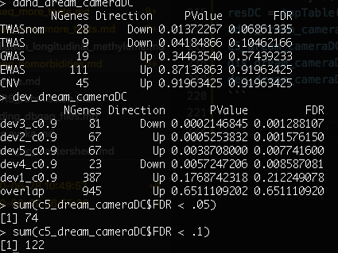
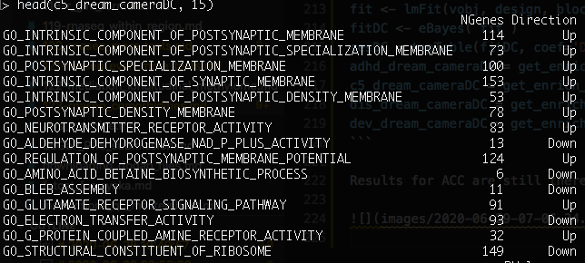
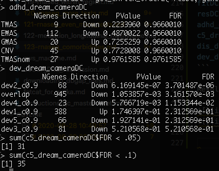
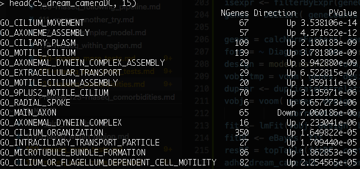
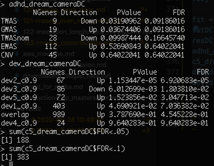
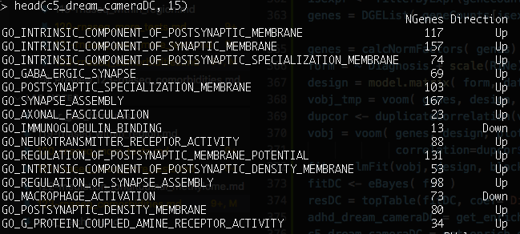
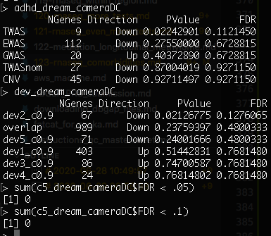

# 2020-06-28 10:49:57

Let's see how using comorbidities and substance abuse change our results. 

```r
data = readRDS('~/data/rnaseq_derek/complete_rawCountData_05132020.rds')
rownames(data) = data$submitted_name  # just to ensure compatibility later
rm_me = rownames(data) %in% c('68080')
data = data[!rm_me, ]
data = data[, !grepl(colnames(data), pattern='^ENS')]
more = readRDS('~/data/rnaseq_derek/data_from_philip_POP_and_PCs.rds')
more = more[!duplicated(more$hbcc_brain_id),]
data = data[!duplicated(data$hbcc_brain_id),]
data = merge(data, more[, c('hbcc_brain_id', 'comorbid', 'comorbid_group',
                            'substance', 'substance_group')],
             by='hbcc_brain_id', all.x=T, all.y=F)
# using the kmeans 3 clusters using 10 PCs result
imWNH = which(data$C1 > 0 & data$C2 < -.065)
dataWNH = data[imWNH, ]
```

At this point we have 60 subjects (most of them with both brain regions - 113
data points), and only 36 WNH.

```
> table(data$Diagnosis, data$comorbid_group)
         
          no yes
  Case    15  12
  Control 33   0
> table(dataWNH$Diagnosis, dataWNH$comorbid_group)
         
          no yes
  Case    13   8
  Control 15   0
```

The numbers above are in units of subjects. Because the comorbidity rate is much
higher in cases, it'd make sense to remove the people with comorbidity from the
analysis, instead of adding it as a covariate. We'd be losing a good chunk of
data, but I'm not sure how the models would run otherwise.

```
> table(data$Diagnosis, data$substance_group)
         
           0  1  2
  Case    14  7  6
  Control 33  0  0
> table(dataWNH$Diagnosis, dataWNH$substance_group)
         
           0  1  2
  Case    10  6  5
  Control 15  0  0
```

Same thing for substance abuse. I might need to remove them entirely. Let's see
what we get if I keep the data squeaky clean:

```r
datac = data[data$substance_group==0 & data$comorbid_group=='no',]
imWNH = which(datac$C1 > 0 & datac$C2 < -.065)
datacWNH = datac[imWNH, ]
```

```
> summary(datac$Diagnosis)
   Case Control 
      8      33 
> summary(datacWNH$Diagnosis)
   Case Control 
      6      15 
```

It's worth running it to see what happens. Or I can run it separately for each
cleaning. 

# 2020-06-29 06:55:38

The ACC results were quite robust for WNH, so let's do that:

```r
get_enrich_order2 = function( res, gene_sets ){
  if( !is.null(res$z.std) ){
    stat = res$z.std
  }else if( !is.null(res$F.std) ){
    stat = res$F.std
  }else if( !is.null(res$t) ){
    stat = res$t
  }else{
    stat = res$F
  }
  names(stat) = res$hgnc_symbol
  stat = stat[!is.na(names(stat))]
  # print(head(stat))
  index = ids2indices(gene_sets, names(stat))
  cameraPR( stat, index )
}
load('~/data/rnaseq_derek/adhd_genesets_philip.RDATA')
library(caret)
set.seed(42)
library(edgeR)
library(variancePartition)
library(BiocParallel)
library('biomaRt')
load('~/data/rnaseq_derek/c5_gene_sets.RData')
load('~/data/rnaseq_derek/brain_disorders_gene_sets.RData')
load('~/data/rnaseq_derek/data_for_alex.RData')
co = .9 
idx = anno$age_category==1 & anno$cutoff==co
genes_overlap = unique(anno[idx, 'anno_gene'])
for (s in 2:5) {
  idx = anno$age_category==s & anno$cutoff==co
  g2 = unique(anno[idx, 'anno_gene'])
  genes_overlap = intersect(genes_overlap, g2)
}
genes_unique = list()
for (s in 1:5) {
  others = setdiff(1:5, s)
  idx = anno$age_category==s & anno$cutoff==co
  g = unique(anno[idx, 'anno_gene'])
  for (s2 in others) {
    idx = anno$age_category==s2 & anno$cutoff==co
    g2 = unique(anno[idx, 'anno_gene'])
    rm_me = g %in% g2
    g = g[!rm_me]
  }
  genes_unique[[sprintf('dev%s_c%.1f', s, co)]] = unique(g)
}
genes_unique[['overlap']] = unique(genes_overlap)

library(BiocParallel)
param = SnowParam(32, "SOCK", progressbar=TRUE)
register(param)

myregion = 'ACC'
data = readRDS('~/data/rnaseq_derek/complete_rawCountData_05132020.rds')
rownames(data) = data$submitted_name  # just to ensure compatibility later
# remove obvious outlier that's NOT caudate labeled as ACC
rm_me = rownames(data) %in% c('68080')
data = data[!rm_me, ]
data = data[data$Region==myregion, ]
more = readRDS('~/data/rnaseq_derek/data_from_philip_POP_and_PCs.rds')
more = more[!duplicated(more$hbcc_brain_id),]
data = merge(data, more[, c('hbcc_brain_id', 'comorbid', 'comorbid_group',
                            'substance', 'substance_group')],
             by='hbcc_brain_id', all.x=T, all.y=F)
data = data[data$substance_group==0 & data$comorbid_group=='no',]

imWNH = which(data$C1 > 0 & data$C2 < -.065)
data = data[imWNH, ]

# have 19 super clean WNH subjects for ACC and 20 for Caudate
grex_vars = colnames(data)[grepl(colnames(data), pattern='^ENS')]
count_matrix = t(data[, grex_vars])
# data matrix goes on a diet...
data = data[, !grepl(colnames(data), pattern='^ENS')]
# remove that weird .num after ENSG
id_num = sapply(grex_vars, function(x) strsplit(x=x, split='\\.')[[1]][1])
rownames(count_matrix) = id_num
dups = duplicated(id_num)
id_num = id_num[!dups]
count_matrix = count_matrix[!dups, ]

mart <- useDataset("hsapiens_gene_ensembl", useMart("ensembl"))
G_list0 <- getBM(filters= "ensembl_gene_id", attributes= c("ensembl_gene_id",
                 "hgnc_symbol", "chromosome_name"),values=id_num,mart= mart)
# remove any genes without a HUGOID
G_list <- G_list0[!is.na(G_list0$hgnc_symbol),]
G_list = G_list[G_list$hgnc_symbol!='',]
# remove genes that appear more than once
G_list <- G_list[!duplicated(G_list$ensembl_gene_id),]
# keep only gene counts for genes that we have information
imnamed = rownames(count_matrix) %in% G_list$ensembl_gene_id
count_matrix = count_matrix[imnamed, ]

# some data variables modifications
data$POP_CODE = as.character(data$POP_CODE)
data[data$POP_CODE=='WNH', 'POP_CODE'] = 'W'
data[data$POP_CODE=='WH', 'POP_CODE'] = 'W'
data$POP_CODE = factor(data$POP_CODE)
data$Individual = factor(data$hbcc_brain_id)
data[data$Manner.of.Death=='Suicide (probable)', 'Manner.of.Death'] = 'Suicide'
data[data$Manner.of.Death=='unknown', 'Manner.of.Death'] = 'natural'
data$MoD = factor(data$Manner.of.Death)
data$batch = factor(as.numeric(data$run_date))

pp_order = c('zv', 'nzv')
pp = preProcess(t(count_matrix), method = pp_order)
X = predict(pp, t(count_matrix))
geneCounts = t(X)

# match gene counts to gene info
G_list2 = merge(rownames(geneCounts), G_list, by=1)
colnames(G_list2)[1] = 'ensembl_gene_id'

# keep only autosomal genes
imautosome = which(G_list2$chromosome_name != 'X' &
                   G_list2$chromosome_name != 'Y' &
                   G_list2$chromosome_name != 'MT')
geneCounts = geneCounts[imautosome, ]
G_list2 = G_list2[imautosome, ]

isexpr <- filterByExpr(geneCounts, group=data$Diagnosis)
genes = DGEList( geneCounts[isexpr,], genes=G_list2[isexpr,] ) 

genes = calcNormFactors( genes)
form = ~ Diagnosis + Sex + scale(RINe) + scale(PMI) + scale(Age) + MoD
design = model.matrix( form, data)
vobj_tmp = voom( genes, design, plot=FALSE)
dupcor <- duplicateCorrelation(vobj_tmp, design, block=data$batch)
vobj = voom( genes, design, plot=FALSE, block=data$batch,
             correlation=dupcor$consensus)
fit <- lmFit(vobj, design, block=data$batch, correlation=dupcor$consensus)
fitDC <- eBayes( fit )
resDC = topTable(fitDC, coef='DiagnosisControl', number=Inf) 
adhd_dream_cameraDC = get_enrich_order2( resDC, t2 ) 
c5_dream_cameraDC = get_enrich_order2( resDC, c5_all)
dis_dream_cameraDC = get_enrich_order2( resDC, disorders)
dev_dream_cameraDC = get_enrich_order2( resDC, genes_unique )
```

Results for ACC are still there, even though a bit more shy:




For Caudate it's OK. At least the developmental pattern is still there:




We're getting into a situation where no more women are left (ACC, but very also
happening with Caudate):

```
> table(data$Sex, data$Diagnosis)
   
    Case Control
  F    0       4
  M    6       9
```

I wonder if in this situation it wouldn't be better just to do a man-only
analysis. Or maybe check on the different groupings without combining them:

If I do substance group it doesn't help much:

```
> table(data$Sex, data$Diagnosis)
   
    Case Control
  F    0       4
  M    9       9
```

Same thing for comorbidities:

```
> table(data$Sex, data$Diagnosis)
   
    Case Control
  F    0       4
  M   13       9
```

What's the actual WNH number?

```
> table(data$Sex, data$Diagnosis)
   
    Case Control
  F    0       4
  M   19       9
```

For comparisons, using the entire ACC dataset before cleaning:

```
> table(data$Sex, data$Diagnosis)
   
    Case Control
  F    2       8
  M   23      22
```

and after cleaning:

```
> table(data$Sex, data$Diagnosis)
   
    Case Control
  F    0       8
  M    8      22
```


If I did a men-only analysis, what would happen? If anything, I could add some
sex chromosomes in there. First, without cleaning:

```r
myregion = 'ACC'
data = readRDS('~/data/rnaseq_derek/complete_rawCountData_05132020.rds')
rownames(data) = data$submitted_name  # just to ensure compatibility later
# remove obvious outlier that's NOT caudate labeled as ACC
rm_me = rownames(data) %in% c('68080')
data = data[!rm_me, ]
data = data[data$Region==myregion, ]
more = readRDS('~/data/rnaseq_derek/data_from_philip_POP_and_PCs.rds')
more = more[!duplicated(more$hbcc_brain_id),]
data = merge(data, more[, c('hbcc_brain_id', 'comorbid', 'comorbid_group',
                            'substance', 'substance_group')],
             by='hbcc_brain_id', all.x=T, all.y=F)
data = data[data$Sex=='M',]

imWNH = which(data$C1 > 0 & data$C2 < -.065)
data = data[imWNH, ]

# have 19 super clean WNH subjects for ACC and 20 for Caudate
grex_vars = colnames(data)[grepl(colnames(data), pattern='^ENS')]
count_matrix = t(data[, grex_vars])
# data matrix goes on a diet...
data = data[, !grepl(colnames(data), pattern='^ENS')]
# remove that weird .num after ENSG
id_num = sapply(grex_vars, function(x) strsplit(x=x, split='\\.')[[1]][1])
rownames(count_matrix) = id_num
dups = duplicated(id_num)
id_num = id_num[!dups]
count_matrix = count_matrix[!dups, ]

mart <- useDataset("hsapiens_gene_ensembl", useMart("ensembl"))
G_list0 <- getBM(filters= "ensembl_gene_id", attributes= c("ensembl_gene_id",
                 "hgnc_symbol", "chromosome_name"),values=id_num,mart= mart)
# remove any genes without a HUGOID
G_list <- G_list0[!is.na(G_list0$hgnc_symbol),]
G_list = G_list[G_list$hgnc_symbol!='',]
# remove genes that appear more than once
G_list <- G_list[!duplicated(G_list$ensembl_gene_id),]
# keep only gene counts for genes that we have information
imnamed = rownames(count_matrix) %in% G_list$ensembl_gene_id
count_matrix = count_matrix[imnamed, ]

# some data variables modifications
data$POP_CODE = as.character(data$POP_CODE)
data[data$POP_CODE=='WNH', 'POP_CODE'] = 'W'
data[data$POP_CODE=='WH', 'POP_CODE'] = 'W'
data$POP_CODE = factor(data$POP_CODE)
data$Individual = factor(data$hbcc_brain_id)
data[data$Manner.of.Death=='Suicide (probable)', 'Manner.of.Death'] = 'Suicide'
data[data$Manner.of.Death=='unknown', 'Manner.of.Death'] = 'natural'
data$MoD = factor(data$Manner.of.Death)
data$batch = factor(as.numeric(data$run_date))

pp_order = c('zv', 'nzv')
pp = preProcess(t(count_matrix), method = pp_order)
X = predict(pp, t(count_matrix))
geneCounts = t(X)

# match gene counts to gene info
G_list2 = merge(rownames(geneCounts), G_list, by=1)
colnames(G_list2)[1] = 'ensembl_gene_id'

isexpr <- filterByExpr(geneCounts, group=data$Diagnosis)
genes = DGEList( geneCounts[isexpr,], genes=G_list2[isexpr,] ) 

genes = calcNormFactors( genes)
form = ~ Diagnosis + scale(RINe) + scale(PMI) + scale(Age) + MoD
design = model.matrix( form, data)
vobj_tmp = voom( genes, design, plot=FALSE)
dupcor <- duplicateCorrelation(vobj_tmp, design, block=data$batch)
vobj = voom( genes, design, plot=FALSE, block=data$batch,
             correlation=dupcor$consensus)
fit <- lmFit(vobj, design, block=data$batch, correlation=dupcor$consensus)
fitDC <- eBayes( fit )
resDC = topTable(fitDC, coef='DiagnosisControl', number=Inf) 
adhd_dream_cameraDC = get_enrich_order2( resDC, t2 ) 
c5_dream_cameraDC = get_enrich_order2( resDC, c5_all)
dis_dream_cameraDC = get_enrich_order2( resDC, disorders)
dev_dream_cameraDC = get_enrich_order2( resDC, genes_unique )
```

ACC results strong as usual:




No much going for Caudate though, other than a nominal hit for TWAS:




