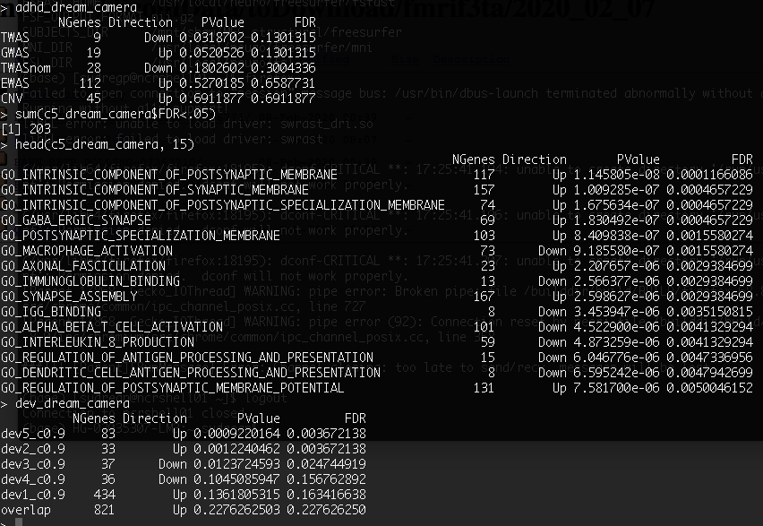

# 2020-06-30 07:39:42

After chatting with Philip, we decided to go with a male-only analysis because
of the numbers we were left with after reducing to WNH (0 females in cases). So,
we'll lead with within-region analysis for males only, then:

* add women WNH with sex as a covariate (removing sex genes?)
* add everyone using nested population cluster nested inside batch
* crop by substance abuse and comorbidities to show robustness

I imagine that for the last analysis I'll need dream, so I'll just go ahead and
use that for everything.

# 2020-07-02 16:44:22

```r
myregion = 'ACC'

get_enrich_order2 = function( res, gene_sets ){
  if( !is.null(res$z.std) ){
    stat = res$z.std
  }else if( !is.null(res$F.std) ){
    stat = res$F.std
  }else if( !is.null(res$t) ){
    stat = res$t
  }else{
    stat = res$F
  }
  names(stat) = res$hgnc_symbol
  stat = stat[!is.na(names(stat))]
  # print(head(stat))
  index = ids2indices(gene_sets, names(stat))
  cameraPR( stat, index )
}
load('~/data/rnaseq_derek/adhd_genesets_philip.RDATA')
library(caret)
set.seed(42)
library(edgeR)
library(variancePartition)
library(BiocParallel)
library('biomaRt')
load('~/data/rnaseq_derek/c5_gene_sets.RData')
load('~/data/rnaseq_derek/brain_disorders_gene_sets.RData')
load('~/data/rnaseq_derek/data_for_alex.RData')
if (myregion == 'ACC') {
    anno_region = 'Allen:10278'
} else {
    anno_region = 'Allen:10333'
}
co = .9 
idx = anno$age_category==1 & anno$cutoff==co & anno$structure_id==anno_region
genes_overlap = unique(anno[idx, 'anno_gene'])
for (s in 2:5) {
  idx = anno$age_category==s & anno$cutoff==co & anno$structure_id==anno_region
  g2 = unique(anno[idx, 'anno_gene'])
  genes_overlap = intersect(genes_overlap, g2)
}
genes_unique = list()
for (s in 1:5) {
  others = setdiff(1:5, s)
  idx = anno$age_category==s & anno$cutoff==co & anno$structure_id==anno_region
  g = unique(anno[idx, 'anno_gene'])
  for (s2 in others) {
    idx = anno$age_category==s2 & anno$cutoff==co & anno$structure_id==anno_region
    g2 = unique(anno[idx, 'anno_gene'])
    rm_me = g %in% g2
    g = g[!rm_me]
  }
  genes_unique[[sprintf('dev%s_c%.1f', s, co)]] = unique(g)
}
genes_unique[['overlap']] = unique(genes_overlap)

library(BiocParallel)
param = SnowParam(32, "SOCK", progressbar=TRUE)
register(param)

data = readRDS('~/data/rnaseq_derek/complete_rawCountData_05132020.rds')
rownames(data) = data$submitted_name  # just to ensure compatibility later
# remove obvious outlier that's NOT caudate labeled as ACC
rm_me = rownames(data) %in% c('68080')
data = data[!rm_me, ]
data = data[data$Region==myregion, ]
more = readRDS('~/data/rnaseq_derek/data_from_philip_POP_and_PCs.rds')
more = more[!duplicated(more$hbcc_brain_id),]
data = merge(data, more[, c('hbcc_brain_id', 'comorbid', 'comorbid_group',
                            'substance', 'substance_group')],
             by='hbcc_brain_id', all.x=T, all.y=F)

imWNH = which(data$C1 > 0 & data$C2 < -.065)
data = data[imWNH, ]
data = data[data$Sex=='M',]

# ACC: 19 cases and 9 controls, 18610 genes after cleaning
# Caudate: 17 cases and 11 controls, 18760 genes after cleaning
grex_vars = colnames(data)[grepl(colnames(data), pattern='^ENS')]
count_matrix = t(data[, grex_vars])
# data matrix goes on a diet...
data = data[, !grepl(colnames(data), pattern='^ENS')]
# remove that weird .num after ENSG
id_num = sapply(grex_vars, function(x) strsplit(x=x, split='\\.')[[1]][1])
rownames(count_matrix) = id_num
dups = duplicated(id_num)
id_num = id_num[!dups]
count_matrix = count_matrix[!dups, ]

mart <- useDataset("hsapiens_gene_ensembl", useMart("ensembl"))
G_list0 <- getBM(filters= "ensembl_gene_id", attributes= c("ensembl_gene_id",
                 "hgnc_symbol", "chromosome_name"),values=id_num,mart= mart)
# remove any genes without a HUGOID
G_list <- G_list0[!is.na(G_list0$hgnc_symbol),]
G_list = G_list[G_list$hgnc_symbol!='',]
# remove genes that appear more than once
G_list <- G_list[!duplicated(G_list$ensembl_gene_id),]
# keep only gene counts for genes that we have information
imnamed = rownames(count_matrix) %in% G_list$ensembl_gene_id
count_matrix = count_matrix[imnamed, ]

# some data variables modifications
data$POP_CODE = as.character(data$POP_CODE)
data[data$POP_CODE=='WNH', 'POP_CODE'] = 'W'
data[data$POP_CODE=='WH', 'POP_CODE'] = 'W'
data$POP_CODE = factor(data$POP_CODE)
data$Individual = factor(data$hbcc_brain_id)
data[data$Manner.of.Death=='Suicide (probable)', 'Manner.of.Death'] = 'Suicide'
data[data$Manner.of.Death=='unknown', 'Manner.of.Death'] = 'natural'
data$MoD = factor(data$Manner.of.Death)
data$batch = factor(as.numeric(data$run_date))

pp_order = c('zv', 'nzv')
pp = preProcess(t(count_matrix), method = pp_order)
X = predict(pp, t(count_matrix))
geneCounts = t(X)

# match gene counts to gene info
G_list2 = merge(rownames(geneCounts), G_list, by=1)
colnames(G_list2)[1] = 'ensembl_gene_id'

isexpr <- filterByExpr(geneCounts, group=data$Diagnosis)
genes = DGEList( geneCounts[isexpr,], genes=G_list2[isexpr,] ) 

genes = calcNormFactors( genes)

form = ~ Diagnosis + (1|batch) + scale(RINe) + scale(PMI) + scale(Age) + (1|MoD)
vobjMM = voomWithDreamWeights( genes, form, data, plot=FALSE)
fitmm = dream( vobjMM, form, data, ddf="Kenward-Roger")
resMM = topTable(fitmm, coef="DiagnosisControl", number=Inf) 
adhd_dream_camera = get_enrich_order2( resMM, t2 ) 
c5_dream_camera = get_enrich_order2( resMM, c5_all)
dis_dream_camera = get_enrich_order2( resMM, disorders)
dev_dream_camera = get_enrich_order2( resMM, genes_unique )
```

On a separate machine, I'll run the concurrent analysis for Caudate.


ACC results not as strong. For caudate it's what we normally get:


Let's see if it's an issue with running MoD as random, or maybe the sex genes?



Results look a bit better when not setting MoD as a random term. But for ACC the
distribution is a bit funky:


What if I do natural and other, and then I can be safe in running it as fixed.

```r
data$MoD2 = as.character(data$MoD)
data[data$MoD2!='natural','MoD2'] = 'other'
> table(data$MoD2)

natural   other 
     13      15 
data$MoD2 = factor(data$MoD2)
```

Didn't help much. 


