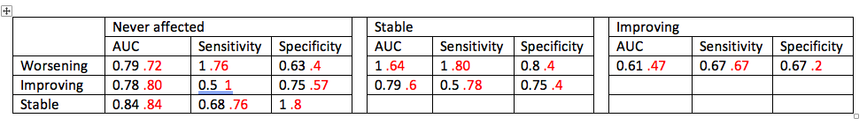
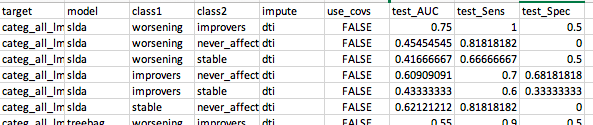
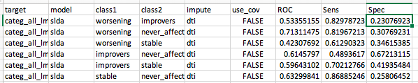

# 2020-07-10 10:48:36

Let's try to re-run the classification, but this time using the new groupings
Philip created:

```bash
my_dir=~/data/baseline_prediction
cd $my_dir
my_script=~/research_code/baseline_prediction/modelList_twoClass.R;
res_file=res2.csv;
sx="categ_all_lm";
imp='dti';
for cov in F T; do
    for clf in slda treebag svmRadialCost kernelpls; do
        for cs in "worsening improvers" "worsening never_affected" \
                "worsening stable" "improvers never_affected" \
                "improvers stable" "stable never_affected"; do
            Rscript $my_script ${my_dir}/gf_JULY_ols_definition_GS.csv $sx $cs $clf $imp 10 10 2 $cov $res_file;
        done;
    done;
done
```

# 2020-07-11 07:46:00

The stable vs worsening comparison doesn't have anyone for worsening in the test
set if we use the original split, so we can't compute AUC. Let me try the other
types of splits we did for robustness to see if anything else works

```bash
my_dir=~/data/baseline_prediction
cd $my_dir
my_script=~/research_code/baseline_prediction/modelList_twoClass_youngest.R;
res_file=res_youngest.csv;
sx="categ_all_lm";
imp='dti';
for cov in F T; do
    for clf in slda treebag svmRadialCost kernelpls; do
        for cs in "worsening improvers" "worsening never_affected" \
                "worsening stable" "improvers never_affected" \
                "improvers stable" "stable never_affected"; do
            Rscript $my_script ${my_dir}/gf_JULY_ols_definition_GS.csv $sx $cs $clf $imp 10 10 2 $cov $res_file;
        done;
    done;
done
```

Well, not never-affected vs worsening doesn't have anyone in the worsening
category... that's tricky. Let's see how else we can separate them.

If I do splitFirst then we have people in all testing groups. It comes with the
drawback of varying training sizes, but not sure if we have other options now.
Let's see how the results look then.

```bash
my_dir=~/data/baseline_prediction
cd $my_dir
my_script=~/research_code/baseline_prediction//modelList_twoClass_ROC_splitFirst.R;
res_file=res_splitFirst.csv;
sx="categ_all_lm";
imp='dti';
for cov in F T; do
    for clf in slda treebag svmRadialCost kernelpls; do
        for cs in "worsening improvers" "worsening never_affected" \
                "worsening stable" "improvers never_affected" \
                "improvers stable" "stable never_affected"; do
            Rscript $my_script ${my_dir}/gf_JULY_ols_definition_GS.csv $sx $cs $clf $imp 10 10 2 $cov $res_file;
        done;
    done;
done
```

Results weren't terribly impressive, especially in the within clinical group
comparisons:



What if I try splitFirst but keeping the youngest person in the family for
training?

```bash
my_dir=~/data/baseline_prediction
cd $my_dir
my_script=~/research_code/baseline_prediction//modelList_twoClass_ROC_splitFirstYoungTrain.R;
res_file=res_splitFirstYoungTrain.csv;
sx="categ_all_lm";
imp='dti';
for cov in F T; do
    for clf in slda treebag svmRadialCost kernelpls; do
        for cs in "worsening improvers" "worsening never_affected" \
                "worsening stable" "improvers never_affected" \
                "improvers stable" "stable never_affected"; do
            Rscript $my_script ${my_dir}/gf_JULY_ols_definition_GS.csv $sx $cs $clf $imp 10 10 2 $cov $res_file;
        done;
    done;
done
```

This was definitely not better:



Let me try some LOOCV:

```bash
my_dir=~/data/baseline_prediction
cd $my_dir
my_script=~/research_code/baseline_prediction/twoClass_LOOCV.R;
res_file=res_LOOCV.csv;
sx="categ_all_lm";
imp='dti';
for cov in F T; do
    for clf in slda treebag svmRadialCost kernelpls; do
        for cs in "worsening improvers" "worsening never_affected" \
                "worsening stable" "improvers never_affected" \
                "improvers stable" "stable never_affected"; do
            Rscript $my_script ${my_dir}/gf_JULY_ols_definition_GS.csv $sx $cs $clf $imp 2 $cov $res_file;
        done;
    done;
done
```

As expected, LOOCV were a bit more finer grained. Just not good enough:



I wonder how this would look in a 2vs2 approach?

```bash
my_dir=~/data/baseline_prediction
cd $my_dir
my_script=~/research_code/baseline_prediction/twoClass_2vs2.R;
res_file=res_2vs2.cv;
sx="categ_all_lm";
imp='dti';
for cov in F T; do
    for clf in slda treebag svmRadialCost kernelpls; do
        for cs in "worsening improvers" "worsening never_affected" \
                "worsening stable" "improvers never_affected" \
                "improvers stable" "stable never_affected"; do
            Rscript $my_script ${my_dir}/gf_JULY_ols_definition_GS.csv $sx $cs $clf $imp 2 $cov $res_file;
        done;
    done;
done
```

It just occurred to me that I don't really need to train the model using CV,
because we're not learning any parameters. Of course, that doesn't change the
previous results, just make them run faster. Because in the end the models were
trained with all the training data anyways. But I changed it in the rabalanced
script anyways.

Here, I'm gonna see if rebalancing teh training data has any effect on the
results... didn't help much. What if we do LOOCV, but just one per family?

```bash
my_dir=~/data/baseline_prediction
cd $my_dir
my_script=~/research_code/baseline_prediction/twoClass_LOOCV_older.R;
res_file=/dev/null.cv;
sx="categ_all_lm";
imp='dti';
cov=F;
clf=slda;
for cs in "worsening improvers" "worsening never_affected" \
        "worsening stable" "improvers never_affected" \
        "improvers stable" "stable never_affected"; do
    Rscript $my_script ${my_dir}/gf_JULY_ols_definition_GS.csv $sx $cs $clf $imp 2 $cov $res_file;
done;
```

Tried many different ways to split it, and different ordering of normalization
and imputation, to no avail. Maybe if we go back to a 10-10 CV, ignoring
families? That's because the old split seemd to work best, but it's not possible
anymore with the new categories.

# 2020-07-13 20:02:22

None of these different splits worked as intended. Let's just re-run the initial
split Philip liked and call it the day. I'll also add anat imputation just in
case something interesting comes out of that:

```bash
my_dir=~/data/baseline_prediction
cd $my_dir
my_script=~/research_code/baseline_prediction//modelList_twoClass_ROC_splitFirst.R;
res_file=res_splitFirstWithAnat.csv;
sx="categ_all_lm";
for imp in dti anat; do
    for cov in F T; do
        for clf in slda treebag svmRadialCost; do
            for cs in "worsening improvers" "worsening never_affected" \
                    "worsening stable" "improvers never_affected" \
                    "improvers stable" "stable never_affected"; do
                Rscript $my_script ${my_dir}/gf_JULY_ols_definition_GS.csv $sx $cs $clf $imp 10 10 2 $cov $res_file;
            done;
        done;
    done;
done
```

# 2020-07-14 13:04:12

Doing the same now but using base SX in the prediction.

```bash
my_dir=~/data/baseline_prediction
cd $my_dir
my_script=~/research_code/baseline_prediction//modelList_twoClass_ROC_splitFirst.R;
res_file=res_splitFirstWithAnatBaseINATTandHI.csv;
sx="categ_all_lm";
for imp in dti anat; do
    for cov in F T; do
        for clf in slda treebag svmRadialCost; do
            for cs in "worsening improvers" "worsening never_affected" \
                    "worsening stable" "improvers never_affected" \
                    "improvers stable" "stable never_affected"; do
                Rscript $my_script ${my_dir}/gf_JULY_ols_definition_GS.csv $sx $cs $clf $imp 10 10 2 $cov $res_file;
            done;
        done;
    done;
done
```

# 2020-07-15 10:46:17

I'm interested to see how well the model does with just base_sx. I'll use
base_Total just because it's more relevant to how the groups were constructed.
Also, I'll put in base_age to see how it fluctuates:

```bash
my_dir=~/data/baseline_prediction
cd $my_dir
my_script=~/research_code/baseline_prediction//modelList_twoClass_ROC_splitFirst.R;
res_file=res_splitFirst_baseAgebaseTotal.csv;
sx="categ_all_lm";
imp=dti;
clf=slda;
for cov in F T; do
    for cs in "worsening improvers" "worsening never_affected" \
              "worsening stable" "improvers never_affected" \
              "improvers stable" "stable never_affected"; do
        Rscript $my_script ${my_dir}/gf_JULY_ols_definition_GS.csv $sx $cs $clf $imp 10 10 2 $cov $res_file;
    done;
done
```

```bash
my_dir=~/data/baseline_prediction
cd $my_dir
my_script=~/research_code/baseline_prediction//modelList_twoClass_ROC_splitFirst.R;
res_file=res_splitFirst_baseAgebaseTotalOnly.csv;
sx="categ_all_lm";
imp=dti;
clf=slda;
cov=F;
for cs in "worsening improvers" "worsening never_affected" \
            "worsening stable" "improvers never_affected" \
            "improvers stable" "stable never_affected"; do
    Rscript $my_script ${my_dir}/gf_JULY_ols_definition_GS.csv $sx $cs $clf $imp 10 10 2 $cov $res_file;
done;
```

And let's run just the people Philip marked for matching on base_total:

```bash
my_dir=~/data/baseline_prediction
cd $my_dir
my_script=~/research_code/baseline_prediction//modelList_twoClass_ROC_splitFirst.R;
res_file=res_splitFirst_noBaseAgeTotalBalanced.csv;
sx="categ_all_lm";
imp=dti;
clf=slda;
for cov in F T; do
    for cs in "worsening improvers" "worsening never_affected" \
              "worsening stable" "improvers never_affected" \
              "improvers stable" "stable never_affected"; do
        Rscript $my_script ${my_dir}/gf_JULY_ols_definition_GS.csv $sx $cs $clf $imp 10 10 2 $cov $res_file;
    done;
done
```

And let's run just the symptoms, without anything else:

```bash
my_dir=~/data/baseline_prediction
cd $my_dir
my_script=~/research_code/baseline_prediction//modelList_twoClass_ROC_splitFirst.R;
res_file=res_splitFirst_justTotal.csv;
sx="categ_all_lm";
imp=dti;
clf=slda;
cov=F;
for cs in "worsening improvers" "worsening never_affected" \
            "worsening stable" "improvers never_affected" \
            "improvers stable" "stable never_affected"; do
    Rscript $my_script ${my_dir}/gf_JULY_ols_definition_GS.csv $sx $cs $clf $imp 10 10 2 $cov $res_file;
done
```

I actually had to run varImp without scaling to get the result of simply running
one variable, but that works too. 

# 2020-07-16 12:48:17

Let's run some more experiments with increasingly more variables.

```bash
my_dir=~/data/baseline_prediction
cd $my_dir
my_script=~/research_code/baseline_prediction//modelList_twoClass_ROC_splitFirst.R;
sx="categ_all_lm";
imp=dti;
clf=slda;
cov=F;
res_file=res_splitFirst_ageSexSESAll.csv;
for cs in "worsening improvers" "worsening stable" "improvers stable"; do
    Rscript $my_script ${my_dir}/gf_JULY_ols_definition_GS.csv $sx $cs $clf $imp 10 10 2 $cov $res_file;
done
```

And I can compare the ROC this way: 

```r
library(pROC)
roc.test(y_test, dat[,'stable'], dat_slim[, 'stable'])
# or
roc.test(y_test, dat[,'stable'], dat_all[, 'stable'], alternative='less', method='bootstrap', boot.n=10000)
```

# 2020-07-17 10:51:46

Let's run some more tests.

```bash
my_dir=~/data/baseline_prediction
cd $my_dir
my_script=~/research_code/baseline_prediction//modelList_twoClass_ROC_splitFirst.R;
sx="categ_all_lm";
imp=dti;
clf=slda;
cov=F;
res_file=res_splitFirst_ageSexAll_everADHD.csv;
for cs in "worsening improvers" "worsening never_affected" \
            "worsening stable" "improvers never_affected" \
            "improvers stable" "stable never_affected"; do
    Rscript $my_script ${my_dir}/DATA_JULY_2020.csv $sx $cs $clf $imp 10 10 2 $cov $res_file;
done;
res_file=res_splitFirst_ageSexAllageOnset.csv;
for cs in "worsening improvers" "worsening stable" "improvers stable"; do
    Rscript $my_script ${my_dir}/DATA_JULY_2020.csv $sx $cs $clf $imp 10 10 2 $cov $res_file;
done;
```

While I work on compiling the results, it's close between ageSexSESAll and
ageSexAll. While choosing the former gives the .2 spec result in worsening VS
stable, ageSexAll has the interesting result of showing that using the
additional phenotypes gives a marked difference over just base_sx. I might go
with ageSexAll then.

# 2020-07-18 09:31:25

More results for revision:

```bash
my_dir=~/data/baseline_prediction
cd $my_dir
my_script=~/research_code/baseline_prediction//modelList_twoClass_ROC_splitFirst.R;
sx="categ_all_lm";
imp=dti;
clf=svmRadialCost;
cov=F;
res_file=res_splitFirst_svmRadialCost.csv;
for cs in "worsening improvers" "worsening never_affected" \
            "worsening stable" "improvers never_affected" \
            "improvers stable" "stable never_affected"; do
    Rscript $my_script ${my_dir}/DATA_JULY_2020.csv $sx $cs $clf $imp 10 10 2 $cov $res_file;
done;
```

# 2020-07-20 10:27:26

```bash
my_dir=~/data/baseline_prediction
cd $my_dir
my_script=~/research_code/baseline_prediction//modelList_twoClass_ROC_splitFirst.R;
sx="categ_all_lm";
imp=dti;
clf=slda;
cov=F;
res_file=res_splitFirst_tmp3.csv;
for cs in "worsening improvers" "worsening never_affected" \
            "worsening stable" "improvers never_affected" \
            "improvers stable" "stable never_affected"; do
    Rscript $my_script ${my_dir}/DATA_JULY_2020.csv $sx $cs $clf $imp 10 10 2 $cov $res_file;
done;
```

# 2020-07-21 09:44:39

Not entirely sure what was going on, but I couldn't replicate the ageSexAll
results anymore. Maybe the function had way too many comments, so I re-wrote it
in a much slimmer version (twoClass_ROC_splitFirst.R) and let's re-run all
iterations.

I'll save everything into a new Excel file ML_results.xlsx, and I'll use the
same dataset Philip sent for univariate analysis on 07/18. I added the suffix
univar and fixed some variable names.

```bash
my_dir=~/data/baseline_prediction
cd $my_dir
my_script=~/research_code/baseline_prediction/twoClass_ROC_splitFirst.R;
sx="categ_all_lm";
imp=dti;
clf=slda;
cov=F;
res_file=resSlim_splitFirst_lastAge.csv;
for cs in "worsening improvers" "worsening never_affected" \
            "worsening stable" "improvers never_affected" \
            "improvers stable" "stable never_affected"; do
    Rscript $my_script ${my_dir}/DATA_JULY_2020_univar.csv $sx $cs $clf $imp $cov $res_file;
done;
```

SVM radial needs the old script because it needs CV for Cost function:

```bash
my_dir=~/data/baseline_prediction
cd $my_dir
my_script=~/research_code/baseline_prediction//modelList_twoClass_ROC_splitFirst.R;
sx="categ_all_lm";
imp=dti;
clf=treebag;
cov=F;
res_file=res_splitFirst_treebag.csv;
for cs in "worsening improvers" "worsening never_affected" \
            "worsening stable" "improvers never_affected" \
            "improvers stable" "stable never_affected"; do
    Rscript $my_script ${my_dir}/DATA_JULY_2020_univar.csv $sx $cs $clf $imp 10 10 2 $cov $res_file;
done;
```

# 2020-07-22 09:59:18

Let's see if we have better options than treebag:

```bash
my_dir=~/data/baseline_prediction
cd $my_dir
my_script=~/research_code/baseline_prediction//modelList_twoClass_ROC_splitFirst.R;
sx="categ_all_lm";
imp=dti;
clf=cforest;
cov=F;
res_file=res_splitFirst_cforest.csv;
for cs in "worsening improvers" "worsening never_affected" \
            "worsening stable" "improvers never_affected" \
            "improvers stable" "stable never_affected"; do
    Rscript $my_script ${my_dir}/DATA_JULY_2020_univar.csv $sx $cs $clf $imp 10 10 2 $cov $res_file;
done;
```
