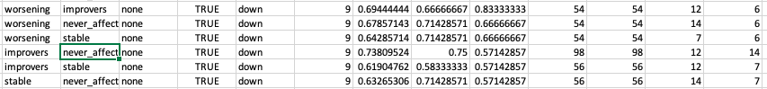

# 2020-07-23 13:10:02

Let's see if we can come up with similar numbers, starting with more recent
files.

Whatever I do, I should include the 3 columns in the same file I sent Philip:
in393, in362, hasPRS.

# 2020-07-24 20:30:21

I started from some files Philip had sent me (362_399).

Just some notes on how I'm re-creating the JHU tracts:

```bash
#bw
mydir=~/data/baseline_prediction/dti/
weighted_tracts=jhu_tracts_434.csv;
cd $mydir
row="id";
for t in ATR CST cin_cin cin_hip CC IFO ILF SLF unc SLFtemp; do
    for h in l r; do
        m=fa;
        row=${row}','${m}_${t}_${h};
    done;
done
echo $row > $weighted_tracts;
for m in `cat ~/tmp/m5.txt`; do
    echo ${m}
    3dresample -master ./${m}_tensor_diffeo_fa.nii.gz -prefix ./rois.nii \
                -inset ../../JHU_ICBM_tractsThr25_inAging.nii.gz \
                -rmode NN -overwrite 2>/dev/null &&
    row="${m}";
    for t in `seq 1 20`; do
        3dcalc -a rois.nii -expr "amongst(a, $t)" -prefix mask.nii \
            -overwrite 2>/dev/null &&
        fa=`3dmaskave -q -mask mask.nii ${m}_tensor_diffeo_fa.nii 2>/dev/null`;
        row=${row}','${fa};
    done
    echo $row >> $weighted_tracts;
done
```

# 2020-07-26 20:59:26

After recreating the data, here are some more ML results:

```bash
my_dir=~/data/baseline_prediction
cd $my_dir
my_script=~/research_code/baseline_prediction/twoClass_ROC_splitFirst.R;
sx="categ_all_lm";
imp=dti;
clf=slda;
cov=F;
res_file=res362_splitFirst_sexAgeAll_lastAge.csv;
for cs in "worsening improvers" "worsening never_affected" \
            "worsening stable" "improvers never_affected" \
            "improvers stable" "stable never_affected"; do
    Rscript $my_script ${my_dir}/FINAL_DATA_to_gs_JULY_26_2020b.csv $sx $cs $clf $imp $cov $res_file;
done;
```

# 2020-07-27 17:37:22

Let's maybe do some upsampling tests within the LOOCV framework:

```bash
my_dir=~/data/baseline_prediction
cd $my_dir
my_script=~/research_code/baseline_prediction/twoClass_ROC_experiments.R;
sx="categ_all_lm";
imp=dti;
clf=slda;
cov=F;
res_file=res362_LOOCV_up.csv;
for cs in "worsening improvers" "worsening never_affected" \
            "worsening stable" "improvers never_affected" \
            "improvers stable" "stable never_affected"; do
    Rscript $my_script ${my_dir}/FINAL_DATA_to_gs_JULY_26_2020b.csv $sx $cs $clf $imp $cov $res_file;
done;
```

# 2020-07-28 07:51:15

Running the new data through svm, treebag and cforest. They need CV:

```bash
my_dir=~/data/baseline_prediction
cd $my_dir
my_script=~/research_code/baseline_prediction//modelList_twoClass_ROC_splitFirst.R;
sx="categ_all_lm";
imp=dti;
clf=svmRadial;
cov=F;
res_file=res362_splitFirst_svmTest2.csv;
for cs in "worsening improvers" "worsening never_affected" \
            "worsening stable" "improvers never_affected" \
            "improvers stable" "stable never_affected"; do
    Rscript $my_script ${my_dir}/FINAL_DATA_to_gs_JULY_26_2020b.csv $sx $cs $clf $imp 10 10 2 $cov $res_file;
done;
```

# 2020-07-28 20:10:20

Philip sent a new final file, and let's see if it looks better if we either use
total sx for base or try the categories within sx.

```bash
my_dir=~/data/baseline_prediction
cd $my_dir
my_script=~/research_code/baseline_prediction/twoClass_ROC_experiments5.R;
sx="categ_all_lm.1";
imp=dti;
clf=slda;
cov=F;
res_file=res362_baseTotal.csv;
for cs in "worsening improvers" "worsening stable" "improvers stable"; do
    Rscript $my_script ${my_dir}/FINAL_DATA_JULY_26_2020_362_ONLY.csv $sx $cs $clf $imp $cov $res_file;
done;
```

Using SX_total, we get a bump from .5 to .88 in worsening VS improvers by using all phenotypes. The problem is that the two groups are too small, so it's only trend significant

```
> set.seed(42)
> roc.test(y_test, dat1[,'improvers'], dat[, 'improvers'], alternative='less', method='bootstrap', boot.n=10000)

 Bootstrap test for two correlated ROC curves

data:  dat1[, "improvers"] and dat[, "improvers"] by y_test (improvers, worsening)

D = -1.5295, boot.n = 10000, boot.stratified = 1, p-value = 0.06306

alternative hypothesis: true difference in AUC is less than 0

sample estimates:

AUC of roc1 AUC of roc2 

  0.5000000   0.8888889 
```

```bash
my_dir=~/data/baseline_prediction
cd $my_dir
my_script=~/research_code/baseline_prediction/twoClass_ROC_experiments5.R;
imp=dti;
clf=slda;
cov=F;
sx="categ_inatt_lm";
res_file=res362_baseInatt.csv;
for cs in "worsening improvers" "worsening stable" "improvers stable"; do
    Rscript $my_script ${my_dir}/FINAL_DATA_JULY_26_2020_362_ONLY.csv $sx $cs $clf $imp $cov $res_file;
done;
```

# 2020-07-31 15:14:36

We increased some of the numbers, so maybe cropFirst will work better now? Let's
check the baseline results with splitFirst:

```bash
my_dir=~/data/baseline_prediction
cd $my_dir
my_script=~/research_code/baseline_prediction/twoClass_ROC_splitFirst.R;
sx="categ_all_lm";
imp=dti;
clf=slda;
cov=F;
res_file=resFinal_splitFirst_sexAgeTotalAll.csv;
for cs in "worsening improvers" "worsening never_affected" \
            "worsening stable" "improvers never_affected" \
            "improvers stable" "stable never_affected"; do
    Rscript $my_script ${my_dir}/FINAL_DATA_07302020.csv $sx $cs $clf $imp $cov $res_file;
done;
```

```bash
my_dir=~/data/baseline_prediction
cd $my_dir
my_script=~/research_code/baseline_prediction//modelList_twoClass_ROC_splitFirst.R;
sx="categ_all_lm";
imp=dti;
cov=F;
clf=treebag;
res_file=resFinal_splitFirst_treebag.csv;
for cs in "worsening improvers" "worsening never_affected" \
            "worsening stable" "improvers never_affected" \
            "improvers stable" "stable never_affected"; do
    Rscript $my_script ${my_dir}/FINAL_DATA_07302020.csv $sx $cs $clf $imp 10 10 2 $cov $res_file;
done;
```

Maybe we'd do better if we go back to one vs all?

```bash
my_dir=~/data/baseline_prediction
cd $my_dir
my_script=~/research_code/baseline_prediction/twoClass_ROC_experiments3.R;
sx="categ_all_lm";
imp=dti;
clf=slda;
cov=F;
res_file=resFinal_splitFirst_oneVSallsexAgeTotalAll.csv;
for cs in "worsening" "improvers" "never_affected" "stable"; do
    Rscript $my_script ${my_dir}/FINAL_DATA_07302020.csv $sx $cs $clf $imp $cov $res_file;
done;
```

# 2020-08-02 09:56:13

Let's check if using standrd scores for Beery and PS help:

```bash
my_dir=~/data/baseline_prediction
cd $my_dir
my_script=~/research_code/baseline_prediction/twoClass_ROC_splitFirst.R;
sx="categ_all_lm";
imp=dti;
clf=slda;
cov=F;
res_file=resFinalSTD_splitFirst_tmp.csv;
for cs in "worsening improvers" "worsening never_affected" \
            "worsening stable" "improvers never_affected" \
            "improvers stable" "stable never_affected"; do
    Rscript $my_script ${my_dir}/FINAL_DATA_08022020.csv $sx $cs $clf $imp $cov $res_file;
done;
```

```bash
my_dir=~/data/baseline_prediction
cd $my_dir
my_script=~/research_code/baseline_prediction/twoClass_ROC_splitFirst_sandbox.R;
sx="categ_all_lm";
imp=dti;
clf=glmStepAIC;
cov=F;
res_file=resFinalSTD_splitFirst_tmp3.csv;
for cs in "worsening improvers" "worsening never_affected" \
            "worsening stable" "improvers never_affected" \
            "improvers stable" "stable never_affected"; do
    Rscript $my_script ${my_dir}/FINAL_DATA_08022020.csv $sx $cs $clf $imp $cov $res_file;
done;
```

Now that we somewhat decided we're going with knn upsamples, let's run the sx
contrast using the family test set:

```bash
my_dir=~/data/baseline_prediction
cd $my_dir
my_script=~/research_code/baseline_prediction/twoClass_ROC_splitFirst_sandbox.R;
sx="categ_all_lm";
imp=dti;
clf=slda;
cov=F;
res_file=resFinalSTD_splitFirst_tmp4.csv;
for cs in "worsening improvers" "worsening stable" "improvers stable"; do
    Rscript $my_script ${my_dir}/FINAL_DATA_08022020.csv $sx $cs $clf $imp $cov $res_file;
done;
```

Let's try focusing on optimizing the NV classification:

```bash
my_dir=~/data/baseline_prediction
cd $my_dir
my_script=~/research_code/baseline_prediction/twoClass_ROC_splitFirst_sandbox.R;
sx="categ_all_lm";
imp=dti;
clf=rf;
cov=F;
res_file=resFinalSTD_splitFirst_tmp5.csv;
for cs in "worsening never_affected" "improvers never_affected" \
          "stable never_affected"; do
    Rscript $my_script ${my_dir}/FINAL_DATA_08022020.csv $sx $cs $clf $imp $cov $res_file;
done;
```

# 2020-08-06 16:06:22

What if we impute before we split? 

```r
library(VIM)
data = read.csv('~/data/baseline_prediction/FINAL_DATA_08022020.csv')
data = data[data$pass2_58=='yes',]

set.seed(42)
my_vars = c(
              # PRS
              'ADHD_PRS0.000100', 'ADHD_PRS0.001000',
              'ADHD_PRS0.010000', 'ADHD_PRS0.050000',
              'ADHD_PRS0.100000', 'ADHD_PRS0.200000',
              'ADHD_PRS0.300000', 'ADHD_PRS0.400000',
              'ADHD_PRS0.500000',
              # DTI
              'atr_fa', 'cst_fa', 'cing_cing_fa', 'cing_hipp_fa', 'cc_fa',
              'ilf_fa', 'slf_fa', 'unc_fa', 'ifo_fa',
              #   demo
              'sex_numeric', 'base_age',
              # cog
              'FSIQ', 'SS_RAW', 'DS_RAW', 'PS_STD', 'VMI.beery_STD',
              # anat
              'cerbellum_white', 'cerebllum_grey', 'amygdala',
              'cingulate', 'lateral_PFC', 'OFC', 'striatum', 'thalamus'
              )

x = irmi(data[, my_vars])

data[, my_vars] = x[, 1:length(my_vars)]

write.csv(data, file='~/data/baseline_prediction/FINAL_DATA_08022020_IRMI.csv',
          row.names=F)
```

# 2020-08-07 07:43:10

None of the results are that good anymore, since the grouping based on lm. What
if we do lots of massaging beforehand? For example, PCA within domain?

```r
data = read.csv('~/data/baseline_prediction/FINAL_DATA_08022020_IRMI.csv')
library(nFactors)
var_names = c(# PRS
              'ADHD_PRS0.000100', 'ADHD_PRS0.001000',
              'ADHD_PRS0.010000', 'ADHD_PRS0.050000',
              'ADHD_PRS0.100000', 'ADHD_PRS0.200000',
              'ADHD_PRS0.300000', 'ADHD_PRS0.400000',
              'ADHD_PRS0.500000')
fm_str = sprintf('~ %s', paste0(var_names, collapse='+ ', sep=' '))
pca = prcomp(as.formula(fm_str), data[, var_names], scale=T,
             na.action=na.exclude)
eigs <- pca$sdev^2
nS = nScree(x=eigs)
keep_me = 1:nS$Components$nkaiser
mydata = data.frame(pca$x[, keep_me])
cnames = sapply(1:ncol(my_data), function(x) sprintf('PRS_%s', colnames(mydata)[x]))
colnames(mydata) = cnames
pc_data = mydata

var_names = c(# DTI
              'atr_fa', 'cst_fa', 'cing_cing_fa', 'cing_hipp_fa', 'cc_fa',
              'ilf_fa', 'slf_fa', 'unc_fa', 'ifo_fa')
fm_str = sprintf('~ %s', paste0(var_names, collapse='+ ', sep=' '))
pca = prcomp(as.formula(fm_str), data[, var_names], scale=T,
             na.action=na.exclude)
eigs <- pca$sdev^2
nS = nScree(x=eigs)
keep_me = 1:nS$Components$nkaiser
mydata = data.frame(pca$x[, keep_me])
colnames(mydata) = 'DTI_PC01'
pc_data = cbind(pc_data, mydata)

var_names = c(# cog
              'FSIQ', 'SS_RAW', 'DS_RAW', 'PS_STD', 'VMI.beery_STD')
fm_str = sprintf('~ %s', paste0(var_names, collapse='+ ', sep=' '))
pca = prcomp(as.formula(fm_str), data[, var_names], scale=T,
             na.action=na.exclude)
eigs <- pca$sdev^2
nS = nScree(x=eigs)
keep_me = 1:nS$Components$nkaiser
mydata = data.frame(pca$x[, keep_me])
cnames = sapply(1:ncol(my_data), function(x) sprintf('COG_%s', colnames(mydata)[x]))
colnames(mydata) = cnames
pc_data = cbind(pc_data, mydata)

var_names = c(# anat
              'cerbellum_white', 'cerebllum_grey', 'amygdala',
              'cingulate', 'lateral_PFC', 'OFC', 'striatum', 'thalamus')
fm_str = sprintf('~ %s', paste0(var_names, collapse='+ ', sep=' '))
pca = prcomp(as.formula(fm_str), data[, var_names], scale=T,
             na.action=na.exclude)
eigs <- pca$sdev^2
nS = nScree(x=eigs)
keep_me = 1:nS$Components$nkaiser
mydata = data.frame(pca$x[, keep_me])
cnames = sapply(1:ncol(my_data), function(x) sprintf('ANAT_%s', colnames(mydata)[x]))
colnames(mydata) = cnames
pc_data = cbind(pc_data, mydata)

data2 = cbind(data, pc_data)
write.csv(data2,
          file='~/data/baseline_prediction/FINAL_DATA_08022020_IRMI_PCs.csv',
          row.names=F, quote=F)
```

None of that is working... let's fire up multiple algorithms again and see if
any of them luck out.

```bash
my_dir=~/data/baseline_prediction
cd $my_dir
my_script=~/research_code/baseline_prediction/twoClass_ROC_splitFirst_sandbox.R;
sx="categ_all_lm";
imp=dti;
cov=F;
res_file=resFinalSTD_splitFirst_up.csv;
sfile=swarm.nvs;
for clf in `cat ~/research_code/clf_feature_selection_class_probs.txt`; do
    for cs in "worsening never_affected" "improvers never_affected" \
            "stable never_affected"; do
        echo "Rscript $my_script ${my_dir}/FINAL_DATA_08022020_IRMI.csv $sx $cs $clf $imp $cov $res_file;" >> $sfile;
    done;
done;

cat $sfile | parallel -j 30 --max-args=1 {};
```

Rscript ~/research_code/baseline_prediction/twoClass_ROC_splitFirst_sandbox.R \
FINAL_DATA_08022020_IRMI.csv categ_all_lm worsening never_affected svmLinear dti F \
resFinalSTD_splitFirst_up.csv;

For TPOT, I could try some sort of LOOCV:

```python
from tpot import TPOTClassifier
import pandas as pd
import numpy as np
from sklearn import preprocessing

comp='wn'
X = pd.read_csv('~/tmp/X_%s.csv' % comp)
y = pd.read_csv('~/tmp/y_%s.csv' % comp)
enc = preprocessing.OrdinalEncoder()
enc.fit(y)
y2 = enc.transform(y).ravel()
preds = []
probs = []
fout = open('/home/sudregp/tmp/%s_loocv.txt' % comp, 'w')
for i in range(len(y2)):
    X_test = np.array(X.iloc[i, :]).reshape(1, -1)
    y_test = y2[i]
    idx = [j for j in range(len(y2)) if j != i]
    X_train = X.iloc[idx, :]
    y_train = y2[idx]

    tpot = TPOTClassifier(generations=5, population_size=50, verbosity=2, random_state=42, scoring='roc_auc')
    # tpot = TPOTClassifier(verbosity=2, random_state=42, scoring='roc_auc', n_jobs=30, use_dask=False)
    tpot.fit(X_train, y_train)
    preds.append(tpot.predict(X_test)[0])
    probs.append(tpot.predict_proba(X_test)[0])
    fout.write('%d,%d,%d,%.3f,%.3f\n' % (i, y_test, preds[-1],
                                         probs[-1][0], probs[-1][1]))
fout.close()
```

I could potentially also set the pipe to append and run this in a swarm. Maybe
in the future, when I'm done running the swarms for methylation. The default
pipeline is taking under 30min per LO. Under 5min for the short one. 

So I created run_tpot_loocv.py to deal with that. Then, to run it's just:

```bash
mydir=~/data/baseline_prediction
jname=tpot_loocv
sfile=swarm.${jname}
cd ${mydir}
rm -rf $sfile
s='sn';
for i in {0..99}; do
    echo "python ~/research_code/baseline_prediction/run_tpot_loocv.py $s $i;" >> $sfile;
done
s='wn';
for i in {0..96}; do
    echo "python ~/research_code/baseline_prediction/run_tpot_loocv.py $s $i;" >> $sfile;
done
s='in';
for i in {0..117}; do
    echo "python ~/research_code/baseline_prediction/run_tpot_loocv.py $s $i;" >> $sfile;
done
swarm -g 12 -t 32 --job-name ${jname} --time 2:00:00 -f $sfile \
    -m python --partition quick,norm --logdir trash
```

# 2020-08-10 14:51:17

Let's code the distance sampling idea. Starting with the worsening class (the
smallest), we have 24 kids. So, say we put 3 kids in training for each kid in
testing. That would leave 6 kids for testing and 18 in training. Let's start
with the smallest distance between kids and go from there. But it turns out that
we have all class numbers divisible by 3...

```
> table(data$categ_all_lm)

     improvers never_affected         stable      worsening 
            45             72             27             24 
```

So, let's redo the ratios to always work:

```r
X_train = c()
X_test = c()
# this refers to X
candidates = which(y=='worsening')

while (length(candidates) >= 3) {
    X_group = scale(X[candidates,])
    # all indexes refer to X_group!
    dists = dist(data.frame(X_group), upper=T)
    closest = which(as.matrix(dists)==min(dists), arr.ind=T)
    X_test = rbind(X_test, X_group[closest[1], ])
    # get the kids most similar to our testing kid
    s = sort(as.matrix(dists)[closest[1],], index.return=T)
    # the first is always zero... select kids not chosen yet
    cnt = 2
    chosen = c()
    while ((length(chosen) < 2) && (cnt <= nrow(X_group))) {
        chosen = c(chosen, s$ix[cnt])
        cnt = cnt + 1
    }
    X_train = rbind(X_train, X_group[chosen,])
    # need to remove candidates based on X!
    candidates = candidates[-c(closest[1], chosen)]
    print(c(closest[1], chosen))
}
```

# 2020-08-11 06:44:41

Let's see if this new distance sampling makes any difference:

```bash
my_dir=~/data/baseline_prediction
cd $my_dir
my_script=~/research_code/baseline_prediction/twoClass_ROC_irmi_distance.R;
sx="categ_all_lm";
imp=dti;
cov=F;
res_file=resSTD_dist_irmi_nc_svms.csv;
for clf in svmLinear svmRadialCost; do
    for nc in 3 4 5; do
        for cs in "worsening never_affected" "improvers never_affected" \
                "stable never_affected"; do
            Rscript $my_script ${my_dir}/FINAL_DATA_08072020_IRMI.csv $sx $cs $clf $imp $cov $res_file $nc;
        done;
    done;
done
```

Now that I have a few selections, let's see how the clinical groups look:

```bash
my_dir=~/data/baseline_prediction
cd $my_dir
my_script=~/research_code/baseline_prediction/twoClass_ROC_irmi_distance.R;
sx="categ_all_lm";
imp=dti;
cov=F;
res_file=resSTD_dist_irmi_nc_clin.csv;
clf=rf;
for cs in "worsening improvers" "worsening never_affected" \
            "worsening stable" "improvers never_affected" \
            "improvers stable" "stable never_affected"; do
    Rscript $my_script ${my_dir}/FINAL_DATA_08072020_IRMI.csv $sx $cs $clf $imp $cov $res_file 5;
done
```

# 2020-08-12 06:55:35

Let's also try some multi class analysis:

```bash
my_dir=~/data/baseline_prediction
cd $my_dir
my_script=~/research_code/baseline_prediction/multiClass_ROC_irmi_distance.R;
sx="categ_all_lm";
imp=dti;
cov=F;
res_file=resMultiSTD_dist_irmi_clin.csv;
clf=slda;
for clf in rf cforest; do
clf=slda;
    for nc in 3 4 5; do
        for rs in up down SMOTE; do
            Rscript $my_script ${my_dir}/FINAL_DATA_08072020_IRMI.csv $sx $clf $imp $cov $res_file $nc $rs;
        done
    done
done
```

Let's run the other tests for reviewers:

```bash
my_dir=~/data/baseline_prediction
cd $my_dir
my_script=~/research_code/baseline_prediction/twoClass_ROC_irmi_distance.R;
sx="categ_all_lm";
imp=dti;
cov=F;
res_file=resReviewersSTD_dist_irmi_weights.csv;
clf=cforest;
nc=5;
for cs in "worsening improvers" "worsening stable" "improvers stable"; do
    Rscript $my_script ${my_dir}/FINAL_DATA_08072020_IRMI.csv $sx $cs $clf $imp $cov $res_file $nc;
done
for cs in "worsening improvers" "worsening never_affected" \
            "worsening stable" "improvers never_affected" \
            "improvers stable" "stable never_affected"; do
    Rscript $my_script ${my_dir}/FINAL_DATA_08072020_IRMI.csv $sx $cs $clf $imp $cov $res_file $nc;
done
```

# 2020-08-13 11:09:43

For comparing the dats with and without Sx, I made a few changes to the
resulting dat in the code before concatenating them. This way we can compare
them across all comparisons after rbinding them:

```r
dat1 = dat
dat1$obs = factor(as.numeric(dat1$obs))
dat1$pred = factor(as.numeric(dat1$pred))
colnames(dat1)[3:4] = c('1', '2')
```

Just remember to concatenate the comparisons in the same order!

```r
library(pROC)
set.seed(42)
roc.test(all_dat[,'obs'], sx_dat[,'1'], all_dat[, '1'], alternative='less',
         method='bootstrap', boot.n=10000)
```

# 2020-08-18 06:48:01

There was an issue that not everyone in pass2_58 had DTI. So, I'll need to re-impute:

```r
library(VIM)
data = read.csv('~/data/baseline_prediction/FINAL_DATA_08072020.csv')
data = data[data$pass2_58=='yes',]
data = data[!is.na(data$slf_fa),]

set.seed(42)
my_vars = c(
              # PRS
              'ADHD_PRS0.000100', 'ADHD_PRS0.001000',
              'ADHD_PRS0.010000', 'ADHD_PRS0.050000',
              'ADHD_PRS0.100000', 'ADHD_PRS0.200000',
              'ADHD_PRS0.300000', 'ADHD_PRS0.400000',
              'ADHD_PRS0.500000',
              # DTI
              'atr_fa', 'cst_fa', 'cing_cing_fa', 'cing_hipp_fa', 'cc_fa',
              'ilf_fa', 'slf_fa', 'unc_fa', 'ifo_fa',
              #   demo
              'sex_numeric', 'base_age', 'last_age',
              # cog
              'FSIQ', 'SS_RAW', 'DS_RAW', 'PS_STD', 'VMI.beery_STD',
              # anat
              'cerbellum_white', 'cerebllum_grey', 'amygdala',
              'cingulate', 'lateral_PFC', 'OFC', 'striatum', 'thalamus'
              )

x = irmi(data[, my_vars])

data[, my_vars] = x[, 1:length(my_vars)]

write.csv(data, file='~/data/baseline_prediction/FINAL_DATA_08182020_IRMI.csv',
          row.names=F)
```

And we re-run the tests:

```bash
my_dir=~/data/baseline_prediction
cd $my_dir
my_script=~/research_code/baseline_prediction/twoClass_ROC_irmi_distance.R;
sx="categ_all_lm";
imp=dti;
cov=F;
res_file=resReviewersSTD_dist_irmi_166.csv;
clf=cforest;
nc=5;
# for cs in "worsening improvers" "worsening stable" "improvers stable"; do
#     Rscript $my_script ${my_dir}/FINAL_DATA_08072020_IRMI.csv $sx $cs $clf $imp $cov $res_file $nc;
# done
for cs in "worsening improvers" "worsening never_affected" \
            "worsening stable" "improvers never_affected" \
            "improvers stable" "stable never_affected"; do
    Rscript $my_script ${my_dir}/FINAL_DATA_08072020.csv $sx $cs $clf $imp $cov $res_file $nc;
done
```

We took some big hits... let's see if we impute on anatomy:

```r
library(VIM)
data = read.csv('~/data/baseline_prediction/FINAL_DATA_08072020.csv')
data = data[!is.na(data$cerebllum_grey),]

set.seed(42)
my_vars = c(
              # PRS
              'ADHD_PRS0.000100', 'ADHD_PRS0.001000',
              'ADHD_PRS0.010000', 'ADHD_PRS0.050000',
              'ADHD_PRS0.100000', 'ADHD_PRS0.200000',
              'ADHD_PRS0.300000', 'ADHD_PRS0.400000',
              'ADHD_PRS0.500000',
              # DTI
              'atr_fa', 'cst_fa', 'cing_cing_fa', 'cing_hipp_fa', 'cc_fa',
              'ilf_fa', 'slf_fa', 'unc_fa', 'ifo_fa',
              #   demo
              'sex_numeric', 'base_age', 'last_age',
              # cog
              'FSIQ', 'SS_RAW', 'DS_RAW', 'PS_STD', 'VMI.beery_STD',
              # anat
              'cerbellum_white', 'cerebllum_grey', 'amygdala',
              'cingulate', 'lateral_PFC', 'OFC', 'striatum', 'thalamus'
              )

x = irmi(data[, my_vars], imp_var=FALSE)

data[, my_vars] = x[, 1:length(my_vars)]

write.csv(data, file='~/data/baseline_prediction/FINAL_DATA_08182020_anatIRMI.csv',
          row.names=F)
```

```bash
my_dir=~/data/baseline_prediction
cd $my_dir
my_script=~/research_code/baseline_prediction/twoClass_ROC_irmi_distance.R;
sx="categ_all_lm";
imp=dti;
cov=F;
res_file=resReviewersSTD_dist_irmi_267.csv;
clf=cforest;
nc=5;
# for cs in "worsening improvers" "worsening stable" "improvers stable"; do
#     Rscript $my_script ${my_dir}/FINAL_DATA_08072020_IRMI.csv $sx $cs $clf $imp $cov $res_file $nc;
# done
for cs in "worsening improvers" "worsening never_affected" \
            "worsening stable" "improvers never_affected" \
            "improvers stable" "stable never_affected"; do
    Rscript $my_script ${my_dir}/FINAL_DATA_08182020_anatIRMI.csv $sx $cs $clf $imp $cov $res_file $nc;
done
```

Let's try some tests without imputation:

```bash
my_dir=~/data/baseline_prediction
cd $my_dir
my_script=~/research_code/baseline_prediction/twoClass_ROC_irmi_distance.R;
sx="categ_all_lm";
imp=none;
cov=F;
res_file=resSTD362_dist_irmi6.csv;
clf=cforest;
for nc in {3..10}; do
    for rs in up down SMOTE; do
        for cs in "worsening improvers" "worsening never_affected" \
                "worsening stable" "improvers never_affected" \
                "improvers stable" "stable never_affected"; do
            Rscript $my_script ${my_dir}/FINAL_DATA_08072020.csv $sx $cs $clf $imp $cov $res_file $nc $rs;
        done;
    done;
done
```

```bash
my_dir=~/data/baseline_prediction
cd $my_dir
my_script=~/tmp/twoClass_ROC_irmi_distance7.R;
sx="categ_all_lm";
imp=none;
cov=T;
res_file=resSTD362_dist_irmi_7_cov.csv;
clf=cforest;
for nc in {3..10}; do
    for rs in up down SMOTE; do
        for cs in "worsening improvers" "worsening never_affected" \
                "worsening stable" "improvers never_affected" \
                "improvers stable" "stable never_affected"; do
            Rscript $my_script ${my_dir}/FINAL_DATA_08072020.csv $sx $cs $clf $imp $cov $res_file $nc $rs;
        done;
    done;
done
```

Let's grab some varImps:

```bash
my_dir=~/data/baseline_prediction
cd $my_dir
my_script=~/research_code/baseline_prediction/twoClass_ROC_irmi_distance.R;
sx="categ_all_lm";
imp=none;
cov=T;
res_file=resSTD362_dist_irmi_weights.csv;
clf=cforest;
nc=9;
rs=down;
for cs in "worsening improvers" "worsening never_affected" \
            "worsening stable" "improvers never_affected" \
            "improvers stable" "stable never_affected"; do
    Rscript $my_script ${my_dir}/FINAL_DATA_08072020.csv $sx $cs $clf $imp $cov $res_file $nc $rs;
done
```

# 2020-08-20 07:49:59

Running the analysis for the response to reviewers again:

```bash
my_dir=~/data/baseline_prediction
cd $my_dir
my_script=~/research_code/baseline_prediction/twoClass_ROC_distance.R;
sx="categ_all_lm";
imp=none;
cov=T;
res_file=resReviewersSTD_dist.csv;
clf=cforest;
nc=9;
rs=down;
for cs in "worsening improvers" "worsening stable" "improvers stable"; do
    Rscript $my_script ${my_dir}/FINAL_DATA_08072020.csv $sx $cs $clf $imp $cov $res_file $nc $rs;
done
for cs in "worsening improvers" "worsening never_affected" \
            "worsening stable" "improvers never_affected" \
            "improvers stable" "stable never_affected"; do
    Rscript $my_script ${my_dir}/FINAL_DATA_08072020.csv $sx $cs $clf $imp $cov $res_file $nc $rs;
done
```

And we run something similar but for svmLinear and slda to see what works best:

```bash
my_dir=~/data/baseline_prediction
cd $my_dir
my_script=~/research_code/baseline_prediction/twoClass_ROC_irmi_distance.R;
sx="categ_all_lm";
imp=none;
cov=T;
res_file=resReviewersSTD_dist_postIRMI.csv;
nc=9;
rs=down;
for clf in svmLinear slda; do
    for cs in "worsening improvers" "worsening never_affected" \
                "worsening stable" "improvers never_affected" \
                "improvers stable" "stable never_affected"; do
        Rscript $my_script ${my_dir}/FINAL_DATA_08072020.csv $sx $cs $clf $imp $cov $res_file $nc $rs;
    done
done
```

# 2020-08-24 07:41:00

Some more analysis:

```bash
my_dir=~/data/baseline_prediction
cd $my_dir
my_script=~/research_code/baseline_prediction/twoClass_ROC_distance_singlePredictor.R;
sx="categ_all_lm";
imp=none;
cov=F;
res_file=resReviewersSTD_dist_sx.csv;
clf=cforest;
nc=9;
rs=down;
for cs in "worsening improvers" "worsening stable" "improvers stable"; do
    Rscript $my_script ${my_dir}/FINAL_DATA_08072020.csv $sx $cs $clf $imp $cov $res_file $nc $rs;
done
```

And then I did some roc.test:

```
> roc_all = roc(dat$obs, dat[, levels(dat$obs)[1]], direction = ">")
Setting levels: control = improvers, case = stable
> roc_sx = roc(dat_sx$obs, dat_sx[, levels(dat$obs)[1]], direction = ">")
Setting levels: control = improvers, case = stable
> roc_all

Call:
roc.default(response = dat$obs, predictor = dat[, levels(dat$obs)[1]],     direction = ">")

Data: dat[, levels(dat$obs)[1]] in 12 controls (dat$obs improvers) > 7 cases (dat$obs stable).
Area under the curve: 0.8333
> roc_sx

Call:
roc.default(response = dat_sx$obs, predictor = dat_sx[, levels(dat$obs)[1]],     direction = ">")

Data: dat_sx[, levels(dat$obs)[1]] in 12 controls (dat_sx$obs improvers) > 7 cases (dat_sx$obs stable).
Area under the curve: 0.5952
> set.seed(2020)
> roc.test(roc_all, roc_sx, alternative='greater', method='bootstrap', boot.n=10000)
  |======================================================================| 100%

	Bootstrap test for two correlated ROC curves

data:  roc_all and roc_sx
D = 1.6425, boot.n = 10000, boot.stratified = 1, p-value = 0.05025
alternative hypothesis: true difference in AUC is greater than 0
sample estimates:
AUC of roc1 AUC of roc2 
  0.8333333   0.5952381 
```

# 2020-08-27 19:46:43

We ran the univariate and ML analyses differently again. Philip ran only the 166
DTI and I ran everyone. HE sent me a new file (FINAL_DATA_08162020_short.csv),
which I changed to make everyone not in pass2_58 to have NaN for DTI and its
covariates (FINAL_DATA_08162020_short_cleanDTI.csv). Then, re-ran all the ML.

```bash
my_dir=~/data/baseline_prediction
cd $my_dir
my_script=~/research_code/baseline_prediction/twoClass_ROC_distance.R;
sx="categ_all_lm";
imp=none;
cov=T;
res_file=resReviewersSTD_dist_cleanDTI.csv;
clf=cforest;
nc=10;
rs=down;
for cs in "worsening improvers" "worsening stable" "improvers stable"; do
    Rscript $my_script ${my_dir}/FINAL_DATA_08162020_short_cleanDTI.csv $sx $cs $clf $imp $cov $res_file $nc $rs;
done
for cs in "worsening improvers" "worsening never_affected" \
            "worsening stable" "improvers never_affected" \
            "improvers stable" "stable never_affected"; do
    Rscript $my_script ${my_dir}/FINAL_DATA_08162020_short_cleanDTI.csv $sx $cs $clf $imp $cov $res_file $nc $rs;
done
```

Apparently running just 166 DTI broke the results...



Let's run all the permutation again to see if there is a better parameter to go
with.

```bash
my_dir=~/data/baseline_prediction
cd $my_dir
my_script=~/research_code/baseline_prediction/twoClass_ROC_distance.R;
sx="categ_all_lm";
imp=none;
cov=T;
res_file=resReviewersSTD_dist_cleanDTI.csv;
clf=cforest;
nc=9;
rs=down;
# for cs in "worsening improvers" "worsening stable" "improvers stable"; do
#     Rscript $my_script ${my_dir}/FINAL_DATA_08072020.csv $sx $cs $clf $imp $cov $res_file $nc $rs;
# done
for rs in down up SMOTE; do
    for nc in {3..6}; do 
        for cs in "worsening improvers" "worsening never_affected" \
                    "worsening stable" "improvers never_affected" \
                    "improvers stable" "stable never_affected"; do
            Rscript $my_script ${my_dir}/FINAL_DATA_08162020_short_cleanDTI.csv $sx $cs $clf $imp $cov $res_file $nc $rs;
        done;
    done;
done;
```

```bash
my_dir=~/data/baseline_prediction
cd $my_dir
my_script=~/research_code/baseline_prediction/twoClass_ROC_irmi_distance.R;
sx="categ_all_lm";
imp=none;
cov=T;
res_file=resReviewersSTD_dist_postIRMI.csv;
nc=10;
rs=down;
for clf in svmLinear slda; do
    for cs in "worsening improvers" "worsening never_affected" \
                "worsening stable" "improvers never_affected" \
                "improvers stable" "stable never_affected"; do
        Rscript $my_script ${my_dir}/FINAL_DATA_08162020_short_cleanDTI.csv $sx $cs $clf $imp $cov $res_file $nc $rs;
    done
done
```

* use only oldest in family?
* try TPOT with balanced accuracy?
* try autoML?
* trying tpot
* maybe tpot LOOCV?
* hand pick train, dev, and test sets based on some parameter that equally
  samples the distribution? maybe don't need dev test?
* maybe try to downsample NV class based on maximal dissimilarity, then CV
  within that new sample
* play more with different classifiers and class balancing using the PC data
* try using single test set again
* try PC within the 2 classes only
* try adding covariates to PC


roc.test(y_test, dat_all[,'improvers'], dat[, 'improvers'], alternative='greater', method='bootstrap', boot.n=10000)