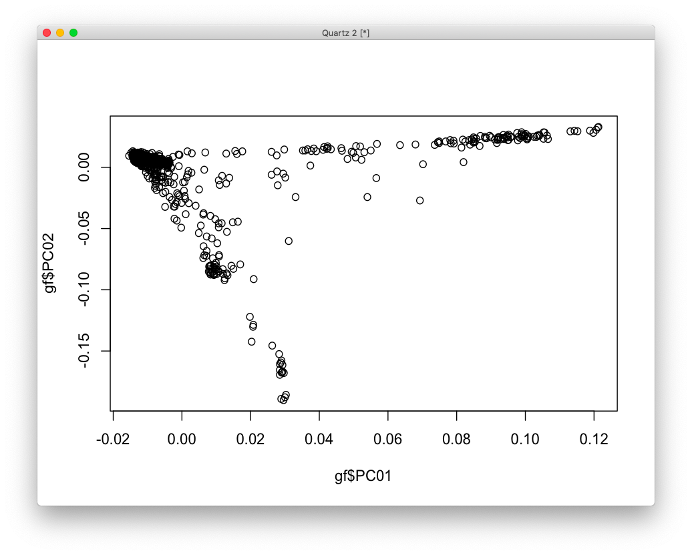

# 2020-09-04 07:01:22

Kwangmi handed me the newly cleaned genotyping for all our cohort. It's in
/NCR_SBRB/Ahn/genotying/allfamily_clean2_geno0.05_mind0.02_geno0.02_hwe_finalQC
and it also includes a README file. Let's use that for 1KG imputation.

```bash
cd /data/NCR_SBRB/NCR_genomics/genotyping/
mkdir v3
cd v3
cp /data//NCR_SBRB/Ahn/genotying/allfamily_clean2_geno0.05_mind0.02_geno0.02_hwe_finalQC* .
cp /data//NCR_SBRB/Ahn/genotying/readme.chip.txt .
```

Before I do that, let's change Kwangmi's file because it has MRNs. I'll just use
Labmatrix IDs instead so we can send it to Michigan.

```bash
cut -d" " -f 1,2 allfamily_clean2_geno0.05_mind0.02_geno0.02_hwe_finalQC.fam > mrns.txt
# clean up locally and attached Labmatrix SID
module load plink
plink --bfile allfamily_clean2_geno0.05_mind0.02_geno0.02_hwe_finalQC \
    --update-ids mrns2sids.txt --make-bed --out NCR_v3
```

Going back to setting up the files for imputation

```bash
module load vcftools
module load plink
for i in {1..22}; do
    plink --bfile NCR_v3 --chr $i --recode vcf --out NCR_v3_chr"$i";
    vcf-sort NCR_v3_chr"$i".vcf | bgzip -c > NCR_v3_chr"$i".vcf.gz
done
```

I'll try to just upload these and see if they work, otherwise I might need to flip some alleles.

No go... more than 100 obvious strand flips, so let's use shape it. The first
time I ran it I had issues with duplicates, so let's clean that up first.

```bash
plink --bfile NCR_v3 --list-duplicate-vars ids-only suppress-first
plink --bfile NCR_v3 --exclude plink.dupvar --make-bed --out NCR_v3_noDups
for i in {1..22}; do
    plink --bfile NCR_v3_noDups --chr $i --recode vcf --out NCR_v3_noDups_chr"$i";
    vcf-sort NCR_v3_noDups_chr"$i".vcf | bgzip -c > NCR_v3_noDups_chr"$i".vcf.gz
done
```

```bash
module load shapeit/2.r904
refdir=/fdb/impute2/1000Genomes_Phase3_integrated_haplotypes_Oct2014/1000GP_Phase3/
for c in {1..22}; do
    shapeit -check -T 16 -V NCR_v3_noDups_chr${c}.vcf.gz \
        --input-ref $refdir/1000GP_Phase3_chr${c}.hap.gz \
        $refdir/1000GP_Phase3_chr${c}.legend.gz $refdir/1000GP_Phase3.sample \
        --output-log chr${c}.alignments;
done
# format the files:
for c in {1..22}; do
    grep Strand chr${c}.alignments.snp.strand | cut -f 4 | sort | uniq >> flip_snps.txt;
    grep Missing chr${c}.alignments.snp.strand | cut -f 4 | sort | uniq >> missing_snps.txt;
done
plink --bfile NCR_v3_noDups --flip flip_snps.txt \
    --exclude missing_snps.txt --make-bed --out NCR_v3_noDups_flipped
#reconstruct the VCFs as above to send it to the imputation server.
for i in {1..22}; do
    plink --bfile NCR_v3_noDups_flipped --chr ${i} --recode-vcf \
        --out NCR_v3_noDups_flipped_chr${i};
    vcf-sort NCR_v3_noDups_flipped_chr"$i".vcf | bgzip \
        -c > NCR_v3_noDups_flipped_chr"$i".vcf.gz
done
```

And then we try the imputation server again.

The plan now is to use PrediXcanAssociation.py in the ABCD and NCR imputed data.
The question is on what the phenotypes and covariates should be. Let's go for
everADHD, ADHD, age, sex, population code, and the 10 population PCs.

Then we can somewhow analyze whether there is an overlap between variants that
are significant between post-mortem and either ABCD or NCR. It'd have to be a
big enough overlap set, verified by some sort of permutation. And then we should
look for replicates in the other imputed set. The cherry on the cake would be
some sort of neuroimaging finding. We can explore different age groups and
population subgroups to make this work too. Or even use one set of significant
genes from one analysis to filter the other and run a better FDR?

Worst case scenario we do gene sets in all cohorts, using the stats from
PrediXcanAssociation.py for the imputation data sets.

Let's also capture the commands I'm using to run the imputation:

```bash
# bw
module load python
source /data/$USER/conda/etc/profile.d/conda.sh
conda activate imlabtools

mydir=~/data/expression_impute;
python3 $mydir/MetaXcan-master/software/Predict.py \
    --model_db_path $mydir/eqtl/mashr/mashr_Brain_Caudate_basal_ganglia.db \
    --vcf_genotypes /data/NCR_SBRB/ABCD/v201/1KG/chr*.dose.vcf.gz \
    --vcf_mode imputed \
    --prediction_output $mydir/results/ABCD_v201_Caudate_predict_1KG_mashr.txt \
    --prediction_summary_output $mydir/results/ABCD_v201_Caudate_summary_1KG_mashr.txt \
    --verbosity 9 --throw --model_db_snp_key varID \
    --on_the_fly_mapping METADATA "chr{}_{}_{}_{}_b38" \
    --liftover $mydir/hg19ToHg38.over.chain.gz

mydir=~/data/expression_impute;
python3 $mydir/MetaXcan-master/software/Predict.py \
    --model_db_path $mydir/eqtl/mashr/mashr_Brain_Anterior_cingulate_cortex_BA24.db \
    --vcf_genotypes /data/NCR_SBRB/ABCD/v201/1KG/chr*.dose.vcf.gz \
    --vcf_mode imputed \
    --prediction_output $mydir/results/ABCD_v201_ACC_predict_1KG_mashr.txt \
    --prediction_summary_output $mydir/results/ABCD_v201_ACC_summary_1KG_mashr.txt \
    --verbosity 9 --throw --model_db_snp_key varID \
    --on_the_fly_mapping METADATA "chr{}_{}_{}_{}_b38" \
    --liftover $mydir/hg19ToHg38.over.chain.gz
```

And for NCR data is similar, for example:

```bash
mydir=~/data/expression_impute;
python3 $mydir/MetaXcan-master/software/Predict.py \
    --model_db_path $mydir/eqtl/mashr/mashr_Brain_Caudate_basal_ganglia.db \
    --vcf_genotypes /data/NCR_SBRB/NCR_genomics/genotyping/v3/chr*.dose.vcf.gz \
    --vcf_mode imputed \
    --prediction_output $mydir/results/NCR_v3_Caudate_predict_1KG_mashr.txt \
    --prediction_summary_output $mydir/results/NCR_v3_Caudate_summary_1KG_mashr.txt \
    --verbosity 9 --throw --model_db_snp_key varID \
    --on_the_fly_mapping METADATA "chr{}_{}_{}_{}_b38" \
    --liftover $mydir/hg19ToHg38.over.chain.gz

mydir=~/data/expression_impute;
python3 $mydir/MetaXcan-master/software/Predict.py \
    --model_db_path $mydir/eqtl/mashr/mashr_Brain_Anterior_cingulate_cortex_BA24.db \
    --vcf_genotypes /data/NCR_SBRB/NCR_genomics/genotyping/v3/chr*.dose.vcf.gz \
    --vcf_mode imputed \
    --prediction_output $mydir/results/NCR_v3_ACC_predict_1KG_mashr.txt \
    --prediction_summary_output $mydir/results/NCR_v3_ACC_summary_1KG_mashr.txt \
    --verbosity 9 --throw --model_db_snp_key varID \
    --on_the_fly_mapping METADATA "chr{}_{}_{}_{}_b38" \
    --liftover $mydir/hg19ToHg38.over.chain.gz
```

Now that imputation results are ready:

```bash
cd /data/NCR_SBRB/NCR_genetics/v3
for f in `/bin/ls *zip`; do unzip -P W5hTW7yDJIQxry $f; done
```

From Philip:

```
[5:08 PM] Shaw, Philip (NIH/NHGRI) [E]
    yup--- the neatest finding would be that genes that we find to have grex for case vs control in the brain overlap with those in the living subject---- and the 'grex' may be gene-set overlap ---enriching the same developmental periods, but not necessarilty wiht exactly the diff exp genes.  
​[5:09 PM] Shaw, Philip (NIH/NHGRI) [E]
    If that holds---then you could see how the 'grex' genes associate with brain dimension in the living subject----then concluding that these grex genes have a trophic impact on the brain.  
```

# 2020-09-07 12:25:06

Just to make things run faster, I did:

```r
a = read.table('~/data/expression_impute/results/NCR_v3_ACC_predict_1KG_mashr.txt', header=1)
saveRDS(a, '~/data/expression_impute/results/NCR_v3_ACC_1KG_mashr.rds')
```

I'll also use the same data we used for imputation in order to compute the
population PCs, but here I'll need to remove that last sample so it's not
contributing to the PCs:

```bash
#bw
cd /data/NCR_SBRB/NCR_genomics/genotyping/v3
echo "3333333 3239" >> rm_ids.txt
module load plink
plink --bfile NCR_v3_noDups_flipped --remove rm_ids.txt --make-bed \
    --out NCR_v3_noDups_flipped_noExtra
/data/NCR_SBRB/software/KING/king --mds --cpus 30 -b NCR_v3_noDups_flipped_noExtra.bed
```

```r
pcs = read.table('/data/NCR_SBRB/NCR_genomics/genotyping/v3/kingpc.ped')
pcsf = pcs[, c(2, 7:26)]
new_names = c('IID', sapply(1:20, function(x) sprintf('PC%.2d', x)))
colnames(pcsf) = new_names
write.csv(pcsf, file='/data/NCR_SBRB/NCR_genomics/genotyping/v3/pop_pcs.csv', row.names=F)
```

Now, let's try to do some basic analysis, starting by looking at WNH only,
because if I remember correctly that's our strongest result in post-mortem. It's
always possible that the expression imputation is heavily skewed to WNH
populations, so let's start there.



Here it'll depend on how many people we want to include. Let's do PC01 < 0 and
PC02 > -.025 for now.

```r
a = readRDS('~/data/expression_impute/results/NCR_v3_ACC_1KG_mashr.rds')
iid2 = sapply(a$IID, function(x) strsplit(x, '_')[[1]][2])
a$IID = iid2
pcs = read.csv('/data/NCR_SBRB/NCR_genomics/genotyping/v3/pop_pcs.csv')
keep_me = pcs$PC01 < 0 & pcs$PC02 > -.025
pcs = pcs[keep_me, ]
data = merge(a, pcs, by='IID', all.x=F, all.y=F)
gf = read.csv('~/data/expression_impute/gf_1119_09072020.csv')
data = merge(data, gf, by.x='IID', by.y='Subject.Code...Subjects', all.x=F, all.y=F)
data$Case = factor(data$Case)
```

And the analysis is similar to what we normally do:

```r
library(lme4)
library(car)
fit = lmer(ENSG00000261456.5 ~ Case + Sex...Subjects + PC01 + (1|FAMID), data=data)
Anova(fit)
```

or, if we run for all genes:

```r
grex_vars = colnames(data)[grepl(colnames(data), pattern='^ENS')]
# set up some heuristic that at least half the subjects should have non-zero imputation
nzeros = colSums(data[, grex_vars]==0)
good_grex = grex_vars[nzeros < (nrow(data)/2)]
pvals = sapply(good_grex, function(x) {
    fm_str = sprintf('%s ~ Case + Sex...Subjects + (1|FAMID)', x)
    fit = lmer(as.formula(fm_str), data=data)
    return(Anova(fit)['Case', 3])})
```

# TODO
 * try using the elastic net models
 * adults only?
 * blood samples only?
 * use entire population?
