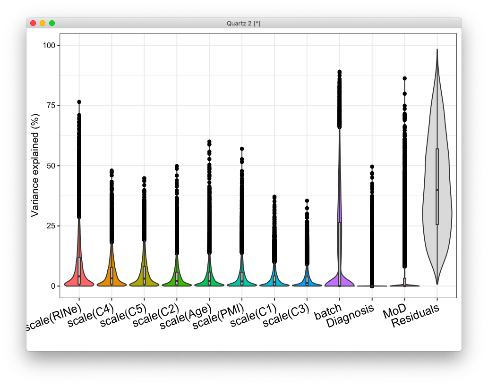

# 2020-09-10 06:20:48

Let's continue the analysis from 129. First, we'll crop the age range to be
similar to the post-mortem sample. Then, we'll look at one per family and make
sure the DXs are pure.

```
> data = readRDS('~/data/rnaseq_derek/complete_rawCountData_05132020.rds')
> summary(data$Age)
   Min. 1st Qu.  Median    Mean 3rd Qu.    Max. 
   6.69   16.36   19.62   21.99   26.60   38.83 
```

I'll make the cut based on that just because it's not clear how the cut-offs
will work out. If we do it on the entire sample it makes more sense. That
created gf_823_09102020, and then I create the onePerFamily file by picking just
one in each family, prioritizing Males with ADHD (as NVs in a ADHD family might
not be a good example of a clean NV). In any ties, I'm taking the older person
in the chances of having a better scan.

Then we need to change the code because it's not a LME anymore. Let's start with
males only:

## RNAseq comparison result

```r
myregion = 'ACC'
data = readRDS('~/data/rnaseq_derek/complete_rawCountData_05132020.rds')
rownames(data) = data$submitted_name  # just to ensure compatibility later
# remove obvious outlier that's NOT caudate labeled as ACC
rm_me = rownames(data) %in% c('68080')
data = data[!rm_me, ]
data = data[data$Region==myregion, ]
more = readRDS('~/data/rnaseq_derek/data_from_philip_POP_and_PCs.rds')
more = more[!duplicated(more$hbcc_brain_id),]
data = merge(data, more[, c('hbcc_brain_id', 'comorbid', 'comorbid_group',
                            'substance', 'substance_group')],
             by='hbcc_brain_id', all.x=T, all.y=F)
data = data[data$Sex=='M',]
imWNH = which(data$C1 > 0 & data$C2 < -.065)
data = data[imWNH, ]

grex_vars = colnames(data)[grepl(colnames(data), pattern='^ENS')]
count_matrix = t(data[, grex_vars])
data = data[, !grepl(colnames(data), pattern='^ENS')]
id_num = sapply(grex_vars, function(x) strsplit(x=x, split='\\.')[[1]][1])
rownames(count_matrix) = id_num
dups = duplicated(id_num)
id_num = id_num[!dups]
count_matrix = count_matrix[!dups, ]

library(biomaRt)
mart <- useDataset("hsapiens_gene_ensembl", useMart("ensembl"))
G_list0 <- getBM(filters= "ensembl_gene_id", attributes= c("ensembl_gene_id",
                 "hgnc_symbol", "chromosome_name"),values=id_num,mart= mart)
G_list <- G_list0[!is.na(G_list0$hgnc_symbol),]
G_list = G_list[G_list$hgnc_symbol!='',]
G_list <- G_list[!duplicated(G_list$ensembl_gene_id),]
imnamed = rownames(count_matrix) %in% G_list$ensembl_gene_id
count_matrix = count_matrix[imnamed, ]
data$POP_CODE = as.character(data$POP_CODE)
data[data$POP_CODE=='WNH', 'POP_CODE'] = 'W'
data[data$POP_CODE=='WH', 'POP_CODE'] = 'W'
data$POP_CODE = factor(data$POP_CODE)
data$Individual = factor(data$hbcc_brain_id)
data[data$Manner.of.Death=='Suicide (probable)', 'Manner.of.Death'] = 'Suicide'
data[data$Manner.of.Death=='unknown', 'Manner.of.Death'] = 'natural'
data$MoD = factor(data$Manner.of.Death)
data$batch = factor(as.numeric(data$run_date))

library(caret)
pp_order = c('zv', 'nzv')
pp = preProcess(t(count_matrix), method = pp_order)
X = predict(pp, t(count_matrix))
geneCounts = t(X)
G_list2 = merge(rownames(geneCounts), G_list, by=1)
colnames(G_list2)[1] = 'ensembl_gene_id'
imautosome = which(G_list2$chromosome_name != 'X' &
                   G_list2$chromosome_name != 'Y' &
                   G_list2$chromosome_name != 'MT')
geneCounts = geneCounts[imautosome, ]
G_list2 = G_list2[imautosome, ]
library(edgeR)
isexpr <- filterByExpr(geneCounts, group=data$Diagnosis)
genes = DGEList( geneCounts[isexpr,], genes=G_list2[isexpr,] ) 

genes = calcNormFactors( genes)
form = ~ Diagnosis + scale(RINe) + scale(PMI) + scale(Age) + MoD
design = model.matrix( form, data)
vobj_tmp = voom( genes, design, plot=FALSE)
dupcor <- duplicateCorrelation(vobj_tmp, design, block=data$batch)
vobj = voom( genes, design, plot=FALSE, block=data$batch,
             correlation=dupcor$consensus)
fit <- lmFit(vobj, design, block=data$batch, correlation=dupcor$consensus)
fitDC <- eBayes( fit )
resDC = topTable(fitDC, coef='DiagnosisControl', number=Inf)

get_enrich_order2 = function( res, gene_sets ){
  if( !is.null(res$z.std) ){
    stat = res$z.std
  }else if( !is.null(res$F.std) ){
    stat = res$F.std
  }else if( !is.null(res$t) ){
    stat = res$t
  }else{
    stat = res$F
  }
  names(stat) = res$hgnc_symbol
  stat = stat[!is.na(names(stat))]
  # print(head(stat))
  index = ids2indices(gene_sets, names(stat))
  cameraPR( stat, index )
}
load('~/data/rnaseq_derek/adhd_genesets_philip.RDATA')
load('~/data/rnaseq_derek/c5_gene_sets.RData')
load('~/data/rnaseq_derek/brain_disorders_gene_sets.RData')
load('~/data/rnaseq_derek/data_for_alex.RData')
co = .9 
idx = anno$age_category==1 & anno$cutoff==co
genes_overlap = unique(anno[idx, 'anno_gene'])
for (s in 2:5) {
  idx = anno$age_category==s & anno$cutoff==co
  g2 = unique(anno[idx, 'anno_gene'])
  genes_overlap = intersect(genes_overlap, g2)
}
genes_unique = list()
for (s in 1:5) {
  others = setdiff(1:5, s)
  idx = anno$age_category==s & anno$cutoff==co
  g = unique(anno[idx, 'anno_gene'])
  for (s2 in others) {
    idx = anno$age_category==s2 & anno$cutoff==co
    g2 = unique(anno[idx, 'anno_gene'])
    rm_me = g %in% g2
    g = g[!rm_me]
  }
  genes_unique[[sprintf('dev%s_c%.1f', s, co)]] = unique(g)
}
genes_unique[['overlap']] = unique(genes_overlap)

adhd_dream_cameraDC = get_enrich_order2( resDC, t2 ) 
c5_dream_cameraDC = get_enrich_order2( resDC, c5_all)
dis_dream_cameraDC = get_enrich_order2( resDC, disorders)
dev_dream_cameraDC = get_enrich_order2( resDC, genes_unique )
```

### Males only

```r
a = readRDS('~/data/expression_impute/results/NCR_v3_ACC_1KG_mashr.rds')
iid2 = sapply(a$IID, function(x) strsplit(x, '_')[[1]][2])
a$IID = iid2
pcs = read.csv('~/data/expression_impute/pop_pcs.csv')
imp_data = merge(a, pcs, by='IID', all.x=F, all.y=F)
gf = read.csv('~/data/expression_impute/gf_823_09102020_onePerFamily.csv')
imp_data = merge(imp_data, gf, by.x='IID', by.y='Subject.Code...Subjects', all.x=F, all.y=F)

imp_data = imp_data[imp_data$Sex...Subjects=='Male',]
grex_vars = colnames(imp_data)[grepl(colnames(imp_data), pattern='^ENS')]
keep_me = imp_data$PC01 < 0 & imp_data$PC02 > 0
imp_data = imp_data[keep_me, ]
library(caret)
set.seed(42)
pp_order = c('zv', 'nzv')
pp = preProcess(imp_data[, grex_vars], method = pp_order)
X = predict(pp, imp_data[, grex_vars])
grex_vars = colnames(X)
imp_data = imp_data[, !grepl(colnames(imp_data), pattern='^ENS')]
id_num = sapply(grex_vars, function(x) strsplit(x=x, split='\\.')[[1]][1])
colnames(X) = id_num
dups = duplicated(id_num)
id_num = id_num[!dups]
grex_vars = id_num
X = t(X[, !dups])

library(biomaRt)
mart <- useDataset("hsapiens_gene_ensembl", useMart("ensembl"))
G_list0 <- getBM(filters= "ensembl_gene_id", attributes= c("ensembl_gene_id",
                 "hgnc_symbol", "chromosome_name"),values=id_num,mart= mart)
G_list <- G_list0[!is.na(G_list0$hgnc_symbol),]
G_list = G_list[G_list$hgnc_symbol!='',]
G_list <- G_list[!duplicated(G_list$ensembl_gene_id),]
imnamed = rownames(X) %in% G_list$ensembl_gene_id
X = X[imnamed, ]
grex_vars = grex_vars[imnamed]
G_list2 = merge(G_list, X, by.x=1, by.y=0)
imautosome = which(G_list2$chromosome_name != 'X' &
                   G_list2$chromosome_name != 'Y' &
                   G_list2$chromosome_name != 'MT')
G_list2 = G_list2[imautosome, ]
X = G_list2[, 4:ncol(G_list2)]
rownames(X) = G_list2$ensembl_gene_id
grex_vars = G_list2$ensembl_gene_id

library(doParallel)
ncores = 2 #as.numeric(Sys.getenv('SLURM_CPUS_PER_TASK'))
cl = makeCluster(ncores)
nzeros = rowSums(X==0)
keep_me = nzeros < (ncol(X)/2)
good_grex = grex_vars[keep_me]
mydata = cbind(imp_data, t(X))
clusterExport(cl, c("mydata"))
stats = parLapply(cl, good_grex,
                  function(x) {
                    fm_str = sprintf('%s ~ Diagnosis + age_base + sample_type + PC01 + PC02 + PC03 + PC04 + PC05', x)
                    fit = lm(as.formula(fm_str), data=mydata)
                    return(summary(fit)$coefficients[2, c(3,4)])})
imp_res = cbind(G_list2[keep_me, 1:2], do.call(rbind, stats))
colnames(imp_res)[3] = 'F'  # quick hack to work with function

adhd_imp_camera = get_enrich_order2( imp_res, t2 )
c5_imp_camera = get_enrich_order2( imp_res, c5_all)
dis_imp_camera = get_enrich_order2( imp_res, disorders)
dev_imp_camera = get_enrich_order2( imp_res, genes_unique )

sum(c5_imp_camera$FDR<.05)
sum(c5_imp_camera$PValue<.01)

intersect(rownames(c5_dream_cameraDC)[c5_dream_cameraDC$PValue<.01],
          rownames(c5_imp_camera)[c5_imp_camera$PValue<.01])
intersect(resDC[resDC$P.Value<.05, 'hgnc_symbol'],
          imp_res[imp_res[,'Pr(>Chisq)']<.05, 'hgnc_symbol'])

```

```
> summary(factor(imp_data$Diagnosis))
   Case Control 
    114     146 
> table(factor(imp_data$Diagnosis), imp_data$sample_type)         
          Blood LCL Saliva Unknown
  Case       31  25     51       7
  Control    41  63     42       0
> sum(c5_imp_camera$FDR<.05)
[1] 1
> sum(c5_imp_camera$PValue<.01)
[1] 78
```

Those numbers don't look very promising...


The results are not very similar. There's some brain stuff, but no more
glutamate for instance. What if we put Sex back in?

```r
a = readRDS('~/data/expression_impute/results/NCR_v3_ACC_1KG_mashr.rds')
iid2 = sapply(a$IID, function(x) strsplit(x, '_')[[1]][2])
a$IID = iid2
pcs = read.csv('~/data/expression_impute/pop_pcs.csv')
imp_data = merge(a, pcs, by='IID', all.x=F, all.y=F)
gf = read.csv('~/data/expression_impute/gf_823_09102020_onePerFamily.csv')
imp_data = merge(imp_data, gf, by.x='IID', by.y='Subject.Code...Subjects', all.x=F, all.y=F)
grex_vars = colnames(imp_data)[grepl(colnames(imp_data), pattern='^ENS')]
keep_me = imp_data$PC01 < 0 & imp_data$PC02 > 0
imp_data = imp_data[keep_me, ]
library(caret)
set.seed(42)
pp_order = c('zv', 'nzv')
pp = preProcess(imp_data[, grex_vars], method = pp_order)
X = predict(pp, imp_data[, grex_vars])
grex_vars = colnames(X)
imp_data = imp_data[, !grepl(colnames(imp_data), pattern='^ENS')]
id_num = sapply(grex_vars, function(x) strsplit(x=x, split='\\.')[[1]][1])
colnames(X) = id_num
dups = duplicated(id_num)
id_num = id_num[!dups]
grex_vars = id_num
X = t(X[, !dups])

library(biomaRt)
mart <- useDataset("hsapiens_gene_ensembl", useMart("ensembl"))
G_list0 <- getBM(filters= "ensembl_gene_id", attributes= c("ensembl_gene_id",
                 "hgnc_symbol", "chromosome_name"),values=id_num,mart= mart)
G_list <- G_list0[!is.na(G_list0$hgnc_symbol),]
G_list = G_list[G_list$hgnc_symbol!='',]
G_list <- G_list[!duplicated(G_list$ensembl_gene_id),]
imnamed = rownames(X) %in% G_list$ensembl_gene_id
X = X[imnamed, ]
grex_vars = grex_vars[imnamed]
G_list2 = merge(G_list, X, by.x=1, by.y=0)
imautosome = which(G_list2$chromosome_name != 'X' &
                   G_list2$chromosome_name != 'Y' &
                   G_list2$chromosome_name != 'MT')
G_list2 = G_list2[imautosome, ]
X = G_list2[, 4:ncol(G_list2)]
rownames(X) = G_list2$ensembl_gene_id
grex_vars = G_list2$ensembl_gene_id

library(doParallel)
ncores = 2 #as.numeric(Sys.getenv('SLURM_CPUS_PER_TASK'))
cl = makeCluster(ncores)
nzeros = rowSums(X==0)
keep_me = nzeros < (ncol(X)/2)
good_grex = grex_vars[keep_me]
mydata = cbind(imp_data, t(X))
clusterExport(cl, c("mydata"))
stats = parLapply(cl, good_grex,
                  function(x) {
                    fm_str = sprintf('%s ~ Diagnosis + Sex...Subjects + age_base + sample_type + PC01 + PC02 + PC03 + PC04 + PC05', x)
                    fit = lm(as.formula(fm_str), data=mydata)
                    return(summary(fit)$coefficients[2, c(3,4)])})
imp_res = cbind(G_list2[keep_me, 1:2], do.call(rbind, stats))
colnames(imp_res)[3] = 'F'  # quick hack to work with function

adhd_imp2_camera = get_enrich_order2( imp_res, t2 )
c5_imp2_camera = get_enrich_order2( imp_res, c5_all)
dis_imp2_camera = get_enrich_order2( imp_res, disorders)
dev_imp2_camera = get_enrich_order2( imp_res, genes_unique )
```


A few more interesting hits here... should probably figure out if using this
more as a robustness analysis or if this OPF idea is really what we'll go with.

Let's maybe go through some of the other items in the TODO list.

# 2020-09-14 11:03:28

I'm starting to think that before I analyze any of these results I'll have to
first check if they are at all significant. I'll create
rnaseq_imputation_intersection.R and see what we get.

So, we can run it in the cluster like this:

```bash
# bw
cd ~/data/expression_impute/
sfile=swarm.intersect;
rm $sfile;
for i in {1..100}; do
    echo "Rscript ~/research_code/rnaseq_imputation_intersection.R ~/data/tmp WNH_WNHBoth $RANDOM" >> $sfile;
done
cat $sfile | parallel -j 32 --max-args=1 {};
```

And we can compile them with something like:

```r
fnames = list.files(mydir, pattern='~/data/tmp/WNH_WNHBoth_rnd*')
gs05 = c()
gs01 = c()
ig05 = c()
ig01 = c()
for (fname in fnames) {
    load(fname)
    append(gs05, intersect(rownames(c5_dream_cameraDC)[c5_dream_cameraDC$PValue<.05],
                        rownames(c5_imp_camera)[c5_imp_camera$PValue<.05]))
    append(gs01, intersect(rownames(c5_dream_cameraDC)[c5_dream_cameraDC$PValue<.01],
                        rownames(c5_imp_camera)[c5_imp_camera$PValue<.01]))
    append(ig05, intersect(resDC[resDC$P.Value<.05, 'hgnc_symbol'],
                        imp_res[imp_res[, 4]<.05, 'hgnc_symbol']))
    append(ig01, intersect(resDC[resDC$P.Value<.01, 'hgnc_symbol'],
                        imp_res[imp_res[, 4]<.01, 'hgnc_symbol']))
}
sum(gs05>=28)/length(gs05)
```

# 2020-09-15 13:25:00

Even after adding the new DX based on dsm5 and nv012, we're still not going over
the number of intersecting pathways that would survive the permutation test.
What else can we do?

Let's try some other approaches. First, let's try the Elastic Net models:

```bash
python3 $METAXCAN/Predict.py \
--model_db_path $DATA/models/gtex_v8_en/en_Whole_Blood.db \
--vcf_genotypes $DATA/1000G_hg37/ALL.chr*.phase3_shapeit2_mvncall_integrated_v5a.20130502.genotypes.vcf.gz \
--vcf_mode genotyped \
--prediction_output $RESULTS/vcf_1000G_hg37_en/Whole_Blood__predict.txt \
--prediction_summary_output $RESULTS/vcf_1000G_hg37_en/Whole_Blood__summary.txt \
--verbosity 9 \
--throw
```

```bash
# bw
module load python
source /data/$USER/conda/etc/profile.d/conda.sh
conda activate imlabtools
mydir=~/data/expression_impute;

python3 $mydir/MetaXcan-master/software/Predict.py \
    --model_db_path $mydir/elastic_net_models/en_Brain_Caudate_basal_ganglia.db \
    --vcf_genotypes /data/NCR_SBRB/NCR_genomics/genotyping/v3/chr*.dose.vcf.gz \
    --vcf_mode imputed \
    --liftover $mydir/hg19ToHg38.over.chain.gz \
    --on_the_fly_mapping METADATA "chr{}_{}_{}_{}_b38" \
    --variant_mapping $mydir/gtex_v8_eur_filtered_maf0.01_monoallelic_variants.txt.gz id rsid \
    --prediction_output $mydir/results/NCR_v3_Caudate_predict_1KG_en.txt \
    --prediction_summary_output $mydir/results/NCR_v3_Caudate_summary_1KG_en.txt \
    --verbosity 9 --throw

python3 $mydir/MetaXcan-master/software/Predict.py \
    --model_db_path $mydir/elastic_net_models/en_Brain_Anterior_cingulate_cortex_BA24.db \
    --vcf_genotypes /data/NCR_SBRB/NCR_genomics/genotyping/v3/chr*.dose.vcf.gz \
    --vcf_mode imputed \
    --liftover $mydir/hg19ToHg38.over.chain.gz \
    --on_the_fly_mapping METADATA "chr{}_{}_{}_{}_b38" \
    --variant_mapping $mydir/gtex_v8_eur_filtered_maf0.01_monoallelic_variants.txt.gz id rsid \
    --prediction_output $mydir/results/NCR_v3_ACC_predict_1KG_en.txt \
    --prediction_summary_output $mydir/results/NCR_v3_ACC_summary_1KG_en.txt \
    --verbosity 9 --throw
```

# 2020-09-16 11:30:12

I'm curious to see whether I need to add PCs to the edgeR model after I use just
the WNH population. Let's compare to pure noise features and see how much they
explain using variancePartition.

```r
myregion = 'ACC'
data = readRDS('~/data/rnaseq_derek/complete_rawCountData_05132020.rds')
rownames(data) = data$submitted_name  # just to ensure compatibility later
# remove obvious outlier that's NOT caudate labeled as ACC
rm_me = rownames(data) %in% c('68080')
data = data[!rm_me, ]
data = data[data$Region==myregion, ]
more = readRDS('~/data/rnaseq_derek/data_from_philip_POP_and_PCs.rds')
more = more[!duplicated(more$hbcc_brain_id),]
data = merge(data, more[, c('hbcc_brain_id', 'comorbid', 'comorbid_group',
                            'substance', 'substance_group')],
             by='hbcc_brain_id', all.x=T, all.y=F)
data = data[data$Sex=='M',]
imWNH = which(data$C1 > 0 & data$C2 < -.065)
data = data[imWNH, ]

grex_vars = colnames(data)[grepl(colnames(data), pattern='^ENS')]
count_matrix = t(data[, grex_vars])
data = data[, !grepl(colnames(data), pattern='^ENS')]
id_num = sapply(grex_vars, function(x) strsplit(x=x, split='\\.')[[1]][1])
rownames(count_matrix) = id_num
dups = duplicated(id_num)
id_num = id_num[!dups]
count_matrix = count_matrix[!dups, ]

G_list0 = readRDS('~/data/rnaseq_derek/mart_rnaseq.rds')
G_list <- G_list0[!is.na(G_list0$hgnc_symbol),]
G_list = G_list[G_list$hgnc_symbol!='',]
G_list <- G_list[!duplicated(G_list$ensembl_gene_id),]
imnamed = rownames(count_matrix) %in% G_list$ensembl_gene_id
count_matrix = count_matrix[imnamed, ]
data$POP_CODE = as.character(data$POP_CODE)
data[data$POP_CODE=='WNH', 'POP_CODE'] = 'W'
data[data$POP_CODE=='WH', 'POP_CODE'] = 'W'
data$POP_CODE = factor(data$POP_CODE)
data$Individual = factor(data$hbcc_brain_id)
data[data$Manner.of.Death=='Suicide (probable)', 'Manner.of.Death'] = 'Suicide'
data[data$Manner.of.Death=='unknown', 'Manner.of.Death'] = 'natural'
data$MoD = factor(data$Manner.of.Death)
data$batch = factor(as.numeric(data$run_date))

library(caret)
pp_order = c('zv', 'nzv')
pp = preProcess(t(count_matrix), method = pp_order)
X = predict(pp, t(count_matrix))
geneCounts = t(X)
G_list2 = merge(rownames(geneCounts), G_list, by=1)
colnames(G_list2)[1] = 'ensembl_gene_id'
imautosome = which(G_list2$chromosome_name != 'X' &
                   G_list2$chromosome_name != 'Y' &
                   G_list2$chromosome_name != 'MT')
geneCounts = geneCounts[imautosome, ]
G_list2 = G_list2[imautosome, ]

library(edgeR)
isexpr <- filterByExpr(geneCounts, group=data$Diagnosis)
genes = DGEList( geneCounts[isexpr,], genes=G_list2[isexpr,] ) 
genes = calcNormFactors( genes)
```

Now let's run the standard variancePartition analysis, using only the ACC WNH
samples (Males only):

```r
library(variancePartition)
form = ~ batch + scale(RINe) + scale(PMI)
design = model.matrix( form, data)
vobj = voom( genes, design, plot=FALSE)

form = ~ (1|Diagnosis) + scale(RINe) + (1|batch) + scale(PMI) + scale(Age) + (1|MoD) + scale(C1) + scale(C2) + scale(C3) + scale(C4) + scale(C5)
varPart <- fitExtractVarPartModel(vobj, form, data)
vp <- sortCols( varPart )
plotVarPart( vp )
```



This doesn't look very good. Are these variables correlated at all? Also,
there's a whole lot of variance that we're not explaining here... VERY different
than plots like the one in the documentation:


design = model.matrix( form, data)
vobj_tmp = voom( genes, design, plot=FALSE)
dupcor <- duplicateCorrelation(vobj_tmp, design, block=data$batch)
vobj = voom( genes, design, plot=FALSE, block=data$batch,
             correlation=dupcor$consensus)
fit <- lmFit(vobj, design, block=data$batch, correlation=dupcor$consensus)
fitDC <- eBayes( fit )
resDC = topTable(fitDC, coef='DiagnosisControl', number=Inf)


# TODO
 * grab cog data for everyone in the OPF sample
 * try using the elastic net models
 * Do I need to include PCs in the postmortem model? Check how much variance they explain!
   How do results change if I just add X number of noise variables?
 * maybe ML on genes selected in post-mortem? we could have manhatan-like plots
    with sig genes on the bottom, trying to predict different phenotypes. One
    plot per phenotype. Or we could use all genes to predict each phenotype,
    maybe using stepAIC? We could be extremely ambitious, train on ABCD and test
    on ours.
 * can we predict max Sx?
 * play with zero threshold
 * play with caudate too
 * look at the genes (or even the methods) of the imputed TWAS papers Sam sent