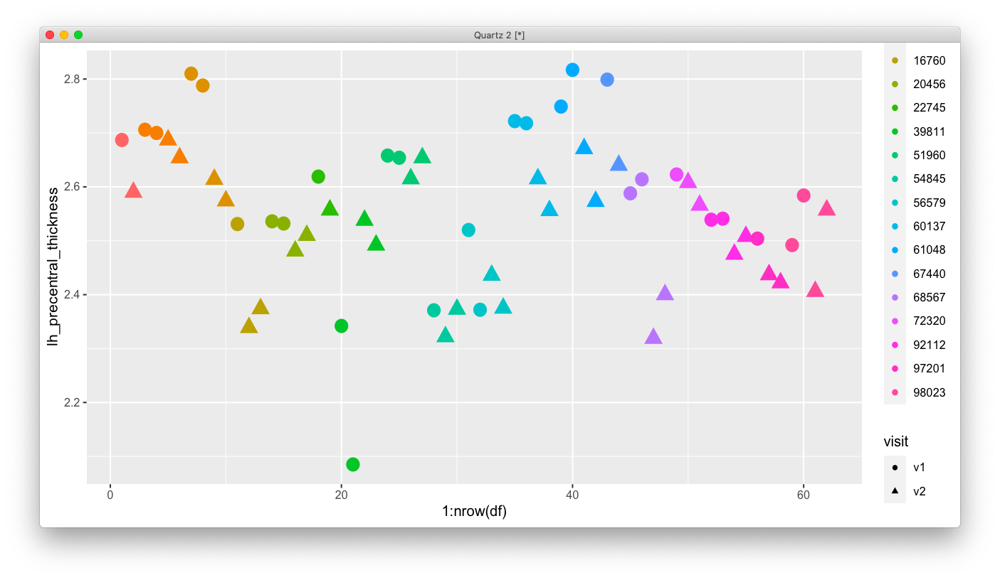
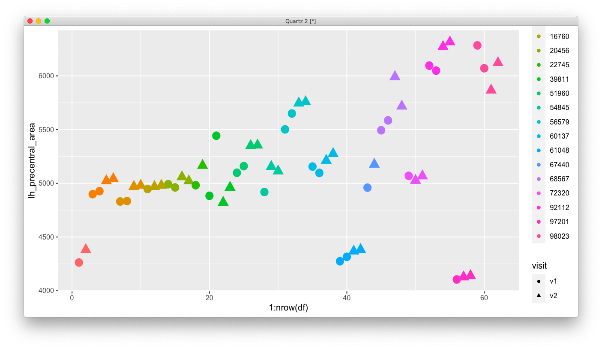
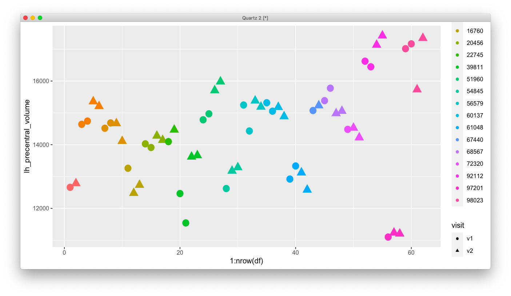
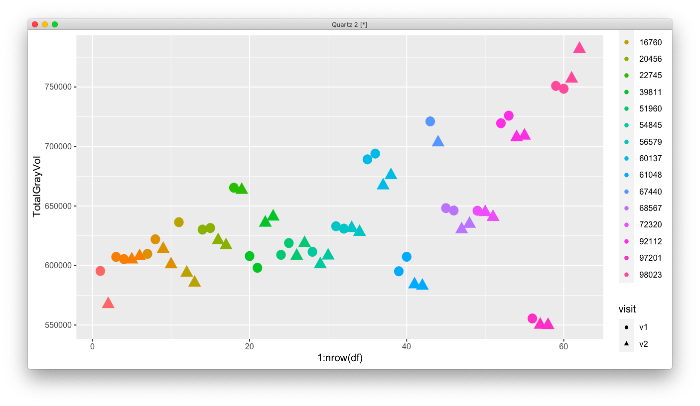

# 2020-09-21 17:21:09

Let's check the Freesurfer reliability results. But first I need to process all
scans for the same IDs.

```bash
cd /mnt/NCR/sudregp/MR_data_by_maskid/
grep rage_ 2022/2*/RE*
scp -rq 2022/20160722-03043/mr_0003 helix:/scratch/sudregp/mprage/56579_v1r1
scp -rq 2022/20160722-03044/mr_0005 helix:/scratch/sudregp/mprage/56579_v1r2
grep rage_ 2097/2*/RE*
scp -rq 2097/20170512-25270/mr_0006 helix:/scratch/sudregp/mprage/56579_v2r2
scp -rq 2097/20170512-25268/mr_0011 helix:/scratch/sudregp/mprage/56579_v2r1
```

Just doing a lot of these manually, because it doesn't make sense to write a
script for it.

There are a total of 62 scans. Let's then use our normal freesurfer pipeline to
see what we get:

```bash
# biowulf
cd /scratch/sudregp/mprage
/bin/ls -1 > ~/tmp/rel.txt
cd ~/freesurfer_logs/
# do some cleanup if needed
while read s; do f=`/bin/ls /scratch/sudregp/mprage/${s}/*0001.dcm | tr -d '\n'`; echo "source /usr/local/apps/freesurfer/5.3.0/SetUpFreeSurfer.sh; recon-all -i $f -subjid ${s} -all -openmp 8 | tee -a ${s}_freesurfer.log" >> reliability.swarm; done < ~/tmp/rel.txt

swarm -g 8 -t 8 --job-name freesurfer --time 48:00:00 -f reliability.swarm -m freesurfer/5.3.0 --logdir trash
```

Then, to check who finished:

```bash
cd ~/freesurfer_logs/
rm finished.txt
while read s; do 
    if grep -q "finished without error" ~/data/MEG_structural/freesurfer/${s}/scripts/recon-all.log; then
        echo $s >> finished.txt;
    else
        echo $s;
    fi;
done < ~/tmp/rel.txt
```

I then created Shaw/reliability_scans/freesurfer_rois.csv. Now it's just a
matter of making a few plots.

```r
library(ggplot2)
df = read.csv('/Volumes/Shaw/reliability_scans/freesurfer_rois.csv')
df$subject=factor(df$subject)
ggplot(df, aes(x=1:nrow(df), y=TotalGrayVol, shape=visit, color=subject, size=2)) + geom_point()
```









I then created two files so we could run ICC. One by doubling scans that didn't
have duplicates, and one without them. The new files are sorted in ausch a way
that if I grab every other entry I'll be seeing v1 and v2 as diffeent raters.

```r
library(psych)
df = read.csv('/Volumes/Shaw/reliability_scans/freesurfer_rois_slim.csv')
x='TotalGrayVol'
tmp = cbind(df[seq(1,nrow(df),2), x], df[seq(2,nrow(df),2), x])
res = ICC(tmp)
```

I also created a one-per-subjet file.

And we can use CCC and Bland-Altman plots:

```r
x = "rh_parsopercularis_thickness"
scanner1 = df[seq(1,nrow(df),2), x]
scanner2 = df[seq(2,nrow(df),2), x]

plot_CC_BA = function(scanner1, scanner2, x) {
    tmp.ccc <- CCC(scanner1, scanner2, ci = "z-transform", conf.level = 0.95)

    lab <- paste(sprintf("CCC %s: ", x), round(tmp.ccc$rho.c[,1], digits = 2), " (95% CI ", 
    round(tmp.ccc$rho.c[,2], digits = 2), " - ",
    round(tmp.ccc$rho.c[,3], digits = 2), ")", sep = "")
    z <- lm(scanner2 ~ scanner1)

    par(mfrow=c(1, 2), pty = "s", oma = c(0, 0, 2, 0))
    plot(scanner1, scanner2, xlab = "Old scanner", 
    ylab = "New scanner", pch = 16)
    abline(a = 0, b = 1, lty = 2)
    abline(z, lty = 1)
    legend(x = "topleft", legend = c("Line of perfect concordance", 
    "Reduced major axis"), lty = c(2,1), lwd = c(1,1), bty = "n")
    mtext(lab, outer = T, cex = 1)

    tmp.ccc <- CCC(scanner1, scanner2, ci = "z-transform", conf.level = 0.95)
    tmp.mean <- mean(tmp.ccc$blalt$delta)
    tmp.sd <- sqrt(var(tmp.ccc$blalt$delta))

    plot(tmp.ccc$blalt$mean, tmp.ccc$blalt$delta, pch = 16, 
    xlab = "Average", ylab = "Difference") 
    abline(h = tmp.mean, lty = 1, col = "gray")
    abline(h = tmp.mean - (2 * tmp.sd), lty = 2, col = "gray")
    abline(h = tmp.mean + (2 * tmp.sd), lty = 2, col = "gray")
    legend(x = "topleft", legend = c("Mean difference", 
    "Mean difference +/ 2SD"), lty = c(1,2), bty = "n")
    legend(x = 0, y = 125, legend = c("Difference"), pch = 16, 
        bty = "n")
}
```

# 2020-09-23 07:17:57

The plots were useful, but didn't show any new info that wasn't there before.
What's the ICC within scanner?

```r
library(psych)
x = "lh_precentral_volume"
df = read.csv('/Volumes/Shaw/reliability_scans/freesurfer_rois_slim.csv')
tmp = cbind(df[seq(1,nrow(df),2), x], df[seq(2,nrow(df),2), x])
print('Across visits')
ICC(tmp)

df = read.csv('/Volumes/Shaw/reliability_scans/freesurfer_rois.csv')
for (v in c('v1', 'v2')) {
    print(v)
    df2 = df[df$visit==v,]
    subj_count = table(df2$subject)
    use_subjs = names(subj_count)[subj_count==2]
    v1 = c()
    v2 = c()
    for (s in use_subjs) {
        v1 = c(v1, df2[df2$subject==s & df2$run=='r1', x])
        v2 = c(v2, df2[df2$subject==s & df2$run=='r2', x])
    }
    print(ICC(cbind(v1, v2)))
}
```

```
[1] "v1"
boundary (singular) fit: see ?isSingular
Call: ICC(x = cbind(v1, v2))

Intraclass correlation coefficients 
                         type  ICC  F df1 df2       p lower bound upper bound
Single_raters_absolute   ICC1 0.96 44  10  11 2.1e-07        0.88        0.98
Single_random_raters     ICC2 0.96 44  10  10 6.5e-07        0.88        0.98
Single_fixed_raters      ICC3 0.96 44  10  10 6.5e-07        0.87        0.98
Average_raters_absolute ICC1k 0.98 44  10  11 2.1e-07        0.93        0.99
Average_random_raters   ICC2k 0.98 44  10  10 6.5e-07        0.93        0.99
Average_fixed_raters    ICC3k 0.98 44  10  10 6.5e-07        0.93        0.99

 Number of subjects = 11     Number of Judges =  2
 
 [1] "v2"
boundary (singular) fit: see ?isSingular
Call: ICC(x = cbind(v1, v2))

Intraclass correlation coefficients 
                         type  ICC  F df1 df2       p lower bound upper bound
Single_raters_absolute   ICC1 0.95 40  14  15 2.5e-09        0.89        0.98
Single_random_raters     ICC2 0.95 40  14  14 7.2e-09        0.89        0.98
Single_fixed_raters      ICC3 0.95 40  14  14 7.2e-09        0.88        0.98
Average_raters_absolute ICC1k 0.98 40  14  15 2.5e-09        0.94        0.99
Average_random_raters   ICC2k 0.98 40  14  14 7.2e-09        0.94        0.99
Average_fixed_raters    ICC3k 0.98 40  14  14 7.2e-09        0.94        0.99

 Number of subjects = 15     Number of Judges =  2> 
```

We should take ICC3 here, as we have fixed raters not to be generalized
(https://personality-project.org/r/html/ICC.html). But equally, only ICC1 is
sensitive to differences in means between raters, which may well be our case. In
that situation, ICC1 will work better. It doesn't make that much difference
here, but it might for other metrics. Say, thickness:

```
[1] "v1"
boundary (singular) fit: see ?isSingular
Call: ICC(x = cbind(v1, v2))

Intraclass correlation coefficients 
                         type  ICC  F df1 df2       p lower bound upper bound
Single_raters_absolute   ICC1 0.85 12  10  11 0.00013        0.62        0.95
Single_random_raters     ICC2 0.85 12  10  10 0.00023        0.62        0.95
Single_fixed_raters      ICC3 0.85 12  10  10 0.00023        0.61        0.95
Average_raters_absolute ICC1k 0.92 12  10  11 0.00013        0.77        0.97
Average_random_raters   ICC2k 0.92 12  10  10 0.00023        0.77        0.97
Average_fixed_raters    ICC3k 0.92 12  10  10 0.00023        0.76        0.97

 Number of subjects = 11     Number of Judges =  2[1] 
"v2"
boundary (singular) fit: see ?isSingular
Call: ICC(x = cbind(v1, v2))

Intraclass correlation coefficients 
                         type  ICC  F df1 df2       p lower bound upper bound
Single_raters_absolute   ICC1 0.84 12  14  15 1.3e-05        0.66        0.93
Single_random_raters     ICC2 0.84 12  14  14 2.2e-05        0.66        0.93
Single_fixed_raters      ICC3 0.84 12  14  14 2.2e-05        0.65        0.93
Average_raters_absolute ICC1k 0.91 12  14  15 1.3e-05        0.79        0.97
Average_random_raters   ICC2k 0.91 12  14  14 2.2e-05        0.79        0.97
Average_fixed_raters    ICC3k 0.91 12  14  14 2.2e-05        0.79        0.97

 Number of subjects = 15     Number of Judges =  2> 
```

Not really...

# 2020-09-27 15:47:07

Using the same data, let's create some averages to compare across visits.

```r
df = read.csv('/Volumes/Shaw/reliability_scans/freesurfer_rois.csv')
x = "lh_precentral_volume"
var_names = colnames(df)[5:ncol(df)]
junk = c()
for (s in unique(df$subject)) {
    for (v in c('v1', 'v2')) {
        df2 = df[df$visit==v & df$subject==s,]
        if (nrow(df2) == 1) {
            junk = rbind(junk, df2[, c('subject', 'visit', var_names)])
        } else {
            junk = rbind(junk, c(df2[1, c('subject', 'visit')],
                                     colMeans(df2[, var_names])))
        }
    }
}
v1 = junk[junk$visit=='v1', x]
v2 = junk[junk$visit=='v2', x]
print(ICC(cbind(v1, v2)))
```

For thickness:

```
Intraclass correlation coefficients 
                         type  ICC   F df1 df2      p lower bound upper bound
Single_raters_absolute   ICC1 0.51 3.1  17  18 0.0107        0.17        0.75
Single_random_raters     ICC2 0.54 4.2  17  17 0.0026        0.18        0.77
Single_fixed_raters      ICC3 0.61 4.2  17  17 0.0026        0.29        0.81
Average_raters_absolute ICC1k 0.68 3.1  17  18 0.0107        0.28        0.86
Average_random_raters   ICC2k 0.70 4.2  17  17 0.0026        0.31        0.87
Average_fixed_raters    ICC3k 0.76 4.2  17  17 0.0026        0.45        0.89

 Number of subjects = 18     Number of Judges =  2> 
```

So, the confidence intervals do overlap...

I'll export the values for every single variable we have and see if there are
any differences:

```r
library(psych)
df = read.csv('/Volumes/Shaw/reliability_scans/freesurfer_rois.csv')
var_names = colnames(df)[5:ncol(df)]
for (v in c('v1', 'v2')) {
    print(v)
    df2 = df[df$visit==v,]
    subj_count = table(df2$subject)
    use_subjs = names(subj_count)[subj_count==2]
    hold = c()
    for (x in var_names) {
        r1 = c()
        r2 = c()
        for (s in use_subjs) {
            r1 = c(r1, df2[df2$subject==s & df2$run=='r1', x])
            r2 = c(r2, df2[df2$subject==s & df2$run=='r2', x])
        }
        a = ICC(cbind(r1, r2))
        res = a$results[a$results$type=='ICC1',]
        rownames(res) = x
        hold = rbind(hold, res)
    }
    write.csv(hold, file=sprintf('~/data/ICC1_%s.csv', v))
}
```

And now we do the same across scanners:

```r
df = read.csv('/Volumes/Shaw/reliability_scans/freesurfer_rois.csv')
var_names = colnames(df)[5:ncol(df)]
junk = c()
for (s in unique(df$subject)) {
    for (v in c('v1', 'v2')) {
        df2 = df[df$visit==v & df$subject==s,]
        if (nrow(df2) == 1) {
            junk = rbind(junk, df2[, c('subject', 'visit', var_names)])
        } else {
            junk = rbind(junk, c(df2[1, c('subject', 'visit')],
                                     colMeans(df2[, var_names])))
        }
    }
}
hold = c()
for (x in var_names) {
    v1 = junk[junk$visit=='v1', x]
    v2 = junk[junk$visit=='v2', x]
    a = ICC(cbind(v1, v2))
    res = a$results[a$results$type=='ICC1k',]
    rownames(res) = x
    hold = rbind(hold, res)
}
write.csv(hold, file='~/data/ICC1k_v1_v2.csv')
```

Then, we can track which confidence intervals did not overlap.

```r
df1 = read.csv('~/data/ICC1_v1.csv')
df2 = read.csv('~/data/ICC1_v2.csv')
df12 = read.csv('~/data/ICC1k_v1_v2.csv')
# first check if the within scanner is ever different
for (r in rownames(df1)) {
    if (all(!is.na(df1[r, c('lower.bound', 'upper.bound')]) &&
        all(!is.na(df2[r, c('lower.bound', 'upper.bound')])))) {
        if ((df1[r, "lower.bound"] > df2[r, "upper.bound"]) ||
            (df1[r, "upper.bound"] < df2[r, "lower.bound"])) {
                # only report if one of them is below a threshold
                threshold = .95
                if (df1[r, 'ICC'] < threshold ||
                    df2[r, 'ICC'] < threshold) {
                        print('===')
                        print(df1[r, ])
                        print(df2[r, ])
                        print('===')
                    }
            }
        }
}
```

Even before we compare across scanners, there are a few worrisome values within
scanner 2:

```
[1] "==="
                         X type       ICC        F df1 df2            p
15 lh_parahippocampal_area ICC1 0.8756122 15.07875  10  11 4.905407e-05
   lower.bound upper.bound
15   0.6817349    0.955924
                         X type       ICC        F df1 df2         p
15 lh_parahippocampal_area ICC1 0.1746504 1.423216  14  15 0.2527665
   lower.bound upper.bound
15  -0.2602022   0.5560867
[1] "==="
[1] "==="
                            X type       ICC        F df1 df2            p
78 lh_inferiortemporal_volume ICC1 0.9905416 210.4516  10  11 4.416901e-11
   lower.bound upper.bound
78   0.9732437    0.996776
                            X type       ICC        F df1 df2            p
78 lh_inferiortemporal_volume ICC1 0.9218585 24.59458  14  15 8.237959e-08
   lower.bound upper.bound
78   0.8205434   0.9675201
[1] "==="
[1] "==="
                          X type       ICC        F df1 df2            p
84 lh_middletemporal_volume ICC1 0.9912507 227.5908  10  11 2.881472e-11
   lower.bound upper.bound
84   0.9752337   0.9970184
                          X type       ICC        F df1 df2            p
84 lh_middletemporal_volume ICC1 0.9106547 21.38507  14  15 2.171219e-07
   lower.bound upper.bound
84   0.7963526   0.9627363
[1] "==="
[1] "==="
                            X type       ICC        F df1 df2            p
99 lh_superiortemporal_volume ICC1 0.9839485 123.5991  10  11 7.985576e-10
   lower.bound upper.bound
99   0.9548665   0.9945167
                            X type       ICC        F df1 df2            p
99 lh_superiortemporal_volume ICC1 0.8348696 11.11164  14  15 1.700868e-05
   lower.bound upper.bound
99   0.6417903    0.929498
[1] "==="
[1] "==="
                                     X type      ICC       F df1 df2
129 rh_rostralanteriorcingulate_volume ICC1 0.972024 70.4899  10  11
               p lower.bound upper.bound
129 1.652564e-08   0.9221847   0.9904053
                                     X type      ICC        F df1 df2
129 rh_rostralanteriorcingulate_volume ICC1 0.807931 9.412925  14  15
               p lower.bound upper.bound
129 4.833709e-05   0.5903852   0.9173009
[1] "==="
[1] "==="
                                X type       ICC        F df1 df2            p
167 lh_superiortemporal_thickness ICC1 0.9827321 114.8217  10  11 1.190307e-09
    lower.bound upper.bound
167      0.9515   0.9940988
                                X type       ICC        F df1 df2            p
167 lh_superiortemporal_thickness ICC1 0.8778839 15.37785  14  15 2.035507e-06
    lower.bound upper.bound
167   0.7276334    0.948554
[1] "==="
[1] "==="
                        X type       ICC        F df1 df2            p
174 rh_bankssts_thickness ICC1 0.9666859 59.03464  10  11 4.268713e-08
    lower.bound upper.bound
174   0.9077814   0.9885542
                        X type      ICC        F df1 df2            p
174 rh_bankssts_thickness ICC1 0.781675 8.160653  14  15 0.0001157791
    lower.bound upper.bound
174   0.5419253    0.905212
[1] "==="
[1] "==="
                    X type       ICC        F df1 df2            p lower.bound
210 Left.Inf.Lat.Vent ICC1 0.9317464 28.30249  10  11 2.044747e-06   0.8168176
    upper.bound
210   0.9762732
                    X type       ICC        F df1 df2           p lower.bound
210 Left.Inf.Lat.Vent ICC1 0.5691529 3.642018  14  15 0.009044082   0.2007216
    upper.bound
210   0.7994043
[1] "==="
[1] "==="
                   X type       ICC        F df1 df2            p lower.bound
220 Left.Hippocampus ICC1 0.9116871 21.64674  10  11 8.073225e-06   0.7670545
    upper.bound
220   0.9690907
                   X type       ICC        F df1 df2          p lower.bound
220 Left.Hippocampus ICC1 0.4592954 2.698877  14  15 0.03308012  0.05358191
    upper.bound
220   0.7384713
[1] "==="
[1] "==="
                X type       ICC       F df1 df2            p lower.bound
221 Left.Amygdala ICC1 0.9227984 24.9062  10  11 3.948352e-06   0.7944062
    upper.bound
221   0.9730813
                X type      ICC        F df1 df2          p lower.bound
221 Left.Amygdala ICC1 0.487611 2.903284  14  15 0.02458093   0.0898933
    upper.bound
221   0.7546253
[1] "==="
[1] "==="
                      X type       ICC       F df1 df2            p lower.bound
223 Left.Accumbens.area ICC1 0.9479843 37.4499  10  11 4.753553e-07   0.8583933
    upper.bound
223   0.9820166
                      X type       ICC        F df1 df2          p lower.bound
223 Left.Accumbens.area ICC1 0.3649118 2.149169  14  15 0.07687052 -0.06017127
    upper.bound
223   0.6822073
[1] "==="
[1] "==="
                     X type       ICC        F df1 df2            p lower.bound
228 Right.Inf.Lat.Vent ICC1 0.9803897 100.9873  10  11 2.384045e-09   0.9450386
    upper.bound
228   0.9932931
                     X type       ICC       F df1 df2           p lower.bound
228 Right.Inf.Lat.Vent ICC1 0.5925062 3.90805  14  15 0.006477866   0.2343001
    upper.bound
228   0.8117743
[1] "==="
[1] "==="
               X type       ICC        F df1 df2            p lower.bound
239 Right.vessel ICC1 0.8933466 17.75234  10  11 2.189132e-05   0.7230292
    upper.bound
239   0.9624373
               X type       ICC        F df1 df2          p lower.bound
239 Right.vessel ICC1 0.4228013 2.465011  14  15 0.04698514 0.008313331
    upper.bound
239   0.7171678
[1] "==="
[1] "==="
              X type      ICC        F df1 df2            p lower.bound
253 CC_Anterior ICC1 0.931368 28.14095  10  11 2.106135e-06   0.8158629
    upper.bound
253   0.9761387
              X type       ICC        F df1 df2            p lower.bound
253 CC_Anterior ICC1 0.9916893 239.6544  14  15 5.152201e-15   0.9799705
    upper.bound
253   0.9966174
[1] "==="
[1] "==="
                      X type       ICC       F df1 df2            p lower.bound
269 BrainSegVol.to.eTIV ICC1 0.9513934 40.1467  10  11 3.298441e-07   0.8672743
    upper.bound
269   0.9832144
                      X type       ICC        F df1 df2          p lower.bound
269 BrainSegVol.to.eTIV ICC1 0.5439381 3.385369  14  15 0.01264012   0.1654129
    upper.bound
269   0.7858254
[1] "==="
[1] "==="
                  X type      ICC        F df1 df2            p lower.bound
270 MaskVol.to.eTIV ICC1 0.912896 21.96105  10  11 7.503683e-06   0.7700051
    upper.bound
270   0.9695263
                  X type       ICC        F df1 df2          p lower.bound
270 MaskVol.to.eTIV ICC1 0.3680144 2.164629  14  15 0.07500519  -0.0565996
    upper.bound
270   0.6841185
[1] "==="
[1] "==="
                                X type       ICC        F df1 df2            p
274 EstimatedTotalIntraCranialVol ICC1 0.9935656 309.8276  10  11 5.342344e-12
    lower.bound upper.bound
274   0.9817474    0.997809
                                X type       ICC        F df1 df2           p
274 EstimatedTotalIntraCranialVol ICC1 0.9135504 22.13486  14  15 1.71164e-07
    lower.bound upper.bound
274   0.8025699   0.9639758
[1] "==="
```
