# 2020-09-27 15:11:01

Because it looks like adding the extra population PCS is breaking our
WNH results, and also that we loose many samples for looking at WNH only, let's
try the PCA approach Alex used to see if our results get a bit better.

```r
myregion = 'ACC'
data = readRDS('~/data/rnaseq_derek/complete_rawCountData_05132020.rds')
rownames(data) = data$submitted_name  # just to ensure compatibility later
# remove obvious outlier (that's NOT caudate) labeled as ACC
rm_me = rownames(data) %in% c('68080')
data = data[!rm_me, ]
data = data[data$Region==myregion, ]
more = readRDS('~/data/rnaseq_derek/data_from_philip_POP_and_PCs.rds')
more = more[!duplicated(more$hbcc_brain_id),]
data = merge(data, more[, c('hbcc_brain_id', 'comorbid', 'comorbid_group',
                            'substance', 'substance_group')],
             by='hbcc_brain_id', all.x=T, all.y=F)

# at this point we have 55 samples for ACC
grex_vars = colnames(data)[grepl(colnames(data), pattern='^ENS')]
count_matrix = t(data[, grex_vars])
data = data[, !grepl(colnames(data), pattern='^ENS')]
id_num = sapply(grex_vars, function(x) strsplit(x=x, split='\\.')[[1]][1])
rownames(count_matrix) = id_num
dups = duplicated(id_num)
id_num = id_num[!dups]
count_matrix = count_matrix[!dups, ]

# library(biomaRt)
# mart <- useDataset("hsapiens_gene_ensembl", useMart("ensembl"))
# G_list0 <- getBM(filters= "ensembl_gene_id", attributes= c("ensembl_gene_id",
#                  "hgnc_symbol", "chromosome_name"),values=id_num,mart= mart)
G_list0 = readRDS('~/data/rnaseq_derek/mart_rnaseq.rds')
G_list <- G_list0[!is.na(G_list0$hgnc_symbol),]
G_list = G_list[G_list$hgnc_symbol!='',]
G_list <- G_list[!duplicated(G_list$ensembl_gene_id),]
imnamed = rownames(count_matrix) %in% G_list$ensembl_gene_id
count_matrix = count_matrix[imnamed, ]
# we're down from 60K to 38K samples by only looking at the ones with hgnc symbol. We might be losing too much here, so it's a step to reconsider in the future

data$POP_CODE = as.character(data$POP_CODE)
data[data$POP_CODE=='WNH', 'POP_CODE'] = 'W'
data[data$POP_CODE=='WH', 'POP_CODE'] = 'W'
data$POP_CODE = factor(data$POP_CODE)
data$Individual = factor(data$hbcc_brain_id)
data[data$Manner.of.Death=='Suicide (probable)', 'Manner.of.Death'] = 'Suicide'
data[data$Manner.of.Death=='unknown', 'Manner.of.Death'] = 'natural'
data$MoD = factor(data$Manner.of.Death)
data$batch = factor(as.numeric(data$run_date))

library(caret)
pp_order = c('zv', 'nzv')
pp = preProcess(t(count_matrix), method = pp_order)
X = predict(pp, t(count_matrix))
geneCounts = t(X)
G_list2 = merge(rownames(geneCounts), G_list, by=1)
colnames(G_list2)[1] = 'ensembl_gene_id'
imautosome = which(G_list2$chromosome_name != 'X' &
                   G_list2$chromosome_name != 'Y' &
                   G_list2$chromosome_name != 'MT')
geneCounts = geneCounts[imautosome, ]
G_list2 = G_list2[imautosome, ]
library(edgeR)
isexpr <- filterByExpr(geneCounts, group=data$Diagnosis)
genes = DGEList( geneCounts[isexpr,], genes=G_list2[isexpr,] ) 
genes = calcNormFactors( genes)

lcpm = cpm(genes, log=T)
set.seed(42)
lcpm.pca <- prcomp(t(lcpm), scale=TRUE)

# I'll keep it to lcpm estimates (and not cpm) because it looks like that's what limma uses in its model (https://bioconductor.org/packages/release/bioc/vignettes/limma/inst/doc/usersguide.pdf, page 125).
```

# 2020-10-04 17:12:34

Let's make a few correlation plots then. First, using lcpm and some of the meta
data:

```r
library(dlookr)
eda_report(data, output_format = "html", output_file = "EDA.html")
# looking at some of the descriptive there

num_vars = c('pcnt_optical_duplicates', 'clusters', 'Age', 'RINe', 'PMI',
             'C1', 'C2', 'C3', 'C4', 'C5', 'C6', 'C7', 'C8', 'C9', 'C10')
pc_vars = colnames(lcpm.pca$x)
num_corrs = matrix(nrow=length(num_vars), ncol=length(pc_vars),
                   dimnames=list(num_vars, pc_vars))
num_pvals = num_corrs
for (x in num_vars) {
    for (y in pc_vars) {
        res = cor.test(data[, x], lcpm.pca$x[, y])
        num_corrs[x, y] = res$estimate
        num_pvals[x, y] = res$p.value
    }
}

library(corrplot)
corrplot(t(num_corrs), method='color', tl.cex=.5, cl.cex=.5)
```

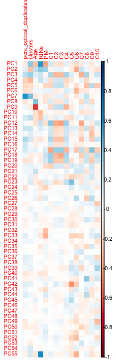

Not many things are coming up, at least not visually. Maybe we can just do it
computationally and take anything p < .05? That gives me 22 out of the 55 PCs.
If I do .01 it gives me 12 out of 55 PCs. But I haven't even checked if these
PCs are on the top of my variance explained plots, or if they also remove
Diagnosis. I'm not liking where this is going. Let's go back to the idea of
checking the effects of using the variables directly. 

# 2020-10-05 15:58:29

Philip suggested I should keep looking at this analysis. OK, so let's continue.
First, let's see how many PCs to keep.

```r
library(nFactors)
eigs <- lcpm.pca$sdev^2
nS = nScree(x=eigs)
keep_me = 1:nS$Components$nkaiser
mydata = data.frame(lcpm.pca$x[, keep_me])

num_vars = c('pcnt_optical_duplicates', 'clusters', 'Age', 'RINe', 'PMI',
             'C1', 'C2', 'C3', 'C4', 'C5', 'C6', 'C7', 'C8', 'C9', 'C10')
pc_vars = colnames(mydata)
num_corrs = matrix(nrow=length(num_vars), ncol=length(pc_vars),
                   dimnames=list(num_vars, pc_vars))
num_pvals = num_corrs
for (x in num_vars) {
    for (y in pc_vars) {
        res = cor.test(data[, x], mydata[, y])
        num_corrs[x, y] = res$estimate
        num_pvals[x, y] = res$p.value
    }
}

library(corrplot)
corrplot(t(num_corrs), method='color', tl.cex=.5, cl.cex=.5)
```

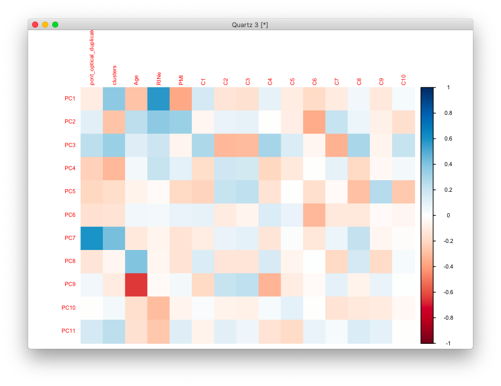

```r
categ_vars = c('batch', 'Diagnosis', 'MoD', 'substance_group',
               'comorbid_group', 'POP_CODE', 'Sex')
categ_corrs = matrix(nrow=length(categ_vars), ncol=length(pc_vars),
                   dimnames=list(categ_vars, pc_vars))
categ_pvals = categ_corrs
for (x in categ_vars) {
    for (y in pc_vars) {
        res = kruskal.test(mydata[, y], data[, x])
        categ_corrs[x, y] = res$statistic
        categ_pvals[x, y] = res$p.value
    }
}
corrplot(t(categ_corrs), method='color', tl.cex=.5, cl.cex=.5, is.corr=F)
```

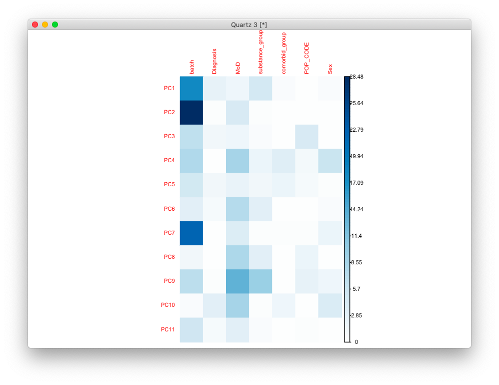

So, ideally here we'd keep only the PCs related to Diagnosis. But none of them
are (even at nominal p < .05... closest is PC10 at .07). So the other option is
to remove anything that captures the nuisance variables, say, at p<.05.

```
r$> which(categ_pvals < .05, arr.ind = T)                              
                row col
batch             1   1
batch             1   2
POP_CODE          6   3
batch             1   4
MoD               3   4
Sex               7   4
batch             1   7
MoD               3   8
MoD               3   9
substance_group   4   9
MoD               3  10
Sex               7  10
r$> which(categ_pvals < .01, arr.ind = T)                              
                row col
batch             1   1
batch             1   2
batch             1   7
MoD               3   9
substance_group   4   9
```

And just for the record, here's the same result using the numeric variables:

```
r$> which(num_pvals < .05, arr.ind = T)                                
                        row col
clusters                  2   1
Age                       3   1
RINe                      4   1
PMI                       5   1
clusters                  2   2
RINe                      4   2
PMI                       5   2
C6                       11   2
clusters                  2   3
C1                        6   3
C2                        7   3
C3                        8   3
C4                        9   3
C7                       12   3
C8                       13   3
clusters                  2   4
C8                       13   5
C6                       11   6
pcnt_optical_duplicates   1   7
clusters                  2   7
Age                       3   8
Age                       3   9
C4                        9   9
RINe                      4  10
RINe                      4  11

r$> which(num_pvals < .01, arr.ind = T)                                
                        row col
clusters                  2   1
RINe                      4   1
PMI                       5   1
RINe                      4   2
C6                       11   2
pcnt_optical_duplicates   1   7
clusters                  2   7
Age                       3   8
Age                       3   9
```

So, let's remove 1, 2, 7, 8 and 9. Interesting that we didn't really have
anything related to the population PCs at p < .01 (only C6). We actually can't
even do .05, because it would remove all 11 components.

Alright then. How do the results look?

```r
get_enrich_order2 = function( res, gene_sets ){
  if( !is.null(res$z.std) ){
    stat = res$z.std
  }else if( !is.null(res$F.std) ){
    stat = res$F.std
  }else if( !is.null(res$t) ){
    stat = res$t
  }else{
    stat = res$F
  }
  names(stat) = res$hgnc_symbol
  stat = stat[!is.na(names(stat))]
  # print(head(stat))
  index = ids2indices(gene_sets, names(stat))
  cameraPR( stat, index )
}
load('~/data/rnaseq_derek/adhd_genesets_philip.RDATA')
load('~/data/rnaseq_derek/c5_gene_sets.RData')
load('~/data/rnaseq_derek/brain_disorders_gene_sets.RData')
load('~/data/rnaseq_derek/data_for_alex.RData')
co = .9 
idx = anno$age_category==1 & anno$cutoff==co
genes_overlap = unique(anno[idx, 'anno_gene'])
for (s in 2:5) {
  idx = anno$age_category==s & anno$cutoff==co
  g2 = unique(anno[idx, 'anno_gene'])
  genes_overlap = intersect(genes_overlap, g2)
}
genes_unique = list()
for (s in 1:5) {
  others = setdiff(1:5, s)
  idx = anno$age_category==s & anno$cutoff==co
  g = unique(anno[idx, 'anno_gene'])
  for (s2 in others) {
    idx = anno$age_category==s2 & anno$cutoff==co
    g2 = unique(anno[idx, 'anno_gene'])
    rm_me = g %in% g2
    g = g[!rm_me]
  }
  genes_unique[[sprintf('dev%s_c%.1f', s, co)]] = unique(g)
}
genes_unique[['overlap']] = unique(genes_overlap)

data2 = cbind(data, mydata)
form = ~ Diagnosis + PC1 + PC2 + PC7 + PC8 + PC9
design = model.matrix( form, data2)
vobj = voom( genes, design, plot=FALSE)
fit <- lmFit(vobj, design)
fit2 <- eBayes( fit )
res = topTable(fit2, coef='DiagnosisControl', number=Inf)

adhd_camera = get_enrich_order2( res, t2 ) 
c5_camera = get_enrich_order2( res, c5_all)
dis_camera = get_enrich_order2( res, disorders)
dev_camera = get_enrich_order2( res, genes_unique )
```

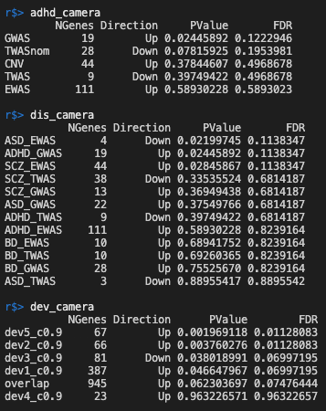

```
r$> rownames(c5_camera)[c5_camera$FDR < .05]
 [1] "GO_INTRINSIC_COMPONENT_OF_POSTSYNAPTIC_MEMBRANE"
 [2] "GO_INTRINSIC_COMPONENT_OF_SYNAPTIC_MEMBRANE"
 [3] "GO_NEUROTRANSMITTER_RECEPTOR_ACTIVITY"
 [4] "GO_CYTOSOLIC_RIBOSOME"
 [5] "GO_INTRINSIC_COMPONENT_OF_POSTSYNAPTIC_SPECIALIZATION_MEMBRANE"
 [6] "GO_SYNAPSE_ASSEMBLY"
 [7] "GO_IGG_BINDING"
 [8] "GO_GABA_ERGIC_SYNAPSE"
 [9] "GO_POSTSYNAPTIC_MEMBRANE"
[10] "GO_CYTOSOLIC_SMALL_RIBOSOMAL_SUBUNIT"
[11] "GO_G_PROTEIN_COUPLED_AMINE_RECEPTOR_ACTIVITY"
[12] "GO_REGULATION_OF_SYNAPTIC_PLASTICITY"
[13] "GO_IMMUNOGLOBULIN_BINDING"
[14] "GO_INTRINSIC_COMPONENT_OF_POSTSYNAPTIC_DENSITY_MEMBRANE"
[15] "GO_SYNAPTIC_MEMBRANE"
[16] "GO_NEURON_SPINE"
[17] "GO_SEROTONIN_RECEPTOR_SIGNALING_PATHWAY"
[18] "GO_REGULATION_OF_POSTSYNAPTIC_MEMBRANE_POTENTIAL"
[19] "GO_SIGNAL_TRANSDUCTION_INVOLVED_IN_CELLULAR_RESPONSE_TO_AMMONIUM_ION"
[20] "GO_COTRANSLATIONAL_PROTEIN_TARGETING_TO_MEMBRANE"
[21] "GO_SYNAPTIC_SIGNALING"
[22] "GO_POSTSYNAPTIC_SPECIALIZATION_MEMBRANE"
[23] "GO_REGULATION_OF_SYNAPSE_ASSEMBLY"
[24] "GO_REGULATION_OF_SYNAPSE_STRUCTURE_OR_ACTIVITY"
[25] "GO_G_PROTEIN_COUPLED_NEUROTRANSMITTER_RECEPTOR_ACTIVITY"
```

This is looking promising.

# 2020-10-06 06:02:15

Before I get started on Caudate, let's make sure we don't have any more outliers
here. 

```r
lcpm <- cpm(genes, log=TRUE)
library(RColorBrewer)
col.group <- data$batch
levels(col.group) <-  brewer.pal(nlevels(col.group), "Set1")
col.group <- as.character(col.group)
plotMDS(lcpm, labels=data$Diagnosis, col=col.group)
```

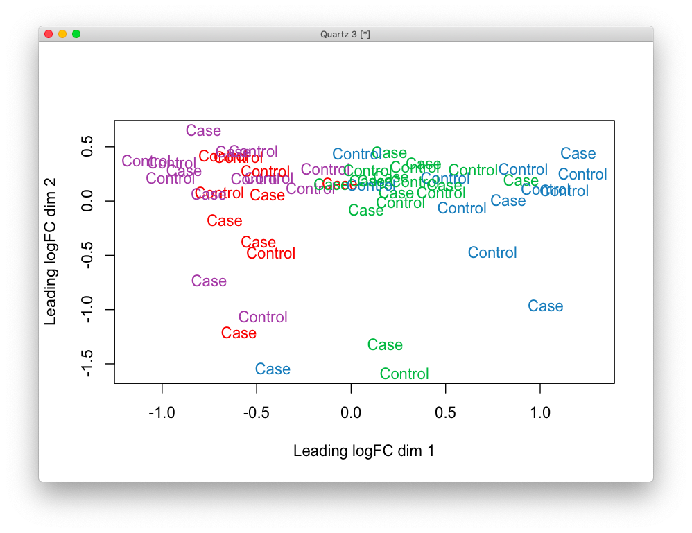

Colors are batches, and there isn't really an outlier. At least, not like when
compared to this:

```r
myregion = 'ACC'
data = readRDS('~/data/rnaseq_derek/complete_rawCountData_05132020.rds')
rownames(data) = data$submitted_name  # just to ensure compatibility later
data = data[data$Region==myregion, ]
more = readRDS('~/data/rnaseq_derek/data_from_philip_POP_and_PCs.rds')
more = more[!duplicated(more$hbcc_brain_id),]
data = merge(data, more[, c('hbcc_brain_id', 'comorbid', 'comorbid_group',
                            'substance', 'substance_group')],
             by='hbcc_brain_id', all.x=T, all.y=F)
grex_vars = colnames(data)[grepl(colnames(data), pattern='^ENS')]
count_matrix = t(data[, grex_vars])
data = data[, !grepl(colnames(data), pattern='^ENS')]
id_num = sapply(grex_vars, function(x) strsplit(x=x, split='\\.')[[1]][1])
rownames(count_matrix) = id_num
dups = duplicated(id_num)
id_num = id_num[!dups]
count_matrix = count_matrix[!dups, ]

library(biomaRt)
mart <- useDataset("hsapiens_gene_ensembl", useMart("ensembl"))
G_list0 <- getBM(filters= "ensembl_gene_id", attributes= c("ensembl_gene_id",
                 "hgnc_symbol", "chromosome_name"),values=id_num,mart= mart)
G_list <- G_list0[!is.na(G_list0$hgnc_symbol),]
G_list = G_list[G_list$hgnc_symbol!='',]
G_list <- G_list[!duplicated(G_list$ensembl_gene_id),]
imnamed = rownames(count_matrix) %in% G_list$ensembl_gene_id
count_matrix = count_matrix[imnamed, ]
# we're down from 60K to 38K samples by only looking at the ones with hgnc symbol. We might be losing too much here, so it's a step to reconsider in the future

data$POP_CODE = as.character(data$POP_CODE)
data[data$POP_CODE=='WNH', 'POP_CODE'] = 'W'
data[data$POP_CODE=='WH', 'POP_CODE'] = 'W'
data$POP_CODE = factor(data$POP_CODE)
data$Individual = factor(data$hbcc_brain_id)
data[data$Manner.of.Death=='Suicide (probable)', 'Manner.of.Death'] = 'Suicide'
data[data$Manner.of.Death=='unknown', 'Manner.of.Death'] = 'natural'
data$MoD = factor(data$Manner.of.Death)
data$batch = factor(as.numeric(data$run_date))

library(caret)
pp_order = c('zv', 'nzv')
pp = preProcess(t(count_matrix), method = pp_order)
X = predict(pp, t(count_matrix))
geneCounts = t(X)
G_list2 = merge(rownames(geneCounts), G_list, by=1)
colnames(G_list2)[1] = 'ensembl_gene_id'
imautosome = which(G_list2$chromosome_name != 'X' &
                   G_list2$chromosome_name != 'Y' &
                   G_list2$chromosome_name != 'MT')
geneCounts = geneCounts[imautosome, ]
G_list2 = G_list2[imautosome, ]
library(edgeR)
isexpr <- filterByExpr(geneCounts, group=data$Diagnosis)
genes = DGEList( geneCounts[isexpr,], genes=G_list2[isexpr,] ) 
genes = calcNormFactors( genes)

lcpm <- cpm(genes, log=TRUE)
library(RColorBrewer)
col.group <- data$batch
levels(col.group) <-  brewer.pal(nlevels(col.group), "Set1")
col.group <- as.character(col.group)
plotMDS(lcpm, labels=data$Diagnosis, col=col.group)
```

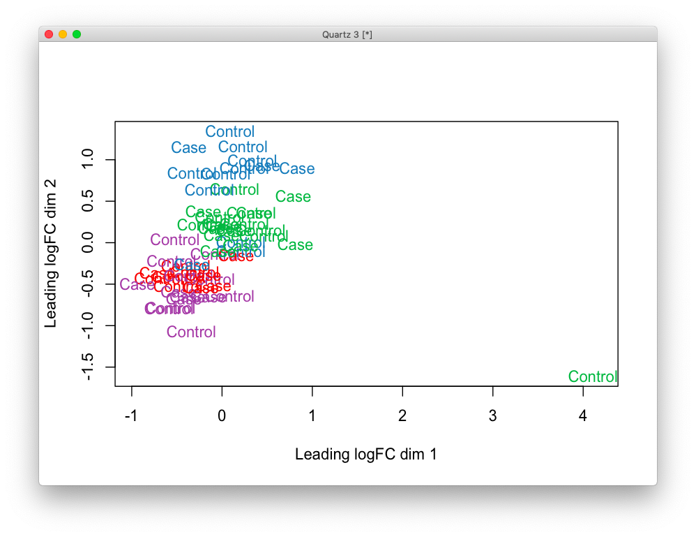

And just for sanity, let's plot our PCA results (note that these are still
results on the clean set pecause I never calculated PCA on this set with the
outlier).

```r
std_dev <- lcpm.pca$sdev
pr_var <- std_dev^2
prop_varex <- pr_var/sum(pr_var)
plot(prop_varex, xlab = "Principal Component",
             ylab = "Proportion of Variance Explained",
             type = "b")
```


So, with 11 PCs we are at about the asymptote, which is fine. Just remember that
we are not using just those 11 in the analysis! We just did that to restrict the
data where we look for noise!


## Caudate

Let's run the same analysis, but now for Caudate:

```r
myregion = 'Caudate'
data = readRDS('~/data/rnaseq_derek/complete_rawCountData_05132020.rds')
rownames(data) = data$submitted_name  # just to ensure compatibility later
data = data[data$Region==myregion, ]
more = readRDS('~/data/rnaseq_derek/data_from_philip_POP_and_PCs.rds')
more = more[!duplicated(more$hbcc_brain_id),]
data = merge(data, more[, c('hbcc_brain_id', 'comorbid', 'comorbid_group',
                            'substance', 'substance_group')],
             by='hbcc_brain_id', all.x=T, all.y=F)
grex_vars = colnames(data)[grepl(colnames(data), pattern='^ENS')]
count_matrix = t(data[, grex_vars])
data = data[, !grepl(colnames(data), pattern='^ENS')]
id_num = sapply(grex_vars, function(x) strsplit(x=x, split='\\.')[[1]][1])
rownames(count_matrix) = id_num
dups = duplicated(id_num)
id_num = id_num[!dups]
count_matrix = count_matrix[!dups, ]

library(biomaRt)
mart <- useDataset("hsapiens_gene_ensembl", useMart("ensembl"))
G_list0 <- getBM(filters= "ensembl_gene_id", attributes= c("ensembl_gene_id",
                 "hgnc_symbol", "chromosome_name"),values=id_num,mart= mart)
G_list <- G_list0[!is.na(G_list0$hgnc_symbol),]
G_list = G_list[G_list$hgnc_symbol!='',]
G_list <- G_list[!duplicated(G_list$ensembl_gene_id),]
imnamed = rownames(count_matrix) %in% G_list$ensembl_gene_id
count_matrix = count_matrix[imnamed, ]
# we're down from 60K to 38K samples by only looking at the ones with hgnc symbol. We might be losing too much here, so it's a step to reconsider in the future

data$POP_CODE = as.character(data$POP_CODE)
data[data$POP_CODE=='WNH', 'POP_CODE'] = 'W'
data[data$POP_CODE=='WH', 'POP_CODE'] = 'W'
data$POP_CODE = factor(data$POP_CODE)
data$Individual = factor(data$hbcc_brain_id)
data[data$Manner.of.Death=='Suicide (probable)', 'Manner.of.Death'] = 'Suicide'
data[data$Manner.of.Death=='unknown', 'Manner.of.Death'] = 'natural'
data$MoD = factor(data$Manner.of.Death)
data$batch = factor(as.numeric(data$run_date))

library(caret)
pp_order = c('zv', 'nzv')
pp = preProcess(t(count_matrix), method = pp_order)
X = predict(pp, t(count_matrix))
geneCounts = t(X)
G_list2 = merge(rownames(geneCounts), G_list, by=1)
colnames(G_list2)[1] = 'ensembl_gene_id'
imautosome = which(G_list2$chromosome_name != 'X' &
                   G_list2$chromosome_name != 'Y' &
                   G_list2$chromosome_name != 'MT')
geneCounts = geneCounts[imautosome, ]
G_list2 = G_list2[imautosome, ]
library(edgeR)
isexpr <- filterByExpr(geneCounts, group=data$Diagnosis)
genes = DGEList( geneCounts[isexpr,], genes=G_list2[isexpr,] ) 
genes = calcNormFactors( genes)

lcpm <- cpm(genes, log=TRUE)
library(RColorBrewer)
col.group <- data$batch
levels(col.group) <-  brewer.pal(nlevels(col.group), "Set1")
col.group <- as.character(col.group)
plotMDS(lcpm, labels=data$Diagnosis, col=col.group)
```

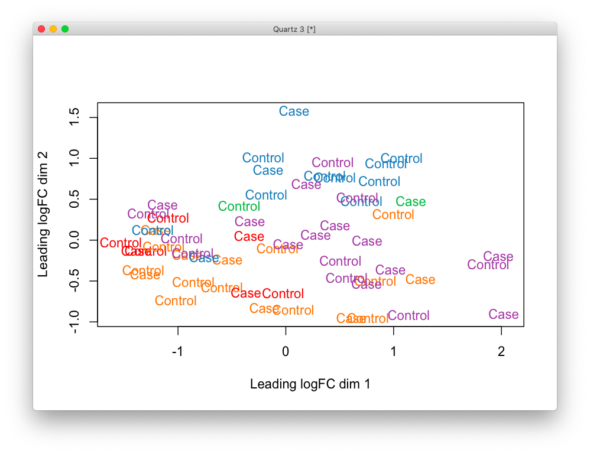

No outliers here, so we can just proceed with the PCA analysis.

```r
set.seed(42)
lcpm.pca <- prcomp(t(lcpm), scale=TRUE)
library(nFactors)
eigs <- lcpm.pca$sdev^2
nS = nScree(x=eigs)
keep_me = 1:nS$Components$nkaiser
mydata = data.frame(lcpm.pca$x[, keep_me])

std_dev <- lcpm.pca$sdev
pr_var <- std_dev^2
prop_varex <- pr_var/sum(pr_var)
plot(prop_varex, xlab = "Principal Component",
             ylab = "Proportion of Variance Explained",
             type = "b")
```

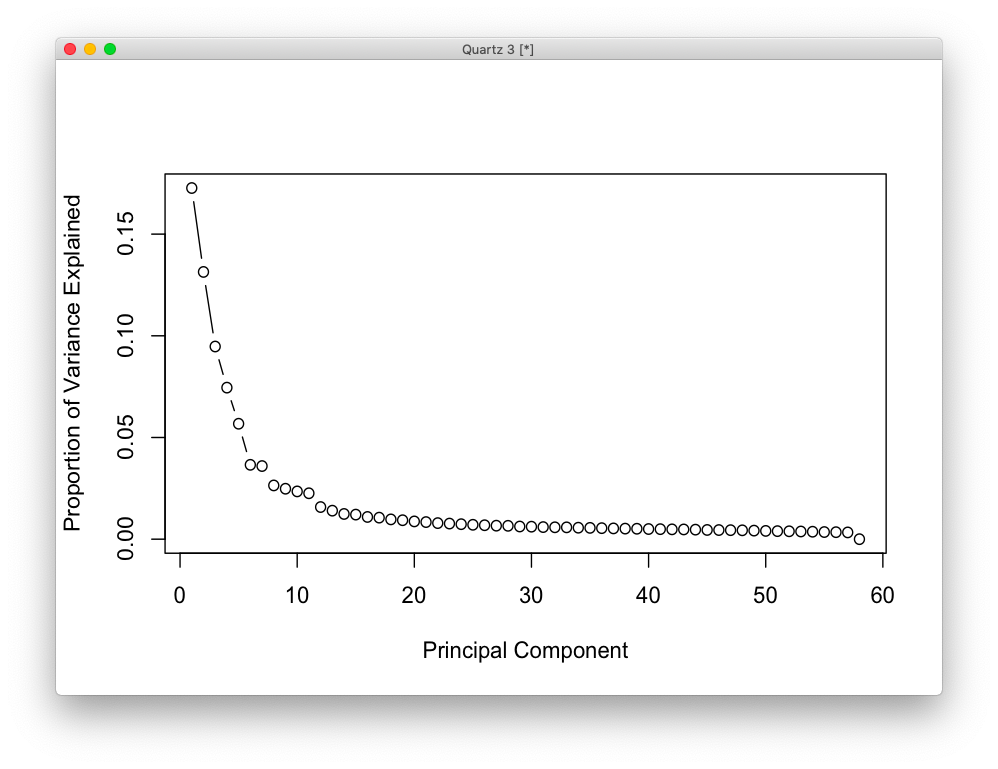

Kaiser selects 11 as well, which makes sense in the variance explained plot too.

```r
num_vars = c('pcnt_optical_duplicates', 'clusters', 'Age', 'RINe', 'PMI',
             'C1', 'C2', 'C3', 'C4', 'C5', 'C6', 'C7', 'C8', 'C9', 'C10')
pc_vars = colnames(mydata)
num_corrs = matrix(nrow=length(num_vars), ncol=length(pc_vars),
                   dimnames=list(num_vars, pc_vars))
num_pvals = num_corrs
for (x in num_vars) {
    for (y in pc_vars) {
        res = cor.test(data[, x], mydata[, y])
        num_corrs[x, y] = res$estimate
        num_pvals[x, y] = res$p.value
    }
}

library(corrplot)
corrplot(t(num_corrs), method='color', tl.cex=.5, cl.cex=.5)
```

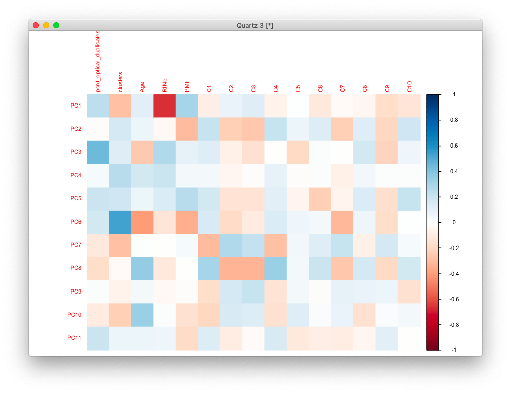

```r
categ_vars = c('batch', 'Diagnosis', 'MoD', 'substance_group',
               'comorbid_group', 'POP_CODE', 'Sex')
categ_corrs = matrix(nrow=length(categ_vars), ncol=length(pc_vars),
                   dimnames=list(categ_vars, pc_vars))
categ_pvals = categ_corrs
for (x in categ_vars) {
    for (y in pc_vars) {
        res = kruskal.test(mydata[, y], data[, x])
        categ_corrs[x, y] = res$statistic
        categ_pvals[x, y] = res$p.value
    }
}
corrplot(t(categ_corrs), method='color', tl.cex=.5, cl.cex=.5, is.corr=F)
```

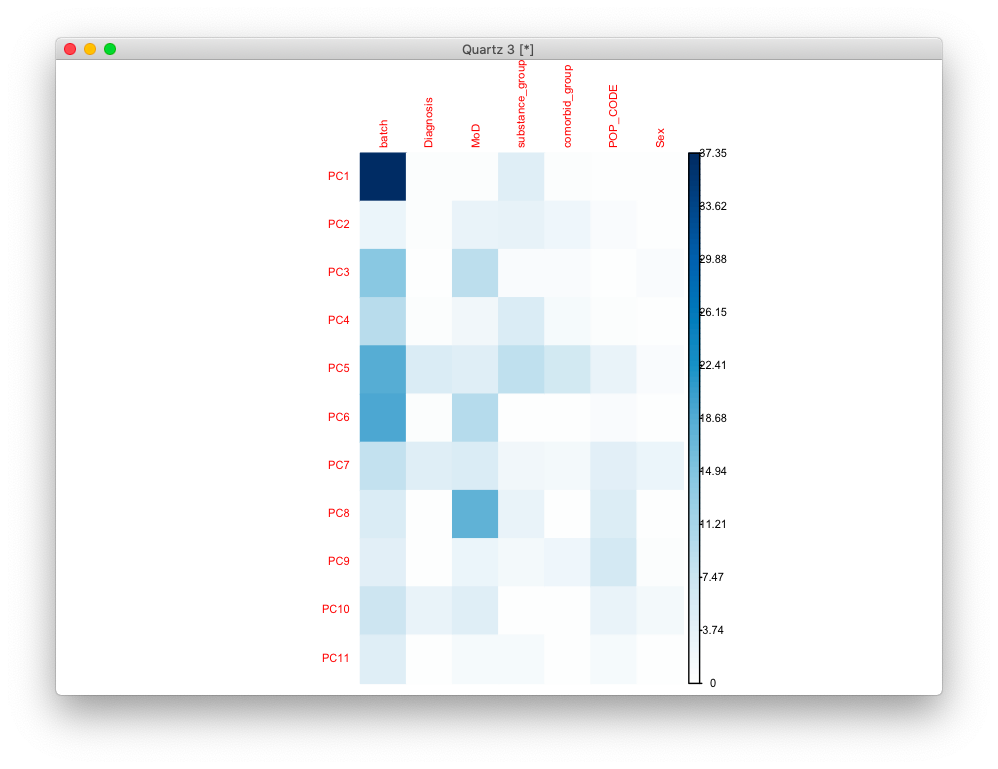

```
r$> which(num_pvals < .01, arr.ind = T)                               
                        row col
RINe                      4   1
pcnt_optical_duplicates   1   3
clusters                  2   6
Age                       3   6
PMI                       5   6
Age                       3   8

r$> which(categ_pvals < .01, arr.ind = T)                             
      row col
batch   1   1
batch   1   3
batch   1   5
batch   1   6
MoD     3   8
```

So, for Caudate we will include PCs 1, 3, 5, 6, and 8.

```r
data2 = cbind(data, mydata)
form = ~ Diagnosis + PC1 + PC3 + PC5 + PC6 + PC8
design = model.matrix( form, data2)
vobj = voom( genes, design, plot=FALSE)
fit <- lmFit(vobj, design)
fit2 <- eBayes( fit )
res = topTable(fit2, coef='DiagnosisControl', number=Inf)

adhd_camera = get_enrich_order2( res, t2 ) 
c5_camera = get_enrich_order2( res, c5_all)
dis_camera = get_enrich_order2( res, disorders)
dev_camera = get_enrich_order2( res, genes_unique )
```

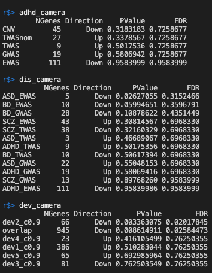

```r$> rownames(c5_camera)[c5_camera$FDR < .05]                                               
 [1] "GO_CILIUM_MOVEMENT"                                                       
 [2] "GO_AXONEME_ASSEMBLY"                                                      
 [3] "GO_INTRACILIARY_TRANSPORT"                                                
 [4] "GO_CILIUM_ORGANIZATION"                                                   
 [5] "GO_CILIARY_PLASM"                                                         
 [6] "GO_CILIARY_TIP"                                                           
 [7] "GO_INTRACILIARY_TRANSPORT_PARTICLE"                                       
 [8] "GO_CILIUM_OR_FLAGELLUM_DEPENDENT_CELL_MOTILITY"                           
 [9] "GO_INTRACILIARY_TRANSPORT_INVOLVED_IN_CILIUM_ASSEMBLY"                    
[10] "GO_MICROTUBULE_BUNDLE_FORMATION"                                          
[11] "GO_CILIUM"                                                                
[12] "GO_CILIARY_BASAL_BODY"                                                    
[13] "GO_SPERM_MOTILITY"                                                        
[14] "GO_MOTILE_CILIUM"                                                         
[15] "GO_PROTEIN_TRANSPORT_ALONG_MICROTUBULE"                                   
[16] "GO_CILIUM_MOVEMENT_INVOLVED_IN_CELL_MOTILITY"                             
[17] "GO_AXONEMAL_DYNEIN_COMPLEX_ASSEMBLY"                                      
[18] "GO_BITTER_TASTE_RECEPTOR_ACTIVITY"                                        
[19] "GO_INTRACILIARY_TRANSPORT_PARTICLE_B"                                     
[20] "GO_CILIARY_BASAL_BODY_PLASMA_MEMBRANE_DOCKING"                            
[21] "GO_EXTRACELLULAR_TRANSPORT"                                               
[22] "GO_RESPONSE_TO_TYPE_I_INTERFERON"                                         
[23] "GO_INNER_DYNEIN_ARM_ASSEMBLY"                                             
[24] "GO_REGULATION_OF_CILIUM_MOVEMENT"                                         
[25] "GO_DETECTION_OF_CHEMICAL_STIMULUS_INVOLVED_IN_SENSORY_PERCEPTION_OF_TASTE"
[26] "GO_CENTRIOLE"                                                             
```

Mostly sperm stuff... not sure what to make of these results. 19 of those are
also significant at q < .01.

## Adding more genes

I was a bit worried that our conversion to genes with HUGO IDs was eliminating
about 30K markers. Let's see if converting using a different database would do
better:

```r
myregion = 'Caudate'
data = readRDS('~/data/rnaseq_derek/complete_rawCountData_05132020.rds')
rownames(data) = data$submitted_name  # just to ensure compatibility later
data = data[data$Region==myregion, ]
more = readRDS('~/data/rnaseq_derek/data_from_philip_POP_and_PCs.rds')
more = more[!duplicated(more$hbcc_brain_id),]
data = merge(data, more[, c('hbcc_brain_id', 'comorbid', 'comorbid_group',
                            'substance', 'substance_group')],
             by='hbcc_brain_id', all.x=T, all.y=F)
grex_vars = colnames(data)[grepl(colnames(data), pattern='^ENS')]
count_matrix = t(data[, grex_vars])
data = data[, !grepl(colnames(data), pattern='^ENS')]
id_num = sapply(grex_vars, function(x) strsplit(x=x, split='\\.')[[1]][1])
rownames(count_matrix) = id_num
dups = duplicated(id_num)
id_num = id_num[!dups]
count_matrix = count_matrix[!dups, ]

library(biomaRt)
mart <- useDataset("hsapiens_gene_ensembl", useMart("ensembl"))
G_list0 <- getBM(filters= "ensembl_gene_id", attributes= c("ensembl_gene_id",
                 "hgnc_symbol", "chromosome_name"),values=id_num,mart= mart)
G_list <- G_list0[!is.na(G_list0$hgnc_symbol),]
G_list = G_list[G_list$hgnc_symbol!='',]
G_list <- G_list[!duplicated(G_list$ensembl_gene_id),]
imnamed = rownames(count_matrix) %in% G_list$ensembl_gene_id
count_matrix_bm = count_matrix[imnamed, ]
```

```
library('org.Hs.eg.db')
geneids = mapIds(org.Hs.eg.db, rownames(count_matrix), 'SYMBOL', 
    'ENSEMBL')
r$> sum(!is.na(geneids))                                             
[1] 26377
r$> dim(count_matrix)                                                
[1] 60558    58
r$> dim(count_matrix_bm)                                             
[1] 38548    58
```

So, I'm actually doing better using the BioMart conversion. Starting with 38.5K
genes is not bad (pre-cleaning), so I'll just start with that.

## Other gene set analysis

I'll use Caudate first, and let's check what's going with when analyzing with
goana, kegga, and fgsea.

```r
saveLimmaGeneSets<- function(res, idx, fname) {
  symbols = res[idx, 'hgnc_symbol']
  geneids = mapIds(org.Hs.eg.db, symbols, 'ENTREZID', 'SYMBOL')
  res_go = goana(geneids, species='Hs')
  res_go = res_go[order(res_go$P.DE),]
  res_go$FDR = p.adjust(res_go$P.DE, method='fdr')
  res_kegg = kegga(geneids, species='Hs')
  res_kegg = res_kegg[order(res_kegg$P.DE),]
  res_kegg$FDR = p.adjust(res_kegg$P.DE, method='fdr')
  out_fname = gsub(x=fname, pattern='.csv', replacement='_go.csv')
  write.csv(res_go, file=out_fname)
  out_fname = gsub(x=fname, pattern='.csv', replacement='_kegg.csv')
  write.csv(res_kegg, file=out_fname)
}

saveLimmaGeneSets(res, res$P.Value<.01, '~/tmp/limma_caudate_p01.csv')
saveLimmaGeneSets(res, res$P.Value<.05, '~/tmp/limma_caudate_p01.csv')
# r$> max(res$P.Value[1:100])                                          
# [1] 0.006035448
saveLimmaGeneSets(res, 1:100, '~/tmp/limma_caudate_top100.csv')
```

And we should also run it for ACC for comparison. But before we go there, let's
play a bit with fgsea:

```r
library(fgsea)
load('~/data/rnaseq_derek/c5_gene_sets.RData')
ranks = res$t
names(ranks) = res$hgnc_symbol
res2 = fgsea(c5_all, ranks)
ngood = sum(res2$pval<.01)
print(sprintf('Gene ontology nominal at p < .01: %d', ngood))
out_fname = '~/tmp/fgsea_caudate_c5.csv'
# not writing out last column which is a list of genes and it's messing up write.csv... we can check it later if needed
write.csv(res2[order(pval), 1:(ncol(res2)-1)], file=out_fname)
res2 = fgsea(disorders, ranks)
out_fname = '~/tmp/fgsea_caudate_disorders.csv'
write.csv(res2[order(pval), 1:(ncol(res2)-1)], file=out_fname)
res2 = fgsea(genes_unique, ranks)
out_fname = '~/tmp/fgsea_caudate_dev.csv'
write.csv(res2[order(pval), 1:(ncol(res2)-1)], file=out_fname)
```

For ACC, we run all the prep code above and do this:

```r
saveLimmaGeneSets(res, res$P.Value<.01, '~/tmp/limma_acc_p01.csv')
saveLimmaGeneSets(res, res$P.Value<.05, '~/tmp/limma_acc_p01.csv')
# r$> max(res$P.Value[1:100])                                          
# [1] 0.0034
saveLimmaGeneSets(res, 1:100, '~/tmp/limma_acc_top100.csv')

ranks = res$t
names(ranks) = res$hgnc_symbol
out_fname = '~/tmp/fgsea_acc_c5.csv'
write.csv(res2[order(pval), 1:(ncol(res2)-1)], file=out_fname)
res2 = fgsea(disorders, ranks)
out_fname = '~/tmp/fgsea_acc_disorders.csv'
write.csv(res2[order(pval), 1:(ncol(res2)-1)], file=out_fname)
res2 = fgsea(genes_unique, ranks)
out_fname = '~/tmp/fgsea_acc_dev.csv'
write.csv(res2[order(pval), 1:(ncol(res2)-1)], file=out_fname)
```

# 2020-10-15 06:32:38

I'm going to re-run everything above to construct and RData file with all the
result lists.

```
methyl_acc = readRDS('~/data/methylation_post_mortem/acc_methyl_results_10092020.rds')                                                                                                           

r$> methyl_caudate = readRDS('~/data/methylation_post_mortem/caudate_methyl_results_10092020.rds')                                                                                                   

r$> iso_acc_rsem = read.csv('~/data/isoforms/acc_rsem.csv')                                                                                                                                          

r$> iso_acc_kallisto = read.csv('~/data/isoforms/acc_kallisto.csv')                                                                                                                                  

r$> iso_caudate_rsem = read.csv('~/data/isoforms/caudate_rsem.csv')                                                                                                                                  

r$> iso_caudate_kallisto = read.csv('~/data/isoforms/caudate_kallisto.csv')                                                                                                                          

r$> save(rnaseq_acc, rnaseq_caudate, methyl_acc, methyl_caudate, iso_acc_kallisto, iso_acc_rsem, iso_caudate_kallisto, iso_caudate_rsem, file='~/data/rnaseq_derek/xmodal_results_10152020.RData')   
```

# 2020-11-04 10:02:32

Let's run the rnaseq through 10K perms too. Note that I had to change the
default top threshold so the results would report all gene sets, otherwise we
wouldn't be able to try the gene set over representation:

```
r$> files = list.files(path = '~/data/post_mortem//', pattern = 'gmt$')
r$> for (f in files) { gmt=readGmt(sprintf('~/data/post_mortem/%s', f)); cat(f, '\n'); print(dim(gmt))}                                        
ACC_developmental.gmt 
[1] 1604    3
caudate_developmental.gmt 
[1] 1584    3
disorders.gmt 
[1] 397   3
hsapiens_disease_Disgenet_entrezgene.gmt 
[1] 130821      3
hsapiens_geneontology_Biological_Process_noRedundant_entrezgene.gmt 
[1] 147751      3
hsapiens_geneontology_Cellular_Component_noRedundant_entrezgene.gmt 
[1] 27948     3
hsapiens_geneontology_Molecular_Function_noRedundant_entrezgene.gmt 
[1] 31567     3
hsapiens_network_PPI_BIOGRID_entrezgene.gmt 
[1] 87206     3
hsapiens_pathway_KEGG_entrezgene.gmt 
[1] 29964     3
```

So I changed it to 150K across the board to get p-values for all sets. But it
turns out that the WGs are only giving me 850 sets for GO Bio... at least its
the same for ACC and Caudate, so the comparison can still work. And 150K will
definitely cover everything, because the values I was spitting out above are the
rows, and the unique number of sets is the unique() of them.

```bash
# bw
source /data/$USER/conda/etc/profile.d/conda.sh
conda activate radian
~/.local/bin/radian
```

```r
# bw
library(WebGestaltR)

data_dir = '~/data/rnaseq_derek/'
load(sprintf('%s/xmodal_results_10152020.RData', data_dir))
ncpu=31

# region='acc'
region='caudate'
eval(parse(text=sprintf('res = rnaseq_%s', region)))

tmp2 = res[, c('hgnc_symbol', 't')]
for (db in c('geneontology_Biological_Process_noRedundant',
                'geneontology_Cellular_Component_noRedundant',
                'geneontology_Molecular_Function_noRedundant',
                'pathway_KEGG', 'disease_Disgenet',
                'phenotype_Human_Phenotype_Ontology',
                'network_PPI_BIOGRID')) {
    cat(region, db, '\n')
    project_name = sprintf('%s_%s', region, db)
    enrichResult <- WebGestaltR(enrichMethod="GSEA",
                                organism="hsapiens",
                                enrichDatabase=db,
                                interestGene=tmp2,
                                interestGeneType="genesymbol",
                                sigMethod="top", topThr=150000,
                                outputDirectory = data_dir,
                                minNum=5, projectName=project_name,
                                isOutput=T, isParallel=T,
                                nThreads=ncpu, perNum=10000)
    out_fname = sprintf('%s/WG_%s_%s_10K.csv', data_dir, region, db)
    write.csv(enrichResult, file=out_fname, quote=F,
                row.names=F)
}
# my own GMTs
for (db in c('disorders', sprintf('%s_developmental', region))) {
    cat(region, db, '\n')
    project_name = sprintf('%s_%s', region, db)
    db_file = sprintf('~/data/post_mortem/%s.gmt', db)
    enrichResult <- WebGestaltR(enrichMethod="GSEA",
                                organism="hsapiens",
                                enrichDatabaseFile=db_file,
                                enrichDatabaseType="genesymbol",
                                interestGene=tmp2,
                                outputDirectory = data_dir,
                                interestGeneType="genesymbol",
                                sigMethod="top", topThr=150000,
                                minNum=3, projectName=project_name,
                                isOutput=T, isParallel=T,
                                nThreads=ncpu, perNum=10000)
    out_fname = sprintf('%s/WG_%s_%s_10K.csv', data_dir, region, db)
    write.csv(enrichResult, file=out_fname, quote=F,
                row.names=F)
}
```

# 2020-11-08 16:30:47

Also run the redundant sets for a better comparisons to the camera results:

```r
for (db in c('geneontology_Biological_Process',
                'geneontology_Cellular_Component',
                'geneontology_Molecular_Function')) {
```

# TODO
