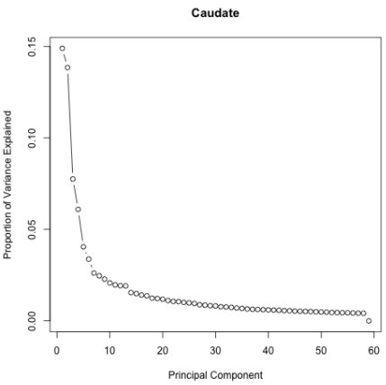

# 2020-10-02 11:57:43

I'm going to reproduce Alex's methylation analysis here, but using the updated
packages and also using a more principled way for selecting the PCs. His
original script is in data/Methylation_pipeline-Sep22.rmd

```r
library(doParallel)
library(data.table)
library(ChAMP)
library(ChAMPdata)
library(ewastools)
library(MethylToSNP)
library(qqman)
library(EnhancedVolcano)
library(reshape2)
library(ggplot2)
library(ggpubr)
library(corrplot)
library(ggfortify)
library(ggbiplot)
library(stringr)
library(scales)
library(writexl)
library(limma)

registerDoParallel(cores = 3)

saveExcel<- function(v) {
    name <- deparse(substitute(v))
    writexl::write_xlsx(cbind(index=rownames(v), as.data.frame(v)),
                        paste0(name, ".xlsx"))
}

addalpha <- function(colors, alpha=1.0) {
  r <- col2rgb(colors, alpha=T)
  # Apply alpha
  r[4,] <- alpha*255
  r <- r/255.0
  return(rgb(r[1,], r[2,], r[3,], r[4,]))
}

rootDir <- "~/data/methylation_post_mortem"
rawDataDir <- paste(rootDir, '/Shaw_2019', sep="")
samplesFile <- paste(rootDir, '/samples.csv', sep="")
```

I'm going to stop here for now, but the next step is to transform Alex's samples
file to .csv to make sure it works and loads the data properyl. Stopping because
I want to check that the PCA analysis works on my RNAseq data as well before
running this to send a list of genes and probes to David.

# 2020-10-07 13:27:42

Let's pick it up from where we left of.

```r
# disable scientific notation
options(scipen = 999)
samples <- read.csv(samplesFile)
samples$Sample_Group <- as.factor(as.character(samples$Diagnosis))
samples$Basename <- paste0(rawDataDir, '/',  samples$Sentrix_ID, '/',
                           samples$Sentrix_ID,'_',samples$Sentrix_Position)
raw = read_idats(samples$Basename, quiet = FALSE)
raw$sample_names <- samples$Sample_Name
```

Loading the samples took a few minutes, but it looks like it worked. Moving on
to QC:

```r
# checks control metrics according to https://support.illumina.com/content/dam/illumina-support/documents/documentation/chemistry_documentation/infinium_assays/infinium_hd_methylation/beadarray-controls-reporter-user-guide-1000000004009-00.pdf
ctrls = control_metrics(raw)
stripchart(ctrls$`Bisulfite Conversion I Green`, method="jitter", pch=4,
           xlab='Bisulfite Conversion I Green',xlim=c(0,10))
abline(v=1,col=2,lty=3)

stripchart(ctrls$`Bisulfite Conversion I Red`, method="jitter", pch=4,
           xlab='Bisulfite Conversion I Red',xlim=c(0,10))
abline(v=1,col=2,lty=3)

stripchart(ctrls$`Bisulfite Conversion II`, method="jitter", pch=4,
           xlab='Bisulfite Conversion II',xlim=c(0,10))
abline(v=1,col=2,lty=3)

failed.samples <- samples[sample_failure(ctrls),
                          c("Sample_Group", "Sentrix_ID")]
```


QC looks good, no failed samples. Checking sex:

```r
pheno = data.table(samples)
pheno$sex <- tolower(pheno$Sex)
pheno[, c("X","Y") := check_sex(raw)]
pheno[, predicted_sex := predict_sex(X, Y, which(sex=="m"), which(sex=="f"))]

tmp = pheno[predicted_sex==sex]
plot(Y ~ X, data=tmp, pch=ifelse(tmp$sex=="f",1,4), asp=1,
     xlab="Normalized X chromosome intensities",
     ylab="Normalized Y chromosome intensities")
tmp = pheno[predicted_sex!=sex]
```


There were no mismatches between predicted and declared sex.

# 2020-10-08 06:08:39

Let's continue with preprocessing:

```r
#  Preprocess with normalize450k / ewastools that includes bg and dye corrections
meth = raw %>% detectionP %>% mask(0.01) %>% correct_dye_bias() %>% dont_normalize
# split filtered results between markers with rs in their name and without
colnames(meth) <- samples$Sample_Name
meth.rs <- meth[grep("rs", rownames(meth)),]
meth.nors <-meth[grep("rs", rownames(meth), invert=TRUE),]
# Filter probes: sex chr, SNP (general, EUR, AFR), CpG, Multi-hit
# apply typical champ filters, including common general SNPs
filtered <- champ.filter(beta=meth.nors, pd=samples, filterDetP = FALSE,
                         filterXY = TRUE, autoimpute=FALSE, filterNoCG = TRUE,
                         filterMultiHit = TRUE, filterBeads = FALSE,
                         fixOutlier=FALSE, arraytype="EPIC")
meth.filtered <- na.omit(filtered$beta)
dim(meth.filtered)
```

We are now down to 647K markers, from the initial 865K. I'll skip checking the
QC control samples because Alex has already done it, and he didn't include them
in his samples spreadsheet. I'd have to reconstruct the sheet from the sample
sheet of each box to redo it. Not worth it if he has already confirmed that the
QC controls match...

So, let's get an idea about the data we're working with:

```r
table(samples$Sex)
table(samples$Diagnosis)
table(samples$Brainbank)
table(samples$Manner.of.Death)
table(samples$Kit)
```

```
F  M 
21 94 

   Case Control 
     51      64 

nimh_hbcc      pitt      umbn 
       50        19        46 

          Accident           Homicide            natural            Suicide Suicide (probable)            unknown
                32                 20                 38                 21                  2                  2

Qiagen   Zymo
    59     56
```

I'll do the same modifications I did for the RNAseq data:

```r
samples$Sentrix_ID <- as.factor(samples$Sentrix_ID)
samples$Sample_Group <- as.factor(samples$Sample_Group)
samples$Row <- as.factor(substr(samples$Sentrix_Position, 1, 3))
samples$Scanner <- as.factor(samples$Scanner)
samples$Region <- as.factor(samples$Region)
samples$Sex <- as.factor(samples$Sex)
samples$Kit <- as.factor(samples$Kit)
samples$Sample_Plate <- as.factor(samples$Sample_Plate)

more = readRDS('~/data/rnaseq_derek/data_from_philip_POP_and_PCs.rds')
more = more[!duplicated(more$hbcc_brain_id),]
samples = merge(samples, more[, c('hbcc_brain_id', 'comorbid', 'comorbid_group',
                                  'substance', 'substance_group', 'C1', 'C2',
                                  'C3', 'C4', 'C5', 'C6', 'C7', 'C8', 'C9',
                                  'C10', 'POP_CODE')],
             by='hbcc_brain_id', all.x=T, all.y=F)
samples$POP_CODE = as.character(samples$POP_CODE)
samples[which(samples$POP_CODE=='WNH'), 'POP_CODE'] = 'W'
samples[which(samples$POP_CODE=='WH'), 'POP_CODE'] = 'W'
samples$POP_CODE = factor(samples$POP_CODE)
samples[which(samples$Manner.of.Death=='Suicide (probable)'),
        'Manner.of.Death'] = 'Suicide'
samples[which(samples$Manner.of.Death=='unknown'),
        'Manner.of.Death'] = 'natural'
samples$MoD = factor(samples$Manner.of.Death)
```

Before we run the PCA analysis, let's split the data between ACC and Caudate.

```r
is.caudate <- samples$Region == 'Caudate'
is.outlier <- samples$Sample_Name == "1908_ACC"

samples.caudate <- samples[is.caudate, ]
samples.acc <- samples[!is.caudate & !is.outlier, ]

meth.caudate <- meth.filtered[, is.caudate]
meth.acc <- meth.filtered[, !is.caudate & !is.outlier]

# Stratified PCA
set.seed(42)
meth.caudate.pca <- prcomp(t(meth.caudate), scale.=TRUE)
meth.acc.pca <- prcomp(t(meth.acc), scale.=TRUE)
```

Like in the RNAseq analysis, let's figure out how many PCs to use for ACC and
Caudate.

```r
library(nFactors)
eigs <- meth.acc.pca$sdev^2
nS = nScree(x=eigs)
keep_me = 1:nS$Components$nkaiser
pcs.acc = data.frame(meth.acc.pca$x[, keep_me])

std_dev <- meth.acc.pca$sdev
pr_var <- std_dev^2
prop_varex <- pr_var/sum(pr_var)
plot(prop_varex, xlab = "Principal Component",
             ylab = "Proportion of Variance Explained",
             type = "b", main='ACC')


eigs <- meth.caudate.pca$sdev^2
nS = nScree(x=eigs)
keep_me = 1:nS$Components$nkaiser
pcs.caudate = data.frame(meth.caudate.pca$x[, keep_me])

std_dev <- meth.caudate.pca$sdev
pr_var <- std_dev^2
prop_varex <- pr_var/sum(pr_var)
plot(prop_varex, xlab = "Principal Component",
             ylab = "Proportion of Variance Explained",
             type = "b", main='Caudate')
```

We got 9 for ACC and 13 for Caudate.




Now let's make the same plots as the RNAseq analysis, but most importantly we
need to see which PCs are correlated with the data at a certain threshold.

```r
num_vars = c('pH', 'Age', 'RINe', 'PMI', 'RIN',
             'C1', 'C2', 'C3', 'C4', 'C5', 'C6', 'C7', 'C8', 'C9', 'C10')
pc_vars = colnames(pcs.acc)
num_corrs = matrix(nrow=length(num_vars), ncol=length(pc_vars),
                   dimnames=list(num_vars, pc_vars))
num_pvals = num_corrs
for (x in num_vars) {
    for (y in pc_vars) {
        res = cor.test(samples.acc[, x], pcs.acc[, y])
        num_corrs[x, y] = res$estimate
        num_pvals[x, y] = res$p.value
    }
}

library(corrplot)
corrplot(t(num_corrs), method='color', tl.cex=1, cl.cex=1)
```


```r
categ_vars = c('MoD', 'substance_group',
               'comorbid_group', 'POP_CODE', 'Sex',
               "Sentrix_ID", "Row", "Scanner", "Kit", "Sample_Group",
               "Brainbank")
categ_corrs = matrix(nrow=length(categ_vars), ncol=length(pc_vars),
                   dimnames=list(categ_vars, pc_vars))
categ_pvals = categ_corrs
for (x in categ_vars) {
    for (y in pc_vars) {
        res = kruskal.test(pcs.acc[, y], samples.acc[, x])
        categ_corrs[x, y] = res$statistic
        categ_pvals[x, y] = res$p.value
    }
}
corrplot(t(categ_corrs), method='color', tl.cex=1, cl.cex=1, is.corr=F)
```


```
r$> which(num_pvals < .01, arr.ind = T)                                                                                                                                        
    row col
pH    1   2
pH    1   4
C2    7   5
C3    8   5
C4    9   5
C7   12   5
RIN   5   6

r$> which(categ_pvals < .01, arr.ind = T)                                                                                                                                      
           row col
Sentrix_ID   6   2
Brainbank   11   2
Kit          9   5
Brainbank   11   5
Brainbank   11   9
```

So, for ACC we will remove PCs 2, 4, 5, 6, and 9. And the minimum p-value for
Sample_Group was .19, so we're good there. Let's check the Caudate:

```r
num_vars = c('pH', 'Age', 'RINe', 'PMI', 'RIN',
             'C1', 'C2', 'C3', 'C4', 'C5', 'C6', 'C7', 'C8', 'C9', 'C10')
pc_vars = colnames(pcs.caudate)
num_corrs = matrix(nrow=length(num_vars), ncol=length(pc_vars),
                   dimnames=list(num_vars, pc_vars))
num_pvals = num_corrs
for (x in num_vars) {
    for (y in pc_vars) {
        res = cor.test(samples.caudate[, x], pcs.caudate[, y])
        num_corrs[x, y] = res$estimate
        num_pvals[x, y] = res$p.value
    }
}

library(corrplot)
corrplot(t(num_corrs), method='color', tl.cex=1, cl.cex=1)
```


```r
categ_vars = c('MoD', 'substance_group',
               'comorbid_group', 'POP_CODE', 'Sex',
               "Sentrix_ID", "Row", "Scanner", "Kit", "Sample_Group",
               "Brainbank")
categ_corrs = matrix(nrow=length(categ_vars), ncol=length(pc_vars),
                   dimnames=list(categ_vars, pc_vars))
categ_pvals = categ_corrs
for (x in categ_vars) {
    for (y in pc_vars) {
        res = kruskal.test(pcs.caudate[, y], samples.caudate[, x])
        categ_corrs[x, y] = res$statistic
        categ_pvals[x, y] = res$p.value
    }
}
corrplot(t(categ_corrs), method='color', tl.cex=1, cl.cex=1, is.corr=F)
```


```
r$> which(num_pvals < .01, arr.ind = T)                                                                                                                                        
    row col
pH    1   1
C9   14   2
C3    8   5
PMI   4   6
C2    7  12
C4    9  12

r$> which(categ_pvals < .01, arr.ind = T)                                                                                                                                      
           row col
Sentrix_ID   6   1
Brainbank   11   1
Brainbank   11   5
Brainbank   11   6
Scanner      8  12
```

And for Caudate we will remove PCs 1, 2, 5, 6, and 12. And the minimum p-value for
Sample_Group was .1, so we're also good there.

Now we do the actual statistical model:

```r
# Differential methylation for Caudate: M-values with limma model corrected for unwanted variance
# limma to predict DMP from M values
vars.caudate = cbind(samples.caudate, pcs.caudate)
var <- model.matrix(~ PC1 + PC2 + PC5 + PC6 + PC12 + Sample_Group,
                    data=vars.caudate)
M <- logit2(meth.caudate) # convert beta to M:  log2(beta) - log2(1 - beta)
library(limma)
fit <- lmFit(M, var)
fit2 <- eBayes(fit, trend=TRUE, robust=TRUE)
probes.limma.caudate <- topTable(fit2, adjust="fdr",
                                 coef=colnames(var)[ncol(var)], num=Inf)
```

```
r$> head(probes.limma.caudate)                                                                                                                                                 
                logFC    AveExpr         t        P.Value adj.P.Val         B
cg09992259 -0.4017439  1.3097275 -5.329861 0.000001704884 0.9294906 1.8918339
cg20792284 -0.8355384 -4.7842311 -5.188071 0.000002868931 0.9294906 1.6101347
cg15980797  0.3810369 -2.7444191  4.712723 0.000015884321 0.9994431 0.6719115
cg21827674  0.7213013  0.7737180  4.657451 0.000019308328 0.9994431 0.5638065
cg02390806  0.5005134 -1.6282955  4.603950 0.000023304672 0.9994431 0.4594285
cg02556924 -0.4497043 -0.6535741 -4.567987 0.000026433472 0.9994431 0.3894228
```

And we do the same for ACC:

```r
vars.acc = cbind(samples.acc, pcs.acc)
var <- model.matrix(~ PC2 + PC4 + PC5 + PC6 + PC9 + Sample_Group,
                    data=vars.acc)
M <- logit2(meth.acc) # convert beta to M:  log2(beta) - log2(1 - beta)
fit <- lmFit(M, var)
fit2 <- eBayes(fit, trend=TRUE, robust=TRUE)
probes.limma.acc <- topTable(fit2, adjust="fdr",
                             coef=colnames(var)[ncol(var)], num=Inf)
```

```
r$> head(probes.limma.acc)                                                                                                                                                     
                logFC   AveExpr         t        P.Value adj.P.Val         B
cg17427421  0.3600533  2.627971  5.171306 0.000003658587 0.8210943 1.2624822
cg12848592 -0.6123150 -5.352947 -5.144062 0.000004029615 0.8210943 1.2124132
cg16900188  0.4217245  3.701550  5.141539 0.000004065804 0.8210943 1.2077755
cg07910816  0.4387288  2.827655  5.056224 0.000005496727 0.8210943 1.0510215
cg18389630  0.3709812  3.246830  4.799408 0.000013502251 0.8210943 0.5800598
cg16660494  0.3644896  3.212603  4.740526 0.000016557385 0.8210943 0.4724045
```

Again, nothing survives FDR, but not really surprising. 

At this point, let's save our results and then we can start investigating gene
set analysis.

```r
save(meth.acc, meth.caudate, pcs.acc, pcs.caudate, probes.limma.acc,
     probes.limma.caudate, samples.acc, samples.caudate,
     file='~/data/methylation_post_mortem/main_results_10082020.RData')
```

Now we need to attach some genes to all these probes. 

```r
data("probe.features.epic")
probes.limma.caudate.annotated <- merge(probes.limma.caudate, probe.features,
                                        by="row.names", sort=FALSE, all.x=TRUE)
probes.limma.acc.annotated <- merge(probes.limma.acc, probe.features,
                                    by="row.names", sort=FALSE, all.x=TRUE)
```

Let me re-create some of Alex's plots so we can retain his code, but also to see
the differences using the modifications I made in the analaysis:

```r
# Manhattan plot
mhplot <- function(data, genomewide_threshold=5e-6, annotate_threshold=1e-5) {
    # Creating a data set of the require data
    manhattan.data<-data.frame(feature=data$gene,CHR=data$CHR,
      MAPINFO=data$MAPINFO, adj.P.Val = data$adj.P.Val,  P.Value = data$P.Value)
    
    # We have to turn Chr into a numeric vector for this function
    manhattan.data$CHR <- as.character(manhattan.data$CHR)
    manhattan.data$CHR <- sub("chr","",manhattan.data$CHR)
    manhattan.data$CHR[which(manhattan.data$CHR=="X")] <- "23"
    manhattan.data$CHR[which(manhattan.data$CHR=="Y")] <- "24"
    manhattan.data$CHR <- as.numeric(manhattan.data$CHR)
    
    # Create Manhattan plot
    manhattan(manhattan.data, col = c("deepskyblue4", "deepskyblue3"), chr = "CHR", bp = "MAPINFO", p = "P.Value", snp = "feature", suggestiveline=FALSE, genomewideline=-log10(genomewide_threshold), annotatePval=annotate_threshold, annotateTop=TRUE)
}

mhplot(probes.limma.caudate.annotated)
mhplot(probes.limma.acc.annotated)
```


Top Manhatan is for Caudate, bottom for ACC.

And we try some Volcano plots too:

```r
EnhancedVolcano(
  probes.limma.caudate.annotated,
  lab = rownames(probes.limma.caudate.annotated),
  x = 'logFC',
  y = 'P.Value',
  ylab = bquote(~-Log[10]~italic(P)["non-adjusted"]),
  xlab = bquote(~"logFC"),
  xlim = c(-0.7, +0.7),
  ylim = c(0, 6),
  axisLabSize = 12,
  title="",
  subtitle="",
  caption="",
  subtitleLabSize = 0,
  captionLabSize = 0,
  titleLabSize = 0,
  legendPosition = "none",
  pCutoff = 1e-5,
  FCcutoff = 0.2,
  selectLab=c(''),
  col=c('gray60', 'gray60', 'black', 'red'),
  )
```


```r
EnhancedVolcano(
  probes.limma.acc.annotated,
  lab = rownames(probes.limma.acc.annotated),
  x = 'logFC',
  y = 'P.Value',
  ylab = bquote(~-Log[10]~italic(P)["non-adjusted"]),
  xlab = bquote(~"logFC"),
  xlim = c(-0.7, +0.7),
  ylim = c(0, 7),
  axisLabSize = 12,
  title="",
  subtitle="",
  caption="",
  subtitleLabSize = 0,
  captionLabSize = 0,
  titleLabSize = 0,
  legendPosition = "none",
  pCutoff = 1e-5,
  FCcutoff = 0.2,
  selectLab=c(''),
  col=c('gray60', 'gray60', 'black', 'red'),
  )
```


I'm not sure where Alex got those p-value thresholds from. The GWAS threshold is
5*10^-8, and what I could find for epigenome is 2.4×10-7 for the entire 450K
array. In our analysis I get 1*10^-7 if using the ones with gene annotation,
7.7*10^-8 if using all annotated probes.  

Since we're doing gene set analysis, we should keep it only to the probes
annotated with genes.

```r
idx = probes.limma.acc.annotated$gene != ''
genes.acc = probes.limma.acc.annotated[idx, ]
idx = probes.limma.caudate.annotated$gene != ''
genes.caudate = probes.limma.caudate.annotated[idx, ]
```

Then we run our usual gene set analysis:

```r
get_enrich_order2 = function( res, gene_sets ){
  if( !is.null(res$z.std) ){
    stat = res$z.std
  }else if( !is.null(res$F.std) ){
    stat = res$F.std
  }else if( !is.null(res$t) ){
    stat = res$t
  }else{
    stat = res$F
  }
  names(stat) = res$gene
  stat = stat[!is.na(names(stat))]
  # print(head(stat))
  index = ids2indices(gene_sets, names(stat))
  cameraPR( stat, index )
}
load('~/data/rnaseq_derek/adhd_genesets_philip.RDATA')
load('~/data/rnaseq_derek/c5_gene_sets.RData')
load('~/data/rnaseq_derek/brain_disorders_gene_sets.RData')
load('~/data/rnaseq_derek/data_for_alex.RData')
co = .9 
idx = anno$age_category==1 & anno$cutoff==co
genes_overlap = unique(anno[idx, 'anno_gene'])
for (s in 2:5) {
  idx = anno$age_category==s & anno$cutoff==co
  g2 = unique(anno[idx, 'anno_gene'])
  genes_overlap = intersect(genes_overlap, g2)
}
genes_unique = list()
for (s in 1:5) {
  others = setdiff(1:5, s)
  idx = anno$age_category==s & anno$cutoff==co
  g = unique(anno[idx, 'anno_gene'])
  for (s2 in others) {
    idx = anno$age_category==s2 & anno$cutoff==co
    g2 = unique(anno[idx, 'anno_gene'])
    rm_me = g %in% g2
    g = g[!rm_me]
  }
  genes_unique[[sprintf('dev%s_c%.1f', s, co)]] = unique(g)
}
genes_unique[['overlap']] = unique(genes_overlap)

adhd_acc = get_enrich_order2( genes.acc, t2 ) 
c5_acc = get_enrich_order2( genes.acc, c5_all)
dis_acc = get_enrich_order2( genes.acc, disorders)
dev_acc = get_enrich_order2( genes.acc, genes_unique )

adhd_caudate = get_enrich_order2( genes.caudate, t2 ) 
c5_caudate = get_enrich_order2( genes.caudate, c5_all)
dis_caudate = get_enrich_order2( genes.caudate, disorders)
dev_caudate = get_enrich_order2( genes.caudate, genes_unique )
```

In case I want to run Meff, this is the code:

```r
cc = cor(data)
M = nrow(cc)
cnt = 0
for (j in 1:M) {
    print(j)
    for (k in 1:M) {
        cnt = cnt + (1 - cc[j, k]**2)
    }
}
meff = 1 + cnt / M
cat(sprintf('Galwey Meff = %.2f\n', meff))
```

But that assumes samples as rows, which is not our case. And we cannot put a
square matrix of 650K in memory. So, maybe we can change this to compute on the
fly?

```r
# calculates Meff without computing the costly big cc matrix, but paying in run
# time to calculate each correlation in the loop.
# mydata is vars by samples
slow_meff = function(mydata) {
    M = nrow(mydata)
    cnt = 0
    for (j in 1:M) {
        # print(j)
        for (k in 1:M) {
            cnt = cnt + (1 - cor(mydata[j, ], mydata[k, ])**2)
        }
    }
    meff = 1 + cnt / M
    cat(sprintf('Galwey Meff = %.2f\n', meff))
    return(meff)
}
```

That run the whole night on my laptop and still didn't finish. I might need to
parallelize it or try running the big correlation matrix in a big machine.


# TODO
 * is there a better result if we look only at certain feature or cgi annotated results?
 * start looking at islands only, then shore, shelf, then sea?
 * look at only genes at a certain SNP distance?
 * we can look more into the hypergeometric test:
   * https://sbc.shef.ac.uk/workshops/2018-07-10-rna-seq/rna-seq-gene-set-testing.nb.html
   * https://www.bioconductor.org/packages/devel/bioc/vignettes/GeneOverlap/inst/doc/GeneOverlap.pdf
   * https://bioinfogp.cnb.csic.es/tools/venny/index.html
   * http://www.pangloss.com/wiki/VennSignificance
 