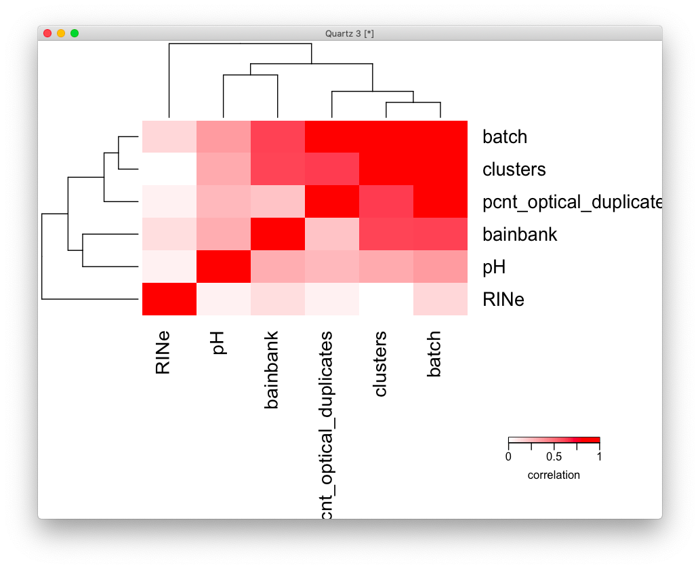

# 2020-10-05 07:03:35

After the bust on 133 removing PCAs, let's go back and assess how much variance
the population PCs explain. Let's compare that to some random noise too.

We start by repeating the previous analysis showing the technical variables we
need to keep:

```r
myregion = 'ACC'
data = readRDS('~/data/rnaseq_derek/complete_rawCountData_05132020.rds')
rownames(data) = data$submitted_name  # just to ensure compatibility later
# remove obvious outlier (that's NOT caudate) labeled as ACC
rm_me = rownames(data) %in% c('68080')
data = data[!rm_me, ]
data = data[data$Region==myregion, ]
more = readRDS('~/data/rnaseq_derek/data_from_philip_POP_and_PCs.rds')
more = more[!duplicated(more$hbcc_brain_id),]
data = merge(data, more[, c('hbcc_brain_id', 'comorbid', 'comorbid_group',
                            'substance', 'substance_group')],
             by='hbcc_brain_id', all.x=T, all.y=F)

# at this point we have 55 samples for ACC
grex_vars = colnames(data)[grepl(colnames(data), pattern='^ENS')]
count_matrix = t(data[, grex_vars])
data = data[, !grepl(colnames(data), pattern='^ENS')]
id_num = sapply(grex_vars, function(x) strsplit(x=x, split='\\.')[[1]][1])
rownames(count_matrix) = id_num
dups = duplicated(id_num)
id_num = id_num[!dups]
count_matrix = count_matrix[!dups, ]

library(biomaRt)
mart <- useDataset("hsapiens_gene_ensembl", useMart("ensembl"))
G_list0 <- getBM(filters= "ensembl_gene_id", attributes= c("ensembl_gene_id",
                 "hgnc_symbol", "chromosome_name"),values=id_num,mart= mart)
G_list <- G_list0[!is.na(G_list0$hgnc_symbol),]
G_list = G_list[G_list$hgnc_symbol!='',]
G_list <- G_list[!duplicated(G_list$ensembl_gene_id),]
imnamed = rownames(count_matrix) %in% G_list$ensembl_gene_id
count_matrix = count_matrix[imnamed, ]
# we're down from 60K to 38K samples by only looking at the ones with hgnc symbol. We might be losing too much here, so it's a step to reconsider in the future

data$POP_CODE = as.character(data$POP_CODE)
data[data$POP_CODE=='WNH', 'POP_CODE'] = 'W'
data[data$POP_CODE=='WH', 'POP_CODE'] = 'W'
data$POP_CODE = factor(data$POP_CODE)
data$Individual = factor(data$hbcc_brain_id)
data[data$Manner.of.Death=='Suicide (probable)', 'Manner.of.Death'] = 'Suicide'
data[data$Manner.of.Death=='unknown', 'Manner.of.Death'] = 'natural'
data$MoD = factor(data$Manner.of.Death)
data$batch = factor(as.numeric(data$run_date))

library(caret)
pp_order = c('zv', 'nzv')
pp = preProcess(t(count_matrix), method = pp_order)
X = predict(pp, t(count_matrix))
geneCounts = t(X)
G_list2 = merge(rownames(geneCounts), G_list, by=1)
colnames(G_list2)[1] = 'ensembl_gene_id'
imautosome = which(G_list2$chromosome_name != 'X' &
                   G_list2$chromosome_name != 'Y' &
                   G_list2$chromosome_name != 'MT')
geneCounts = geneCounts[imautosome, ]
G_list2 = G_list2[imautosome, ]
library(edgeR)
isexpr <- filterByExpr(geneCounts, group=data$Diagnosis)
genes = DGEList( geneCounts[isexpr,], genes=G_list2[isexpr,] ) 
genes = calcNormFactors( genes)

# I'll keep it to lcpm estimates (and not cpm) because it looks like that's what limma uses in its model (https://bioconductor.org/packages/release/bioc/vignettes/limma/inst/doc/usersguide.pdf, page 125).
```

**So, keep in mind that these results are for ACC only!**

```r
library(variancePartition)
form <- ~ batch + RINe + bainbank + pH + pcnt_optical_duplicates + clusters
C = canCorPairs( form, data)
plotCorrMatrix( C )
```



Like we previously thought, if we remove batch we take care of pretty much
everything other than RINe and pH. Now, let's see how much variance the
biological variables actually explain, compared to these technical ones and some
random noise. 


# TODO
 * should we get HUGO symbols from somewhere else that doesn't waste 30K markers?


