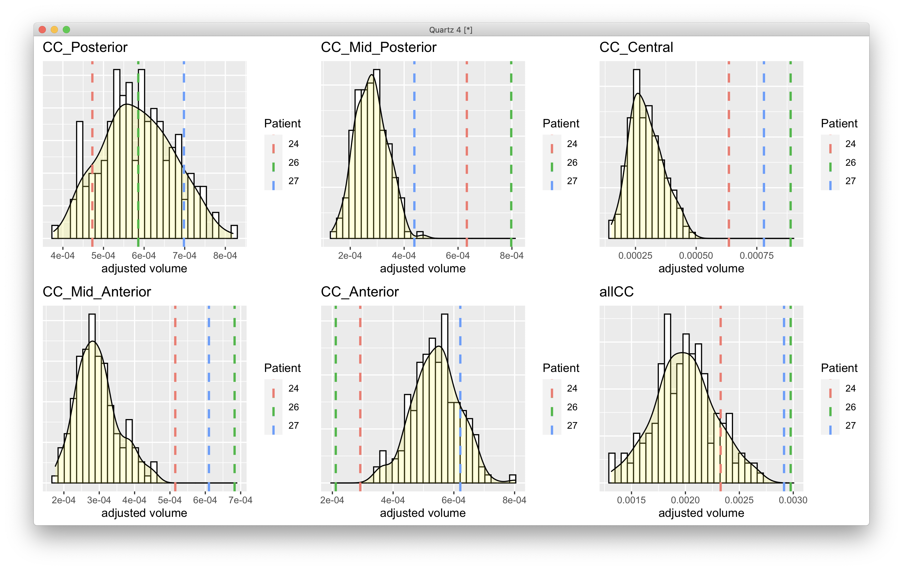

# 2020-10-06 11:02:09

Let's see what we can find on Dennis' data.

```bash
# bw
cd ~/data/dennis/24
module load afni
dcm2niix_afni *
```

Looking at the JSONs, I saw that 24__20191126213428_13 was the DTI. Let's go
with the FDT pipeline for processing because TORTOISE takes forever.

I copied that the scan files to a raw folder to keep it tidy.

```bash
# bw
module load fsl

fslreorient2std 24__20191126213428_13.nii dwi
fslroi dwi b0 0 1
bet b0 b0_brain -m -f 0.2
cp 24__20191126213428_13.bval bvals
cp 24__20191126213428_13.bvec bvecs
# making sure the directions are OK
dtifit --data=dwi --mask=b0_brain --bvecs=bvecs --bvals=bvals --out=tmp_dti
```

Looks fine I think. Let's go on with processing.

```bash
a=''; for i in {1..102}; do 
    a=$a' '1;
done;
echo $a > index.txt
echo "0 1 0 0.05" > acqparams.txt
echo "0 -1 0 0.05" >> acqparams.txt

eddy_openmp --imain=dwi --mask=b0_brain --index=index.txt \
     --acqp=acqparams.txt \
     --bvecs=bvecs --bvals=bvals --fwhm=0 --flm=quadratic \
     --out=eddy_unwarped_images
```

And I'll follow the same steps for the other subjects (at least until I figure
out whether I'm importing them properly)?

Continuing to bedpostX:

```bash
cp eddy_unwarped_images.nii.gz data.nii.gz;
cp eddy_unwarped_images.eddy_rotated_bvecs bvecs;
cp b0_brain_mask.nii.gz nodif_brain_mask.nii.gz;
/data/NCR_SBRB/software/autoPtx/autoPtx_1_preproc data.nii.gz
```

When bedpost is done, run the second part of autoPtx:

```bash
cd ~/data/dennis
mkdir preproc

scan=27
mkdir preproc/$scan
mkdir preproc/${scan}.bedpostX
execPath=/data/NCR_SBRB/software/autoPtx
structures=$execPath/structureList
track=$execPath/trackSubjectStruct

cp -r $scan/raw/preproc/* preproc/$scan/
cp -r ${scan}/raw/preproc.bedpostX/* preproc/${scan}.bedpostX/
while read structstring; do
    struct=`echo $structstring | awk '{print $1}'`
    nseed=`echo $structstring | awk '{print $2}'`
#    echo $struct;
    $track $scan $struct $nseed 2>&1 & #> /dev/null &
done < $structures
```

# 2020-10-07 05:59:28

Time to extract the tract values. 

```bash
# bw
module load afni

mydir=/lscratch/${SLURM_JOBID}/
weighted_tracts=~/tmp/pnc_weighted_tracts.csv;
row="id";
for t in `cut -d" " -f 1 /data/NCR_SBRB/software/autoPtx/structureList`; do
    for m in fa ad rd; do
        row=${row}','${t}_${m};
    done
done
echo $row > $weighted_tracts;
for m in 24 26 27; do
    echo $m;
    row="${m}";
    cd ~/data/dennis/preproc/$m &&
    for t in `cut -d" " -f 1 /data/NCR_SBRB/software/autoPtx/structureList`; do
        if [ -e ../../tracts/${m}/${t}/tracts/tractsNorm.nii.gz ]; then
            # tract mask is higher dimension!
            3dresample -master dti_FA.nii.gz -prefix ${mydir}/mask.nii \
                -inset ../../tracts/${m}/${t}/tracts/tractsNorm.nii.gz \
                -rmode NN -overwrite &&
            nvox=`3dBrickStat -count -non-zero ${mydir}/mask.nii 2>/dev/null` &&
            if [ $nvox -gt 0 ]; then
                fa=`3dmaskave -q -mask ${mydir}/mask.nii dti_FA.nii.gz 2>/dev/null` &&
                ad=`3dmaskave -q -mask ${mydir}/mask.nii dti_L1.nii.gz 2>/dev/null` &&
                3dcalc -a dti_L2.nii.gz -b dti_L3.nii.gz -expr "(a + b) / 2" \
                    -prefix ${mydir}/RD.nii 2>/dev/null &&
                rd=`3dmaskave -q -mask ${mydir}/mask.nii ${mydir}/RD.nii 2>/dev/null` &&
                row=${row}','${fa}','${ad}','${rd};
            else
                row=${row}',NA,NA,NA';
            fi;
        else
            row=${row}',NA,NA,NA';
        fi;
    done
    echo $row >> $weighted_tracts;
done
```

And I copied the file, with pnc_, to the dennis folder. Let's generate some more QC files, just because...

```bash
m=24;
cd ~/data/dennis/preproc/$m

# make directionality encoded QC pictures, checking that eroded FA looks fine.
# Note that the dtifit results, and the std alignment were run by autoPtx!
fat_proc_decmap -in_fa dti_FA.nii.gz -in_v1 dti_V1.nii.gz \
    -mask nodif_brain_mask.nii.gz -prefix DEC

# apply the transform calculated by autoPtx to a few maps. code copied from 
# tbss_non_fa
for f in FA L1 L2 L3 MD MO; do
    echo Warping $f;
    applywarp -i dti_${f} -o ${f}_in_FMRIB58_FA_1mm \
        -r $FSLDIR/data/standard/FMRIB58_FA_1mm -w nat2std_warp
done

# make transformation QC figure: FSL template as the edges
@snapshot_volreg FA_in_FMRIB58_FA_1mm.nii.gz \
    $FSLDIR/data/standard/FMRIB58_FA_1mm.nii.gz \
    QC/FA_transform;

# make QC images for standard errors. Here we set our color scale to have 95th
# percentile of all errors. Meaning, more red = bigger error.
@chauffeur_afni                             \
    -ulay  data.nii.gz                       \
    -olay  dti_sse.nii.gz                          \
    -opacity 5                              \
    -pbar_posonly   \
    -cbar Spectrum:red_to_blue              \
    -set_subbricks 0 0 0     \
    -prefix   QC/sse              \
    -montx 6 -monty 6                       \
    -set_xhairs OFF                         \
    -label_mode 1 -label_size 3             \
    -thr_olay 0 \
    -func_range_perc_nz 95 \
    -do_clean
```

And then copied everything back to shaw:/dennis/.

QC images look fine, but forceps minor and major could not be estimated for one
of the subjects. Might need to tweak things a bit there later.

# 2020-10-07 11:12:02

Philip asked me to do some TBSS in these subjects as well:

```
in addition to the corpus callosum, it'd be good to pull out the individual voxel values for the CC.  We'd simply use a non-parametric test at each voxel to test for deviation from a range (derived from whatever adults you have).
```

```bash
m=24
cd ~/data/dennis/preproc/$m

tbss_1_preproc dti_FA.nii.gz
tbss_2_reg -T
# wait for jobs submitted above finish
tbss_3_postreg -S
tbss_4_prestats 0.3
```

Once I get the age ranges I can make sure all our NVs have something similar to
this, and generate distributions for each voxel in the corpus callosum, or even
a distribution from the mean, and then see how often the cases here are outside
the normal distribution.

# 2021-04-05 11:45:30

I decided to re-run this using TORTOISE just so we can better compare them with
our database. I'll run it in Biowulf to match the versions.

I created a folder TORTOISE under ~/data/dennis and copied the raw .nii files,
converted for the previous analysis, to each subject's directory. That's what
I'm importing in TORTOISE.

Actually, I cannot find T2 for the scans. Maybe I can get by if I grab any
anatomicals, but maybe it would just be easier if I compare it to PNC or UKBB,
which might have had a similar pipeline?

I decided to do Freesurfer on the T1s, which were scan 10 in 24 and 27, and the
one labeled T1 in 26 (there were 2 derived T1s and one original, so I used the
original). Freesurfer does have a CC segmentation, so we can play with that as
well.

So let's establish some distributions based on our data. 24 was 25 y.o. at the
time of scan, and 26 was 34. We don't have data on 27, but as they were siblings
let's assume he is on the same age range (they're all males). Just to get some
more data out of our own dataset, let's expand the age range a bit:

```
r$> df = read.csv('~/tmp/all_freesurfer_12042020.csv') 
r$> sum(df$age_scan >= 25 & df$age_scan <= 34 & df$sex == 'Male')  
[1] 78
r$> sum(df$age_scan >= 21 & df$age_scan <= 40 & df$sex == 'Male')
 [1] 165
```

OK, so now let's plot the values for the 3 subjects against our population. 

Note that oru population includes NV and ADHD. Since we've never found a
difference between the two groups in CC, it should be OK. If we reduce it to
only NVs our numbers will go down a lot. I could use maybe UKBiobank data, but
let's play with our stuff first.

```bash
# bw
export SUBJECTS_DIR=/data/sudregp/dennis/freesurfer
python2 $FREESURFER_HOME/bin/asegstats2table --subjectsfile=subjects_file.txt \
    --tablefile subcortical.txt
```

```r
data = read.table('/Volumes/Shaw/dennis/subcortical.txt', header=1)

library(ggplot2)
CC = c('CC_Posterior', 'CC_Mid_Posterior', 'CC_Central', 'CC_Mid_Anterior',
       'CC_Anterior')
df$allCC = rowSums(df[, CC])
data$allCC = rowSums(data[, CC])

CC = c(CC, 'allCC')
idx = which(df$age_scan >= 21 & df$age_scan <= 40 & df$sex == 'Male')
library(ggpubr)
quartz()
myplots = list()
for (g in 1:length(CC)) {
    mydata = data.frame(volume=df[idx, CC[g]])
    myvals = data.frame(Patient=factor(data$Measure.volume),
                        volume=data[,CC[g]])
    p = (ggplot(mydata, aes(x=volume)) + 
         geom_histogram(aes(y=..density..), colour="black", fill="white") +
         geom_density(alpha=.2, fill="yellow") +
         geom_vline(data=myvals, aes(xintercept=volume, color=Patient),
                    linetype="dashed", size=1) +
         ggtitle(CC[g]) + 
                 theme(axis.title.y = element_blank(),
                       axis.ticks.y = element_blank(),
                       axis.text.y = element_blank()))
    myplots[[g]] = p
}
p = ggarrange(plotlist=myplots)
print(p)
```


# 2021-04-06 09:26:26

Philip suggested I redid the plots, taking ICV into consideration:

```r
data = read.table('/Volumes/Shaw/dennis/subcortical.txt', header=1)

library(ggplot2)
CC = c('CC_Posterior', 'CC_Mid_Posterior', 'CC_Central', 'CC_Mid_Anterior',
       'CC_Anterior')
df$allCC = rowSums(df[, CC])
data$allCC = rowSums(data[, CC])

CC = c(CC, 'allCC')
idx = which(df$age_scan >= 21 & df$age_scan <= 40 & df$sex == 'Male')
library(ggpubr)
quartz()
myplots = list()
for (g in 1:length(CC)) {
    mydata = data.frame(volume=df[idx, CC[g]],
                        icv=df[idx, 'EstimatedTotalIntraCranialVol'])
    myvals = data.frame(Patient=factor(data$Measure.volume),
                        volume=data[,CC[g]],
                        icv=data[, 'EstimatedTotalIntraCranialVol'])
    myjitter = ifelse(CC[g] == 'allCC', 1000, 1)
    myvals$plot_me = jitter(myvals$volume/myvals$icv, myjitter)
    p = (ggplot(mydata, aes(x=volume/icv)) + 
         geom_histogram(aes(y=..density..), colour="black", fill="white") +
         geom_density(alpha=.2, fill="yellow") +
         geom_vline(data=myvals, aes(xintercept=plot_me,
                                     color=Patient),
                    linetype="dashed", size=1) +
         ggtitle(CC[g]) + 
         theme(axis.title.y = element_blank(),
            axis.ticks.y = element_blank(),
            axis.text.y = element_blank()) + 
         xlab('adjusted volume'))
    myplots[[g]] = p
}
p = ggarrange(plotlist=myplots)
print(p)
```



Let's also make sure those images are not particularly noisy, and make a few
plots of the actual corpus callosum:

```bash
#bw
cd ~/data/dennis/freesurfer
mri_convert 27/mri/nu.mgz 27_nu.nii.gz
# repeat for other 3 subjects
res_file=./euler_numbers.csv
echo subjid,euler_LH,euler_RH,mean_euler > $res_file;
for s in `cat ../subjects_file.txt`; do
    euler_lh=`grep -A 1 "Computing euler" ./${s}/scripts/recon-all.log | tail -1 | awk '{ print $4 }' | sed "s/,//"`;
    euler_rh=`grep -A 1 "Computing euler" ./${s}/scripts/recon-all.log | tail -1 | awk '{ print $7 }' | sed "s/,//"`;
    mean_euler=`echo "( $euler_lh + $euler_rh ) / 2" | bc`;
    echo $s,$euler_lh,$euler_rh,$mean_euler >> $res_file;
done
```

And I need to get Euler for our own subjects:

```r
maskids = sapply(df[idx, 'maskid'], function(x) sprintf('%04d', x))
write.table(maskids, file='~/tmp/myids.txt', row.names=F, col.names=F, quote=F)
```

```bash
#local
res_file=./ncr_euler_numbers.csv
echo subjid,euler_LH,euler_RH,mean_euler > $res_file;
for s in `cat ~/tmp/myids.txt`; do
    euler_lh=`grep -A 1 "Computing euler" /Volumes/NCR/freesurfer5.3_subjects/${s}/scripts/recon-all.log | tail -1 | awk '{ print $4 }' | sed "s/,//"`;
    euler_rh=`grep -A 1 "Computing euler" /Volumes/NCR/freesurfer5.3_subjects/${s}/scripts/recon-all.log | tail -1 | awk '{ print $7 }' | sed "s/,//"`;
    mean_euler=`echo "( $euler_lh + $euler_rh ) / 2" | bc`;
    echo $s,$euler_lh,$euler_rh,$mean_euler >> $res_file;
done
```

And now we just plot them:

```r
ncr_euler = read.csv('/Volumes/Shaw/dennis/ncr_euler_numbers.csv')
dennis_euler = read.csv('/Volumes/Shaw/dennis/freesurfer/euler_numbers.csv')

library(ggplot2)
quartz()
mydata = data.frame(euler=ncr_euler[, 'mean_euler'])
myvals = data.frame(Patient=factor(data$Measure.volume),
                    euler=dennis_euler[, 'mean_euler'])
myvals$plot_me = jitter(myvals$euler, 1)
p = (ggplot(mydata, aes(x=euler)) + 
     geom_histogram(aes(y=..density..), colour="black", fill="white") +
     geom_density(alpha=.2, fill="yellow") +
     geom_vline(data=myvals, aes(xintercept=plot_me,
                                 color=Patient),
                linetype="dashed", size=1) +
     ggtitle('Euler number') + 
     theme(axis.title.y = element_blank(),
           axis.ticks.y = element_blank(),
           axis.text.y = element_blank()) + 
     xlab('More negative = worse'))
print(p)
```


This is not good... maybe it's an issue with Freesurfer versions? Let's run
version 5.3 on Dennis' subjects then, like ours.


# TODO
- understand what they mean by affected. Some documents say different people are
  affected, which is different than the pedigree. Is affected only based on
  genetics, or the phenotype?
- find another dataset (maybe UKBB) to plot the data against
- show actual MR images of CC for the scans


