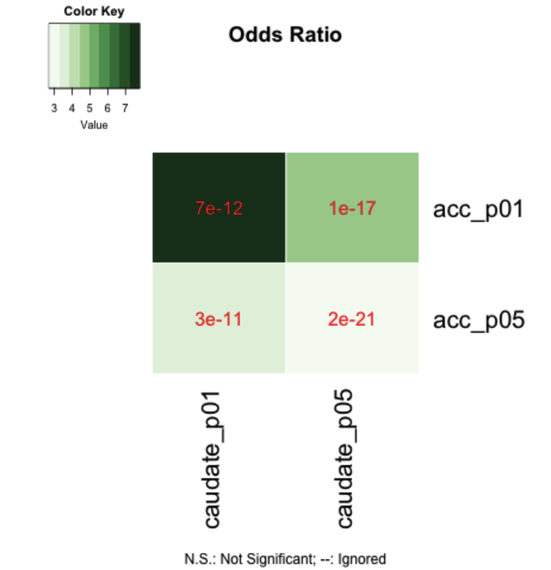
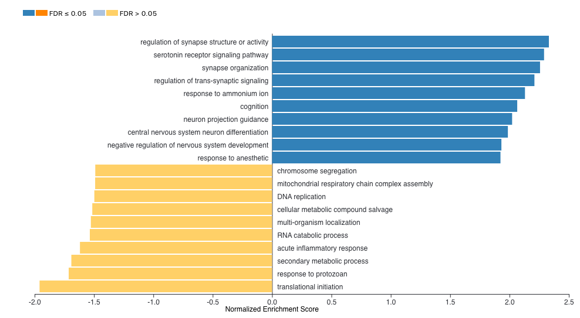
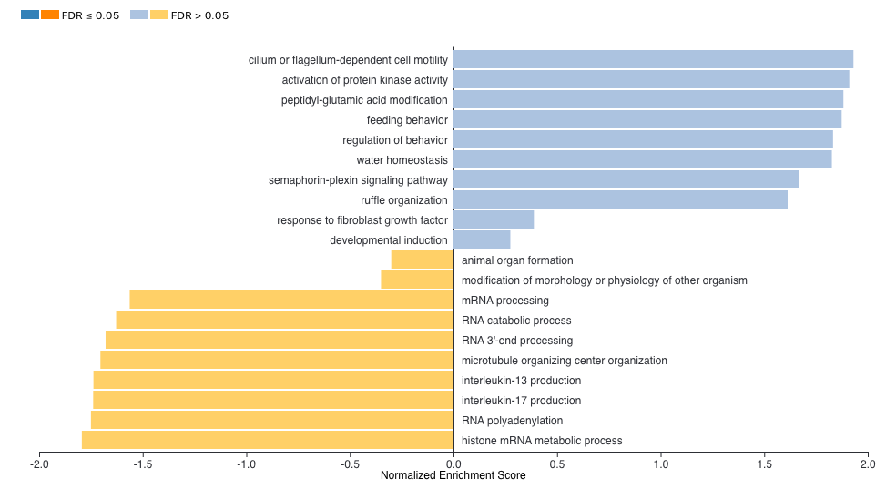

# 2020-10-15 06:52:24

Let's try different types of gene set analysis on the results of the 3 different
modalities: rnaseq, methylation, and isoforms. The latter need some extra
filtering based on Valer's observations, so I'll keep that for last.

I'll use this:
https://www.bioconductor.org/packages/devel/bioc/vignettes/GeneOverlap/inst/doc/GeneOverlap.pdf
mostly because it implements the hypergeometric test in a fast way.

```r
library(GeneOverlap)
load('~/data/rnaseq_derek/xmodal_results_10152020.RData')
rnaseq_acc_p05 = rnaseq_acc[rnaseq_acc$P.Value < .05, 'hgnc_symbol']
rnaseq_caudate_p05 = rnaseq_caudate[rnaseq_caudate$P.Value < .05, 'hgnc_symbol']
gsizeu = length(union(rnaseq_acc$hgnc_symbol, rnaseq_caudate$hgnc_symbol))
gsizei = length(intersect(rnaseq_acc$hgnc_symbol, rnaseq_caudate$hgnc_symbol))
go.obj <- testGeneOverlap(newGeneOverlap(rnaseq_acc_p05, rnaseq_caudate_p05,
                          genome.size=gsizeu))
```

I'm using the union as the gene universe because otherwise we might have genes
in one list that are not in the universe. The universe for the different lists
will change because the genes we're testing in each are different. But we will
need to be careful that they're unique in each result variable!

```r
rnaseq_acc_p01 = rnaseq_acc[rnaseq_acc$P.Value < .01, 'hgnc_symbol']
rnaseq_caudate_p01 = rnaseq_caudate[rnaseq_caudate$P.Value < .01, 'hgnc_symbol']
gom.obj <- newGOM(list(acc_p01=rnaseq_acc_p01, acc_p05=rnaseq_acc_p05),
                  list(caudate_p01=rnaseq_caudate_p01, caudate_p05=rnaseq_caudate_p05),
                  genome.size=gsizeu)
drawHeatmap(gom.obj)
getMatrix(gom.obj, name='pval')
getMatrix(gom.obj, name='odds.ratio')
```



# 2020-10-20 06:08:52

Let's construct a plot showing diferent thresholds and how the intersection for
RNAseq results.

```r
load('~/data/rnaseq_derek/xmodal_results_10152020.RData')
thresh = c(.05, .01, .005, .001, .0005, .0001)
acc = c()
caudate = c()
overlap = c()
for (t in thresh) {
  tmp1 = rnaseq_acc[rnaseq_acc$P.Value < t, 'hgnc_symbol']
  tmp2 = rnaseq_caudate[rnaseq_caudate$P.Value < t, 'hgnc_symbol']
  acc = c(acc, length(tmp1))
  caudate = c(caudate, length(tmp2))
  overlap = c(overlap, length(intersect(tmp1, tmp2)))
}
```

```
r$> thresh                                                                                                                                                                                           
[1] 5e-02 1e-02 5e-03 1e-03 5e-04 1e-04

r$> acc                                                                                                                                                                                              
[1] 1335  325  165   38   18    3

r$> caudate                                                                                                                                                                                          
[1] 1063  220  117   26   10    1

r$> overlap                                                                                                                                                                                          
[1] 143  21  10   0   0   0
```

Don't really need a plot for those results. Let me do the same for the
methylation results though.

```r
thresh = c(.05, .01, .005, .001, .0005, .0001)
acc = c()
caudate = c()
overlap = c()
for (t in thresh) {
  tmp1 = as.character(methyl_acc[methyl_acc$P.Value < t, 'gene'])
  tmp1 = unique(tmp1[tmp1 != ''])
  tmp2 = as.character(methyl_caudate[methyl_caudate$P.Value < t, 'gene'])
  tmp2 = unique(tmp2[tmp2 != ''])
  acc = c(acc, length(tmp1))
  caudate = c(caudate, length(tmp2))
  overlap = c(overlap, length(intersect(tmp1, tmp2)))
}
```

```
r$> acc                                                                                                                                                                                              
[1] 11575  2900  1419   239   103    22

r$> caudate                                                                                                                                                                                          
[1] 9505 2059  989  147   63   12

r$> overlap                                                                                                                                                                                          
[1] 6097  475  118    3    1    1
```

Now we can do a matrix across modalities:

```r
library(GeneOverlap)
t = thresh[3]
ra = rnaseq_acc[rnaseq_acc$P.Value < t, 'hgnc_symbol']
rc = rnaseq_caudate[rnaseq_caudate$P.Value < t, 'hgnc_symbol']
tmp1 = as.character(methyl_acc[methyl_acc$P.Value < t, 'gene'])
ma = unique(tmp1[tmp1 != ''])
tmp2 = as.character(methyl_caudate[methyl_caudate$P.Value < t, 'gene'])
mc = unique(tmp2[tmp2 != ''])
gom.obj <- newGOM(list(rnaseq_acc=ra, methyl_acc=ma, rnaseq_caudate=rc,
                       methyl_caudate=mc), spec='hg19.gene')
getMatrix(gom.obj, name='pval')
```

```
               methyl_acc rnaseq_caudate methyl_caudate
rnaseq_acc      0.9607995   5.796784e-09   8.955669e-01
methyl_acc      1.0000000   4.986706e-01   1.181941e-14
rnaseq_caudate  1.0000000   1.000000e+00   1.815731e-01
```

And we can try creating our own universe as well:

```r
all_genes = union(rnaseq_acc$hgnc_symbol, rnaseq_caudate$hgnc_symbol)
junk = as.character(methyl_acc$gene)
junk = unique(junk[junk != ''])
all_genes = union(all_genes, junk)
junk = as.character(methyl_caudate$gene)
junk = unique(junk[junk != ''])
all_genes = union(all_genes, junk)
gom.obj2 <- newGOM(list(rnaseq_acc=ra, methyl_acc=ma, rnaseq_caudate=rc,
                       methyl_caudate=mc), genome.size=length(all_genes))
getMatrix(gom.obj2, name='pval')
```

```
               methyl_acc rnaseq_caudate methyl_caudate
rnaseq_acc      0.9335719   2.462422e-09   8.509569e-01
methyl_acc      1.0000000   4.042366e-01   1.812512e-17
rnaseq_caudate  1.0000000   1.000000e+00   1.313315e-01
```

Either way we slice it, the within-modality result is significant. What are
those genes?

```r
inter.nl <- getNestedList(gom.obj, name="intersection")
```

```
$rnaseq_caudate
$rnaseq_caudate$rnaseq_acc
 [1] "TAMM41"       "SMN2"         "ZNF514"       "TBC1D3L"      "HILPDA"       "CLUL1"        "ZNF695"       "VN1R20P"      "PARP2"        "STX16-NPEPL1"

$methyl_caudate$methyl_acc
  [1] "PALM2-AKAP2" "DNAJC16"     "ZNF276"      "PTPRN2"      "TBC1D10A"    "PCCA"        "PDK2"        "HMOX2"       "SLC39A14"    "ZMIZ1"       "CCBE1"       "RPH3AL"      "CYB5RL"     
 [14] "SEMA4D"      "CLCN7"       "TBCD"        "GPR123"      "NAV2"        "JAKMIP1"     "TBRG4"       "LOC339524"   "CACNG8"      "RPS6KA2"     "PANK3"       "LRFN2"       "KDM5B"      
 [27] "LOH12CR1"    "RECK"        "MYO3B"       "RHOT2"       "PITPNC1"     "CAMTA1"      "INTS1"       "ZKSCAN4"     "PRDM16"      "SCARB1"      "LRCH4"       "C20orf103"   "VAPB"       
 [40] "EMP2"        "MCC"         "AP2A2"       "CASR"        "OCA2"        "PRKCE"       "PSORS1C1"    "MRPS25"      "SND1"        "COL5A1"      "BLCAP"       "NCOA3"       "THOP1"      
 [53] "ADARB2"      "CEP112"      "IGF1R"       "SLCO3A1"     "AATK"        "FAM53A"      "ARL13B"      "ANKRD12"     "VPS53"       "ADAMTS12"    "SMPD3"       "FHAD1"       "ACTN1"      
 [66] "APCDD1L-AS1" "TMEM200B"    "SFMBT2"      "NPHP4"       "ATP10A"      "MOCS1"       "NTM"         "CHST11"      "PDE4DIP"     "RALGPS1"     "PRKCA"       "TNXB"        "KLHL29"     
 [79] "POLR2D"      "CTBP2"       "DEPTOR"      "EBF1"        "MCF2L"       "TOMM22"      "KIAA1614"    "IQSEC1"      "ITPK1"       "UST"         "IGSF21"      "FOXN3"       "CISD3"      
 [92] "SERPINE2"    "MRPL39"      "EIF3B"       "ANKRD27"     "IFFO1"       "EFHD1"       "PPAP2C"      "EXOC3"       "TSNAX-DISC1" "PDE4C"       "SEZ6"        "PRKCZ"       "GGA2"       
[105] "TCERG1L"     "PSMD5"       "KIAA1671"    "FAM189A1"    "NEUROD2"     "MMP25"       "RASA3"       "CABLES1"     "CCDC86"      "ACOT7"       "PRLHR"       "CACNB4"      "LINC00598"  
[118] "ARHGEF28"   
```

We might need to rank the methylation intersection, maybe using a combined
p-value, to find the top X most interesting genes.

## ROAST and CAMERA

Since we're not really using dream anymore, we should be able to just run ROAST
and CAMERA directly on the data, and this way take better care of gene
correlations. 

```r
myregion = 'ACC'
data = readRDS('~/data/rnaseq_derek/complete_rawCountData_05132020.rds')
rownames(data) = data$submitted_name  # just to ensure compatibility later
# remove obvious outlier (that's NOT caudate) labeled as ACC
rm_me = rownames(data) %in% c('68080')
data = data[!rm_me, ]
data = data[data$Region==myregion, ]
more = readRDS('~/data/rnaseq_derek/data_from_philip_POP_and_PCs.rds')
more = more[!duplicated(more$hbcc_brain_id),]
data = merge(data, more[, c('hbcc_brain_id', 'comorbid', 'comorbid_group',
                            'substance', 'substance_group')],
             by='hbcc_brain_id', all.x=T, all.y=F)

# at this point we have 55 samples for ACC
grex_vars = colnames(data)[grepl(colnames(data), pattern='^ENS')]
count_matrix = t(data[, grex_vars])
data = data[, !grepl(colnames(data), pattern='^ENS')]
id_num = sapply(grex_vars, function(x) strsplit(x=x, split='\\.')[[1]][1])
rownames(count_matrix) = id_num
dups = duplicated(id_num)
id_num = id_num[!dups]
count_matrix = count_matrix[!dups, ]

G_list0 = readRDS('~/data/rnaseq_derek/mart_rnaseq.rds')
G_list <- G_list0[!is.na(G_list0$hgnc_symbol),]
G_list = G_list[G_list$hgnc_symbol!='',]
G_list <- G_list[!duplicated(G_list$ensembl_gene_id),]
imnamed = rownames(count_matrix) %in% G_list$ensembl_gene_id
count_matrix = count_matrix[imnamed, ]

data$POP_CODE = as.character(data$POP_CODE)
data[data$POP_CODE=='WNH', 'POP_CODE'] = 'W'
data[data$POP_CODE=='WH', 'POP_CODE'] = 'W'
data$POP_CODE = factor(data$POP_CODE)
data$Individual = factor(data$hbcc_brain_id)
data[data$Manner.of.Death=='Suicide (probable)', 'Manner.of.Death'] = 'Suicide'
data[data$Manner.of.Death=='unknown', 'Manner.of.Death'] = 'natural'
data$MoD = factor(data$Manner.of.Death)
data$batch = factor(as.numeric(data$run_date))

library(caret)
pp_order = c('zv', 'nzv')
pp = preProcess(t(count_matrix), method = pp_order)
X = predict(pp, t(count_matrix))
geneCounts = t(X)
G_list2 = merge(rownames(geneCounts), G_list, by=1)
colnames(G_list2)[1] = 'ensembl_gene_id'
imautosome = which(G_list2$chromosome_name != 'X' &
                   G_list2$chromosome_name != 'Y' &
                   G_list2$chromosome_name != 'MT')
geneCounts = geneCounts[imautosome, ]
G_list2 = G_list2[imautosome, ]
library(edgeR)
isexpr <- filterByExpr(geneCounts, group=data$Diagnosis)
genes = DGEList( geneCounts[isexpr,], genes=G_list2[isexpr,] ) 
genes = calcNormFactors( genes)

lcpm = cpm(genes, log=T)
set.seed(42)
lcpm.pca <- prcomp(t(lcpm), scale=TRUE)

library(nFactors)
eigs <- lcpm.pca$sdev^2
nS = nScree(x=eigs)
keep_me = 1:nS$Components$nkaiser
mydata = data.frame(lcpm.pca$x[, keep_me])


get_enrich_order2 = function( res, gene_sets ){
  if( !is.null(res$z.std) ){
    stat = res$z.std
  }else if( !is.null(res$F.std) ){
    stat = res$F.std
  }else if( !is.null(res$t) ){
    stat = res$t
  }else{
    stat = res$F
  }
  names(stat) = res$hgnc_symbol
  stat = stat[!is.na(names(stat))]
  # print(head(stat))
  index = ids2indices(gene_sets, names(stat))
  cameraPR( stat, index )
}
load('~/data/rnaseq_derek/adhd_genesets_philip.RDATA')
load('~/data/rnaseq_derek/c5_gene_sets.RData')
load('~/data/rnaseq_derek/brain_disorders_gene_sets.RData')
load('~/data/rnaseq_derek/data_for_alex.RData')
co = .9 
idx = anno$age_category==1 & anno$cutoff==co
genes_overlap = unique(anno[idx, 'anno_gene'])
for (s in 2:5) {
  idx = anno$age_category==s & anno$cutoff==co
  g2 = unique(anno[idx, 'anno_gene'])
  genes_overlap = intersect(genes_overlap, g2)
}
genes_unique = list()
for (s in 1:5) {
  others = setdiff(1:5, s)
  idx = anno$age_category==s & anno$cutoff==co
  g = unique(anno[idx, 'anno_gene'])
  for (s2 in others) {
    idx = anno$age_category==s2 & anno$cutoff==co
    g2 = unique(anno[idx, 'anno_gene'])
    rm_me = g %in% g2
    g = g[!rm_me]
  }
  genes_unique[[sprintf('dev%s_c%.1f', s, co)]] = unique(g)
}
genes_unique[['overlap']] = unique(genes_overlap)

data2 = cbind(data, mydata)
form = ~ Diagnosis + PC1 + PC2 + PC7 + PC8 + PC9
design = model.matrix( form, data2)
vobj = voom( genes, design, plot=FALSE)
fit <- lmFit(vobj, design)
fit2 <- eBayes( fit )
res = topTable(fit2, coef='DiagnosisControl', number=Inf)

adhd_camera = get_enrich_order2( res, t2 ) 
c5_camera = get_enrich_order2( res, c5_all)
dis_camera = get_enrich_order2( res, disorders)
dev_camera = get_enrich_order2( res, genes_unique )
```

We're currently matching the old results, so let's see if we get anything like
it using just CAMERA or ROAST:

```r
idx <- ids2indices(c5_all, id=genes$genes$hgnc_symbol)
res_cam <- camera(vobj, idx, design, contrast=2)
```

```
r$> head(res_cam)                                                                                                                       
                                                               NGenes Direction       PValue          FDR
GO_INTRINSIC_COMPONENT_OF_POSTSYNAPTIC_MEMBRANE                   114        Up 3.949231e-08 0.0004018737
GO_INTRINSIC_COMPONENT_OF_SYNAPTIC_MEMBRANE                       153        Up 6.147692e-07 0.0031279457
GO_NEUROTRANSMITTER_RECEPTOR_ACTIVITY                              83        Up 1.093723e-06 0.0037099101
GO_CYTOSOLIC_RIBOSOME                                              91      Down 2.499893e-06 0.0063597268
GO_INTRINSIC_COMPONENT_OF_POSTSYNAPTIC_SPECIALIZATION_MEMBRANE     73        Up 3.929129e-06 0.0079965629
GO_SYNAPSE_ASSEMBLY                                               155        Up 1.010539e-05 0.0171387479
```

p-values change a bit, but we're still safe. Let's play with a few flags:

```r
res_cam_igc <- camera(vobj, idx, design, contrast=2, inter.gene.cor=NA)
res_cam_tv <- camera(vobj, idx, design, contrast=2, trend.var=T)
```

Using trend.var doesn't change things much, but estimating inter gene
correlation from the data vanishes the results. Maybe we don't have enough data?

Let's play a bit with roast:

```r
res_roast <- mroast(vobj, idx, design, contrast=2)
```

Not much there:

```
r$> head(res_roast)                                                                                                                     
                                                            NGenes PropDown PropUp Direction PValue    FDR PValue.Mixed FDR.Mixed
GO_DE_NOVO_CENTRIOLE_ASSEMBLY                                    4     0.75   0.00      Down  5e-04 0.5088       0.0015 0.5042488
GO_RESPONSE_TO_METHOTREXATE                                      4     0.75   0.00      Down  5e-04 0.5088       0.0065 0.5042488
GO_NEGATIVE_REGULATION_OF_TRANSCRIPTION_BY_RNA_POLYMERASE_I      4     0.00   0.75        Up  5e-04 0.5088       0.0115 0.5042488
GO_NEGATIVE_REGULATION_OF_DNA_DAMAGE_CHECKPOINT                  5     0.60   0.00      Down  5e-04 0.5088       0.0010 0.5042488
GO_NSL_COMPLEX                                                   5     0.60   0.00      Down  5e-04 0.5088       0.0010 0.5042488
GO_SEROTONIN_GATED_CATION_SELECTIVE_CHANNEL_ACTIVITY             2     0.00   1.00        Up  1e-03 0.7632       0.0010 0.5042488
```

```r
res_romer <- romer(vobj, idx, design, contrast=2)
```

That didn't give p-values. Our results with CAMERA hold. Now, let's see if we
can use some other rank that we can get similar results in other methods.

```r
r$> cor(abs(res$t), res$P.Value)
[1] -0.935101

r$> cor(abs(res$t), res$P.Value, method='spearman')                                                                                     
[1] -1

r$> cor(res$t, sign(res$logFC)*1/res$P.Value, method='spearman')                                                                        
[1] 1

r$> cor(res$t, sign(res$logFC)*1/res$P.Value)                                                                                           
[1] 0.194647
```

So, it's a non-linear relationship but still correlated. Let's run the ranks
using t-tests and the one suggested by Yun-Ching. Are there any differences?

```r
write.table(cbind(res$hgnc_symbol, res$t), file='~/tmp/acc_t.rnk',
            sep='\t', quote=F, row.names=F, col.names=F)
write.table(cbind(res$hgnc_symbol, sign(res$logFC)*1/res$P.Value),
            file='~/tmp/acc_p.rnk', sep='\t', quote=F, row.names=F, col.names=F)
```

Using t-stat get much stronger results (top):





In order to create similar lists for the methylation results, we'll need to use
a single value per gene:

```r
idx = methyl_acc$gene != ''
tmp = methyl_acc[idx, c('gene', 't')]
tmp2 = c()
# will do it this way because of the two tails of T distribution
for (g in unique(tmp$gene)) {
  gene_data = tmp[tmp$gene==g, ]
  best_res = which.max(abs(gene_data$t))
  tmp2 = rbind(tmp2, gene_data[best_res, ])
}
write.table(tmp2, file='~/tmp/methyl_acc_t.rnk',
            sep='\t', quote=F, row.names=F, col.names=F)
```

I saved all directories (from the uncompressed ZIP file downloads from
WebGestalt, http://www.webgestalt.org/) to ~/data/postmortem. I also copied the
.rnk tables there for future reference.

I'm getting R errors when using the Web interface for methyl results in GSEA for
DisgeNet. The error message is not more descriptive than that. I'll need to run
it in the R toolbox to see if I can get anything different.

# 2020-10-21 06:02:40

Let's put the developmental lists into GMT format:

```r
load('~/data/rnaseq_derek/data_for_alex.RData')
dev_names = c('prenatal', 'infant (0-2 yrs)', 'child (3-11 yrs)',
              'adolescent (12-19 yrs)', 'adult (>19 yrs)')
if (myregion == 'ACC') {
    anno_region = 'Allen:10278'
} else {
    anno_region = 'Allen:10333'
}
co = .9 
idx = anno$age_category==1 & anno$cutoff==co & anno$structure_id==anno_region
genes_overlap = unique(anno[idx, 'anno_gene'])
for (s in 2:5) {
  idx = anno$age_category==s & anno$cutoff==co & anno$structure_id==anno_region
  g2 = unique(anno[idx, 'anno_gene'])
  genes_overlap = intersect(genes_overlap, g2)
}
genes_unique = list()
for (s in 1:5) {
  others = setdiff(1:5, s)
  idx = anno$age_category==s & anno$cutoff==co & anno$structure_id==anno_region
  g = unique(anno[idx, 'anno_gene'])
  for (s2 in others) {
    idx = anno$age_category==s2 & anno$cutoff==co & anno$structure_id==anno_region
    g2 = unique(anno[idx, 'anno_gene'])
    rm_me = g %in% g2
    g = g[!rm_me]
  }
  tmp = list(id = sprintf('dev%s_c%.1f', s, co), genes = unique(g),
             name = dev_names[s])
  genes_unique[[s]] = tmp
}
tmp = list(id = sprintf('overlap_c%.1f', co), genes = unique(genes_overlap),
             name = 'overlap')
genes_unique[[6]] = tmp

# just overwrite another object
gmt = read.GMT('~/data/post_mortem//hsapiens_disease_Disgenet_entrezgene.gmt.txt')
junk = gmt[1:6]
for (i in 1:6) {
   junk[[i]] = genes_unique[[i]]
}
write.GMT(junk, sprintf('~/data/post_mortem/%s_developmental.gmt', myregion))
```

And let's do the same thing for the disorders we collected:

```r
ndis = length(names(disorders))
gmt = read.GMT('~/data/post_mortem//hsapiens_disease_Disgenet_entrezgene.gmt.txt')
junk = gmt[seq(1, ndis)]
for (i in seq(1, ndis)) {
  tmp = list(id = names(disorders)[i], genes = disorders[[names(disorders)[i]]],
             name = names(disorders)[i])
  junk[[i]] = tmp
}
write.GMT(junk, '~/data/post_mortem/disorders.gmt')
```

Then I manualy changed one of the ASD_TWAS genes that had a weird character in
it.

# TODO
* narrow down list of overlap within methyls (maybe by probe type? or just
   combine p-values?)
* annotate type of probe being used in methylation?
* try the same sets from webgestaltl through camera
* use isoforms or imputation next?
* update list (refine it!)
* comorbidity: did I use it to pick PCs? 
* look into https://github.com/reimandlab/ActivePathways : any new information
  that's not already in Webgestalt?


# Links to remember:
 * https://bmcbioinformatics.biomedcentral.com/articles/10.1186/s12859-017-1674-0
 * http://genomicsclass.github.io/book/
 * https://online.stat.psu.edu/stat555/node/46/
 * http://genomespot.blogspot.com/2014/08/rna-seq-analysis-step-by-step.html
