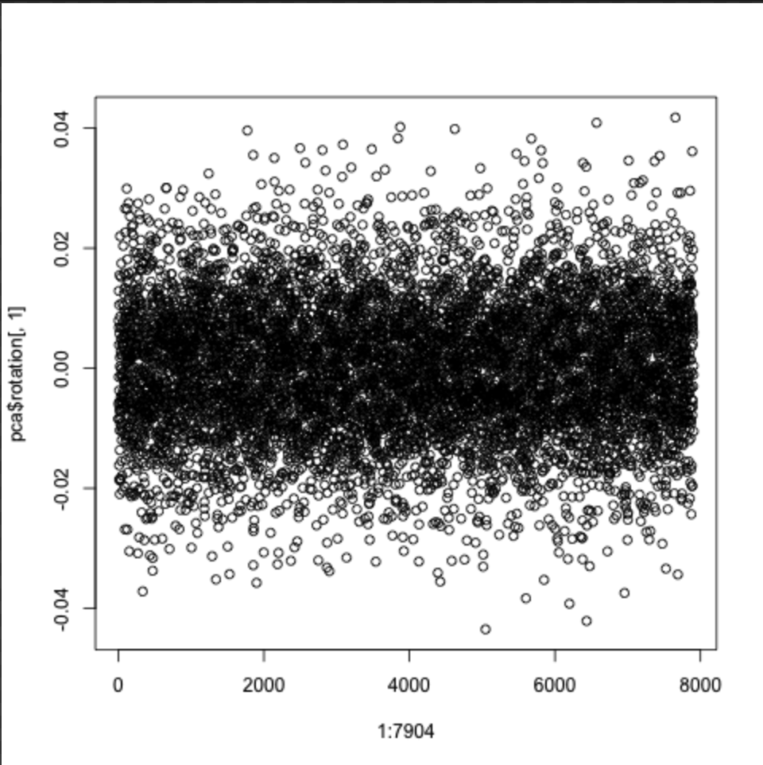

# 2020-10-21 16:12:52

Let's go back to the imputation results now that we have some solid results for
gene set analysis (138). We can use everyone, and let's only use the people with
good scans. The postmortem data has an age range from 6.69 to 38.83, so let's
make sure our samples and scans are within the same age range. We start from
expression_impute/gf_1119_09092020.csv and add all their anatomical QC to the
file.

```r
gf = read.csv('~/data/expression_impute/gf_1119_09092020.csv')
scans = read.csv('~/data/expression_impute/all_mprage_qc.csv')
m = merge(gf, scans, all.x=T, all.y=F, by=1)
write.csv(m, file='~/data/expression_impute/gfWithMPRAGE_2456_10212020.csv')
```

I then manually remove everyone without a scan, and then selected the best scan
inside that age range above, based on MPRAGE QC. In the case of a tie, I chose
the eldest scan. That created gfWithMPRAGE_773_10212020.csv. To that, we need to
attach the freesurfer QC and the regional values. For caudate we only have
volume, but for ACC we can do all 3. Ideally volume will work best so we can
keep just one metric, but we'll see. I added the QCs to the same file, and the
Freesurfer metrics. I also created bilateral versions just in case.


# 2020-10-22 06:21:22

Let's go ahead and run a very similar analysis as in limma. I won't use the same
package tools, but at least the same statistical model. For that, I'll need to
check for correlated PCs, so we use the same approach of denoising here. The
tricky thing is to make sure the PCs are not related to any of the phenotypes
I'll try.

The question here is whether I should include scan-specific variables ni the
model. For the RNAseq proper, we did a PCA in the counts and checked the PC
correlation with rna-metrics but also biological. Here, our phenotype is the
brain (not DX), and a few variables (such as QC) wouldn't be related to the
dependent variable (imputed scores). Do we add them to the model regardless? Or
check their correlation first? Need to check both ways!

Philip suggested to just use good scans and potentially regress out the QC
variables if needed. Let's go with that.

I also just noticed I didn't remove based on the age range, so I'm recreating
the gf (gfWithMPRAGE_632_10222020.csv)

```r
gf = read.csv('~/data/expression_impute/gfWithMPRAGE_632_10222020.csv')
a = readRDS('~/data/expression_impute/results/NCR_v3_ACC_1KG_mashr.rds')
iid2 = sapply(a$IID, function(x) strsplit(x, '_')[[1]][2])
a$IID = iid2
pcs = read.csv('~/data/expression_impute/pop_pcs.csv')
imp_data = merge(a, pcs, by='IID', all.x=F, all.y=F)
imp_data = merge(imp_data, gf, by.x='IID', by.y='Subject.Code...Subjects',
                 all.x=F, all.y=F)
grex_vars = colnames(imp_data)[grepl(colnames(imp_data), pattern='^ENS')]

library(caret)
set.seed(42)
pp_order = c('zv', 'nzv')
pp = preProcess(imp_data[, grex_vars], method = pp_order)
X = predict(pp, imp_data[, grex_vars])
grex_vars = colnames(X)
imp_data = imp_data[, !grepl(colnames(imp_data), pattern='^ENS')]
id_num = sapply(grex_vars, function(x) strsplit(x=x, split='\\.')[[1]][1])
colnames(X) = id_num
dups = duplicated(id_num)
id_num = id_num[!dups]
grex_vars = id_num
X = t(X[, !dups])

G_list0 = readRDS('~/data/rnaseq_derek/mart_rnaseq.rds')
G_list <- G_list0[!is.na(G_list0$hgnc_symbol),]
G_list = G_list[G_list$hgnc_symbol!='',]
G_list <- G_list[!duplicated(G_list$ensembl_gene_id),]
imnamed = rownames(X) %in% G_list$ensembl_gene_id
X = X[imnamed, ]
grex_vars = grex_vars[imnamed]
G_list2 = merge(G_list, X, by.x=1, by.y=0)
imautosome = which(G_list2$chromosome_name != 'X' &
                   G_list2$chromosome_name != 'Y' &
                   G_list2$chromosome_name != 'MT')
G_list2 = G_list2[imautosome, ]
X = G_list2[, 4:ncol(G_list2)]
rownames(X) = G_list2$ensembl_gene_id
grex_vars = G_list2$ensembl_gene_id
```

At this point we have all imputed genes in X, and imp_data has brain and other
confounders. Let's see if any of the PCs in the imputed data are related to
nuisance variables and/or the brain:

```r
set.seed(42)
pca <- prcomp(t(X), scale=TRUE)

library(nFactors)
eigs <- lcpm.pca$sdev^2
nS = nScree(x=eigs)
keep_me = 1:nS$Components$nkaiser
mydata = data.frame(lcpm.pca$x[, keep_me])
```

# 2020-10-23 12:59:36

Let's take a step back here. After chatting with Philip, it's best to lead with
the one per family analysis, and just use the whole family structure for
confirmation (if needed). But the approach should be to see if any of the brain
metrics first is related to ADHD. Then, check for the relationship with the
imputed data. So, let's select one per family first in the gf. I added a column
bestInFamily in Excel and used today's date. I selected based on average QC
first, then ADHD, then if there was still a tie I picked the youngest scan to
increase the chances we had symptom counts.

So, I think a reasonable approach would be to:

1. Check that there are no outliers in the brain data. If yes, replace by
   someone else in the family or NAs.
2. Check that there's no significant relationship between brain data and the
   usual confounders.
3. Residualize the significant confounders.
4. Check that whether there is a relationship between any of the ADHD metrics
   and the residualized brain data. Use the ones with relationship for
   imputation.
5. Check relationship to imputation data.

```r
gf = read.csv('~/data/expression_impute/gfWithMPRAGE_632_10232020.csv')
data = gf[gf$bestInFamily=='TRUE',]
keep_idx = data$QC...Scan <= 2 & data$external_score <=2 & data$internal_score <= 2
data = data[keep_idx,]
brain_vars = colnames(data)[c(24:35)]

par(mfrow=c(3,4))
for (v in brain_vars) {
    plot(data[, v], pch=19, main=v)
    m = mean(data[, v], na.rm=T)
    s = sd(data[, v], na.rm=T)
    abline(h=m + 3*s, col='red')
    abline(h=m - 3*s, col='red')
}
```


We definitely have a few outliers. For now, let's just change them to NAs, but
we can potentially choose a different member of the family later.

```r
for (v in brain_vars) {
    m = mean(data[, v], na.rm=T)
    s = sd(data[, v], na.rm=T)
    data[which(data[, v] > m + 3*s), v] = NA
    data[which(data[, v] < m - 3*s), v] = NA
}
```

Now let's check for correlation with the usual confounders:

```r
num_vars = c('age_scan', 'avg_qc', 'Mask.ID...Scan')
pc_vars = brain_vars
num_corrs = matrix(nrow=length(num_vars), ncol=length(pc_vars),
                   dimnames=list(num_vars, pc_vars))
num_pvals = num_corrs
for (x in num_vars) {
    for (y in pc_vars) {
        res = cor.test(data[, x], data[, y])
        num_corrs[x, y] = res$estimate
        num_pvals[x, y] = res$p.value
    }
}

categ_vars = c('Sex...Subjects', 'scanner_update', 'age_group')
categ_corrs = matrix(nrow=length(categ_vars), ncol=length(pc_vars),
                   dimnames=list(categ_vars, pc_vars))
categ_pvals = categ_corrs
for (x in categ_vars) {
    for (y in pc_vars) {
        res = kruskal.test(data[, y], data[, x])
        categ_corrs[x, y] = res$statistic
        categ_pvals[x, y] = res$p.value
    }
}

which(num_pvals < .01, arr.ind = T)
which(categ_pvals < .01, arr.ind = T)
```

```
r$> which(num_pvals < .05, arr.ind = T)                                                                                                 
               row col
age_scan         1   4
Mask.ID...Scan   3   4
age_scan         1   5
age_scan         1   6
age_scan         1   7
age_scan         1   8
Mask.ID...Scan   3   8
age_scan         1   9
Mask.ID...Scan   3   9
age_scan         1  11
Mask.ID...Scan   3  11
age_scan         1  12

r$> which(categ_pvals < .05, arr.ind = T)                                                                                               
               row col
Sex...Subjects   1   1
scanner_update   2   1
Sex...Subjects   1   2
Sex...Subjects   1   3
scanner_update   2   3
Sex...Subjects   1   4
scanner_update   2   5
age_group        3   5
age_group        3   6
Sex...Subjects   1   7
Sex...Subjects   1   8
scanner_update   2   8
Sex...Subjects   1   9
Sex...Subjects   1  10
scanner_update   2  10
Sex...Subjects   1  11
scanner_update   2  11
scanner_update   2  12
age_group        3  12
```

Interesting that the scanner_update and mask id did not fully correlate with the
same metrics. In any case, it's more sensible to put in a term for scanner
update and, of course, for sex and age. 

```r
for (v in brain_vars) {
    fm_str = sprintf('%s ~ Sex...Subjects + scanner_update + age_scan', v)
    fit = lm(as.formula(fm_str), data=data)
    data[, sprintf('res_%s', v)] = NA
    data[!is.na(data[,v]), sprintf('res_%s', v)] = residuals(fit)
}
```

Now, is there any relationship between the usual ADHD metrics and our
residualized variables?

```r
clin = read.csv('~/data/expression_impute//augmented_anon_clinical_09272020.csv')
data$SID = as.numeric(gsub(x=data$Subject.Code...Subjects, replacement = '', pattern = 'SID.'))
clin_slim = clin[, c('SID', 'everADHD_dsm', 'everADHD_nv012', 'maxOverTimeSX_inatt', 'maxOverTimeSX_hi')]
clin_slim = clin_slim[!duplicated(clin_slim),]
data2 = merge(data, clin_slim, by='SID')

num_vars = c('maxOverTimeSX_inatt', 'maxOverTimeSX_hi')
pc_vars = brain_vars
num_corrs = matrix(nrow=length(num_vars), ncol=length(pc_vars),
                   dimnames=list(num_vars, pc_vars))
num_pvals = num_corrs
for (x in num_vars) {
    for (y in pc_vars) {
        res = cor.test(data2[, x], data2[, sprintf('res_%s', y)])
        num_corrs[x, y] = res$estimate
        num_pvals[x, y] = res$p.value
    }
}

categ_vars = c('everADHD_dsm')
categ_corrs = matrix(nrow=length(categ_vars), ncol=length(pc_vars),
                   dimnames=list(categ_vars, pc_vars))
categ_pvals = categ_corrs
for (x in categ_vars) {
    for (y in pc_vars) {
        res = kruskal.test(data2[, sprintf('res_%s', y)], data2[, x])
        categ_corrs[x, y] = res$statistic
        categ_pvals[x, y] = res$p.value
    }
}
```

The only result we get is rh_caudalanteriorcingulate_thickness to
maxOverTimeSX_hi at p < 0.05534051. Nothing for the categorical result. I could
try using everyone just for this step, as it's not really genomics? Or maybe
play with QC and the residualization a bit? I could also try using the
symptoms/DX at scan. I should probably also check what's the discrepancy between
what's in the Diagnosis field and everADHD.

# 2020-10-24 11:39:17

Let's tackle all those issues then. Let's first see if adding a but more scans
would help:

```r
gf = read.csv('~/data/expression_impute/gfWithMPRAGE_632_10232020.csv')
data = gf[gf$bestInFamily=='TRUE',]
keep_idx = data$QC...Scan <= 2.5 & data$external_score <=2.5 & data$internal_score <= 2.5
data = data[keep_idx,]
brain_vars = colnames(data)[c(24:35)]

for (v in brain_vars) {
    m = mean(data[, v], na.rm=T)
    s = sd(data[, v], na.rm=T)
    data[which(data[, v] > m + 3*s), v] = NA
    data[which(data[, v] < m - 3*s), v] = NA
}

for (v in brain_vars) {
    fm_str = sprintf('%s ~ Sex...Subjects + scanner_update + age_scan', v)
    fit = lm(as.formula(fm_str), data=data)
    data[, sprintf('res_%s', v)] = NA
    data[!is.na(data[,v]), sprintf('res_%s', v)] = residuals(fit)
}
```

And we check again for any relationship between the usual ADHD metrics and our
residualized variables?

```r
clin = read.csv('~/data/expression_impute//augmented_anon_clinical_09272020.csv')
data$SID = as.numeric(gsub(x=data$Subject.Code...Subjects, replacement = '', pattern = 'SID.'))
clin_slim = clin[, c('SID', 'everADHD_dsm', 'everADHD_nv012', 'maxOverTimeSX_inatt', 'maxOverTimeSX_hi')]
clin_slim = clin_slim[!duplicated(clin_slim),]
data2 = merge(data, clin_slim, by='SID')

num_vars = c('maxOverTimeSX_inatt', 'maxOverTimeSX_hi')
pc_vars = brain_vars
num_corrs = matrix(nrow=length(num_vars), ncol=length(pc_vars),
                   dimnames=list(num_vars, pc_vars))
num_pvals = num_corrs
for (x in num_vars) {
    for (y in pc_vars) {
        res = cor.test(data2[, x], data2[, sprintf('res_%s', y)])
        num_corrs[x, y] = res$estimate
        num_pvals[x, y] = res$p.value
    }
}

categ_vars = c('everADHD_dsm', 'Diagnosis')
categ_corrs = matrix(nrow=length(categ_vars), ncol=length(pc_vars),
                   dimnames=list(categ_vars, pc_vars))
categ_pvals = categ_corrs
for (x in categ_vars) {
    for (y in pc_vars) {
        res = kruskal.test(data2[, sprintf('res_%s', y)], data2[, x])
        categ_corrs[x, y] = res$statistic
        categ_pvals[x, y] = res$p.value
    }
}
```

We get ACC_thickness doesn to .085, and rh_caudalanteriorcingulate_thickness to
.049 in the relationship to Diagnosis. But I should probably investigate the
difference in the variables Diagnosis and everADHD_dsm. Nothing even close for
SX. Let's do this differently. I'll go back to QC at 2, but get the closest clin
data point to the scan. Then we can look at actual SX and DX, and investigate
the relationship to the previous Diagnosis variable a bit better. Just to be
safe, I'll also residualize on each individual QC metric.

```r
gf = read.csv('~/data/expression_impute/gfWithMPRAGE_632_10232020.csv')
data = gf[gf$bestInFamily=='TRUE',]
keep_idx = data$QC...Scan <= 2 & data$external_score <=2 & data$internal_score <= 2
data = data[keep_idx,]
brain_vars = colnames(data)[c(24:35)]

for (v in brain_vars) {
    m = mean(data[, v], na.rm=T)
    s = sd(data[, v], na.rm=T)
    data[which(data[, v] > m + 3*s), v] = NA
    data[which(data[, v] < m - 3*s), v] = NA
}

num_vars = c('age_scan', 'QC...Scan', 'Mask.ID...Scan', 'external_score',
             'internal_score')
pc_vars = brain_vars
num_corrs = matrix(nrow=length(num_vars), ncol=length(pc_vars),
                   dimnames=list(num_vars, pc_vars))
num_pvals = num_corrs
for (x in num_vars) {
    for (y in pc_vars) {
        res = cor.test(data[, x], data[, y])
        num_corrs[x, y] = res$estimate
        num_pvals[x, y] = res$p.value
    }
}

categ_vars = c('Sex...Subjects', 'scanner_update', 'age_group')
categ_corrs = matrix(nrow=length(categ_vars), ncol=length(pc_vars),
                   dimnames=list(categ_vars, pc_vars))
categ_pvals = categ_corrs
for (x in categ_vars) {
    for (y in pc_vars) {
        res = kruskal.test(data[, y], data[, x])
        categ_corrs[x, y] = res$statistic
        categ_pvals[x, y] = res$p.value
    }
}

which(num_pvals < .05, arr.ind = T)
which(categ_pvals < .05, arr.ind = T)
```

```
r$> which(num_pvals < .05, arr.ind = T) 
    which(categ_pvals < .05, arr.ind = T)                                                                          
               row col
internal_score   5   3
age_scan         1   4
QC...Scan        2   4
Mask.ID...Scan   3   4
age_scan         1   5
age_scan         1   6
QC...Scan        2   6
age_scan         1   7
age_scan         1   8
Mask.ID...Scan   3   8
age_scan         1   9
Mask.ID...Scan   3   9
age_scan         1  11
Mask.ID...Scan   3  11
age_scan         1  12
QC...Scan        2  12
               row col
Sex...Subjects   1   1
scanner_update   2   1
Sex...Subjects   1   2
Sex...Subjects   1   3
scanner_update   2   3
Sex...Subjects   1   4
scanner_update   2   5
age_group        3   5
age_group        3   6
Sex...Subjects   1   7
Sex...Subjects   1   8
scanner_update   2   8
Sex...Subjects   1   9
Sex...Subjects   1  10
scanner_update   2  10
Sex...Subjects   1  11
scanner_update   2  11
scanner_update   2  12
age_group        3  12
```

At .05 we can see some effect of the QC variables. So, let's regress them out
individually:

```r
for (v in brain_vars) {
    fm_str = sprintf('%s ~ Sex...Subjects + age_scan + scanner_update + QC...Scan + internal_score + external_score', v)
    fit = lm(as.formula(fm_str), data=data)
    data[, sprintf('res_%s', v)] = NA
    data[!is.na(data[,v]), sprintf('res_%s', v)] = residuals(fit)
}

source('~/research_code/lab_mgmt/merge_on_closest_date.R')
clin = read.csv('~/data/expression_impute//augmented_anon_clinical_09272020.csv')
data$SID = as.numeric(gsub(x=data$Subject.Code...Subjects, replacement = '', pattern = 'SID.'))
clin_slim = clin[clin$age_clin!='child',]
clin_slim$age_clin = as.numeric(clin_slim$age_clin)
data2 = mergeOnClosestAge(data, clin_slim, data$SID, x.id='SID', y.id='SID', x.age='age_scan', y.age='age_clin')
```

Now, let's see why Diagnosis is different than everADHD_dsm... for the 5 or so I
checked, the new/merged data was always correct. So, I'll change just use those
columns from now on and remove the Diagnosis column from the gf to avoid future
confusion (used today's date):

```r
gf = read.csv('~/data/expression_impute/gfWithMPRAGE_632_10242020.csv')
data = gf[gf$bestInFamily=='TRUE',]
keep_idx = data$QC...Scan <= 2 & data$external_score <=2 & data$internal_score <= 2
data = data[keep_idx,]
brain_vars = colnames(data)[c(23:34)]

for (v in brain_vars) {
    m = mean(data[, v], na.rm=T)
    s = sd(data[, v], na.rm=T)
    data[which(data[, v] > m + 3*s), v] = NA
    data[which(data[, v] < m - 3*s), v] = NA
}

for (v in brain_vars) {
    fm_str = sprintf('%s ~ Sex...Subjects + age_scan + scanner_update + QC...Scan + internal_score + external_score', v)
    fit = lm(as.formula(fm_str), data=data)
    data[, sprintf('res_%s', v)] = NA
    data[!is.na(data[,v]), sprintf('res_%s', v)] = residuals(fit)
}

source('~/research_code/lab_mgmt/merge_on_closest_date.R')
clin = read.csv('~/data/expression_impute//augmented_anon_clinical_10242020.csv')
data$SID = as.numeric(gsub(x=data$Subject.Code...Subjects, replacement = '', pattern = 'SID.'))
clin_slim = clin[clin$age_clin!='child',]
clin_slim$age_clin = as.numeric(clin_slim$age_clin)
data2 = mergeOnClosestAge(data, clin_slim, data$SID, x.id='SID', y.id='SID', x.age='age_scan', y.age='age_clin')

num_vars = c('SX_inatt', 'SX_hi', 'maxOverTimeSX_inatt', 'maxOverTimeSX_hi')
pc_vars = brain_vars
num_corrs = matrix(nrow=length(num_vars), ncol=length(pc_vars),
                   dimnames=list(num_vars, pc_vars))
num_pvals = num_corrs
for (x in num_vars) {
    for (y in pc_vars) {
        res = cor.test(data2[, x], data2[, sprintf('res_%s', y)])
        num_corrs[x, y] = res$estimate
        num_pvals[x, y] = res$p.value
    }
}

categ_vars = c('DX_dsm', 'DX_nv012', 'everADHD_dsm', 'everADHD_nv012')
categ_corrs = matrix(nrow=length(categ_vars), ncol=length(pc_vars),
                   dimnames=list(categ_vars, pc_vars))
categ_pvals = categ_corrs
for (x in categ_vars) {
    for (y in pc_vars) {
        idx = data2[,x] == levels(factor(data2[,x]))[1]
        res = t.test(data2[idx, sprintf('res_%s', y)],
                     data2[!idx, sprintf('res_%s', y)])
        categ_corrs[x, y] = res$statistic
        categ_pvals[x, y] = res$p.value
    }
}
```


Looks like there is something for rh_ACC_thickness. It's not necessarily very
strong, but I think it matches what Philip found in his previous paper. And we
could do other things to strengthen it, like a vertex-based analysis, or add
everyone in the family for a confirmatory analysis. There might eb something in
the left caudate as well.

```r
gf = read.csv('~/data/expression_impute/gfWithMPRAGE_632_10242020.csv')
data = gf[gf$bestInFamily=='TRUE',]
keep_idx = data$QC...Scan <= 2.5 & data$external_score <=2.5 & data$internal_score <= 2.5
data = data[keep_idx,]
brain_vars = colnames(data)[c(23:34)]

for (v in brain_vars) {
    m = mean(data[, v], na.rm=T)
    s = sd(data[, v], na.rm=T)
    data[which(data[, v] > m + 3*s), v] = NA
    data[which(data[, v] < m - 3*s), v] = NA
}

for (v in brain_vars) {
    fm_str = sprintf('%s ~ Sex...Subjects + age_scan + scanner_update + QC...Scan + internal_score + external_score', v)
    fit = lm(as.formula(fm_str), data=data)
    data[, sprintf('res_%s', v)] = NA
    data[!is.na(data[,v]), sprintf('res_%s', v)] = residuals(fit)
}

source('~/research_code/lab_mgmt/merge_on_closest_date.R')
clin = read.csv('~/data/expression_impute//augmented_anon_clinical_10242020.csv')
data$SID = as.numeric(gsub(x=data$Subject.Code...Subjects, replacement = '', pattern = 'SID.'))
clin_slim = clin[clin$age_clin!='child',]
clin_slim$age_clin = as.numeric(clin_slim$age_clin)
data2 = mergeOnClosestAge(data, clin_slim, data$SID, x.id='SID', y.id='SID', x.age='age_scan', y.age='age_clin')

num_vars = c('SX_inatt', 'SX_hi', 'maxOverTimeSX_inatt', 'maxOverTimeSX_hi')
pc_vars = brain_vars
num_corrs = matrix(nrow=length(num_vars), ncol=length(pc_vars),
                   dimnames=list(num_vars, pc_vars))
num_pvals = num_corrs
for (x in num_vars) {
    for (y in pc_vars) {
        res = cor.test(data2[, x], data2[, sprintf('res_%s', y)])
        num_corrs[x, y] = res$estimate
        num_pvals[x, y] = res$p.value
    }
}

categ_vars = c('DX_dsm', 'DX_nv012', 'everADHD_dsm', 'everADHD_nv012')
categ_corrs = matrix(nrow=length(categ_vars), ncol=length(pc_vars),
                   dimnames=list(categ_vars, pc_vars))
categ_pvals = categ_corrs
for (x in categ_vars) {
    for (y in pc_vars) {
        idx = data2[,x] == levels(factor(data2[,x]))[1]
        res = t.test(data2[idx, sprintf('res_%s', y)],
                     data2[!idx, sprintf('res_%s', y)])
        categ_corrs[x, y] = res$statistic
        categ_pvals[x, y] = res$p.value
    }
}
```


Relaxing the QC doesn't help. OK, so let's use those as brain metrics for the
imputation analysis.

```r
a = readRDS('~/data/expression_impute/results/NCR_v3_ACC_1KG_mashr.rds')
iid2 = sapply(a$IID, function(x) strsplit(x, '_')[[1]][2])
a$IID = iid2
pcs = read.csv('~/data/expression_impute/pop_pcs.csv')
imp_data = merge(a, pcs, by='IID', all.x=F, all.y=F)
imp_data = merge(imp_data, data2, by.x='IID', by.y='Subject.Code...Subjects',
                 all.x=F, all.y=F)
grex_vars = colnames(imp_data)[grepl(colnames(imp_data), pattern='^ENS')]

library(caret)
set.seed(42)
pp_order = c('zv', 'nzv')
pp = preProcess(imp_data[, grex_vars], method = pp_order)
X = predict(pp, imp_data[, grex_vars])
grex_vars = colnames(X)
imp_data = imp_data[, !grepl(colnames(imp_data), pattern='^ENS')]
id_num = sapply(grex_vars, function(x) strsplit(x=x, split='\\.')[[1]][1])
colnames(X) = id_num
dups = duplicated(id_num)
id_num = id_num[!dups]
grex_vars = id_num
X = t(X[, !dups])

G_list0 = readRDS('~/data/rnaseq_derek/mart_rnaseq.rds')
G_list <- G_list0[!is.na(G_list0$hgnc_symbol),]
G_list = G_list[G_list$hgnc_symbol!='',]
G_list <- G_list[!duplicated(G_list$ensembl_gene_id),]
imnamed = rownames(X) %in% G_list$ensembl_gene_id
X = X[imnamed, ]
grex_vars = grex_vars[imnamed]
G_list2 = merge(G_list, X, by.x=1, by.y=0)
imautosome = which(G_list2$chromosome_name != 'X' &
                   G_list2$chromosome_name != 'Y' &
                   G_list2$chromosome_name != 'MT')
G_list2 = G_list2[imautosome, ]
X = G_list2[, 4:ncol(G_list2)]
rownames(X) = G_list2$ensembl_gene_id
grex_vars = G_list2$ensembl_gene_id
```

At this point we have all imputed genes in X, and imp_data has brain and other
confounders. Let's see if any of the PCs in the imputed data are related to
nuisance variables and/or the brain:

```r
set.seed(42)
pca <- prcomp(t(X), scale=TRUE)

library(nFactors)
eigs <- pca$sdev^2
nS = nScree(x=eigs)
keep_me = 1:nS$Components$nkaiser
mydata = data.frame(pca$x[, keep_me])
```

I'm getting 90 PCs here... how does the variance plot look?

```r
std_dev <- pca$sdev
pr_var <- std_dev^2
prop_varex <- pr_var/sum(pr_var)
plot(prop_varex, xlab = "Principal Component",
             ylab = "Proportion of Variance Explained",
             type = "b")
```


The distribution looks a bit funky. I wonder if it's the number of imputed genes
that are very close to zero, or at zero. Let's do the clean up before we run the
PCA then:

```r
nzeros = rowSums(X==0)
keep_me = nzeros < (ncol(X)/2)
good_grex = grex_vars[keep_me]

set.seed(42)
pca <- prcomp(t(X[good_grex,]), scale=TRUE)

library(nFactors)
eigs <- pca$sdev^2
nS = nScree(x=eigs)
std_dev <- pca$sdev
pr_var <- std_dev^2
prop_varex <- pr_var/sum(pr_var)
plot(prop_varex, xlab = "Principal Component",
             ylab = "Proportion of Variance Explained",
             type = "b")
```


Not better, and we're still at 90 components from Kaiser. I wonder what's
driving all that variation...



This is the loading of the first component. Let's see how the genes they map the
highest and the lowest look like:

```
r$> sort(pca$rotation[, 1])[1:2]                                                                           
ENSG00000167992 ENSG00000188010 
    -0.04348968     -0.04210128 

r$> sort(pca$rotation[, 1], decreasing = T)[1:2]                                                           
ENSG00000256525 ENSG00000196312 
     0.04176212      0.04089000 
```


So these are not being removed because the flat line has some noise around zero,
but it's not necessarily 0. I could remove more based on variance. Or maybe
using the MASHr models is not the way to go? Let's see.

```
r$> var(as.numeric(X['ENSG00000196312',]))                                                                 
[1] 0.1476906

r$> var(as.numeric(X['ENSG00000196312',]))                                                                 
[1] 0.1476906

r$> var(as.numeric(X['ENSG00000256525',]))                                                                 
[1] 0.0001989995

r$> var(as.numeric(X['ENSG00000188010',]))                                                                 
[1] 0.06008678
```

```r
a = apply(X, 1, var)
plot(sort(a))
```


So, say we threshold this on .25, which gets rid of a lot of garbage, but
hopefully no signal...

```r
keep_me = a>.25
good_grex = grex_vars[keep_me]

set.seed(42)
pca <- prcomp(t(X[good_grex,]), scale=TRUE)

library(nFactors)
eigs <- pca$sdev^2
nS = nScree(x=eigs)
std_dev <- pca$sdev
pr_var <- std_dev^2
prop_varex <- pr_var/sum(pr_var)
plot(prop_varex, xlab = "Principal Component",
             ylab = "Proportion of Variance Explained",
             type = "b")
```


Our kaiser is still at 87... and we only have 330 genes left! Not sure I like
this MASH model too much. LEt take a look at how the elastic net model behaves:

```r
a = read.table('~/data/expression_impute/results/NCR_v3_ACC_predict_1KG_en.txt', header=1)
iid2 = sapply(a$IID, function(x) strsplit(x, '_')[[1]][2])
a$IID = iid2
pcs = read.csv('~/data/expression_impute/pop_pcs.csv')
imp_data = merge(a, pcs, by='IID', all.x=F, all.y=F)
imp_data = merge(imp_data, data2, by.x='IID', by.y='Subject.Code...Subjects',
                 all.x=F, all.y=F)
grex_vars = colnames(imp_data)[grepl(colnames(imp_data), pattern='^ENS')]

library(caret)
set.seed(42)
pp_order = c('zv', 'nzv')
pp = preProcess(imp_data[, grex_vars], method = pp_order)
X = predict(pp, imp_data[, grex_vars])
grex_vars = colnames(X)
imp_data = imp_data[, !grepl(colnames(imp_data), pattern='^ENS')]
id_num = sapply(grex_vars, function(x) strsplit(x=x, split='\\.')[[1]][1])
colnames(X) = id_num
dups = duplicated(id_num)
id_num = id_num[!dups]
grex_vars = id_num
X = t(X[, !dups])

G_list0 = readRDS('~/data/rnaseq_derek/mart_rnaseq.rds')
G_list <- G_list0[!is.na(G_list0$hgnc_symbol),]
G_list = G_list[G_list$hgnc_symbol!='',]
G_list <- G_list[!duplicated(G_list$ensembl_gene_id),]
imnamed = rownames(X) %in% G_list$ensembl_gene_id
X = X[imnamed, ]
grex_vars = grex_vars[imnamed]
G_list2 = merge(G_list, X, by.x=1, by.y=0)
imautosome = which(G_list2$chromosome_name != 'X' &
                   G_list2$chromosome_name != 'Y' &
                   G_list2$chromosome_name != 'MT')
G_list2 = G_list2[imautosome, ]
X = G_list2[, 4:ncol(G_list2)]
rownames(X) = G_list2$ensembl_gene_id
grex_vars = G_list2$ensembl_gene_id

set.seed(42)
pca <- prcomp(t(X), scale=TRUE)

library(nFactors)
eigs <- pca$sdev^2
nS = nScree(x=eigs)
keep_me = 1:nS$Components$nkaiser

std_dev <- pca$sdev
pr_var <- std_dev^2
prop_varex <- pr_var/sum(pr_var)
plot(prop_varex, xlab = "Principal Component",
             ylab = "Proportion of Variance Explained",
             type = "b")
```


Same issue... at least using EN models we get some more data about the
imputation quality. Let's see what we can get from it:

```r
imp_sum = read.table('~/data/expression_impute/results/NCR_v3_ACC_summary_1KG_en.txt', header=1) 
```

Even if we threshold on p-values, it still doesn't look great. To begin with, it
only imputed 5K genes, while MASHR imputed 14K. But looking at the n_snps and
n_snps used for th MASHR mode compared to the ENEt model, there are way fewer on
the MASHR model... not sure if that's the efect of curation, or if there is
anything funky going on.


# TODO
 * can we strengthen the neuroscience results? voxel-based analysis or use everyone in the family?
 * Maybe run the association script from PrediXscan, in case they do some sort
   special transformation? https://github.com/hakyimlab/MetaXcan/wiki/Individual-level-PrediXcan:-introduction,-tutorials-and-manual
 * restrict the imputation analysis to WNH, because that's how the PredXscan
   models were trained?
   https://www.frontiersin.org/articles/10.3389/fgene.2019.00261/full
   

