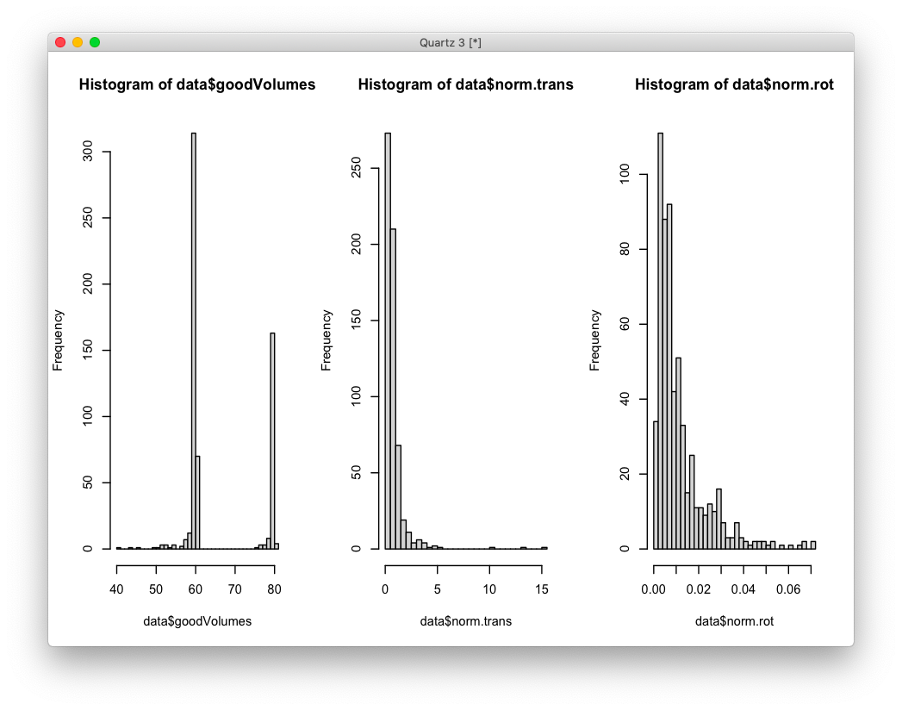

# 2020-10-28 06:42:40

Not sure what happened with this previous note, but I'm trying to recreate it.
The idea is to repeat the same analysis I did for MPRAGE, but this time for DTI.
So first we start merging the files:

```r
gf = read.csv('~/data/expression_impute/gf_1119_09092020.csv')
scans = read.csv('~/data/expression_impute/all_dti_meta.csv')
gf$subject.id = gsub(x=gf$Subject.Code...Subjects, pattern='SID.', 
                         replacement='')
m = merge(gf, scans, all.x=F, all.y=F, by='subject.id')
write.csv(m, file='~/data/expression_impute/gfWithDTI_1756_10272020.csv')
```

I then added the QualityControl information and removed anyone == 4. That
created gfWithDTI_1595_10272020.csv. Next step was to add the movement info,
which created gfWithDTI_1595_10282020.csv, and keep only the best scan per
subject, but staying inside the 6.69 to 38.83 age range. The sorting method,
after goodVolumes, was norm_trans then norm_rot. I preferred scans that had
nothing removed or at least all directions remaining, and gave preference to
scans with 80 directions. That created gfWithDTI_602_10292020.csv. I also added
variables for the sequence type and scanner_update, just in case.

# 2020-10-29 06:33:47

Let's add the actual data to the file above. I'll go ahead and add all DTI
tracts and then just use as phenotypes the good ones for this project.

```bash
# ncrshell01
cd /mnt/shaw/sudregp/dtitk_processing/tortoise_dtitk_crossSec_agingTemplate
rm ~/tmp/m2_diffeo.txt;
for m in `cat ~/tmp/m2.txt`; do
    echo "${m}_tensor_diffeo.nii.gz" >> ~/tmp/m2_diffeo.txt;
done
tsa_sampling ~/tmp/m2_diffeo.txt ../ixi_aging_template_v3.0/tsa/ mean
# make sure the script is set to use the correct subject file
python3 ~/research_code/lab_mgmt/convert_dti_sampling.py
Rscript ~/research_code/dti/compile_tract_table.R
```

And we also compiled the ones for JHU_tracts:

```bash
#ncrshell01
mydir=/mnt/shaw/sudregp/dtitk_processing/tortoise_dtitk_crossSec_agingTemplate
weighted_tracts=jhu_tracts_602.csv;
cd $mydir
row="id";
for t in ATR CST cin_cin cin_hip CC IFO ILF SLF unc SLFtemp; do
    for h in l r; do
        for m in fa ad rd; do
            row=${row}','${m}_${t}_${h};
        done;
    done;
done
echo $row > $weighted_tracts;
for m in `cat ~/tmp/m2.txt`; do
    echo ${m}
    3dresample -master ./${m}_tensor_diffeo_fa.nii.gz -prefix ./rois.nii \
                -inset ../JHU_ICBM_tractsThr25_inAging.nii.gz \
                -rmode NN -overwrite 2>/dev/null &&
    row="${m}";
    for t in `seq 1 20`; do
        3dcalc -a rois.nii -expr "amongst(a, $t)" -prefix mask.nii \
            -overwrite 2>/dev/null &&
        fa=`3dmaskave -q -mask mask.nii ${m}_tensor_diffeo_fa.nii 2>/dev/null`;
        ad=`3dmaskave -q -mask mask.nii ${m}_tensor_diffeo_ad.nii 2>/dev/null`;
        rd=`3dmaskave -q -mask mask.nii ${m}_tensor_diffeo_rd.nii 2>/dev/null`;
        row=${row}','${fa}','${ad}','${rd};
    done
    echo $row >> $weighted_tracts;
    rm -rf rois.nii mask.nii;
done
```

I then merged with the clinical data to make it easier to select the best in
family.

```r
source('~/research_code/lab_mgmt/merge_on_closest_date.R')
data = read.csv('~/data/expression_impute/gfWithDTI_602_10292020.csv')
clin = read.csv('~/data/expression_impute//augmented_anon_clinical_10242020.csv')
clin_slim = clin[clin$age_clin!='child',]
clin_slim$age_clin = as.numeric(clin_slim$age_clin)
data2 = mergeOnClosestAge(data, clin_slim, data$subject.id, x.id='subject.id',
                          y.id='SID', x.age='age_acq', y.age='age_clin')

write.csv(data2, file='~/data/expression_impute/gfWithDTIandClin_602_10292020.csv')
```

I then selected onePerFamily based on the same criteria used for MPRAGE. The
difference here is that I chose 60 instead of 80 volumes when it mattered to
increase the chances we had SX. And added the DTITK tracts to it to, as they
were still compiling before.

Startng the analysis then. First we make some plots to decide where to threshold
for the 3 usual QC variables:

```r
gf = read.csv('~/data/expression_impute/gfWithDTIandClin_602_10292020.csv')
data = gf[gf$bestInFamily=='TRUE',]
quartz()
par(mfrow = c(1,3))
hist(data$goodVolumes, breaks=50)
hist(data$norm.trans, breaks=50)
hist(data$norm.rot, breaks=50)
```


```r
keep_idx = data$goodVolumes >= 56 & data$norm.trans <= 1.5 & data$norm.rot <= .035
data = data[keep_idx,]
```

Now we have 332 out of the initial 371 scans. Let's remove the outliers and
residualize.

```r
# combine some hemispheres to reduce comparisons
# CC_l is forceps major, CC_r is minor
for (m in c('ad', 'fa', 'rd')) {
    data[, sprintf('%s_ATR', m)] = data[, sprintf('%s_ATR_l', m)] + data[, sprintf('%s_ATR_r', m)]
    data[, sprintf('%s_cin_cin', m)] = data[, sprintf('%s_cin_cin_l', m)] + data[, sprintf('%s_cin_cin_r', m)]
}
brain_vars = colnames(data)[c(29:88, 104:142)]

for (v in brain_vars) {
    m = mean(data[, v], na.rm=T)
    s = sd(data[, v], na.rm=T)
    data[which(data[, v] > m + 3*s), v] = NA
    data[which(data[, v] < m - 3*s), v] = NA
}
```

```
    fa_ATR_l     ad_ATR_l     rd_ATR_l     fa_ATR_r     ad_ATR_r     rd_ATR_r     fa_CST_l     ad_CST_l 
           4            3            5            4            3            3            1            3 
    rd_CST_l     fa_CST_r     ad_CST_r     rd_CST_r fa_cin_cin_l ad_cin_cin_l rd_cin_cin_l fa_cin_cin_r 
           3            2            2            3            3            3            0            2 
ad_cin_cin_r rd_cin_cin_r fa_cin_hip_l ad_cin_hip_l rd_cin_hip_l fa_cin_hip_r ad_cin_hip_r rd_cin_hip_r 
           2            0            3            2            1            2            6            1 
     fa_CC_l      ad_CC_l      rd_CC_l      fa_CC_r      ad_CC_r      rd_CC_r     fa_IFO_l     ad_IFO_l 
           2            3            3            5            2            4            3            4 
    rd_IFO_l     fa_IFO_r     ad_IFO_r     rd_IFO_r     fa_ILF_l     ad_ILF_l     rd_ILF_l     fa_ILF_r 
           3            2            4            4            3            3            3            2 
    ad_ILF_r     rd_ILF_r     fa_SLF_l     ad_SLF_l     rd_SLF_l     fa_SLF_r     ad_SLF_r     rd_SLF_r 
           3            2            3            4            4            2            2            1 
    fa_unc_l     ad_unc_l     rd_unc_l     fa_unc_r     ad_unc_r     rd_unc_r fa_SLFtemp_l ad_SLFtemp_l 
           3            3            3            3            2            2            2            3 
rd_SLFtemp_l fa_SLFtemp_r ad_SLFtemp_r rd_SLFtemp_r  FA_left_cst  AD_left_cst  RD_left_cst  FA_left_ifo 
           2            4            3            2            4            3            4            2 
 AD_left_ifo  RD_left_ifo  FA_left_ilf  AD_left_ilf  RD_left_ilf  FA_left_slf  AD_left_slf  RD_left_slf 
           4            2            1            1            3            2            4            3 
 FA_left_unc  AD_left_unc  RD_left_unc FA_right_cst AD_right_cst RD_right_cst FA_right_ifo AD_right_ifo 
           2            4            2            3            3            3            3            4 
RD_right_ifo FA_right_ilf AD_right_ilf RD_right_ilf FA_right_slf AD_right_slf RD_right_slf FA_right_unc 
           4            1            1            1            2            3            2            3 
AD_right_unc RD_right_unc        FA_cc        AD_cc        RD_cc       ad_ATR   ad_cin_cin       fa_ATR 
           3            2            3            4            3            2            2            4 
  fa_cin_cin       rd_ATR   rd_cin_cin 
           1            5            0 
```

Not too bad on outliers.

```r
library(MASS)
for (v in brain_vars) {
    fm_str = sprintf('%s ~ Sex...Subjects + age_acq + scanner_update + sequence_type + norm.trans + norm.rot + goodVolumes', v)
    res.lm <- lm(as.formula(fm_str), data = data, na.action=na.exclude)
    step <- stepAIC(res.lm, direction = "both", trace = F)
    data[, sprintf('res_%s', v)] = scale(residuals(step))
}
```

I scaled it so it might make it easier on the association scripts... who knows.

```r
num_vars = c('SX_inatt', 'SX_hi', 'maxOverTimeSX_inatt', 'maxOverTimeSX_hi')
pc_vars = c('fa_ATR_l', 'ad_ATR_l', 'rd_ATR_l',
            'fa_ATR_r', 'ad_ATR_r', 'rd_ATR_r',
            'fa_ATR', 'ad_ATR', 'rd_ATR',
            'fa_cin_cin_l', 'ad_cin_cin_l', 'rd_cin_cin_l',
            'fa_cin_cin_r', 'ad_cin_cin_r', 'rd_cin_cin_r',
            'fa_cin_cin', 'ad_cin_cin', 'rd_cin_cin',
            'fa_CC_r', 'ad_CC_r', 'rd_CC_r',
            'FA_cc', 'AD_cc', 'RD_cc')
num_corrs = matrix(nrow=length(num_vars), ncol=length(pc_vars),
                   dimnames=list(num_vars, pc_vars))
num_pvals = num_corrs
for (x in num_vars) {
    for (y in pc_vars) {
        res = cor.test(data[, x], data[, sprintf('res_%s', y)])
        num_corrs[x, y] = res$estimate
        num_pvals[x, y] = res$p.value
    }
}

categ_vars = c('DX_dsm', 'DX_nv012', 'everADHD_dsm', 'everADHD_nv012')
categ_corrs = matrix(nrow=length(categ_vars), ncol=length(pc_vars),
                   dimnames=list(categ_vars, pc_vars))
categ_pvals = categ_corrs
for (x in categ_vars) {
    for (y in pc_vars) {
        idx = data[,x] == levels(factor(data[,x]))[1]
        res = t.test(data[idx, sprintf('res_%s', y)],
                     data[!idx, sprintf('res_%s', y)])
        categ_corrs[x, y] = res$statistic
        categ_pvals[x, y] = res$p.value
    }
}
```

```
r$> num_pvals                                                                                                     
                     fa_ATR_l  ad_ATR_l  rd_ATR_l  fa_ATR_r  ad_ATR_r  rd_ATR_r    fa_ATR    ad_ATR    rd_ATR
SX_inatt            0.3790670 0.4462035 0.9054626 0.9666651 0.1794971 0.2562160 0.5860276 0.4823268 0.4448599
SX_hi               0.2998537 0.9979476 0.9677308 0.3690461 0.4310429 0.6020160 0.2518667 0.9857176 0.8127792
maxOverTimeSX_inatt 0.7414829 0.7423561 0.9927582 0.8182072 0.3694342 0.2837390 0.9506405 0.7497598 0.4895599
maxOverTimeSX_hi    0.6483967 0.8942790 0.9632808 0.4109051 0.4727483 0.5536262 0.4617155 0.8572047 0.7091909
                    fa_cin_cin_l ad_cin_cin_l rd_cin_cin_l fa_cin_cin_r ad_cin_cin_r rd_cin_cin_r fa_cin_cin
SX_inatt               0.7846937    0.6859248    0.6463463   0.13231008    0.4467303   0.63542104  0.5549766
SX_hi                  0.6658146    0.7996744    0.3525877   0.04736267    0.9635725   0.03071438  0.1329616
maxOverTimeSX_inatt    0.7779335    0.6619499    0.7492968   0.80750649    0.9909842   0.61051338  0.9059625
maxOverTimeSX_hi       0.3171638    0.3280271    0.5849199   0.26989379    0.5963759   0.59631789  0.2300269
                    ad_cin_cin rd_cin_cin   fa_CC_r    ad_CC_r   rd_CC_r     FA_cc     AD_cc     RD_cc
SX_inatt             0.9072696 0.93944185 0.4337081 0.09967053 0.2804028 0.5490908 0.7668163 0.5011312
SX_hi                0.7729850 0.08285943 0.4171543 0.25600741 0.2613295 0.1289545 0.3616328 0.1303520
maxOverTimeSX_inatt  0.6900729 0.55543052 0.7008466 0.13535491 0.1860882 0.9260683 0.6552787 0.5908671
maxOverTimeSX_hi     0.5278644 0.58680267 0.2082050 0.49845952 0.6219227 0.5785931 0.6217196 0.9146058

r$> categ_pvals                                                                                                   
                fa_ATR_l  ad_ATR_l  rd_ATR_l  fa_ATR_r  ad_ATR_r  rd_ATR_r    fa_ATR    ad_ATR    rd_ATR
DX_dsm         0.2073697 0.8057100 0.5122394 0.6320128 0.2651927 0.6137760 0.3150283 0.7929999 0.9562131
DX_nv012       0.3572932 0.6034856 0.9909229 0.9509652 0.1502491 0.1660799 0.6031571 0.5132933 0.4364655
everADHD_dsm   0.9705937 0.8887406 0.7803166 0.5124377 0.1515689 0.1021785 0.7950344 0.3832427 0.5014836
everADHD_nv012 0.4766970 0.7926688 0.6263349 0.8880681 0.4219413 0.2801447 0.7646101 0.9994373 0.7192905
               fa_cin_cin_l ad_cin_cin_l rd_cin_cin_l fa_cin_cin_r ad_cin_cin_r rd_cin_cin_r fa_cin_cin
DX_dsm            0.7905896    0.5813053    0.9763900    0.2581709    0.9004726    0.4201112  0.5653722
DX_nv012          0.9864327    0.7224128    0.8936544    0.1113040    0.5107603    0.5117792  0.4137960
everADHD_dsm      0.4369438    0.7428390    0.3370291    0.3588372    0.2970644    0.8070753  0.9334574
everADHD_nv012    0.9069878    0.5738400    0.8158508    0.2914844    0.7310328    0.8924219  0.7166679
               ad_cin_cin rd_cin_cin   fa_CC_r    ad_CC_r   rd_CC_r     FA_cc     AD_cc     RD_cc
DX_dsm          0.6788410  0.6606882 0.6224447 0.92750089 0.7607110 0.4601295 0.5775076 0.4001945
DX_nv012        0.9869630  0.8233177 0.9859887 0.44521656 0.3915300 0.8236560 0.9757306 0.7497203
everADHD_dsm    0.7880096  0.4728120 0.7155694 0.06118939 0.1043308 0.7285740 0.9038036 0.8023221
everADHD_nv012  0.7925970  0.8554638 0.8308259 0.53492013 0.3782764 0.9030760 0.8029232 0.7723142
```

There might be something for cing_cing_r. I also wanted to check if the
association is somehow affected by adding sex (or anything else) as a covariate.
But first let's redo all of this with WNH only:

```r
gf = read.csv('~/data/expression_impute/gfWithDTIandClin_602_10292020.csv')
data = gf[gf$bestInFamily=='TRUE',]

keep_idx = data$goodVolumes >= 56 & data$norm.trans <= 1.5 & data$norm.rot <= .035
data = data[keep_idx,]

a = read.table('~/data/expression_impute/results/NCR_v3_ACC_predict_1KG_en.txt', header=1)
iid2 = sapply(a$IID, function(x) strsplit(x, '_')[[1]][2])
a$IID = iid2
pcs = read.csv('~/data/expression_impute/pop_pcs.csv')
imp_data = merge(a, pcs, by='IID', all.x=F, all.y=F)
imp_data = merge(imp_data, data, by.x='IID', by.y='Subject.Code...Subjects',
                 all.x=F, all.y=F)

library(ggplot2)
ggplot(imp_data, aes(x=PC01, y=PC02, col=POP_CODE)) + geom_point() + geom_hline(yintercept=-.02, linetype="dashed", color = "black") + geom_vline(xintercept=0, linetype="dashed", color = "black")
```


The same limits I used for anatomical don't lok so bad. Let's see how the rest
of the analysis shapes up:

```r
imwnh = imp_data$PC01<0 & imp_data$PC02>-.02
data2 = data[imwnh, ]
for (m in c('ad', 'fa', 'rd')) {
    data2[, sprintf('%s_ATR', m)] = data2[, sprintf('%s_ATR_l', m)] + data2[, sprintf('%s_ATR_r', m)]
    data2[, sprintf('%s_cin_cin', m)] = data2[, sprintf('%s_cin_cin_l', m)] + data2[, sprintf('%s_cin_cin_r', m)]
}
brain_vars = colnames(data2)[c(29:88, 104:142)]

for (v in brain_vars) {
    m = mean(data2[, v], na.rm=T)
    s = sd(data2[, v], na.rm=T)
    data2[which(data2[, v] > m + 3*s), v] = NA
    data2[which(data2[, v] < m - 3*s), v] = NA
}
```

Down to 233 subjects now. 

```r
library(MASS)
for (v in brain_vars) {
    fm_str = sprintf('%s ~ Sex...Subjects + age_acq + scanner_update + sequence_type + norm.trans + norm.rot + goodVolumes', v)
    res.lm <- lm(as.formula(fm_str), data = data2, na.action=na.exclude)
    step <- stepAIC(res.lm, direction = "both", trace = F)
    data2[, sprintf('res_%s', v)] = scale(residuals(step))
}
```

I scaled it so it might make it easier on the association scripts... who knows.

```r
num_vars = c('SX_inatt', 'SX_hi', 'maxOverTimeSX_inatt', 'maxOverTimeSX_hi')
pc_vars = c('fa_ATR_l', 'ad_ATR_l', 'rd_ATR_l',
            'fa_ATR_r', 'ad_ATR_r', 'rd_ATR_r',
            'fa_ATR', 'ad_ATR', 'rd_ATR',
            'fa_cin_cin_l', 'ad_cin_cin_l', 'rd_cin_cin_l',
            'fa_cin_cin_r', 'ad_cin_cin_r', 'rd_cin_cin_r',
            'fa_cin_cin', 'ad_cin_cin', 'rd_cin_cin',
            'fa_CC_r', 'ad_CC_r', 'rd_CC_r',
            'FA_cc', 'AD_cc', 'RD_cc')
num_corrs = matrix(nrow=length(num_vars), ncol=length(pc_vars),
                   dimnames=list(num_vars, pc_vars))
num_pvals = num_corrs
for (x in num_vars) {
    for (y in pc_vars) {
        res = cor.test(data2[, x], data2[, sprintf('res_%s', y)])
        num_corrs[x, y] = res$estimate
        num_pvals[x, y] = res$p.value
    }
}

categ_vars = c('DX_dsm', 'DX_nv012', 'everADHD_dsm', 'everADHD_nv012')
categ_corrs = matrix(nrow=length(categ_vars), ncol=length(pc_vars),
                   dimnames=list(categ_vars, pc_vars))
categ_pvals = categ_corrs
for (x in categ_vars) {
    for (y in pc_vars) {
        idx = data2[,x] == levels(factor(data2[,x]))[1]
        res = t.test(data2[idx, sprintf('res_%s', y)],
                     data2[!idx, sprintf('res_%s', y)])
        categ_corrs[x, y] = res$statistic
        categ_pvals[x, y] = res$p.value
    }
}
```

```
r$> min(num_pvals)                                                                                                
[1] 0.05200704

r$> min(categ_pvals)                                                                                              
[1] 0.04408298

r$> categ_pvals                                                                                                   
                fa_ATR_l  ad_ATR_l  rd_ATR_l  fa_ATR_r  ad_ATR_r  rd_ATR_r    fa_ATR    ad_ATR    rd_ATR
DX_dsm         0.3922062 0.9419908 0.5885430 0.7184757 0.7729279 0.9540447 0.5035111 0.7961408 0.9812395
DX_nv012       0.4588238 0.4952861 0.9442845 0.9914317 0.3813109 0.3463282 0.6630574 0.3755390 0.4649202
everADHD_dsm   0.9584934 0.5112035 0.9226641 0.6784939 0.1713256 0.1825573 0.8967064 0.2546489 0.3943565
everADHD_nv012 0.7644887 0.6702866 0.9713476 0.9278729 0.3917384 0.3144744 0.8605231 0.4758971 0.4585636
               fa_cin_cin_l ad_cin_cin_l rd_cin_cin_l fa_cin_cin_r ad_cin_cin_r rd_cin_cin_r fa_cin_cin
DX_dsm            0.7977977    0.4737756    0.4078006   0.11704708    0.7489458    0.2259002  0.3879179
DX_nv012          0.8069343    0.6850698    0.6580456   0.07105588    0.4850212    0.3367267  0.3626751
everADHD_dsm      0.4680949    0.9607119    0.5245689   0.75706345    0.5761437    0.7430364  0.5322547
everADHD_nv012    0.9585335    0.9020213    0.8336867   0.62710379    0.9108041    0.8797800  0.8822485
               ad_cin_cin rd_cin_cin   fa_CC_r    ad_CC_r    rd_CC_r     FA_cc     AD_cc     RD_cc
DX_dsm          0.7006319  0.2574439 0.3213561 0.68382907 0.81496364 0.5855686 0.8837359 0.7391891
DX_nv012        0.9913618  0.4286563 0.4046173 0.30443637 0.23625940 0.9593263 0.8684003 0.9406365
everADHD_dsm    0.8464857  0.6256867 0.8694467 0.04408298 0.06342489 0.3303049 0.8746702 0.9545485
everADHD_nv012  0.8548732  0.8947031 0.5632894 0.41302746 0.23801143 0.5794802 0.9700843 0.8249874

r$> num_pvals                                                                                                     
                     fa_ATR_l  ad_ATR_l  rd_ATR_l  fa_ATR_r  ad_ATR_r  rd_ATR_r    fa_ATR    ad_ATR    rd_ATR
SX_inatt            0.4627497 0.2330361 0.6662003 0.6295870 0.2818524 0.5113014 0.5037558 0.2034472 0.4350041
SX_hi               0.9438688 0.8420374 0.5866199 0.7742431 0.6316506 0.3588375 0.9539452 0.5744881 0.4035272
maxOverTimeSX_inatt 0.9019197 0.5636066 0.8114275 0.8671919 0.4684716 0.5588966 0.8103900 0.4557973 0.4701605
maxOverTimeSX_hi    0.7921098 0.6486243 0.8545105 0.4381427 0.6282030 0.6831738 0.5550469 0.5340663 0.6457774
                    fa_cin_cin_l ad_cin_cin_l rd_cin_cin_l fa_cin_cin_r ad_cin_cin_r rd_cin_cin_r fa_cin_cin
SX_inatt               0.8633704    0.6743551    0.9956851   0.20681187    0.5582342   0.57171760  0.7994490
SX_hi                  0.6618160    0.6858216    0.3048962   0.05721076    0.9745746   0.05200704  0.2137651
maxOverTimeSX_inatt    0.8763168    0.8454727    0.8667484   0.88033883    0.7726326   0.64629696  0.5153446
maxOverTimeSX_hi       0.3815664    0.3994269    0.7009160   0.41650564    0.6868668   0.82943700  0.4842836
                    ad_cin_cin rd_cin_cin   fa_CC_r    ad_CC_r   rd_CC_r     FA_cc     AD_cc     RD_cc
SX_inatt             0.9713612  0.7478413 0.1744129 0.07907388 0.1619037 0.8140682 0.9489280 0.7020464
SX_hi                0.7415636  0.1213677 0.5076887 0.41586409 0.5923596 0.2128482 0.5130496 0.2561086
maxOverTimeSX_inatt  0.6053588  0.7779513 0.2782440 0.17950121 0.2312170 0.8603173 0.7155073 0.7192839
maxOverTimeSX_hi     0.6482986  0.7394551 0.1387490 0.50211834 0.5631114 0.6209578 0.8938236 0.8059737
```

Results are not that great... let's see what happens if I add everyone in it:

```r
data = read.csv('~/data/expression_impute/gfWithDTIandClin_602_10292020.csv')
keep_idx = data$goodVolumes >= 56 & data$norm.trans <= 1.5 & data$norm.rot <= .035
data2 = data[keep_idx,]

for (m in c('ad', 'fa', 'rd')) {
    data2[, sprintf('%s_ATR', m)] = data2[, sprintf('%s_ATR_l', m)] + data2[, sprintf('%s_ATR_r', m)]
    data2[, sprintf('%s_cin_cin', m)] = data2[, sprintf('%s_cin_cin_l', m)] + data2[, sprintf('%s_cin_cin_r', m)]
}
brain_vars = c('fa_ATR_l', 'ad_ATR_l', 'rd_ATR_l',
            'fa_ATR_r', 'ad_ATR_r', 'rd_ATR_r',
            'fa_ATR', 'ad_ATR', 'rd_ATR',
            'fa_cin_cin_l', 'ad_cin_cin_l', 'rd_cin_cin_l',
            'fa_cin_cin_r', 'ad_cin_cin_r', 'rd_cin_cin_r',
            'fa_cin_cin', 'ad_cin_cin', 'rd_cin_cin',
            'fa_CC_r', 'ad_CC_r', 'rd_CC_r',
            'FA_cc', 'AD_cc', 'RD_cc')

for (v in brain_vars) {
    m = mean(data2[, v], na.rm=T)
    s = sd(data2[, v], na.rm=T)
    data2[which(data2[, v] > m + 3*s), v] = NA
    data2[which(data2[, v] < m - 3*s), v] = NA
}
library(MASS)
library(nlme)
for (v in brain_vars) {
    fm_str = sprintf('%s ~ Sex...Subjects + age_acq + scanner_update + sequence_type + norm.trans + norm.rot + goodVolumes', v)
    fit <- lme(as.formula(fm_str), random=~1|FAMID, data = data2, na.action=na.exclude, method='ML')
    step <- stepAIC(fit, direction = "both", trace = F)
    data2[, sprintf('res_%s', v)] = scale(residuals(step))
}

num_vars = c('SX_inatt', 'SX_hi', 'maxOverTimeSX_inatt', 'maxOverTimeSX_hi')
pc_vars = c('fa_ATR_l', 'ad_ATR_l', 'rd_ATR_l',
            'fa_ATR_r', 'ad_ATR_r', 'rd_ATR_r',
            'fa_ATR', 'ad_ATR', 'rd_ATR',
            'fa_cin_cin_l', 'ad_cin_cin_l', 'rd_cin_cin_l',
            'fa_cin_cin_r', 'ad_cin_cin_r', 'rd_cin_cin_r',
            'fa_cin_cin', 'ad_cin_cin', 'rd_cin_cin',
            'fa_CC_r', 'ad_CC_r', 'rd_CC_r',
            'FA_cc', 'AD_cc', 'RD_cc')
num_corrs = matrix(nrow=length(num_vars), ncol=length(pc_vars),
                   dimnames=list(num_vars, pc_vars))
num_pvals = num_corrs
for (x in num_vars) {
    for (y in pc_vars) {
        res = cor.test(data2[, x], data2[, sprintf('res_%s', y)])
        num_corrs[x, y] = res$estimate
        num_pvals[x, y] = res$p.value
    }
}

categ_vars = c('DX_dsm', 'DX_nv012', 'everADHD_dsm', 'everADHD_nv012')
categ_corrs = matrix(nrow=length(categ_vars), ncol=length(pc_vars),
                   dimnames=list(categ_vars, pc_vars))
categ_pvals = categ_corrs
for (x in categ_vars) {
    for (y in pc_vars) {
        idx = data2[,x] == levels(factor(data2[,x]))[1]
        res = t.test(data2[idx, sprintf('res_%s', y)],
                     data2[!idx, sprintf('res_%s', y)])
        categ_corrs[x, y] = res$statistic
        categ_pvals[x, y] = res$p.value
    }
}
```

Expectedly this improves the results:

```r$> min(categ_pvals)                                                                                              
[1] 0.004875341

r$> min(num_pvals)                                                                                                
[1] 0.01019989

r$> which(categ_pvals<.05, arr.ind = T)                                                                           
               row col
everADHD_dsm     3   6
everADHD_dsm     3  21
everADHD_nv012   4  21

r$> brain_vars[c(6,21)]                                                                                           
[1] "rd_ATR_r" "rd_CC_r" 

r$> which(num_pvals<.05, arr.ind = T)                                                                             
                    row col
SX_hi                 2   1
SX_hi                 2   7
maxOverTimeSX_inatt   3  20
maxOverTimeSX_inatt   3  21
SX_hi                 2  22

r$> brain_vars[c(1,7,20:22)]                                                                                      
[1] "fa_ATR_l" "fa_ATR"   "ad_CC_r"  "rd_CC_r"  "FA_cc"   
```

OK, let's run those phenotypes through the TWAS then:

```r
a = read.table('~/data/expression_impute/results/NCR_v3_ACC_predict_1KG_en.txt', header=1)
iid2 = sapply(a$IID, function(x) strsplit(x, '_')[[1]][2])
a$IID = iid2
pcs = read.csv('~/data/expression_impute/pop_pcs.csv')
imp_data = merge(a, pcs, by='IID', all.x=F, all.y=F)
imp_data = merge(imp_data, data2, by.x='IID', by.y='Subject.Code...Subjects',
                 all.x=F, all.y=F)

imwnh = imp_data[imp_data$PC01<0 & imp_data$PC02>-.02,]$subject.id
data_dir = '~/data/expression_impute/'
phenotypes = list(ACC=c('res_rd_CC_r', 'res_ad_CC_r', 'res_FA_cc'),
                  Caudate=c('res_rd_ATR_r', 'res_fa_ATR_l', 'res_fa_ATR'))
for (region in c('ACC', 'Caudate')) {
   for (my_phen in phenotypes[[region]]) {
       print(my_phen)
      data3 = data2[data2$subject.id %in% imwnh, ]
      data3 = data3[, c('subject.id', my_phen, 'Sex...Subjects')]
      colnames(data3)[1] = 'IID'
      colnames(data3)[2] = 'phen'
      colnames(data3)[3] = 'sex'
      data3$sex = as.numeric(as.factor(data3$sex))
      data3 = data3[order(data3$IID), ]
      # it expects no more than the number of people we have in the phenotypes
    #   a = read.table(sprintf('%s/results/NCR_v3_%s_predict_1KG_en.txt',
    #                          data_dir, region), header=1)
       a = readRDS(sprintf('%s/results/NCR_v3_%s_1KG_mashr.rds', data_dir,
                           region))
      # remove FAMID from IID
      iid2 = sapply(a$IID, function(x) strsplit(x, '_')[[1]][2])
      iid3 = gsub(x=iid2, pattern='SID.', replacement='')
      a$IID = as.numeric(iid3)
      b = a[a$IID %in% data3$IID, ]
      b = b[order(b$IID), ]
      data3$FID = b$FID # they're both sorted on IID
    #   write.table(b, file=sprintf('%s/DTI_cropped_imp_EN_%s.tab', data_dir,
    #                               region), row.names=F, quote=F, sep='\t')
      write.table(b, file=sprintf('%s/DTI_cropped_imp_MASHR_%s.tab', data_dir,
                                  region), row.names=F, quote=F, sep='\t')
      write.table(data3, file=sprintf('%s/phen_%s.tab', data_dir, my_phen),
                  row.names=F, quote=F, sep='\t')
   }
}
```

And we run the associations:

```bash
# laptop
source /Users/sudregp/opt/miniconda3/etc/profile.d/conda.sh
conda activate imlabtools
DATA=~/data/expression_impute;
METAXCAN=~/data/expression_impute/MetaXcan/software;
for phen in res_rd_CC_r res_ad_CC_r res_FA_cc; do
   python3 $METAXCAN/PrediXcanAssociation.py \
        --expression_file $DATA/DTI_cropped_imp_MASHR_ACC.tab \
       --input_phenos_file $DATA/phen_${phen}.tab \
       --covariates_file $DATA/phen_${phen}.tab \
         --input_phenos_column phen \
         --covariates sex \
      --output $DATA/assoc_MASHR_${phen}.txt \
      --verbosity 9;
done
for phen in res_rd_ATR_r res_fa_ATR_l res_fa_ATR; do
   python3 $METAXCAN/PrediXcanAssociation.py \
        --expression_file $DATA/DTI_cropped_imp_MASHR_Caudate.tab \
       --input_phenos_file $DATA/phen_${phen}.tab \
       --covariates_file $DATA/phen_${phen}.tab \
         --input_phenos_column phen \
         --covariates sex \
      --output $DATA/assoc_MASHR_${phen}.txt \
      --verbosity 9;
done
```

Then it's just a matter of running the gene set analysis in BW:

```bash
# bw
source /data/$USER/conda/etc/profile.d/conda.sh
conda activate radian
./.local/bin/radian
```

```r
# bw
library(WebGestaltR)

data_dir = '~/data/expression_impute/'
phenotypes = list(ACC=c('res_rd_CC_r', 'res_ad_CC_r', 'res_FA_cc'),
                  caudate=c('res_rd_ATR_r', 'res_fa_ATR_l', 'res_fa_ATR'))

G_list0 = readRDS('~/data/rnaseq_derek/mart_rnaseq.rds')
G_list <- G_list0[!is.na(G_list0$hgnc_symbol),]
G_list = G_list[G_list$hgnc_symbol!='',]
G_list <- G_list[!duplicated(G_list$ensembl_gene_id),]
ncpu=31

for (md in c('EN', 'MASHR')) {
     for (region in c('ACC', 'caudate')) {
         for (phen in phenotypes[[region]]) {
             res = read.table(sprintf('%s/assoc_%s_%s.txt', data_dir, md, phen),
                              header=1)
             id_num = sapply(res$gene, function(x) strsplit(x=x, split='\\.')[[1]][1])
             dups = duplicated(id_num)
             id_num = id_num[!dups]
             res$id_num = id_num

             imnamed = res$id_num %in% G_list$ensembl_gene_id
             res = res[imnamed, ]
             G_list2 = merge(G_list, res, by.x='ensembl_gene_id', by.y='id_num')
             imautosome = which(G_list2$chromosome_name != 'X' &
                               G_list2$chromosome_name != 'Y' &
                               G_list2$chromosome_name != 'MT')
             G_list2 = G_list2[imautosome, ]

            for (score in c('zscore', 'effect')) {
                tmp2 = G_list2[, c('hgnc_symbol', score)]
                for (db in c('geneontology_Biological_Process_noRedundant',
                             'geneontology_Cellular_Component_noRedundant',
                             'geneontology_Molecular_Function_noRedundant',
                             'pathway_KEGG', 'disease_Disgenet',
                             'phenotype_Human_Phenotype_Ontology',
                             'network_PPI_BIOGRID')) {
                    cat(md, score, phen, db, '\n')
                    enrichResult <- WebGestaltR(enrichMethod="GSEA",
                                                organism="hsapiens",
                                                enrichDatabase=db,
                                                interestGene=tmp2,
                                                interestGeneType="genesymbol",
                                                sigMethod="top", topThr=10,
                                                minNum=5,
                                                isOutput=F, isParallel=T,
                                                nThreads=ncpu)
                    out_fname = sprintf('%s/WG_%s_%s_%s_%s.csv', data_dir,
                                        md, score, phen, db)
                    write.csv(enrichResult, file=out_fname, quote=F,
                              row.names=F)
                }
                # my own GMTs
                for (db in c('disorders', sprintf('%s_developmental', region))) {
                    cat(md, score, phen, db, '\n')
                    db_file = sprintf('~/data/post_mortem/%s.gmt', db)
                    enrichResult <- WebGestaltR(enrichMethod="GSEA",
                                                organism="hsapiens",
                                                enrichDatabaseFile=db_file,
                                                enrichDatabaseType="genesymbol",
                                                interestGene=tmp2,
                                                interestGeneType="genesymbol",
                                                sigMethod="top", topThr=10,
                                                minNum=3,
                                                isOutput=F, isParallel=T,
                                                nThreads=ncpu)
                    out_fname = sprintf('%s/WG_%s_%s_%s_%s.csv', data_dir,
                                        md, score, phen, db)
                    write.csv(enrichResult, file=out_fname, quote=F,
                              row.names=F)
                }
            }
         }
      }
}
```

# 2020-11-02 05:56:51

I was thinking a bit more about these models, and I think it makes more sense to
run the entire analysis as LME, instead of breaking it up for correlation and
t-test. I'll use the same framework I'm using for residualizing, except that it
won't have the DX term in the residualization.

```r
data = read.csv('~/data/expression_impute/gfWithDTIandClin_602_10292020.csv')
quartz()
par(mfrow = c(1,3))
hist(data$goodVolumes, breaks=50)
hist(data$norm.trans, breaks=50)
hist(data$norm.rot, breaks=50)
```



There's no difference in norm.trans between adult and child sequences, so that's
good. The thresholds I had before could still work, but for now I'll go ahead
and use one based on quantiles (which won't work for goodVolumes). It still
looks good in our distributions:

```
r$> quantile(data$norm.rot, .85)                                                                                             
       85% 
0.02192451 

r$> quantile(data$norm.trans, .85)                                                                                           
     85% 
1.096012 
```

```r
keep_idx = (data$goodVolumes >= 56 &
            data$norm.trans <= quantile(data$norm.trans, .85) &
            data$norm.rot <= quantile(data$norm.rot, .85))
data2 = data[keep_idx,]

# combining some trracts
for (m in c('ad', 'fa', 'rd')) {
    data2[, sprintf('%s_ATR', m)] = data2[, sprintf('%s_ATR_l', m)] + data2[, sprintf('%s_ATR_r', m)]
    data2[, sprintf('%s_cin_cin', m)] = data2[, sprintf('%s_cin_cin_l', m)] + data2[, sprintf('%s_cin_cin_r', m)]
}
brain_vars = c('fa_ATR_l', 'ad_ATR_l', 'rd_ATR_l',
            'fa_ATR_r', 'ad_ATR_r', 'rd_ATR_r',
            'fa_ATR', 'ad_ATR', 'rd_ATR',
            'fa_cin_cin_l', 'ad_cin_cin_l', 'rd_cin_cin_l',
            'fa_cin_cin_r', 'ad_cin_cin_r', 'rd_cin_cin_r',
            'fa_cin_cin', 'ad_cin_cin', 'rd_cin_cin',
            'fa_CC_r', 'ad_CC_r', 'rd_CC_r',
            'FA_cc', 'AD_cc', 'RD_cc')

for (v in brain_vars) {
    m = mean(data2[, v], na.rm=T)
    s = sd(data2[, v], na.rm=T)
    data2[which(data2[, v] > m + 3*s), v] = NA
    data2[which(data2[, v] < m - 3*s), v] = NA
}
# working with 454 scans
library(MASS)
library(nlme)
num_vars = c('SX_inatt', 'SX_hi', 'maxOverTimeSX_inatt', 'maxOverTimeSX_hi')
categ_vars = c('DX_dsm', 'DX_nv012', 'everADHD_dsm', 'everADHD_nv012')
clin_vars = c(num_vars, categ_vars)

clin_pvals = matrix(nrow=length(clin_vars), ncol=length(brain_vars),
                   dimnames=list(clin_vars, brain_vars))
for (bv in brain_vars) {
    for (cv in clin_vars) {
        cat(bv, cv, '\n')
        fm_str = sprintf('%s ~ %s + Sex...Subjects + age_acq + scanner_update + sequence_type + norm.trans + norm.rot + goodVolumes', bv, cv)
        fit <- lme(as.formula(fm_str), random=~1|FAMID, data = data2,
                   na.action=na.exclude, method='ML')
        step <- try(stepAIC(fit, direction = "both", trace = F,
                            scope = list(lower = as.formula(sprintf('~ %s',
                                                                    cv)))))
        if (length(step)==1) {
            # if we couldn't fit using stepAIC get the value from initial lme
            clin_pvals[cv, bv] = summary(fit)$tTable[2, 'p-value']
        } else {
            clin_pvals[cv, bv] = summary(step)$tTable[2, 'p-value']
        }
    }
}
```

```
r$> which(clin_pvals < .05, arr.ind = T)                                                                                     
                    row col
SX_hi                 2   1
DX_dsm                5   1
DX_nv012              6   1
SX_hi                 2   7
DX_dsm                5   7
SX_hi                 2  15
SX_hi                 2  16
SX_hi                 2  18
SX_inatt              1  20
maxOverTimeSX_inatt   3  20
everADHD_dsm          7  20
maxOverTimeSX_inatt   3  21
everADHD_dsm          7  21
everADHD_nv012        8  21
SX_hi                 2  22

r$> which(clin_pvals < .05, arr.ind = T)[,2]                                                                                 
              SX_hi              DX_dsm            DX_nv012               SX_hi              DX_dsm               SX_hi 
                  1                   1                   1                   7                   7                  15 
              SX_hi               SX_hi            SX_inatt maxOverTimeSX_inatt        everADHD_dsm maxOverTimeSX_inatt 
                 16                  18                  20                  20                  20                  21 
       everADHD_dsm      everADHD_nv012               SX_hi 
                 21                  21                  22 

r$> colnames(clin_pvals)[which(clin_pvals < .05, arr.ind = T)[,2]]                                                           
 [1] "fa_ATR_l"     "fa_ATR_l"     "fa_ATR_l"     "fa_ATR"       "fa_ATR"       "rd_cin_cin_r" "fa_cin_cin"   "rd_cin_cin"  
 [9] "ad_CC_r"      "ad_CC_r"      "ad_CC_r"      "rd_CC_r"      "rd_CC_r"      "rd_CC_r"      "FA_cc"       

r$> unique(colnames(clin_pvals)[which(clin_pvals < .05, arr.ind = T)[,2]])                                                   
[1] "fa_ATR_l"     "fa_ATR"       "rd_cin_cin_r" "fa_cin_cin"   "rd_cin_cin"   "ad_CC_r"      "rd_CC_r"      "FA_cc"       
```

Now let's construct the residualized versions and run the associations. I'll
focus on fa_ATR, fa_cin_cin, and FA_cc, which are good summaries and are all
correlated to SX_hi. But is it just motion? Well, it has already been removed in
the model.

```r
good_brain_vars = c("fa_ATR", "fa_cin_cin", "FA_cc")
for (v in good_brain_vars) {
    fm_str = sprintf('%s ~ Sex...Subjects + age_acq + scanner_update + sequence_type + norm.trans + norm.rot + goodVolumes', v)
    fit <- lme(as.formula(fm_str), random=~1|FAMID, data = data2, na.action=na.exclude, method='ML')
    step <- stepAIC(fit, direction = "both", trace = F)
    data2[, sprintf('res_%s', v)] = scale(residuals(step))
}
```

And we run those phenotypes through TWAS. But only WNH and bestInFamily!

```r
a = read.table('~/data/expression_impute/results/NCR_v3_ACC_predict_1KG_en.txt', header=1)
iid2 = sapply(a$IID, function(x) strsplit(x, '_')[[1]][2])
a$IID = iid2
pcs = read.csv('~/data/expression_impute/pop_pcs.csv')
imp_data = merge(a, pcs, by='IID', all.x=F, all.y=F)
imp_data = merge(imp_data, data2, by.x='IID', by.y='Subject.Code...Subjects',
                 all.x=F, all.y=F)

imwnh = imp_data[imp_data$PC01<0 & imp_data$PC02>-.02,]$subject.id
data_dir = '~/data/expression_impute/'
phenotypes = list(ACC=c('res_fa_cin_cin', 'res_FA_cc'),
                  Caudate=c('res_fa_ATR'))
for (region in c('ACC', 'Caudate')) {
   for (my_phen in phenotypes[[region]]) {
       print(my_phen)
      data3 = data2[data2$subject.id %in% imwnh, ]
      data3 = data3[data3$bestInFamily==T, ]
      data3 = data3[, c('subject.id', my_phen, 'Sex...Subjects')]
      colnames(data3)[1] = 'IID'
      colnames(data3)[2] = 'phen'
      colnames(data3)[3] = 'sex'
      data3$sex = as.numeric(as.factor(data3$sex))
      data3 = data3[order(data3$IID), ]
      # it expects no more than the number of people we have in the phenotypes
      a = read.table(sprintf('%s/results/NCR_v3_%s_predict_1KG_en.txt',
                             data_dir, region), header=1)
    #    a = readRDS(sprintf('%s/results/NCR_v3_%s_1KG_mashr.rds', data_dir,
    #                        region))
      # remove FAMID from IID
      iid2 = sapply(a$IID, function(x) strsplit(x, '_')[[1]][2])
      iid3 = gsub(x=iid2, pattern='SID.', replacement='')
      a$IID = as.numeric(iid3)
      b = a[a$IID %in% data3$IID, ]
      b = b[order(b$IID), ]
      data3$FID = b$FID # they're both sorted on IID
      write.table(b, file=sprintf('%s/DTI_cropped_imp_EN_%s.tab', data_dir,
                                  region), row.names=F, quote=F, sep='\t')
    #   write.table(b, file=sprintf('%s/DTI_cropped_imp_MASHR_%s.tab', data_dir,
    #                               region), row.names=F, quote=F, sep='\t')
      write.table(data3, file=sprintf('%s/phen_%s.tab', data_dir, my_phen),
                  row.names=F, quote=F, sep='\t')
   }
}
```

And we run the associations:

```bash
# laptop
source /Users/sudregp/opt/miniconda3/etc/profile.d/conda.sh
conda activate imlabtools
DATA=~/data/expression_impute;
METAXCAN=~/data/expression_impute/MetaXcan/software;
for phen in res_fa_cin_cin res_FA_cc; do
   python3 $METAXCAN/PrediXcanAssociation.py \
        --expression_file $DATA/DTI_cropped_imp_EN_ACC.tab \
       --input_phenos_file $DATA/phen_${phen}.tab \
       --covariates_file $DATA/phen_${phen}.tab \
         --input_phenos_column phen \
         --covariates sex \
      --output $DATA/assoc_EN_${phen}.txt \
      --verbosity 9;
done
for phen in res_fa_ATR; do
   python3 $METAXCAN/PrediXcanAssociation.py \
        --expression_file $DATA/DTI_cropped_imp_EN_Caudate.tab \
       --input_phenos_file $DATA/phen_${phen}.tab \
       --covariates_file $DATA/phen_${phen}.tab \
         --input_phenos_column phen \
         --covariates sex \
      --output $DATA/assoc_EN_${phen}.txt \
      --verbosity 9;
done
```

Then it's just a matter of running the gene set analysis in BW:

```bash
# bw
source /data/$USER/conda/etc/profile.d/conda.sh
conda activate radian
./.local/bin/radian
```

```r
# bw
library(WebGestaltR)

data_dir = '~/data/expression_impute/'
phenotypes = list(ACC=c('res_fa_cin_cin', 'res_FA_cc'),
                  caudate=c('res_fa_ATR'))

G_list0 = readRDS('~/data/rnaseq_derek/mart_rnaseq.rds')
G_list <- G_list0[!is.na(G_list0$hgnc_symbol),]
G_list = G_list[G_list$hgnc_symbol!='',]
G_list <- G_list[!duplicated(G_list$ensembl_gene_id),]
ncpu=31

for (md in c('EN', 'MASHR')) {
     for (region in c('ACC', 'caudate')) {
         for (phen in phenotypes[[region]]) {
             res = read.table(sprintf('%s/assoc_%s_%s.txt', data_dir, md, phen),
                              header=1)
             id_num = sapply(res$gene, function(x) strsplit(x=x, split='\\.')[[1]][1])
             dups = duplicated(id_num)
             id_num = id_num[!dups]
             res$id_num = id_num

             imnamed = res$id_num %in% G_list$ensembl_gene_id
             res = res[imnamed, ]
             G_list2 = merge(G_list, res, by.x='ensembl_gene_id', by.y='id_num')
             imautosome = which(G_list2$chromosome_name != 'X' &
                               G_list2$chromosome_name != 'Y' &
                               G_list2$chromosome_name != 'MT')
             G_list2 = G_list2[imautosome, ]

            for (score in c('zscore', 'effect')) {
                tmp2 = G_list2[, c('hgnc_symbol', score)]
                for (db in c('geneontology_Biological_Process_noRedundant',
                             'geneontology_Cellular_Component_noRedundant',
                             'geneontology_Molecular_Function_noRedundant',
                             'pathway_KEGG', 'disease_Disgenet',
                             'phenotype_Human_Phenotype_Ontology',
                             'network_PPI_BIOGRID')) {
                    cat(md, score, phen, db, '\n')
                    enrichResult <- WebGestaltR(enrichMethod="GSEA",
                                                organism="hsapiens",
                                                enrichDatabase=db,
                                                interestGene=tmp2,
                                                interestGeneType="genesymbol",
                                                sigMethod="top", topThr=10,
                                                minNum=5,
                                                isOutput=F, isParallel=T,
                                                nThreads=ncpu)
                    out_fname = sprintf('%s/WG_%s_%s_%s_%s.csv', data_dir,
                                        md, score, phen, db)
                    write.csv(enrichResult, file=out_fname, quote=F,
                              row.names=F)
                }
                # my own GMTs
                for (db in c('disorders', sprintf('%s_developmental', region))) {
                    cat(md, score, phen, db, '\n')
                    db_file = sprintf('~/data/post_mortem/%s.gmt', db)
                    enrichResult <- WebGestaltR(enrichMethod="GSEA",
                                                organism="hsapiens",
                                                enrichDatabaseFile=db_file,
                                                enrichDatabaseType="genesymbol",
                                                interestGene=tmp2,
                                                interestGeneType="genesymbol",
                                                sigMethod="top", topThr=10,
                                                minNum=3,
                                                isOutput=F, isParallel=T,
                                                nThreads=ncpu)
                    out_fname = sprintf('%s/WG_%s_%s_%s_%s.csv', data_dir,
                                        md, score, phen, db)
                    write.csv(enrichResult, file=out_fname, quote=F,
                              row.names=F)
                }
            }
         }
      }
}
```

While we're running this in BW, let's run the associations without the sex
covariate:

```bash
# laptop
source /Users/sudregp/opt/miniconda3/etc/profile.d/conda.sh
conda activate imlabtools
DATA=~/data/expression_impute;
METAXCAN=~/data/expression_impute/MetaXcan/software;
for phen in res_fa_cin_cin res_FA_cc; do
   python3 $METAXCAN/PrediXcanAssociation.py \
        --expression_file $DATA/DTI_cropped_imp_MASHR_ACC.tab \
       --input_phenos_file $DATA/phen_${phen}.tab \
         --input_phenos_column phen \
      --output $DATA/assoc_MASHR_noSex_${phen}.txt \
      --verbosity 9;
done
for phen in res_fa_ATR; do
   python3 $METAXCAN/PrediXcanAssociation.py \
        --expression_file $DATA/DTI_cropped_imp_MASHR_Caudate.tab \
       --input_phenos_file $DATA/phen_${phen}.tab \
         --input_phenos_column phen \
      --output $DATA/assoc_MASHR_noSex_${phen}.txt \
      --verbosity 9;
done
```

Let's pick a phenotype and check the overlap of results using Sex or not:

```r
md = 'MASHR'
phen = 'res_fa_cin_cin'
res = read.table(sprintf('%s/assoc_%s_%s.txt', data_dir, md, phen),
                              header=1)
resNS = read.table(sprintf('%s/assoc_%s_noSex_%s.txt', data_dir, md, phen),
                              header=1)
res = res[order(res$gene),]
resNS = resNS[order(resNS$gene),]
```

```
r$> cor.test(res$pvalue, resNS$pvalue)                                           

        Pearson's product-moment correlation

data:  res$pvalue and resNS$pvalue
t = 1537.4, df = 13214, p-value < 2.2e-16
alternative hypothesis: true correlation is not equal to 0
95 percent confidence interval:
 0.9971198 0.9973094
sample estimates:
      cor 
0.9972162 

r$> sum(res$pvalue<.05, na.rm=T)                                                 
[1] 668

r$> sum(resNS$pvalue<.05, na.rm=T)                                               
[1] 663

r$> length(intersect(res$gene[res$pvalue<.05], resNS$gene[resNS$pvalue<.05]))    
[1] 645
```

Results for the other phenotypes were very much the same. I'll keep the sex
covariate just because I already ran the results.


# TODO
 * run overrepresentation across all results, including imputation
 * ask Kwangmi and Sam about the software to compare GWAS results

