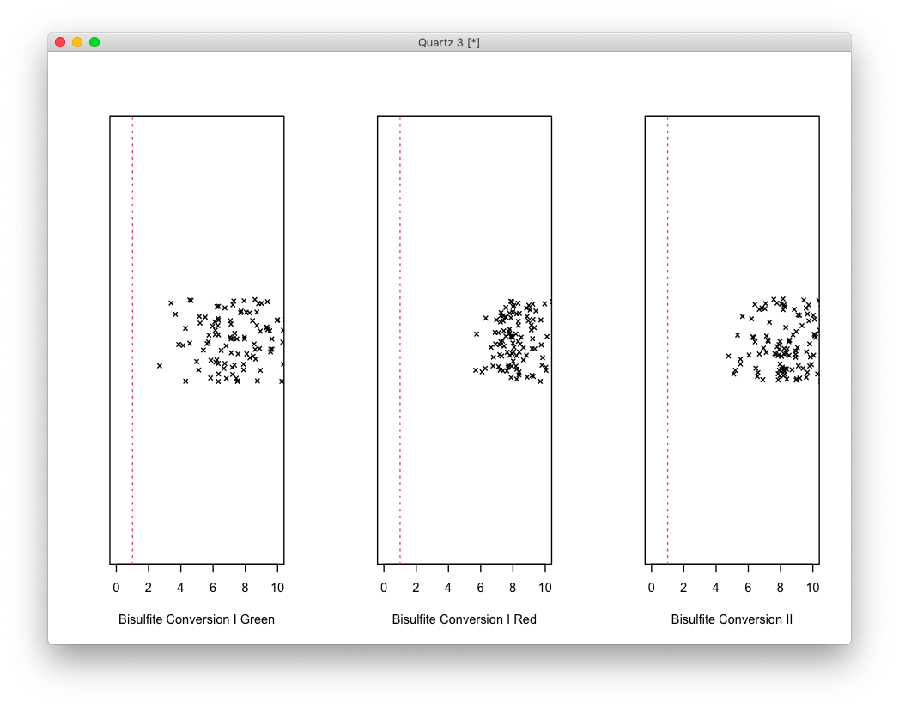
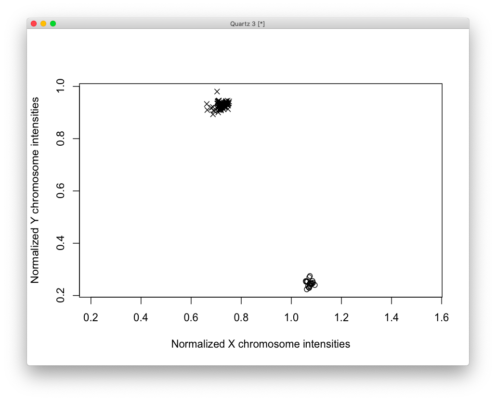
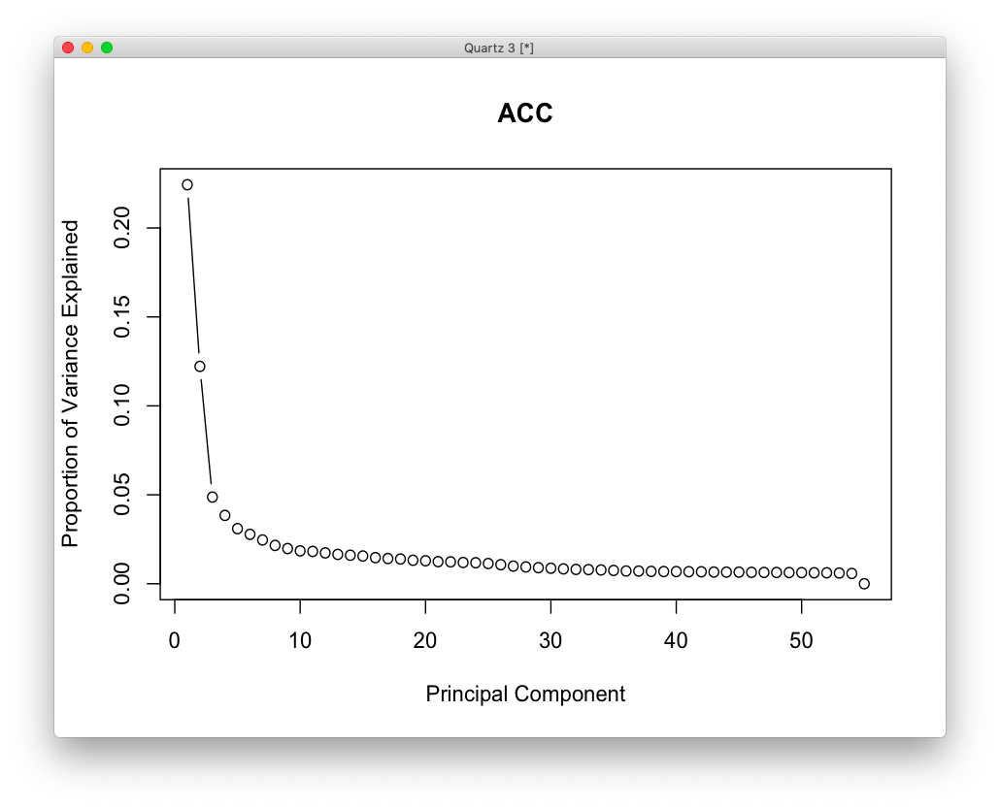
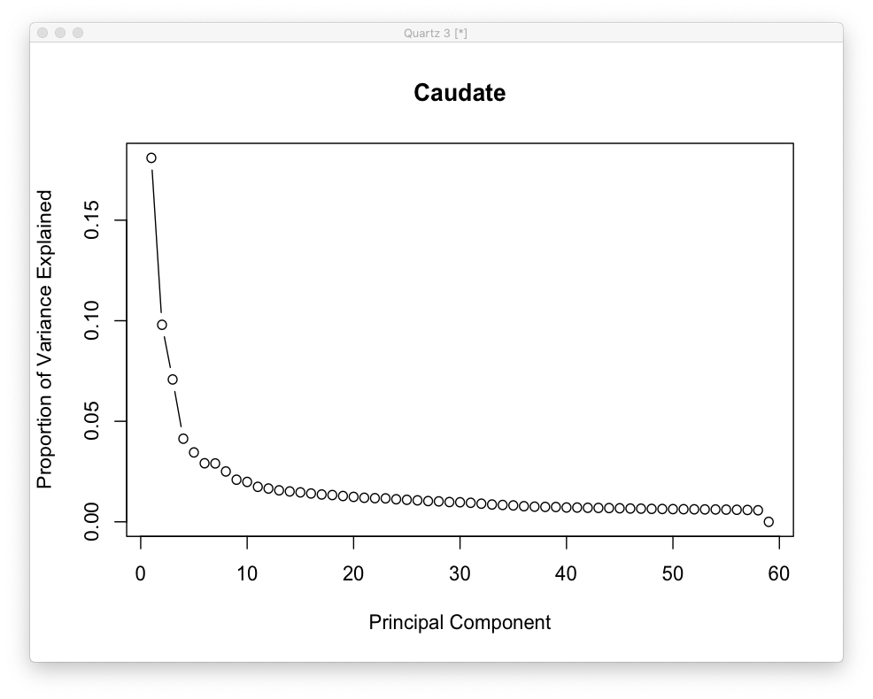
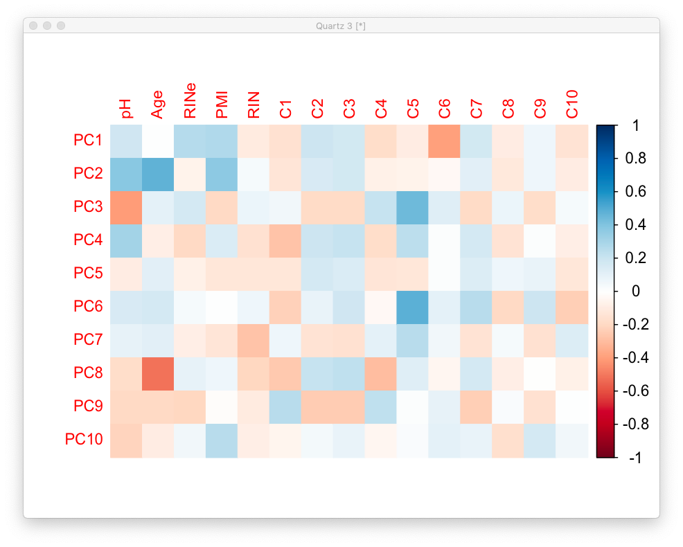
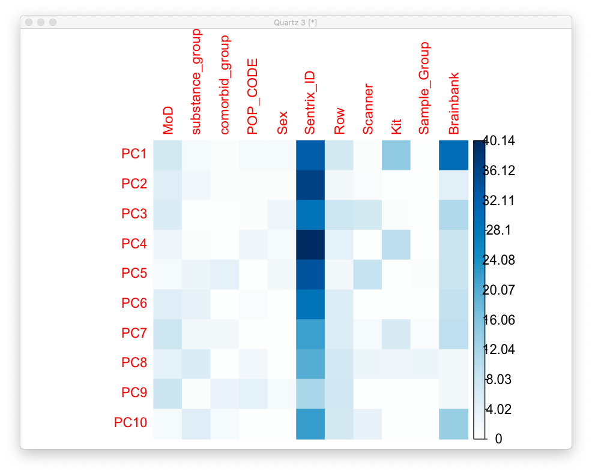
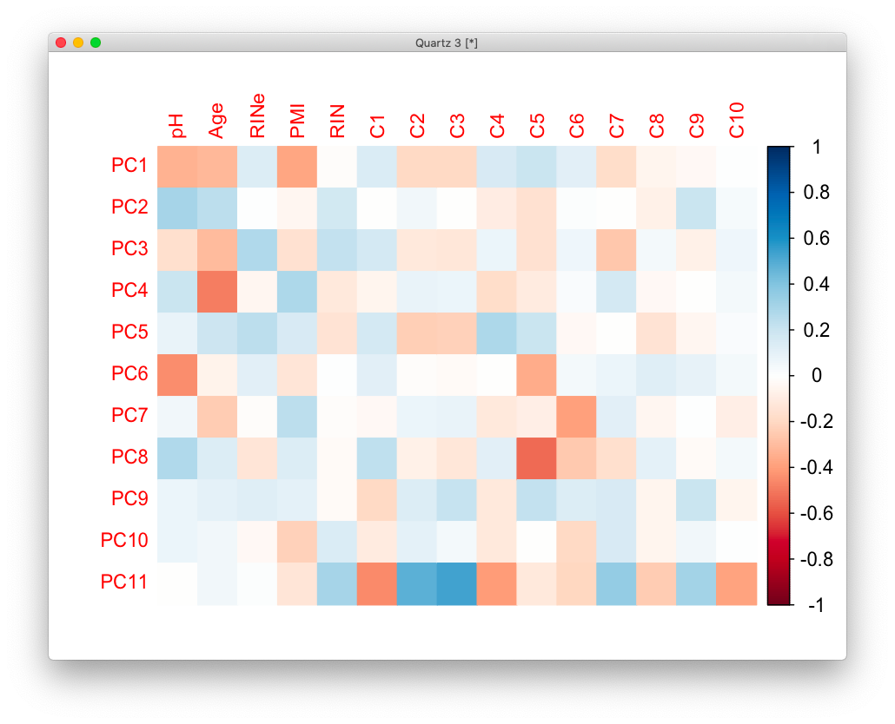
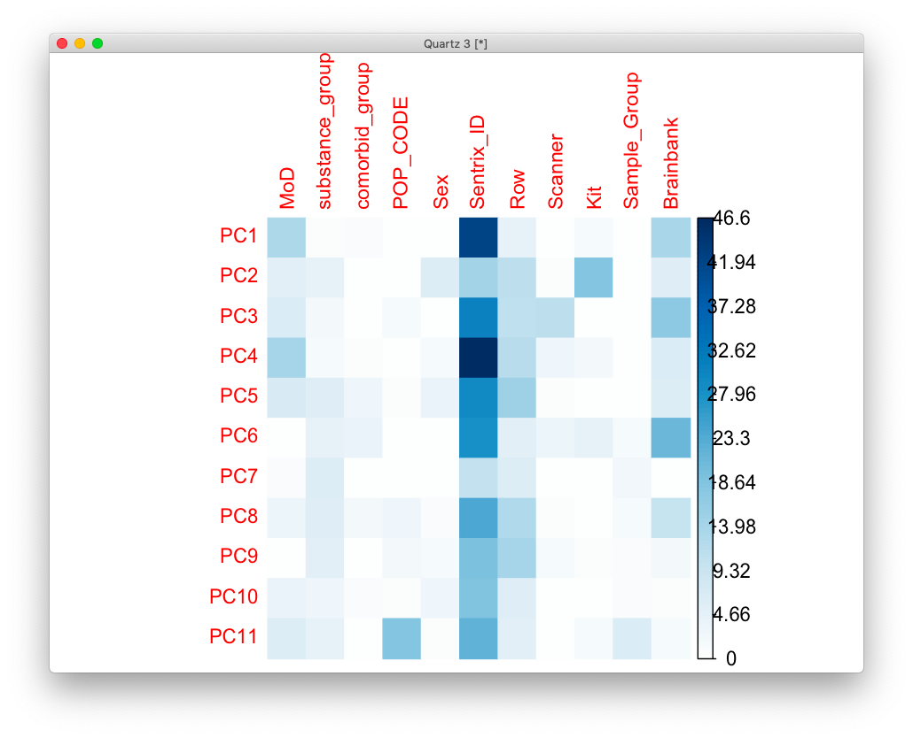

# 2020-11-02 17:38:39

I found an error in the analysis in note 134 in the sorting of the samples
matrix. So, let's re-run it here after fixing that.

```r
library(doParallel)
library(data.table)
library(ChAMP)
library(ChAMPdata)
library(ewastools)
library(MethylToSNP)
library(qqman)
library(EnhancedVolcano)
library(reshape2)
library(ggplot2)
library(ggpubr)
library(corrplot)
library(ggfortify)
library(ggbiplot)
library(stringr)
library(scales)
library(writexl)
library(limma)

registerDoParallel(cores = 3)

saveExcel<- function(v) {
    name <- deparse(substitute(v))
    writexl::write_xlsx(cbind(index=rownames(v), as.data.frame(v)),
                        paste0(name, ".xlsx"))
}

addalpha <- function(colors, alpha=1.0) {
  r <- col2rgb(colors, alpha=T)
  # Apply alpha
  r[4,] <- alpha*255
  r <- r/255.0
  return(rgb(r[1,], r[2,], r[3,], r[4,]))
}

rootDir <- "~/data/methylation_post_mortem"
rawDataDir <- paste(rootDir, '/Shaw_2019', sep="")
samplesFile <- paste(rootDir, '/samples.csv', sep="")

# disable scientific notation
options(scipen = 999)
samples <- read.csv(samplesFile)
samples$Sample_Group <- as.factor(as.character(samples$Diagnosis))
samples$Basename <- paste0(rawDataDir, '/',  samples$Sentrix_ID, '/',
                           samples$Sentrix_ID,'_',samples$Sentrix_Position)
samples$Sentrix_ID <- as.factor(samples$Sentrix_ID)
samples$Sample_Group <- as.factor(samples$Sample_Group)
samples$Row <- as.factor(substr(samples$Sentrix_Position, 1, 3))
samples$Scanner <- as.factor(samples$Scanner)
samples$Region <- as.factor(samples$Region)
samples$Sex <- as.factor(samples$Sex)
samples$Kit <- as.factor(samples$Kit)
samples$Sample_Plate <- as.factor(samples$Sample_Plate)

more = readRDS('~/data/rnaseq_derek/data_from_philip_POP_and_PCs.rds')
more = more[!duplicated(more$hbcc_brain_id),]
samples = merge(samples, more[, c('hbcc_brain_id', 'comorbid', 'comorbid_group',
                                  'substance', 'substance_group', 'C1', 'C2',
                                  'C3', 'C4', 'C5', 'C6', 'C7', 'C8', 'C9',
                                  'C10', 'POP_CODE')],
             by='hbcc_brain_id', all.x=T, all.y=F)
samples$POP_CODE = as.character(samples$POP_CODE)
samples[which(samples$POP_CODE=='WNH'), 'POP_CODE'] = 'W'
samples[which(samples$POP_CODE=='WH'), 'POP_CODE'] = 'W'
samples$POP_CODE = factor(samples$POP_CODE)
samples[which(samples$Manner.of.Death=='Suicide (probable)'),
        'Manner.of.Death'] = 'Suicide'
samples[which(samples$Manner.of.Death=='unknown'),
        'Manner.of.Death'] = 'natural'
samples$MoD = factor(samples$Manner.of.Death)

raw = read_idats(samples$Basename, quiet = FALSE)
raw$sample_names <- samples$Sample_Name
```

# 2020-11-03 06:03:33

Loading the samples took a few minutes, but it looks like it worked. Moving on
to QC:

```r
# checks control metrics according to https://support.illumina.com/content/dam/illumina-support/documents/documentation/chemistry_documentation/infinium_assays/infinium_hd_methylation/beadarray-controls-reporter-user-guide-1000000004009-00.pdf
ctrls = control_metrics(raw)
stripchart(ctrls$`Bisulfite Conversion I Green`, method="jitter", pch=4,
           xlab='Bisulfite Conversion I Green',xlim=c(0,10))
abline(v=1,col=2,lty=3)

stripchart(ctrls$`Bisulfite Conversion I Red`, method="jitter", pch=4,
           xlab='Bisulfite Conversion I Red',xlim=c(0,10))
abline(v=1,col=2,lty=3)

stripchart(ctrls$`Bisulfite Conversion II`, method="jitter", pch=4,
           xlab='Bisulfite Conversion II',xlim=c(0,10))
abline(v=1,col=2,lty=3)

failed.samples <- samples[sample_failure(ctrls),
                          c("Sample_Group", "Sentrix_ID")]
```



QC looks good, no failed samples. Checking sex:

```r
pheno = data.table(samples)
pheno$sex <- tolower(pheno$Sex)
pheno[, c("X","Y") := check_sex(raw)]
pheno[, predicted_sex := predict_sex(X, Y, which(sex=="m"), which(sex=="f"))]

tmp = pheno[predicted_sex==sex]
plot(Y ~ X, data=tmp, pch=ifelse(tmp$sex=="f",1,4), asp=1,
     xlab="Normalized X chromosome intensities",
     ylab="Normalized Y chromosome intensities")
tmp = pheno[predicted_sex!=sex]
```



There were no mismatches between predicted and declared sex.

Let's continue with preprocessing:

```r
#  Preprocess with normalize450k / ewastools that includes bg and dye corrections
meth = raw %>% detectionP %>% mask(0.01) %>% correct_dye_bias() %>% dont_normalize
# split filtered results between markers with rs in their name and without
colnames(meth) <- samples$Sample_Name
meth.rs <- meth[grep("rs", rownames(meth)),]
meth.nors <-meth[grep("rs", rownames(meth), invert=TRUE),]
# Filter probes: sex chr, SNP (general, EUR, AFR), CpG, Multi-hit
# apply typical champ filters, including common general SNPs
filtered <- champ.filter(beta=meth.nors, pd=samples, filterDetP = FALSE,
                         filterXY = TRUE, autoimpute=FALSE, filterNoCG = TRUE,
                         filterMultiHit = TRUE, filterBeads = FALSE,
                         fixOutlier=FALSE, arraytype="EPIC")
meth.filtered <- na.omit(filtered$beta)
```

We are now down to 647K markers, from the initial 865K. I'll skip checking the
QC control samples because Alex has already done it, and he didn't include them
in his samples spreadsheet. I'd have to reconstruct the sheet from the sample
sheet of each box to redo it. Not worth it if he has already confirmed that the
QC controls match...

So, let's get an idea about the data we're working with:

```r
table(samples$Sex)
table(samples$Diagnosis)
table(samples$Brainbank)
table(samples$MoD)
table(samples$Kit)
```

```
 F  M 
21 94 

   Case Control 
     51      64 

nimh_hbcc      pitt      umbn 
       50        19        46 

Accident Homicide  natural  Suicide 
      32       20       40       23 

Qiagen   Zymo 
    59     56 
```

Before we run the PCA analysis, let's split the data between ACC and Caudate.

```r
is.caudate <- samples$Region == 'Caudate'
is.outlier <- samples$Sample_Name == "1908_ACC"

samples.caudate <- samples[is.caudate, ]
samples.acc <- samples[!is.caudate & !is.outlier, ]

meth.caudate <- meth.filtered[, is.caudate]
meth.acc <- meth.filtered[, !is.caudate & !is.outlier]
```

Before I continue, I'll export the data Gauri will need for the clock:

```r
new_names = gsub(x=colnames(meth.acc), pattern='_ACC', replacement='')
colnames(meth.acc) = new_names
new_names = gsub(x=colnames(meth.caudate), pattern='_Caudate', replacement='')
colnames(meth.caudate) = new_names
saveRDS(meth.acc, file='~/data/methylation_post_mortem/acc_methyl_raw_11032020.rds')
saveRDS(meth.caudate, file='~/data/methylation_post_mortem/caudate_methyl_raw_11032020.rds')

ages = samples$Age
names(ages) = samples$Sample_Name
new_names = gsub(x=names(ages), pattern='_ACC', replacement='')
new_names = gsub(x=new_names, pattern='_Caudate', replacement='')
names(ages) = new_names
ages = ages[!duplicated(new_names)]
df = data.frame(IID=names(ages), age=ages)
write.csv(df, file='~/data/methylation_post_mortem/IID_age.csv', row.names=F)
```

Like in the RNAseq analysis, let's figure out how many PCs to use for ACC and
Caudate.

```r
# Stratified PCA
set.seed(42)
meth.caudate.pca <- prcomp(t(meth.caudate), scale.=TRUE)
meth.acc.pca <- prcomp(t(meth.acc), scale.=TRUE)

library(nFactors)
eigs <- meth.acc.pca$sdev^2
nS = nScree(x=eigs)
keep_me = 1:nS$Components$nkaiser
pcs.acc = data.frame(meth.acc.pca$x[, keep_me])

std_dev <- meth.acc.pca$sdev
pr_var <- std_dev^2
prop_varex <- pr_var/sum(pr_var)
plot(prop_varex, xlab = "Principal Component",
             ylab = "Proportion of Variance Explained",
             type = "b", main='ACC')


eigs <- meth.caudate.pca$sdev^2
nS = nScree(x=eigs)
keep_me = 1:nS$Components$nkaiser
pcs.caudate = data.frame(meth.caudate.pca$x[, keep_me])

std_dev <- meth.caudate.pca$sdev
pr_var <- std_dev^2
prop_varex <- pr_var/sum(pr_var)
plot(prop_varex, xlab = "Principal Component",
             ylab = "Proportion of Variance Explained",
             type = "b", main='Caudate')
```

We got 10 for ACC and 11 for Caudate.




Now let's make the same plots as the RNAseq analysis, but most importantly we
need to see which PCs are correlated with the data at a certain threshold. We
start with the ACC:

```r
num_vars = c('pH', 'Age', 'RINe', 'PMI', 'RIN',
             'C1', 'C2', 'C3', 'C4', 'C5', 'C6', 'C7', 'C8', 'C9', 'C10')
pc_vars = colnames(pcs.acc)
num_corrs = matrix(nrow=length(num_vars), ncol=length(pc_vars),
                   dimnames=list(num_vars, pc_vars))
num_pvals = num_corrs
for (x in num_vars) {
    for (y in pc_vars) {
        res = cor.test(samples.acc[, x], pcs.acc[, y])
        num_corrs[x, y] = res$estimate
        num_pvals[x, y] = res$p.value
    }
}

library(corrplot)
corrplot(t(num_corrs), method='color', tl.cex=1, cl.cex=1)
```



```r
categ_vars = c('MoD', 'substance_group',
               'comorbid_group', 'POP_CODE', 'Sex',
               "Sentrix_ID", "Row", "Scanner", "Kit", "Sample_Group",
               "Brainbank")
categ_corrs = matrix(nrow=length(categ_vars), ncol=length(pc_vars),
                   dimnames=list(categ_vars, pc_vars))
categ_pvals = categ_corrs
for (x in categ_vars) {
    for (y in pc_vars) {
        res = kruskal.test(pcs.acc[, y], samples.acc[, x])
        categ_corrs[x, y] = res$statistic
        categ_pvals[x, y] = res$p.value
    }
}
corrplot(t(categ_corrs), method='color', tl.cex=1, cl.cex=1, is.corr=F)
```



```
r$> which(num_pvals < .01, arr.ind = T)                                                                             
    row col
C6   11   1
pH    1   2
Age   2   2
PMI   4   2
pH    1   3
C5   10   3
C5   10   6
Age   2   8

r$> which(categ_pvals < .01, arr.ind = T)                                                                           
           row col
Sentrix_ID   6   1
Kit          9   1
Brainbank   11   1
Sentrix_ID   6   2
Scanner      8   3
Brainbank   11   3
Sentrix_ID   6   4
Kit          9   4
Sentrix_ID   6   5
Scanner      8   5
Sentrix_ID   6   6
Brainbank   11   7
Brainbank   11  10

r$> min(categ_pvals['Sample_Group',])                                                                               
[1] 0.0731767
```

So, for ACC we will remove PCs 1, 2, 3, 4, 5, 6, 7, 8, and 10. And the minimum p-value for
Sample_Group was .07, so we're good there. Let's check the Caudate:

```r
num_vars = c('pH', 'Age', 'RINe', 'PMI', 'RIN',
             'C1', 'C2', 'C3', 'C4', 'C5', 'C6', 'C7', 'C8', 'C9', 'C10')
pc_vars = colnames(pcs.caudate)
num_corrs = matrix(nrow=length(num_vars), ncol=length(pc_vars),
                   dimnames=list(num_vars, pc_vars))
num_pvals = num_corrs
for (x in num_vars) {
    for (y in pc_vars) {
        res = cor.test(samples.caudate[, x], pcs.caudate[, y])
        num_corrs[x, y] = res$estimate
        num_pvals[x, y] = res$p.value
    }
}
corrplot(t(num_corrs), method='color', tl.cex=1, cl.cex=1)
```



```r
categ_vars = c('MoD', 'substance_group',
               'comorbid_group', 'POP_CODE', 'Sex',
               "Sentrix_ID", "Row", "Scanner", "Kit", "Sample_Group",
               "Brainbank")
categ_corrs = matrix(nrow=length(categ_vars), ncol=length(pc_vars),
                   dimnames=list(categ_vars, pc_vars))
categ_pvals = categ_corrs
for (x in categ_vars) {
    for (y in pc_vars) {
        res = kruskal.test(pcs.caudate[, y], samples.caudate[, x])
        categ_corrs[x, y] = res$statistic
        categ_pvals[x, y] = res$p.value
    }
}
corrplot(t(categ_corrs), method='color', tl.cex=1, cl.cex=1, is.corr=F)
```



```
r$> which(num_pvals < .01, arr.ind = T)                                                                             
    row col
PMI   4   1
Age   2   4
pH    1   6
C5   10   6
C6   11   7
C5   10   8
C1    6  11
C2    7  11
C3    8  11
C4    9  11
C7   12  11
C10  15  11

r$> which(categ_pvals < .01, arr.ind = T)                                                                           
             row col
MoD            1   1
Sentrix_ID     6   1
Brainbank     11   1
Kit            9   2
Sentrix_ID     6   3
Scanner        8   3
Brainbank     11   3
MoD            1   4
Sentrix_ID     6   4
Sentrix_ID     6   5
Brainbank     11   6
Brainbank     11   8
POP_CODE       4  11
Sample_Group  10  11

r$> min(categ_pvals['Sample_Group',])                                                                               
[1] 0.009034045

r$> sort(categ_pvals['Sample_Group',])                                                                              
       PC11         PC7         PC6         PC8         PC9        PC10         PC2         PC3         PC5 
0.009034045 0.112324215 0.189177774 0.189177774 0.245910750 0.245910750 0.501726757 0.657938621 0.680173964 
        PC4         PC1 
0.771751373 0.818857797 
```

And for Caudate we will remove PCs 1, 2, 3, 4, 5, 6, 7, and 8. PC11 has a lot of
Diagnosis info in it, so I'll keep it.

Before we run the stats model, let's residualize the data to see if that makes
more sense in the epiclock:

```r
resids = meth.caudate
mydata = data.frame(cbind(t(meth.caudate), pcs.caudate))
library(MASS)
for (v in rownames(resids)) {
    fm_str = sprintf('%s ~ PC1 + PC2 + PC3 + PC4 + PC5 + PC6 + PC7 + PC8', v)
    res.lm <- lm(as.formula(fm_str), data = mydata, na.action=na.exclude)
    step <- stepAIC(res.lm, direction = "both", trace = F)
    resids[v, ] = residuals(step)
}
# this takes forever!
```

Now we do the actual statistical model:

```r
# Differential methylation for Caudate: M-values with limma model corrected for unwanted variance
# limma to predict DMP from M values
vars.caudate = cbind(samples.caudate, pcs.caudate)
var <- model.matrix(~ PC1 + PC2 + PC3 + PC4 + PC5 + PC6 + PC7 + PC8 + Sample_Group,
                    data=vars.caudate)
M <- logit2(meth.caudate) # convert beta to M:  log2(beta) - log2(1 - beta)
library(limma)
fit <- lmFit(M, var)
fit2 <- eBayes(fit, trend=TRUE, robust=TRUE)
probes.limma.caudate <- topTable(fit2, adjust="fdr",
                                 coef=colnames(var)[ncol(var)], num=Inf)
```

```
r$> head(probes.limma.caudate)                                                                                      
               logFC   AveExpr        t        P.Value adj.P.Val        B
cg12897947 0.4715399 -2.973068 5.298235 0.000002020613 0.6136304 2.777993
cg03109101 0.2707579 -3.148986 5.224376 0.000002644187 0.6136304 2.605534
cg02469347 0.2783378 -1.487961 5.193718 0.000002955567 0.6136304 2.534031
cg18073918 0.3646369  3.137141 5.125188 0.000003788017 0.6136304 2.374401
cg19812613 0.3091764  3.567016 5.042385 0.000005105687 0.6449798 2.181931
cg12301347 0.7439710 -1.948643 5.003469 0.000006434240 0.6449798 2.021067
```

And we do the same for ACC:

```r
vars.acc = cbind(samples.acc, pcs.acc)
var <- model.matrix(~ PC1 + PC2 + PC3 + PC4 + PC5 + PC6 + PC7 + PC8 + PC10 + Sample_Group,
                    data=vars.acc)
M <- logit2(meth.acc) # convert beta to M:  log2(beta) - log2(1 - beta)
fit <- lmFit(M, var)
fit2 <- eBayes(fit, trend=TRUE, robust=TRUE)
probes.limma.acc <- topTable(fit2, adjust="fdr",
                             coef=colnames(var)[ncol(var)], num=Inf)
```

```
r$> head(probes.limma.acc)                                                                                          
                logFC   AveExpr         t        P.Value adj.P.Val        B
cg24747572 -0.3614788  2.244890 -5.426898 0.000001567799 0.3859176 3.490813
cg00192275 -0.3989329  3.261132 -5.411428 0.000001656432 0.3859176 3.452604
cg13995516  0.3854365 -1.598190  5.292451 0.000002525499 0.3859176 3.158991
cg21713048  0.2716786  1.284599  5.262395 0.000002808476 0.3859176 3.084902
cg14313999  0.2752764  2.182664  5.151242 0.000004154202 0.3859176 2.811277
cg17044843 -0.2182841  1.730037 -5.148972 0.000004187458 0.3859176 2.805695
```

Again, nothing survives FDR, but not really surprising. 

At this point, let's save our results and then we can start investigating gene
set analysis.

```r
save(meth.acc, meth.caudate, pcs.acc, pcs.caudate, probes.limma.acc,
     probes.limma.caudate, samples.acc, samples.caudate,
     file='~/data/methylation_post_mortem/main_results_11032020.RData')
```

Now we need to attach some genes to all these probes, and since we're doing gene
set analysis, we should keep it only to the probes annotated with genes.

```r
data("probe.features.epic")
probes.limma.caudate.annotated <- merge(probes.limma.caudate, probe.features,
                                        by="row.names", sort=FALSE, all.x=TRUE)
probes.limma.acc.annotated <- merge(probes.limma.acc, probe.features,
                                    by="row.names", sort=FALSE, all.x=TRUE)
saveRDS(probes.limma.acc.annotated,
        file='~/data/methylation_post_mortem/acc_methyl_results_11032020.rds')
saveRDS(probes.limma.caudate.annotated,
        file='~/data/methylation_post_mortem/caudate_methyl_results_11032020.rds')
idx = probes.limma.acc.annotated$gene != ''
genes.acc = probes.limma.acc.annotated[idx, ]
idx = probes.limma.caudate.annotated$gene != ''
genes.caudate = probes.limma.caudate.annotated[idx, ]
```

Then we run our usual gene set analysis in BW. Once again, we'll use one value
per gene to create the ranked lists.

```bash
# bw
source /data/$USER/conda/etc/profile.d/conda.sh
conda activate radian
~/.local/bin/radian
```

In order to create similar lists for the methylation results, we'll need to use
a single value per gene:

```r
# bw
library(WebGestaltR)

data_dir = '~/data/methylation_post_mortem/'
ncpu=31

for (region in c('acc', 'caudate')) {
    res = readRDS(sprintf('%s/%s_methyl_results_11032020.rds', data_dir, region))
    idx = res$gene != ''
    genes = res[idx, ]

    imautosome = which(genes$CHR != 'X' &
                       genes$CHR != 'Y' &
                       genes$CHR != 'MT')
    genes = genes[imautosome, ]

    tmp = genes[, c('gene', 't')]
    tmp2 = c()
    # will do it this way because of the two tails of T distribution
    for (g in unique(tmp$gene)) {
        gene_data = tmp[tmp$gene==g, ]
        best_res = which.max(abs(gene_data$t))
        tmp2 = rbind(tmp2, gene_data[best_res, ])
    }
    for (db in c('geneontology_Biological_Process_noRedundant',
                    'geneontology_Cellular_Component_noRedundant',
                    'geneontology_Molecular_Function_noRedundant',
                    'pathway_KEGG', 'disease_Disgenet',
                    'phenotype_Human_Phenotype_Ontology',
                    'network_PPI_BIOGRID')) {
        cat(region, db, '\n')
        enrichResult <- WebGestaltR(enrichMethod="GSEA",
                                    organism="hsapiens",
                                    enrichDatabase=db,
                                    interestGene=tmp2,
                                    interestGeneType="genesymbol",
                                    sigMethod="top", topThr=10,
                                    minNum=5,
                                    isOutput=F, isParallel=T,
                                    nThreads=ncpu)
        out_fname = sprintf('%s/WG_%s_%s.csv', data_dir, region, db)
        write.csv(enrichResult, file=out_fname, quote=F,
                    row.names=F)
    }
    # my own GMTs
    for (db in c('disorders', sprintf('%s_developmental', region))) {
        cat(region, db, '\n')
        db_file = sprintf('~/data/post_mortem/%s.gmt', db)
        enrichResult <- WebGestaltR(enrichMethod="GSEA",
                                    organism="hsapiens",
                                    enrichDatabaseFile=db_file,
                                    enrichDatabaseType="genesymbol",
                                    interestGene=tmp2,
                                    interestGeneType="genesymbol",
                                    sigMethod="top", topThr=10,
                                    minNum=3,
                                    isOutput=F, isParallel=T,
                                    nThreads=ncpu)
        out_fname = sprintf('%s/WG_%s_%s_.csv', data_dir, region, db)
        write.csv(enrichResult, file=out_fname, quote=F,
                    row.names=F)
    }
}
```

Now let's explore some of the results:

```r
all_res = c()
files = list.files(path = '~/data/methylation_post_mortem/', pattern = '^WG*')
for (f in files) {
    cat(f, '\n')
    res = read.csv(sprintf('~/data/methylation_post_mortem/%s', f))
    res$fname = f
    # clean up a bit
    res = res[!is.na(res$FDR),]
    res = res[res$FDR>0,]
    all_res = rbind(all_res, res[, c('geneSet', 'link', 'FDR', 'fname')])
}
```

So, we have a few candidates for FDR < .05. That's good. I do want to re-run
everything using 10K permutations and creating the outputs just in case.

```bash
# bw
source /data/$USER/conda/etc/profile.d/conda.sh
conda activate radian
~/.local/bin/radian
```

```r
# bw
library(WebGestaltR)

data_dir = '~/data/methylation_post_mortem/'
ncpu=31

# region='acc'
region='caudate'
res = readRDS(sprintf('%s/%s_methyl_results_11032020.rds', data_dir, region))
idx = res$gene != ''
genes = res[idx, ]

imautosome = which(genes$CHR != 'X' &
                    genes$CHR != 'Y' &
                    genes$CHR != 'MT')
genes = genes[imautosome, ]

tmp = genes[, c('gene', 't')]
tmp2 = c()
# will do it this way because of the two tails of T distribution
for (g in unique(tmp$gene)) {
    gene_data = tmp[tmp$gene==g, ]
    best_res = which.max(abs(gene_data$t))
    tmp2 = rbind(tmp2, gene_data[best_res, ])
}
for (db in c('geneontology_Biological_Process_noRedundant',
                'geneontology_Cellular_Component_noRedundant',
                'geneontology_Molecular_Function_noRedundant',
                'pathway_KEGG', 'disease_Disgenet',
                'phenotype_Human_Phenotype_Ontology',
                'network_PPI_BIOGRID')) {
    cat(region, db, '\n')
    project_name = sprintf('%s_%s', region, db)
    enrichResult <- WebGestaltR(enrichMethod="GSEA",
                                organism="hsapiens",
                                enrichDatabase=db,
                                interestGene=tmp2,
                                interestGeneType="genesymbol",
                                sigMethod="top", topThr=150000,
                                outputDirectory = data_dir,
                                minNum=5, projectName=project_name,
                                isOutput=T, isParallel=T,
                                nThreads=ncpu, perNum=10000)
    out_fname = sprintf('%s/WG_%s_%s_10K.csv', data_dir, region, db)
    write.csv(enrichResult, file=out_fname, quote=F,
                row.names=F)
}
# my own GMTs
for (db in c('disorders', sprintf('%s_developmental', region))) {
    cat(region, db, '\n')
    project_name = sprintf('%s_%s', region, db)
    db_file = sprintf('~/data/post_mortem/%s.gmt', db)
    enrichResult <- WebGestaltR(enrichMethod="GSEA",
                                organism="hsapiens",
                                enrichDatabaseFile=db_file,
                                enrichDatabaseType="genesymbol",
                                interestGene=tmp2,
                                outputDirectory = data_dir,
                                interestGeneType="genesymbol",
                                sigMethod="top", topThr=150000,
                                minNum=3, projectName=project_name,
                                isOutput=T, isParallel=T,
                                nThreads=ncpu, perNum=10000)
    out_fname = sprintf('%s/WG_%s_%s_10K.csv', data_dir, region, db)
    write.csv(enrichResult, file=out_fname, quote=F,
                row.names=F)
}
```

Remember that I need to reduce the number of cpus to run the Human Phenotype
Ontology, otherwise it crashes. I've been using 5.

# 2020-11-08 16:43:18

Also run the redundant sets for a better comparisons to the camera results:

```r
for (db in c('geneontology_Biological_Process',
                'geneontology_Cellular_Component',
                'geneontology_Molecular_Function')) {
```

In fact, I can replicate what I did for camera and run each individual CGI:

```r
# bw
library(WebGestaltR)

data_dir = '~/data/methylation_post_mortem/'
ncpu=5

region='acc'
# region='caudate'
res = readRDS(sprintf('%s/%s_methyl_results_11032020.rds', data_dir, region))
idx = res$gene != ''
genes = res[idx, ]

imautosome = which(genes$CHR != 'X' &
                    genes$CHR != 'Y' &
                    genes$CHR != 'MT')
genes = genes[imautosome, ]

for (cgi in c("island", "opensea", "shelf", "shore")) {
    data <- res[res$cgi==cgi, ]
    idx = data$gene != ''
    tmp = data[idx, c('gene', 't')]
    tmp2 = c()
    # will do it this way because of the two tails of T distribution
    for (g in unique(tmp$gene)) {
        gene_data = tmp[tmp$gene==g, ]
        best_res = which.max(abs(gene_data$t))
        tmp2 = rbind(tmp2, gene_data[best_res, ])
    }
    for (db in c('geneontology_Biological_Process_noRedundant',
                    'geneontology_Cellular_Component_noRedundant',
                    'geneontology_Molecular_Function_noRedundant',
                    'pathway_KEGG', 'disease_Disgenet',
                    'phenotype_Human_Phenotype_Ontology',
                    'network_PPI_BIOGRID')) {
        cat(region, db, '\n')
        project_name = sprintf('%s_%s_%s', region, cgi, db)
        enrichResult <- WebGestaltR(enrichMethod="GSEA",
                                    organism="hsapiens",
                                    enrichDatabase=db,
                                    interestGene=tmp2,
                                    interestGeneType="genesymbol",
                                    sigMethod="top", topThr=150000,
                                    outputDirectory = data_dir,
                                    minNum=5, projectName=project_name,
                                    isOutput=T, isParallel=T,
                                    nThreads=ncpu, perNum=10000)
        out_fname = sprintf('%s/WG_%s_%s_%s_10K.csv', data_dir, region, cgi, db)
        write.csv(enrichResult, file=out_fname, quote=F,
                    row.names=F)
    }
    # my own GMTs
    for (db in c('disorders', sprintf('%s_developmental', region))) {
        cat(region, db, '\n')
        project_name = sprintf('%s_%s_%s', region, cgi, db)
        db_file = sprintf('~/data/post_mortem/%s.gmt', db)
        enrichResult <- WebGestaltR(enrichMethod="GSEA",
                                    organism="hsapiens",
                                    enrichDatabaseFile=db_file,
                                    enrichDatabaseType="genesymbol",
                                    interestGene=tmp2,
                                    outputDirectory = data_dir,
                                    interestGeneType="genesymbol",
                                    sigMethod="top", topThr=150000,
                                    minNum=3, projectName=project_name,
                                    isOutput=T, isParallel=T,
                                    nThreads=ncpu, perNum=10000)
        out_fname = sprintf('%s/WG_%s_%s_%s_10K.csv', data_dir, region, cgi, db)
        write.csv(enrichResult, file=out_fname, quote=F,
                    row.names=F)
    }
}
```

Exploding in memory... let's not do parallel:

```r
# bw
library(WebGestaltR)

data_dir = '~/data/methylation_post_mortem/'

region='acc'
# region='caudate'
res = readRDS(sprintf('%s/%s_methyl_results_11032020.rds', data_dir, region))
idx = res$gene != ''
genes = res[idx, ]

imautosome = which(genes$CHR != 'X' &
                    genes$CHR != 'Y' &
                    genes$CHR != 'MT')
genes = genes[imautosome, ]

tmp = genes[, c('gene', 't')]
tmp2 = c()
# will do it this way because of the two tails of T distribution
for (g in unique(tmp$gene)) {
    gene_data = tmp[tmp$gene==g, ]
    best_res = which.max(abs(gene_data$t))
    tmp2 = rbind(tmp2, gene_data[best_res, ])
}
for (db in c('geneontology_Cellular_Component',
             'geneontology_Molecular_Function',
             'geneontology_Biological_Process')) {
    cat(region, db, '\n')
    project_name = sprintf('%s_%s', region, db)
    enrichResult <- WebGestaltR(enrichMethod="GSEA",
                                organism="hsapiens",
                                enrichDatabase=db,
                                interestGene=tmp2,
                                interestGeneType="genesymbol",
                                sigMethod="top", topThr=150000,
                                outputDirectory = data_dir,
                                minNum=5, projectName=project_name,
                                isOutput=T, isParallel=F, perNum=10000)
    out_fname = sprintf('%s/WG_%s_%s_10K.csv', data_dir, region, db)
    write.csv(enrichResult, file=out_fname, quote=F,
                row.names=F)
}
```

```r
cgi='shelf'
data <- res[res$cgi==cgi, ]
idx = data$gene != ''
tmp = data[idx, c('gene', 't')]
tmp2 = c()
# will do it this way because of the two tails of T distribution
for (g in unique(tmp$gene)) {
    gene_data = tmp[tmp$gene==g, ]
    best_res = which.max(abs(gene_data$t))
    tmp2 = rbind(tmp2, gene_data[best_res, ])
}
for (db in c('disease_Disgenet',
                'phenotype_Human_Phenotype_Ontology',
                'network_PPI_BIOGRID')) {
    cat(region, db, '\n')
    project_name = sprintf('%s_%s_%s', region, cgi, db)
    enrichResult <- WebGestaltR(enrichMethod="GSEA",
                                organism="hsapiens",
                                enrichDatabase=db,
                                interestGene=tmp2,
                                interestGeneType="genesymbol",
                                sigMethod="top", topThr=150000,
                                outputDirectory = data_dir,
                                minNum=5, projectName=project_name,
                                isOutput=T, isParallel=T,
                                nThreads=ncpu, perNum=10000)
    out_fname = sprintf('%s/WG_%s_%s_%s_10K.csv', data_dir, region, cgi, db)
    write.csv(enrichResult, file=out_fname, quote=F,
                row.names=F)
}
# my own GMTs
for (db in c('disorders', sprintf('%s_developmental', region))) {
    cat(region, db, '\n')
    project_name = sprintf('%s_%s_%s', region, cgi, db)
    db_file = sprintf('~/data/post_mortem/%s.gmt', db)
    enrichResult <- WebGestaltR(enrichMethod="GSEA",
                                organism="hsapiens",
                                enrichDatabaseFile=db_file,
                                enrichDatabaseType="genesymbol",
                                interestGene=tmp2,
                                outputDirectory = data_dir,
                                interestGeneType="genesymbol",
                                sigMethod="top", topThr=150000,
                                minNum=3, projectName=project_name,
                                isOutput=T, isParallel=T,
                                nThreads=ncpu, perNum=10000)
    out_fname = sprintf('%s/WG_%s_%s_%s_10K.csv', data_dir, region, cgi, db)
    write.csv(enrichResult, file=out_fname, quote=F,
                row.names=F)
}
