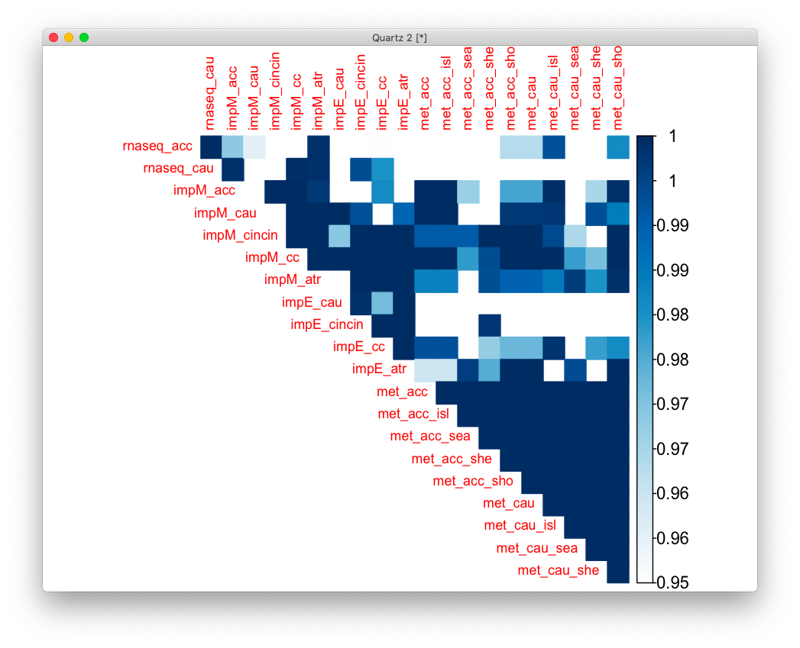
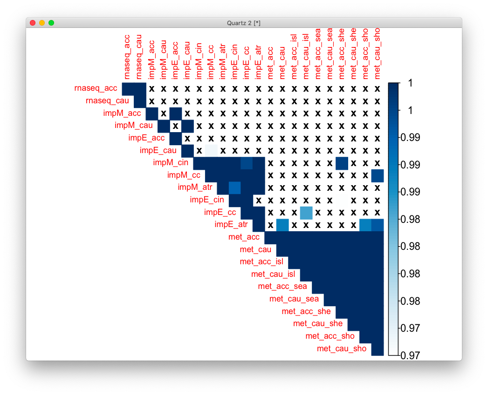

# 2020-11-03 19:38:45

Now that I have some imputation results, and new methyl results, let's go back
to the overrepresentation analysis. First, do the imputation results overlap
with the RNAseq results?

```r
data_dir = '~/data/expression_impute/'
md = 'MASHR'

clean_imp_res = function(res) {
    G_list0 = readRDS('~/data/rnaseq_derek/mart_rnaseq.rds')
    G_list <- G_list0[!is.na(G_list0$hgnc_symbol),]
    G_list = G_list[G_list$hgnc_symbol!='',]
    G_list <- G_list[!duplicated(G_list$ensembl_gene_id),]

    id_num = sapply(res$gene, function(x) strsplit(x=x, split='\\.')[[1]][1])
    dups = duplicated(id_num)
    id_num = id_num[!dups]
    res$id_num = id_num

    imnamed = res$id_num %in% G_list$ensembl_gene_id
    res = res[imnamed, ]
    G_list2 = merge(G_list, res, by.x='ensembl_gene_id', by.y='id_num')
    imautosome = which(G_list2$chromosome_name != 'X' &
                    G_list2$chromosome_name != 'Y' &
                    G_list2$chromosome_name != 'MT')
    G_list2 = G_list2[imautosome, ]
    return(G_list2[, c('hgnc_symbol', 'pvalue')])
}

phen = 'res_ACC_thickness'
res = read.table(sprintf('%s/assoc_%s_%s.txt', data_dir, md, phen), header=1)
res_acc_imp = clean_imp_res(res)
phen = 'res_Caudate_volume'
res = read.table(sprintf('%s/assoc_%s_%s.txt', data_dir, md, phen), header=1)
res_caudate_imp = clean_imp_res(res)
phen = 'res_fa_cin_cin'
res = read.table(sprintf('%s/assoc_%s_%s.txt', data_dir, md, phen), header=1)
res_cincin_imp = clean_imp_res(res)
phen = 'res_FA_cc'
res = read.table(sprintf('%s/assoc_%s_%s.txt', data_dir, md, phen), header=1)
res_cc_imp = clean_imp_res(res)
phen = 'res_fa_ATR'
res = read.table(sprintf('%s/assoc_%s_%s.txt', data_dir, md, phen), header=1)
res_atr_imp = clean_imp_res(res)
```

Now that we have hgnc for imputation and p-values, let's grab the same thing for
the RNAseq results.

```r
load('~/data/rnaseq_derek/xmodal_results_10152020.RData')
library(GeneOverlap)
t = .05
ra = rnaseq_acc[rnaseq_acc$P.Value < t, 'hgnc_symbol']
rc = rnaseq_caudate[rnaseq_caudate$P.Value < t, 'hgnc_symbol']
ia = res_acc_imp[res_acc_imp$pvalue < t, 'hgnc_symbol']
ic = res_caudate_imp[res_caudate_imp$pvalue < t, 'hgnc_symbol']
icin = res_cincin_imp[res_cincin_imp$pvalue < t, 'hgnc_symbol']
icc = res_cc_imp[res_cc_imp$pvalue < t, 'hgnc_symbol']
iatr = res_atr_imp[res_atr_imp$pvalue < t, 'hgnc_symbol']
gom.obj <- newGOM(list(rnaseq_acc=ra, rnaseq_caudate=rc, imp_acc=ia,
                       imp_caudate=ic, imp_cincin=icin, imp_cc=icc,
                       imp_atr=iatr), , spec='hg19.gene')
getMatrix(gom.obj, name='pval')
```

```
                                  rnaseq_caudate     imp_acc imp_caudate     imp_cincin
rnaseq_acc     0.0000000000000000000000006440123 0.031106850  0.04388688 0.147468000176
rnaseq_caudate 1.0000000000000000000000000000000 0.001076264  0.78507449 0.182642209380
imp_acc        1.0000000000000000000000000000000 1.000000000  0.08241346 0.000004337019
imp_caudate    1.0000000000000000000000000000000 1.000000000  1.00000000 0.079242910482
imp_cincin     1.0000000000000000000000000000000 1.000000000  1.00000000 1.000000000000
imp_cc         1.0000000000000000000000000000000 1.000000000  1.00000000 1.000000000000
                                                                                        imp_cc
rnaseq_acc     0.33190707425639187633237270347308367490768432617187500000000000000000000000000
rnaseq_caudate 0.00071905751712048396329102217805484542623162269592285156250000000000000000000
imp_acc        0.00000442340390956567524650706185740389742022671271115541458129882812500000000
imp_caudate    0.00034323415039390559521867429815245031932136043906211853027343750000000000000
imp_cincin     0.00000000000000000000000000000000000000000000000000000000000000000000004498816
imp_cc         1.00000000000000000000000000000000000000000000000000000000000000000000000000000
                                                      imp_atr
rnaseq_acc     0.00116127558973589924476432777566969889448956
rnaseq_caudate 0.00136001566857726213788382096936402376741171
imp_acc        0.00276460879936775514448266122258246468845755
imp_caudate    0.00036225369932692475438348878036265432456275
imp_cincin     0.00000000000000000000005099693153116958824231
imp_cc         0.00000000000000000000000000000000000000913403
```

There seems to be a significant overlap when I'm very generous at nominal p of
.05. If I start going down, and I can go down to .005, I get within modality
results, but not across (i.e not between imputation and rnaseq).

Let me see if the elastic net results are any better. Also, I'll include the
methylation results and their slices:

```r
md = 'EN'
phen = 'res_ACC_thickness'
res = read.table(sprintf('%s/assoc_%s_%s.txt', data_dir, md, phen), header=1)
res2_acc_imp = clean_imp_res(res)
phen = 'res_Caudate_volume'
res = read.table(sprintf('%s/assoc_%s_%s.txt', data_dir, md, phen), header=1)
res2_caudate_imp = clean_imp_res(res)
phen = 'res_fa_cin_cin'
res = read.table(sprintf('%s/assoc_%s_%s.txt', data_dir, md, phen), header=1)
res2_cincin_imp = clean_imp_res(res)
phen = 'res_FA_cc'
res = read.table(sprintf('%s/assoc_%s_%s.txt', data_dir, md, phen), header=1)
res2_cc_imp = clean_imp_res(res)
phen = 'res_fa_ATR'
res = read.table(sprintf('%s/assoc_%s_%s.txt', data_dir, md, phen), header=1)
res2_atr_imp = clean_imp_res(res)
```

```r
data_dir = '~/data/methylation_post_mortem/'
for (m in c("acc", "caudate")){
    fname = sprintf('%s/%s_methyl_results_11032020.rds', data_dir, m)
    df <- readRDS(fname)
    #code from Gustavo's rank list example:
    idx = data$gene != ''
    tmp = data[idx, c('gene', 'P.Value')]
    tmp2 = c()
    for (g in unique(tmp$gene)) {
        gene_data = tmp[tmp$gene==g, ]
        best_res = which.min(abs(gene_data$P.Value))
        tmp2 = rbind(tmp2, gene_data[best_res, ])
    }
    # just to conform with imp and rna structures
    colnames(tmp2) = c('hgnc_symbol', 'pvalue')
    eval(parse(text=sprintf('res_%s_methyl = tmp2', m)))

    for (r in c("island", "opensea", "shelf", "shore")) {
        cat(m, r, '\n')
        #subset df based on cgi levels
        data <- df[df$cgi==r, ]
    
        #code from Gustavo's rank list example:
        idx = data$gene != ''
        tmp = data[idx, c('gene', 'P.Value')]
        tmp2 = c()
        for (g in unique(tmp$gene)) {
            gene_data = tmp[tmp$gene==g, ]
            best_res = which.min(gene_data$P.Value)
            tmp2 = rbind(tmp2, gene_data[best_res, ])
        }
        # just to conform with imp and rna structures
        colnames(tmp2) = c('hgnc_symbol', 'pvalue')
        eval(parse(text=sprintf('res_%s_%s_methyl = tmp2', m, r)))
    }
}
```

# 2020-11-04 06:11:00

I saved thoses slices in
~/data/methylation_post_mortem/sliced_results_11042020.RData because they took a
while to generate. 

Now it's just a matter of constructing the big matrix.

```r
t = .05
ra = rnaseq_acc[rnaseq_acc$P.Value < t, 'hgnc_symbol']
rc = rnaseq_caudate[rnaseq_caudate$P.Value < t, 'hgnc_symbol']

ia = res_acc_imp[res_acc_imp$pvalue < t, 'hgnc_symbol']
ic = res_caudate_imp[res_caudate_imp$pvalue < t, 'hgnc_symbol']
icin = res_cincin_imp[res_cincin_imp$pvalue < t, 'hgnc_symbol']
icc = res_cc_imp[res_cc_imp$pvalue < t, 'hgnc_symbol']
iatr = res_atr_imp[res_atr_imp$pvalue < t, 'hgnc_symbol']

ia2 = res2_acc_imp[res2_acc_imp$pvalue < t, 'hgnc_symbol']
ic2 = res2_caudate_imp[res2_caudate_imp$pvalue < t, 'hgnc_symbol']
icin2 = res2_cincin_imp[res2_cincin_imp$pvalue < t, 'hgnc_symbol']
icc2 = res2_cc_imp[res2_cc_imp$pvalue < t, 'hgnc_symbol']
iatr2 = res2_atr_imp[res2_atr_imp$pvalue < t, 'hgnc_symbol']

ma = res_acc_methyl[res_acc_methyl$pvalue < t, 'hgnc_symbol']
mc = res_caudate_methyl[res_caudate_methyl$pvalue < t, 'hgnc_symbol']
mai = res_acc_island_methyl[res_acc_island_methyl$pvalue < t, 'hgnc_symbol']
mao = res_acc_opensea_methyl[res_acc_opensea_methyl$pvalue < t, 'hgnc_symbol']
mase = res_acc_shelf_methyl[res_acc_shelf_methyl$pvalue < t, 'hgnc_symbol']
maso = res_acc_shore_methyl[res_acc_shore_methyl$pvalue < t, 'hgnc_symbol']
mci = res_caudate_island_methyl[res_caudate_island_methyl$pvalue < t, 'hgnc_symbol']
mco = res_caudate_opensea_methyl[res_caudate_opensea_methyl$pvalue < t, 'hgnc_symbol']
mcse = res_caudate_shelf_methyl[res_caudate_shelf_methyl$pvalue < t, 'hgnc_symbol']
mcso = res_caudate_shore_methyl[res_caudate_shore_methyl$pvalue < t, 'hgnc_symbol']

gom.obj <- newGOM(list(rnaseq_acc=ra, rnaseq_cau=rc, impM_acc=ia,
                       impM_cau=ic, impM_cincin=icin, impM_cc=icc,
                       impM_atr=iatr, impE_cau=ic2, impE_cincin=icin2,
                       impE_cc=icc2, impE_atr=iatr2, met_acc=ma,
                       met_acc_isl=mai, met_acc_sea=mao, met_acc_she=mase,
                       met_acc_sho=maso, met_cau=mc, met_cau_isl=mci,
                       met_cau_sea=mco, met_cau_she=mcse, met_cau_sho=mcso),
                       spec='hg19.gene')
a = getMatrix(gom.obj, name='pval')
```

Now let's plot it to see if we can find patterns:

```r
library(corrplot)
quartz()
# quick hack to force the color scale
b = 1-a
b[b<.95] = NA
corrplot(b, method='color', tl.cex=.8, cl.cex=1, type='upper', is.corr=F, na.label=' ')
# corrplot(b, method='color', tl.cex=.8, cl.cex=1, type='upper', is.corr=F,
#          p.mat=a, sig.level=.05, insig='blank')
```



It looks like the impM results do better than impE, so that's an answer. And
there are very strong overlaps among the methylation results.

## Own universe

It might not necessarily be fair to use hg19 as the universe, because some times
not all genes are present (e.g. imputation). So, we'll need to create our own
universe depending on the two sets being compared.

```r
res_rnaseq_acc = rnaseq_acc[, c('hgnc_symbol', 'P.Value')]
res_rnaseq_caudate = rnaseq_caudate[, c('hgnc_symbol', 'P.Value')]
colnames(res_rnaseq_acc)[2] = 'pvalue'
colnames(res_rnaseq_caudate)[2] = 'pvalue'
res_var = c('res_rnaseq_acc', 'res_rnaseq_caudate',
            'res_acc_imp', 'res_caudate_imp',
            'res2_acc_imp', 'res2_caudate_imp',
            'res_cincin_imp', 'res_cc_imp', 'res_atr_imp',
            'res2_cincin_imp', 'res2_cc_imp', 'res2_atr_imp',
            'res_acc_methyl', 'res_caudate_methyl',
            'res_acc_island_methyl', 'res_caudate_island_methyl',
            'res_acc_opensea_methyl', 'res_caudate_opensea_methyl',
            'res_acc_shelf_methyl', 'res_caudate_shelf_methyl',
            'res_acc_shore_methyl', 'res_caudate_shore_methyl')
res_str = c('rnaseq_acc', 'rnaseq_cau',
            'impM_acc', 'impM_cau',
            'impE_acc', 'impE_cau',
            'impM_cin', 'impM_cc', 'impM_atr',
            'impE_cin', 'impE_cc', 'impE_atr',
            'met_acc', 'met_cau',
            'met_acc_isl', 'met_cau_isl',
            'met_acc_sea', 'met_cau_sea',
            'met_acc_she', 'met_cau_she',
            'met_acc_sho', 'met_cau_sho')
thres=.05
pvals = matrix(nrow=length(res_var), ncol=length(res_var),
               dimnames=list(res_str, res_str))
for (i in 1:length(res_var)) {
    for (j in 1:length(res_var)) {
        cat(res_var[i], res_var[j], '\n')
        eval(parse(text=sprintf('res1 = eval(parse(text=res_var[i]))')))
        eval(parse(text=sprintf('res2 = eval(parse(text=res_var[j]))')))
        uni = intersect(res1$hgnc_symbol, res2$hgnc_symbol)
        # only evaluate genes in both sets
        res1 = res1[res1$hgnc_symbol %in% uni, ]
        res2 = res2[res2$hgnc_symbol %in% uni, ]

        go.obj <- newGeneOverlap(res1$hgnc_symbol[res1$pvalue < thres],
                                 res2$hgnc_symbol[res2$pvalue < thres],
                                 genome.size=length(uni))
        go.obj <- testGeneOverlap(go.obj)
        pvals[res_str[i], res_str[j]] = getPval(go.obj)
    }
}

b = 1-pvals
b[b<.95] = NA
corrplot(b, method='color', tl.cex=.8, cl.cex=1, type='upper', is.corr=F, na.label='x')
```



Yep, this looks a lot more realistic. But is it fair though? Probably more fair
than hg19...

EN imputation does better for atr, with good overlaps for met_cau, likely driven
by the shore probes, and we also get a hit for acc shore. EN for cc also has
some overlap with caudate islands, but that's more weird. MASHR imputation for
atr didn't have anything across modalities, and for CC has a weird one for
caudate shore. The more interesting one is for cin-cin, which goes to acc shelf
probes. Everything else is just inter-modality. They're still interesting to
explore, but I wonder if we wouldn't get a more clear path if doing a similar
analysis on the gene sets?

```r
files = list.files(path = '~/data/methylation_post_mortem/', pattern = '^WG*')
for (f in files) {
    cat(f, '\n')
    res = read.csv(sprintf('~/data/methylation_post_mortem/%s', f))
    res$fname = f
    # clean up a bit
    res = res[!is.na(res$FDR),]
    res = res[res$FDR>0,]
    all_res = rbind(all_res, res[, c('geneSet', 'link', 'FDR', 'fname')])
}
```

It won't work because I se tthe top to 10 :( Have to re-run everything...

# 2020-11-09 06:11:43

Let's create the same sumary tables we did for camera (144), but this time for
WG. The redundant sets are still running though.

```r
gs = c('geneontology_Biological_Process_noRedundant',
            'geneontology_Cellular_Component_noRedundant',
            'geneontology_Molecular_Function_noRedundant',
            'pathway_KEGG', 'disease_Disgenet',
            'phenotype_Human_Phenotype_Ontology',
            'network_PPI_BIOGRID', 'disorders')
thresh = .1
all_res = c()
for (db in gs) {
    db_res = c()
    mydir = '~/data/rnaseq_derek'
    res_var = c()
    for (r in c('acc', 'caudate')) {
        res = read.csv(sprintf('%s/WG_%s_%s_10K.csv', mydir, r, db))
        db_res = c(db_res, sum(res$FDR < thresh, na.rm=T))
        eval(parse(text=sprintf('res_var = c(res_var, "res_rnaseq_%s")', r)))
    }
    mydir = '~/data/expression_impute'
    for (md in c('MASHR', 'EN')) {
        for (sc in c('effect', 'zscore')) {
            for (r in c('res_ACC_thickness', 'res_fa_cin_cin', 'res_FA_cc',
                        'res_Caudate_volume', 'res_fa_ATR')) {
                res = read.csv(sprintf('%s/WG_%s_%s_%s_%s_10K.csv', mydir, md, sc, r, db))
                db_res = c(db_res, sum(res$FDR < thresh, na.rm=T))
                eval(parse(text=sprintf('res_var = c(res_var, "res_%s_%s_%s")',
                                        md, sc, r)))
            }
        }
    }
    mydir = '~/data/methylation_post_mortem'
    for (r in c('acc', 'caudate')) {
        res = read.csv(sprintf('%s/WG_%s_%s_10K.csv', mydir, r, db))
        db_res = c(db_res, sum(res$FDR < thresh, na.rm=T))
        eval(parse(text=sprintf('res_var = c(res_var, "res_methyl_%s")', r)))
        for (cgi in c("island", "opensea", "shelf", "shore")) {
            res = read.csv(sprintf('%s/camera_%s_%s_%s.csv', mydir, r, cgi, db))
            db_res = c(db_res, sum(res$FDR < thresh, na.rm=T))
            eval(parse(text=sprintf('res_var = c(res_var, "res_methyl_%s_%s")', r, cgi)))
        }
    }
    all_res = rbind(all_res, db_res)
}
colnames(all_res) = res_var
rownames(all_res) = gs
write.csv(t(all_res), file='~/data/post_mortem/camera_geneset_summary_FDRp05.csv')
```

# 2020-11-09 20:10:33

Let's explore a bit more the genes that overlap in the RNAseq analysis:

```r
load('~/data/rnaseq_derek/xmodal_results_10152020.RData')
library(GeneOverlap)
t = .005
ra = rnaseq_acc[rnaseq_acc$P.Value < t, 'hgnc_symbol']
rc = rnaseq_caudate[rnaseq_caudate$P.Value < t, 'hgnc_symbol']
gom.obj <- newGeneOverlap(ra, rc, spec='hg19.gene')
testGeneOverlap(gom.obj)
```

```
r$> testGeneOverlap(gom.obj)                                                                                                 
GeneOverlap object:
listA size=165
listB size=117
Intersection size=10
Overlapping p-value=5.8e-09
Jaccard Index=0.0

r$> intersect(ra, rc)                                                                                                        
 [1] "TAMM41"       "SMN2"         "ZNF514"       "TBC1D3L"      "HILPDA"       "CLUL1"        "ZNF695"       "VN1R20P"     
 [9] "PARP2"        "STX16-NPEPL1"
```

Sent those to Gauri to see if there is anything interesting there.

# TODO
 * maybe other gene sets, like the original (not noRedundant) GOs?