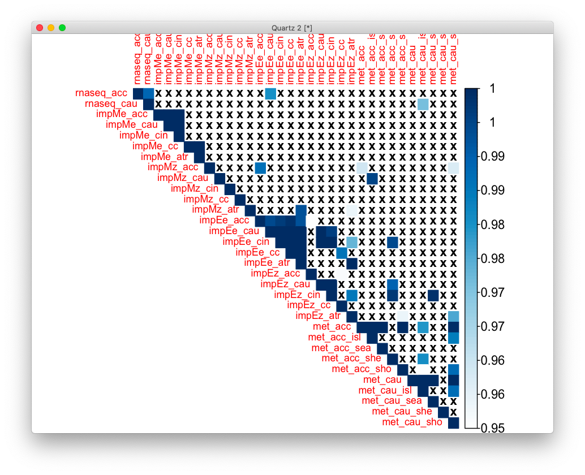

# 2020-11-05 07:19:41

Let me see if the results change much with using cameraPR instead of WebGestalt.

```r
library(limma)
library(WebGestaltR)  # for readGmt()

get_enrich_order2 = function( res, gene_sets ){
  if( !is.null(res$z.std) ){
    stat = res$z.std
  }else if( !is.null(res$F.std) ){
    stat = res$F.std
  }else if( !is.null(res$t) ){
    stat = res$t
  }else{
    stat = res$F
  }
  names(stat) = res$hgnc_symbol
  stat = stat[!is.na(names(stat))]
  index = ids2indices(gene_sets, names(stat))
  cameraPR( stat, index )
}

data_dir = '~/data/rnaseq_derek/'
load(sprintf('%s/xmodal_results_10152020.RData', data_dir))

# region='acc'
region='caudate'
eval(parse(text=sprintf('res = rnaseq_%s', region)))

tmp2 = res[, c('hgnc_symbol', 't')]
for (db in c('geneontology_Biological_Process_noRedundant',
                'geneontology_Cellular_Component_noRedundant',
                'geneontology_Molecular_Function_noRedundant',
                'pathway_KEGG', 'disease_Disgenet',
                'phenotype_Human_Phenotype_Ontology',
                'network_PPI_BIOGRID')) {
    cat(region, db, '\n')
    # assigning hgnc to our gene set lists
    gs = loadGeneSet(enrichDatabase=db)
    gmt = gs$geneSet
    a = idMapping(inputGene=gmt$gene, sourceIdType='entrezgene',
                  targetIdType='genesymbol')
    gmt2 = merge(gmt, a$mapped[, c('userId', 'geneSymbol')], by.x = 'gene',
                 by.y='userId', all.x=F, all.y=F)
    # and convert it to lists
    mylist = list()
    for (s in unique(gmt2$geneSet)) {
        mylist[[s]] = unique(gmt2$geneSymbol[gmt2$geneSet==s])
    }
    res_camera = get_enrich_order2( tmp2, mylist )
    if (is.null(gs$geneSetDes)) {
        # PPI doesn't have descriptions
        m = cbind(rownames(res_camera), res_camera, NA)
        colnames(m)[1] = 'Row.names'
        colnames(m)[ncol(m)] = 'description'
    } else {
        # attach gene set description
        m = merge(res_camera, gs$geneSetDes, by.x=0, by.y=1)
        m = m[order(m$PValue), ]
        m$description = gsub(x=m$description, pattern=',', replacement=';')
    }
    out_fname = sprintf('%s/camera_%s_%s.csv', data_dir, region, db)
    write.csv(m, file=out_fname, quote=F, row.names=F)
}
# my own GMTs
for (db in c('disorders', sprintf('%s_developmental', region))) {
    cat(region, db, '\n')
    db_file = sprintf('~/data/post_mortem/%s.gmt', db)
    gmt = readGmt(db_file) # already in gene symbols
    # and convert it to lists
    mylist = list()
    for (s in unique(gmt$geneSet)) {
        mylist[[s]] = unique(gmt$gene[gmt$geneSet==s])
    }
    res_camera = get_enrich_order2( tmp2, mylist )
    # some massaging to look like the other results
    desc = gmt[, c(1,2)]
    desc = desc[!duplicated(desc$geneSet), ]
    m = merge(res_camera, desc, by.x=0, by.y=1)
    m = m[order(m$PValue), ]
    out_fname = sprintf('%s/camera_%s_%s.csv', data_dir, region, db)
    write.csv(m, file=out_fname, quote=F, row.names=F)
}
```

Now we do the same thing for methylation:

```r
data_dir = '~/data/methylation_post_mortem/'

region='acc'
# region='caudate'
res = readRDS(sprintf('%s/%s_methyl_results_11032020.rds', data_dir, region))
idx = res$gene != ''
genes = res[idx, ]

imautosome = which(genes$CHR != 'X' &
                    genes$CHR != 'Y' &
                    genes$CHR != 'MT')
genes = genes[imautosome, ]

tmp = genes[, c('gene', 't')]
tmp2 = c()
# will do it this way because of the two tails of T distribution
for (g in unique(tmp$gene)) {
    gene_data = tmp[tmp$gene==g, ]
    best_res = which.max(abs(gene_data$t))
    tmp2 = rbind(tmp2, gene_data[best_res, ])
}
colnames(tmp2)[1] = 'hgnc_symbol'
for (db in c('geneontology_Biological_Process_noRedundant',
                'geneontology_Cellular_Component_noRedundant',
                'geneontology_Molecular_Function_noRedundant',
                'pathway_KEGG', 'disease_Disgenet',
                'phenotype_Human_Phenotype_Ontology',
                'network_PPI_BIOGRID')) {
    cat(region, db, '\n')
    # assigning hgnc to our gene set lists
    gs = loadGeneSet(enrichDatabase=db)
    gmt = gs$geneSet
    a = idMapping(inputGene=gmt$gene, sourceIdType='entrezgene',
                  targetIdType='genesymbol')
    gmt2 = merge(gmt, a$mapped[, c('userId', 'geneSymbol')], by.x = 'gene',
                 by.y='userId', all.x=F, all.y=F)
    # and convert it to lists
    mylist = list()
    for (s in unique(gmt2$geneSet)) {
        mylist[[s]] = unique(gmt2$geneSymbol[gmt2$geneSet==s])
    }
    res_camera = get_enrich_order2( tmp2, mylist )
    if (is.null(gs$geneSetDes)) {
        # PPI doesn't have descriptions
        m = cbind(rownames(res_camera), res_camera, NA)
        colnames(m)[1] = 'Row.names'
        colnames(m)[ncol(m)] = 'description'
    } else {
        # attach gene set description
        m = merge(res_camera, gs$geneSetDes, by.x=0, by.y=1)
        m = m[order(m$PValue), ]
        m$description = gsub(x=m$description, pattern=',', replacement=';')
    }
    out_fname = sprintf('%s/camera_%s_%s.csv', data_dir, region, db)
    write.csv(m, file=out_fname, quote=F, row.names=F)
}
# my own GMTs
for (db in c('disorders', sprintf('%s_developmental', region))) {
    cat(region, db, '\n')
    db_file = sprintf('~/data/post_mortem/%s.gmt', db)
    gmt = readGmt(db_file) # already in gene symbols
    # and convert it to lists
    mylist = list()
    for (s in unique(gmt$geneSet)) {
        mylist[[s]] = unique(gmt$gene[gmt$geneSet==s])
    }
    res_camera = get_enrich_order2( tmp2, mylist )
    # some massaging to look like the other results
    desc = gmt[, c(1,2)]
    desc = desc[!duplicated(desc$geneSet), ]
    m = merge(res_camera, desc, by.x=0, by.y=1)
    m = m[order(m$PValue), ]
    out_fname = sprintf('%s/camera_%s_%s.csv', data_dir, region, db)
    write.csv(m, file=out_fname, quote=F, row.names=F)
}
```

That actually ran quite fast. I might as well split between CGIs here:

```r
region='acc'
# region='caudate'
res = readRDS(sprintf('%s/%s_methyl_results_11032020.rds', data_dir, region))
idx = res$gene != ''
genes = res[idx, ]

imautosome = which(genes$CHR != 'X' &
                    genes$CHR != 'Y' &
                    genes$CHR != 'MT')
genes = genes[imautosome, ]

for (cgi in c("island", "opensea", "shelf", "shore")) {
    data <- res[res$cgi==cgi, ]
    idx = data$gene != ''
    tmp = data[idx, c('gene', 't')]
    tmp2 = c()
    for (g in unique(tmp$gene)) {
        gene_data = tmp[tmp$gene==g, ]
        best_res = which.max(abs(gene_data$t))
        tmp2 = rbind(tmp2, gene_data[best_res, ])
    }
    colnames(tmp2) = c('hgnc_symbol', 't')
    for (db in c('geneontology_Biological_Process_noRedundant',
                'geneontology_Cellular_Component_noRedundant',
                'geneontology_Molecular_Function_noRedundant',
                'pathway_KEGG', 'disease_Disgenet',
                'phenotype_Human_Phenotype_Ontology',
                'network_PPI_BIOGRID')) {
        cat(region, cgi, db, '\n')
        # assigning hgnc to our gene set lists
        gs = loadGeneSet(enrichDatabase=db)
        gmt = gs$geneSet
        a = idMapping(inputGene=gmt$gene, sourceIdType='entrezgene',
                    targetIdType='genesymbol')
        gmt2 = merge(gmt, a$mapped[, c('userId', 'geneSymbol')], by.x = 'gene',
                    by.y='userId', all.x=F, all.y=F)
        # and convert it to lists
        mylist = list()
        for (s in unique(gmt2$geneSet)) {
            mylist[[s]] = unique(gmt2$geneSymbol[gmt2$geneSet==s])
        }
        res_camera = get_enrich_order2( tmp2, mylist )
        if (is.null(gs$geneSetDes)) {
            # PPI doesn't have descriptions
            m = cbind(rownames(res_camera), res_camera, NA)
            colnames(m)[1] = 'Row.names'
            colnames(m)[ncol(m)] = 'description'
        } else {
            # attach gene set description
            m = merge(res_camera, gs$geneSetDes, by.x=0, by.y=1)
            m = m[order(m$PValue), ]
            m$description = gsub(x=m$description, pattern=',', replacement=';')
        }
        out_fname = sprintf('%s/camera_%s_%s_%s.csv', data_dir, region, cgi, db)
        write.csv(m, file=out_fname, quote=F, row.names=F)
    }
    # my own GMTs
    for (db in c('disorders', sprintf('%s_developmental', region))) {
        cat(region, cgi, db, '\n')
        db_file = sprintf('~/data/post_mortem/%s.gmt', db)
        gmt = readGmt(db_file) # already in gene symbols
        # and convert it to lists
        mylist = list()
        for (s in unique(gmt$geneSet)) {
            mylist[[s]] = unique(gmt$gene[gmt$geneSet==s])
        }
        res_camera = get_enrich_order2( tmp2, mylist )
        # some massaging to look like the other results
        desc = gmt[, c(1,2)]
        desc = desc[!duplicated(desc$geneSet), ]
        m = merge(res_camera, desc, by.x=0, by.y=1)
        m = m[order(m$PValue), ]
        out_fname = sprintf('%s/camera_%s_%s_%s.csv', data_dir, region, cgi, db)
        write.csv(m, file=out_fname, quote=F, row.names=F)
    }
}
```

And finally we run the same stuff for imputation:

```r
data_dir = '~/data/expression_impute/'
phenotypes = list(ACC=c('res_ACC_thickness', 'res_fa_cin_cin', 'res_FA_cc'),
                  caudate=c('res_Caudate_volume', 'res_fa_ATR'))
G_list0 = readRDS('~/data/rnaseq_derek/mart_rnaseq.rds')
G_list <- G_list0[!is.na(G_list0$hgnc_symbol),]
G_list = G_list[G_list$hgnc_symbol!='',]
G_list <- G_list[!duplicated(G_list$ensembl_gene_id),]

for (md in c('EN', 'MASHR')) {
     for (region in c('ACC', 'caudate')) {
         for (phen in phenotypes[[region]]) {
             res = read.table(sprintf('%s/assoc_%s_%s.txt', data_dir, md, phen),
                              header=1)
             id_num = sapply(res$gene, function(x) strsplit(x=x, split='\\.')[[1]][1])
             dups = duplicated(id_num)
             id_num = id_num[!dups]
             res$id_num = id_num

             imnamed = res$id_num %in% G_list$ensembl_gene_id
             res = res[imnamed, ]
             G_list2 = merge(G_list, res, by.x='ensembl_gene_id', by.y='id_num')
             imautosome = which(G_list2$chromosome_name != 'X' &
                               G_list2$chromosome_name != 'Y' &
                               G_list2$chromosome_name != 'MT')
             G_list2 = G_list2[imautosome, ]

            for (score in c('zscore', 'effect')) {
                tmp2 = G_list2[, c('hgnc_symbol', score)]
                tmp2 = tmp2[!is.na(tmp2[, score]), ]
                colnames(tmp2)[2] = 't' # quick hack so I don't have to change the function
                for (db in c('geneontology_Biological_Process_noRedundant',
                             'geneontology_Cellular_Component_noRedundant',
                             'geneontology_Molecular_Function_noRedundant',
                             'pathway_KEGG', 'disease_Disgenet',
                             'phenotype_Human_Phenotype_Ontology',
                             'network_PPI_BIOGRID')) {
                    cat(md, score, phen, db, '\n')
                    # assigning hgnc to our gene set lists
                    gs = loadGeneSet(enrichDatabase=db)
                    gmt = gs$geneSet
                    a = idMapping(inputGene=gmt$gene, sourceIdType='entrezgene',
                                targetIdType='genesymbol')
                    gmt2 = merge(gmt, a$mapped[, c('userId', 'geneSymbol')], by.x = 'gene',
                                by.y='userId', all.x=F, all.y=F)
                    # and convert it to lists
                    mylist = list()
                    for (s in unique(gmt2$geneSet)) {
                        mylist[[s]] = unique(gmt2$geneSymbol[gmt2$geneSet==s])
                    }
                    res_camera = get_enrich_order2( tmp2, mylist )
                    if (is.null(gs$geneSetDes)) {
                        # PPI doesn't have descriptions
                        m = cbind(rownames(res_camera), res_camera, NA)
                        colnames(m)[1] = 'Row.names'
                        colnames(m)[ncol(m)] = 'description'
                    } else {
                        # attach gene set description
                        m = merge(res_camera, gs$geneSetDes, by.x=0, by.y=1)
                        m = m[order(m$PValue), ]
                        # make sure our CSV is not corrupted by extra commas
                        m$description = gsub(x=m$description, pattern=',', replacement=';')
                    }
                    out_fname = sprintf('%s/camera_%s_%s_%s_%s.csv', data_dir,
                                        md, score, phen, db)
                    write.csv(m, file=out_fname, quote=F, row.names=F)
                }
                # my own GMTs
                for (db in c('disorders', sprintf('%s_developmental', region))) {
                    cat(md, score, phen, db, '\n')
                    db_file = sprintf('~/data/post_mortem/%s.gmt', db)
                    gmt = readGmt(db_file) # already in gene symbols
                    # and convert it to lists
                    mylist = list()
                    for (s in unique(gmt$geneSet)) {
                        mylist[[s]] = unique(gmt$gene[gmt$geneSet==s])
                    }
                    res_camera = get_enrich_order2( tmp2, mylist )
                    # some massaging to look like the other results
                    desc = gmt[, c(1,2)]
                    desc = desc[!duplicated(desc$geneSet), ]
                    m = merge(res_camera, desc, by.x=0, by.y=1)
                    m = m[order(m$PValue), ]
                    out_fname = sprintf('%s/camera_%s_%s_%s_%s.csv', data_dir,
                                        md, score, phen, db)
                    write.csv(m, file=out_fname, quote=F, row.names=F)
                }
            }
         }
      }
}
```

## Looking for overlaps

This is the script I'd use for set overlap. The goal is to eventually use this
with the WebGestaltR results, but for now this is what we have, because it ran
much faster. In the gene set contest, I'd have to create one overlap matrix for
each gene set tested:

```r
library(GeneOverlap)
library(corrplot)
quartz()

get_overlaps = function(db, thres) {
    # db = 'geneontology_Biological_Process_noRedundant'
    mydir = '~/data/rnaseq_derek'
    res_var = c()
    for (r in c('acc', 'caudate')) {
        res = read.csv(sprintf('%s/camera_%s_%s.csv', mydir, r, db))
        eval(parse(text=sprintf('res_rnaseq_%s = res', r)))
        eval(parse(text=sprintf('res_var = c(res_var, "res_rnaseq_%s")', r)))
    }
    mydir = '~/data/expression_impute'
    for (md in c('MASHR', 'EN')) {
        for (sc in c('effect', 'zscore')) {
            for (r in c('res_ACC_thickness', 'res_fa_cin_cin', 'res_FA_cc',
                        'res_Caudate_volume', 'res_fa_ATR')) {
                res = read.csv(sprintf('%s/camera_%s_%s_%s_%s.csv', mydir, md, sc, r, db))
                eval(parse(text=sprintf('res_%s_%s_%s = res', md, sc, r)))
                eval(parse(text=sprintf('res_var = c(res_var, "res_%s_%s_%s")',
                                        md, sc, r)))
            }
        }
    }
    mydir = '~/data/methylation_post_mortem'
    for (r in c('acc', 'caudate')) {
        res = read.csv(sprintf('%s/camera_%s_%s.csv', mydir, r, db))
        eval(parse(text=sprintf('res_methyl_%s = res', r)))
        eval(parse(text=sprintf('res_var = c(res_var, "res_methyl_%s")', r)))
        for (cgi in c("island", "opensea", "shelf", "shore")) {
            res = read.csv(sprintf('%s/camera_%s_%s_%s.csv', mydir, r, cgi, db))
            eval(parse(text=sprintf('res_methyl_%s_%s = res', r, cgi)))
            eval(parse(text=sprintf('res_var = c(res_var, "res_methyl_%s_%s")', r, cgi)))
        }
    }

    # need to be in the same order as res_var!
    res_str = c('rnaseq_acc', 'rnaseq_cau',
                'impMe_acc', 'impMe_cau', 'impMe_cin', 'impMe_cc', 'impMe_atr',
                'impMz_acc', 'impMz_cau', 'impMz_cin', 'impMz_cc', 'impMz_atr',
                'impEe_acc', 'impEe_cau', 'impEe_cin', 'impEe_cc', 'impEe_atr',
                'impEz_acc', 'impEz_cau', 'impEz_cin', 'impEz_cc', 'impEz_atr',
                'met_acc', 'met_acc_isl', 'met_acc_sea', 'met_acc_she', 'met_acc_sho',
                'met_cau', 'met_cau_isl', 'met_cau_sea', 'met_cau_she', 'met_cau_sho')

    # thres=.05
    pvals = matrix(nrow=length(res_var), ncol=length(res_var),
                dimnames=list(res_str, res_str))
    for (i in 1:length(res_var)) {
        for (j in 1:length(res_var)) {
            eval(parse(text=sprintf('res1 = eval(parse(text=res_var[i]))')))
            eval(parse(text=sprintf('res2 = eval(parse(text=res_var[j]))')))
            uni = intersect(res1$Row.names, res2$Row.names)
            # only evaluate genes in both sets
            res1 = res1[res1$Row.names %in% uni, ]
            res2 = res2[res2$Row.names %in% uni, ]

            go.obj <- newGeneOverlap(res1$Row.names[res1$PValue < thres],
                                    res2$Row.names[res2$PValue < thres],
                                    genome.size=length(uni))
            go.obj <- testGeneOverlap(go.obj)
            pvals[res_str[i], res_str[j]] = getPval(go.obj)
        }
    }

    b = 1-pvals
}
b = get_overlaps('geneontology_Biological_Process_noRedundant', .05)
b[b<.95] = NA
corrplot(b, method='color', tl.cex=.8, cl.cex=1, type='upper', is.corr=F, na.label='x')
```



That works, but not sure how much information w'ell be able to get from it.
Maybe we can have a plot of geneset and threshold, showing the combination with
best overlaps?

```r
thresh = c(.05, .01, .005, .001)
for (gs in c('geneontology_Biological_Process_noRedundant',
            'geneontology_Cellular_Component_noRedundant',
            'geneontology_Molecular_Function_noRedundant',
            'pathway_KEGG', #'disease_Disgenet',
            'phenotype_Human_Phenotype_Ontology',
            'network_PPI_BIOGRID', 'disorders')) {
    for (t in thresh) {
        b = get_overlaps(gs, t)
        b[b<(1-t)] = NA
        cat(gs, t, sum(!is.na(b)), '\n')
    }
}
```

```
geneontology_Biological_Process_noRedundant 0.05 138 
geneontology_Biological_Process_noRedundant 0.01 65 
geneontology_Biological_Process_noRedundant 0.005 48 
geneontology_Biological_Process_noRedundant 0.001 25 
geneontology_Cellular_Component_noRedundant 0.05 69 
geneontology_Cellular_Component_noRedundant 0.01 23 
geneontology_Cellular_Component_noRedundant 0.005 9 
geneontology_Cellular_Component_noRedundant 0.001 6 
geneontology_Molecular_Function_noRedundant 0.05 78 
geneontology_Molecular_Function_noRedundant 0.01 31 
geneontology_Molecular_Function_noRedundant 0.005 25 
geneontology_Molecular_Function_noRedundant 0.001 11 
pathway_KEGG 0.05 46 
pathway_KEGG 0.01 30 
pathway_KEGG 0.005 17 
pathway_KEGG 0.001 1 
phenotype_Human_Phenotype_Ontology 0.05 242 
phenotype_Human_Phenotype_Ontology 0.01 102 
phenotype_Human_Phenotype_Ontology 0.005 74 
phenotype_Human_Phenotype_Ontology 0.001 38 
network_PPI_BIOGRID 0.05 112 
network_PPI_BIOGRID 0.01 51 
network_PPI_BIOGRID 0.005 45 
network_PPI_BIOGRID 0.001 14 
disorders 0.05 4 
disorders 0.01 0 
disorders 0.005 0 
disorders 0.001 0 
```

This wasn't particularly informative. I could eventually use FDR, which would be
akin to a gene set dependent smaller p-value cut-off. But before I do that, it
might be interesting just to see, across the board, how many hits I get using
FDR across all variables:

```r
gs = c('geneontology_Biological_Process_noRedundant',
            'geneontology_Cellular_Component_noRedundant',
            'geneontology_Molecular_Function_noRedundant',
            'geneontology_Biological_Process',
            'geneontology_Cellular_Component',
            'geneontology_Molecular_Function',
            'pathway_KEGG', 'disease_Disgenet',
            'phenotype_Human_Phenotype_Ontology',
            'network_PPI_BIOGRID', 'disorders')
thresh = .1
all_res = c()
for (db in gs) {
    db_res = c()
    mydir = '~/data/rnaseq_derek'
    res_var = c()
    for (r in c('acc', 'caudate')) {
        res = read.csv(sprintf('%s/camera_%s_%s.csv', mydir, r, db))
        db_res = c(db_res, sum(res$FDR < thresh, na.rm=T))
        eval(parse(text=sprintf('res_var = c(res_var, "res_rnaseq_%s")', r)))
    }
    mydir = '~/data/expression_impute'
    for (md in c('MASHR', 'EN')) {
        for (sc in c('effect', 'zscore')) {
            for (r in c('res_ACC_thickness', 'res_fa_cin_cin', 'res_FA_cc',
                        'res_Caudate_volume', 'res_fa_ATR')) {
                res = read.csv(sprintf('%s/camera_%s_%s_%s_%s.csv', mydir, md, sc, r, db))
                db_res = c(db_res, sum(res$FDR < thresh, na.rm=T))
                eval(parse(text=sprintf('res_var = c(res_var, "res_%s_%s_%s")',
                                        md, sc, r)))
            }
        }
    }
    mydir = '~/data/methylation_post_mortem'
    for (r in c('acc', 'caudate')) {
        res = read.csv(sprintf('%s/camera_%s_%s.csv', mydir, r, db))
        db_res = c(db_res, sum(res$FDR < thresh, na.rm=T))
        eval(parse(text=sprintf('res_var = c(res_var, "res_methyl_%s")', r)))
        for (cgi in c("island", "opensea", "shelf", "shore")) {
            res = read.csv(sprintf('%s/camera_%s_%s_%s.csv', mydir, r, cgi, db))
            db_res = c(db_res, sum(res$FDR < thresh, na.rm=T))
            eval(parse(text=sprintf('res_var = c(res_var, "res_methyl_%s_%s")', r, cgi)))
        }
    }
    all_res = rbind(all_res, db_res)
}
colnames(all_res) = res_var
rownames(all_res) = gs
write.csv(t(all_res), file='~/data/post_mortem/camera_geneset_summary_FDRp05.csv')
```

I created those files for FDR q < .1 and < .05, just so we can try to make a
call on the flavors of imputation and also methylation slices we're using.

Looking at those spreadsheets, the "effect" iterations are much better than
"zscore". The choice between MASHR and EN is harder, so we might need to look at
the actual hits to see what makes sense. Based on these tables I might go with
EN just because of the number of hits in the Human Phenotype database, but they
could all be garbage.

Those are the conclusions for camera anyways. Still waiting on the
GSEA 10K. 

In the meanwhile, let's see how it looks when we run camera in the redundant
sets:

```r
for (db in c('geneontology_Biological_Process',
                'geneontology_Cellular_Component',
                'geneontology_Molecular_Function')) {
```

# 2020-11-09 06:05:23

Taking the nonRedudnat results into consideration, the effect iterations are
again much better than the zscore ones for imputation. Between EN and MASHR,
it's still a close call that will likely need to be made based on the hits.
Looks like EN has more results especially for geneontology_Biological_Process.
Not much in the methylation front though.

Let's spit out the significant results to a table:

```r
gs = c('geneontology_Biological_Process_noRedundant',
            'geneontology_Cellular_Component_noRedundant',
            'geneontology_Molecular_Function_noRedundant',
            'geneontology_Biological_Process',
            'geneontology_Cellular_Component',
            'geneontology_Molecular_Function',
            'pathway_KEGG', 'disease_Disgenet',
            'phenotype_Human_Phenotype_Ontology',
            'network_PPI_BIOGRID', 'disorders')
thresh = .05
all_res = data.frame(set=c(), origin=c(), setFamily=c(), pval=c(), FDR=c()) 
for (db in gs) {
    mydir = '~/data/rnaseq_derek'
    for (r in c('acc', 'caudate')) {
        res = read.csv(sprintf('%s/camera_%s_%s.csv', mydir, r, db))
        good_res = res[which(res$FDR < thresh), ]
        nres = nrow(good_res)
        this_res = data.frame(origin = rep(sprintf('rnaseq_%s', r), nres),
                              setFamily = rep(db, nres),
                              set = good_res$description,
                              pval = good_res$PValue, FDR = good_res$FDR)
        all_res = rbind(all_res, this_res)
    }
    mydir = '~/data/expression_impute'
    for (md in c('MASHR', 'EN')) {
        for (sc in c('effect', 'zscore')) {
            for (r in c('res_ACC_thickness', 'res_fa_cin_cin', 'res_FA_cc',
                        'res_Caudate_volume', 'res_fa_ATR')) {
                res = read.csv(sprintf('%s/camera_%s_%s_%s_%s.csv', mydir, md, sc, r, db))
                good_res = res[which(res$FDR < thresh), ]
                nres = nrow(good_res)
                this_res = data.frame(origin = rep(sprintf('imp_%s_%s_%s', md, sc, r), nres),
                                    setFamily = rep(db, nres),
                                    set = good_res$description,
                                    pval = good_res$PValue, FDR = good_res$FDR)
                all_res = rbind(all_res, this_res)
            }
        }
    }
    mydir = '~/data/methylation_post_mortem'
    for (r in c('acc', 'caudate')) {
        res = read.csv(sprintf('%s/camera_%s_%s.csv', mydir, r, db))
        good_res = res[which(res$FDR < thresh), ]
        nres = nrow(good_res)
        this_res = data.frame(origin = rep(sprintf('methyl_%s', r), nres),
                              setFamily = rep(db, nres),
                              set = good_res$description,
                              pval = good_res$PValue, FDR = good_res$FDR)
        all_res = rbind(all_res, this_res)
        for (cgi in c("island", "opensea", "shelf", "shore")) {
            res = read.csv(sprintf('%s/camera_%s_%s_%s.csv', mydir, r, cgi, db))
            good_res = res[which(res$FDR < thresh), ]
            nres = nrow(good_res)
            this_res = data.frame(origin = rep(sprintf('methyl_%s', r, cgi), nres),
                                setFamily = rep(db, nres),
                                set = good_res$description,
                                pval = good_res$PValue, FDR = good_res$FDR)
            all_res = rbind(all_res, this_res)
        }
    }
}
write.csv(all_res, file='~/data/post_mortem/camera_geneset_goodSets_FDRp05.csv',
          row.names=F, quote=F)
```

I didn't summarize the developmental results above, so let's work on them
separately. I'll also work on the disorders set separately because they likely
won't survive FDR:

```r
gs = 'disorders'
all_res = data.frame(set=c(), origin=c(), setFamily=c(), pval=c(), FDR=c()) 
for (db in gs) {
    mydir = '~/data/rnaseq_derek'
    for (r in c('acc', 'caudate')) {
        good_res = read.csv(sprintf('%s/camera_%s_%s.csv', mydir, r, db))
        nres = nrow(good_res)
        this_res = data.frame(origin = rep(sprintf('rnaseq_%s', r), nres),
                              setFamily = rep(db, nres),
                              set = good_res$description,
                              pval = good_res$PValue, FDR = good_res$FDR)
        all_res = rbind(all_res, this_res)
    }
    mydir = '~/data/expression_impute'
    for (md in c('MASHR', 'EN')) {
        for (sc in c('effect', 'zscore')) {
            for (r in c('res_ACC_thickness', 'res_fa_cin_cin', 'res_FA_cc',
                        'res_Caudate_volume', 'res_fa_ATR')) {
                good_res = read.csv(sprintf('%s/camera_%s_%s_%s_%s.csv', mydir, md, sc, r, db))
                nres = nrow(good_res)
                this_res = data.frame(origin = rep(sprintf('imp_%s_%s_%s', md, sc, r), nres),
                                    setFamily = rep(db, nres),
                                    set = good_res$description,
                                    pval = good_res$PValue, FDR = good_res$FDR)
                all_res = rbind(all_res, this_res)
            }
        }
    }
    mydir = '~/data/methylation_post_mortem'
    for (r in c('acc', 'caudate')) {
        good_res = read.csv(sprintf('%s/camera_%s_%s.csv', mydir, r, db))
        nres = nrow(good_res)
        this_res = data.frame(origin = rep(sprintf('methyl_%s', r), nres),
                              setFamily = rep(db, nres),
                              set = good_res$description,
                              pval = good_res$PValue, FDR = good_res$FDR)
        all_res = rbind(all_res, this_res)
        for (cgi in c("island", "opensea", "shelf", "shore")) {
            good_res = read.csv(sprintf('%s/camera_%s_%s_%s.csv', mydir, r, cgi, db))
            nres = nrow(good_res)
            this_res = data.frame(origin = rep(sprintf('methyl_%s', r, cgi), nres),
                                setFamily = rep(db, nres),
                                set = good_res$description,
                                pval = good_res$PValue, FDR = good_res$FDR)
            all_res = rbind(all_res, this_res)
        }
    }
}
write.csv(all_res, file='~/data/post_mortem/camera_disorders_summary.csv',
          row.names=F, quote=F)
```

```r
all_res = data.frame(set=c(), origin=c(), pval=c(), FDR=c()) 
for (db in gs) {
    mydir = '~/data/rnaseq_derek'
    for (r in c('acc', 'caudate')) {
        good_res = read.csv(sprintf('%s/camera_%s_%s_developmental.csv', mydir, r, r))
        nres = nrow(good_res)
        this_res = data.frame(origin = rep(sprintf('rnaseq_%s', r), nres),
                              set = good_res$description,
                              pval = good_res$PValue, FDR = good_res$FDR)
        all_res = rbind(all_res, this_res)
    }
    mydir = '~/data/expression_impute'
    for (md in c('MASHR', 'EN')) {
        for (sc in c('effect', 'zscore')) {
            for (r in c('res_ACC_thickness_ACC', 'res_fa_cin_cin_ACC',
                         'res_FA_cc_ACC',
                        'res_Caudate_volume_caudate', 'res_fa_ATR_caudate')) {
                good_res = read.csv(sprintf('%s/camera_%s_%s_%s_developmental.csv', mydir, md, sc, r))
                nres = nrow(good_res)
                this_res = data.frame(origin = rep(sprintf('imp_%s_%s_%s', md, sc, r), nres),
                                    set = good_res$description,
                                    pval = good_res$PValue, FDR = good_res$FDR)
                all_res = rbind(all_res, this_res)
            }
        }
    }
    mydir = '~/data/methylation_post_mortem'
    for (r in c('acc', 'caudate')) {
        good_res = read.csv(sprintf('%s/camera_%s_%s_developmental.csv', mydir, r, r))
        nres = nrow(good_res)
        this_res = data.frame(origin = rep(sprintf('methyl_%s', r), nres),
                              set = good_res$description,
                              pval = good_res$PValue, FDR = good_res$FDR)
        all_res = rbind(all_res, this_res)
        for (cgi in c("island", "opensea", "shelf", "shore")) {
            good_res = read.csv(sprintf('%s/camera_%s_%s_%s_developmental.csv', mydir, r, cgi, r))
            nres = nrow(good_res)
            this_res = data.frame(origin = rep(sprintf('methyl_%s', r, cgi), nres),
                                set = good_res$description,
                                pval = good_res$PValue, FDR = good_res$FDR)
            all_res = rbind(all_res, this_res)
        }
    }
}
write.csv(all_res, file='~/data/post_mortem/camera_dev_summary.csv',
          row.names=F, quote=F)
```


# TODO
 * look at the bioinformatics tools used in the Demonstis GWAS paper?
 * virtual histology paper?