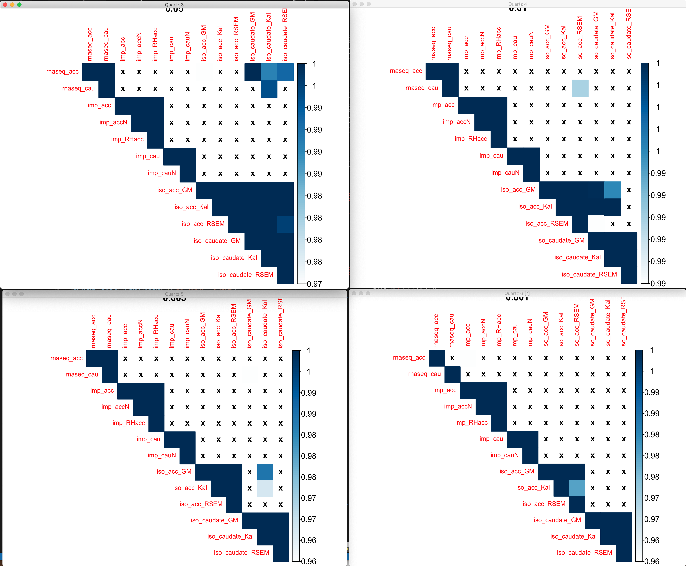

# 2020-11-20 15:04:46

Let's play a bit more with GeneOverlap just using our rnaseq results and our
ready-made gene sets:

```r
load('~/data/rnaseq_derek/rnaseq_results_11122020.rData')
library(GeneOverlap)
library(WebGestaltR)
db_file = '~/data/post_mortem/acc_developmental.gmt'
gmt = readGmt(db_file) # already in gene symbols
# and convert it to lists
mylist = list()
for (s in unique(gmt$geneSet)) {
    mylist[[s]] = unique(gmt$gene[gmt$geneSet==s])
}
t = .001
ra = rnaseq_acc[rnaseq_acc$P.Value < t, 'hgnc_symbol']
rc = rnaseq_caudate[rnaseq_caudate$P.Value < t, 'hgnc_symbol']
gom.obj <- newGOM(list(rnaseq_acc=ra, rnaseq_caudate=rc),
                  mylist, spec='hg19.gene')
getMatrix(gom.obj, name='pval')
```

Have to play a bit more with the thresholds, and potentially add lists with
overlapping genes in them?

# 2020-11-23 06:17:43

I actually don't think it's too bad to use hg19 for this, because we need to
consider the chances of being in either list too.

```r
library(GeneOverlap)
library(WebGestaltR)

load('~/data/rnaseq_derek/rnaseq_results_11122020.rData')
db_file = '~/data/post_mortem/acc_developmental.gmt'
gmt = readGmt(db_file) # already in gene symbols
# and convert it to lists
mylist = list()
for (s in unique(gmt$geneSet)) {
    mylist[[s]] = unique(gmt$gene[gmt$geneSet==s])
}
for (t in c(.05, .01, .005, .001)) {
    ra = rnaseq_acc[rnaseq_acc$P.Value < t, 'hgnc_symbol']
    rc = rnaseq_caudate[rnaseq_caudate$P.Value < t, 'hgnc_symbol']
    cat(sprintf('\nt=%.3f, ra=%d, rc=%d\n', t, length(ra), length(rc)))
    gom.obj <- newGOM(list(rnaseq_acc=ra, rnaseq_caudate=rc),
                    mylist, spec='hg19.gene')
    print(getMatrix(gom.obj, name='pval'))
}
```

```
t=0.050, ra=1335, rc=1063
               dev1_c0.9 dev2_c0.9   dev3_c0.9  dev4_c0.9  dev5_c0.9 overlap_c0.9
rnaseq_acc     0.6236385 0.8759384 0.020775497 1.00000000 0.09771868    0.9532548
rnaseq_caudate 0.1064240 1.0000000 0.007331972 0.08262743 0.51812821    0.7375957

t=0.010, ra=325, rc=220
               dev1_c0.9 dev2_c0.9 dev3_c0.9 dev4_c0.9 dev5_c0.9 overlap_c0.9
rnaseq_acc     0.8636162         1 0.4154584 1.0000000 0.6844767    0.9824292
rnaseq_caudate 0.5972892         1 0.3041968 0.0461671 0.5412226    0.8290920

t=0.005, ra=165, rc=117
               dev1_c0.9 dev2_c0.9 dev3_c0.9 dev4_c0.9 dev5_c0.9 overlap_c0.9
rnaseq_acc     0.9570919         1         1 1.0000000 0.4421944    0.9857973
rnaseq_caudate 0.3790669         1         1 0.1673051 0.3386872    0.9342330

t=0.001, ra=38, rc=26
               dev1_c0.9 dev2_c0.9 dev3_c0.9 dev4_c0.9 dev5_c0.9 overlap_c0.9
rnaseq_acc             1         1         1         1         1    1.0000000
rnaseq_caudate         1         1         1         1         1    0.6257793
```

Results are not good. We might need to go for enrichment here. Let's just check
adhd_genes though:

```r
db_file = '~/data/post_mortem/adhd_genes.gmt'
gmt = readGmt(db_file) # already in gene symbols
# and convert it to lists
mylist = list()
for (s in c('GWAS1', 'GWAS', 'TWAS1', 'TWAS2', 'TWAS', 'CNV1', 'CNV2')) {
    mylist[[s]] = unique(gmt$gene[gmt$geneSet==s])
}
for (t in c(.05, .01, .005, .001)) {
    ra = rnaseq_acc[rnaseq_acc$P.Value < t, 'hgnc_symbol']
    rc = rnaseq_caudate[rnaseq_caudate$P.Value < t, 'hgnc_symbol']
    cat(sprintf('\nt=%.3f, ra=%d, rc=%d\n', t, length(ra), length(rc)))
    gom.obj <- newGOM(list(rnaseq_acc=ra, rnaseq_caudate=rc),
                    mylist, spec='hg19.gene')
    print(getMatrix(gom.obj, name='pval'))
}
```

```
t=0.050, ra=1335, rc=1063
                   GWAS1      GWAS     TWAS1      TWAS
rnaseq_acc     1.0000000 0.9231465 1.0000000 0.4623828
rnaseq_caudate 0.6770602 0.9506344 0.5426837 0.5996965

t=0.010, ra=325, rc=220
               GWAS1      GWAS TWAS1 TWAS
rnaseq_acc         1 0.9059446     1    1
rnaseq_caudate     1 1.0000000     1    1

t=0.005, ra=165, rc=117
               GWAS1      GWAS TWAS1 TWAS
rnaseq_acc         1 0.6976711     1    1
rnaseq_caudate     1 1.0000000     1    1

t=0.001, ra=38, rc=26
               GWAS1 GWAS TWAS1 TWAS
rnaseq_acc         1    1     1    1
rnaseq_caudate     1    1     1    1
```

Again, nothing to be proud off.

# 2020-11-27 12:03:46

Let's look again at gene overlaps, but also add some splices there:

```r
data_dir = '~/data/expression_impute/'
md = 'MASHR'

clean_imp_res = function(res) {
    G_list0 = readRDS('~/data/rnaseq_derek/mart_rnaseq.rds')
    G_list <- G_list0[!is.na(G_list0$hgnc_symbol),]
    G_list = G_list[G_list$hgnc_symbol!='',]
    G_list <- G_list[!duplicated(G_list$ensembl_gene_id),]

    id_num = sapply(res$gene, function(x) strsplit(x=x, split='\\.')[[1]][1])
    dups = duplicated(id_num)
    id_num = id_num[!dups]
    res$id_num = id_num

    imnamed = res$id_num %in% G_list$ensembl_gene_id
    res = res[imnamed, ]
    G_list2 = merge(G_list, res, by.x='ensembl_gene_id', by.y='id_num')
    imautosome = which(G_list2$chromosome_name != 'X' &
                    G_list2$chromosome_name != 'Y' &
                    G_list2$chromosome_name != 'MT')
    G_list2 = G_list2[imautosome, ]
    return(G_list2[, c('hgnc_symbol', 'pvalue')])
}
md = 'MASHR'
phen = 'res_ACC_volume'
res = read.table(sprintf('%s/assoc_%s_%s.txt', data_dir, md, phen), header=1)
res_acc_imp = clean_imp_res(res)
phen = 'res_Caudate_volume'
res = read.table(sprintf('%s/assoc_%s_%s.txt', data_dir, md, phen), header=1)
res_caudate_imp = clean_imp_res(res)
phen = 'res_norm_ACC_vol'
res = read.table(sprintf('%s/assoc_%s_%s.txt', data_dir, md, phen), header=1)
res_Nacc_imp = clean_imp_res(res)
phen = 'res_norm_Caudate_vol'
res = read.table(sprintf('%s/assoc_%s_%s.txt', data_dir, md, phen), header=1)
res_Ncaudate_imp = clean_imp_res(res)
phen = 'res_rh_caudalanteriorcingulate_volume'
res = read.table(sprintf('%s/assoc_%s_%s.txt', data_dir, md, phen), header=1)
res_rhACCvol_imp = clean_imp_res(res)
```

Also add the splicesome results:

```r
for (r in c('acc', 'caudate')) {
    df = read.csv(sprintf('~/data/isoforms/david_pca_%s.csv', r))
    for (p in colnames(df)[2:4]) {
        tmp = df[!is.na(df[, p]), c('geneName', p)]
        colnames(tmp) = c('hgnc_symbol', 'P.Value')
        dup_genes = tmp$hgnc_symbol[duplicated(tmp$hgnc_symbol)]
        res = tmp[!tmp$hgnc_symbol %in% dup_genes, ]
        for (g in dup_genes) {
            gene_data = tmp[tmp$hgnc_symbol==g, ]
            best_res = which.min(gene_data$P.Value)
            res = rbind(res, gene_data[best_res, ])
        }
        res = res[, c('hgnc_symbol', 'P.Value')]
        colnames(res)[2] = 'pvalue'
        eval(parse(text=sprintf('iso_%s_%s = res', r, p)))
    }
}
```

Now we can just put them into the matrix:

```r
library(GeneOverlap)
library(corrplot)
load('~/data/rnaseq_derek/rnaseq_results_11122020.rData')
res_rnaseq_acc = rnaseq_acc[, c('hgnc_symbol', 'P.Value')]
res_rnaseq_caudate = rnaseq_caudate[, c('hgnc_symbol', 'P.Value')]
colnames(res_rnaseq_acc)[2] = 'pvalue'
colnames(res_rnaseq_caudate)[2] = 'pvalue'

res_var = c('res_rnaseq_acc', 'res_rnaseq_caudate',
            'res_acc_imp', 'res_Nacc_imp', 'res_rhACCvol_imp',
            'res_caudate_imp', 'res_Ncaudate_imp',
            'iso_acc_GM.of.both', 'iso_acc_p.val.Kallisto', 'iso_acc_p.val.RSEM',
            'iso_caudate_GM.of.both', 'iso_caudate_Kallisto.p.val', 'iso_caudate_RSEM.p.val'
            )
res_str = c('rnaseq_acc', 'rnaseq_cau',
            'imp_acc', 'imp_accN', 'imp_RHacc',
            'imp_cau', 'imp_cauN',
            'iso_acc_GM', 'iso_acc_Kal', 'iso_acc_RSEM',
            'iso_caudate_GM', 'iso_caudate_Kal', 'iso_caudate_RSEM'
 )

for (thres in c(.05, .01, .005, .001)) {
    pvals = matrix(nrow=length(res_var), ncol=length(res_var),
                dimnames=list(res_str, res_str))
    for (i in 1:length(res_var)) {
        for (j in 1:length(res_var)) {
            eval(parse(text=sprintf('res1 = eval(parse(text=res_var[i]))')))
            eval(parse(text=sprintf('res2 = eval(parse(text=res_var[j]))')))
            uni = union(res1$hgnc_symbol, res2$hgnc_symbol)

            go.obj <- newGeneOverlap(res1$hgnc_symbol[res1$pvalue < thres],
                                    res2$hgnc_symbol[res2$pvalue < thres],
                                    genome.size=length(uni))
            go.obj <- testGeneOverlap(go.obj)
            pvals[res_str[i], res_str[j]] = getPval(go.obj)
        }
    }
    quartz()
    b = 1-pvals
    b[b<.95] = NA
    corrplot(b, method='color', tl.cex=.8, cl.cex=1, type='upper', is.corr=F,
            na.label='x', title=thres)
}
```



Here are the results for overlap analysis. In a nutshell, there isn't anything
there. Each of the 4 plots represent the overlap of genes using different
nominal cut-offs. Color bar simply shows whether the overlap is significant
nominally p < .05. Anything that's p > .05 has X. You can see the expected
patterns among correlated sets that wouldn't be there in the final analysis,
like within isoform analysis, or within imputed sets. But there isn't anything
across modalities (e.g. between iso and imp, or rnaseq and imp), or even within
modality but across regions (e.g. imp_acc and imp_caudate). The only excpetion
is the within rnaseq overlap, which is there for all but the most conservative
threshold (p .001). 
