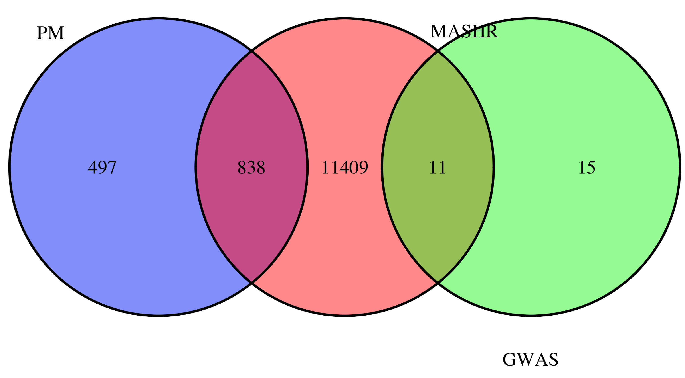

# 2020-11-27 14:43:08

Maybe there is some ML we can do to enhance the paper. For example, if we have 3
sets of genes: expressed in ACC, GWAS1, and rnaseq_acc, would their overlaps
perform better than by themselves in predicting ADHD?

It's a tricky thing to define the RNAseq PM set, but we could try different pval
thresholds, or even ue the overlap with GWAS1 from the enrichment analysis. For
now, let's make sure the GWAS1 set is correct, as it's been the basis for a lot
of our results:

```r
library(WebGestaltR)
db_file = '~/data/post_mortem/adhd_genes.gmt'
gmt = readGmt(db_file) # already in gene symbols
gmt[gmt$geneSet=='GWAS1',]
```

That looks good. 26 genes from 12 loci. 

Let's see how many of the predicted genes for ACC in the MASHR model come up:

```r
imp_genes = readRDS('~/data/expression_impute/results/NCR_v3_ACC_1KG_mashr.rds')
grex_vars = colnames(imp_genes)[grepl(colnames(imp_genes), pattern='^ENS')]
id_num = sapply(grex_vars, function(x) strsplit(x=x, split='\\.')[[1]][1])
dups = duplicated(id_num)
id_num = id_num[!dups]
grex_vars = id_num

G_list0 = readRDS('~/data/rnaseq_derek/mart_rnaseq.rds')
G_list <- G_list0[!is.na(G_list0$hgnc_symbol),]
G_list = G_list[G_list$hgnc_symbol!='',]
G_list <- G_list[!duplicated(G_list$ensembl_gene_id),]
imimputed = G_list$ensembl_gene_id %in% grex_vars
G_list2 = G_list[imimputed,]
```

So, there are 12258 imputed genes (with names), and the intersection of those
with the GWAS1 set is only 11.

How many we include from PM will depend on the threshold. But let's make a few
Venn diagrams.

```r
load('~/data/rnaseq_derek/rnaseq_results_11122020.rData')

library(VennDiagram)
quartz()
thres = .05
venn.plot = venn.diagram(list(MASHR = G_list2$hgnc_symbol,
                              GWAS = gmt[gmt$geneSet=='GWAS1', 'gene'],
                              PM = rnaseq_acc[rnaseq_acc[, 'P.Value'] < thres,
                                              'hgnc_symbol']),
                         euler.d=TRUE, fill=c('red','green', 'blue'), main=thres,
                         filename=sprintf('~/tmp/overlap%.2f.tiff', thres))
```



This is worrisome because there is no overlap between PM and GWAS even at p <
.05. We could still go on with this approach, making the set of overlap between
imputed and PM even smaller by using different thresholds. But it'll never
overlap with GWAS. That could be the comparison though. And we could also add
the genes that lead the enrichment analysis, for comparison. First, let's check
the overlap at different thresholds:

```r
for (thres in c(.05, .01, .005, .001, .0005, .0001)) {
    MASHR = G_list2$hgnc_symbol
    PM = rnaseq_acc[rnaseq_acc[, 'P.Value'] < thres, 'hgnc_symbol']
    cat(sprintf('thres=%.4f, overlap=%d\n', thres, length(intersect(MASHR, PM))))
}
```

```
thres=0.0500, overlap=838
thres=0.0100, overlap=200
thres=0.0050, overlap=109
thres=0.0010, overlap=24
thres=0.0005, overlap=12
thres=0.0001, overlap=3
```

And what are the genes leading the enrichment? Looking at the WG3 CSV result,
then we have 9 leading edge genes:

CCDC24;DUSP6;KDM4A-AS1;LINC00461;LINC01572;PTPRF;SEMA6D;SLC6A9;SORCS3

So, just to avoid overdoing comparisons, we can do leading edge, GWAS, then
thresholds starting at .001 to keep the number of features somewhat similar?

We do need to keep the test set constant. How should we define it? Let's do that
for a single set, and then we can just do the same thing for other sets of
genes. Likely put age and sex there too just in case. But let's do one per
family (oldest?) for now just to separate the sets.

```r
imp_genes = readRDS('~/data/expression_impute/results/NCR_v3_ACC_1KG_mashr.rds')
grex_vars = colnames(imp_genes)[grepl(colnames(imp_genes), pattern='^ENS')]
iid2 = sapply(imp_genes$IID, function(x) strsplit(x, '_')[[1]][2])
imp_genes$IID = iid2
pcs = read.csv('~/data/expression_impute/pop_pcs.csv')
imp_data = merge(imp_genes, pcs, by='IID', all.x=F, all.y=F)

imwnh = imp_data$PC01<0 & imp_data$PC02>-.02
imp_data = imp_data[imwnh, ]

# cut to only names genes
grex_vars = colnames(imp_data)[grepl(colnames(imp_data), pattern='^ENS')]
other_vars = colnames(imp_data)[!grepl(colnames(imp_data), pattern='^ENS')]
id_num = sapply(grex_vars, function(x) strsplit(x=x, split='\\.')[[1]][1])
dups = duplicated(id_num)
id_num = id_num[!dups]
grex_data = imp_data[, grex_vars[!dups]]
colnames(grex_data) = id_num
grex_vars = colnames(grex_data)

G_list0 = readRDS('~/data/rnaseq_derek/mart_rnaseq.rds')
G_list <- G_list0[!is.na(G_list0$hgnc_symbol),]
G_list = G_list[G_list$hgnc_symbol!='',]
G_list <- G_list[!duplicated(G_list$ensembl_gene_id),]
imimputed = G_list$ensembl_gene_id %in% grex_vars
G_list2 = G_list[imimputed,]
imnamed = grex_vars %in% G_list2$ensembl_gene_id
grex_data = grex_data[, imnamed]


# TODO
 * Compare to results using PRS?