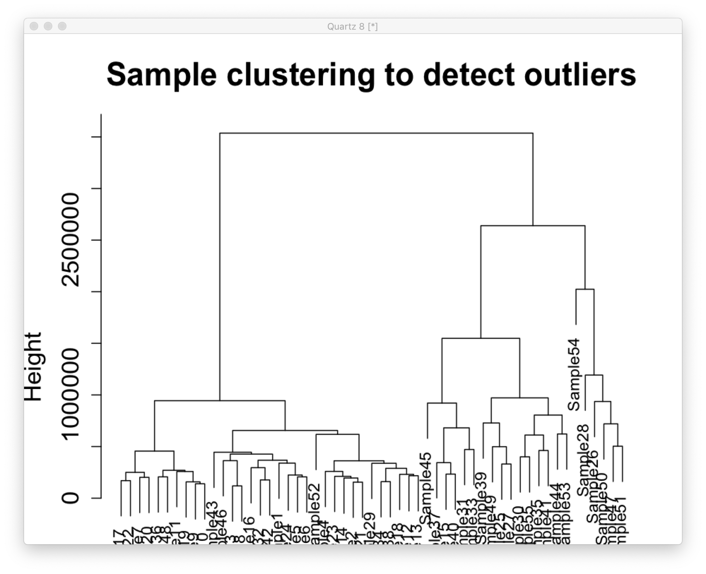
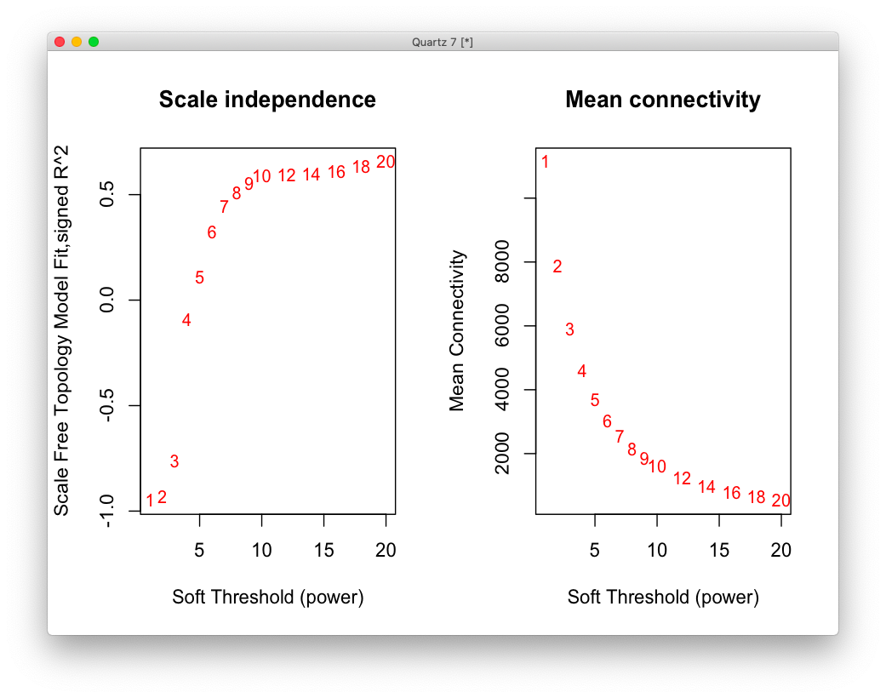

# 2020-11-30 19:35:10

Philip showed me this paper:

https://science.sciencemag.org/content/sci/362/6420/eaat8127.full.pdf?casa_token=fS2Ibw-5XBAAAAAA:VqdYfFH0YZnXUoU9w0EgxTl7y1xzqIFOvHmeJFcQOcsUFkx7kHTEj-3VNSCO3ltMhMbybsPqJCn5mfs

and supplemental here:

https://science.sciencemag.org/content/sci/suppl/2018/12/12/362.6420.eaat8127.DC1/aat8127_Gandal_SM.pdf

which basically the main PsychENCODE Science paper. They do a beautiful analysis
that we should eventually try to replicate. For now, let's just try running
WGCNA in our current pipeline and see if anything falls out of it.

First step is to residualize our data.

```r
myregion = 'ACC'
data = readRDS('~/data/rnaseq_derek/complete_rawCountData_05132020.rds')
rownames(data) = data$submitted_name  # just to ensure compatibility later
# remove obvious outlier (that's NOT caudate) labeled as ACC
rm_me = rownames(data) %in% c('68080')
data = data[!rm_me, ]
data = data[data$Region==myregion, ]
more = readRDS('~/data/rnaseq_derek/data_from_philip_POP_and_PCs.rds')
more = more[!duplicated(more$hbcc_brain_id),]
data = merge(data, more[, c('hbcc_brain_id', 'comorbid', 'comorbid_group',
                            'substance', 'substance_group')],
             by='hbcc_brain_id', all.x=T, all.y=F)

# at this point we have 55 samples for ACC
grex_vars = colnames(data)[grepl(colnames(data), pattern='^ENS')]
count_matrix = t(data[, grex_vars])
data = data[, !grepl(colnames(data), pattern='^ENS')]
id_num = sapply(grex_vars, function(x) strsplit(x=x, split='\\.')[[1]][1])
rownames(count_matrix) = id_num
dups = duplicated(id_num)
id_num = id_num[!dups]
count_matrix = count_matrix[!dups, ]

G_list0 = readRDS('~/data/rnaseq_derek/mart_rnaseq.rds')
G_list <- G_list0[!is.na(G_list0$hgnc_symbol),]
G_list = G_list[G_list$hgnc_symbol!='',]
G_list <- G_list[!duplicated(G_list$ensembl_gene_id),]
imnamed = rownames(count_matrix) %in% G_list$ensembl_gene_id
count_matrix = count_matrix[imnamed, ]
# we're down from 60K to 38K samples by only looking at the ones with hgnc symbol. We might be losing too much here, so it's a step to reconsider in the future

data$POP_CODE = as.character(data$POP_CODE)
data[data$POP_CODE=='WNH', 'POP_CODE'] = 'W'
data[data$POP_CODE=='WH', 'POP_CODE'] = 'W'
data$POP_CODE = factor(data$POP_CODE)
data$Individual = factor(data$hbcc_brain_id)
data[data$Manner.of.Death=='Suicide (probable)', 'Manner.of.Death'] = 'Suicide'
data[data$Manner.of.Death=='unknown', 'Manner.of.Death'] = 'natural'
data$MoD = factor(data$Manner.of.Death)
data$batch = factor(as.numeric(data$run_date))
data$Diagnosis = factor(data$Diagnosis, levels=c('Control', 'Case'))

library(caret)
pp_order = c('zv', 'nzv')
pp = preProcess(t(count_matrix), method = pp_order)
X = predict(pp, t(count_matrix))
geneCounts = t(X)
G_list2 = merge(rownames(geneCounts), G_list, by=1)
colnames(G_list2)[1] = 'ensembl_gene_id'
imautosome = which(G_list2$chromosome_name != 'X' &
                   G_list2$chromosome_name != 'Y' &
                   G_list2$chromosome_name != 'MT')
geneCounts = geneCounts[imautosome, ]
G_list2 = G_list2[imautosome, ]
library(edgeR)
isexpr <- filterByExpr(geneCounts, group=data$Diagnosis)
genes = DGEList( geneCounts[isexpr,], genes=G_list2[isexpr,] ) 
genes = calcNormFactors( genes)

lcpm = cpm(genes, log=T)
set.seed(42)
lcpm.pca <- prcomp(t(lcpm), scale=TRUE)

library(nFactors)
eigs <- lcpm.pca$sdev^2
nS = nScree(x=eigs)
keep_me = 1:nS$Components$nkaiser
mydata = data.frame(lcpm.pca$x[, keep_me])

data2 = cbind(data, mydata)
# we don't residualize Diagnosis!

form = ~ PC1 + PC2 + PC7 + PC8 + PC9
design = model.matrix( form, data2)
vobj = voom( genes, design, plot=FALSE)
fit <- lmFit(vobj, design)
fit2 <- eBayes( fit )
```

Now we start we WGCNA. Following instructions from
https://horvath.genetics.ucla.edu/html/CoexpressionNetwork/Rpackages/WGCNA/Tutorials/


```r
resids = residuals(fit2, genes)

library(WGCNA)
datExpr0 = t(resids)
gsg = goodSamplesGenes(datExpr0, verbose = 3);
# everything is OK!

sampleTree = hclust(dist(datExpr0), method = "average")
quartz()
plot(sampleTree, main = "Sample clustering to detect outliers", sub="",
     xlab="", cex.lab = 1.5, cex.axis = 1.5, cex.main = 2)
```



Maybe 54 is bad, but I don't want to remove it for now.

```r
datExpr = datExpr0
nGenes = ncol(datExpr)
nSamples = nrow(datExpr)

enableWGCNAThreads()

# Choose a set of soft-thresholding powers
powers = c(c(1:10), seq(from = 12, to=20, by=2))
# Call the network topology analysis function
sft = pickSoftThreshold(datExpr, powerVector = powers, verbose = 5)
# Plot the results:
quartz()
par(mfrow = c(1,2));
cex1 = 0.9;
# Scale-free topology fit index as a function of the soft-thresholding power
plot(sft$fitIndices[,1], -sign(sft$fitIndices[,3])*sft$fitIndices[,2],
     xlab="Soft Threshold (power)",
     ylab="Scale Free Topology Model Fit,signed R^2",type="n",
    main = paste("Scale independence"));
text(sft$fitIndices[,1], -sign(sft$fitIndices[,3])*sft$fitIndices[,2],
    labels=powers,cex=cex1,col="red");
# this line corresponds to using an R^2 cut-off of h
abline(h=0.90,col="red")
# Mean connectivity as a function of the soft-thresholding power
plot(sft$fitIndices[,1], sft$fitIndices[,5],
    xlab="Soft Threshold (power)",ylab="Mean Connectivity", type="n",
    main = paste("Mean connectivity"))
text(sft$fitIndices[,1], sft$fitIndices[,5], labels=powers, cex=cex1,col="red")
```



In our case, the lowest power for which the scale-free topology fit index curve
flattens out upon reaching a high value is 9 (or maybe 10).

```r
net = blockwiseModules(datExpr, power = 9,
                     TOMType = "unsigned", minModuleSize = 30,
                     reassignThreshold = 0, mergeCutHeight = 0.25,
                     numericLabels = TRUE, pamRespectsDendro = FALSE,
                     saveTOMs = TRUE,
                     saveTOMFileBase = "pmACC", maxBlockSize=nGenes,
                    verbose = 3)
```

```
r$> table(net$colors)                                                                                                                                               

    0     1     2     3     4     5 
  133 16318   796   336    47    47 
```

I don't think this looks right. We have one module with 16K genes, and then 4
others? (0 is not assigned). Will need to tweak some stuff around before  go
further on this. 