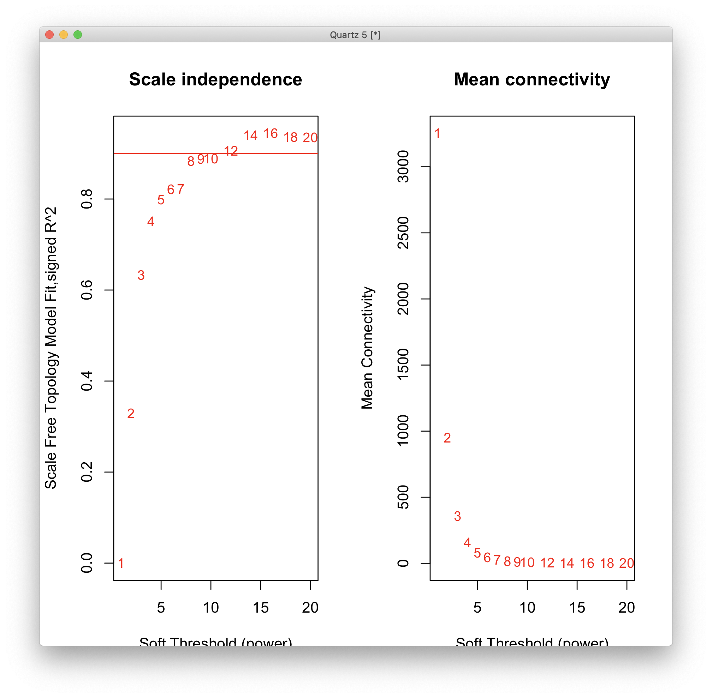

# 2020-11-30 19:35:10

Philip showed me this paper:

https://science.sciencemag.org/content/sci/362/6420/eaat8127.full.pdf?casa_token=fS2Ibw-5XBAAAAAA:VqdYfFH0YZnXUoU9w0EgxTl7y1xzqIFOvHmeJFcQOcsUFkx7kHTEj-3VNSCO3ltMhMbybsPqJCn5mfs

and supplemental here:

https://science.sciencemag.org/content/sci/suppl/2018/12/12/362.6420.eaat8127.DC1/aat8127_Gandal_SM.pdf

which basically the main PsychENCODE Science paper. They do a beautiful analysis
that we should eventually try to replicate. For now, let's just try running
WGCNA in our current pipeline and see if anything falls out of it.

First step is to residualize our data.

```r
myregion = 'ACC'
data = readRDS('~/data/rnaseq_derek/complete_rawCountData_05132020.rds')
rownames(data) = data$submitted_name  # just to ensure compatibility later
# remove obvious outlier (that's NOT caudate) labeled as ACC
rm_me = rownames(data) %in% c('68080')
data = data[!rm_me, ]
data = data[data$Region==myregion, ]
more = readRDS('~/data/rnaseq_derek/data_from_philip_POP_and_PCs.rds')
more = more[!duplicated(more$hbcc_brain_id),]
data = merge(data, more[, c('hbcc_brain_id', 'comorbid', 'comorbid_group',
                            'substance', 'substance_group')],
             by='hbcc_brain_id', all.x=T, all.y=F)

# at this point we have 55 samples for ACC
grex_vars = colnames(data)[grepl(colnames(data), pattern='^ENS')]
count_matrix = t(data[, grex_vars])
data = data[, !grepl(colnames(data), pattern='^ENS')]
id_num = sapply(grex_vars, function(x) strsplit(x=x, split='\\.')[[1]][1])
rownames(count_matrix) = id_num
dups = duplicated(id_num)
id_num = id_num[!dups]
count_matrix = count_matrix[!dups, ]

G_list0 = readRDS('~/data/rnaseq_derek/mart_rnaseq.rds')
G_list <- G_list0[!is.na(G_list0$hgnc_symbol),]
G_list = G_list[G_list$hgnc_symbol!='',]
G_list <- G_list[!duplicated(G_list$ensembl_gene_id),]
imnamed = rownames(count_matrix) %in% G_list$ensembl_gene_id
count_matrix = count_matrix[imnamed, ]
# we're down from 60K to 38K samples by only looking at the ones with hgnc symbol. We might be losing too much here, so it's a step to reconsider in the future

data$POP_CODE = as.character(data$POP_CODE)
data[data$POP_CODE=='WNH', 'POP_CODE'] = 'W'
data[data$POP_CODE=='WH', 'POP_CODE'] = 'W'
data$POP_CODE = factor(data$POP_CODE)
data$Individual = factor(data$hbcc_brain_id)
data[data$Manner.of.Death=='Suicide (probable)', 'Manner.of.Death'] = 'Suicide'
data[data$Manner.of.Death=='unknown', 'Manner.of.Death'] = 'natural'
data$MoD = factor(data$Manner.of.Death)
data$batch = factor(as.numeric(data$run_date))
data$Diagnosis = factor(data$Diagnosis, levels=c('Control', 'Case'))

library(caret)
pp_order = c('zv', 'nzv')
pp = preProcess(t(count_matrix), method = pp_order)
X = predict(pp, t(count_matrix))
geneCounts = t(X)
G_list2 = merge(rownames(geneCounts), G_list, by=1)
colnames(G_list2)[1] = 'ensembl_gene_id'
imautosome = which(G_list2$chromosome_name != 'X' &
                   G_list2$chromosome_name != 'Y' &
                   G_list2$chromosome_name != 'MT')
geneCounts = geneCounts[imautosome, ]
G_list2 = G_list2[imautosome, ]
library(edgeR)
isexpr <- filterByExpr(geneCounts, group=data$Diagnosis)
genes = DGEList( geneCounts[isexpr,], genes=G_list2[isexpr,] ) 
genes = calcNormFactors( genes)

lcpm = cpm(genes, log=T)
set.seed(42)
lcpm.pca <- prcomp(t(lcpm), scale=TRUE)

library(nFactors)
eigs <- lcpm.pca$sdev^2
nS = nScree(x=eigs)
keep_me = 1:nS$Components$nkaiser
mydata = data.frame(lcpm.pca$x[, keep_me])

data2 = cbind(data, mydata)
# we don't residualize Diagnosis!

form = ~ PC1 + PC2 + PC7 + PC8 + PC9
design = model.matrix( form, data2)
vobj = voom( genes, design, plot=FALSE)
fit <- lmFit(vobj, design)
fit2 <- eBayes( fit )
```

Now we start we WGCNA. Following instructions from
https://horvath.genetics.ucla.edu/html/CoexpressionNetwork/Rpackages/WGCNA/Tutorials/


```r
resids = residuals(fit2, genes)

library(WGCNA)
datExpr0 = t(resids)
gsg = goodSamplesGenes(datExpr0, verbose = 3);
# everything is OK!

sampleTree = hclust(dist(datExpr0), method = "average")
quartz()
plot(sampleTree, main = "Sample clustering to detect outliers", sub="",
     xlab="", cex.lab = 1.5, cex.axis = 1.5, cex.main = 2)
```


Maybe 54 is bad, but I don't want to remove it for now.

```r
datExpr = datExpr0
nGenes = ncol(datExpr)
nSamples = nrow(datExpr)

enableWGCNAThreads()

# Choose a set of soft-thresholding powers
powers = c(c(1:10), seq(from = 12, to=20, by=2))
# Call the network topology analysis function
sft = pickSoftThreshold(datExpr, powerVector = powers, verbose = 5)
# Plot the results:
quartz()
par(mfrow = c(1,2));
cex1 = 0.9;
# Scale-free topology fit index as a function of the soft-thresholding power
plot(sft$fitIndices[,1], -sign(sft$fitIndices[,3])*sft$fitIndices[,2],
     xlab="Soft Threshold (power)",
     ylab="Scale Free Topology Model Fit,signed R^2",type="n",
    main = paste("Scale independence"));
text(sft$fitIndices[,1], -sign(sft$fitIndices[,3])*sft$fitIndices[,2],
    labels=powers,cex=cex1,col="red");
# this line corresponds to using an R^2 cut-off of h
abline(h=0.90,col="red")
# Mean connectivity as a function of the soft-thresholding power
plot(sft$fitIndices[,1], sft$fitIndices[,5],
    xlab="Soft Threshold (power)",ylab="Mean Connectivity", type="n",
    main = paste("Mean connectivity"))
text(sft$fitIndices[,1], sft$fitIndices[,5], labels=powers, cex=cex1,col="red")
```


In our case, the lowest power for which the scale-free topology fit index curve
flattens out upon reaching a high value is 9 (or maybe 10).

```r
net = blockwiseModules(datExpr, power = 9,
                     TOMType = "unsigned", minModuleSize = 30,
                     reassignThreshold = 0, mergeCutHeight = 0.25,
                     numericLabels = TRUE, pamRespectsDendro = FALSE,
                     saveTOMs = TRUE,
                     saveTOMFileBase = "pmACC", maxBlockSize=nGenes,
                    verbose = 3)
```

```
r$> table(net$colors)                                                                                                                                               

    0     1     2     3     4     5 
  133 16318   796   336    47    47 
```

I don't think this looks right. We have one module with 16K genes, and then 4
others? (0 is not assigned). Will need to tweak some stuff around before  go
further on this. 

# 2020-12-10 07:19:43

Philip said I should check out this paper for networks:

https://www.nature.com/articles/s41380-018-0304-1

# 2020-12-11 17:24:15

Let's see if we can do a better job removing our covariates if we use the
empiricalBayes function from WGCNA. Maybe that's the origin of the weird
networks we are getting?

I'd rather use the same cleaning we used before, but let's just chekc if that's
what's causing the weird behavior.

```r
library(WGCNA)
datExpr0 = t(cpm(genes, log=T))
rm_vars = data[, c('pcnt_optical_duplicates', 'clusters', 'Age', 'RINe', 'PMI',
                    'C1', 'C2', 'C3', 'C4', 'C5', 'C6', 'C7', 'C8', 'C9', 'C10',
                    'batch', 'MoD', 'substance_group',
                    'comorbid_group', 'POP_CODE', 'Sex')]
# one sample doesn't have PCs
rm_vars2 = irmi(rm_vars, imp_var=F) 
keep_vars = matrix(data[, c('Diagnosis')])
datExpr1 = empiricalBayesLM(datExpr0, rm_vars2, keep_vars)
```

That's breaking... not sure what's going on.

Actually, it ran if I used less variables to remove. Matrix likely becoming
singular. But it ran when everything was numeric... maybe that's what I need to
fix?

# 2020-12-14 06:02:27

I tried that, but it also failed... let's just use our residualized data, and
play with parameters that way. Let me see if setting the power to 10 makes a
difference:

```r
resids = residuals(fit2, genes)

library(WGCNA)
datExpr0 = t(resids)
datExpr = datExpr0
nGenes = ncol(datExpr)
nSamples = nrow(datExpr)

enableWGCNAThreads()
net = blockwiseModules(datExpr, power = 10,
                     TOMType = "unsigned", minModuleSize = 30,
                     reassignThreshold = 0, mergeCutHeight = 0.25,
                     numericLabels = TRUE, pamRespectsDendro = FALSE,
                     saveTOMs = TRUE,
                     saveTOMFileBase = "pmACC", maxBlockSize=nGenes,
                    verbose = 3)
```

```
r$> table(net$colors)                                                                  

    0     1     2     3     4     5 
  162 15885   733   506   340    51 
```

Not as bad, but still not great. 

```r
consMEs = net$multiMEs;
moduleLabels = net$colors;
# Convert the numeric labels to color labels
moduleColors = labels2colors(moduleLabels)
consTree = net$dendrograms[[1]];
quartz()
plotDendroAndColors(consTree, moduleColors,
"Module colors",
dendroLabels = FALSE, hang = 0.03,
addGuide = TRUE, guideHang = 0.05,
main = "Consensus gene dendrogram and module colors")
```


That's a funky shape, especially considering the examples in the tutotials which
are quite flat on the top.

I could play with other parameters for the blockWise function, but I'm still
somewhat worried about the residualized data. Let's check what happens if we
just remove some key variables.

These were the results in the PCA analysis for ACC:

```
r$> which(categ_pvals < .01, arr.ind = T)                              
                row col
batch             1   1
batch             1   2
batch             1   7
MoD               3   9
substance_group   4   9
r$> which(num_pvals < .01, arr.ind = T)                                
                        row col
clusters                  2   1
RINe                      4   1
PMI                       5   1
RINe                      4   2
C6                       11   2
pcnt_optical_duplicates   1   7
clusters                  2   7
Age                       3   8
Age                       3   9
```

Not sure what's going on with that function... many times it doesn't run. Not
looking very reliable. Also, I'd much rather use the same data, so let's try
playing a bit more with that.


I got the plot above using the data pre-regression, so the residualization
procedure is definitely doing something here. The questions is how much we cna
get away with here. For example, can I run the analysis on this, and then just
add the covariates to the regression later? Or, maybe add the technical
variables first, and the biological ones later?

```r
datExpr0 = t(cpm(genes, log=T))
rm_vars = data[, c('pcnt_optical_duplicates', 'clusters', 'Age', 'RINe', 'PMI',
                    'C1', 'C2', 'C3', 'C4', 'C5', 'C6', 'C7', 'C8', 'C9', 'C10',
                    'batch', 'MoD', 'substance_group',
                    'comorbid_group', 'POP_CODE', 'Sex')]
# one sample doesn't have PCs
rm_vars2 = irmi(rm_vars, imp_var=F) 
keep_vars = matrix(data[, c('Diagnosis')])
datExpr1 = empiricalBayesLM(datExpr0, rm_vars2, keep_vars)
```

This is much better too:



And I got it by using just the technical nuisances. Maybe I can leave the
biological ones for the final regressions then.

```r
datExpr0 = t(cpm(genes, log=T))
rm_vars = data[,c('pcnt_optical_duplicates', 'clusters', 'RINe', 'batch')]
rm_vars$batch = as.numeric(rm_vars$batch)
datExpr1 = empiricalBayesLM(datExpr0, rm_vars, verbose=2) 
datExpr = datExpr1$adjustedData
```

Note that I can potentially force the Diagnosis variable to stay in the data
after the Bayesian adjustment, but I won't for now. Maybe something for the
future.

So, I ran the code from above to get the network plot to chose p=6.

```r
nGenes = ncol(datExpr)
nSamples = nrow(datExpr)

enableWGCNAThreads()
net = blockwiseModules(datExpr, power = 6,
                     TOMType = "unsigned", minModuleSize = 30,
                     reassignThreshold = 0, mergeCutHeight = 0.25,
                     numericLabels = TRUE, pamRespectsDendro = FALSE,
                     saveTOMs = TRUE,
                     saveTOMFileBase = "pmACC", maxBlockSize=nGenes,
                    verbose = 3)
```

# 2020-12-15 06:09:52

I saved the network above in ~/data/pmACC. Let's keep going with the analysis:

```r
moduleLabels = net$colors
moduleColors = labels2colors(net$colors)
MEs = net$MEs;
geneTree = net$dendrograms[[1]];

MEs0 = moduleEigengenes(datExpr, moduleColors)$eigengenes
MEs = orderMEs(MEs0)

keep_me = !is.na(data$C1)
mydata = cbind(MEs, data)[keep_me,]
res_MEs = MEs[keep_me,]
library(MASS)
for (v in colnames(MEs)) {
    fm_str = sprintf('%s ~ Age + C1 + C2 + C3 + C4 + C5 + C6 + C7 + C8 + C9 +
                     C10 + MoD + substance_group + comorbid_group + POP_CODE +
                     Sex', v)
    res.lm <- lm(as.formula(fm_str), data = mydata, na.action=na.exclude)
    step <- stepAIC(res.lm, direction = "both", trace = F)
    res_MEs[, sprintf('%s', v)] = scale(residuals(step))
}
```

Now let's run the module functions in the residuals:

```r
moduleTraitCor = cor(res_MEs, as.numeric(mydata[, 'Diagnosis']), use = "p");
moduleTraitPvalue = corPvalueStudent(moduleTraitCor, nSamples);
```

Nothing there... what if I restrict stepAIC?

```r
for (v in colnames(MEs)) {
    fm_str = sprintf('%s ~ Diagnosis + Age + C1 + C2 + C3 + C4 + C5 + C6 + C7 + C8 + C9 +
                     C10 + MoD + substance_group + comorbid_group + POP_CODE +
                     Sex', v)
    res.lm <- lm(as.formula(fm_str), data = mydata)
    step <- stepAIC(res.lm, direction = "both", trace = F,
                    scope = list(lower = as.formula('~ Diagnosis')))
    myp = summary(step)$coefficients['DiagnosisCase', 'Pr(>|t|)']
    cat(sprintf('%s', v), 'p =', myp, '\n')
}
```

```
MEmagenta p = 0.05510031 
MEred p = 0.1098933 
MEroyalblue p = 0.02084991 
MEblue p = 0.09584912 
MEgreenyellow p = 0.07901374 
MEpurple p = 0.1873297 
MElightyellow p = 0.0237611 
MEblack p = 0.002744299 
MEdarkred p = 0.9225837 
MEorange p = 0.5808351 
MEwhite p = 0.09178202 
MEbrown p = 0.7058958 
MEtan p = 0.5011443 
MEsalmon p = 0.453834 
MEyellow p = 0.7547417 
MElightcyan p = 0.9040457 
MEpink p = 0.3592843 
MEdarkorange p = 0.6102331 
MEgreen p = 0.2379241 
MElightgreen p = 0.05584383 
MEdarkgrey p = 0.09893959 
MEdarkturquoise p = 0.6170546 
MEdarkgreen p = 0.1316697 
MEskyblue p = 0.8227799 
MEcyan p = 0.821995 
MEmidnightblue p = 0.07363499 
MEgrey60 p = 0.4768334 
MEturquoise p = 0.1395857 
MEgrey p = 0.7687877 
```

So, there's some stuff there. I'm just not sure about a few things:

   - how stable are these networks? (http://pages.stat.wisc.edu/~yandell/statgen/ucla/WGCNA/wgcna.html)
   - is the stepwise procedure fine?
   - check FDR
   - use signed networks? (that's what Science paper did, and removed all
     covariates first too)
   - use robustness (bicor) 
   - try csuWGCNA (https://github.com/RujiaDai/csuWGCNA, like in Science paper)

Before I go checking stability and other network options, why not check if the
networks I found are interesting at all? Before I do that, let me just double
check the effects of stepAIC:

```r
for (v in colnames(MEs)) {
    fm_str = sprintf('%s ~ Diagnosis + Age + C1 + C2 + C3 + C4 + C5 + C6 + C7 + C8 + C9 +
                     C10 + MoD + substance_group + comorbid_group + POP_CODE +
                     Sex', v)
    res.lm <- lm(as.formula(fm_str), data = mydata)
    myp = summary(res.lm)$coefficients['DiagnosisCase', 'Pr(>|t|)']
    cat(sprintf('%s', v), 'p =', myp, '\n')
}
```

```
MEmagenta p = 0.1775988 
MEred p = 0.5775573 
MEroyalblue p = 0.1181499 
MEblue p = 0.3214901 
MEgreenyellow p = 0.5141781 
MEpurple p = 0.1781428 
MElightyellow p = 0.5723202 
MEblack p = 0.1058265 
MEdarkred p = 0.9561837 
MEorange p = 0.5162689 
MEwhite p = 0.2767875 
MEbrown p = 0.5826955 
MEtan p = 0.347995 
MEsalmon p = 0.6927764 
MEyellow p = 0.9387944 
MElightcyan p = 0.4887964 
MEpink p = 0.5723803 
MEdarkorange p = 0.595375 
MEgreen p = 0.2396214 
MElightgreen p = 0.1121284 
MEdarkgrey p = 0.06545046 
MEdarkturquoise p = 0.5094936 
MEdarkgreen p = 0.4902291 
MEskyblue p = 0.7627912 
MEcyan p = 0.64849 
MEmidnightblue p = 0.2277629 
MEgrey60 p = 0.2781501 
MEturquoise p = 0.2005832 
MEgrey p = 0.7867566 
```

Yes, it makes a big difference. 

What modules should we look into?

```r
myps = c()
for (v in colnames(MEs)) {
    fm_str = sprintf('%s ~ Diagnosis + Age + C1 + C2 + C3 + C4 + C5 + C6 + C7 + C8 + C9 +
                     C10 + MoD + substance_group + comorbid_group + POP_CODE +
                     Sex', v)
    res.lm <- lm(as.formula(fm_str), data = mydata)
    step <- stepAIC(res.lm, direction = "both", trace = F,
                    scope = list(lower = as.formula('~ Diagnosis')))
    myps = c(myps, summary(step)$coefficients['DiagnosisCase', 'Pr(>|t|)'])
}
names(myps) = colnames(MEs)
```

```
r$> myps[myps<.05]                                 
  MEroyalblue MElightyellow       MEblack 
  0.020849906   0.023761104   0.002744299 
```

Let's see if there's anything interesting there.

```r
mygenes = names(moduleLabels)[moduleColors=='royalblue']
a = G_list[G_list$ensembl_gene_id %in% mygenes, 'hgnc_symbol']
write.table(a, file='~/tmp/royalblue.txt', col.names=F, row.names=F, quote=F)
```

I also exported the other 2 and will play with them a bit in WG.

There seems to be something there... let's script it.

```r
library(WebGestaltR)

ncpu=7
data_dir = '~/data/WGCNA/'
region = 'acc'
for (col in c('royalblue', 'lightyellow', 'black')) {
    mygenes = names(moduleLabels)[moduleColors==col]
    tmp2 = G_list[G_list$ensembl_gene_id %in% mygenes, 'hgnc_symbol']

    # my own GMTs
    db = sprintf('my_%s_sets', region)
    cat(region, db, col, '\n')
    project_name = sprintf('%s_%s_%s', region, col, db)
    db_file = sprintf('~/data/post_mortem/%s.gmt', db)
    enrichResult <- WebGestaltR(enrichMethod="ORA",
                                organism="hsapiens",
                                enrichDatabaseFile=db_file,
                                enrichDatabaseType="genesymbol",
                                interestGene=tmp2,
                                outputDirectory = data_dir,
                                interestGeneType="genesymbol",
                                referenceSet='genome',
                                sigMethod="top", topThr=150000,
                                minNum=3, projectName=project_name,
                                isOutput=T, isParallel=T,
                                nThreads=ncpu, perNum=10000, maxNum=900)
    out_fname = sprintf('%s/WG3_%s_%s_%s_10K.csv', data_dir, region, db, col)
    write.csv(enrichResult, file=out_fname, row.names=F)

    DBs = c('geneontology_Biological_Process_noRedundant',
            'geneontology_Cellular_Component_noRedundant',
            'geneontology_Molecular_Function_noRedundant')
    for (db in DBs) {
        cat(region, db, col, '\n')
        project_name = sprintf('%s_%s_%s', region, col, db)
        db_file = sprintf('~/data/post_mortem/%s.gmt', db)
        enrichResult <- WebGestaltR(enrichMethod="ORA",
                                    organism="hsapiens",
                                    enrichDatabase=db,
                                    enrichDatabaseType="genesymbol",
                                    interestGene=tmp2,
                                    outputDirectory = data_dir,
                                    interestGeneType="genesymbol",
                                    referenceSet='genome',
                                    sigMethod="top", topThr=150000,
                                    minNum=3, projectName=project_name,
                                    isOutput=T, isParallel=T,
                                    nThreads=ncpu, perNum=10000, maxNum=900)
        out_fname = sprintf('%s/WG3_%s_%s_%s_10K.csv', data_dir, region, db, col)
        write.csv(enrichResult, file=out_fname, row.names=F)
    }
}
```

Results for ACC WGCNA look good. Largely mirror what we were getting for DGE.
I'm attaching a few tables. There are 3 modules there are nominally related to
DX, and you'll see WG results for each of them. In a nutshell, we're getting the
same pathways as before (e.g. glutamate, synapses, etc), and the adult
developmental set. Not much in terms of overlap with GWAS or TWAS though. I
still need to evaluate the stability of those modules, and then run the same
thing for Caudate. But if the results stay this way, they're mostly
confirmatory, which is reassuring. There might be room to do something more
interesting with the imputed data... maybe the modules extracted there will be
more revealing than what we're getting with the current imputation results?


# TODO
 * clean up imputed data with caret first?
 * how stable are these networks? (http://pages.stat.wisc.edu/~yandell/statgen/ucla/WGCNA/wgcna.html)
 * check FDR after stability analysis
 * use signed networks? (that's what Science paper did, and removed all      covariates first too)
 * use robustness (bicor)
 * try csuWGCNA (https://github.com/RujiaDai/csuWGCNA, like in Science paper)