# 2020-12-07 16:49:00

Let's try a similar approach for isoforms, similar to what what did for the gene
expression analysis.

```r
df = read.delim('~/data/isoforms/shaw_adhd.rsem_output.tpm.tsv')
a = lapply(df[,1], function(x) strsplit(as.character(x), split="\\|"))
meta_iso = t(data.frame(a))
colnames(meta_iso) = c('id1', 'ensembleID', 'id2', 'id3', 'iso_name',
                        'hgnc_symbol','id4', 'read_type')
data_iso = df[, 2:ncol(df)] 

# let's add some sample data
fname = '~/data/rnaseq_derek/UPDATED_file_for_derek_add_cause_of_death.csv'
df = read.csv(fname)
df = df[!duplicated(df$submitted_name),]
sn = gsub(x=rownames(data), pattern='X', replacement='')
pop_code = read.csv('~/data/rnaseq_derek/file_pop.csv')
m = merge(df, pop_code, by='hbcc_brain_id')
pcs = read.table('~/data/rnaseq_derek/HM3_b37mds.mds', header=1)
myids = sapply(1:nrow(pcs),
               function(x) as.numeric(gsub('BR', '',
                                           strsplit(as.character(pcs[x,'IID']),
                                                    '_')[[1]][1])))
pcs$numids = myids
data = merge(m, pcs, by.x='hbcc_brain_id', by.y='numids', all.x=T, all.y=F)
data$POP_CODE = as.character(data$POP_CODE)
data[data$POP_CODE=='WNH', 'POP_CODE'] = 'W'
data[data$POP_CODE=='WH', 'POP_CODE'] = 'W'
data$POP_CODE = factor(data$POP_CODE)
data$Individual = factor(data$hbcc_brain_id)
data[data$Manner.of.Death=='Suicide (probable)', 'Manner.of.Death'] = 'Suicide'
data[data$Manner.of.Death=='unknown', 'Manner.of.Death'] = 'natural'
data$MoD = factor(data$Manner.of.Death)
data$batch = factor(data$run_date)
data$Diagnosis = factor(data$Diagnosis, levels=c('Control', 'Case'))

more = readRDS('~/data/rnaseq_derek/data_from_philip_POP_and_PCs.rds')
more = more[!duplicated(more$hbcc_brain_id),]
data = merge(data, more[, c('hbcc_brain_id', 'comorbid', 'comorbid_group',
                            'substance', 'substance_group')],
             by='hbcc_brain_id', all.x=T, all.y=F)

samples = data

# align data and samples without merging them
samples = samples[order(samples$submitted_name),]
sn = gsub(x=colnames(data_iso), pattern='X', replacement='')
colnames(data_iso) = sn
data_iso = data_iso[, order(colnames(data_iso))]
```

Let's make sure we don't have any obvious outliers and run some basic analysis,
following the PCA extraction model we used before.

```r
myregion = 'ACC'

idx = samples$Region==myregion
meta = samples[idx, ]
data = data_iso[, idx]
rownames(data) = meta_iso[,'id1']

library(edgeR)
library(ggplot2)
mds = plotMDS(data, plot=F)
plot_data = data.frame(x=mds$x, y=mds$y,
                       batch=meta$batch,
                       group=meta$Diagnosis)
quartz()
ggplot(plot_data, aes(x=x, y=y, shape=group, color=batch)) + geom_point()
```


We have a clear batch effect, but I don't think there are any clear outliers. We
could potentiall remove the one sample in the top right, but I don't think it's
necessary.

Let's then set up our usual PCA analysis:

```r
# remove some bad variables
library(caret)
pp_order = c('zv', 'nzv')
pp = preProcess(t(data), method = pp_order)
X = predict(pp, t(data))
trans_quant = t(X)

set.seed(42)
pca <- prcomp(t(trans_quant), scale=TRUE)
library(nFactors)
eigs <- pca$sdev^2
nS = nScree(x=eigs)
keep_me = 1:nS$Components$nkaiser

std_dev <- pca$sdev
pr_var <- std_dev^2
prop_varex <- pr_var/sum(pr_var)
plot(prop_varex, xlab = "Principal Component",
             ylab = "Proportion of Variance Explained",
             type = "b")
```


Kaiser selects 14 as well, which is a bit high based on the plot but not too
extreme.

```r
mydata = data.frame(pca$x[, keep_me])
num_vars = c('pcnt_optical_duplicates', 'clusters', 'Age', 'RINe', 'PMI',
             'C1', 'C2', 'C3', 'C4', 'C5', 'C6', 'C7', 'C8', 'C9', 'C10')
pc_vars = colnames(mydata)
num_corrs = matrix(nrow=length(num_vars), ncol=length(pc_vars),
                   dimnames=list(num_vars, pc_vars))
num_pvals = num_corrs
for (x in num_vars) {
    for (y in pc_vars) {
        res = cor.test(meta[, x], mydata[, y])
        num_corrs[x, y] = res$estimate
        num_pvals[x, y] = res$p.value
    }
}

library(corrplot)
corrplot(t(num_corrs), method='color', tl.cex=.5, cl.cex=.5)
```


```r
categ_vars = c('batch', 'Diagnosis', 'MoD', 'substance_group',
               'comorbid_group', 'POP_CODE', 'Sex')
categ_corrs = matrix(nrow=length(categ_vars), ncol=length(pc_vars),
                   dimnames=list(categ_vars, pc_vars))
categ_pvals = categ_corrs
for (x in categ_vars) {
    for (y in pc_vars) {
        res = kruskal.test(mydata[, y], meta[, x])
        categ_corrs[x, y] = res$statistic
        categ_pvals[x, y] = res$p.value
    }
}
corrplot(t(categ_corrs), method='color', tl.cex=.5, cl.cex=.5, is.corr=F)
```


```
r$> which(num_pvals < .01, arr.ind = T)                               
                        row col
clusters                  2   1
PMI                       5   1
pcnt_optical_duplicates   1   2
C6                       11   3
RINe                      4  12

r$> which(categ_pvals < .01, arr.ind = T)                             
      row col
batch   1   1
batch   1   2
batch   1   3
batch   1   5
batch   1   6
batch   1   9

r$> min(categ_pvals['Diagnosis',]                                                 
[1] 0.08803465
```

OK, so let's remove PCs 1, 2, 3, 5, 6, 9, and 12.

```r
data2 = DGEList(trans_quant,
                genes=meta_iso[meta_iso[, 'id1'] %in% rownames(trans_quant),],
                samples=cbind(meta, mydata))
form = ~ Diagnosis + PC1 + PC2 + PC3 + PC5 + PC6 + PC9 + PC12
design = model.matrix( form, t(data2))
fit <- lmFit(t(data2), design)
fit <- eBayes(fit)
iso_res = topTable(fit, coef='Diagnosis', number=Inf)
```

This last bit is not working. Why not follow a more standard pipeline, like
this:

http://www.bioconductor.org/packages/devel/workflows/vignettes/rnaseqDTU/inst/doc/rnaseqDTU.html

Will try later. For now, I can also just parallelize lm?

```r
library(vows)
form = (~ meta$Diagnosis + mydata$PC1 + mydata$PC2 + mydata$PC3 + mydata$PC5
        + mydata$PC6 + mydata$PC9 + mydata$PC12)
res = summary(lm.mp(t(trans_quant), form))
pvals = res$pvalue['meta$DiagnosisCase',]
```

So, this would be the exact same thing we did for our previous DGE analysis,
except that now I'm using the raw TPM data I got from David. Not sur eif that's
Kosher, but that's what they did in the Science paper. It might be nice to try
some of the more standardized pipelines I outlined below, which take into
consideration uncertainties and multiple isoforms for the same gene. Also, I
still need to run DTU, but that's simply a rescaling of the DTE data, if using
the same pipeline from the Science paper.

Note that I cannot just use David's results here because I don't have the
p-values for his method using PRS as the predictor.

# 2020-12-09 14:21:41

Let's capture all those results:

```r
junk = data.frame(P.Value=res$pvalue['meta$DiagnosisCase',],
                  t=res$tstat['meta$DiagnosisCase',],
                  adj.P.Val=p.adjust(res$pvalue['meta$DiagnosisCase',],
                                     method='fdr'))
res_dx = merge(junk, meta_iso, by.x=0, by.y='id1')
res_dx = res_dx[order(res_dx$P.Value), ]
```

And do the same for PRS:

```r
fname = '~/data/post_mortem/genotyping/1KG/merged_PM_1KG_PRS_12032020.csv'
prs = read.csv(fname)
prs$hbcc_brain_id = sapply(prs$IID,
                          function(x) {
                              br = strsplit(x, '_')[[1]][2];
                              as.numeric(gsub(br, pattern='BR',
                                              replacement=''))})
imWNH = data$C1 > 0 & data$C2 < -.075
wnh_brains = data[which(imWNH),]$hbcc_brain_id

# using the most appropriate PRS
m = merge(meta, prs, by='hbcc_brain_id')
prs_names = sapply(c(.0001, .001, .01, .1, .00005, .0005, .005, .05,
                      .5, .4, .3, .2),
                   function(x) sprintf('PRS%f', x))
m[, prs_names] = NA
keep_me = m$hbcc_brain_id %in% wnh_brains
m[keep_me, prs_names] = m[keep_me, 64:75]
m[!keep_me, prs_names] = m[!keep_me, 52:63]
data_app = m[, c(1:50, 76:87)]
data_app = data_app[order(data_app$submitted_name),]
```

We might as well run it for all thresholds:

```r
library(GeneOverlap)
library(vows)

# first sample doesn't have prs
trans_quant2 = trans_quant[, 2:ncol(trans_quant)]
mydata2 = mydata[2:nrow(mydata), ]

prs_names = sapply(c(.0001, .001, .01, .1, .00005, .0005, .005, .05,
                      .5, .4, .3, .2),
                   function(x) sprintf('PRS%f', x))
all_res = c()
for (p in prs_names) {
    cat(p, '\n')
    p_str = sprintf('data_app$%s', p)
    form = as.formula(sprintf('~ %s + mydata2$PC1 + mydata2$PC2 + mydata2$PC3 +
                              mydata2$PC5 + mydata2$PC6 + mydata2$PC9 +
                              mydata2$PC12', p_str))
    res = summary(lm.mp(t(trans_quant2), form))
    junk = data.frame(P.Value=res$pvalue[p_str,], t=res$tstat[p_str,],
                      adj.P.Val=p.adjust(res$pvalue[p_str,], method='fdr'))
    res_prs = merge(junk, meta_iso, by.x=0, by.y='id1')
    res_prs = res_prs[order(res_prs$P.Value), ]
    for (t in c(.05, .01, .005, .001)) {
        prs_genes = res_prs[res_prs$P.Value < t, 'hgnc_symbol']
        dx_genes = res_dx[res_dx$P.Value < t, 'hgnc_symbol']
        go.obj <- newGeneOverlap(prs_genes, dx_genes, genome.size=nrow(res_prs))
        go.obj <- testGeneOverlap(go.obj)
        inter = intersect(prs_genes, dx_genes)
        pval = getPval(go.obj)
        this_res = c(p, t, length(prs_genes), length(dx_genes), length(inter),
                     pval)
        all_res = rbind(all_res, this_res)
    }
}
colnames(all_res) = c('PRS', 'nomPvalThresh', 'PRsgenes', 'PMgenes',
                      'overlap', 'pval')
write.csv(all_res, file='~/data/isoforms/DTE_acc_prs_overlap_results.csv',
          row.names=F)
```

And we can run a similar analysis for Caudate:

```r
myregion = 'Caudate'

idx = samples$Region==myregion
meta = samples[idx, ]
data = data_iso[, idx]
rownames(data) = meta_iso[,'id1']
set.seed(42)
mds = plotMDS(data, plot=F)
plot_data = data.frame(x=mds$x, y=mds$y,
                       batch=meta$batch,
                       group=meta$Diagnosis)
quartz()
ggplot(plot_data, aes(x=x, y=y, shape=group, color=batch)) + geom_point()
```

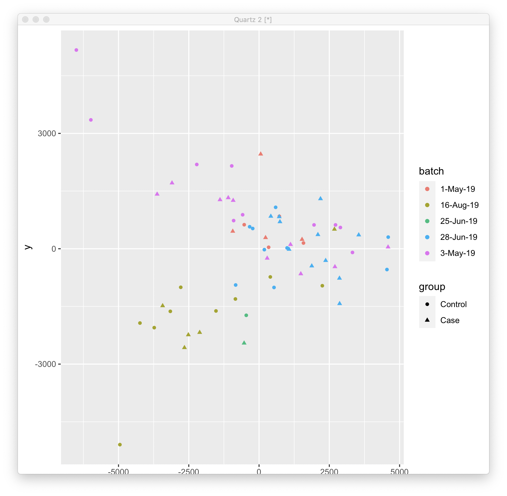

We again have a clear batch effect, but this time we could consider the two
samples top left and the one bottom left as outliers. Let's get rid of them
before running the usual PCA analysis:

```r
mds_good = mds$y < 3000 & mds$y > -3000
meta = meta[mds_good, ]
data = data[, mds_good]

library(caret)
pp_order = c('zv', 'nzv')
pp = preProcess(t(data), method = pp_order)
X = predict(pp, t(data))
trans_quant = t(X)
set.seed(42)
pca <- prcomp(t(trans_quant), scale=TRUE)
eigs <- pca$sdev^2
nS = nScree(x=eigs)
keep_me = 1:nS$Components$nkaiser
std_dev <- pca$sdev
pr_var <- std_dev^2
prop_varex <- pr_var/sum(pr_var)
plot(prop_varex, xlab = "Principal Component",
             ylab = "Proportion of Variance Explained",
             type = "b")
```

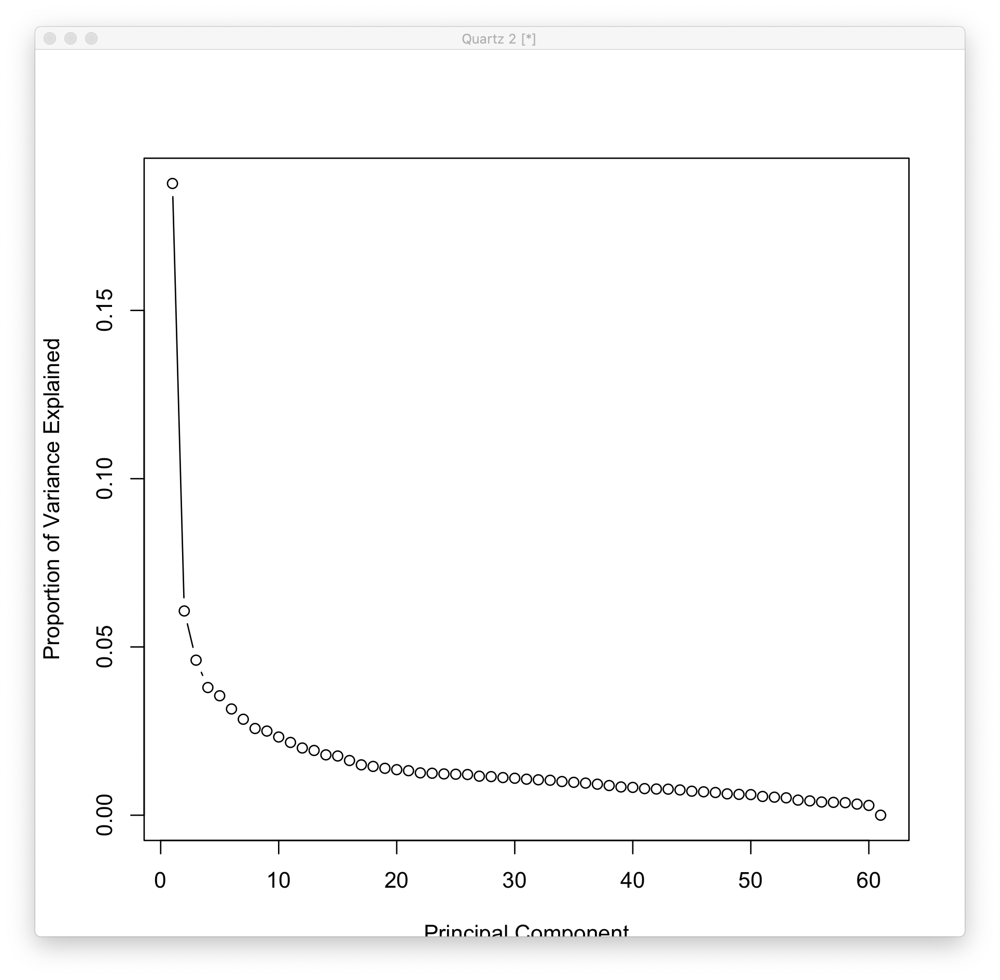

Kaiser selects 15 this time, which is alright.

```r
mydata = data.frame(pca$x[, keep_me])
num_vars = c('pcnt_optical_duplicates', 'clusters', 'Age', 'RINe', 'PMI',
             'C1', 'C2', 'C3', 'C4', 'C5', 'C6', 'C7', 'C8', 'C9', 'C10')
pc_vars = colnames(mydata)
num_corrs = matrix(nrow=length(num_vars), ncol=length(pc_vars),
                   dimnames=list(num_vars, pc_vars))
num_pvals = num_corrs
for (x in num_vars) {
    for (y in pc_vars) {
        res = cor.test(meta[, x], mydata[, y])
        num_corrs[x, y] = res$estimate
        num_pvals[x, y] = res$p.value
    }
}

library(corrplot)
corrplot(t(num_corrs), method='color', tl.cex=.5, cl.cex=.5)
```

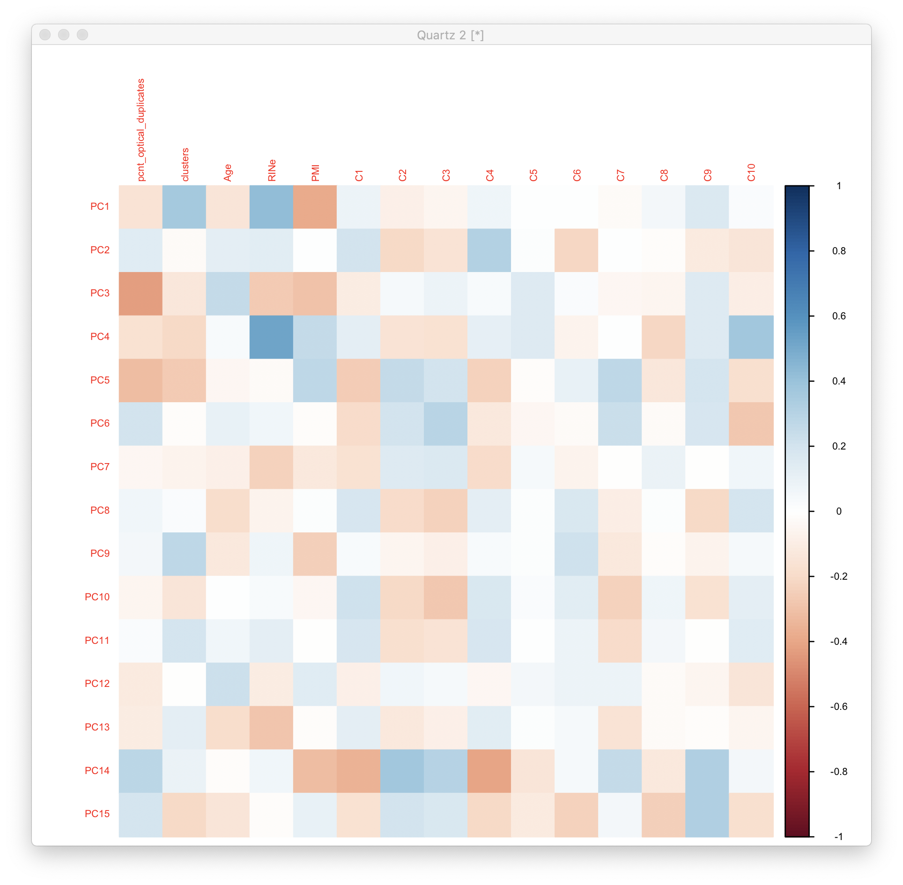

```r
categ_vars = c('batch', 'Diagnosis', 'MoD', 'substance_group',
               'comorbid_group', 'POP_CODE', 'Sex')
categ_corrs = matrix(nrow=length(categ_vars), ncol=length(pc_vars),
                   dimnames=list(categ_vars, pc_vars))
categ_pvals = categ_corrs
for (x in categ_vars) {
    for (y in pc_vars) {
        res = kruskal.test(mydata[, y], meta[, x])
        categ_corrs[x, y] = res$statistic
        categ_pvals[x, y] = res$p.value
    }
}
corrplot(t(categ_corrs), method='color', tl.cex=.5, cl.cex=.5, is.corr=F)
```

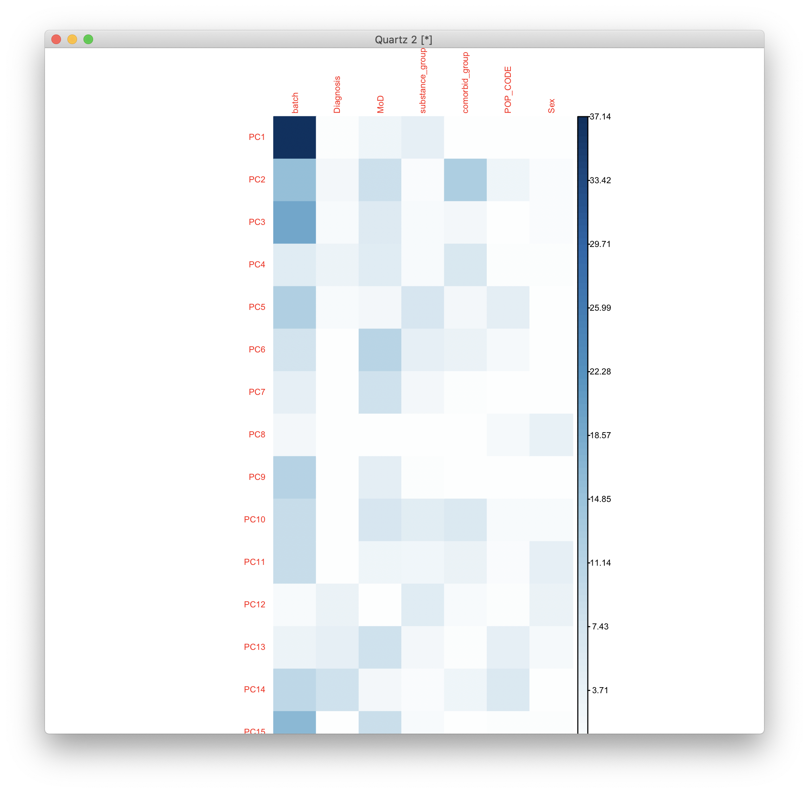

```
r$> which(num_pvals < .01, arr.ind = T)                                                                                        
                        row col
clusters                  2   1
RINe                      4   1
PMI                       5   1
pcnt_optical_duplicates   1   3
RINe                      4   4
C10                      15   4
C1                        6  14
C2                        7  14
C4                        9  14

r$> which(categ_pvals < .01, arr.ind = T)                                                                                      
               row col
batch            1   1
batch            1   2
comorbid_group   5   2
batch            1   3
Diagnosis        2  14
batch            1  15
```

The issue here is that PC14 is related to Diagnosis and also several population
components, so I can't really take it out... let's remove 1, 2, 3, 4, and 15.

```r
form = (~ meta$Diagnosis + mydata$PC1 + mydata$PC2 + mydata$PC3 + mydata$PC4
        + mydata$PC15)
res = summary(lm.mp(t(trans_quant), form))
junk = data.frame(P.Value=res$pvalue['meta$DiagnosisCase',],
                  t=res$tstat['meta$DiagnosisCase',],
                  adj.P.Val=p.adjust(res$pvalue['meta$DiagnosisCase',],
                                     method='fdr'))
res_dx = merge(junk, meta_iso, by.x=0, by.y='id1')
res_dx = res_dx[order(res_dx$P.Value), ]

fname = '~/data/post_mortem/genotyping/1KG/merged_PM_1KG_PRS_12032020.csv'
prs = read.csv(fname)
prs$hbcc_brain_id = sapply(prs$IID,
                          function(x) {
                              br = strsplit(x, '_')[[1]][2];
                              as.numeric(gsub(br, pattern='BR',
                                              replacement=''))})
imWNH = data$C1 > 0 & data$C2 < -.075
wnh_brains = data[which(imWNH),]$hbcc_brain_id

# using the most appropriate PRS
m = merge(meta, prs, by='hbcc_brain_id')
prs_names = sapply(c(.0001, .001, .01, .1, .00005, .0005, .005, .05,
                      .5, .4, .3, .2),
                   function(x) sprintf('PRS%f', x))
m[, prs_names] = NA
keep_me = m$hbcc_brain_id %in% wnh_brains
m[keep_me, prs_names] = m[keep_me, 64:75]
m[!keep_me, prs_names] = m[!keep_me, 52:63]
data_app = m[, c(1:50, 76:87)]
data_app = data_app[order(data_app$submitted_name),]

# first sample doesn't have prs
trans_quant2 = trans_quant[, 2:ncol(trans_quant)]
mydata2 = mydata[2:nrow(mydata), ]

prs_names = sapply(c(.0001, .001, .01, .1, .00005, .0005, .005, .05,
                      .5, .4, .3, .2),
                   function(x) sprintf('PRS%f', x))
all_res = c()
for (p in prs_names) {
    cat(p, '\n')
    p_str = sprintf('data_app$%s', p)
    form = as.formula(sprintf('~ %s + mydata2$PC1 + mydata2$PC2 + mydata2$PC3 +
                              mydata2$PC4 + mydata2$PC15', p_str))
    res = summary(lm.mp(t(trans_quant2), form))
    junk = data.frame(P.Value=res$pvalue[p_str,], t=res$tstat[p_str,],
                      adj.P.Val=p.adjust(res$pvalue[p_str,], method='fdr'))
    res_prs = merge(junk, meta_iso, by.x=0, by.y='id1')
    res_prs = res_prs[order(res_prs$P.Value), ]
    for (t in c(.05, .01, .005, .001)) {
        prs_genes = res_prs[res_prs$P.Value < t, 'hgnc_symbol']
        dx_genes = res_dx[res_dx$P.Value < t, 'hgnc_symbol']
        go.obj <- newGeneOverlap(prs_genes, dx_genes, genome.size=nrow(res_prs))
        go.obj <- testGeneOverlap(go.obj)
        inter = intersect(prs_genes, dx_genes)
        pval = getPval(go.obj)
        this_res = c(p, t, length(prs_genes), length(dx_genes), length(inter),
                     pval)
        all_res = rbind(all_res, this_res)
    }
}
colnames(all_res) = c('PRS', 'nomPvalThresh', 'PRsgenes', 'PMgenes',
                      'overlap', 'pval')
write.csv(all_res, file='~/data/isoforms/DTE_caudate_prs_overlap_results.csv',
          row.names=F)
```

A quick note that we had no hits at FDR q < .05 in either Caudate or ACC for the
DX analysis.

# 2020-12-10 06:56:28

Let's try the same code above, but using DTU this time. According to David, the
percentages were calculated in his code: it's just the counts divided by the sum
of isoform counts for a particular gene. So, let's do that for the entire
matrix so we do it only once, then just repeat the entire analysis:

```r
data_pct = data_iso
for (g in unique(meta_iso[,'hgnc_symbol'])) {
    gene_rows = meta_iso[,'hgnc_symbol']==g
    gene_data = data_iso[gene_rows, ]
    gene_sums = colSums(gene_data)
    data_pct[gene_rows, ] = gene_data / gene_sums
}
# saving it because it took a while to compute
saveRDS(data_pct, file='~/data/isoforms/shaw_adhd.rsem_output_DTU.rds')

myregion = 'ACC'

idx = samples$Region==myregion
meta = samples[idx, ]
data = data_pct[, idx]
rownames(data) = meta_iso[,'id1']
set.seed(42)
mds = plotMDS(data, plot=F)
plot_data = data.frame(x=mds$x, y=mds$y,
                       batch=meta$batch,
                       group=meta$Diagnosis)
quartz()
ggplot(plot_data, aes(x=x, y=y, shape=group, color=batch)) + geom_point()
```

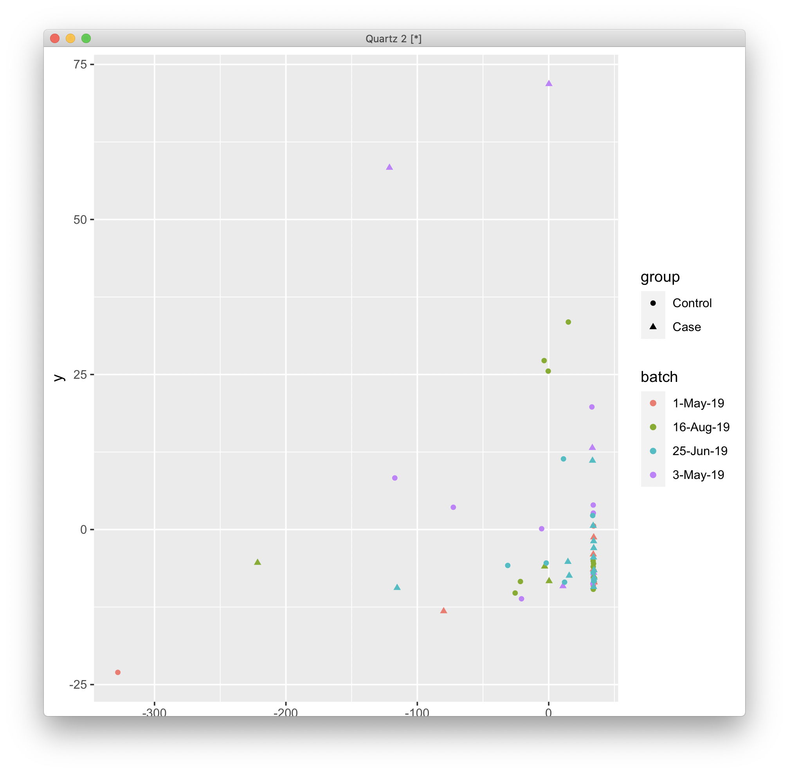

This has a weird distribution... I don't want to remve anyone yet, but it might
be needed in the future...

```r
# remove markers with at least one NA or Inf... introduced in the percentage calculation
data = data[rowSums(is.na(data)) == 0, ]
data = data[rowSums(data == Inf) == 0, ]
pp_order = c('zv', 'nzv')
pp = preProcess(t(data), method = pp_order)
X = predict(pp, t(data))
trans_quant = t(X)
set.seed(42)
pca <- prcomp(t(trans_quant), scale=TRUE)
eigs <- pca$sdev^2
nS = nScree(x=eigs)
keep_me = 1:nS$Components$nkaiser
std_dev <- pca$sdev
pr_var <- std_dev^2
prop_varex <- pr_var/sum(pr_var)
plot(prop_varex, xlab = "Principal Component",
             ylab = "Proportion of Variance Explained",
             type = "b")
```


Kaiser selects 19 this time, which is alright.

```r
mydata = data.frame(pca$x[, keep_me])
num_vars = c('pcnt_optical_duplicates', 'clusters', 'Age', 'RINe', 'PMI',
             'C1', 'C2', 'C3', 'C4', 'C5', 'C6', 'C7', 'C8', 'C9', 'C10')
pc_vars = colnames(mydata)
num_corrs = matrix(nrow=length(num_vars), ncol=length(pc_vars),
                   dimnames=list(num_vars, pc_vars))
num_pvals = num_corrs
for (x in num_vars) {
    for (y in pc_vars) {
        res = cor.test(meta[, x], mydata[, y])
        num_corrs[x, y] = res$estimate
        num_pvals[x, y] = res$p.value
    }
}

library(corrplot)
corrplot(t(num_corrs), method='color', tl.cex=.5, cl.cex=.5)
```

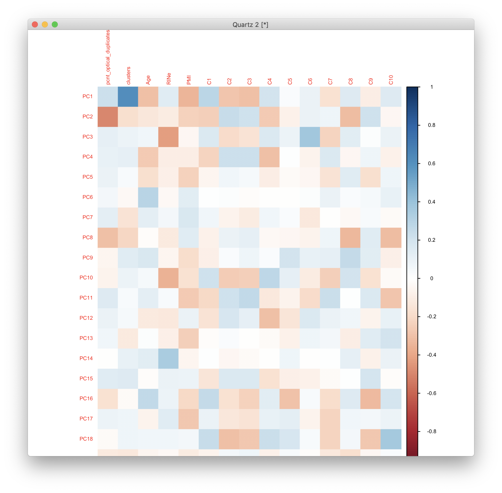

```r
categ_vars = c('batch', 'Diagnosis', 'MoD', 'substance_group',
               'comorbid_group', 'POP_CODE', 'Sex')
categ_corrs = matrix(nrow=length(categ_vars), ncol=length(pc_vars),
                   dimnames=list(categ_vars, pc_vars))
categ_pvals = categ_corrs
for (x in categ_vars) {
    for (y in pc_vars) {
        res = kruskal.test(mydata[, y], meta[, x])
        categ_corrs[x, y] = res$statistic
        categ_pvals[x, y] = res$p.value
    }
}
corrplot(t(categ_corrs), method='color', tl.cex=.5, cl.cex=.5, is.corr=F)
```

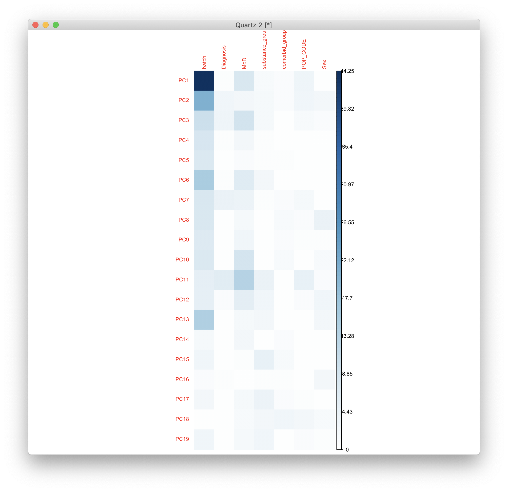

```
r$> which(num_pvals < .01, arr.ind = T)                                     
                        row col
clusters                  2   1
PMI                       5   1
pcnt_optical_duplicates   1   2
RINe                      4   3
C6                       11   3
RINe                      4  10
RINe                      4  14
C10                      15  18

r$> which(categ_pvals < .01, arr.ind = T)                                   
      row col
batch   1   1
batch   1   2
batch   1   6
MoD     3  11
batch   1  13
```

Let's remove 1, 2, 3, 6, 10, 11, 13, 14 and 18.

```r
form = (~ meta$Diagnosis + mydata$PC1 + mydata$PC2 + mydata$PC3 + mydata$PC6
        + mydata$PC10 + mydata$PC11 + mydata$PC13 + mydata$PC14 + mydata$PC18)
res = summary(lm.mp(t(trans_quant), form))
junk = data.frame(P.Value=res$pvalue['meta$DiagnosisCase',],
                  t=res$tstat['meta$DiagnosisCase',],
                  adj.P.Val=p.adjust(res$pvalue['meta$DiagnosisCase',],
                                     method='fdr'))
res_dx = merge(junk, meta_iso, by.x=0, by.y='id1')
res_dx = res_dx[order(res_dx$P.Value), ]

fname = '~/data/post_mortem/genotyping/1KG/merged_PM_1KG_PRS_12032020.csv'
prs = read.csv(fname)
prs$hbcc_brain_id = sapply(prs$IID,
                          function(x) {
                              br = strsplit(x, '_')[[1]][2];
                              as.numeric(gsub(br, pattern='BR',
                                              replacement=''))})
imWNH = data$C1 > 0 & data$C2 < -.075
wnh_brains = data[which(imWNH),]$hbcc_brain_id

# using the most appropriate PRS
m = merge(meta, prs, by='hbcc_brain_id')
prs_names = sapply(c(.0001, .001, .01, .1, .00005, .0005, .005, .05,
                      .5, .4, .3, .2),
                   function(x) sprintf('PRS%f', x))
m[, prs_names] = NA
keep_me = m$hbcc_brain_id %in% wnh_brains
m[keep_me, prs_names] = m[keep_me, 64:75]
m[!keep_me, prs_names] = m[!keep_me, 52:63]
data_app = m[, c(1:50, 76:87)]
data_app = data_app[order(data_app$submitted_name),]

# first sample doesn't have prs
trans_quant2 = trans_quant[, 2:ncol(trans_quant)]
mydata2 = mydata[2:nrow(mydata), ]

prs_names = sapply(c(.0001, .001, .01, .1, .00005, .0005, .005, .05,
                      .5, .4, .3, .2),
                   function(x) sprintf('PRS%f', x))
all_res = c()
for (p in prs_names) {
    cat(p, '\n')
    p_str = sprintf('data_app$%s', p)
    form = as.formula(sprintf('~ %s + mydata2$PC1 + mydata2$PC2 + mydata2$PC3 +
                               mydata2$PC6 + mydata2$PC10 + mydata2$PC11 +
                               mydata2$PC13 + mydata2$PC14 + mydata2$PC18',
                              p_str))
    res = summary(lm.mp(t(trans_quant2), form))
    junk = data.frame(P.Value=res$pvalue[p_str,], t=res$tstat[p_str,],
                      adj.P.Val=p.adjust(res$pvalue[p_str,], method='fdr'))
    res_prs = merge(junk, meta_iso, by.x=0, by.y='id1')
    res_prs = res_prs[order(res_prs$P.Value), ]
    for (t in c(.05, .01, .005, .001)) {
        prs_genes = res_prs[res_prs$P.Value < t, 'hgnc_symbol']
        dx_genes = res_dx[res_dx$P.Value < t, 'hgnc_symbol']
        go.obj <- newGeneOverlap(prs_genes, dx_genes, genome.size=nrow(res_prs))
        go.obj <- testGeneOverlap(go.obj)
        inter = intersect(prs_genes, dx_genes)
        pval = getPval(go.obj)
        this_res = c(p, t, length(prs_genes), length(dx_genes), length(inter),
                     pval)
        all_res = rbind(all_res, this_res)
    }
}
colnames(all_res) = c('PRS', 'nomPvalThresh', 'PRsgenes', 'PMgenes',
                      'overlap', 'pval')
write.csv(all_res, file='~/data/isoforms/DTU_acc_prs_overlap_results.csv',
          row.names=F)
```

And repeat the same stuff for Caudate:

```r
myregion = 'Caudate'

idx = samples$Region==myregion
meta = samples[idx, ]
data = data_pct[, idx]
rownames(data) = meta_iso[,'id1']
# remove markers with at least one NA or Inf... introduced in the percentage calculation
data = data[rowSums(is.na(data)) == 0, ]
data = data[rowSums(data == Inf) == 0, ]
pp_order = c('zv', 'nzv')
pp = preProcess(t(data), method = pp_order)
X = predict(pp, t(data))
trans_quant = t(X)
set.seed(42)
pca <- prcomp(t(trans_quant), scale=TRUE)
eigs <- pca$sdev^2
nS = nScree(x=eigs)
keep_me = 1:nS$Components$nkaiser
std_dev <- pca$sdev
pr_var <- std_dev^2
prop_varex <- pr_var/sum(pr_var)
plot(prop_varex, xlab = "Principal Component",
             ylab = "Proportion of Variance Explained",
             type = "b")
```

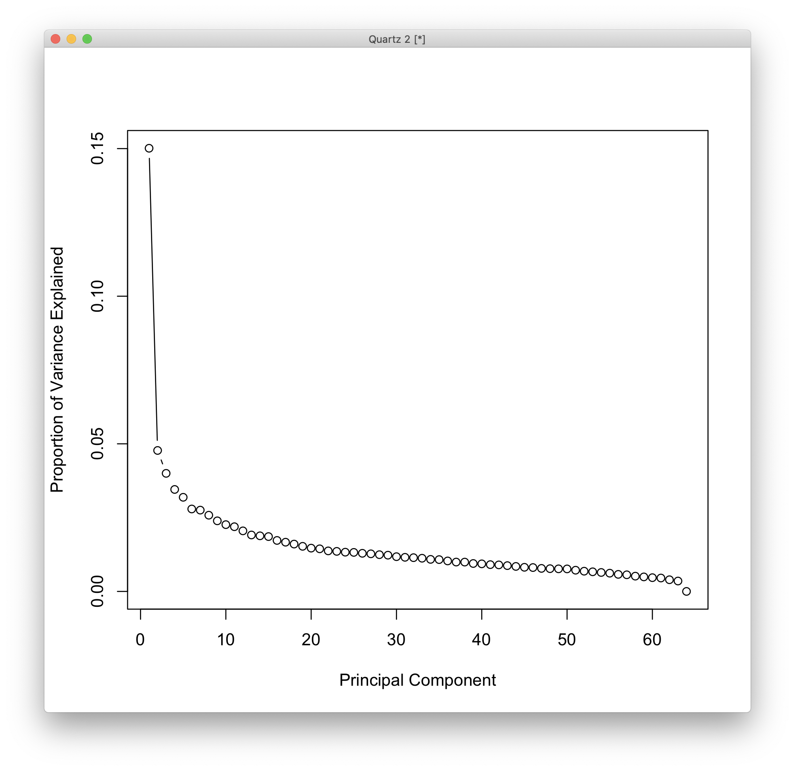

Kaiser selects 18 this time, which is alright.

```r
mydata = data.frame(pca$x[, keep_me])
num_vars = c('pcnt_optical_duplicates', 'clusters', 'Age', 'RINe', 'PMI',
             'C1', 'C2', 'C3', 'C4', 'C5', 'C6', 'C7', 'C8', 'C9', 'C10')
pc_vars = colnames(mydata)
num_corrs = matrix(nrow=length(num_vars), ncol=length(pc_vars),
                   dimnames=list(num_vars, pc_vars))
num_pvals = num_corrs
for (x in num_vars) {
    for (y in pc_vars) {
        res = cor.test(meta[, x], mydata[, y])
        num_corrs[x, y] = res$estimate
        num_pvals[x, y] = res$p.value
    }
}
corrplot(t(num_corrs), method='color', tl.cex=.5, cl.cex=.5)
```

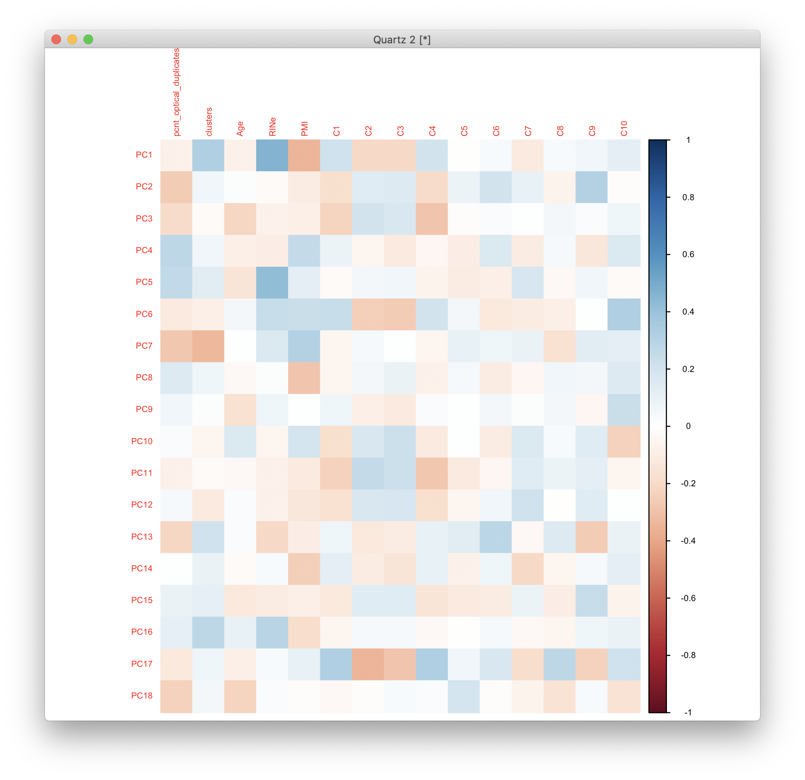

```r
categ_vars = c('batch', 'Diagnosis', 'MoD', 'substance_group',
               'comorbid_group', 'POP_CODE', 'Sex')
categ_corrs = matrix(nrow=length(categ_vars), ncol=length(pc_vars),
                   dimnames=list(categ_vars, pc_vars))
categ_pvals = categ_corrs
for (x in categ_vars) {
    for (y in pc_vars) {
        res = kruskal.test(mydata[, y], meta[, x])
        categ_corrs[x, y] = res$statistic
        categ_pvals[x, y] = res$p.value
    }
}
corrplot(t(categ_corrs), method='color', tl.cex=.5, cl.cex=.5, is.corr=F)
```

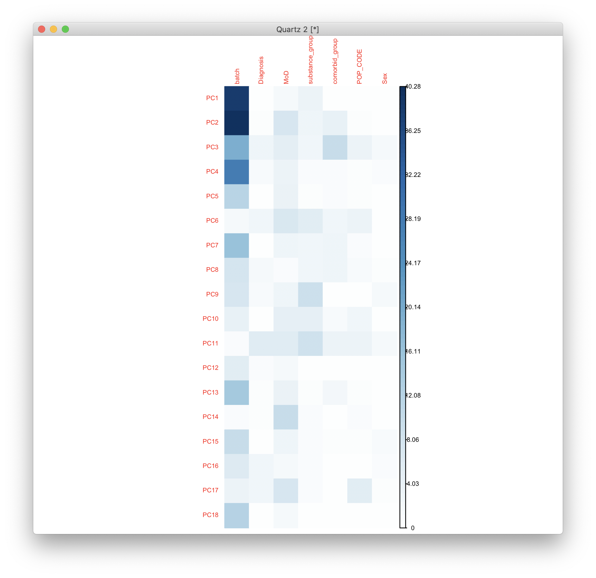

```
r$> which(num_pvals < .01, arr.ind = T)                                     
         row col
clusters   2   1
RINe       4   1
PMI        5   1
RINe       4   5
C10       15   6
clusters   2   7
C1         6  17
C2         7  17
C4         9  17

r$> which(categ_pvals < .01, arr.ind = T)                                   
               row col
batch            1   1
batch            1   2
batch            1   3
comorbid_group   5   3
batch            1   4
batch            1   7
batch            1  13
```

Let's remove 1, 2, 3, 4, 5, 6, 7, 13, and 17.

```r
form = (~ meta$Diagnosis + mydata$PC1 + mydata$PC2 + mydata$PC3 + mydata$PC4
        + mydata$PC5 + mydata$PC6 + mydata$PC6 + mydata$PC7 + mydata$PC13
        + mydata$PC17)
res = summary(lm.mp(t(trans_quant), form))
junk = data.frame(P.Value=res$pvalue['meta$DiagnosisCase',],
                  t=res$tstat['meta$DiagnosisCase',],
                  adj.P.Val=p.adjust(res$pvalue['meta$DiagnosisCase',],
                                     method='fdr'))
res_dx = merge(junk, meta_iso, by.x=0, by.y='id1')
res_dx = res_dx[order(res_dx$P.Value), ]

fname = '~/data/post_mortem/genotyping/1KG/merged_PM_1KG_PRS_12032020.csv'
prs = read.csv(fname)
prs$hbcc_brain_id = sapply(prs$IID,
                          function(x) {
                              br = strsplit(x, '_')[[1]][2];
                              as.numeric(gsub(br, pattern='BR',
                                              replacement=''))})
imWNH = data$C1 > 0 & data$C2 < -.075
wnh_brains = data[which(imWNH),]$hbcc_brain_id

# using the most appropriate PRS
m = merge(meta, prs, by='hbcc_brain_id')
prs_names = sapply(c(.0001, .001, .01, .1, .00005, .0005, .005, .05,
                      .5, .4, .3, .2),
                   function(x) sprintf('PRS%f', x))
m[, prs_names] = NA
keep_me = m$hbcc_brain_id %in% wnh_brains
m[keep_me, prs_names] = m[keep_me, 64:75]
m[!keep_me, prs_names] = m[!keep_me, 52:63]
data_app = m[, c(1:50, 76:87)]
data_app = data_app[order(data_app$submitted_name),]

# first sample doesn't have prs
trans_quant2 = trans_quant[, 2:ncol(trans_quant)]
mydata2 = mydata[2:nrow(mydata), ]

prs_names = sapply(c(.0001, .001, .01, .1, .00005, .0005, .005, .05,
                      .5, .4, .3, .2),
                   function(x) sprintf('PRS%f', x))
all_res = c()
for (p in prs_names) {
    cat(p, '\n')
    p_str = sprintf('data_app$%s', p)
    form = as.formula(sprintf('~ %s + mydata2$PC1 + mydata2$PC2 + mydata2$PC3 +
                               mydata2$PC4 + mydata2$PC5 + mydata2$PC6 +
                               mydata2$PC6 + mydata2$PC7 + mydata2$PC13 +
                               mydata2$PC17',
                              p_str))
    res = summary(lm.mp(t(trans_quant2), form))
    junk = data.frame(P.Value=res$pvalue[p_str,], t=res$tstat[p_str,],
                      adj.P.Val=p.adjust(res$pvalue[p_str,], method='fdr'))
    res_prs = merge(junk, meta_iso, by.x=0, by.y='id1')
    res_prs = res_prs[order(res_prs$P.Value), ]
    for (t in c(.05, .01, .005, .001)) {
        prs_genes = res_prs[res_prs$P.Value < t, 'hgnc_symbol']
        dx_genes = res_dx[res_dx$P.Value < t, 'hgnc_symbol']
        go.obj <- newGeneOverlap(prs_genes, dx_genes, genome.size=nrow(res_prs))
        go.obj <- testGeneOverlap(go.obj)
        inter = intersect(prs_genes, dx_genes)
        pval = getPval(go.obj)
        this_res = c(p, t, length(prs_genes), length(dx_genes), length(inter),
                     pval)
        all_res = rbind(all_res, this_res)
    }
}
colnames(all_res) = c('PRS', 'nomPvalThresh', 'PRsgenes', 'PMgenes',
                      'overlap', 'pval')
write.csv(all_res, file='~/data/isoforms/DTU_caudate_prs_overlap_results.csv',
          row.names=F)
```

Again, results are highly significant... 

## Gene enrichment

Let's see if we find any enrichment for the DX results. Just so I don't have to
keep re-running it all the time, I'll run the code above and save it in a RData
file.

```r
library(WebGestaltR)
library(tidyverse)
data_dir = '~/data/isoforms/'
load(sprintf('%s/DX_dte_dtu_results_12102020.RData', data_dir))
ncpu=7

for (md in c('dte', 'dtu')) {
    for (region in c('acc', 'caudate')) {
        eval(parse(text=sprintf('tmp = %s_%s_dx', md, region)))
        # selecting the best probe hit to run enrichment with
        res = tmp %>% group_by(hgnc_symbol) %>%
              slice_min(n=1, P.Value, with_ties=F)
        res = as.data.frame(res)

        ranks = -log(res$P.Value) * sign(res$t)
        tmp2 = data.frame(hgnc_symbol=res$hgnc_symbol, rank=ranks)
        tmp2 = tmp2[order(ranks, decreasing=T),]

        # my own GMTs
        db = sprintf('my_%s_sets', region)
        cat(md, region, db, '\n')
        project_name = sprintf('%s_%s_%s', md, region, db)
        db_file = sprintf('~/data/post_mortem/%s.gmt', db)
        enrichResult <- WebGestaltR(enrichMethod="GSEA",
                                    organism="hsapiens",
                                    enrichDatabaseFile=db_file,
                                    enrichDatabaseType="genesymbol",
                                    interestGene=tmp2,
                                    outputDirectory = data_dir,
                                    interestGeneType="genesymbol",
                                    sigMethod="top", topThr=150000,
                                    minNum=3, projectName=project_name,
                                    isOutput=T, isParallel=T,
                                    nThreads=ncpu, perNum=10000, maxNum=800)
        out_fname = sprintf('%s/WG3_%s_%s_%s_10K.csv', data_dir, md, region, db)
        write.csv(enrichResult, file=out_fname, row.names=F)

        DBs = c('geneontology_Biological_Process_noRedundant',
            'geneontology_Cellular_Component_noRedundant',
            'geneontology_Molecular_Function_noRedundant')
        for (db in DBs) {
            cat(md, region, db, '\n')
            project_name = sprintf('%s_%s_%s', md, region, db)
            enrichResult <- WebGestaltR(enrichMethod="GSEA",
                                        organism="hsapiens",
                                        enrichDatabase=db,
                                        interestGene=tmp2,
                                        interestGeneType="genesymbol",
                                        sigMethod="top", topThr=150000,
                                        outputDirectory = data_dir,
                                        minNum=5, projectName=project_name,
                                        isOutput=T, isParallel=T,
                                        nThreads=ncpu, perNum=10000, maxNum=800)
            out_fname = sprintf('%s/WG3_%s_%s_%s_10K.csv', data_dir,
                                md, region, db)
            write.csv(enrichResult, file=out_fname, row.names=F)
        }
    }
}
```

## Type-sliced transcripts

First, let's see if our FDR results change at all if we slice the transcripts based
on their types:

```r
load(sprintf('%s/DX_dte_dtu_results_12102020.RData', data_dir))

for (md in c('dte', 'dtu')) {
    for (region in c('acc', 'caudate')) {
        eval(parse(text=sprintf('tmp = %s_%s_dx', md, region)))
        for (dt in c('protein_coding$', 'lncRNA$', 'pseudogene$')) {
            idx = grepl(x=tmp$read_type, pattern=dt)
            res = tmp[idx, ]
            tmp$FDR = p.adjust(tmp$P.Value, method='fdr')
            print(sprintf('%s, %s, %s = %d / %d', md, region, dt,
                          sum(tmp$FDR<.1), nrow(res)))
        }
    }
}
```

```
[1] "dte, acc, protein_coding$ = 0 / 66771"
[1] "dte, acc, lncRNA$ = 0 / 49450"
[1] "dte, acc, pseudogene$ = 0 / 8348"
[1] "dte, caudate, protein_coding$ = 0 / 66154"
[1] "dte, caudate, lncRNA$ = 0 / 48287"
[1] "dte, caudate, pseudogene$ = 0 / 8038"
[1] "dtu, acc, protein_coding$ = 0 / 61490"
[1] "dtu, acc, lncRNA$ = 0 / 35070"
[1] "dtu, acc, pseudogene$ = 0 / 439"
[1] "dtu, caudate, protein_coding$ = 0 / 61214"
[1] "dtu, caudate, lncRNA$ = 0 / 34556"
[1] "dtu, caudate, pseudogene$ = 0 / 437"
```

So, the slicing didn't change the results at all. Let's see if it changes the
WebGestalt results... note that lncRNA was breaking the Molecular function
database!

```r
library(WebGestaltR)
library(tidyverse)
data_dir = '~/data/isoforms/'
load(sprintf('%s/DX_dte_dtu_results_12102020.RData', data_dir))
nncpu=7

for (md in c('dte', 'dtu')) {
    for (region in c('acc', 'caudate')) {
        eval(parse(text=sprintf('tmp = %s_%s_dx', md, region)))
        for (dt in c('protein_coding', 'pseudogene', 'lncRNA')) {
            idx = grepl(x=tmp$read_type, pattern=sprintf('%s$', dt))
            res = tmp[idx, ]
            # selecting the best probe hit to run enrichment with
            res = res %>% group_by(hgnc_symbol) %>%
                  slice_min(n=1, P.Value, with_ties=F)
            res = as.data.frame(res)

            ranks = -log(res$P.Value) * sign(res$t)
            tmp2 = data.frame(hgnc_symbol=res$hgnc_symbol, rank=ranks)
            tmp2 = tmp2[order(ranks, decreasing=T),]

            # my own GMTs
            db = sprintf('my_%s_sets', region)
            cat(md, region, dt, db, '\n')
            project_name = sprintf('%s_%s_%s_%s', md, region, dt, db)
            db_file = sprintf('~/data/post_mortem/%s.gmt', db)
            # some sets are crapping out WG because nothing is in it!
            enrichResult <- try(WebGestaltR(enrichMethod="GSEA",
                                        organism="hsapiens",
                                        enrichDatabaseFile=db_file,
                                        enrichDatabaseType="genesymbol",
                                        interestGene=tmp2,
                                        outputDirectory = data_dir,
                                        interestGeneType="genesymbol",
                                        sigMethod="top", topThr=150000,
                                        minNum=3, projectName=project_name,
                                        isOutput=T, isParallel=T,
                                        nThreads=ncpu, perNum=10000, maxNum=800))
            if (class(enrichResult) != "try-error") {
                out_fname = sprintf('%s/WG3_%s_%s_%s_%s_10K.csv', data_dir, md,
                                region, dt, db)
                write.csv(enrichResult, file=out_fname, row.names=F)
            }

            DBs = c('geneontology_Biological_Process_noRedundant',
                    'geneontology_Cellular_Component_noRedundant',
                    'geneontology_Molecular_Function_noRedundant')
            for (db in DBs) {
                cat(md, region, dt, db, '\n')
                project_name = sprintf('%s_%s_%s_%s', md, region, dt, db)
                enrichResult <- try(WebGestaltR(enrichMethod="GSEA",
                                            organism="hsapiens",
                                            enrichDatabase=db,
                                            interestGene=tmp2,
                                            interestGeneType="genesymbol",
                                            sigMethod="top", topThr=150000,
                                            outputDirectory = data_dir,
                                            minNum=5, projectName=project_name,
                                            isOutput=T, isParallel=T,
                                            nThreads=ncpu, perNum=10000, maxNum=800))
                if (class(enrichResult) != "try-error") {
                    out_fname = sprintf('%s/WG3_%s_%s_%s_%s_10K.csv', data_dir,
                                        md, region, dt, db)
                    write.csv(enrichResult, file=out_fname, row.names=F)
                }
            }
        }
    }
}
```

And for PRS (have to rerun the code above to retrieve the PCs!):

```r
# ...
    for (t in c(.05, .01, .005, .001)) {
        for (dt in c('protein_coding', 'lncRNA', 'pseudogene')) {
            idx = grepl(x=res_prs$read_type, pattern=sprintf('%s$', dt))
            res_prs2 = res_prs[idx, ]
            idx = grepl(x=res_dx$read_type, pattern=sprintf('%s$', dt))
            res_dx2 = res_dx[idx, ]

            prs_genes = res_prs2[res_prs2$P.Value < t, 'hgnc_symbol']
            dx_genes = res_dx2[res_dx2$P.Value < t, 'hgnc_symbol']
            go.obj <- newGeneOverlap(prs_genes, dx_genes,
                                     genome.size=nrow(res_prs2))
            go.obj <- testGeneOverlap(go.obj)
            inter = intersect(prs_genes, dx_genes)
            pval = getPval(go.obj)
            this_res = c(dt, p, t, length(prs_genes), length(dx_genes),
                         length(inter), pval)
            all_res = rbind(all_res, this_res)
        }
    }
}
colnames(all_res) = c('read_type', 'PRS', 'nomPvalThresh', 'PRsgenes', 'PMgenes',
                      'overlap', 'pval')
write.csv(all_res,
          file='~/data/isoforms/DTUsplit_caudate_prs_overlap_results.csv',
          row.names=F)
```

# 2020-12-11 07:07:58

Let's redo this isoform analysis just keeping the autossomes.

```r
df = read.delim('~/data/isoforms/shaw_adhd.rsem_output.tpm.tsv')
a = lapply(df[,1], function(x) strsplit(as.character(x), split="\\|"))
meta_iso = t(data.frame(a))
colnames(meta_iso) = c('id1', 'ensembleID', 'id2', 'id3', 'iso_name',
                        'hgnc_symbol','id4', 'read_type')
rownames(meta_iso) = NULL
meta_iso = as.data.frame(meta_iso)
data_iso = df[, 2:ncol(df)] 
rownames(data_iso) = meta_iso$id1

# library('biomaRt')
# mart <- useDataset("hsapiens_gene_ensembl", useMart("ensembl"))
# a = getBM(attributes= c("ensembl_gene_id", "hgnc_symbol", "chromosome_name"),
#           mart=mart)
# saveRDS(a, file='~/data/post_mortem/ensemble_annot.rds')
a = readRDS('~/data/post_mortem/ensemble_annot.rds')
m = merge(meta_iso, a, by='hgnc_symbol', all.x=T)
keep_me = c()
for (i in 1:22) {
    keep_me = c(keep_me, which((m$chromosome_name==i))) 
}
meta_iso = m[keep_me, ]
# making sure they're properly aligned
data_iso = data_iso[meta_iso$id1, ]

# let's add some sample data
fname = '~/data/rnaseq_derek/UPDATED_file_for_derek_add_cause_of_death.csv'
df = read.csv(fname)
df = df[!duplicated(df$submitted_name),]
sn = gsub(x=rownames(data), pattern='X', replacement='')
pop_code = read.csv('~/data/rnaseq_derek/file_pop.csv')
m = merge(df, pop_code, by='hbcc_brain_id')
pcs = read.table('~/data/rnaseq_derek/HM3_b37mds.mds', header=1)
myids = sapply(1:nrow(pcs),
               function(x) as.numeric(gsub('BR', '',
                                           strsplit(as.character(pcs[x,'IID']),
                                                    '_')[[1]][1])))
pcs$numids = myids
data = merge(m, pcs, by.x='hbcc_brain_id', by.y='numids', all.x=T, all.y=F)
data$POP_CODE = as.character(data$POP_CODE)
data[data$POP_CODE=='WNH', 'POP_CODE'] = 'W'
data[data$POP_CODE=='WH', 'POP_CODE'] = 'W'
data$POP_CODE = factor(data$POP_CODE)
data$Individual = factor(data$hbcc_brain_id)
data[data$Manner.of.Death=='Suicide (probable)', 'Manner.of.Death'] = 'Suicide'
data[data$Manner.of.Death=='unknown', 'Manner.of.Death'] = 'natural'
data$MoD = factor(data$Manner.of.Death)
data$batch = factor(data$run_date)
data$Diagnosis = factor(data$Diagnosis, levels=c('Control', 'Case'))

more = readRDS('~/data/rnaseq_derek/data_from_philip_POP_and_PCs.rds')
more = more[!duplicated(more$hbcc_brain_id),]
data = merge(data, more[, c('hbcc_brain_id', 'comorbid', 'comorbid_group',
                            'substance', 'substance_group')],
             by='hbcc_brain_id', all.x=T, all.y=F)

samples = data

# align data and samples without merging them
samples = samples[order(samples$submitted_name),]
sn = gsub(x=colnames(data_iso), pattern='X', replacement='')
colnames(data_iso) = sn
data_iso = data_iso[, order(colnames(data_iso))]

myregion = 'ACC'

idx = samples$Region==myregion
meta = samples[idx, ]
data = data_iso[, idx]

# remove some bad variables
library(caret)
set.seed(42)
pp_order = c('zv', 'nzv')
pp = preProcess(t(data), method = pp_order)
X = predict(pp, t(data))
trans_quant = t(X)

library(edgeR)
library(ggplot2)
set.seed(42)
mds = plotMDS(trans_quant, plot=F)
plot_data = data.frame(x=mds$x, y=mds$y,
                       batch=meta$batch,
                       group=meta$Diagnosis)
quartz()
ggplot(plot_data, aes(x=x, y=y, shape=group, color=batch)) + geom_point()
```

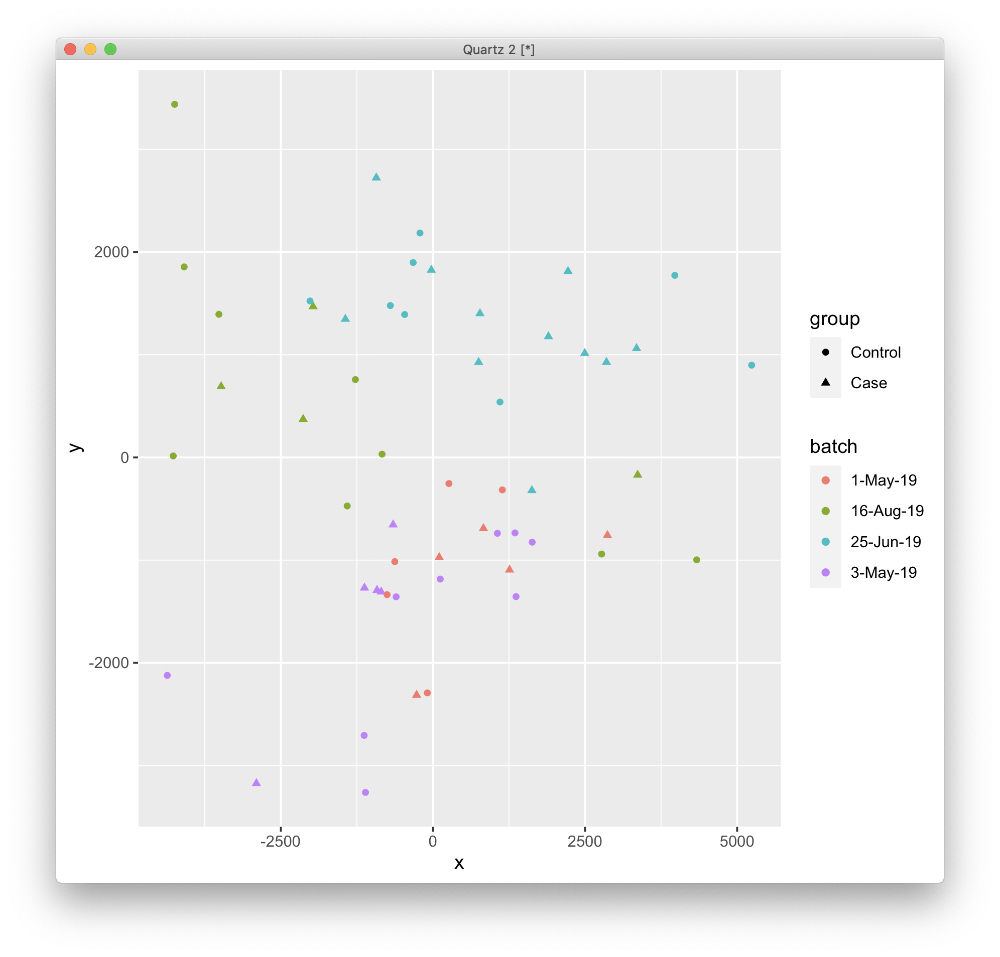

We have a clear batch effect, but I don't think there are any clear outliers. We
could potentiall remove the one sample in the top left, but I don't think it's
necessary.

Let's then set up our usual PCA analysis:

```r
set.seed(42)
pca <- prcomp(t(trans_quant), scale=TRUE)
library(nFactors)
eigs <- pca$sdev^2
nS = nScree(x=eigs)
keep_me = 1:nS$Components$nkaiser

std_dev <- pca$sdev
pr_var <- std_dev^2
prop_varex <- pr_var/sum(pr_var)
plot(prop_varex, xlab = "Principal Component",
             ylab = "Proportion of Variance Explained",
             type = "b")
```

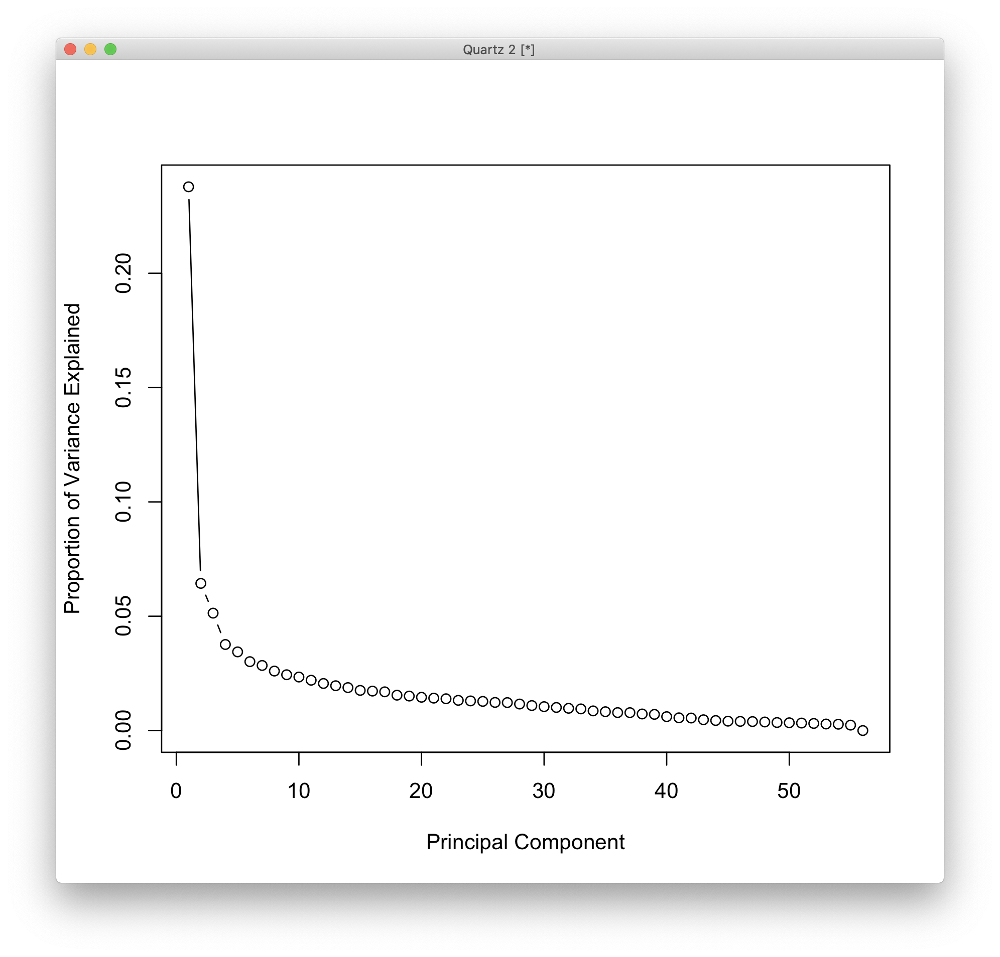

Kaiser selects 14 as well.

```r
mydata = data.frame(pca$x[, keep_me])
num_vars = c('pcnt_optical_duplicates', 'clusters', 'Age', 'RINe', 'PMI',
             'C1', 'C2', 'C3', 'C4', 'C5', 'C6', 'C7', 'C8', 'C9', 'C10')
pc_vars = colnames(mydata)
num_corrs = matrix(nrow=length(num_vars), ncol=length(pc_vars),
                   dimnames=list(num_vars, pc_vars))
num_pvals = num_corrs
for (x in num_vars) {
    for (y in pc_vars) {
        res = cor.test(meta[, x], mydata[, y])
        num_corrs[x, y] = res$estimate
        num_pvals[x, y] = res$p.value
    }
}

categ_vars = c('batch', 'Diagnosis', 'MoD', 'substance_group',
               'comorbid_group', 'POP_CODE', 'Sex')
categ_corrs = matrix(nrow=length(categ_vars), ncol=length(pc_vars),
                   dimnames=list(categ_vars, pc_vars))
categ_pvals = categ_corrs
for (x in categ_vars) {
    for (y in pc_vars) {
        res = kruskal.test(mydata[, y], meta[, x])
        categ_corrs[x, y] = res$statistic
        categ_pvals[x, y] = res$p.value
    }
}
```

```
r$> which(num_pvals < .01, arr.ind = T)
                        row col
clusters                  2   1
PMI                       5   1
pcnt_optical_duplicates   1   2
RINe                      4   3
C6                       11   3

r$> which(categ_pvals < .01, arr.ind = T)
      row col
batch   1   1
batch   1   2
batch   1   3
batch   1   5
batch   1   6
batch   1   9
batch   1  14

r$> min(categ_pvals['Diagnosis',])
[1] 0.0764304

```

OK, so let's remove PCs 1, 2, 3, 5, 6, 9, and 14.

```r
library(vows)
form = (~ meta$Diagnosis + mydata$PC1 + mydata$PC2 + mydata$PC3 + mydata$PC5
        + mydata$PC6 + mydata$PC9 + mydata$PC14)
res = summary(lm.mp(t(trans_quant), form))
junk = data.frame(P.Value=res$pvalue['meta$DiagnosisCase',],
                  t=res$tstat['meta$DiagnosisCase',],
                  adj.P.Val=p.adjust(res$pvalue['meta$DiagnosisCase',],
                                     method='fdr'))
res_dx = merge(junk, meta_iso, by.x=0, by.y='id1')
res_dx = res_dx[order(res_dx$P.Value), ]
```

And do the same for PRS:

```r
fname = '~/data/post_mortem/genotyping/1KG/merged_PM_1KG_PRS_12032020.csv'
prs = read.csv(fname)
prs$hbcc_brain_id = sapply(prs$IID,
                          function(x) {
                              br = strsplit(x, '_')[[1]][2];
                              as.numeric(gsub(br, pattern='BR',
                                              replacement=''))})
imWNH = data$C1 > 0 & data$C2 < -.075
wnh_brains = data[which(imWNH),]$hbcc_brain_id

# using the most appropriate PRS
m = merge(meta, prs, by='hbcc_brain_id')
prs_names = sapply(c(.0001, .001, .01, .1, .00005, .0005, .005, .05,
                      .5, .4, .3, .2),
                   function(x) sprintf('PRS%f', x))
m[, prs_names] = NA
keep_me = m$hbcc_brain_id %in% wnh_brains
m[keep_me, prs_names] = m[keep_me, 64:75]
m[!keep_me, prs_names] = m[!keep_me, 52:63]
data_app = m[, c(1:50, 76:87)]
data_app = data_app[order(data_app$submitted_name),]

library(GeneOverlap)

# first sample doesn't have prs
trans_quant2 = trans_quant[, 2:ncol(trans_quant)]
mydata2 = mydata[2:nrow(mydata), ]

prs_names = sapply(c(.0001, .001, .01, .1, .00005, .0005, .005, .05,
                      .5, .4, .3, .2),
                   function(x) sprintf('PRS%f', x))
all_res = c()
for (p in prs_names) {
    cat(p, '\n')
    p_str = sprintf('data_app$%s', p)
    form = as.formula(sprintf('~ %s + mydata2$PC1 + mydata2$PC2 + mydata2$PC3 +
                              mydata2$PC5 + mydata2$PC6 + mydata2$PC9 +
                              mydata2$PC14', p_str))
    res = summary(lm.mp(t(trans_quant2), form))
    junk = data.frame(P.Value=res$pvalue[p_str,], t=res$tstat[p_str,],
                      adj.P.Val=p.adjust(res$pvalue[p_str,], method='fdr'))
    res_prs = merge(junk, meta_iso, by.x=0, by.y='id1')
    res_prs = res_prs[order(res_prs$P.Value), ]
    for (t in c(.05, .01, .005, .001)) {
        prs_genes = res_prs[res_prs$P.Value < t, 'hgnc_symbol']
        dx_genes = res_dx[res_dx$P.Value < t, 'hgnc_symbol']
        go.obj <- newGeneOverlap(prs_genes, dx_genes, genome.size=nrow(res_prs))
        go.obj <- testGeneOverlap(go.obj)
        inter = intersect(prs_genes, dx_genes)
        pval = getPval(go.obj)
        this_res = c(p, t, length(prs_genes), length(dx_genes), length(inter),
                     pval)
        all_res = rbind(all_res, this_res)
    }
}
colnames(all_res) = c('PRS', 'nomPvalThresh', 'PRsgenes', 'PMgenes',
                      'overlap', 'pval')
write.csv(all_res, file='~/data/isoforms/DTEautoOnly_acc_prs_overlap_results.csv',
          row.names=F)
```

And WG:

```r
library(WebGestaltR)
library(tidyverse)
data_dir = '~/data/isoforms/'
region = 'acc'
md='dte'
ncpu=7

tmp = res_dx
# selecting the best probe hit to run enrichment with
res = tmp %>% group_by(hgnc_symbol) %>%
    slice_min(n=1, P.Value, with_ties=F)
res = as.data.frame(res)

ranks = -log(res$P.Value) * sign(res$t)
tmp2 = data.frame(hgnc_symbol=res$hgnc_symbol, rank=ranks)
tmp2 = tmp2[order(ranks, decreasing=T),]

# my own GMTs
db = sprintf('my_%s_sets', region)
cat(md, region, db, '\n')
project_name = sprintf('autoOnly%s_%s_%s', md, region, db)
db_file = sprintf('~/data/post_mortem/%s.gmt', db)
enrichResult <- WebGestaltR(enrichMethod="GSEA",
                            organism="hsapiens",
                            enrichDatabaseFile=db_file,
                            enrichDatabaseType="genesymbol",
                            interestGene=tmp2,
                            outputDirectory = data_dir,
                            interestGeneType="genesymbol",
                            sigMethod="top", topThr=150000,
                            minNum=3, projectName=project_name,
                            isOutput=T, isParallel=T,
                            nThreads=ncpu, perNum=10000, maxNum=800)
out_fname = sprintf('%s/WG3autoOnly_%s_%s_%s_10K.csv', data_dir, md, region, db)
write.csv(enrichResult, file=out_fname, row.names=F)

DBs = c('geneontology_Biological_Process_noRedundant',
    'geneontology_Cellular_Component_noRedundant',
    'geneontology_Molecular_Function_noRedundant')
for (db in DBs) {
    cat(md, region, db, '\n')
    project_name = sprintf('autoOnly%s_%s_%s', md, region, db)
    enrichResult <- WebGestaltR(enrichMethod="GSEA",
                                organism="hsapiens",
                                enrichDatabase=db,
                                interestGene=tmp2,
                                interestGeneType="genesymbol",
                                sigMethod="top", topThr=150000,
                                outputDirectory = data_dir,
                                minNum=5, projectName=project_name,
                                isOutput=T, isParallel=T,
                                nThreads=ncpu, perNum=10000, maxNum=800)
    out_fname = sprintf('%s/WG3autoOnly_%s_%s_%s_10K.csv', data_dir,
                        md, region, db)
    write.csv(enrichResult, file=out_fname, row.names=F)
}
```

And repeat the same story for Caudate:

```r
myregion = 'Caudate'

idx = samples$Region==myregion
meta = samples[idx, ]
data = data_iso[, idx]

# remove some bad variables
library(caret)
set.seed(42)
pp_order = c('zv', 'nzv')
pp = preProcess(t(data), method = pp_order)
X = predict(pp, t(data))
trans_quant = t(X)

library(edgeR)
library(ggplot2)
set.seed(42)
mds = plotMDS(trans_quant, plot=F)
plot_data = data.frame(x=mds$x, y=mds$y,
                       batch=meta$batch,
                       group=meta$Diagnosis)
quartz()
ggplot(plot_data, aes(x=x, y=y, shape=group, color=batch)) + geom_point()
```

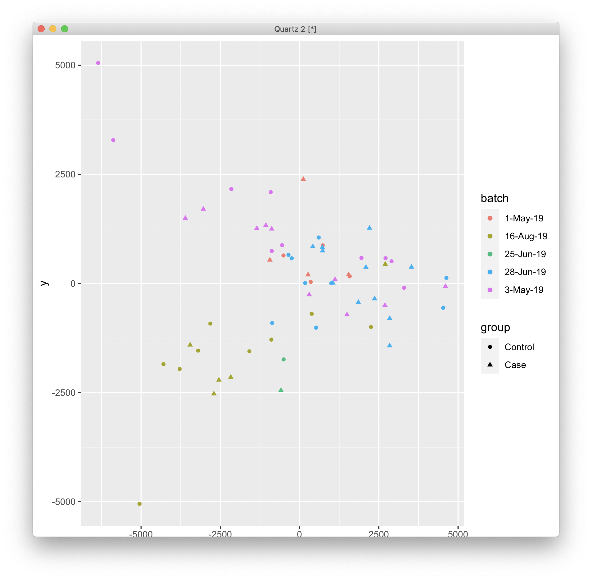

We have a clear batch effect and a few outliers. Let's remove them and re-run
the pre-processing, before doing PCA:

```r
mds_good = mds$y < 2500 & mds$y > -3000
meta = meta[mds_good, ]
trans_quant = trans_quant[, mds_good]

set.seed(42)
pp_order = c('zv', 'nzv')
pp = preProcess(t(trans_quant), method = pp_order)
X = predict(pp, t(trans_quant))
trans_quant = t(X)

set.seed(42)
pca <- prcomp(t(trans_quant), scale=TRUE)
library(nFactors)
eigs <- pca$sdev^2
nS = nScree(x=eigs)
keep_me = 1:nS$Components$nkaiser

std_dev <- pca$sdev
pr_var <- std_dev^2
prop_varex <- pr_var/sum(pr_var)
plot(prop_varex, xlab = "Principal Component",
             ylab = "Proportion of Variance Explained",
             type = "b")
```

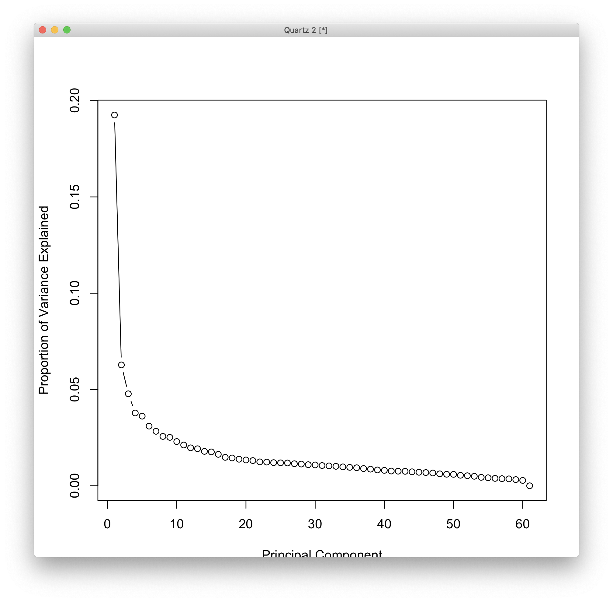

Kaiser selects 15 this time.

```r
mydata = data.frame(pca$x[, keep_me])
num_vars = c('pcnt_optical_duplicates', 'clusters', 'Age', 'RINe', 'PMI',
             'C1', 'C2', 'C3', 'C4', 'C5', 'C6', 'C7', 'C8', 'C9', 'C10')
pc_vars = colnames(mydata)
num_corrs = matrix(nrow=length(num_vars), ncol=length(pc_vars),
                   dimnames=list(num_vars, pc_vars))
num_pvals = num_corrs
for (x in num_vars) {
    for (y in pc_vars) {
        res = cor.test(meta[, x], mydata[, y])
        num_corrs[x, y] = res$estimate
        num_pvals[x, y] = res$p.value
    }
}

categ_vars = c('batch', 'Diagnosis', 'MoD', 'substance_group',
               'comorbid_group', 'POP_CODE', 'Sex')
categ_corrs = matrix(nrow=length(categ_vars), ncol=length(pc_vars),
                   dimnames=list(categ_vars, pc_vars))
categ_pvals = categ_corrs
for (x in categ_vars) {
    for (y in pc_vars) {
        res = kruskal.test(mydata[, y], meta[, x])
        categ_corrs[x, y] = res$statistic
        categ_pvals[x, y] = res$p.value
    }
}
```

```
r$> which(num_pvals < .01, arr.ind = T)           
                        row col
clusters                  2   1
RINe                      4   1
PMI                       5   1
pcnt_optical_duplicates   1   3
RINe                      4   4
PMI                       5   4
C10                      15   4
PMI                       5  14
C2                        7  14
C4                        9  14
C9                       14  15

r$> which(categ_pvals < .01, arr.ind = T)          
               row col
batch            1   1
batch            1   2
comorbid_group   5   2
batch            1   3
Diagnosis        2  14
batch            1  15
```

Again, PC14 is problematic here. Let's remove PCs 1, 2, 3, 4, and 15.

```r
library(vows)
form = (~ meta$Diagnosis + mydata$PC1 + mydata$PC2 + mydata$PC3 + mydata$PC4
        + mydata$PC15)
res = summary(lm.mp(t(trans_quant), form))
junk = data.frame(P.Value=res$pvalue['meta$DiagnosisCase',],
                  t=res$tstat['meta$DiagnosisCase',],
                  adj.P.Val=p.adjust(res$pvalue['meta$DiagnosisCase',],
                                     method='fdr'))
res_dx = merge(junk, meta_iso, by.x=0, by.y='id1')
res_dx = res_dx[order(res_dx$P.Value), ]
```

And do the same for PRS:

```r
fname = '~/data/post_mortem/genotyping/1KG/merged_PM_1KG_PRS_12032020.csv'
prs = read.csv(fname)
prs$hbcc_brain_id = sapply(prs$IID,
                          function(x) {
                              br = strsplit(x, '_')[[1]][2];
                              as.numeric(gsub(br, pattern='BR',
                                              replacement=''))})
imWNH = data$C1 > 0 & data$C2 < -.075
wnh_brains = data[which(imWNH),]$hbcc_brain_id

# using the most appropriate PRS
m = merge(meta, prs, by='hbcc_brain_id')
prs_names = sapply(c(.0001, .001, .01, .1, .00005, .0005, .005, .05,
                      .5, .4, .3, .2),
                   function(x) sprintf('PRS%f', x))
m[, prs_names] = NA
keep_me = m$hbcc_brain_id %in% wnh_brains
m[keep_me, prs_names] = m[keep_me, 64:75]
m[!keep_me, prs_names] = m[!keep_me, 52:63]
data_app = m[, c(1:50, 76:87)]
data_app = data_app[order(data_app$submitted_name),]

library(GeneOverlap)

# first sample doesn't have prs
trans_quant2 = trans_quant[, 2:ncol(trans_quant)]
mydata2 = mydata[2:nrow(mydata), ]

prs_names = sapply(c(.0001, .001, .01, .1, .00005, .0005, .005, .05,
                      .5, .4, .3, .2),
                   function(x) sprintf('PRS%f', x))
all_res = c()
for (p in prs_names) {
    cat(p, '\n')
    p_str = sprintf('data_app$%s', p)
    form = as.formula(sprintf('~ %s + mydata2$PC1 + mydata2$PC2 + mydata2$PC3 +
                              mydata2$PC5 + mydata2$PC15', p_str))
    res = summary(lm.mp(t(trans_quant2), form))
    junk = data.frame(P.Value=res$pvalue[p_str,], t=res$tstat[p_str,],
                      adj.P.Val=p.adjust(res$pvalue[p_str,], method='fdr'))
    res_prs = merge(junk, meta_iso, by.x=0, by.y='id1')
    res_prs = res_prs[order(res_prs$P.Value), ]
    for (t in c(.05, .01, .005, .001)) {
        prs_genes = res_prs[res_prs$P.Value < t, 'hgnc_symbol']
        dx_genes = res_dx[res_dx$P.Value < t, 'hgnc_symbol']
        go.obj <- newGeneOverlap(prs_genes, dx_genes, genome.size=nrow(res_prs))
        go.obj <- testGeneOverlap(go.obj)
        inter = intersect(prs_genes, dx_genes)
        pval = getPval(go.obj)
        this_res = c(p, t, length(prs_genes), length(dx_genes), length(inter),
                     pval)
        all_res = rbind(all_res, this_res)
    }
}
colnames(all_res) = c('PRS', 'nomPvalThresh', 'PRsgenes', 'PMgenes',
                      'overlap', 'pval')
write.csv(all_res,
          file='~/data/isoforms/DTEautoOnly_caudate_prs_overlap_results.csv',
          row.names=F)
```

For WG is just a matter of running the code above, but switching the region
variable.

Now, let's focus on DTU:

```r
data_pct = readRDS('~/data/isoforms/shaw_adhd.rsem_output_DTU.rds')
df = read.delim('~/data/isoforms/shaw_adhd.rsem_output.tpm.tsv')
a = lapply(df[,1], function(x) strsplit(as.character(x), split="\\|"))
meta_iso = t(data.frame(a))
colnames(meta_iso) = c('id1', 'ensembleID', 'id2', 'id3', 'iso_name',
                        'hgnc_symbol','id4', 'read_type')
rownames(meta_iso) = NULL
meta_iso = as.data.frame(meta_iso)
rownames(data_pct) = meta_iso$id1

a = readRDS('~/data/post_mortem/ensemble_annot.rds')
m = merge(meta_iso, a, by='hgnc_symbol', all.x=T)
keep_me = c()
for (i in 1:22) {
    keep_me = c(keep_me, which((m$chromosome_name==i))) 
}
meta_iso = m[keep_me, ]
# making sure they're properly aligned
data_pct = data_pct[meta_iso$id1, ]

# let's add some sample data
fname = '~/data/rnaseq_derek/UPDATED_file_for_derek_add_cause_of_death.csv'
df = read.csv(fname)
df = df[!duplicated(df$submitted_name),]
sn = gsub(x=rownames(data), pattern='X', replacement='')
pop_code = read.csv('~/data/rnaseq_derek/file_pop.csv')
m = merge(df, pop_code, by='hbcc_brain_id')
pcs = read.table('~/data/rnaseq_derek/HM3_b37mds.mds', header=1)
myids = sapply(1:nrow(pcs),
               function(x) as.numeric(gsub('BR', '',
                                           strsplit(as.character(pcs[x,'IID']),
                                                    '_')[[1]][1])))
pcs$numids = myids
data = merge(m, pcs, by.x='hbcc_brain_id', by.y='numids', all.x=T, all.y=F)
data$POP_CODE = as.character(data$POP_CODE)
data[data$POP_CODE=='WNH', 'POP_CODE'] = 'W'
data[data$POP_CODE=='WH', 'POP_CODE'] = 'W'
data$POP_CODE = factor(data$POP_CODE)
data$Individual = factor(data$hbcc_brain_id)
data[data$Manner.of.Death=='Suicide (probable)', 'Manner.of.Death'] = 'Suicide'
data[data$Manner.of.Death=='unknown', 'Manner.of.Death'] = 'natural'
data$MoD = factor(data$Manner.of.Death)
data$batch = factor(data$run_date)
data$Diagnosis = factor(data$Diagnosis, levels=c('Control', 'Case'))

more = readRDS('~/data/rnaseq_derek/data_from_philip_POP_and_PCs.rds')
more = more[!duplicated(more$hbcc_brain_id),]
data = merge(data, more[, c('hbcc_brain_id', 'comorbid', 'comorbid_group',
                            'substance', 'substance_group')],
             by='hbcc_brain_id', all.x=T, all.y=F)

samples = data

# align data and samples without merging them
samples = samples[order(samples$submitted_name),]
sn = gsub(x=colnames(data_pct), pattern='X', replacement='')
colnames(data_pct) = sn
data_pct = data_pct[, order(colnames(data_pct))]

myregion = 'ACC'
idx = samples$Region==myregion
meta = samples[idx, ]
data = data_pct[, idx]

# remove some bad variables
library(caret)
# remove markers with at least one NA or Inf... introduced in the percentage calculation
data = data[rowSums(is.na(data)) == 0, ]
data = data[rowSums(data == Inf) == 0, ]
set.seed(42)
pp_order = c('zv', 'nzv')
pp = preProcess(t(data), method = pp_order)
X = predict(pp, t(data))
trans_quant = t(X)

library(edgeR)
library(ggplot2)
set.seed(42)
mds = plotMDS(trans_quant, plot=F)
plot_data = data.frame(x=mds$x, y=mds$y,
                       batch=meta$batch,
                       group=meta$Diagnosis)
quartz()
ggplot(plot_data, aes(x=x, y=y, shape=group, color=batch)) + geom_point()
```

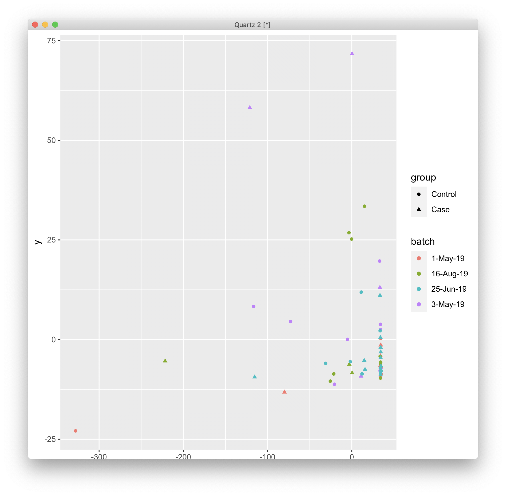

That's the same issue I was having with the DTU analysis before... the
distribution is quite weird. Let's not remove anything and see what we get:

```r
set.seed(42)
pca <- prcomp(t(trans_quant), scale=TRUE)
library(nFactors)
eigs <- pca$sdev^2
nS = nScree(x=eigs)
keep_me = 1:nS$Components$nkaiser

std_dev <- pca$sdev
pr_var <- std_dev^2
prop_varex <- pr_var/sum(pr_var)
plot(prop_varex, xlab = "Principal Component",
             ylab = "Proportion of Variance Explained",
             type = "b")
```

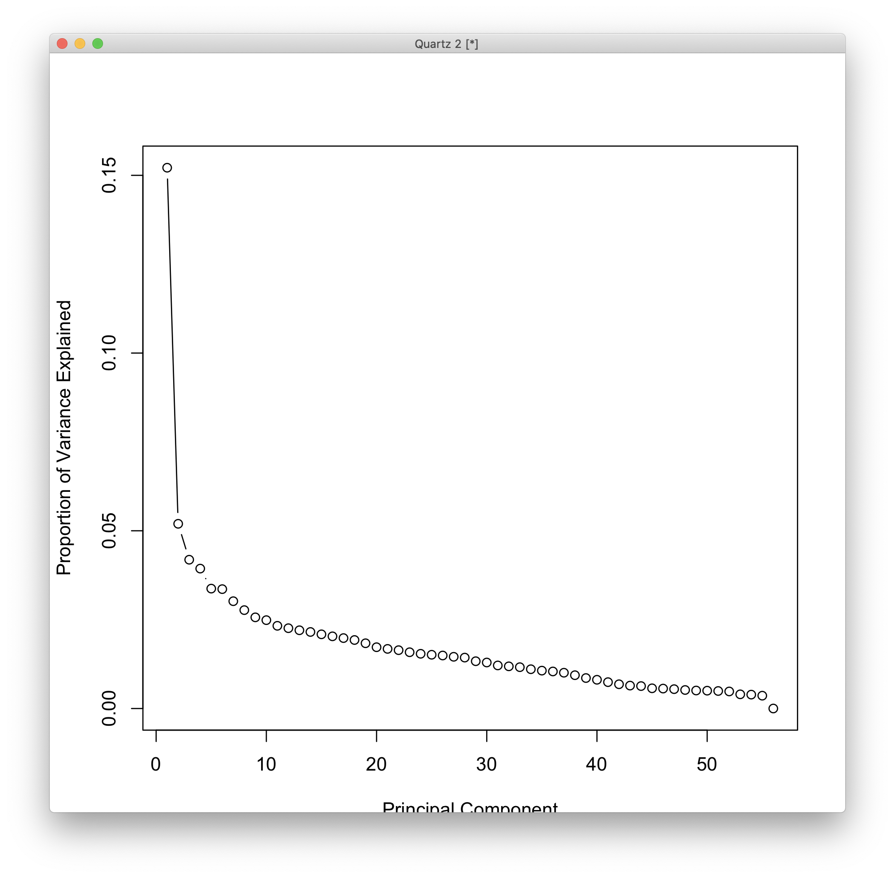

Kaiser selects 19 this time.

```r
mydata = data.frame(pca$x[, keep_me])
num_vars = c('pcnt_optical_duplicates', 'clusters', 'Age', 'RINe', 'PMI',
             'C1', 'C2', 'C3', 'C4', 'C5', 'C6', 'C7', 'C8', 'C9', 'C10')
pc_vars = colnames(mydata)
num_corrs = matrix(nrow=length(num_vars), ncol=length(pc_vars),
                   dimnames=list(num_vars, pc_vars))
num_pvals = num_corrs
for (x in num_vars) {
    for (y in pc_vars) {
        res = cor.test(meta[, x], mydata[, y])
        num_corrs[x, y] = res$estimate
        num_pvals[x, y] = res$p.value
    }
}

categ_vars = c('batch', 'Diagnosis', 'MoD', 'substance_group',
               'comorbid_group', 'POP_CODE', 'Sex')
categ_corrs = matrix(nrow=length(categ_vars), ncol=length(pc_vars),
                   dimnames=list(categ_vars, pc_vars))
categ_pvals = categ_corrs
for (x in categ_vars) {
    for (y in pc_vars) {
        res = kruskal.test(mydata[, y], meta[, x])
        categ_corrs[x, y] = res$statistic
        categ_pvals[x, y] = res$p.value
    }
}
```

```
r$> which(num_pvals < .01, arr.ind = T)           
                        row col
clusters                  2   1
RINe                      4   1
PMI                       5   1
pcnt_optical_duplicates   1   3
RINe                      4   4
PMI                       5   4
C10                      15   4
PMI                       5  14
C2                        7  14
C4                        9  14
C9                       14  15

r$> which(categ_pvals < .01, arr.ind = T)          
               row col
batch            1   1
batch            1   2
comorbid_group   5   2
batch            1   3
Diagnosis        2  14
batch            1  15
```

Let's remove PCs 1, 2, 3, 6, 8, 9, 11, 13, 14, 16, and 18.

```r
library(vows)
form = (~ meta$Diagnosis + mydata$PC1 + mydata$PC2 + mydata$PC3 + mydata$PC6
        + mydata$PC8 + mydata$PC9 + mydata$PC11 + mydata$PC13 + mydata$PC14
        + mydata$PC16 + mydata$PC18)
res = summary(lm.mp(t(trans_quant), form))
junk = data.frame(P.Value=res$pvalue['meta$DiagnosisCase',],
                  t=res$tstat['meta$DiagnosisCase',],
                  adj.P.Val=p.adjust(res$pvalue['meta$DiagnosisCase',],
                                     method='fdr'))
res_dx = merge(junk, meta_iso, by.x=0, by.y='id1')
res_dx = res_dx[order(res_dx$P.Value), ]
```

And do the same for PRS:

```r
fname = '~/data/post_mortem/genotyping/1KG/merged_PM_1KG_PRS_12032020.csv'
prs = read.csv(fname)
prs$hbcc_brain_id = sapply(prs$IID,
                          function(x) {
                              br = strsplit(x, '_')[[1]][2];
                              as.numeric(gsub(br, pattern='BR',
                                              replacement=''))})
imWNH = data$C1 > 0 & data$C2 < -.075
wnh_brains = data[which(imWNH),]$hbcc_brain_id

# using the most appropriate PRS
m = merge(meta, prs, by='hbcc_brain_id')
prs_names = sapply(c(.0001, .001, .01, .1, .00005, .0005, .005, .05,
                      .5, .4, .3, .2),
                   function(x) sprintf('PRS%f', x))
m[, prs_names] = NA
keep_me = m$hbcc_brain_id %in% wnh_brains
m[keep_me, prs_names] = m[keep_me, 64:75]
m[!keep_me, prs_names] = m[!keep_me, 52:63]
data_app = m[, c(1:50, 76:87)]
data_app = data_app[order(data_app$submitted_name),]

library(GeneOverlap)

# first sample doesn't have prs
trans_quant2 = trans_quant[, 2:ncol(trans_quant)]
mydata2 = mydata[2:nrow(mydata), ]

prs_names = sapply(c(.0001, .001, .01, .1, .00005, .0005, .005, .05,
                      .5, .4, .3, .2),
                   function(x) sprintf('PRS%f', x))
all_res = c()
for (p in prs_names) {
    cat(p, '\n')
    p_str = sprintf('data_app$%s', p)
    form = as.formula(sprintf('~ %s + mydata2$PC1 + mydata2$PC2 + mydata2$PC3 +
                               mydata2$PC6 + mydata2$PC8 + mydata2$PC9 +
                               mydata2$PC11 + mydata2$PC13 + mydata2$PC14 +
                               mydata2$PC16 + mydata2$PC18', p_str))
    res = summary(lm.mp(t(trans_quant2), form))
    junk = data.frame(P.Value=res$pvalue[p_str,], t=res$tstat[p_str,],
                      adj.P.Val=p.adjust(res$pvalue[p_str,], method='fdr'))
    res_prs = merge(junk, meta_iso, by.x=0, by.y='id1')
    res_prs = res_prs[order(res_prs$P.Value), ]
    for (t in c(.05, .01, .005, .001)) {
        prs_genes = res_prs[res_prs$P.Value < t, 'hgnc_symbol']
        dx_genes = res_dx[res_dx$P.Value < t, 'hgnc_symbol']
        go.obj <- newGeneOverlap(prs_genes, dx_genes, genome.size=nrow(res_prs))
        go.obj <- testGeneOverlap(go.obj)
        inter = intersect(prs_genes, dx_genes)
        pval = getPval(go.obj)
        this_res = c(p, t, length(prs_genes), length(dx_genes), length(inter),
                     pval)
        all_res = rbind(all_res, this_res)
    }
}
colnames(all_res) = c('PRS', 'nomPvalThresh', 'PRsgenes', 'PMgenes',
                      'overlap', 'pval')
write.csv(all_res,
          file='~/data/isoforms/DTUautoOnly_acc_prs_overlap_results.csv',
          row.names=F)
```

And finally, the same DTU analysis for Caudate:

```r
myregion = 'Caudate'
idx = samples$Region==myregion
meta = samples[idx, ]
data = data_pct[, idx]

# remove some bad variables
library(caret)
# remove markers with at least one NA or Inf... introduced in the percentage calculation
data = data[rowSums(is.na(data)) == 0, ]
data = data[rowSums(data == Inf) == 0, ]
set.seed(42)
pp_order = c('zv', 'nzv')
pp = preProcess(t(data), method = pp_order)
X = predict(pp, t(data))
trans_quant = t(X)
```

I won't do the MDS plot this time as those plots for DTU have been a bit inconclusive.

```r
set.seed(42)
pca <- prcomp(t(trans_quant), scale=TRUE)
library(nFactors)
eigs <- pca$sdev^2
nS = nScree(x=eigs)
keep_me = 1:nS$Components$nkaiser

mydata = data.frame(pca$x[, keep_me])
num_vars = c('pcnt_optical_duplicates', 'clusters', 'Age', 'RINe', 'PMI',
             'C1', 'C2', 'C3', 'C4', 'C5', 'C6', 'C7', 'C8', 'C9', 'C10')
pc_vars = colnames(mydata)
num_corrs = matrix(nrow=length(num_vars), ncol=length(pc_vars),
                   dimnames=list(num_vars, pc_vars))
num_pvals = num_corrs
for (x in num_vars) {
    for (y in pc_vars) {
        res = cor.test(meta[, x], mydata[, y])
        num_corrs[x, y] = res$estimate
        num_pvals[x, y] = res$p.value
    }
}

categ_vars = c('batch', 'Diagnosis', 'MoD', 'substance_group',
               'comorbid_group', 'POP_CODE', 'Sex')
categ_corrs = matrix(nrow=length(categ_vars), ncol=length(pc_vars),
                   dimnames=list(categ_vars, pc_vars))
categ_pvals = categ_corrs
for (x in categ_vars) {
    for (y in pc_vars) {
        res = kruskal.test(mydata[, y], meta[, x])
        categ_corrs[x, y] = res$statistic
        categ_pvals[x, y] = res$p.value
    }
}
```

```
r$> which(num_pvals < .01, arr.ind = T)              
         row col
clusters   2   1
RINe       4   1
PMI        5   1
RINe       4   5
PMI        5   6
C10       15   6
C1         6  17
C2         7  17

r$> which(categ_pvals < .01, arr.ind = T)       
                row col
batch             1   1
batch             1   2
batch             1   3
comorbid_group    5   3
batch             1   4
batch             1   7
substance_group   4   9
substance_group   4  11
batch             1  13
MoD               3  14
```

Let's remove PCs 1, 2, 3, 4, 5, 6, 7, 9, 11, 13, 14, and 17.

```r
library(vows)
form = (~ meta$Diagnosis + mydata$PC1 + mydata$PC2 + mydata$PC3 + mydata$PC4
        + mydata$PC5 + mydata$PC6 + mydata$PC7 + mydata$PC9 + mydata$PC11
        + mydata$PC13 + mydata$PC14 + mydata$PC17)
res = summary(lm.mp(t(trans_quant), form))
junk = data.frame(P.Value=res$pvalue['meta$DiagnosisCase',],
                  t=res$tstat['meta$DiagnosisCase',],
                  adj.P.Val=p.adjust(res$pvalue['meta$DiagnosisCase',],
                                     method='fdr'))
res_dx = merge(junk, meta_iso, by.x=0, by.y='id1')
res_dx = res_dx[order(res_dx$P.Value), ]
```

And do the same for PRS:

```r
fname = '~/data/post_mortem/genotyping/1KG/merged_PM_1KG_PRS_12032020.csv'
prs = read.csv(fname)
prs$hbcc_brain_id = sapply(prs$IID,
                          function(x) {
                              br = strsplit(x, '_')[[1]][2];
                              as.numeric(gsub(br, pattern='BR',
                                              replacement=''))})
imWNH = data$C1 > 0 & data$C2 < -.075
wnh_brains = data[which(imWNH),]$hbcc_brain_id

# using the most appropriate PRS
m = merge(meta, prs, by='hbcc_brain_id')
prs_names = sapply(c(.0001, .001, .01, .1, .00005, .0005, .005, .05,
                      .5, .4, .3, .2),
                   function(x) sprintf('PRS%f', x))
m[, prs_names] = NA
keep_me = m$hbcc_brain_id %in% wnh_brains
m[keep_me, prs_names] = m[keep_me, 64:75]
m[!keep_me, prs_names] = m[!keep_me, 52:63]
data_app = m[, c(1:50, 76:87)]
data_app = data_app[order(data_app$submitted_name),]

library(GeneOverlap)

# first sample doesn't have prs
trans_quant2 = trans_quant[, 2:ncol(trans_quant)]
mydata2 = mydata[2:nrow(mydata), ]

prs_names = sapply(c(.0001, .001, .01, .1, .00005, .0005, .005, .05,
                      .5, .4, .3, .2),
                   function(x) sprintf('PRS%f', x))
all_res = c()
for (p in prs_names) {
    cat(p, '\n')
    p_str = sprintf('data_app$%s', p)
    form = as.formula(sprintf('~ %s + mydata2$PC1 + mydata2$PC2 + mydata2$PC3 +
                               mydata2$PC4 + mydata2$PC5 + mydata2$PC6 +
                               mydata2$PC7 + mydata2$PC9 + mydata2$PC11 +
                               mydata2$PC13 + mydata2$PC14 + mydata2$PC17',
                               p_str))
    res = summary(lm.mp(t(trans_quant2), form))
    junk = data.frame(P.Value=res$pvalue[p_str,], t=res$tstat[p_str,],
                      adj.P.Val=p.adjust(res$pvalue[p_str,], method='fdr'))
    res_prs = merge(junk, meta_iso, by.x=0, by.y='id1')
    res_prs = res_prs[order(res_prs$P.Value), ]
    for (t in c(.05, .01, .005, .001)) {
        prs_genes = res_prs[res_prs$P.Value < t, 'hgnc_symbol']
        dx_genes = res_dx[res_dx$P.Value < t, 'hgnc_symbol']
        go.obj <- newGeneOverlap(prs_genes, dx_genes, genome.size=nrow(res_prs))
        go.obj <- testGeneOverlap(go.obj)
        inter = intersect(prs_genes, dx_genes)
        pval = getPval(go.obj)
        this_res = c(p, t, length(prs_genes), length(dx_genes), length(inter),
                     pval)
        all_res = rbind(all_res, this_res)
    }
}
colnames(all_res) = c('PRS', 'nomPvalThresh', 'PRsgenes', 'PMgenes',
                      'overlap', 'pval')
write.csv(all_res,
          file='~/data/isoforms/DTUautoOnly_caudate_prs_overlap_results.csv',
          row.names=F)
```


# TODO
 * redo DGE analysis using annotations and slicing from isoform data
 * how about a local differential splicing analysis like the one in the paper?
 * try all the analysis I ran in this note, but using the more specific
   pipelines for DTE and DTU


# Good resources
 * DTE: https://mikelove.github.io/counts-model/index.html
 * https://www.longdom.org/open-access/bioinformatics-tools-for-rnaseq-gene-and-isoform-quantification-2469-9853-1000140.pdf
 * DTE: https://ycl6.gitbook.io/guide-to-rna-seq-analysis/differential-expression-analysis/differential-transcript-expression/dte-analysis-with-salmon-input
 * http://bioconductor.org/packages/release/bioc/vignettes/IHW/inst/doc/introduction_to_ihw.html
 * DTU: http://bioconductor.org/packages/release/workflows/vignettes/rnaseqDTU/inst/doc/rnaseqDTU.html
 * DTE: https://angus.readthedocs.io/en/2019/diff-ex-and-viz.html