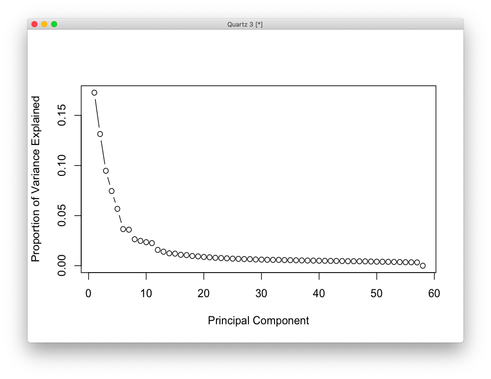

# 2020-12-07 16:49:00

Let's try a similar approach for isoforms, similar to what what did for the gene
expression analysis.

```r
df = read.delim('~/data/isoforms/Downloads/OneDrive_1_12-1-2020//shaw_adhd.rsem_output.tpm.tsv')
a = lapply(df[,1], function(x) strsplit(x, split='\\|'))
meta_iso = t(data.frame(a))
colnames(meta_iso) = c('id1', 'ensembleID', 'id2', 'id3', 'iso_name', 'hgnb_symbol','id4', 'read_type')
data_iso = df[, 2:ncol(df)] 

# let's add some sample data
df = read.csv('~/data/rnaseq_derek/UPDATED_file_for_derek_add_cause_of_death.csv')
df = df[!duplicated(df$submitted_name),]
sn = gsub(x=rownames(data), pattern='X', replacement='')
pop_code = read.csv('~/data/rnaseq_derek/file_pop.csv')
m = merge(df, pop_code, by='hbcc_brain_id')
pcs = read.table('~/data/rnaseq_derek/HM3_b37mds.mds', header=1)
myids = sapply(1:nrow(pcs), function(x) as.numeric(gsub('BR', '',
                                                        strsplit(as.character(pcs[x,'IID']), '_')[[1]][1])))
pcs$numids = myids
data = merge(m, pcs, by.x='hbcc_brain_id', by.y='numids', all.x=T, all.y=F)
data$POP_CODE = as.character(data$POP_CODE)
data[data$POP_CODE=='WNH', 'POP_CODE'] = 'W'
data[data$POP_CODE=='WH', 'POP_CODE'] = 'W'
data$POP_CODE = factor(data$POP_CODE)
data$Individual = factor(data$hbcc_brain_id)
data[data$Manner.of.Death=='Suicide (probable)', 'Manner.of.Death'] = 'Suicide'
data[data$Manner.of.Death=='unknown', 'Manner.of.Death'] = 'natural'
data$MoD = factor(data$Manner.of.Death)
data$batch = factor(data$run_date)
data$Diagnosis = factor(data$Diagnosis, levels=c('Control', 'Case'))
samples = data

# align data and samples without merging them
samples = samples[order(samples$submitted_name),]
sn = gsub(x=colnames(data_iso), pattern='X', replacement='')
colnames(data_iso) = sn
data_iso = data_iso[, order(colnames(data_iso))]
```

Let's make sure we don't have any obvious outliers and run some basic analysis,
following the PCA extraction model we used before.

```r
myregion = 'ACC'

idx = samples$Region==myregion
meta = samples[idx, ]
data = data_iso[, idx]

library(edgeR)
library(ggplot2)
mds = plotMDS(data, plot=F)
plot_data = data.frame(x=mds$x, y=mds$y,
                       batch=meta$batch,
                       group=meta$Diagnosis)
quartz()
ggplot(plot_data, aes(x=x, y=y, shape=group, color=batch)) + geom_point()
```


We have a clear batch effect, but I don't think there are any clear outliers. We
could potentiall remove the one sample in the top right, but I don't think it's
necessary.

Let's then set up our usual PCA analysis:


```r
set.seed(42)
lcpm.pca <- prcomp(t(lcpm), scale=TRUE)
library(nFactors)
eigs <- lcpm.pca$sdev^2
nS = nScree(x=eigs)
keep_me = 1:nS$Components$nkaiser
mydata = data.frame(lcpm.pca$x[, keep_me])

std_dev <- lcpm.pca$sdev
pr_var <- std_dev^2
prop_varex <- pr_var/sum(pr_var)
plot(prop_varex, xlab = "Principal Component",
             ylab = "Proportion of Variance Explained",
             type = "b")
```



Kaiser selects 11 as well, which makes sense in the variance explained plot too.

```r
num_vars = c('pcnt_optical_duplicates', 'clusters', 'Age', 'RINe', 'PMI',
             'C1', 'C2', 'C3', 'C4', 'C5', 'C6', 'C7', 'C8', 'C9', 'C10')
pc_vars = colnames(mydata)
num_corrs = matrix(nrow=length(num_vars), ncol=length(pc_vars),
                   dimnames=list(num_vars, pc_vars))
num_pvals = num_corrs
for (x in num_vars) {
    for (y in pc_vars) {
        res = cor.test(data[, x], mydata[, y])
        num_corrs[x, y] = res$estimate
        num_pvals[x, y] = res$p.value
    }
}

library(corrplot)
corrplot(t(num_corrs), method='color', tl.cex=.5, cl.cex=.5)
```


```r
categ_vars = c('batch', 'Diagnosis', 'MoD', 'substance_group',
               'comorbid_group', 'POP_CODE', 'Sex')
categ_corrs = matrix(nrow=length(categ_vars), ncol=length(pc_vars),
                   dimnames=list(categ_vars, pc_vars))
categ_pvals = categ_corrs
for (x in categ_vars) {
    for (y in pc_vars) {
        res = kruskal.test(mydata[, y], data[, x])
        categ_corrs[x, y] = res$statistic
        categ_pvals[x, y] = res$p.value
    }
}
corrplot(t(categ_corrs), method='color', tl.cex=.5, cl.cex=.5, is.corr=F)
```


```
r$> which(num_pvals < .01, arr.ind = T)                               
                        row col
RINe                      4   1
pcnt_optical_duplicates   1   3
clusters                  2   6
Age                       3   6
PMI                       5   6
Age                       3   8

r$> which(categ_pvals < .01, arr.ind = T)                             
      row col
batch   1   1
batch   1   3
batch   1   5
batch   1   6
MoD     3   8
```


# TODO
 * do the FDR results change if we slice it first?
 * redo DGE analysis using annotations and slicing from isoform data