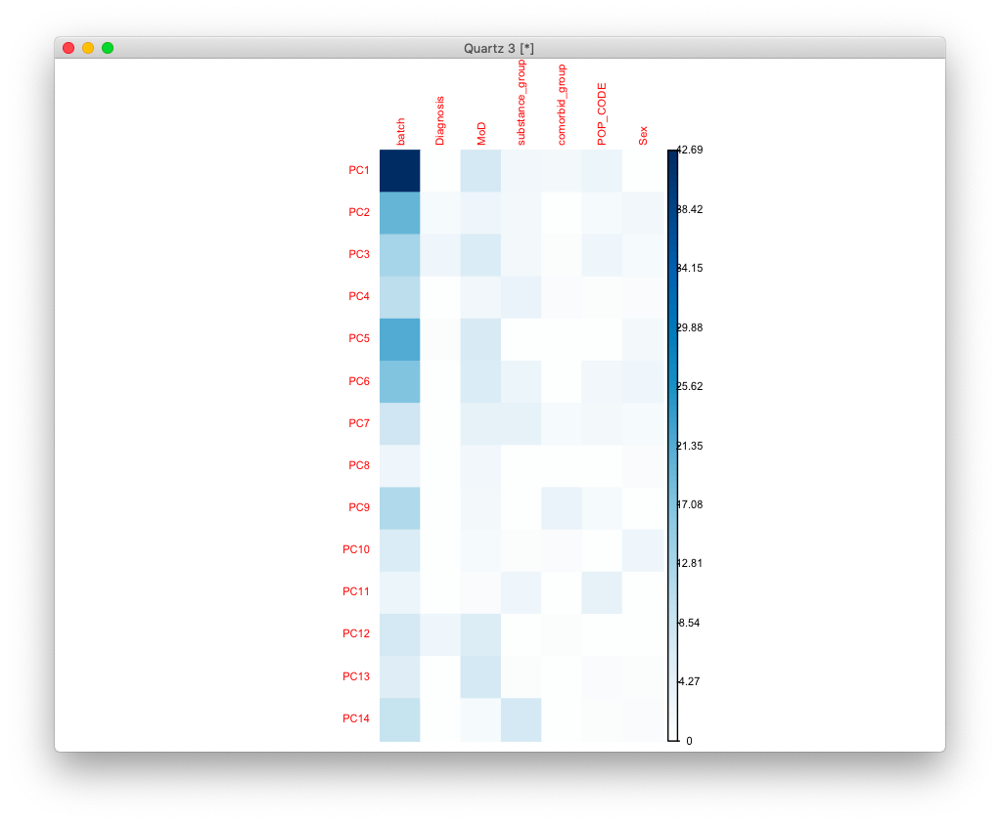

# 2020-12-07 16:49:00

Let's try a similar approach for isoforms, similar to what what did for the gene
expression analysis.

```r
df = read.delim('~/data/isoforms/shaw_adhd.rsem_output.tpm.tsv')
a = lapply(df[,1], function(x) strsplit(as.character(x), split="\\|"))
meta_iso = t(data.frame(a))
colnames(meta_iso) = c('id1', 'ensembleID', 'id2', 'id3', 'iso_name',
                        'hgnb_symbol','id4', 'read_type')
data_iso = df[, 2:ncol(df)] 

# let's add some sample data
fname = '~/data/rnaseq_derek/UPDATED_file_for_derek_add_cause_of_death.csv'
df = read.csv(fname)
df = df[!duplicated(df$submitted_name),]
sn = gsub(x=rownames(data), pattern='X', replacement='')
pop_code = read.csv('~/data/rnaseq_derek/file_pop.csv')
m = merge(df, pop_code, by='hbcc_brain_id')
pcs = read.table('~/data/rnaseq_derek/HM3_b37mds.mds', header=1)
myids = sapply(1:nrow(pcs),
               function(x) as.numeric(gsub('BR', '',
                                           strsplit(as.character(pcs[x,'IID']),
                                                    '_')[[1]][1])))
pcs$numids = myids
data = merge(m, pcs, by.x='hbcc_brain_id', by.y='numids', all.x=T, all.y=F)
data$POP_CODE = as.character(data$POP_CODE)
data[data$POP_CODE=='WNH', 'POP_CODE'] = 'W'
data[data$POP_CODE=='WH', 'POP_CODE'] = 'W'
data$POP_CODE = factor(data$POP_CODE)
data$Individual = factor(data$hbcc_brain_id)
data[data$Manner.of.Death=='Suicide (probable)', 'Manner.of.Death'] = 'Suicide'
data[data$Manner.of.Death=='unknown', 'Manner.of.Death'] = 'natural'
data$MoD = factor(data$Manner.of.Death)
data$batch = factor(data$run_date)
data$Diagnosis = factor(data$Diagnosis, levels=c('Control', 'Case'))

more = readRDS('~/data/rnaseq_derek/data_from_philip_POP_and_PCs.rds')
more = more[!duplicated(more$hbcc_brain_id),]
data = merge(data, more[, c('hbcc_brain_id', 'comorbid', 'comorbid_group',
                            'substance', 'substance_group')],
             by='hbcc_brain_id', all.x=T, all.y=F)

samples = data

# align data and samples without merging them
samples = samples[order(samples$submitted_name),]
sn = gsub(x=colnames(data_iso), pattern='X', replacement='')
colnames(data_iso) = sn
data_iso = data_iso[, order(colnames(data_iso))]
```

Let's make sure we don't have any obvious outliers and run some basic analysis,
following the PCA extraction model we used before.

```r
myregion = 'ACC'

idx = samples$Region==myregion
meta = samples[idx, ]
data = data_iso[, idx]
rownames(data) = meta_iso[,'id1']

library(edgeR)
library(ggplot2)
mds = plotMDS(data, plot=F)
plot_data = data.frame(x=mds$x, y=mds$y,
                       batch=meta$batch,
                       group=meta$Diagnosis)
quartz()
ggplot(plot_data, aes(x=x, y=y, shape=group, color=batch)) + geom_point()
```


We have a clear batch effect, but I don't think there are any clear outliers. We
could potentiall remove the one sample in the top right, but I don't think it's
necessary.

Let's then set up our usual PCA analysis:

```r
# remove some bad variables
library(caret)
pp_order = c('zv', 'nzv')
pp = preProcess(t(data), method = pp_order)
X = predict(pp, t(data))
trans_quant = t(X)

set.seed(42)
pca <- prcomp(t(trans_quant), scale=TRUE)
library(nFactors)
eigs <- pca$sdev^2
nS = nScree(x=eigs)
keep_me = 1:nS$Components$nkaiser

std_dev <- pca$sdev
pr_var <- std_dev^2
prop_varex <- pr_var/sum(pr_var)
plot(prop_varex, xlab = "Principal Component",
             ylab = "Proportion of Variance Explained",
             type = "b")
```


Kaiser selects 14 as well, which is a bit high based on the plot but not too
extreme.

```r
mydata = data.frame(pca$x[, keep_me])
num_vars = c('pcnt_optical_duplicates', 'clusters', 'Age', 'RINe', 'PMI',
             'C1', 'C2', 'C3', 'C4', 'C5', 'C6', 'C7', 'C8', 'C9', 'C10')
pc_vars = colnames(mydata)
num_corrs = matrix(nrow=length(num_vars), ncol=length(pc_vars),
                   dimnames=list(num_vars, pc_vars))
num_pvals = num_corrs
for (x in num_vars) {
    for (y in pc_vars) {
        res = cor.test(meta[, x], mydata[, y])
        num_corrs[x, y] = res$estimate
        num_pvals[x, y] = res$p.value
    }
}

library(corrplot)
corrplot(t(num_corrs), method='color', tl.cex=.5, cl.cex=.5)
```


```r
categ_vars = c('batch', 'Diagnosis', 'MoD', 'substance_group',
               'comorbid_group', 'POP_CODE', 'Sex')
categ_corrs = matrix(nrow=length(categ_vars), ncol=length(pc_vars),
                   dimnames=list(categ_vars, pc_vars))
categ_pvals = categ_corrs
for (x in categ_vars) {
    for (y in pc_vars) {
        res = kruskal.test(mydata[, y], meta[, x])
        categ_corrs[x, y] = res$statistic
        categ_pvals[x, y] = res$p.value
    }
}
corrplot(t(categ_corrs), method='color', tl.cex=.5, cl.cex=.5, is.corr=F)
```



```
r$> which(num_pvals < .01, arr.ind = T)                               
                        row col
clusters                  2   1
PMI                       5   1
pcnt_optical_duplicates   1   2
C6                       11   3
RINe                      4  12

r$> which(categ_pvals < .01, arr.ind = T)                             
      row col
batch   1   1
batch   1   2
batch   1   3
batch   1   5
batch   1   6
batch   1   9

r$> min(categ_pvals['Diagnosis',]                                                 
[1] 0.08803465
```

OK, so let's remove PCs 1, 2, 3, 5, 6, 9, and 12.

```r
data2 = DGEList(trans_quant,
                genes=meta_iso[meta_iso[, 'id1'] %in% rownames(trans_quant),],
                samples=cbind(meta, mydata))
form = ~ Diagnosis + PC1 + PC2 + PC3 + PC5 + PC6 + PC9 + PC12
design = model.matrix( form, t(data2))
fit <- lmFit(t(data2), design)
fit <- eBayes(fit)
iso_res = topTable(fit, coef='Diagnosis', number=Inf)
```

This last bit is not working. Why not follow a more standard pipeline, like
this:

http://www.bioconductor.org/packages/devel/workflows/vignettes/rnaseqDTU/inst/doc/rnaseqDTU.html

Will try later. For now, I can also just parallelize lm?

```r
library(vows)
form = (~ meta$Diagnosis + mydata$PC1 + mydata$PC2 + mydata$PC3 + mydata$PC5
        + mydata$PC6 + mydata$PC9 + mydata$PC12)
res = summary(lm.mp(t(trans_quant), form))
pvals = res$pvalue['meta$DiagnosisCase',]
```

So, this would be the exact same thing we did for our previous DGE analysis,
except that now I'm using the raw TPM data I got from David. Not sur eif that's
Kosher, but that's what they did in the Science paper. It might be nice to try
some of the more standardized pipelines I outlined below, which take into
consideration uncertainties and multiple isoforms for the same gene. Also, I
still need to run DTU, but that's simply a rescaling of the DTE data, if using
the same pipeline from the Science paper.

Note that I cannot just use David's results here because I don't have the
p-values for his method using PRS as the predictor.


# TODO
 * DTU
 * gene enrichment with DTE
 * PRS overlap
 * do the DTE FDR results change if we slice it first?
 * redo DGE analysis using annotations and slicing from isoform data
 * how about a local differential splicing analysis like the one in the paper?


# Good resources
 * DTE: https://mikelove.github.io/counts-model/index.html
 * https://www.longdom.org/open-access/bioinformatics-tools-for-rnaseq-gene-and-isoform-quantification-2469-9853-1000140.pdf
 * DTE: https://ycl6.gitbook.io/guide-to-rna-seq-analysis/differential-expression-analysis/differential-transcript-expression/dte-analysis-with-salmon-input
 * http://bioconductor.org/packages/release/bioc/vignettes/IHW/inst/doc/introduction_to_ihw.html
 * DTU: http://bioconductor.org/packages/release/workflows/vignettes/rnaseqDTU/inst/doc/rnaseqDTU.html
 * DTE: https://angus.readthedocs.io/en/2019/diff-ex-and-viz.html